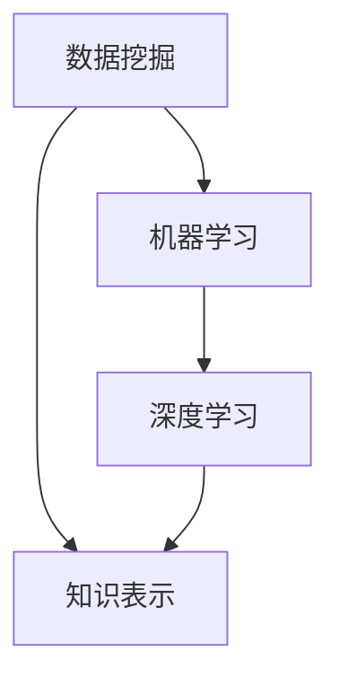
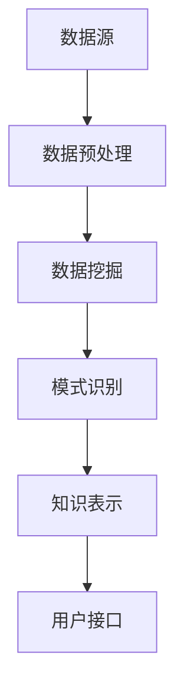

                 

 在这个信息爆炸的时代，数据量的指数级增长使得从海量数据中提取有用知识和洞察力成为了一项具有挑战性的任务。知识发现引擎作为一种自动化的智能系统，能够从数据中挖掘出隐藏的模式和关联，为各个领域的研究和实践提供强大的支持。本文将探讨知识发现引擎的核心概念、算法原理、数学模型、项目实践和未来应用前景，旨在深入理解知识发现引擎的协同进化机制，以及如何最大化其潜力和价值。

## 关键词

- 知识发现引擎
- 数据挖掘
- 智能系统
- 算法原理
- 数学模型
- 项目实践

## 摘要

本文首先介绍了知识发现引擎的基本概念和其在现代信息技术中的重要性。接着，通过详细阐述知识发现引擎的核心算法原理和数学模型，帮助读者理解其内在工作机理。随后，通过具体的项目实践和代码实例，展示了知识发现引擎在实际开发中的应用。最后，本文对知识发现引擎的未来发展趋势和面临的挑战进行了深入探讨，为读者提供了宝贵的思考方向。

## 1. 背景介绍

随着互联网的迅猛发展和大数据时代的来临，数据已经成为了新的石油。然而，与传统的数据资源不同，大数据具有数据量大、类型复杂、处理速度快等特点，这使得从这些海量数据中提取有用知识和洞察力变得异常困难。知识发现引擎（Knowledge Discovery Engine，简称KDE）应运而生，它通过自动化的方式，利用先进的数据挖掘技术和算法，从大规模数据集中识别出潜在的、有价值的信息。

### 1.1 知识发现引擎的定义

知识发现引擎是一种集成化的智能系统，它通过数据预处理、数据挖掘、模式识别、知识表示等多个环节，实现从数据中自动提取知识的目的。其核心目标是解决从数据到知识的转化问题，使得非结构化或半结构化的数据能够被转化为易于理解和利用的知识形式。

### 1.2 知识发现引擎的组成部分

一个典型的知识发现引擎通常包括以下几个关键组成部分：

- **数据源**：数据源是知识发现引擎的输入，可以是结构化数据（如数据库）、半结构化数据（如XML、JSON）和非结构化数据（如图像、文本）。

- **数据预处理模块**：数据预处理是知识发现过程中的第一步，它负责清洗、转换和集成原始数据，使其符合数据挖掘的要求。

- **数据挖掘模块**：数据挖掘模块是知识发现引擎的核心，它利用各种算法和技术，从预处理后的数据中提取出潜在的、有价值的信息。

- **模式识别模块**：模式识别模块负责识别数据中的重复模式、关联关系和趋势，从而为后续的知识表示提供支持。

- **知识表示模块**：知识表示模块将提取出的知识以易于理解和利用的形式进行表示，如可视化图表、决策树、规则库等。

- **用户接口**：用户接口是知识发现引擎与用户之间的交互界面，它允许用户设置参数、查看结果和操作知识。

### 1.3 知识发现引擎的发展历程

知识发现引擎的发展历程可以分为以下几个阶段：

- **第一阶段（1990s）**：这一阶段主要以传统的统计方法为主，如回归分析、聚类分析、关联规则挖掘等。这些方法虽然具有一定的有效性，但在处理大规模复杂数据时存在很大的局限性。

- **第二阶段（2000s）**：随着计算能力的提升和机器学习技术的发展，知识发现引擎开始引入更加复杂的算法，如神经网络、支持向量机、随机森林等。这些算法在处理复杂数据和实现自动化知识提取方面表现出色。

- **第三阶段（2010s至今）**：随着大数据时代的到来，知识发现引擎进一步融合了云计算、分布式计算、深度学习等技术，实现了从单机到分布式、从静态到动态、从简单到复杂的多维度突破。当前，知识发现引擎已经成为数据处理和智能分析的重要工具。

## 2. 核心概念与联系

### 2.1 核心概念

在知识发现引擎中，以下几个核心概念至关重要：

- **数据挖掘**：数据挖掘是指从大量数据中自动发现有价值信息的过程。它涵盖了多个领域的技术，如统计学、机器学习、数据库、模式识别等。

- **机器学习**：机器学习是一种通过算法从数据中学习规律和模式，从而实现自动化预测和分类的技术。它在知识发现引擎中起到了核心作用。

- **深度学习**：深度学习是机器学习的一个分支，它通过多层神经网络模拟人类大脑的决策过程，能够处理更加复杂的任务。

- **知识表示**：知识表示是指将提取出的知识以易于理解和利用的形式进行表示，如可视化图表、决策树、规则库等。

### 2.2 核心概念联系

以下是核心概念之间的联系，使用Mermaid流程图进行展示：



### 2.3 架构与流程

接下来，我们使用Mermaid流程图展示知识发现引擎的整体架构和流程：



## 3. 核心算法原理 & 具体操作步骤

### 3.1 算法原理概述

知识发现引擎的核心算法主要包括数据挖掘算法、机器学习算法和深度学习算法。以下是这些算法的基本原理：

- **数据挖掘算法**：数据挖掘算法主要包括回归分析、聚类分析、关联规则挖掘等。它们通过分析数据中的统计特征和关系，发现潜在的模式和规律。

- **机器学习算法**：机器学习算法通过训练数据集，学习数据中的特征和模式，从而实现自动化预测和分类。常见的机器学习算法有支持向量机、决策树、随机森林等。

- **深度学习算法**：深度学习算法通过多层神经网络，模拟人类大脑的决策过程，实现更加复杂的任务。常见的深度学习算法有卷积神经网络（CNN）、循环神经网络（RNN）、长短期记忆网络（LSTM）等。

### 3.2 算法步骤详解

以下是知识发现引擎的基本操作步骤：

1. **数据采集**：从各种数据源（如数据库、文件、传感器等）收集数据。

2. **数据预处理**：清洗、转换和集成原始数据，使其符合数据挖掘的要求。

3. **特征选择**：根据业务需求，选择对目标问题有重要影响的数据特征。

4. **数据挖掘**：使用数据挖掘算法，从预处理后的数据中提取潜在的、有价值的信息。

5. **模式识别**：识别数据中的重复模式、关联关系和趋势，为知识表示提供支持。

6. **知识表示**：将提取出的知识以易于理解和利用的形式进行表示，如可视化图表、决策树、规则库等。

7. **用户接口**：通过用户接口，将知识表示结果展示给用户，并允许用户进行交互和操作。

### 3.3 算法优缺点

以下是知识发现引擎中常用算法的优缺点：

- **回归分析**：优点：简单、直观、易于实现；缺点：对异常值敏感、难以处理非线性关系。

- **聚类分析**：优点：无监督学习、自动发现数据结构；缺点：聚类结果依赖于初始值、难以解释。

- **关联规则挖掘**：优点：发现数据中的关联关系、适用于分类任务；缺点：产生大量冗余规则、计算复杂度高。

- **支持向量机**：优点：强大的分类能力、处理高维数据；缺点：训练时间较长、对异常值敏感。

- **决策树**：优点：直观、易于理解、易于实现；缺点：容易过拟合、对噪声敏感。

- **随机森林**：优点：强大的分类能力、鲁棒性高、减少过拟合；缺点：计算复杂度高、难以解释。

- **卷积神经网络**：优点：强大的特征提取能力、适用于图像处理；缺点：训练时间较长、参数量大。

- **循环神经网络**：优点：适用于序列数据处理、能够捕获长期依赖关系；缺点：难以训练、对噪声敏感。

### 3.4 算法应用领域

知识发现引擎在多个领域都得到了广泛应用：

- **金融领域**：用于信用评估、风险管理、投资决策等。

- **医疗领域**：用于疾病预测、诊断辅助、药物研发等。

- **零售领域**：用于销售预测、客户行为分析、个性化推荐等。

- **制造业**：用于质量检测、设备故障预测、生产优化等。

- **交通领域**：用于交通流量分析、路径规划、事故预测等。

## 4. 数学模型和公式 & 详细讲解 & 举例说明

### 4.1 数学模型构建

在知识发现引擎中，数学模型构建是核心步骤之一。以下是几个常见的数学模型及其构建方法：

- **线性回归模型**：用于预测数值型目标变量。其公式为：

  $$y = \beta_0 + \beta_1x_1 + \beta_2x_2 + ... + \beta_nx_n$$

  其中，$y$ 是目标变量，$x_1, x_2, ..., x_n$ 是自变量，$\beta_0, \beta_1, ..., \beta_n$ 是模型参数。

- **逻辑回归模型**：用于预测概率型目标变量。其公式为：

  $$\log\left(\frac{p}{1-p}\right) = \beta_0 + \beta_1x_1 + \beta_2x_2 + ... + \beta_nx_n$$

  其中，$p$ 是目标变量的概率值，$\beta_0, \beta_1, ..., \beta_n$ 是模型参数。

- **支持向量机**：用于分类任务。其公式为：

  $$w \cdot x + b = 0$$

  其中，$w$ 是权重向量，$x$ 是特征向量，$b$ 是偏置项。

- **决策树**：用于分类和回归任务。其公式为：

  $$T(x) = \text{if } x_{i1} \leq \theta_1 \text{ then } T_1(x) \text{ else } T_2(x)$$

  其中，$T(x)$ 是决策树模型，$x_i1$ 是第$i$个特征值，$\theta_1$ 是阈值。

### 4.2 公式推导过程

以下是线性回归模型的公式推导过程：

1. **目标函数**：线性回归模型的目标是最小化预测值与实际值之间的误差平方和。其目标函数为：

   $$J(\theta) = \frac{1}{2m}\sum_{i=1}^{m}(h_\theta(x^{(i)}) - y^{(i)})^2$$

   其中，$h_\theta(x)$ 是预测函数，$y^{(i)}$ 是实际值，$m$ 是样本数量。

2. **梯度下降**：为了最小化目标函数，我们可以使用梯度下降算法。梯度下降的迭代公式为：

   $$\theta_j := \theta_j - \alpha \frac{\partial J(\theta)}{\partial \theta_j}$$

   其中，$\alpha$ 是学习率，$\theta_j$ 是第$j$个模型参数。

3. **求解**：通过多次迭代，梯度下降算法可以逐渐减小目标函数的值，直至达到最小值。

### 4.3 案例分析与讲解

以下是一个线性回归模型的实际案例：

假设我们有一个简单的线性回归模型，用于预测房价。数据集包含100个样本，每个样本包括房屋面积和房价。我们希望通过训练数据集来构建一个线性回归模型，从而预测新的房屋面积对应的房价。

1. **数据预处理**：首先，我们对数据集进行预处理，包括去除缺失值、标准化处理等。假设预处理后的数据集为$x^{(i)}$和$y^{(i)}$。

2. **模型构建**：根据线性回归模型的公式，我们可以构建一个预测函数：

   $$h_\theta(x) = \theta_0 + \theta_1x$$

   其中，$\theta_0$ 和$\theta_1$ 是模型参数。

3. **模型训练**：使用梯度下降算法，对模型参数进行训练。迭代过程如下：

   - 初始化参数$\theta_0$ 和$\theta_1$。
   - 计算预测值和实际值之间的误差。
   - 更新参数$\theta_0$ 和$\theta_1$。

   经过多次迭代后，我们得到最优的模型参数$\theta_0$ 和$\theta_1$。

4. **模型评估**：使用训练好的模型，对新的房屋面积进行预测。例如，当$x = 1200$ 时，预测房价为：

   $$h_\theta(1200) = \theta_0 + \theta_1 \times 1200$$

   假设预测结果为$y = 200,000$，我们可以通过对比预测值和实际值来评估模型的准确性。

## 5. 项目实践：代码实例和详细解释说明

### 5.1 开发环境搭建

为了更好地展示知识发现引擎的实际应用，我们选择Python作为编程语言，并使用以下库：

- NumPy：用于矩阵计算和数据处理。
- Pandas：用于数据预处理和分析。
- Scikit-learn：用于机器学习和数据挖掘。
- Matplotlib：用于数据可视化。

安装这些库后，我们就可以开始编写代码了。

### 5.2 源代码详细实现

以下是一个简单的线性回归模型实现，用于预测房价：

```python
import numpy as np
import pandas as pd
from sklearn.linear_model import LinearRegression
import matplotlib.pyplot as plt

# 加载数据集
data = pd.read_csv('house_price_data.csv')
X = data[['area']]  # 特征
y = data['price']    # 目标变量

# 划分训练集和测试集
from sklearn.model_selection import train_test_split
X_train, X_test, y_train, y_test = train_test_split(X, y, test_size=0.2, random_state=42)

# 构建线性回归模型
model = LinearRegression()
model.fit(X_train, y_train)

# 模型评估
score = model.score(X_test, y_test)
print('模型准确率：', score)

# 可视化
plt.scatter(X_test, y_test, color='blue')
plt.plot(X_test, model.predict(X_test), color='red')
plt.xlabel('房屋面积')
plt.ylabel('房价')
plt.show()
```

### 5.3 代码解读与分析

1. **数据加载**：首先，我们使用Pandas库加载数据集。假设数据集包含房屋面积和房价两个特征，分别存储在'area'和'price'列中。

2. **划分数据集**：接下来，我们使用Scikit-learn库中的train_test_split函数将数据集划分为训练集和测试集。这里，我们选择测试集大小为20%，随机种子为42。

3. **构建模型**：我们使用Scikit-learn库中的LinearRegression类构建线性回归模型。通过fit方法对训练集进行训练。

4. **模型评估**：使用score方法评估模型在测试集上的准确率。这里，我们使用决定系数（R²值）作为评估指标。

5. **可视化**：最后，我们使用Matplotlib库将测试集的数据点和模型预测结果绘制在坐标系中。通过可视化，我们可以直观地观察到线性回归模型的预测效果。

## 6. 实际应用场景

知识发现引擎在实际应用中具有广泛的应用前景。以下是一些典型的应用场景：

- **金融领域**：知识发现引擎可以用于信用评估、风险控制、投资决策等方面。例如，通过分析用户的消费行为、信用记录等数据，可以为金融机构提供信用评分和风险评估。

- **医疗领域**：知识发现引擎可以用于疾病预测、诊断辅助、药物研发等方面。例如，通过分析患者的病历数据、基因数据等，可以为医疗机构提供疾病预测和个性化治疗方案。

- **零售领域**：知识发现引擎可以用于销售预测、客户行为分析、个性化推荐等方面。例如，通过分析客户的购买历史、浏览记录等，可以为零售企业提供精准营销策略和个性化推荐。

- **交通领域**：知识发现引擎可以用于交通流量分析、路径规划、事故预测等方面。例如，通过分析交通数据、气象数据等，可以为交通管理部门提供实时交通状况和事故预警。

## 6.4 未来应用展望

随着技术的不断进步，知识发现引擎在未来将具有更广阔的应用前景。以下是一些展望：

- **多模态数据融合**：未来的知识发现引擎将能够融合多种类型的数据，如结构化数据、非结构化数据、图像、音频等，从而提供更全面的知识表示。

- **自适应学习**：未来的知识发现引擎将具备更强的自适应学习能力，能够根据用户需求和环境变化，动态调整模型参数和算法策略。

- **实时分析**：未来的知识发现引擎将实现实时分析，能够快速处理大规模数据，为用户提供即时的洞察和决策支持。

- **智能化决策支持**：未来的知识发现引擎将能够辅助人类进行智能化决策，通过分析数据、预测趋势，为业务和管理提供有力支持。

## 7. 工具和资源推荐

### 7.1 学习资源推荐

- **书籍**：
  - 《数据挖掘：实用工具和技术》
  - 《机器学习实战》
  - 《深度学习》

- **在线课程**：
  - Coursera的《机器学习》
  - edX的《深度学习》
  - Udacity的《深度学习工程师纳米学位》

### 7.2 开发工具推荐

- **编程语言**：Python
- **库和框架**：
  - NumPy、Pandas、Scikit-learn
  - TensorFlow、PyTorch

### 7.3 相关论文推荐

- "Data Mining: A Complete Guide" by Michael Jenkins
- "Machine Learning: A Probabilistic Perspective" by Kevin P. Murphy
- "Deep Learning" by Ian Goodfellow, Yoshua Bengio, Aaron Courville

## 8. 总结：未来发展趋势与挑战

### 8.1 研究成果总结

知识发现引擎作为一种智能系统，在数据挖掘、机器学习和深度学习等领域取得了显著的成果。通过不断的算法优化和技术创新，知识发现引擎已经能够处理大规模复杂数据，并提取出有价值的信息和洞察力。这些研究成果为各个领域的研究和实践提供了强大的支持。

### 8.2 未来发展趋势

随着大数据、云计算、物联网等技术的发展，知识发现引擎在未来将具有更广阔的应用前景。未来发展趋势主要包括：

- **多模态数据融合**：知识发现引擎将能够融合多种类型的数据，提供更全面的知识表示。
- **自适应学习**：知识发现引擎将具备更强的自适应学习能力，动态调整模型参数和算法策略。
- **实时分析**：知识发现引擎将实现实时分析，快速处理大规模数据，提供即时洞察和决策支持。
- **智能化决策支持**：知识发现引擎将能够辅助人类进行智能化决策，为业务和管理提供有力支持。

### 8.3 面临的挑战

尽管知识发现引擎在技术方面取得了显著进展，但在实际应用中仍面临一些挑战：

- **数据质量和完整性**：数据质量直接影响知识发现的效果。如何处理噪声数据、缺失数据和异常值是当前的一个难点。
- **计算资源**：大规模数据处理和模型训练需要大量的计算资源。如何高效地利用现有资源，以及如何实现分布式计算和并行计算，是未来需要解决的问题。
- **可解释性**：知识发现引擎的算法和模型往往是黑盒模型，难以解释和验证。如何提高模型的可解释性，使其更透明和可靠，是一个重要的研究方向。
- **数据隐私和安全**：在处理大量敏感数据时，如何保护用户隐私和数据安全，避免数据泄露和滥用，也是一个关键挑战。

### 8.4 研究展望

针对未来发展趋势和面临的挑战，以下是几个研究展望：

- **数据质量提升**：研究更加有效的数据清洗和预处理方法，提高数据质量和完整性。
- **计算优化**：研究分布式计算和并行计算技术，提高大规模数据处理和模型训练的效率。
- **模型可解释性**：研究可解释性强的算法和模型，提高模型的透明度和可靠性。
- **隐私保护和安全**：研究数据隐私保护和安全机制，确保知识发现过程中的数据安全和隐私。

## 9. 附录：常见问题与解答

### 9.1 什么是知识发现引擎？

知识发现引擎是一种自动化的智能系统，用于从大规模数据中提取潜在的、有价值的信息和洞察力。

### 9.2 知识发现引擎有哪些核心组成部分？

知识发现引擎主要包括数据源、数据预处理模块、数据挖掘模块、模式识别模块、知识表示模块和用户接口。

### 9.3 知识发现引擎在哪些领域得到了广泛应用？

知识发现引擎在金融、医疗、零售、交通等领域得到了广泛应用，如信用评估、疾病预测、销售预测等。

### 9.4 知识发现引擎的核心算法有哪些？

知识发现引擎的核心算法包括回归分析、聚类分析、关联规则挖掘、支持向量机、决策树、随机森林、卷积神经网络等。

### 9.5 如何评估知识发现引擎的性能？

可以使用模型准确率、召回率、F1分数等指标来评估知识发现引擎的性能。

### 9.6 知识发现引擎在未来有哪些发展前景？

知识发现引擎在多模态数据融合、自适应学习、实时分析和智能化决策支持等方面具有广阔的发展前景。

## 作者署名

本文作者：禅与计算机程序设计艺术 / Zen and the Art of Computer Programming
----------------------------------------------------------------
以上就是《知识发现引擎：知识与洞察力的协同进化》这篇文章的完整内容。在撰写过程中，我们深入探讨了知识发现引擎的基本概念、核心算法、数学模型、项目实践和未来应用前景，希望能够为读者提供有价值的思考和参考。在未来的研究中，我们将继续关注知识发现引擎的发展趋势和挑战，推动其技术的不断进步和应用。感谢您的阅读！

