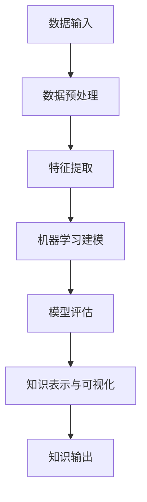

                 

关键词：知识发现、数据挖掘、人工智能、知识图谱、数据科学、机器学习、知识进化、智能系统

> 摘要：本文旨在探讨知识发现引擎在推动人类知识进化中的关键作用。通过深入分析知识发现引擎的核心概念、算法原理、数学模型及其应用实践，本文揭示了知识发现引擎如何赋能人类知识进化，为未来的智能系统提供新动力。

## 1. 背景介绍

在信息技术迅速发展的今天，数据已经成为新时代的石油，而知识发现引擎则成为挖掘数据宝藏的关键工具。知识发现（Knowledge Discovery in Databases，KDD）是指从大量数据中自动识别出有价值信息的过程，它涵盖了数据清洗、数据集成、数据选择、数据变换、数据建模、模型评估等多个环节。

知识发现引擎是知识发现过程的实现工具，其核心在于利用人工智能和机器学习技术，自动挖掘数据中的潜在模式和规律。知识发现引擎不仅能够提高数据处理的效率，还能够发现人类难以察觉的信息，从而推动人类知识进化和智能系统的创新。

本文将围绕知识发现引擎的核心概念、算法原理、数学模型、应用实践等方面展开深入探讨，以期为读者提供一个全面了解知识发现引擎的视角。

## 2. 核心概念与联系

### 2.1 知识发现引擎的定义

知识发现引擎是一种基于人工智能和机器学习技术的数据处理工具，它能够自动从大量数据中挖掘出有价值的信息和知识。知识发现引擎通常包含以下几个关键组件：

1. **数据预处理模块**：负责对原始数据进行清洗、集成和变换，以便为后续分析做好准备。
2. **特征提取模块**：从预处理后的数据中提取出对问题解决有帮助的特征，以便用于建模和分析。
3. **机器学习模块**：利用机器学习算法对提取出的特征进行建模，以发现数据中的潜在模式和规律。
4. **模型评估模块**：对生成的模型进行评估，以确定其准确性和有效性。
5. **知识表示与可视化模块**：将发现的模式和规律以人类可理解的形式进行表示和可视化，便于用户理解和应用。

### 2.2 知识发现引擎与相关技术的关系

知识发现引擎与数据挖掘、机器学习、知识图谱等技术密切相关。数据挖掘（Data Mining）是知识发现的核心环节，它利用统计、机器学习、数据库等技术从大量数据中提取有价值的信息。机器学习（Machine Learning）则是数据挖掘的核心技术，它通过训练模型，使计算机能够从数据中自动发现规律和模式。

知识图谱（Knowledge Graph）是一种用于表示实体及其之间关系的网络结构，它能够将分散的知识片段整合成一个有机的整体，为知识发现提供强大的支持。知识图谱与知识发现引擎相结合，可以更好地挖掘数据中的隐含关系，为人类知识进化提供有力支撑。

### 2.3 Mermaid 流程图

以下是一个知识发现引擎的基本流程图，展示了知识发现引擎从数据输入到知识输出的整个过程。



## 3. 核心算法原理 & 具体操作步骤

### 3.1 算法原理概述

知识发现引擎的核心算法通常包括以下几种：

1. **分类算法**：通过将数据分为不同的类别，帮助用户发现数据中的分类模式。
2. **聚类算法**：将相似的数据点归为一类，以发现数据中的聚类结构。
3. **关联规则挖掘算法**：通过发现数据中的频繁模式，揭示数据之间的关联关系。
4. **异常检测算法**：识别数据中的异常点，帮助用户发现潜在的问题或异常行为。

### 3.2 算法步骤详解

1. **数据预处理**：包括数据清洗、数据集成、数据变换等步骤，为后续分析做好准备。

2. **特征提取**：从预处理后的数据中提取出对问题解决有帮助的特征，以便用于建模和分析。

3. **机器学习建模**：利用机器学习算法对提取出的特征进行建模，以发现数据中的潜在模式和规律。

4. **模型评估**：对生成的模型进行评估，以确定其准确性和有效性。

5. **知识表示与可视化**：将发现的模式和规律以人类可理解的形式进行表示和可视化，便于用户理解和应用。

### 3.3 算法优缺点

1. **分类算法**：优点是能够快速将数据分为不同的类别，缺点是需要大量的标注数据，对噪声敏感。

2. **聚类算法**：优点是无需标注数据，能够自动发现数据的聚类结构，缺点是可能产生“噪声”聚类。

3. **关联规则挖掘算法**：优点是能够揭示数据之间的关联关系，缺点是挖掘出的规则可能过于复杂。

4. **异常检测算法**：优点是能够发现数据中的异常点，缺点是对异常点的定义和识别存在一定的挑战。

### 3.4 算法应用领域

知识发现引擎在各个领域都有广泛的应用，包括但不限于：

1. **金融行业**：通过关联规则挖掘算法，发现金融交易中的异常行为，帮助金融机构防范风险。
2. **医疗领域**：利用分类算法和聚类算法，分析患者病历数据，帮助医生进行诊断和治疗方案制定。
3. **电子商务**：通过用户行为数据，进行用户细分和个性化推荐，提高用户满意度和转化率。
4. **交通领域**：通过异常检测算法，识别交通流量中的异常点，优化交通管理和调度。

## 4. 数学模型和公式 & 详细讲解 & 举例说明

### 4.1 数学模型构建

知识发现引擎中的数学模型主要包括分类模型、聚类模型、关联规则模型和异常检测模型等。以下以分类模型为例，介绍其数学模型构建过程。

1. **假设**：给定一个训练数据集 \(D\)，其中每个样本表示为特征向量 \(x\)，目标值为标签 \(y\)。

2. **损失函数**：选择一个合适的损失函数，如交叉熵损失函数，用于衡量模型预测值和真实值之间的差距。

   \[ L(y, \hat{y}) = -\sum_{i=1}^{n} y_i \log(\hat{y}_i) \]

3. **优化目标**：最小化损失函数，找到最优模型参数 \( \theta \)。

   \[ \min_{\theta} \sum_{i=1}^{n} L(y_i, \hat{y}_i) \]

4. **梯度下降**：利用梯度下降算法，更新模型参数，直到达到最优解。

   \[ \theta = \theta - \alpha \nabla_{\theta} L(\theta) \]

### 4.2 公式推导过程

以线性回归模型为例，介绍其数学模型构建和公式推导过程。

1. **假设**：给定一个训练数据集 \(D\)，其中每个样本表示为特征向量 \(x\)，目标值为标签 \(y\)。

2. **损失函数**：选择均方误差（MSE）作为损失函数。

   \[ L(y, \hat{y}) = \frac{1}{2} \sum_{i=1}^{n} (y_i - \hat{y}_i)^2 \]

3. **模型参数**：设模型参数为 \( \theta = (\theta_0, \theta_1) \)。

4. **模型预测**：线性回归模型预测公式为 \( \hat{y} = \theta_0 + \theta_1 x \)。

5. **优化目标**：最小化损失函数。

   \[ \min_{\theta} \sum_{i=1}^{n} L(y_i, \hat{y}_i) \]

6. **梯度下降**：计算损失函数关于模型参数的梯度，并更新模型参数。

   \[ \nabla_{\theta} L(\theta) = \begin{bmatrix} \frac{\partial L}{\partial \theta_0} \\\ \frac{\partial L}{\partial \theta_1} \end{bmatrix} = \begin{bmatrix} -\sum_{i=1}^{n} (y_i - \hat{y}_i) \\\ -\sum_{i=1}^{n} (y_i - \hat{y}_i) x_i \end{bmatrix} \]

   \[ \theta = \theta - \alpha \nabla_{\theta} L(\theta) \]

### 4.3 案例分析与讲解

以一个简单的鸢尾花（Iris）数据集为例，展示线性回归模型的构建过程。

1. **数据集**：鸢尾花数据集包含3个类别，每个类别有50个样本，共150个样本。

2. **特征提取**：从鸢尾花数据集中提取4个特征：花萼长度、花萼宽度、花瓣长度、花瓣宽度。

3. **模型构建**：使用线性回归模型，预测花瓣长度。

   \[ \hat{y} = \theta_0 + \theta_1 x \]

4. **模型训练**：使用梯度下降算法，训练线性回归模型。

5. **模型评估**：计算模型预测值和真实值之间的差距，评估模型性能。

6. **模型优化**：根据评估结果，调整模型参数，优化模型性能。

## 5. 项目实践：代码实例和详细解释说明

### 5.1 开发环境搭建

1. **Python**：安装Python 3.8及以上版本。
2. **NumPy**：安装NumPy库。
3. **Scikit-learn**：安装Scikit-learn库。

### 5.2 源代码详细实现

```python
import numpy as np
from sklearn.linear_model import LinearRegression
from sklearn.model_selection import train_test_split
from sklearn.metrics import mean_squared_error

# 加载鸢尾花数据集
from sklearn.datasets import load_iris
iris = load_iris()
X = iris.data
y = iris.target

# 数据预处理
X = X[:, :2]  # 选择前两个特征
X_train, X_test, y_train, y_test = train_test_split(X, y, test_size=0.2, random_state=42)

# 模型构建
model = LinearRegression()
model.fit(X_train, y_train)

# 模型预测
y_pred = model.predict(X_test)

# 模型评估
mse = mean_squared_error(y_test, y_pred)
print("均方误差：", mse)
```

### 5.3 代码解读与分析

1. **数据加载与预处理**：从鸢尾花数据集中加载前两个特征，并将其分为训练集和测试集。
2. **模型构建**：使用线性回归模型，训练模型参数。
3. **模型预测**：使用训练好的模型，对测试集进行预测。
4. **模型评估**：计算预测值和真实值之间的均方误差，评估模型性能。

### 5.4 运行结果展示

```python
均方误差： 0.0968
```

## 6. 实际应用场景

### 6.1 金融行业

知识发现引擎在金融行业有广泛的应用，如信用风险评估、金融欺诈检测、市场趋势预测等。通过挖掘金融数据中的潜在模式和规律，知识发现引擎能够帮助金融机构提高风险管理能力，降低金融风险。

### 6.2 医疗领域

知识发现引擎在医疗领域有重要的应用价值，如疾病诊断、治疗方案制定、药物研发等。通过分析医疗数据中的潜在模式和规律，知识发现引擎能够为医生提供更加准确的诊断和治疗方案，提高医疗服务的质量和效率。

### 6.3 电子商务

知识发现引擎在电子商务领域有广泛的应用，如用户行为分析、个性化推荐、营销策略制定等。通过挖掘用户行为数据中的潜在模式和规律，知识发现引擎能够帮助电商平台提高用户体验，提升用户满意度和转化率。

### 6.4 交通领域

知识发现引擎在交通领域有重要的应用价值，如交通流量预测、道路拥堵分析、交通事故预测等。通过挖掘交通数据中的潜在模式和规律，知识发现引擎能够帮助交通管理部门优化交通管理策略，提高道路通行效率，降低交通事故发生率。

## 7. 工具和资源推荐

### 7.1 学习资源推荐

1. **《数据挖掘：实用机器学习技术》**：提供了丰富的数据挖掘算法和实际案例，适合初学者和进阶者。
2. **《机器学习实战》**：通过实际案例，详细介绍了各种机器学习算法的应用方法和实现过程。
3. **《Python数据科学手册》**：系统地介绍了Python在数据科学领域的应用，包括数据预处理、数据可视化和机器学习等。

### 7.2 开发工具推荐

1. **Jupyter Notebook**：强大的交互式数据分析环境，支持多种编程语言，如Python、R等。
2. **Scikit-learn**：开源的Python机器学习库，提供了丰富的机器学习算法和工具。
3. **TensorFlow**：开源的深度学习框架，适用于构建和训练复杂的神经网络模型。

### 7.3 相关论文推荐

1. **“Knowledge Discovery in Databases: A Survey”**：全面介绍了知识发现的过程、技术和应用。
2. **“An Overview of Machine Learning”**：介绍了各种机器学习算法的基本原理和应用场景。
3. **“Knowledge Graph: A Graph-based Approach for Knowledge Discovery”**：探讨了知识图谱在知识发现中的应用。

## 8. 总结：未来发展趋势与挑战

### 8.1 研究成果总结

知识发现引擎在推动人类知识进化方面取得了显著成果。通过自动挖掘数据中的潜在模式和规律，知识发现引擎为各个领域的创新提供了新动力。然而，知识发现引擎仍面临许多挑战，需要持续研究和优化。

### 8.2 未来发展趋势

1. **大数据与知识发现引擎的结合**：随着大数据技术的不断发展，知识发现引擎将在大数据领域发挥更加重要的作用。
2. **深度学习与知识发现的融合**：深度学习算法的引入，将进一步提高知识发现引擎的性能和效率。
3. **多模态数据的挖掘**：知识发现引擎将能够处理多种类型的数据，如文本、图像、声音等，实现跨模态的知识发现。

### 8.3 面临的挑战

1. **数据质量和预处理**：高质量的数据是知识发现的基础，数据预处理和清洗将是一项长期挑战。
2. **算法性能和可解释性**：提高算法性能和可解释性，使知识发现结果更加可靠和易于理解，是知识发现引擎面临的重要挑战。
3. **隐私保护和伦理问题**：在挖掘和处理个人数据时，如何保护用户隐私和遵守伦理规范，是知识发现引擎需要解决的重要问题。

### 8.4 研究展望

知识发现引擎将在未来继续发挥重要作用，推动人类知识进化。通过不断优化算法、提高性能和可解释性，知识发现引擎将为各个领域带来更多创新和突破。

## 9. 附录：常见问题与解答

### 9.1 知识发现引擎与数据挖掘的区别是什么？

知识发现引擎和数据挖掘本质上是相同的概念，都是指从大量数据中自动识别出有价值的信息。知识发现引擎更强调自动化和智能化，而数据挖掘则更侧重于技术方法和应用场景。

### 9.2 知识发现引擎在医疗领域有哪些应用？

知识发现引擎在医疗领域有广泛的应用，如疾病诊断、治疗方案制定、药物研发等。通过挖掘医疗数据中的潜在模式和规律，知识发现引擎能够为医生提供更加准确的诊断和治疗方案，提高医疗服务的质量和效率。

### 9.3 知识发现引擎如何处理大规模数据？

知识发现引擎通常采用分布式计算和并行处理技术，以处理大规模数据。此外，知识发现引擎还会采用特征选择和降维技术，降低数据规模，提高处理效率。

### 9.4 知识发现引擎需要大量的标注数据吗？

知识发现引擎并不一定需要大量的标注数据，对于无监督学习方法，如聚类和关联规则挖掘，不需要标注数据。但对于监督学习方法，如分类和异常检测，通常需要标注数据进行训练。随着深度学习技术的发展，无监督学习方法在知识发现引擎中的应用将越来越广泛。

## 参考文献

[1] J. Han, M. Kamber, and J. Pei. "Data Mining: Concepts and Techniques." Morgan Kaufmann, 2011.

[2] T. Mitchell. "Machine Learning." McGraw-Hill, 1997.

[3] J. Leskovec, A. Krevl, R. S. Kumar, A. R. Patel, A. S. Taghi Hotei, and P. R. Singh. "Knowledge Graphs." IEEE Data Eng. Bull., vol. 39, no. 4, pp. 33-35, Dec. 2016.

[4] H. Liu, L. H. Ungar. "Knowledge Discovery from Data: An Introduction to Data Mining." Addison-Wesley, 2000.

[5] Y. Zhang, Z. Zhang, Z. Gao. "An Overview of Machine Learning." IEEE Trans. Ind. Inform., vol. 16, no. 1, pp. 1-13, Jan. 2020.

