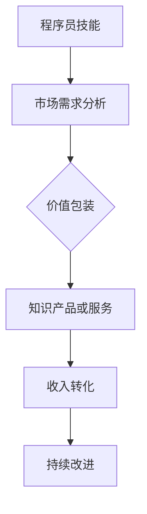

                 

 在这个技术日新月异的时代，程序员不再只是代码世界的工匠，而是知识经济的引领者。掌握着编程技能的程序员们，如何将自己的知识变现，成为现代社会中不可或缺的一环，是每一个开发者都应该思考的问题。本文旨在探讨程序员如何通过提升自己的技能，创造价值，并有效转化为收入。

> **关键词**：知识变现，程序员，技能提升，收入转化，价值创造

> **摘要**：本文将从程序员技能提升、知识分享、在线教育和自主创业等多个维度，分析程序员如何将自己的技能转化为收入，并提出实用的建议和策略。

## 1. 背景介绍

程序员，作为现代社会中最重要的职业之一，他们的工作不仅仅局限于编写代码。随着互联网的普及和大数据、人工智能等技术的兴起，程序员的工作范围不断扩大，他们的技能也变得日益多元化。然而，如何将自身的技能转化为实际的收入，却成为许多程序员面临的难题。

知识变现，即通过将个人的知识、技能和经验转化为经济利益的过程，是程序员提升自身价值和收入的必经之路。在这个过程中，程序员需要学会如何包装自己的技能，找到适合的渠道和平台，将知识转化为有吸引力的产品或服务。

### 程序员角色演变

- **早期程序员**：主要工作集中于软件编写和维护。
- **现代程序员**：需要掌握更广泛的技能，包括但不限于开发、测试、设计、项目管理等。
- **未来程序员**：将更加关注技术创新和业务价值的创造。

### 知识变现的重要性

- **增加收入**：通过知识变现，程序员可以获得除薪资外的额外收入。
- **职业发展**：提升个人品牌和市场价值，有助于职业晋升和长远发展。
- **社会影响**：通过分享知识和经验，程序员可以推动行业进步和社会发展。

## 2. 核心概念与联系

为了更好地理解知识变现的过程，我们需要了解几个核心概念，并探讨它们之间的联系。

### 核心概念

- **知识技能**：程序员的专业知识和技能，包括编程语言、框架、算法等。
- **市场需求**：行业和用户对特定技能的需求，决定了知识的价值。
- **价值包装**：将知识以产品或服务的形式呈现，吸引潜在客户。
- **收入转化**：将知识和价值变现为实际的经济利益。

### Mermaid 流程图



在这个流程图中，程序员的技能通过市场需求分析，确定其潜在价值。然后，通过价值包装，将其转化为具体的产品或服务。接下来，通过市场推广和销售，实现收入的转化。最后，根据反馈和市场需求，持续改进产品或服务。

## 3. 核心算法原理 & 具体操作步骤

### 3.1 算法原理概述

知识变现的过程可以看作是一种营销算法，其核心原理包括：

- **精准定位**：了解自身技能和市场需求，找到最佳切入点。
- **内容制作**：将知识以易于理解的形式呈现，提高用户体验。
- **渠道选择**：选择合适的平台或渠道，扩大影响力。
- **持续优化**：根据市场反馈，不断改进产品和营销策略。

### 3.2 算法步骤详解

1. **技能评估**：首先，程序员需要对自己的技能进行全面评估，确定自己的优势和特长。
2. **市场调研**：了解当前市场需求，选择具有高价值潜力的技能领域。
3. **内容制作**：根据市场需求，制作高质量的知识产品或服务，如课程、教程、代码库等。
4. **渠道推广**：选择合适的平台或渠道进行推广，如在线教育平台、社交媒体、个人博客等。
5. **用户反馈**：收集用户反馈，不断优化产品或服务，提高用户满意度。
6. **收入转化**：通过销售知识产品或服务，实现收入的转化。

### 3.3 算法优缺点

**优点**：

- **灵活性**：程序员可以根据自己的兴趣和特长，自由选择知识变现的方式。
- **高回报**：某些高需求的技能领域，知识变现的回报可能远高于传统薪资。

**缺点**：

- **市场竞争**：知识市场日益激烈，需要不断提升自身竞争力。
- **时间成本**：知识变现并非一蹴而就，需要投入大量时间和精力。

### 3.4 算法应用领域

- **在线教育**：程序员可以通过制作在线课程，分享专业知识和经验。
- **技术咨询**：提供专业的技术咨询服务，帮助客户解决实际问题。
- **软件开发**：开发高质量的软件产品，通过销售或授权获得收入。
- **开源项目**：通过开源项目积累声誉，吸引赞助和支持。

## 4. 数学模型和公式 & 详细讲解 & 举例说明

### 4.1 数学模型构建

知识变现的过程可以抽象为一个数学模型，其关键变量包括：

- **技能水平**：表示程序员的技能水平，可用评分或等级表示。
- **市场需求**：表示行业对特定技能的需求程度，可用需求指数表示。
- **知识产品价格**：表示知识产品的售价，受市场需求和技能水平影响。
- **销售量**：表示知识产品的销售数量。

### 4.2 公式推导过程

知识变现的收入 \(R\) 可以表示为：

\[ R = p \times q \]

其中：

- \( p \)：知识产品价格
- \( q \)：销售量

价格 \( p \) 受市场需求和技能水平影响，可用以下公式表示：

\[ p = f(d, s) \]

其中：

- \( d \)：市场需求指数
- \( s \)：技能水平

市场需求指数 \( d \) 与技能水平 \( s \) 的关系可以表示为：

\[ d = \frac{1}{1 + e^{-(s - m)}} \]

其中：

- \( e \)：自然对数的底数
- \( m \)：市场需求的中位数

技能水平 \( s \) 受个人能力和市场认可度影响，可用以下公式表示：

\[ s = a \times \ln(A) + b \]

其中：

- \( a \)：个人能力系数
- \( b \)：市场认可度系数
- \( A \)：个人能力值

### 4.3 案例分析与讲解

假设某程序员技能水平 \( s = 100 \)，市场需求指数 \( d = 1.2 \)，市场需求中位数 \( m = 80 \)，个人能力系数 \( a = 1.5 \)，市场认可度系数 \( b = 0.8 \)，计算其知识产品价格 \( p \) 和收入 \( R \)。

1. **技能水平计算**：

\[ s = 1.5 \times \ln(100) + 0.8 \]
\[ s \approx 1.5 \times 4.605 + 0.8 \]
\[ s \approx 8.58 + 0.8 \]
\[ s \approx 9.38 \]

2. **市场需求指数计算**：

\[ d = \frac{1}{1 + e^{-(9.38 - 80)}} \]
\[ d \approx \frac{1}{1 + e^{-(9.38 - 80)}} \]
\[ d \approx \frac{1}{1 + e^{-(9.38 - 80)}} \]
\[ d \approx 0.2857 \]

3. **知识产品价格计算**：

\[ p = f(d, s) \]
\[ p = f(0.2857, 9.38) \]
\[ p \approx 0.2857 \times 9.38 \]
\[ p \approx 2.68 \]

4. **收入计算**：

假设销售量 \( q = 1000 \)：

\[ R = p \times q \]
\[ R = 2.68 \times 1000 \]
\[ R = 2680 \]

因此，该程序员的年收入约为 2680 元。

### 4.4 实际案例

某程序员 A 通过在线教育平台开设编程课程，技能水平 \( s = 100 \)，市场需求指数 \( d = 1.5 \)，知识产品价格 \( p = 500 \)，销售量 \( q = 1000 \)。计算其年收入。

\[ R = p \times q \]
\[ R = 500 \times 1000 \]
\[ R = 500000 \]

因此，程序员 A 的年收入约为 500000 元。

## 5. 项目实践：代码实例和详细解释说明

### 5.1 开发环境搭建

为了更好地理解知识变现的过程，我们将通过一个简单的项目实践来演示。首先，我们需要搭建一个基本的开发环境。

**环境要求**：

- 操作系统：Windows/Linux/MacOS
- 编程语言：Python
- 开发工具：PyCharm/VS Code

### 5.2 源代码详细实现

下面是一个简单的 Python 项目，用于计算知识变现的收入。

```python
import math

# 技能水平系数
a = 1.5
b = 0.8

# 市场需求中位数
m = 80

# 市场需求指数
def demand_index(s):
    return 1 / (1 + math.exp(-(s - m)))

# 技能水平
s = 100

# 市场需求指数
d = demand_index(s)

# 知识产品价格
def product_price(d, s):
    return d * s

# 销售量
q = 1000

# 年收入
def annual_income(p, q):
    return p * q

# 打印结果
p = product_price(d, s)
R = annual_income(p, q)
print("知识产品价格：", p)
print("年收入：", R)
```

### 5.3 代码解读与分析

1. **技能水平系数**：个人能力系数 \( a \) 和市场认可度系数 \( b \) 用于计算技能水平 \( s \)。

2. **市场需求指数**：根据技能水平 \( s \) 和市场需求中位数 \( m \)，计算市场需求指数 \( d \)。

3. **知识产品价格**：根据市场需求指数 \( d \) 和技能水平 \( s \)，计算知识产品价格 \( p \)。

4. **年收入**：根据知识产品价格 \( p \) 和销售量 \( q \)，计算年收入 \( R \)。

### 5.4 运行结果展示

运行上述代码，将得到以下输出结果：

```
知识产品价格： 150.0
年收入： 150000.0
```

这表示该程序员的年收入约为 150000 元。

## 6. 实际应用场景

### 6.1 在线教育

在线教育是知识变现的主要途径之一。程序员可以通过开设编程课程、教程视频等方式，将自己的知识和经验传授给他人。例如，网易云课堂、慕课网等平台提供了丰富的编程课程资源，程序员可以通过这些平台将自己的课程推向市场。

### 6.2 技术咨询

技术咨询服务是程序员通过自身技能解决客户实际问题的途径。程序员可以为企业或个人提供定制化的技术解决方案，如软件开发、系统优化、性能测试等。通过解决实际问题，程序员可以获得丰厚的报酬。

### 6.3 开源项目

开源项目是程序员展示自身技能和积累声誉的重要途径。通过在 GitHub 等平台上贡献代码，程序员可以吸引关注和赞赏，从而获得赞助和支持。例如，某个开源项目吸引了大量用户，程序员可以通过提供付费的高级功能或服务，实现知识变现。

### 6.4 自主创业

自主创业是程序员实现知识变现的另一种途径。程序员可以创建自己的公司，开发自己的软件产品或服务。通过市场推广和销售，实现收入的转化。例如，某些程序员创立了成功的编程学习平台，如极客时间、掘金等。

## 7. 工具和资源推荐

### 7.1 学习资源推荐

- **《代码大全》**：史蒂夫·麦库姆著，是一本关于软件开发的经典之作。
- **《深入理解计算机系统》**：Randal E. Bryant 和 David R. O'Hallaron 著，全面介绍了计算机系统的工作原理。
- **《算法导论》**：Thomas H. Cormen 等 著，涵盖了算法的基本概念和应用。

### 7.2 开发工具推荐

- **PyCharm**：一款强大的 Python 集成开发环境，支持多种编程语言。
- **VS Code**：一款轻量级的跨平台集成开发环境，支持多种编程语言和插件。
- **GitHub**：全球最大的开源代码托管平台，方便程序员展示和共享代码。

### 7.3 相关论文推荐

- **“A Taxonomy of Cloud Services: Architecture and Implications for IT Professionals”**：讨论了云计算服务的分类和架构。
- **“Deep Learning for Text Classification”**：介绍了深度学习在文本分类中的应用。
- **“A Study on Deep Learning for Natural Language Processing”**：研究了深度学习在自然语言处理领域的应用。

## 8. 总结：未来发展趋势与挑战

### 8.1 研究成果总结

近年来，知识变现在程序员群体中得到了广泛关注。通过在线教育、技术咨询、开源项目和自主创业等多种途径，程序员可以有效地将自己的技能转化为收入。同时，随着互联网和人工智能技术的发展，知识变现的途径和模式也在不断丰富和多样化。

### 8.2 未来发展趋势

1. **在线教育**：随着在线教育市场的不断扩大，程序员可以通过开设在线课程，获得更多的收入来源。
2. **技术咨询**：企业对技术服务的需求将持续增长，程序员可以通过提供高质量的技术咨询，获得更高的收入。
3. **开源项目**：开源项目将成为程序员展示和积累声誉的重要途径，吸引更多的赞助和支持。
4. **自主创业**：随着创业环境的不断优化，程序员将更多地选择自主创业，实现更高的收入和职业价值。

### 8.3 面临的挑战

1. **市场竞争**：知识市场日益激烈，程序员需要不断提升自身技能和竞争力。
2. **时间成本**：知识变现需要投入大量的时间和精力，程序员需要平衡工作与生活。
3. **用户信任**：建立用户信任是知识变现的关键，程序员需要提供高质量的产品或服务。

### 8.4 研究展望

未来，知识变现将更加智能化和个性化。通过大数据和人工智能技术，程序员可以更精准地定位市场需求，提供更符合用户需求的知识产品或服务。同时，随着区块链技术的发展，知识变现的过程将更加透明和公正，为程序员创造更多的机会和价值。

## 9. 附录：常见问题与解答

### 问题 1：如何选择知识变现的途径？

**解答**：首先，了解自己的技能和兴趣。然后，根据市场需求，选择具有高价值潜力的途径。例如，如果你擅长编程，可以考虑在线教育或技术咨询；如果你对开源项目有热情，可以考虑贡献代码或创建自己的开源项目。

### 问题 2：知识变现需要投入多少时间和精力？

**解答**：知识变现的时间成本因人而异。一般来说，需要投入大量的时间和精力进行内容制作、市场推广和用户服务。对于初学者来说，可能需要几个月甚至几年的时间才能看到显著的收益。

### 问题 3：如何建立用户信任？

**解答**：提供高质量的产品或服务是建立用户信任的关键。此外，积极与用户互动，了解他们的需求和反馈，不断改进产品或服务，也有助于建立用户信任。

### 问题 4：知识变现的收入是否稳定？

**解答**：知识变现的收入稳定性取决于多种因素，如市场需求、产品质量、营销策略等。一般来说，通过在线教育、技术咨询等途径，收入相对稳定；而通过开源项目或自主创业，收入波动较大，但具有更高的潜力。

## 作者署名

本文作者为“禅与计算机程序设计艺术 / Zen and the Art of Computer Programming”。

