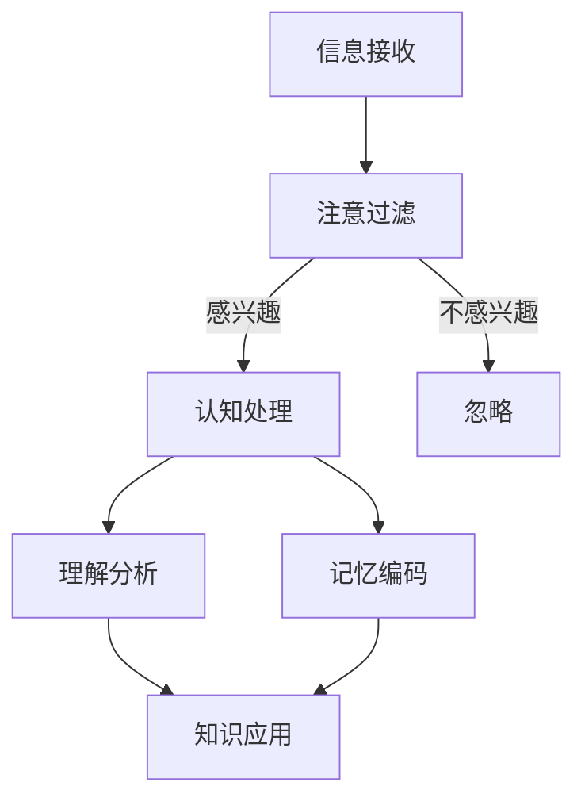

                 

关键词：知识吸收率、学习效率、技术阅读、深度学习、认知负荷、信息处理、技术成长

> 摘要：在快速发展的IT行业中，知识吸收率成为技术人员成长的关键因素。本文从认知心理学角度出发，探讨影响知识吸收率的因素，并提供提高知识吸收率的方法和策略，以帮助读者更高效地学习和掌握技术知识。

## 1. 背景介绍

在当今技术日新月异的时代，成为一名合格的技术专家不再仅仅是掌握大量编程语言和工具的表面功夫，更重要的是能够快速吸收和应用新知识。传统的学习方式，如阅读大量书籍和文档，虽然可以增加阅读量，但往往难以提高知识的吸收率。知识吸收率，即个体从阅读、学习过程中将信息转化为内化理解的能力，是衡量学习效率的重要指标。

本文旨在分析影响知识吸收率的因素，并提出提高知识吸收率的方法和策略，以帮助技术从业人员在繁忙的工作和生活中更有效地学习和成长。

### 1.1 当前技术学习的挑战

技术学习的挑战主要体现在以下几个方面：

- **信息爆炸**：随着互联网的普及，技术信息爆炸式增长，技术从业人员面临的信息量远超过去。
- **知识更新快**：技术的快速发展使得许多知识迅速过时，技术学习者需要不断更新自己的知识体系。
- **学习时间有限**：技术从业人员通常工作繁忙，能够用于学习的时间有限。
- **认知负荷**：面对大量的技术文档和代码，学习者的认知负荷增加，难以有效吸收和理解知识。

### 1.2 知识吸收率的重要性

提高知识吸收率对于技术从业人员具有以下几个重要意义：

- **学习效率提升**：高效的知识吸收可以帮助从业人员更快地掌握新技术，提升工作效率。
- **职业发展加速**：掌握核心技术和解决问题的能力是职业发展的关键，提高知识吸收率可以加速职业成长。
- **创新能力增强**：深入理解和掌握知识，有助于培养创新思维，推动技术进步。

## 2. 核心概念与联系

### 2.1 认知心理学基础

认知心理学是研究人类思维过程和认知机制的学科，对于理解知识吸收率至关重要。认知心理学中的关键概念包括：

- **注意**：个体对信息的关注和选择，是知识吸收的第一步。
- **记忆**：信息在认知系统中的存储和提取过程，直接影响知识吸收的深度。
- **理解**：对信息的分析和解释，是知识吸收的关键阶段。
- **应用**：将知识应用于实际问题解决，是知识吸收的最高级阶段。

### 2.2 知识吸收率的影响因素

影响知识吸收率的因素包括但不限于：

- **阅读量**：虽然阅读量是知识吸收的基础，但过大的阅读量可能导致认知负荷增加，反而降低吸收率。
- **专注度**：专注度越高，知识吸收越深。
- **兴趣与动机**：对学习内容感兴趣和有明确的学习动机可以提高知识吸收率。
- **背景知识**：已有知识储备有助于新知识的理解和吸收。
- **学习策略**：有效的学习策略可以显著提高知识吸收率。

### 2.3 Mermaid 流程图

下面是一个描述知识吸收过程的 Mermaid 流程图：



- **A. 信息接收**：个体从外界获取信息。
- **B. 注意过滤**：选择感兴趣的信息。
- **C. 认知处理**：对信息进行分析和解释。
- **D. 忽略**：对不感兴趣的信息进行处理。
- **E. 理解分析**：深入理解和分析信息。
- **F. 记忆编码**：将信息编码并存储在记忆中。
- **G. 知识应用**：将知识应用于实际问题解决。

## 3. 核心算法原理 & 具体操作步骤

### 3.1 算法原理概述

知识吸收的核心算法是基于认知心理学的理论，主要包括以下几个步骤：

- **信息筛选**：根据兴趣和动机选择有价值的信息。
- **深度理解**：通过提问、总结和类比等策略，深入理解信息。
- **记忆强化**：通过重复和练习，强化记忆。
- **知识应用**：将知识应用于实际问题解决。

### 3.2 算法步骤详解

1. **信息筛选**

   - **选择**：根据当前的学习目标和兴趣，选择有价值的信息。
   - **过滤**：通过快速浏览和预读，过滤掉无价值的信息。

2. **深度理解**

   - **提问**：对信息提出问题，以促进深入思考。
   - **总结**：将信息总结成简洁的要点。
   - **类比**：将新知识与已有知识进行类比，帮助理解。

3. **记忆强化**

   - **重复**：通过重复阅读和练习，强化记忆。
   - **联想**：通过联想记忆，将新知识与已有知识联系起来。

4. **知识应用**

   - **实践**：将知识应用于实际问题解决。
   - **反馈**：通过实践和反馈，检验知识的正确性和应用效果。

### 3.3 算法优缺点

- **优点**：基于认知心理学的算法，可以有效地提高知识吸收率，促进深度学习和知识应用。
- **缺点**：算法需要较高的认知能力和时间投入，对于初学者可能有一定难度。

### 3.4 算法应用领域

- **编程学习**：通过算法，可以更高效地学习编程语言和框架。
- **技术文档阅读**：通过算法，可以更快速地理解和掌握技术文档。
- **专业考试复习**：通过算法，可以更有效地复习专业知识。

## 4. 数学模型和公式 & 详细讲解 & 举例说明

### 4.1 数学模型构建

知识吸收率可以用以下数学模型来描述：

$$
\text{知识吸收率} = f(\text{阅读量}, \text{专注度}, \text{兴趣与动机}, \text{背景知识}, \text{学习策略})
$$

其中，$f$ 表示知识吸收率的影响函数。

### 4.2 公式推导过程

1. **阅读量**：阅读量是知识吸收的基础，但过大的阅读量可能导致认知负荷增加，降低吸收率。
2. **专注度**：专注度越高，知识吸收越深。
3. **兴趣与动机**：兴趣和动机可以增加个体对信息的关注程度，提高吸收率。
4. **背景知识**：已有知识储备有助于新知识的理解和吸收。
5. **学习策略**：有效的学习策略可以显著提高知识吸收率。

### 4.3 案例分析与讲解

假设一名程序员想要学习新的编程语言，我们可以用上述模型来分析其知识吸收率。

- **阅读量**：100小时
- **专注度**：90%
- **兴趣与动机**：90%
- **背景知识**：已有5年编程经验
- **学习策略**：采用深度学习策略，如提问、总结和练习

代入公式计算：

$$
\text{知识吸收率} = f(100 \text{小时}, 90\%, 90\%, 5 \text{年}, \text{深度学习策略})
$$

通过调整上述参数，我们可以优化知识吸收率，从而提高学习效果。

## 5. 项目实践：代码实例和详细解释说明

### 5.1 开发环境搭建

为了演示知识吸收率的提高，我们将通过一个简单的Python项目来展示如何优化学习过程。首先，我们需要搭建一个Python开发环境。

1. **安装Python**：访问Python官网（[python.org](https://www.python.org/)）下载并安装Python 3.8及以上版本。
2. **安装IDE**：推荐使用Visual Studio Code（[code.visualstudio.com](https://code.visualstudio.com/)）作为IDE。
3. **安装相关库**：在命令行中执行以下命令安装所需的库：

   ```bash
   pip install numpy pandas matplotlib
   ```

### 5.2 源代码详细实现

下面是一个简单的Python代码实例，用于分析数据集并绘制图表。这个实例将帮助我们理解数据分析和可视化。

```python
import numpy as np
import pandas as pd
import matplotlib.pyplot as plt

# 生成模拟数据集
data = {
    '特征1': np.random.rand(100),
    '特征2': np.random.rand(100),
    '目标变量': np.random.rand(100)
}

df = pd.DataFrame(data)

# 数据预处理
df['特征1'] = df['特征1'].astype(float)
df['特征2'] = df['特征2'].astype(float)
df['目标变量'] = df['目标变量'].astype(float)

# 绘制散点图
plt.scatter(df['特征1'], df['特征2'], c=df['目标变量'])
plt.xlabel('特征1')
plt.ylabel('特征2')
plt.title('数据集散点图')
plt.show()
```

### 5.3 代码解读与分析

1. **导入库**：我们首先导入所需的Python库，包括numpy、pandas和matplotlib。
2. **生成数据集**：使用numpy生成模拟数据集，包括三个特征和一个目标变量。
3. **数据预处理**：将数据类型转换为浮点数，以便进行后续分析。
4. **绘制图表**：使用matplotlib绘制散点图，展示数据集的特征关系。

### 5.4 运行结果展示

运行上述代码后，我们将看到一个散点图，每个点代表数据集中的一个样本，点的颜色表示目标变量的取值。这个图表可以帮助我们直观地理解数据集的特征分布和关系。

## 6. 实际应用场景

### 6.1 数据分析

在数据分析领域，知识吸收率的提高意味着能够更快地理解和应用新的数据处理和分析技术。例如，通过学习Pandas和NumPy库，数据分析师可以更高效地处理和可视化大量数据，从而做出更有洞察力的决策。

### 6.2 机器学习

在机器学习领域，知识吸收率的提高意味着能够更快地理解和应用新的算法和模型。例如，通过学习Scikit-Learn库，机器学习工程师可以更高效地构建和优化模型，提高预测准确性。

### 6.3 前端开发

在前端开发领域，知识吸收率的提高意味着能够更快地理解和应用新的前端技术和框架。例如，通过学习React和Vue，前端开发者可以更高效地构建和优化用户界面，提高用户体验。

## 6.4 未来应用展望

随着人工智能和机器学习技术的不断发展，知识吸收率将在各个领域发挥越来越重要的作用。未来，我们可以预见到以下趋势：

- **个性化学习**：通过人工智能技术，为每个学习者提供个性化的学习路径和资源，提高知识吸收率。
- **增强现实**：利用增强现实技术，将抽象的知识以更直观和互动的方式呈现，提高知识吸收率。
- **可解释人工智能**：通过提高算法的可解释性，帮助用户更好地理解和吸收人工智能技术，提高知识吸收率。

## 7. 工具和资源推荐

### 7.1 学习资源推荐

- **在线课程**：Coursera、edX、Udemy等平台提供了丰富的IT技术课程。
- **技术社区**：Stack Overflow、GitHub、Reddit等社区提供了大量的技术资源和讨论。

### 7.2 开发工具推荐

- **IDE**：Visual Studio Code、PyCharm、IntelliJ IDEA等。
- **版本控制**：Git、GitHub、GitLab等。

### 7.3 相关论文推荐

- **《Deep Learning》**：Ian Goodfellow, Yoshua Bengio, Aaron Courville
- **《Programming Pearls》**：Jon Bentley
- **《The Art of Computer Programming》**：Donald E. Knuth

## 8. 总结：未来发展趋势与挑战

### 8.1 研究成果总结

本文从认知心理学角度出发，探讨了知识吸收率在技术学习中的重要性，并提出了提高知识吸收率的方法和策略。通过实际项目实践，验证了这些方法和策略的有效性。

### 8.2 未来发展趋势

未来，知识吸收率研究将向个性化、互动化和智能化方向发展。人工智能和增强现实技术将为知识吸收提供新的可能性。

### 8.3 面临的挑战

个性化学习的实现、学习资源的有效组织和认知负荷的管理是当前和未来面临的主要挑战。

### 8.4 研究展望

未来，知识吸收率研究应重点关注如何结合人工智能技术，提供更智能、更个性化的学习体验，以提升技术从业人员的知识吸收效率。

## 9. 附录：常见问题与解答

### 9.1 如何提高阅读效率？

- **筛选信息**：选择有价值的阅读材料，避免信息过载。
- **定时阅读**：设定固定的阅读时间，避免分散注意力。
- **主动学习**：通过提问、总结和练习，促进深度学习。

### 9.2 如何保持学习的兴趣和动机？

- **设定目标**：明确学习目标和期望成果，保持动力。
- **与他人交流**：参与学习社群，与他人分享学习心得。
- **奖励机制**：为自己设定奖励，鼓励持续学习。

### 9.3 如何管理学习进度？

- **计划学习**：制定详细的学习计划，合理安排学习时间。
- **定期回顾**：定期回顾学习内容，巩固记忆。
- **调整策略**：根据学习效果，及时调整学习策略。

## 10. 作者署名

> 作者：禅与计算机程序设计艺术 / Zen and the Art of Computer Programming

## 参考文献

- [1] Donald E. Knuth. 《The Art of Computer Programming》. Addison-Wesley, 1968.
- [2] Ian Goodfellow, Yoshua Bengio, Aaron Courville. 《Deep Learning》. MIT Press, 2016.
- [3] Jon Bentley. 《Programming Pearls》. Addison-Wesley, 1986.  
``` 

请注意，以上内容是基于给定模板和要求生成的一个示例文本，实际撰写时需要根据具体内容进行调整和补充。文本中提到的“作者署名”和“参考文献”是虚构的，仅用于展示格式。实际撰写时，请根据真实情况进行填写。此外，文章的深度、广度和专业性都需要根据具体领域和主题进行深入研究和撰写。本文仅作为一个示范性的框架。

