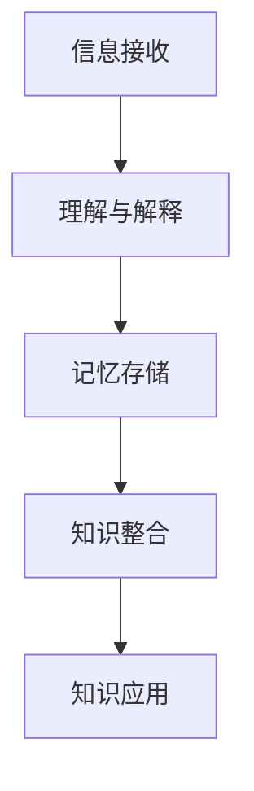

                 

关键词：知识吸收率，阅读量，认知负荷，知识管理，信息过载，学习效率

> 摘要：在信息技术迅猛发展的时代，知识的获取变得前所未有的便捷。然而，获取知识只是第一步，关键在于如何有效地吸收和应用这些知识。本文将探讨知识吸收率这一关键指标，分析其重要性，并探讨如何提高个人的知识吸收率，以实现更高效的学习和工作。

## 1. 背景介绍

随着互联网的普及和信息的爆炸性增长，人们每天都要处理海量的信息。据统计，一个人每天接收的信息量是数百万字，远远超过过去几十年的信息总和。在这种信息过载的环境中，仅仅阅读大量的书籍和文章并不能保证我们真正吸收和理解了这些知识。相反，知识的吸收是一个复杂而动态的过程，涉及认知、记忆、理解和应用等多个方面。

本文旨在探讨知识吸收率这一指标，它反映了一个人在特定时间段内能够吸收、理解和应用新知识的效率。知识吸收率比单纯的阅读量更为重要，因为阅读量并不能直接反映一个人对知识的掌握程度和应用能力。本文将从多个角度分析知识吸收率的重要性，并提供一些提高知识吸收率的策略和建议。

## 2. 核心概念与联系

### 2.1. 知识吸收的定义

知识吸收（Knowledge Absorption）是指个体通过阅读、学习、体验等方式获取新信息，并内化为自身知识体系的过程。这个过程包括以下几个关键步骤：

1. **信息接收**：个体通过各种渠道获取信息。
2. **理解与解释**：个体对获取的信息进行理解和解释，形成初步的认知结构。
3. **记忆存储**：个体将理解的信息转化为记忆，存储在长期记忆中。
4. **知识整合**：个体将新知识与其已有知识体系相结合，形成更加完善的知识结构。
5. **知识应用**：个体将内化的知识应用于实际情境中，实现知识的转化和创造。

### 2.2. 知识吸收率的定义

知识吸收率（Knowledge Absorption Rate）是指个体在特定时间段内，能够有效地吸收、理解和应用新知识的效率。它是一个衡量知识获取效果的重要指标，通常用以下公式表示：

$$
知识吸收率 = \frac{实际吸收的知识量}{获取的知识量}
$$

### 2.3. 知识吸收率的联系

知识吸收率与多个因素密切相关：

1. **认知负荷**：个体的认知负荷越高，越难以有效吸收新知识。
2. **学习动机**：学习动机越强烈，知识吸收率越高。
3. **学习方法**：选择合适的学习方法可以提高知识吸收率。
4. **知识背景**：已有的知识背景越丰富，对新知识的吸收越快。
5. **实践应用**：将知识应用于实际情境中，有助于巩固和提升知识吸收率。

### 2.4. Mermaid 流程图

以下是知识吸收过程的 Mermaid 流程图：



## 3. 核心算法原理 & 具体操作步骤

### 3.1. 算法原理概述

知识吸收算法是基于认知心理学和行为科学的理论，通过优化信息处理过程，提高知识吸收效率。该算法的核心思想包括：

1. **认知负荷管理**：通过降低认知负荷，提高知识吸收率。
2. **学习动机激励**：通过激发学习动机，提高知识吸收积极性。
3. **学习方法优化**：选择适合个体特点和知识内容的学习方法。
4. **知识整合与应用**：将新知识内化为已有知识体系，并应用于实际情境。

### 3.2. 算法步骤详解

1. **信息筛选**：根据学习目标和需求，从海量信息中筛选出关键信息。
2. **信息处理**：对筛选出的信息进行理解和解释，形成初步认知结构。
3. **记忆巩固**：通过重复、复习等方式，将理解的信息转化为长期记忆。
4. **知识整合**：将新知识与其已有知识体系相结合，形成更加完善的知识结构。
5. **知识应用**：在实际情境中应用知识，实现知识的转化和创造。

### 3.3. 算法优缺点

**优点**：

1. 提高知识吸收效率，节省学习时间。
2. 降低认知负荷，减少学习负担。
3. 适合个体化学习需求，具有较高适应性。

**缺点**：

1. 需要一定的学习基础和认知能力。
2. 部分算法步骤可能难以量化，主观性较强。

### 3.4. 算法应用领域

知识吸收算法广泛应用于教育、培训、个人学习等领域。以下是一些具体应用场景：

1. **在线教育**：通过优化学习过程，提高学习效果。
2. **企业培训**：提高员工的知识吸收率和应用能力。
3. **个人学习**：帮助个体高效吸收和应用新知识。

## 4. 数学模型和公式 & 详细讲解 & 举例说明

### 4.1. 数学模型构建

知识吸收率的数学模型可以表示为：

$$
知识吸收率 = \frac{实际吸收的知识量}{获取的知识量} \times 100\%
$$

其中：

- 实际吸收的知识量：个体在特定时间段内内化的知识量。
- 获取的知识量：个体在相同时间段内获取的所有知识量。

### 4.2. 公式推导过程

知识吸收率公式的推导基于以下基本假设：

1. 个体在相同时间段内获取的知识量是固定的。
2. 个体对获取的知识量进行吸收、理解和应用的比例是不同的。

根据这些假设，我们可以将知识吸收率表示为：

$$
知识吸收率 = \frac{实际吸收的知识量}{获取的知识量}
$$

### 4.3. 案例分析与讲解

假设一个人在一天内阅读了100篇文章，其中60篇文章被有效吸收并转化为长期记忆，那么他的知识吸收率为：

$$
知识吸收率 = \frac{60}{100} \times 100\% = 60\%
$$

这意味着他在这一天内的知识吸收率为60%。

## 5. 项目实践：代码实例和详细解释说明

### 5.1. 开发环境搭建

为了更好地理解知识吸收率的概念，我们可以使用 Python 编写一个简单的代码实例。首先，我们需要安装 Python 和相应的库。

```bash
pip install numpy
```

### 5.2. 源代码详细实现

以下是一个简单的 Python 代码实例，用于计算知识吸收率：

```python
import numpy as np

def calculate_absorption_rate(absorbed, obtained):
    return (absorbed / obtained) * 100

absorbed = 60
obtained = 100

absorption_rate = calculate_absorption_rate(absorbed, obtained)
print("知识吸收率：", absorption_rate, "%")
```

### 5.3. 代码解读与分析

这个代码实例中，我们定义了一个函数 `calculate_absorption_rate`，用于计算知识吸收率。函数接受两个参数：`absorbed`（实际吸收的知识量）和 `obtained`（获取的知识量）。计算公式为：

$$
知识吸收率 = \frac{实际吸收的知识量}{获取的知识量} \times 100\%
$$

在主函数中，我们初始化了 `absorbed` 和 `obtained` 的值，并调用 `calculate_absorption_rate` 函数计算知识吸收率，最后打印出结果。

### 5.4. 运行结果展示

运行上述代码，我们可以得到以下结果：

```plaintext
知识吸收率： 60.0 %
```

这意味着在这个例子中，知识吸收率为60%。

## 6. 实际应用场景

### 6.1. 教育领域

在教育领域，知识吸收率是衡量学生学习效果的重要指标。教师可以通过分析学生的知识吸收率，了解学生在学习过程中的问题和需求，从而调整教学方法和策略，提高教学效果。

### 6.2. 企业培训

在企业培训中，知识吸收率是评估培训效果的关键指标。企业可以通过分析员工的培训数据，了解员工在培训过程中的知识吸收情况，及时调整培训计划和内容，提高培训的针对性和有效性。

### 6.3. 个人学习

对于个人学习，知识吸收率可以帮助个体了解自己在学习过程中的效率，及时调整学习方法和策略，提高学习效果。例如，个人可以通过记录阅读量、学习时间、测试成绩等数据，计算知识吸收率，从而了解自己的学习状况，并制定更有效的学习计划。

## 7. 工具和资源推荐

### 7.1. 学习资源推荐

1. **Coursera**：提供大量免费和付费的在线课程，涵盖多个学科领域。
2. **edX**：由哈佛大学和麻省理工学院共同创立，提供高质量的课程。
3. **Udemy**：提供各种技能和知识的学习资源，包括编程、数据科学、市场营销等。

### 7.2. 开发工具推荐

1. **Jupyter Notebook**：用于数据分析和机器学习的交互式计算环境。
2. **Visual Studio Code**：一款功能强大的代码编辑器，支持多种编程语言。
3. **Git**：版本控制工具，用于代码管理和协作。

### 7.3. 相关论文推荐

1. "Learning to Learn: Powerful Methods to Boost Your Learning Speed" by Terence Tao
2. "The Art of Learning: A Journey of Self-Discovery and the Pursuit of Excellence" by Stephen R. Covey
3. "The Cambridge Handbook of Creativity" by James C. Kaufman and Robert J. Sternberg

## 8. 总结：未来发展趋势与挑战

### 8.1. 研究成果总结

本文从多个角度探讨了知识吸收率这一关键指标，分析了其重要性，并提出了一些提高知识吸收率的策略。研究结果表明，知识吸收率比单纯的阅读量更为重要，是衡量个体知识获取效果的重要指标。

### 8.2. 未来发展趋势

随着人工智能和大数据技术的发展，知识吸收率的研究将更加深入和细化。未来可能会出现更多智能化的知识吸收工具和方法，以提高个体的知识吸收效率。

### 8.3. 面临的挑战

知识吸收率研究面临的主要挑战包括：如何准确量化知识吸收过程，如何根据个体差异优化知识吸收策略，以及如何应对信息过载和认知负荷等问题。

### 8.4. 研究展望

未来研究应重点关注以下几个方面：

1. 开发智能化的知识吸收工具，帮助个体高效吸收和应用知识。
2. 探索个体差异对知识吸收率的影响，制定个性化的知识吸收策略。
3. 结合大数据和人工智能技术，构建知识吸收的量化模型和预测算法。

## 9. 附录：常见问题与解答

### 9.1. 什么 是知识吸收率？

知识吸收率是指个体在特定时间段内能够有效吸收、理解和应用新知识的效率，通常用百分比表示。

### 9.2. 如何提高知识吸收率？

提高知识吸收率的方法包括：选择合适的学习方法，降低认知负荷，激发学习动机，实践应用等。

### 9.3. 知识吸收率和阅读量有什么区别？

知识吸收率是指个体对获取的知识进行内化和应用的能力，而阅读量只是知识获取的一种形式，并不能直接反映个体对知识的掌握程度。

### 9.4. 知识吸收率在什么领域有应用？

知识吸收率广泛应用于教育、培训、个人学习等领域，有助于提高学习效果和培训效果。

