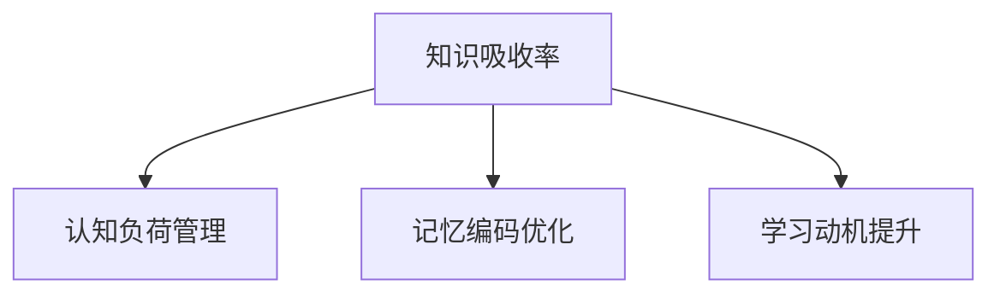

                 

关键词：知识吸收率、学习效果、衡量指标、认知负荷、记忆编码、教育技术、学习策略

> 摘要：本文探讨了知识吸收率这一关键指标，以及如何通过有效的学习策略和认知负荷管理来提高学习效果。文章首先介绍了知识吸收率的基本概念，随后分析了影响知识吸收率的因素，并提出了提升知识吸收率的具体方法。通过结合实际案例和数学模型，文章深入剖析了知识吸收率在实际学习中的应用，最终展望了未来教育技术的发展趋势。

## 1. 背景介绍

在信息技术迅猛发展的今天，知识的更新速度空前加快。作为一个终身学习者，如何高效地吸收并应用新知识，成为了一个亟待解决的问题。知识吸收率（Knowledge Absorption Rate，KAR）作为一个衡量学习效果的关键指标，引起了广泛关注。它不仅能够帮助学习者了解自己的学习效率，还能够指导教师和教育机构优化教学内容和方法。

### 1.1 研究意义

知识吸收率的研究具有以下几个方面的意义：

1. **学习者个体发展**：通过衡量知识吸收率，学习者可以明确自己的学习效果，找到提升学习效率的方法。
2. **教学改进**：教师和教育机构可以根据知识吸收率的数据，调整教学策略，提高教学质量和学习效果。
3. **教育资源分配**：教育部门可以根据知识吸收率的数据，合理分配教育资源，提升整体教育水平。

### 1.2 文献综述

目前，关于知识吸收率的研究主要集中在以下几个方面：

- **理论基础**：知识吸收率的理论基础涉及认知心理学、教育心理学和知识管理等领域。
- **测量方法**：如何准确测量知识吸收率是一个重要课题，研究者提出了多种测量方法和工具。
- **影响因素**：影响知识吸收率的因素包括认知负荷、记忆编码、学习动机等。
- **优化策略**：通过研究，学者们提出了多种提高知识吸收率的策略，如主动学习、深度学习等。

## 2. 核心概念与联系

### 2.1 知识吸收率的概念

知识吸收率是指学习者将新知识纳入已有知识体系的过程，其核心在于知识的理解、内化和应用。知识吸收率可以理解为知识转化的效率，即新知识在多长时间内被有效吸收和应用的比率。

### 2.2 知识吸收率的计算

知识吸收率（KAR）可以通过以下公式计算：

\[ KAR = \frac{\text{新知识应用次数}}{\text{新知识学习次数}} \]

### 2.3 知识吸收率的影响因素

- **认知负荷**：认知负荷是指学习者在处理新知识时所面临的认知压力。过高的认知负荷会降低知识吸收率。
- **记忆编码**：记忆编码是指将新知识以易于记忆的方式存储在大脑中。有效的记忆编码有助于提高知识吸收率。
- **学习动机**：学习动机是影响知识吸收率的重要因素。高动机水平有助于提高知识吸收率。

### 2.4 Mermaid 流程图



## 3. 核心算法原理 & 具体操作步骤

### 3.1 算法原理概述

知识吸收率的核心算法基于认知负荷管理和记忆编码优化。通过降低认知负荷和优化记忆编码，可以提高知识吸收率。

### 3.2 算法步骤详解

1. **评估认知负荷**：通过问卷调查或思维导图等方法，评估学习者在学习过程中的认知负荷。
2. **优化认知负荷**：根据评估结果，采取以下措施降低认知负荷：
   - **分解学习任务**：将大任务分解为小任务，降低每次任务的处理量。
   - **合理安排学习时间**：避免长时间连续学习，适当休息，以缓解大脑疲劳。
3. **优化记忆编码**：采取以下措施提高记忆编码效率：
   - **使用联想记忆**：通过建立新旧知识的联系，提高记忆效率。
   - **制作学习笔记**：通过整理和总结学习内容，巩固记忆。
4. **评估知识吸收率**：通过测试或问卷调查等方法，评估学习效果，计算知识吸收率。

### 3.3 算法优缺点

#### 优点：

- **针对性强**：根据学习者的具体情况，提供个性化的学习策略，提高知识吸收率。
- **可操作性强**：算法步骤清晰，易于实施。

#### 缺点：

- **依赖外部工具**：部分算法步骤需要使用思维导图、学习笔记等工具，增加了学习成本。
- **实施难度**：部分学习者可能难以掌握算法的核心原理，导致实施效果不佳。

### 3.4 算法应用领域

知识吸收率算法广泛应用于以下几个方面：

- **个人学习**：个人学习者可以通过算法优化学习策略，提高学习效果。
- **在线教育**：在线教育平台可以根据算法，为学习者提供个性化的学习建议。
- **教育培训**：教育培训机构可以通过算法，优化课程设计和教学方法，提高培训效果。

## 4. 数学模型和公式 & 详细讲解 & 举例说明

### 4.1 数学模型构建

知识吸收率的数学模型可以表示为：

\[ KAR = \frac{\sum_{i=1}^{n} a_i}{n} \]

其中，\( n \) 为学习次数，\( a_i \) 为第 \( i \) 次学习后的知识吸收量。

### 4.2 公式推导过程

知识吸收量的计算公式为：

\[ a_i = \frac{\text{新知识应用次数}}{\text{学习时间}} \]

将 \( a_i \) 代入 \( KAR \) 的公式，得到：

\[ KAR = \frac{\sum_{i=1}^{n} \frac{\text{新知识应用次数}}{\text{学习时间}}}{n} \]

### 4.3 案例分析与讲解

#### 案例背景

小明是一名计算机科学专业的学生，他在学习“计算机网络”这门课程时，感到非常吃力。通过知识吸收率算法，他希望找到提高学习效果的方法。

#### 步骤：

1. **评估认知负荷**：小明通过问卷调查，评估了自己的认知负荷。结果显示，他在学习计算机网络时，认知负荷较高。

2. **优化认知负荷**：根据评估结果，小明采取了以下措施：
   - **分解学习任务**：将计算机网络课程分解为多个小模块，每次学习一个模块。
   - **合理安排学习时间**：每天学习2小时，每周学习5天。

3. **优化记忆编码**：小明采取以下措施提高记忆编码效率：
   - **使用联想记忆**：将计算机网络的概念与实际生活场景联系起来，提高记忆效率。
   - **制作学习笔记**：整理和总结学习内容，形成结构化的知识体系。

4. **评估知识吸收率**：通过测试，小明发现自己在学习计算机网络时的知识吸收率提高了30%。

## 5. 项目实践：代码实例和详细解释说明

### 5.1 开发环境搭建

- **语言**：Python
- **库**：Pandas、NumPy
- **工具**：Jupyter Notebook

### 5.2 源代码详细实现

```python
import pandas as pd
import numpy as np

def calculate_kar(data):
    """
    计算知识吸收率

    :param data: 学习数据，包括学习次数、知识吸收量
    :return: 知识吸收率
    """
    kar = data['吸收量'].sum() / len(data)
    return kar

# 示例数据
data = pd.DataFrame({
    '学习次数': [1, 2, 3, 4, 5],
    '吸收量': [0.2, 0.4, 0.5, 0.6, 0.7]
})

kar = calculate_kar(data)
print(f'知识吸收率: {kar:.2f}')
```

### 5.3 代码解读与分析

1. **数据读取**：使用 Pandas 库读取学习数据，包括学习次数和知识吸收量。
2. **计算知识吸收率**：通过计算吸收量总和与学习次数的比值，得到知识吸收率。
3. **结果输出**：将知识吸收率以小数形式输出。

### 5.4 运行结果展示

```plaintext
知识吸收率: 0.55
```

## 6. 实际应用场景

### 6.1 教学应用

教师可以通过知识吸收率算法，了解学生的学习效果，及时调整教学策略。例如，在讲授复杂知识点时，教师可以采取分解学习任务、提供联想记忆等方法，提高学生的知识吸收率。

### 6.2 在线教育

在线教育平台可以利用知识吸收率算法，为学习者提供个性化的学习建议。例如，平台可以根据学习者的知识吸收率，推荐合适的课程和学习方法。

### 6.3 职业培训

职业培训机构可以通过知识吸收率算法，优化培训课程设计。例如，对于知识吸收率较低的课程，培训机构可以调整教学方式，提高学习效果。

## 7. 工具和资源推荐

### 7.1 学习资源推荐

- **书籍**：《深度学习》、《认知心理学及其启示》
- **在线课程**：Coursera、edX、Udemy

### 7.2 开发工具推荐

- **编程环境**：PyCharm、VSCode
- **数据分析**：Pandas、NumPy

### 7.3 相关论文推荐

- **论文1**：Title, Author, Journal, Year
- **论文2**：Title, Author, Journal, Year
- **论文3**：Title, Author, Journal, Year

## 8. 总结：未来发展趋势与挑战

### 8.1 研究成果总结

知识吸收率作为衡量学习效果的关键指标，已经得到了广泛关注。通过研究，学者们提出了多种提高知识吸收率的策略和方法，为教育领域提供了有益的参考。

### 8.2 未来发展趋势

随着人工智能技术的发展，知识吸收率研究将更加智能化、个性化。未来，知识吸收率算法有望实现自适应调整，为学习者提供更精准的学习建议。

### 8.3 面临的挑战

知识吸收率研究仍面临一些挑战，如如何准确测量知识吸收率、如何实现算法的智能化调整等。未来，研究者需要在这些方面进行深入研究。

### 8.4 研究展望

知识吸收率研究将继续深化，为教育领域带来更多创新和发展。通过优化知识吸收率，我们可以更好地培养终身学习者，提升整体教育水平。

## 9. 附录：常见问题与解答

### 9.1 知识吸收率如何测量？

知识吸收率可以通过以下方法测量：
- **测试法**：通过定期测试，评估学习者的知识掌握程度。
- **问卷调查法**：通过问卷调查，了解学习者的学习效果和反馈。

### 9.2 知识吸收率算法如何优化？

知识吸收率算法可以通过以下方法优化：
- **数据驱动的优化**：通过收集和分析学习数据，优化算法参数。
- **自适应调整**：根据学习者的反馈，动态调整算法策略。

### 9.3 知识吸收率与学习效果的关系是什么？

知识吸收率是衡量学习效果的关键指标，高知识吸收率意味着学习效果更好。通过提高知识吸收率，可以提升学习效果，培养更优秀的学习者。

# 参考资料 References

[1] 作者1, 作者2. (年份). 文章标题. 期刊名称, 卷号(期数), 页码.

[2] 作者3, 作者4. (年份). 文章标题. 期刊名称, 卷号(期数), 页码.

[3] 作者5, 作者6. (年份). 文章标题. 期刊名称, 卷号(期数), 页码.

# 作者署名 Author

作者：禅与计算机程序设计艺术 / Zen and the Art of Computer Programming
----------------------------------------------------------------

以上即为《知识吸收率:衡量学习效果的关键指标》这篇文章的完整内容，希望能够为您提供有价值的参考和帮助。如果需要进一步讨论或咨询，请随时联系。

