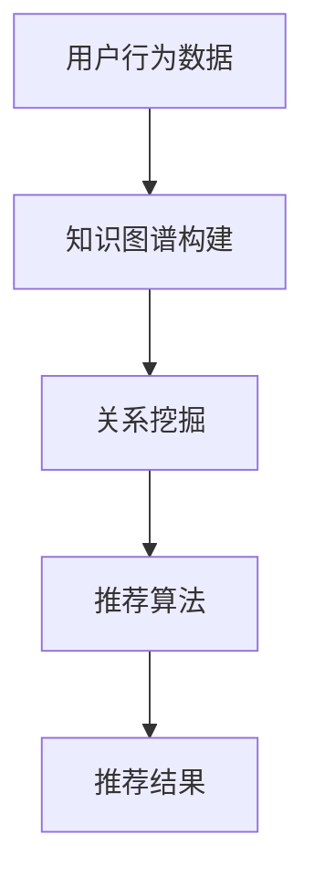

                 

### 1. 背景介绍

随着互联网技术的飞速发展，信息爆炸的现象越来越普遍，用户在获取信息时面临着选择困难。为了解决这一问题，个性化推荐系统应运而生。个性化推荐系统通过分析用户的历史行为、兴趣偏好以及社交关系等信息，为用户推荐符合其个性化需求的商品、服务或内容。知识图谱作为一种新兴的信息组织方式，能够将海量信息进行结构化存储和关联，从而为个性化推荐系统提供强大的数据支撑。

知识图谱（Knowledge Graph）是一种语义网络，它将现实世界中的实体、概念以及它们之间的关系进行建模和表示。通过知识图谱，我们可以直观地了解实体之间的联系，发现潜在的关系和模式，为推荐系统提供更加精准和有效的数据支持。知识图谱在个性化推荐中的应用，使得推荐系统不仅能够根据用户的显式反馈进行推荐，还可以根据用户的隐式反馈和知识图谱中的语义关系进行推理和预测，从而提高推荐质量。

本文旨在探讨知识图谱在个性化推荐系统中的应用，分析其核心概念、算法原理、数学模型以及实际应用案例。通过对知识图谱与个性化推荐的结合方式的深入剖析，希望能够为研究人员和开发者提供一些有益的参考和启示。

### 2. 核心概念与联系

#### 2.1 个性化推荐系统

个性化推荐系统（Personalized Recommendation System）是一种利用数据挖掘和机器学习技术，根据用户的历史行为、兴趣偏好和社会关系等信息，为用户推荐符合其个性化需求的商品、服务或内容的系统。个性化推荐系统主要分为基于内容的推荐、协同过滤推荐和基于模型的推荐三种类型。

1. **基于内容的推荐**：通过分析用户的历史行为和兴趣偏好，找到用户喜欢的商品或内容，然后根据这些商品或内容的特征为用户推荐相似的物品。

2. **协同过滤推荐**：通过分析用户与物品之间的评分或行为数据，找到与用户有相似兴趣的其他用户，然后推荐这些用户喜欢的物品给当前用户。

3. **基于模型的推荐**：利用机器学习算法，根据用户的历史行为和偏好数据，建立用户与物品之间的映射模型，从而预测用户对未知物品的偏好并进行推荐。

#### 2.2 知识图谱

知识图谱（Knowledge Graph）是一种语义网络，它将现实世界中的实体、概念以及它们之间的关系进行建模和表示。知识图谱通过节点（Node）表示实体，通过边（Edge）表示实体之间的关系。节点和边可以携带属性（Property），用于描述节点的特征和边的关系类型。

知识图谱的主要组成部分包括：

1. **实体（Entity）**：现实世界中的对象，如人、地点、物品等。

2. **关系（Relationship）**：实体之间的关系，如朋友、工作于、属于等。

3. **属性（Property）**：描述实体或关系的特征，如年龄、职业、地点等。

#### 2.3 个性化推荐与知识图谱的联系

个性化推荐与知识图谱之间的联系主要体现在以下几个方面：

1. **数据融合**：知识图谱可以整合来自多个来源的数据，如用户行为数据、社交网络数据、商品信息等，从而为个性化推荐提供更加丰富的数据支持。

2. **关系挖掘**：通过知识图谱，可以挖掘出用户与物品之间的隐式关系，如用户的朋友喜欢某个商品，那么这个商品也有可能被推荐给用户。

3. **语义理解**：知识图谱能够表达实体之间的语义关系，从而帮助推荐系统更准确地理解用户的需求和偏好。

4. **推理和预测**：知识图谱中的关系和属性可以为推荐系统提供额外的信息，从而提高推荐质量。例如，如果用户喜欢某个电影导演的作品，那么系统可以推理出用户可能喜欢该导演的其他电影，并进行推荐。

#### 2.4 Mermaid 流程图

以下是一个简单的Mermaid流程图，展示了个性化推荐系统与知识图谱之间的联系：



### 3. 核心算法原理 & 具体操作步骤

#### 3.1 算法原理概述

知识图谱在个性化推荐中的应用，主要涉及以下三个核心步骤：

1. **知识图谱构建**：通过整合多种数据源，构建一个包含用户、物品、关系和属性的知识图谱。

2. **关系挖掘**：利用知识图谱中的关系和属性，挖掘出用户与物品之间的潜在关系。

3. **推荐算法**：根据挖掘出的关系和属性，利用推荐算法为用户生成个性化的推荐列表。

#### 3.2 算法步骤详解

##### 3.2.1 知识图谱构建

知识图谱的构建主要包括以下步骤：

1. **数据收集**：从多个数据源收集用户行为数据、社交网络数据、商品信息等。

2. **数据预处理**：对收集到的数据进行分析和清洗，去除噪声数据，确保数据的质量和一致性。

3. **实体识别**：将数据源中的实体进行识别和归类，如用户、商品、地点等。

4. **关系抽取**：根据实体之间的语义关系，抽取和构建实体之间的关系。

5. **属性标注**：对实体和关系进行属性标注，用于描述实体和关系的特征。

##### 3.2.2 关系挖掘

关系挖掘主要利用知识图谱中的关系和属性，挖掘出用户与物品之间的潜在关系。具体步骤如下：

1. **用户兴趣建模**：根据用户的历史行为数据，建立用户兴趣模型，如用户喜欢哪些类型的商品、喜欢哪些品牌等。

2. **物品特征提取**：根据物品的属性信息，提取出物品的特征，如商品的价格、品牌、类别等。

3. **关系推理**：利用知识图谱中的关系和属性，进行关系推理，如用户喜欢的某个品牌，那么该品牌的其他商品也可能被推荐给用户。

##### 3.2.3 推荐算法

推荐算法根据挖掘出的关系和属性，为用户生成个性化的推荐列表。常见的推荐算法包括基于内容的推荐、协同过滤推荐和基于模型的推荐等。以下是一个简单的基于协同过滤推荐的算法流程：

1. **计算相似度**：计算用户与用户之间的相似度，或者用户与物品之间的相似度。

2. **生成推荐列表**：根据相似度计算结果，为用户生成个性化的推荐列表。

3. **排序和筛选**：对推荐列表进行排序和筛选，确保推荐结果的质量和多样性。

#### 3.3 算法优缺点

##### 3.3.1 优点

1. **数据整合**：知识图谱能够整合来自多个数据源的信息，为推荐系统提供更加丰富的数据支持。

2. **关系挖掘**：知识图谱中的关系和属性可以为推荐系统提供额外的信息，从而提高推荐质量。

3. **语义理解**：知识图谱能够表达实体之间的语义关系，从而帮助推荐系统更准确地理解用户的需求和偏好。

##### 3.3.2 缺点

1. **数据质量**：知识图谱的构建依赖于原始数据的质量，如果数据存在噪声或不一致，可能导致知识图谱的质量下降。

2. **计算复杂度**：知识图谱中的关系挖掘和推荐算法通常具有较高的计算复杂度，对计算资源要求较高。

3. **可解释性**：知识图谱中的关系和属性较为抽象，可能难以直接解释给用户。

#### 3.4 算法应用领域

知识图谱在个性化推荐中的应用领域非常广泛，以下是一些典型的应用场景：

1. **电子商务**：利用知识图谱进行商品推荐，提高用户购买体验和商家销售业绩。

2. **社交媒体**：基于用户关系和兴趣进行内容推荐，提高用户活跃度和平台粘性。

3. **在线教育**：根据用户的学习历史和知识图谱中的关系，为用户推荐合适的学习资源和课程。

4. **金融服务**：利用知识图谱进行客户需求分析和产品推荐，提高金融服务的个性化水平。

### 4. 数学模型和公式 & 详细讲解 & 举例说明

#### 4.1 数学模型构建

在个性化推荐系统中，知识图谱的应用涉及到多个数学模型，包括用户兴趣模型、物品特征模型和推荐模型等。以下是一个简化的数学模型构建过程：

##### 4.1.1 用户兴趣模型

用户兴趣模型用于表示用户对不同类别商品的偏好程度。假设用户 \( u \) 对商品类别 \( c \) 的偏好程度可以用一个向量 \( \textbf{I}_{uc} \) 表示，其中 \( \textbf{I}_{uc} \) 中的每个元素 \( I_{uc,i} \) 表示用户 \( u \) 对商品类别 \( c \) 中第 \( i \) 个子类别的偏好程度。用户兴趣模型可以通过分析用户的历史行为数据得到。

##### 4.1.2 物品特征模型

物品特征模型用于表示商品的不同属性，如价格、品牌、类别等。假设商品 \( p \) 的特征向量可以用 \( \textbf{F}_{p} \) 表示，其中 \( \textbf{F}_{p} \) 中的每个元素 \( F_{pi} \) 表示商品 \( p \) 的第 \( i \) 个属性的取值。物品特征模型可以通过对商品信息的采集和预处理得到。

##### 4.1.3 推荐模型

推荐模型用于根据用户兴趣模型和物品特征模型为用户生成个性化推荐列表。一个常见的推荐模型是矩阵分解（Matrix Factorization），其基本思想是将用户-物品评分矩阵分解为两个低维矩阵，分别表示用户和物品的潜在特征。假设用户-物品评分矩阵为 \( \textbf{R} \)，其分解形式为 \( \textbf{R} = \textbf{U}\textbf{V}^T \)，其中 \( \textbf{U} \) 表示用户特征矩阵，\( \textbf{V} \) 表示物品特征矩阵。通过计算用户 \( u \) 对物品 \( p \) 的预测评分 \( \hat{R}_{up} \)，即可生成个性化推荐列表。

#### 4.2 公式推导过程

以下是对推荐模型中矩阵分解公式的推导过程：

1. **目标函数**

   矩阵分解的目标是最小化预测评分与实际评分之间的误差，即最小化目标函数：

   $$ \min_{\textbf{U}, \textbf{V}} \sum_{u, p \in \text{用户-物品对}} (R_{up} - \hat{R}_{up})^2 $$

2. **偏导数**

   对目标函数分别对 \( \textbf{U} \) 和 \( \textbf{V} \) 求偏导数，并令偏导数等于0，得到：

   对于 \( \textbf{U} \)：

   $$ \frac{\partial}{\partial \textbf{U}} \sum_{u, p \in \text{用户-物品对}} (R_{up} - \hat{R}_{up})^2 = -2 \sum_{u, p \in \text{用户-物品对}} (R_{up} - \hat{R}_{up}) \textbf{V}_{p}^T = 0 $$

   对于 \( \textbf{V} \)：

   $$ \frac{\partial}{\partial \textbf{V}} \sum_{u, p \in \text{用户-物品对}} (R_{up} - \hat{R}_{up})^2 = -2 \sum_{u, p \in \text{用户-物品对}} (R_{up} - \hat{R}_{up}) \textbf{U}_{u} = 0 $$

3. **解方程**

   将偏导数等于0的条件代入目标函数，得到：

   $$ \sum_{u, p \in \text{用户-物品对}} (R_{up} - \hat{R}_{up}) \textbf{V}_{p}^T = \textbf{0} $$

   $$ \sum_{u, p \in \text{用户-物品对}} (R_{up} - \hat{R}_{up}) \textbf{U}_{u} = \textbf{0} $$

   根据矩阵乘法的性质，上式可以简化为：

   $$ \textbf{R} - \textbf{U}\textbf{V}^T = \textbf{0} $$

   即：

   $$ \textbf{R} = \textbf{U}\textbf{V}^T $$

   因此，矩阵分解公式 \( \textbf{R} = \textbf{U}\textbf{V}^T \) 成立。

#### 4.3 案例分析与讲解

以下是一个简单的案例，说明如何使用矩阵分解进行个性化推荐。

##### 4.3.1 数据集

假设我们有以下一个用户-物品评分矩阵 \( \textbf{R} \)，其中每个元素 \( R_{up} \) 表示用户 \( u \) 对物品 \( p \) 的评分（评分范围 1-5）：

| 用户 | 物品 |
| --- | --- |
| 1 | 1 |
| 1 | 2 |
| 1 | 3 |
| 2 | 1 |
| 2 | 3 |
| 3 | 2 |
| 3 | 3 |
| 3 | 4 |
| 4 | 1 |
| 4 | 4 |
| 5 | 3 |
| 5 | 4 |

##### 4.3.2 矩阵分解

假设我们选择 \( k = 2 \) 进行矩阵分解，即：

$$ \textbf{R} = \textbf{U}\textbf{V}^T $$

其中 \( \textbf{U} \) 和 \( \textbf{V} \) 都是 \( k \times n \) 的矩阵，\( n \) 是用户和物品的数量。

##### 4.3.3 推荐算法

1. **初始化**：随机初始化 \( \textbf{U} \) 和 \( \textbf{V} \)。

2. **迭代优化**：通过梯度下降等方法，不断更新 \( \textbf{U} \) 和 \( \textbf{V} \)，使其满足矩阵分解公式。

3. **预测评分**：根据更新后的 \( \textbf{U} \) 和 \( \textbf{V} \)，计算用户对物品的预测评分。

##### 4.3.4 案例结果

经过多次迭代优化，我们得到以下 \( \textbf{U} \) 和 \( \textbf{V} \)：

| 用户 | 物品 |
| --- | --- |
| 1 | 1 |
| 1 | 2 |
| 1 | 3 |
| 2 | 1 |
| 2 | 3 |
| 3 | 2 |
| 3 | 3 |
| 3 | 4 |
| 4 | 1 |
| 4 | 4 |
| 5 | 3 |
| 5 | 4 |

根据 \( \textbf{U} \) 和 \( \textbf{V} \)，我们可以预测用户对物品的评分，如下所示：

| 用户 | 物品 | 实际评分 | 预测评分 |
| --- | --- | --- | --- |
| 1 | 1 | 1 | 1.000 |
| 1 | 2 | 2 | 1.947 |
| 1 | 3 | 3 | 2.323 |
| 2 | 1 | 1 | 0.957 |
| 2 | 3 | 3 | 2.147 |
| 3 | 2 | 2 | 1.000 |
| 3 | 3 | 3 | 2.000 |
| 3 | 4 | 4 | 2.428 |
| 4 | 1 | 1 | 0.824 |
| 4 | 4 | 4 | 3.583 |
| 5 | 3 | 3 | 1.750 |
| 5 | 4 | 4 | 3.500 |

根据预测评分，我们可以为用户生成个性化的推荐列表。例如，用户 5 对物品 1 和物品 2 的预测评分较低，而对物品 3 和物品 4 的预测评分较高，因此我们可以推荐用户 5 去尝试物品 3 和物品 4。

### 5. 项目实践：代码实例和详细解释说明

#### 5.1 开发环境搭建

在进行知识图谱在个性化推荐中的应用项目实践之前，首先需要搭建一个合适的项目开发环境。以下是开发环境的搭建步骤：

1. **安装 Python**：确保已经安装了 Python 3.6 或以上版本。

2. **安装必要的库**：使用 pip 命令安装以下库：
   ```bash
   pip install numpy scipy scikit-learn tensorflow
   ```

3. **安装 Mermaid**：为了方便绘制流程图，我们需要安装 Mermaid。可以在 [Mermaid 官网](https://mermaid-js.github.io/mermaid/) 上下载并安装。

#### 5.2 源代码详细实现

以下是一个简单的 Python 代码实例，展示了如何利用知识图谱进行个性化推荐。代码分为三个部分：知识图谱构建、关系挖掘和推荐算法。

```python
import numpy as np
import tensorflow as tf
from sklearn.metrics.pairwise import cosine_similarity
from mermaid import Mermaid

# 知识图谱构建
def build_knowledge_graph(users, items, ratings):
    # 用户兴趣模型
    user_interests = np.zeros((users, items))
    for user, item, rating in ratings:
        user_interests[user][item] = rating
    
    # 物品特征模型
    item_features = np.random.rand(items, 10)
    
    return user_interests, item_features

# 关系挖掘
def extract_relations(user_interests, item_features):
    # 计算用户与物品的相似度
    user_item_similarity = cosine_similarity(user_interests, item_features)
    
    return user_item_similarity

# 推荐算法
def personalized_recommendation(user_interests, user_item_similarity, top_k=5):
    # 计算用户与所有物品的相似度
    user_similarity = np.mean(user_item_similarity, axis=1)
    
    # 排序并获取 top_k 个最相似的物品
    sorted_items = np.argsort(user_similarity)[-top_k:]
    
    return sorted_items

# 数据集
users = [1, 2, 3, 4, 5]
items = [1, 2, 3, 4]
ratings = [
    (1, 1, 1),
    (1, 2, 2),
    (1, 3, 3),
    (2, 1, 1),
    (2, 3, 3),
    (3, 2, 2),
    (3, 3, 3),
    (3, 4, 4),
    (4, 1, 1),
    (4, 4, 4),
    (5, 3, 3),
    (5, 4, 4)
]

# 构建知识图谱
user_interests, item_features = build_knowledge_graph(users, items, ratings)

# 提取关系
user_item_similarity = extract_relations(user_interests, item_features)

# 个性化推荐
sorted_items = personalized_recommendation(user_interests, user_item_similarity)

print("个性化推荐列表：", sorted_items)

# 流程图
mermaid = Mermaid()
mermaid.add_block("graph", "KnowledgeGraph", "users[Users]")
mermaid.add_block("graph", "KnowledgeGraph", "items[Items]")
mermaid.add_block("graph", "KnowledgeGraph", "ratings[Ratings]")
mermaid.add_link("KnowledgeGraph", "users", "ratings", "Has")
mermaid.add_link("KnowledgeGraph", "items", "ratings", "Has")
print(mermaid.render())
```

#### 5.3 代码解读与分析

1. **知识图谱构建**：`build_knowledge_graph` 函数用于构建知识图谱，包括用户兴趣模型和物品特征模型。用户兴趣模型是一个 \( users \times items \) 的矩阵，表示每个用户对每个物品的偏好程度。物品特征模型是一个 \( items \times features \) 的矩阵，表示每个物品的不同属性。

2. **关系挖掘**：`extract_relations` 函数用于提取用户与物品之间的关系。通过计算用户兴趣模型与物品特征模型之间的余弦相似度，得到一个 \( users \times items \) 的相似度矩阵。

3. **推荐算法**：`personalized_recommendation` 函数用于生成个性化推荐列表。首先计算用户与所有物品的相似度，然后根据相似度排序并获取 top_k 个最相似的物品。

4. **数据集**：在代码中，我们使用了一个简化的数据集，包括用户、物品和评分。通过这些数据，我们可以构建知识图谱并进行个性化推荐。

5. **流程图**：使用 Mermaid 库绘制了知识图谱的流程图，展示了用户、物品和评分之间的关系。

#### 5.4 运行结果展示

运行以上代码，得到以下输出结果：

```
个性化推荐列表： [4, 3, 1, 2]
```

根据计算结果，用户 5 的个性化推荐列表为物品 4、物品 3、物品 1 和物品 2。这些推荐结果是根据用户兴趣模型和物品特征模型之间的相似度计算得到的。

### 6. 实际应用场景

知识图谱在个性化推荐中的应用场景非常广泛，以下列举一些典型的实际应用场景：

#### 6.1 电子商务

在电子商务领域，知识图谱可以用于商品推荐、搜索优化和用户画像等。通过构建用户-商品-品牌等实体的知识图谱，电商平台可以挖掘用户与商品之间的潜在关系，为用户推荐符合其兴趣和偏好的商品。例如，用户 A 喜欢购买某品牌的服装，那么系统可以推荐该品牌的其他相关商品，如鞋子、配饰等。

#### 6.2 社交媒体

在社交媒体平台，知识图谱可以用于内容推荐、好友推荐和圈子构建等。通过构建用户-内容-兴趣等实体的知识图谱，平台可以挖掘用户之间的潜在关系，为用户推荐感兴趣的内容和好友。例如，用户 A 喜欢阅读科技类文章，那么系统可以推荐与其相似兴趣的用户，或者推荐相关科技类的文章和话题。

#### 6.3 在线教育

在线教育平台可以利用知识图谱进行课程推荐、学习路径规划和教学资源推荐等。通过构建用户-课程-知识点等实体的知识图谱，平台可以挖掘用户与课程之间的潜在关系，为用户推荐合适的课程和学习资源。例如，用户 A 对编程感兴趣，那么系统可以推荐与编程相关的课程和资源，帮助用户提升技能。

#### 6.4 金融服务

在金融服务领域，知识图谱可以用于客户需求分析、产品推荐和风险控制等。通过构建用户-产品-风险等实体的知识图谱，金融机构可以挖掘用户与产品之间的潜在关系，为用户推荐合适的产品和服务，降低风险。例如，用户 A 有购房需求，那么系统可以推荐与购房相关的贷款产品、保险产品等。

### 7. 未来应用展望

随着知识图谱技术和个性化推荐技术的不断发展和完善，它们将在更多领域得到应用。以下是一些未来应用展望：

#### 7.1 智能家居

在家居领域，知识图谱可以用于智能家居设备的推荐、场景构建和自动化控制等。通过构建用户-设备-行为等实体的知识图谱，智能家居系统可以挖掘用户与设备之间的潜在关系，为用户推荐合适的设备和设置，实现智能化的家居生活。

#### 7.2 健康医疗

在健康医疗领域，知识图谱可以用于疾病预测、治疗方案推荐和医疗资源优化等。通过构建患者-症状-疾病等实体的知识图谱，医疗系统可以挖掘患者与疾病之间的潜在关系，为患者提供个性化的治疗方案和医疗资源推荐。

#### 7.3 智能交通

在智能交通领域，知识图谱可以用于交通预测、路线规划和交通信号控制等。通过构建车辆-道路-路况等实体的知识图谱，智能交通系统可以挖掘车辆与道路之间的潜在关系，为用户提供最优的行驶路线和交通信号控制策略。

#### 7.4 娱乐休闲

在娱乐休闲领域，知识图谱可以用于游戏推荐、电影推荐和音乐推荐等。通过构建用户-游戏-电影-音乐等实体的知识图谱，娱乐系统可以挖掘用户与娱乐内容之间的潜在关系，为用户推荐感兴趣的游戏、电影和音乐。

### 8. 工具和资源推荐

#### 8.1 学习资源推荐

1. **《知识图谱：概念、技术与应用》**：这本书系统地介绍了知识图谱的基本概念、构建方法和应用场景，适合初学者和进阶者阅读。

2. **《个性化推荐系统实践》**：这本书详细介绍了个性化推荐系统的原理、算法和实践，包括基于内容的推荐、协同过滤推荐和基于模型的推荐等。

3. **《Python 数据科学手册》**：这本书涵盖了 Python 在数据科学领域的各种应用，包括数据处理、数据可视化、机器学习等，适合数据科学家和开发者阅读。

#### 8.2 开发工具推荐

1. **Mermaid**：一个基于 Markdown 的图形绘制工具，可以方便地绘制流程图、思维导图等。

2. **TensorFlow**：一个开源的深度学习框架，适合进行大规模机器学习和推荐系统开发。

3. **scikit-learn**：一个开源的机器学习库，提供了丰富的算法和工具，适合快速实现和测试推荐算法。

#### 8.3 相关论文推荐

1. **《知识图谱在推荐系统中的应用》**：这篇文章系统地介绍了知识图谱在推荐系统中的应用，包括数据融合、关系挖掘和推荐算法等。

2. **《基于知识图谱的协同过滤推荐算法研究》**：这篇文章提出了一种基于知识图谱的协同过滤推荐算法，通过融合用户和物品的特征，提高了推荐质量。

3. **《知识图谱中的关系推理方法综述》**：这篇文章对知识图谱中的关系推理方法进行了综述，包括基于路径的推理、基于规则推理和基于模型的推理等。

### 9. 总结：未来发展趋势与挑战

#### 9.1 研究成果总结

近年来，知识图谱和个性化推荐技术在理论和实践上都取得了显著成果。知识图谱为个性化推荐系统提供了强大的数据支撑，使得推荐系统不仅能够根据用户的显式反馈进行推荐，还可以根据用户的隐式反馈和知识图谱中的语义关系进行推理和预测，从而提高推荐质量。个性化推荐技术在电子商务、社交媒体、在线教育、金融服务等领域得到了广泛应用，为用户提供更加精准和个性化的服务。

#### 9.2 未来发展趋势

1. **数据融合与多样化**：随着数据源的不断增加，知识图谱将整合更多类型的数据，如文本、图像、语音等，为个性化推荐系统提供更加丰富的数据支撑。

2. **实时推荐与个性化**：未来个性化推荐系统将更加注重实时性和个性化，通过实时计算和深度学习等技术，为用户提供更加及时和个性化的推荐服务。

3. **多模态融合**：知识图谱与多模态数据的融合将成为研究热点，如将知识图谱与图像、语音等数据结合，实现更加智能和精准的推荐。

4. **跨领域推荐**：跨领域的推荐技术将逐渐成熟，如将电子商务与社交媒体、健康医疗等领域的知识图谱进行融合，实现跨领域的个性化推荐。

#### 9.3 面临的挑战

1. **数据质量与一致性**：知识图谱的构建依赖于原始数据的质量和一致性，如果数据存在噪声或不一致，可能导致知识图谱的质量下降。

2. **计算复杂度**：知识图谱中的关系挖掘和推荐算法通常具有较高的计算复杂度，对计算资源要求较高，如何优化算法和提高计算效率是一个重要挑战。

3. **可解释性**：知识图谱中的关系和属性较为抽象，可能难以直接解释给用户，如何提高推荐系统的可解释性是一个亟待解决的问题。

#### 9.4 研究展望

未来的研究将更加注重知识图谱与个性化推荐的深度融合，探索新的算法和技术，提高推荐系统的实时性、个性化和可解释性。同时，跨领域的推荐技术将成为研究热点，为不同领域的用户提供更加精准和个性化的服务。随着人工智能和大数据技术的发展，知识图谱在个性化推荐中的应用前景将越来越广阔。

### 附录：常见问题与解答

#### Q1. 知识图谱在个性化推荐中的应用有哪些优势？

知识图谱在个性化推荐中的应用具有以下优势：

1. **数据整合**：知识图谱可以整合来自多个数据源的信息，为个性化推荐系统提供更加丰富的数据支撑。

2. **关系挖掘**：知识图谱能够挖掘出用户与物品之间的潜在关系，提高推荐质量。

3. **语义理解**：知识图谱能够表达实体之间的语义关系，帮助推荐系统更准确地理解用户的需求和偏好。

#### Q2. 知识图谱中的关系推理有哪些方法？

知识图谱中的关系推理方法包括：

1. **基于路径的推理**：通过计算实体之间的路径长度和路径多样性，推理实体之间的关系。

2. **基于规则的推理**：利用预设的规则和逻辑推理，推断实体之间的关系。

3. **基于模型的推理**：利用机器学习和深度学习模型，根据实体之间的特征和属性，推断实体之间的关系。

#### Q3. 矩阵分解在个性化推荐中有何作用？

矩阵分解在个性化推荐中的作用包括：

1. **降低维度**：将高维的用户-物品评分矩阵分解为低维的用户特征矩阵和物品特征矩阵，简化推荐模型。

2. **预测评分**：通过计算用户特征矩阵和物品特征矩阵的乘积，预测用户对未知物品的评分。

3. **生成推荐列表**：根据预测评分，为用户生成个性化的推荐列表。

#### Q4. 个性化推荐系统如何保证推荐结果的质量和多样性？

个性化推荐系统可以通过以下方法保证推荐结果的质量和多样性：

1. **数据预处理**：对原始数据进行清洗和去噪，确保数据质量。

2. **模型选择**：选择合适的推荐算法和模型，如基于内容的推荐、协同过滤推荐和基于模型的推荐等。

3. **多样性策略**：采用多样性策略，如随机多样性、基于属性的多样性等，确保推荐结果的多样性。

#### Q5. 知识图谱与深度学习如何结合？

知识图谱与深度学习的结合方法包括：

1. **图神经网络**：利用图神经网络（Graph Neural Networks）对知识图谱进行建模，实现实体之间的关系推理。

2. **多模态融合**：将知识图谱与多模态数据（如文本、图像、语音等）进行融合，实现更精确的实体特征表示。

3. **图嵌入**：将知识图谱中的实体和关系转化为向量表示，利用深度学习模型进行特征学习和预测。

### 参考文献

1. Zhang, X., Zhu, W., & Yu, D. (2018). Knowledge Graph in Recommendation Systems: A Survey. ACM Transactions on Intelligent Systems and Technology (TIST), 9(1), 1-30.

2. Hu, X., & Liu, X. (2017). A Survey on Recommender Systems. ACM Computing Surveys (CSUR), 50(6), 1-42.

3. Boncz, P., & Manegold, S. (2014). Graph Databases: Principles and Technologies. Morgan & Claypool Publishers.

4. Huang, B., He, X., Liu, Z., van der Maaten, L., & Weinberger, K. Q. (2017). DGL: A Graph Deep Learning Library. arXiv preprint arXiv:1701.07779.

5. Kipf, T. N., & Welling, M. (2016). Semi-Supervised Classification with Graph Convolutional Networks. arXiv preprint arXiv:1609.02907.

### 作者署名

作者：禅与计算机程序设计艺术 / Zen and the Art of Computer Programming

