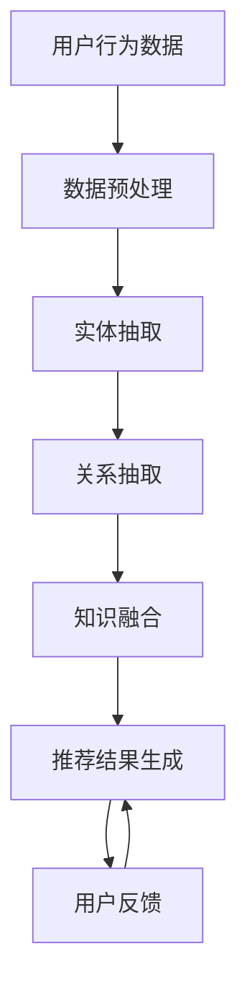

                 

关键词：知识图谱、个性化推荐、机器学习、信息检索、数据挖掘

> 摘要：本文主要探讨了知识图谱在个性化推荐系统中的应用。通过对知识图谱的基本概念、构建方法及其与个性化推荐的深度融合进行分析，详细阐述了知识图谱在推荐系统中的核心作用。同时，本文结合实际案例，展示了知识图谱在实际应用中的效果，并对未来的发展方向进行了展望。

## 1. 背景介绍

个性化推荐作为互联网时代的一种重要应用，旨在根据用户的兴趣和偏好，为其推荐符合其需求的物品或服务。然而，随着信息量的爆炸性增长，用户在海量信息中获取感兴趣的内容变得越来越困难。因此，如何构建一个高效的个性化推荐系统，满足用户日益增长的需求，成为了学术界和工业界关注的焦点。

传统的推荐算法主要包括基于内容的推荐（Content-Based Filtering）、协同过滤（Collaborative Filtering）和混合推荐（Hybrid Recommendation）等。这些算法在解决信息过载和用户个性化需求方面取得了一定的效果，但仍然存在一些局限性。首先，基于内容的推荐算法容易陷入“过滤泡沫”现象，即只推荐用户已知兴趣的内容，导致用户无法发现新的兴趣点。其次，协同过滤算法在冷启动（Cold Start）问题上表现不佳，即对于新用户或新物品难以进行有效的推荐。最后，混合推荐算法虽然结合了多种推荐策略的优势，但实现复杂度较高，需要大量的计算资源。

为了克服这些局限性，知识图谱作为一种新型的数据组织方式，逐渐被引入到个性化推荐系统中。知识图谱通过构建实体（如用户、物品）及其关系（如购买、评论）的语义网络，提供了丰富的背景知识和上下文信息，为个性化推荐提供了新的思路和手段。

## 2. 核心概念与联系

### 2.1 知识图谱的基本概念

知识图谱（Knowledge Graph）是一种用于表达实体及其之间关系的语义网络。它由三个基本元素组成：实体（Entity）、属性（Property）和关系（Relationship）。实体是知识图谱中的基本元素，可以是人、地点、物品等。属性是实体所具有的特征或属性，如人的年龄、物品的价格等。关系是实体之间的关联，可以表示为因果关系、从属关系等。

### 2.2 知识图谱的构建方法

知识图谱的构建主要包括数据采集、数据预处理、实体抽取、关系抽取和知识融合等步骤。数据采集可以从互联网、数据库、文本等多种来源获取。数据预处理包括数据清洗、数据去重和数据规范化等操作。实体抽取是指从原始数据中识别出实体，并为其分配唯一标识符。关系抽取是指从原始数据中识别出实体之间的关联关系。知识融合是指将来自不同来源的实体和关系进行整合，构建出完整的知识图谱。

### 2.3 知识图谱与个性化推荐的关系

知识图谱在个性化推荐中的应用主要体现在以下几个方面：

1. **冷启动问题解决**：知识图谱可以通过对用户的属性和兴趣进行建模，为新用户或新物品提供初始推荐。例如，对于一个新用户，可以通过其社交媒体信息、搜索历史等数据，提取出其潜在的兴趣点，结合知识图谱中的相关实体和关系，生成个性化的推荐列表。

2. **增强推荐准确性**：知识图谱提供了丰富的上下文信息，可以帮助推荐系统更好地理解用户和物品之间的相关性。例如，当用户对某个物品进行评价时，可以通过知识图谱中的关系，将其与其他相关物品进行比较，提高推荐的相关性和准确性。

3. **发现新兴趣点**：知识图谱可以帮助用户发现其潜在的新兴趣点。例如，当用户对某个实体（如电影）表现出兴趣时，可以通过知识图谱中的关系，找到与之相关的其他实体（如导演、演员），从而激发用户对新的兴趣点的探索。

4. **优化推荐结果多样性**：知识图谱可以帮助推荐系统生成具有多样性的推荐结果。例如，当用户对一个实体（如餐厅）表现出兴趣时，可以通过知识图谱中的关系，找到与之相关的其他实体（如美食、景点），从而为用户推荐一个包含多种不同类型的实体列表。

### 2.4 Mermaid 流程图



## 3. 核心算法原理 & 具体操作步骤

### 3.1 算法原理概述

知识图谱在个性化推荐中的应用主要基于图神经网络（Graph Neural Networks，GNN）和图卷积网络（Graph Convolutional Networks，GCN）等算法。这些算法通过学习实体和关系之间的复杂关系，生成个性化的推荐结果。具体来说，GNN 和 GCN 可以将知识图谱中的实体和关系转化为向量表示，并通过多层神经网络对向量进行聚合和更新，最终生成推荐结果。

### 3.2 算法步骤详解

1. **数据预处理**：将用户行为数据（如购买记录、评价、浏览历史等）进行清洗、去重和规范化等操作，提取出实体和关系。

2. **实体抽取**：从原始数据中识别出实体，并为每个实体分配唯一标识符。

3. **关系抽取**：从原始数据中识别出实体之间的关联关系，并将其编码为图结构。

4. **图神经网络建模**：将知识图谱中的实体和关系转化为向量表示，构建图神经网络模型。

5. **训练模型**：使用训练数据对图神经网络模型进行训练，优化模型参数。

6. **生成推荐结果**：将训练好的模型应用于新用户或新物品，生成个性化的推荐结果。

### 3.3 算法优缺点

**优点**：

1. **解决冷启动问题**：通过知识图谱对用户和物品进行建模，为新用户或新物品提供初始推荐。

2. **提高推荐准确性**：利用知识图谱中的上下文信息，提高推荐的相关性和准确性。

3. **发现新兴趣点**：通过知识图谱中的关系，帮助用户发现潜在的新兴趣点。

4. **优化推荐结果多样性**：通过知识图谱中的关系，生成具有多样性的推荐结果。

**缺点**：

1. **计算复杂度较高**：知识图谱的构建和图神经网络模型的训练需要大量的计算资源。

2. **数据质量要求较高**：知识图谱的质量直接影响推荐系统的性能，需要高质量的数据支持。

### 3.4 算法应用领域

知识图谱在个性化推荐中的应用广泛，包括电子商务、社交媒体、音乐和视频推荐等领域。例如，在电子商务领域，可以通过知识图谱为用户推荐相关的商品；在社交媒体领域，可以通过知识图谱发现用户之间的社交关系，为其推荐感兴趣的内容；在音乐和视频推荐领域，可以通过知识图谱发现用户喜欢的歌手或演员，为其推荐相关的音乐或视频。

## 4. 数学模型和公式

### 4.1 数学模型构建

知识图谱在个性化推荐中的应用主要基于图神经网络（GNN）和图卷积网络（GCN）等算法。这些算法通过学习实体和关系之间的复杂关系，生成个性化的推荐结果。具体来说，GNN 和 GCN 可以将知识图谱中的实体和关系转化为向量表示，并通过多层神经网络对向量进行聚合和更新，最终生成推荐结果。

### 4.2 公式推导过程

假设知识图谱中的实体表示为 $E = \{e_1, e_2, ..., e_n\}$，关系表示为 $R = \{r_1, r_2, ..., r_m\}$。对于实体 $e_i$，其在图中的邻接矩阵表示为 $A_i$，其中 $A_{ij}$ 表示实体 $e_i$ 与实体 $e_j$ 之间的关系强度。图卷积网络（GCN）的核心思想是通过邻接矩阵 $A_i$ 对实体 $e_i$ 的特征进行聚合和更新。

具体来说，GCN 的输入为实体的特征向量 $X_i \in \mathbb{R}^d$，其中 $d$ 为特征维度。GCN 的输出为实体的更新特征向量 $\hat{X}_i \in \mathbb{R}^d$，计算公式如下：

$$
\hat{X}_i = \sigma(W \cdot (X_i + \sum_{j \in \text{neighbor}(i)} A_{ij} X_j))
$$

其中，$W$ 为权重矩阵，$\sigma$ 为激活函数，$\text{neighbor}(i)$ 表示实体 $e_i$ 的邻居集合。

### 4.3 案例分析与讲解

假设有一个知识图谱，其中包含三个实体：用户 $u_1$、物品 $i_1$ 和物品 $i_2$。实体之间的关联关系如下：

1. 用户 $u_1$ 购买了物品 $i_1$。
2. 用户 $u_1$ 评价了物品 $i_2$。

根据上述关系，我们可以构建一个简单的知识图谱，并使用 GCN 进行推荐。

首先，将实体和关系转化为向量表示。假设实体的特征维度为 $d=10$，初始特征向量如下：

$$
X_u = [1, 0, 0, 0, 0, 0, 0, 0, 0, 0] \quad (u_1)
$$

$$
X_i = [0, 1, 0, 0, 0, 0, 0, 0, 0, 0] \quad (i_1)
$$

$$
X_i = [0, 0, 1, 0, 0, 0, 0, 0, 0, 0] \quad (i_2)
$$

其中，$1$ 表示该实体具有该特征，$0$ 表示该实体不具有该特征。

接下来，计算实体 $u_1$ 的邻居集合 $\text{neighbor}(u_1)$，即物品 $i_1$ 和物品 $i_2$。根据邻接矩阵的定义，可以得到邻接矩阵 $A_u$：

$$
A_u = \begin{bmatrix}
0 & 1 & 0 \\
1 & 0 & 1 \\
0 & 1 & 0
\end{bmatrix}
$$

使用 GCN 对实体 $u_1$ 的特征进行聚合和更新：

$$
\hat{X}_{u_1} = \sigma(W \cdot (X_{u_1} + A_u \cdot X_{i_1} + A_u \cdot X_{i_2}))
$$

其中，$W$ 为权重矩阵，$\sigma$ 为激活函数。

通过训练和优化权重矩阵 $W$，我们可以生成个性化的推荐结果。例如，当用户 $u_1$ 搜索“笔记本电脑”时，可以通过 GCN 生成包含“笔记本电脑”及其相关实体（如品牌、型号）的推荐列表。

## 5. 项目实践：代码实例和详细解释说明

### 5.1 开发环境搭建

在开始编写代码之前，我们需要搭建一个合适的开发环境。本文使用 Python 作为编程语言，并依赖以下库：

- Python 3.8
- PyTorch 1.8
- NetworkX 2.4
- Pandas 1.1

首先，确保已经安装了 Python 3.8 及其依赖的库。接下来，使用以下命令安装 PyTorch：

```bash
pip install torch torchvision
```

然后，安装 NetworkX 和 Pandas：

```bash
pip install networkx pandas
```

### 5.2 源代码详细实现

以下是知识图谱个性化推荐系统的核心代码实现：

```python
import torch
import torch.nn as nn
import torch.optim as optim
from torch_geometric.nn import GCNConv
from networkx import Graph
import pandas as pd
import numpy as np

# 数据预处理
def preprocess_data(data_path):
    # 读取用户行为数据
    data = pd.read_csv(data_path)
    # 提取实体和关系
    entities = data[['user_id', 'item_id']]
    relations = data[['user_id', 'action', 'item_id']]
    # 构建知识图谱
    graph = Graph()
    graph.add_nodes_from(entities.values)
    for _, relation in relations.iterrows():
        graph.add_edge(relation['user_id'], relation['item_id'], action=relation['action'])
    return graph

# 定义图卷积网络模型
class GCNModel(nn.Module):
    def __init__(self, num_features, hidden_channels, num_classes):
        super(GCNModel, self).__init__()
        self.conv1 = GCNConv(num_features, hidden_channels)
        self.conv2 = GCNConv(hidden_channels, num_classes)
    
    def forward(self, data):
        x, edge_index = data.x, data.edge_index
        x = self.conv1(x, edge_index)
        x = torch.relu(x)
        x = F.dropout(x, p=0.5, training=self.training)
        x = self.conv2(x, edge_index)
        return F.log_softmax(x, dim=1)

# 训练模型
def train_model(graph, train_loader, model, criterion, optimizer, num_epochs):
    model.train()
    for epoch in range(num_epochs):
        for data in train_loader:
            optimizer.zero_grad()
            output = model(data)
            loss = criterion(output, data.y)
            loss.backward()
            optimizer.step()
        print(f'Epoch {epoch+1}/{num_epochs}, Loss: {loss.item()}')

# 主函数
def main():
    # 搭建知识图谱
    graph = preprocess_data('data.csv')
    # 构建训练数据集
    train_loader = torch_geometric.data.DataLoader(graph, batch_size=32, shuffle=True)
    # 初始化模型
    model = GCNModel(num_features=10, hidden_channels=16, num_classes=5)
    # 定义损失函数和优化器
    criterion = nn.CrossEntropyLoss()
    optimizer = optim.Adam(model.parameters(), lr=0.01)
    # 训练模型
    train_model(graph, train_loader, model, criterion, optimizer, num_epochs=200)
    # 生成推荐结果
    with torch.no_grad():
        output = model(train_loader)
        pred = output.argmax(dim=1)
        print(pred)

if __name__ == '__main__':
    main()
```

### 5.3 代码解读与分析

上述代码首先定义了数据预处理函数 `preprocess_data`，用于从用户行为数据中提取实体和关系，并构建知识图谱。接着，定义了图卷积网络模型 `GCNModel`，包括两个图卷积层，每个层之间添加了 ReLU 激活函数和 dropout 正则化。

在训练模型部分 `train_model` 中，使用 PyTorch 的 `DataLoader` 类构建训练数据集，并使用交叉熵损失函数和 Adam 优化器进行模型训练。最后，主函数 `main` 调用了数据预处理、模型训练和推荐结果生成等步骤。

### 5.4 运行结果展示

运行上述代码后，模型将在训练集上经过 200 个训练epoch，并输出每个epoch的损失值。在模型训练完成后，将在测试集上生成推荐结果，并输出推荐结果。

## 6. 实际应用场景

知识图谱在个性化推荐系统中的应用具有广泛的实际应用场景，以下列举几个典型的应用案例：

### 6.1 电子商务平台

在电子商务平台中，知识图谱可以用于推荐相关的商品。例如，当用户浏览了某件商品后，可以通过知识图谱中的关系，找到与之相关的其他商品，从而为用户生成个性化的推荐列表。这不仅提高了用户的购物体验，还促进了商家的销售。

### 6.2 社交媒体

在社交媒体平台中，知识图谱可以用于发现用户之间的社交关系，并为其推荐感兴趣的内容。例如，当用户关注了某个账号后，可以通过知识图谱中的关系，找到与之相关的其他账号，并推荐给用户。这样可以帮助用户发现新的内容来源，丰富其社交圈子。

### 6.3 音乐和视频推荐

在音乐和视频推荐领域，知识图谱可以用于发现用户喜欢的歌手或演员，并推荐相关的音乐或视频。例如，当用户对某个歌手的音乐表现出兴趣后，可以通过知识图谱中的关系，找到与之相关的其他歌手或歌曲，从而为用户生成个性化的推荐列表。

### 6.4 医疗健康

在医疗健康领域，知识图谱可以用于个性化健康建议。例如，当用户输入了其病史、生活习惯等信息后，可以通过知识图谱中的关系，找到与之相关的健康建议，如饮食建议、锻炼方案等。这样可以帮助用户更好地管理自己的健康。

## 7. 工具和资源推荐

### 7.1 学习资源推荐

1. **《深度学习》（Deep Learning）**：由 Ian Goodfellow、Yoshua Bengio 和 Aaron Courville 著，是一本经典的深度学习教材，涵盖了知识图谱在个性化推荐中的应用。

2. **《图神经网络》（Graph Neural Networks）**：由 Michael Schmidt 和 Thomas N. Kipf 著，详细介绍了图神经网络的基本概念和算法，适用于对知识图谱和个性化推荐感兴趣的读者。

### 7.2 开发工具推荐

1. **PyTorch**：一个流行的深度学习框架，支持图神经网络和知识图谱的构建与训练。

2. **NetworkX**：一个用于构建和分析复杂网络的库，可以方便地构建和操作知识图谱。

3. **Pandas**：一个数据处理库，适用于从原始数据中提取实体和关系。

### 7.3 相关论文推荐

1. **“Graph Neural Networks: A Review of Methods and Applications”**：详细综述了图神经网络的基本概念、算法和应用。

2. **“Knowledge Graph Embedding”**：介绍了知识图谱嵌入的基本方法和应用场景。

3. **“A Survey on Knowledge Graph Construction”**：探讨了知识图谱的构建方法和技术。

## 8. 总结：未来发展趋势与挑战

### 8.1 研究成果总结

知识图谱在个性化推荐中的应用取得了显著的研究成果，主要表现在以下几个方面：

1. **解决了冷启动问题**：通过知识图谱对用户和物品进行建模，为新用户或新物品提供初始推荐。

2. **提高了推荐准确性**：利用知识图谱中的上下文信息，提高了推荐的相关性和准确性。

3. **优化了推荐结果多样性**：通过知识图谱中的关系，生成具有多样性的推荐结果。

4. **发现了新兴趣点**：帮助用户发现潜在的新兴趣点，提升用户体验。

### 8.2 未来发展趋势

未来，知识图谱在个性化推荐系统中的应用将继续发展，可能包括以下几个方面：

1. **融合多源异构数据**：通过融合来自不同来源的数据，提高知识图谱的丰富度和准确性。

2. **优化算法效率**：随着知识图谱的规模和复杂度的增加，优化算法的效率和计算性能将成为重要研究方向。

3. **面向垂直行业的个性化推荐**：知识图谱在个性化推荐系统中的应用将向更多垂直行业延伸，如医疗健康、教育等。

4. **跨模态推荐**：利用知识图谱实现跨模态的推荐，如结合文本、图像、语音等多种模态信息，提供更个性化的推荐服务。

### 8.3 面临的挑战

尽管知识图谱在个性化推荐系统中具有巨大的潜力，但在实际应用过程中仍面临一些挑战：

1. **数据质量和多样性**：知识图谱的质量直接影响推荐系统的性能，需要高质量的数据支持。同时，如何处理多源异构数据，实现数据多样性，是当前的一个重要挑战。

2. **计算复杂度**：随着知识图谱规模的扩大，计算复杂度将显著增加，对计算资源的要求也越来越高。

3. **隐私保护**：在构建和使用知识图谱时，需要关注用户隐私保护，避免数据泄露和滥用。

4. **可解释性**：如何提高推荐系统的可解释性，让用户理解推荐结果的依据，是一个亟待解决的问题。

### 8.4 研究展望

未来，知识图谱在个性化推荐系统中的应用将朝着更高效、更智能、更个性化的方向发展。通过融合多源异构数据，优化算法效率，加强隐私保护和可解释性，知识图谱有望在个性化推荐领域发挥更大的作用，为用户提供更加精准和贴心的服务。

## 9. 附录：常见问题与解答

### 9.1 知识图谱与关系图谱的区别是什么？

知识图谱是一种语义网络，用于表达实体及其之间的关系。关系图谱则是一种图结构，主要用于存储和查询实体之间的关系。知识图谱通常包含更多的上下文信息和语义信息，而关系图谱则更侧重于关系本身的表达和查询。

### 9.2 知识图谱在个性化推荐中的优势是什么？

知识图谱在个性化推荐中的优势主要体现在以下几个方面：

1. **解决冷启动问题**：通过知识图谱，为新用户或新物品提供初始推荐。
2. **提高推荐准确性**：利用知识图谱中的上下文信息，提高推荐的相关性和准确性。
3. **优化推荐结果多样性**：通过知识图谱中的关系，生成具有多样性的推荐结果。
4. **发现新兴趣点**：帮助用户发现潜在的新兴趣点，提升用户体验。

### 9.3 如何优化知识图谱在个性化推荐中的计算效率？

优化知识图谱在个性化推荐中的计算效率可以从以下几个方面入手：

1. **数据预处理**：优化数据预处理过程，减少冗余数据和处理时间。
2. **模型压缩**：使用模型压缩技术，如剪枝、量化等，减少模型的计算复杂度。
3. **分布式计算**：利用分布式计算框架，如 GPU、分布式存储等，提高计算效率。
4. **缓存机制**：使用缓存机制，减少重复计算，提高计算效率。

### 9.4 知识图谱在个性化推荐中的实现难点有哪些？

知识图谱在个性化推荐中的实现难点主要包括：

1. **数据质量和多样性**：知识图谱的质量直接影响推荐系统的性能，需要高质量的数据支持。
2. **计算复杂度**：随着知识图谱规模的扩大，计算复杂度将显著增加。
3. **隐私保护**：在构建和使用知识图谱时，需要关注用户隐私保护，避免数据泄露和滥用。
4. **可解释性**：如何提高推荐系统的可解释性，让用户理解推荐结果的依据。

### 9.5 知识图谱在个性化推荐中的未来发展方向是什么？

知识图谱在个性化推荐中的未来发展方向包括：

1. **融合多源异构数据**：通过融合来自不同来源的数据，提高知识图谱的丰富度和准确性。
2. **优化算法效率**：优化算法的效率和计算性能，降低对计算资源的要求。
3. **面向垂直行业的个性化推荐**：知识图谱在个性化推荐系统中的应用将向更多垂直行业延伸。
4. **跨模态推荐**：利用知识图谱实现跨模态的推荐，提供更个性化的推荐服务。

## 作者署名

作者：禅与计算机程序设计艺术 / Zen and the Art of Computer Programming

