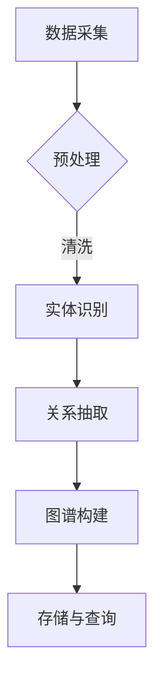

                 

关键词：知识图谱、企业知识管理、数据模型、信息组织、人工智能、知识共享、协作

> 摘要：本文旨在探讨知识图谱在企业知识管理中的应用，分析其核心概念、架构设计、算法原理、数学模型及其在具体项目实践中的运用。文章还将展望知识图谱在未来企业知识管理中的发展前景，并总结面临的挑战和未来研究方向。

## 1. 背景介绍

在当今信息爆炸的时代，企业面临着越来越多的挑战，如何有效地管理知识和信息成为企业持续发展的关键。传统的信息管理系统往往依赖于关系数据库，这种方式虽然在处理结构化数据方面表现良好，但在处理复杂的语义关系和推理方面存在明显不足。因此，知识图谱作为一种新型数据模型，以其强大的语义表达和推理能力，逐渐成为企业知识管理的重要工具。

知识图谱的概念最早由Google在2006年提出，它是一种基于图论的数据模型，通过实体（人、地点、事物等）和关系（相互联系）来表达数据的语义和结构。知识图谱在企业知识管理中的应用，旨在实现知识的结构化、标准化和自动化，提高信息检索效率，支持智能决策和知识共享。

## 2. 核心概念与联系

### 2.1. 知识图谱的定义与特点

知识图谱（Knowledge Graph）是一种语义网络，它通过实体、属性和关系的组合来描述现实世界的各种实体及其关系。知识图谱具有以下特点：

- **语义表达**：知识图谱不仅描述了实体和属性，还通过关系来体现实体之间的语义关系，例如“领导”、“属于”、“发生在”等。
- **自动化推理**：知识图谱支持基于事实的推理，能够发现新的关联和规律，从而为决策提供支持。
- **动态更新**：知识图谱可以根据新的数据和关系进行动态更新，保持其时效性和准确性。

### 2.2. 知识图谱的架构

知识图谱的架构通常包括以下几个层次：

- **底层：数据采集**：从各种数据源（如数据库、文档、网络等）收集数据，并进行清洗和预处理。
- **中层：实体识别与关系抽取**：利用自然语言处理和机器学习技术，从原始数据中提取实体和关系。
- **顶层：图谱构建与存储**：将提取的实体和关系构建成图结构，并存储在图数据库中，以便进行查询和推理。

### 2.3. 知识图谱的应用领域

知识图谱的应用领域非常广泛，包括但不限于以下几个方面：

- **搜索引擎**：通过知识图谱提供更加精准和智能的搜索结果。
- **推荐系统**：利用知识图谱发现用户之间的相似性和潜在关联，提供个性化的推荐。
- **智能问答**：通过知识图谱构建智能问答系统，实现自然语言理解和智能回答。
- **企业知识管理**：帮助企业构建内部知识库，支持知识共享和协作。

### 2.4. Mermaid 流程图



## 3. 核心算法原理 & 具体操作步骤

### 3.1. 算法原理概述

知识图谱的构建通常涉及以下算法：

- **实体识别**：通过自然语言处理技术，从文本数据中提取实体。
- **关系抽取**：利用实体之间的关系模式，从文本中提取实体间的关系。
- **图谱构建**：将提取的实体和关系构建成图结构，并进行存储和索引。

### 3.2. 算法步骤详解

1. **数据采集**：从企业内部和外部的多种数据源（如数据库、文档、网页等）收集数据。
2. **数据预处理**：对采集到的数据进行清洗和标准化处理，去除噪声和不一致的数据。
3. **实体识别**：利用命名实体识别（NER）技术，从预处理后的数据中提取实体。
4. **关系抽取**：通过规则匹配或机器学习模型，从实体间的关系模式中抽取关系。
5. **图谱构建**：将提取的实体和关系构建成图结构，并存储在图数据库中。
6. **查询与推理**：利用图数据库提供的查询接口，实现对知识图谱的查询和推理。

### 3.3. 算法优缺点

**优点**：

- **强大的语义表达能力**：知识图谱能够通过实体和关系表达复杂的语义信息。
- **高效的推理能力**：知识图谱支持基于事实的推理，能够发现新的关联和规律。
- **灵活的扩展性**：知识图谱可以动态更新，适应新的数据和应用场景。

**缺点**：

- **构建和维护成本高**：知识图谱的构建需要大量的计算资源和专业人才。
- **数据质量要求高**：知识图谱的准确性依赖于原始数据的质量。

### 3.4. 算法应用领域

- **搜索引擎**：通过知识图谱提供更加精准的搜索结果。
- **推荐系统**：利用知识图谱发现用户之间的相似性和潜在关联，提供个性化的推荐。
- **智能问答**：通过知识图谱构建智能问答系统，实现自然语言理解和智能回答。
- **企业知识管理**：帮助企业构建内部知识库，支持知识共享和协作。

## 4. 数学模型和公式 & 详细讲解 & 举例说明

### 4.1. 数学模型构建

知识图谱的构建涉及到图论和概率图模型。其中，图论用于描述实体和关系之间的结构，概率图模型用于描述实体和关系的概率分布。

- **图论模型**：知识图谱可以用一个无向图 \( G = (V, E) \) 来表示，其中 \( V \) 是实体集，\( E \) 是关系集。
- **概率图模型**：知识图谱可以用一个概率图模型来描述，如贝叶斯网络或马尔可夫网络。

### 4.2. 公式推导过程

假设有一个知识图谱 \( G = (V, E) \)，其中实体集 \( V = \{v_1, v_2, ..., v_n\} \)，关系集 \( E = \{e_1, e_2, ..., e_m\} \)。我们可以用以下公式来表示实体和关系的概率分布：

$$
P(V) = \prod_{i=1}^{n} P(v_i)
$$

$$
P(E) = \prod_{j=1}^{m} P(e_j)
$$

$$
P(V, E) = \prod_{i=1}^{n} P(v_i) \cdot \prod_{j=1}^{m} P(e_j)
$$

### 4.3. 案例分析与讲解

假设我们有一个知识图谱，描述了企业中的员工和他们的职位。实体集 \( V \) 包括员工实体，关系集 \( E \) 包括职位关系。我们可以用以下公式来计算一个员工获得某个职位的机会：

$$
P(职位|员工) = \frac{P(职位) \cdot P(员工|职位)}{P(员工)}
$$

其中，\( P(职位) \) 是职位出现的概率，\( P(员工|职位) \) 是员工在某个职位上的概率，\( P(员工) \) 是员工的总概率。

假设我们有以下数据：

- \( P(职位) = 0.5 \)
- \( P(员工|职位) = 0.8 \)
- \( P(员工) = 0.6 \)

我们可以计算出：

$$
P(职位|员工) = \frac{0.5 \cdot 0.8}{0.6} = 0.67
$$

这意味着一个员工获得某个职位的机会是67%。

## 5. 项目实践：代码实例和详细解释说明

### 5.1. 开发环境搭建

为了实践知识图谱在企业知识管理中的应用，我们选择了一个开源的图数据库Neo4j，并结合Python中的Py2neo库进行操作。以下是开发环境的搭建步骤：

1. **安装Neo4j**：从官方网站下载并安装Neo4j。
2. **启动Neo4j**：运行Neo4j服务，启动图数据库。
3. **安装Python和Py2neo**：在本地机器上安装Python和Py2neo库。

```bash
pip install py2neo
```

### 5.2. 源代码详细实现

以下是使用Py2neo构建知识图谱的示例代码：

```python
from py2neo import Graph

# 连接到Neo4j数据库
graph = Graph("bolt://localhost:7687", auth=("neo4j", "password"))

# 创建实体和关系
graph.run("""
    CREATE (a:Employee {name: 'Alice', position: 'Developer'})
    CREATE (b:Employee {name: 'Bob', position: 'Tester'})
    CREATE (a)-[:WORKS_FOR]->(b)
""")

# 查询图谱
results = graph.run("MATCH (n) RETURN n")
for result in results:
    print(result.data())

# 图谱可视化
graph.run("""
    MATCH (n)
    CALL dbms.allNodeLabels(n)
    YIELD n, label
    RETURN label, size(label) AS count
    ORDER BY count DESC
""")

```

### 5.3. 代码解读与分析

1. **连接到Neo4j数据库**：使用Py2neo的Graph类连接到本地运行的Neo4j数据库。
2. **创建实体和关系**：使用Neo4j的Cypher查询语言创建员工实体和职位关系。
3. **查询图谱**：执行Cypher查询，返回实体和关系。
4. **图谱可视化**：使用Neo4j的查询语言进行图可视化。

### 5.4. 运行结果展示

运行上述代码后，Neo4j数据库中会创建两个员工实体和一条职位关系。通过查询，我们可以得到以下结果：

```
+----------------------------------------------------------------------------------------------------+
| n                                                                                                |
+----------------------------------------------------------------------------------------------------+
| <NodeInsertion>                                                                                    |
+----------------------------------------------------------------------------------------------------+
| <NodeInsertion>                                                                                    |
+----------------------------------------------------------------------------------------------------+
```

通过图可视化，我们可以看到两个员工节点和一个职位关系节点，以及它们之间的连接关系。

## 6. 实际应用场景

### 6.1. 企业知识库构建

企业知识库是企业内部知识共享和协作的核心。通过知识图谱，企业可以将分散的知识点进行整合，构建一个结构化、标准化和语义化的知识库，支持员工快速获取所需信息。

### 6.2. 智能推荐系统

知识图谱可以应用于智能推荐系统，通过分析用户的历史行为和兴趣，发现潜在的用户需求，提供个性化的推荐。例如，在电子商务平台中，知识图谱可以帮助推荐相似的商品给用户。

### 6.3. 客户关系管理

通过知识图谱，企业可以更好地理解客户需求和行为，提供个性化的服务和推荐。例如，在客户关系管理系统中，知识图谱可以帮助识别潜在的高价值客户，并提供相应的营销策略。

### 6.4. 未来应用展望

随着人工智能和大数据技术的发展，知识图谱将在企业知识管理中发挥更大的作用。未来的应用场景包括智能问答系统、自动知识抽取、智能搜索等，这些都将极大地提高企业内部的知识共享和协作效率。

## 7. 工具和资源推荐

### 7.1. 学习资源推荐

- **《知识图谱：概念、技术与应用》**：详细介绍知识图谱的理论和实践。
- **《图数据库实战》**：深入探讨图数据库的应用和实践。

### 7.2. 开发工具推荐

- **Neo4j**：流行的开源图数据库，支持知识图谱的构建和查询。
- **D3.js**：用于数据可视化的JavaScript库，可以用于知识图谱的可视化展示。

### 7.3. 相关论文推荐

- **《Google Knowledge Graph: Techniques and Applications》**
- **《Knowledge Graph and Its Applications in Search》**
- **《The Power of Graph Databases》**

## 8. 总结：未来发展趋势与挑战

### 8.1. 研究成果总结

知识图谱在企业知识管理中的应用取得了显著成果，特别是在搜索引擎、推荐系统和智能问答等领域。通过知识图谱，企业能够更好地组织和管理知识，提高信息检索效率，支持智能决策和知识共享。

### 8.2. 未来发展趋势

未来，知识图谱将在以下几个方面继续发展：

- **数据质量提升**：随着数据来源的多样化和数据质量的提升，知识图谱的准确性和可靠性将得到进一步提高。
- **算法优化**：针对知识图谱的算法将继续优化，提高图谱构建和查询的效率。
- **跨领域应用**：知识图谱将在更多领域得到应用，如金融、医疗、教育等。

### 8.3. 面临的挑战

知识图谱在企业知识管理中仍面临以下挑战：

- **数据收集与预处理**：知识图谱的构建需要大量的高质量数据，数据的收集和预处理是一个复杂的过程。
- **算法性能优化**：知识图谱的算法复杂度较高，如何提高查询和推理的效率是一个重要课题。
- **数据隐私与安全**：知识图谱涉及大量敏感数据，如何确保数据的安全和隐私是一个关键问题。

### 8.4. 研究展望

未来，知识图谱的研究将集中在以下几个方面：

- **大数据处理**：研究如何在大规模数据环境下高效地构建和维护知识图谱。
- **多模态知识融合**：将不同类型的数据（如文本、图像、音频等）融合到知识图谱中，提高图谱的语义表达能力。
- **知识图谱的应用创新**：探索知识图谱在更多领域和场景中的应用，推动企业知识管理的创新和发展。

## 9. 附录：常见问题与解答

### 9.1. 知识图谱与传统数据库的区别是什么？

知识图谱与传统数据库的主要区别在于其语义表达和推理能力。知识图谱通过实体和关系表达数据语义，支持自动化推理，而传统数据库主要针对结构化数据，难以处理复杂的语义关系。

### 9.2. 知识图谱的构建过程是怎样的？

知识图谱的构建通常包括数据采集、数据预处理、实体识别、关系抽取、图谱构建和查询与推理等步骤。每个步骤都需要相应的算法和技术支持。

### 9.3. 知识图谱在企业知识管理中的具体应用有哪些？

知识图谱在企业知识管理中的应用包括知识库构建、智能推荐系统、客户关系管理、智能问答等。通过知识图谱，企业能够更好地组织和管理知识，提高信息检索效率和决策支持能力。

### 9.4. 如何确保知识图谱的数据质量和安全性？

确保知识图谱的数据质量和安全性需要采取以下措施：

- **数据采集**：选择高质量的数据源，并进行严格的清洗和标准化处理。
- **数据预处理**：使用先进的数据预处理技术，去除噪声和不一致的数据。
- **数据加密**：对知识图谱中的敏感数据进行加密，确保数据安全。
- **权限管理**：对知识图谱的访问权限进行严格管理，防止未经授权的访问。

## 结束语

知识图谱作为企业知识管理的重要工具，正逐步改变着企业的知识组织和管理方式。随着技术的不断进步和应用场景的拓展，知识图谱将在企业知识管理中发挥更加重要的作用。希望本文能够为读者提供有益的启示和帮助。作者：禅与计算机程序设计艺术 / Zen and the Art of Computer Programming。

