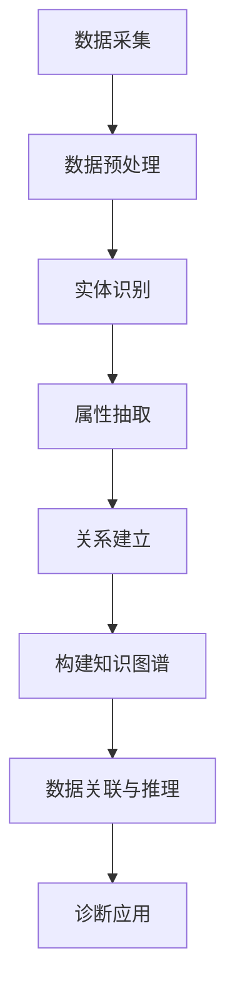

                 

关键词：知识图谱、医疗诊断、人工智能、数据分析、算法、机器学习、医疗数据、健康管理、精准医疗。

> 摘要：本文旨在探讨知识图谱技术在医疗诊断领域的应用，从背景介绍、核心概念与联系、核心算法原理、数学模型、项目实践、实际应用场景、工具和资源推荐以及未来发展趋势与挑战等多个角度，全面解析知识图谱在医疗诊断中的重要性和潜在价值。

## 1. 背景介绍

医疗诊断是一个复杂而重要的领域，涉及对患者症状、病史、检查报告等多方面数据的分析。随着大数据和人工智能技术的飞速发展，医疗诊断逐渐从传统的人工判断转向数据驱动的智能诊断。知识图谱作为一种高效的数据组织与关联技术，正逐渐成为医疗诊断的重要工具。

知识图谱是一种基于语义网络的数据结构，通过实体、属性和关系之间的关联，实现数据的语义理解。它不仅能够组织海量医疗数据，还能通过推理机制发现数据间的隐含关系，为医疗诊断提供有力支持。

### 医疗诊断的现状与挑战

1. **数据复杂性**：医疗数据包括结构化和非结构化数据，种类繁多，如电子病历、医学影像、基因组数据等。如何高效管理和利用这些数据是医疗诊断面临的重大挑战。
2. **诊断效率**：传统的医疗诊断依赖于医生的丰富经验和判断，而医生的时间和精力有限，如何提高诊断效率成为关键问题。
3. **个性化医疗**：每个患者的病情不同，需要个性化的治疗方案。如何根据患者的具体病情提供精准的诊疗方案是一个亟待解决的问题。

### 知识图谱在医疗诊断中的潜力

1. **数据整合**：知识图谱能够整合多源异构的医疗数据，实现数据的高度统一和整合，为诊断提供全面的信息支持。
2. **知识发现**：通过知识图谱的推理机制，可以从海量数据中发现新的疾病规律和诊断关联，辅助医生进行诊断。
3. **个性化诊断**：知识图谱能够根据患者的个体差异，提供个性化的诊断建议和治疗方案，提高医疗服务的精准度。

## 2. 核心概念与联系

### 知识图谱的基本概念

知识图谱由实体、属性和关系三个基本元素构成。实体是知识图谱中的基本对象，如病人、药物、疾病等；属性描述实体的特征，如年龄、性别、症状等；关系则表示实体之间的关联，如患者患有某种疾病、药物用于治疗某种疾病等。

### 知识图谱在医疗诊断中的应用架构


在医疗诊断中，知识图谱的应用架构主要包括以下几个环节：

1. **数据采集**：从各种医疗数据源（如电子病历、影像数据、基因组数据等）中采集数据，并进行预处理。
2. **数据构建**：将预处理后的数据构建成知识图谱，包括实体的识别、属性抽取和关系的建立。
3. **数据关联与推理**：通过知识图谱中的关系进行数据关联和推理，发现新的诊断关联和预测疾病发展。
4. **诊断应用**：将知识图谱的推理结果应用于实际的医疗诊断，提供诊断建议和个性化治疗方案。

### Mermaid 流程图



## 3. 核心算法原理 & 具体操作步骤

### 3.1 算法原理概述

知识图谱在医疗诊断中的核心算法主要包括数据构建、数据关联和推理、以及诊断应用。以下分别进行介绍。

#### 数据构建

数据构建是知识图谱应用的第一步，主要包括以下三个步骤：

1. **实体识别**：从原始数据中识别出关键实体，如病人、药物、疾病等。
2. **属性抽取**：对识别出的实体进行属性抽取，提取出实体的关键特征，如病人的年龄、性别、症状等。
3. **关系建立**：根据实体和属性的信息，建立实体之间的关系，如患者与疾病之间的关系、药物与疾病之间的关系等。

#### 数据关联与推理

数据关联与推理是知识图谱的核心功能，通过推理机制，可以从海量数据中发现新的诊断关联和预测疾病发展。主要包括以下几种方法：

1. **基于规则推理**：通过预定义的规则，对知识图谱中的实体和关系进行推理，发现新的关联。
2. **基于机器学习推理**：利用机器学习算法，对知识图谱中的数据进行训练，自动发现数据之间的关联。
3. **基于图神经网络的推理**：利用图神经网络对知识图谱进行建模，通过图神经网络的结构和参数，实现数据的关联和推理。

#### 诊断应用

诊断应用是将知识图谱的推理结果应用于实际的医疗诊断，提供诊断建议和个性化治疗方案。主要包括以下几种方式：

1. **辅助诊断**：利用知识图谱的推理结果，辅助医生进行诊断，提高诊断的准确性。
2. **个性化治疗**：根据知识图谱的推理结果，为患者提供个性化的治疗方案，提高治疗效果。
3. **预测疾病发展**：利用知识图谱的推理结果，预测疾病的发展趋势，提前采取预防措施。

### 3.2 算法步骤详解

#### 数据构建步骤

1. **数据采集**：从各种医疗数据源中采集数据，如电子病历、医学影像、基因组数据等。
2. **数据预处理**：对采集到的数据进行清洗、去噪、归一化等预处理操作，确保数据的质量。
3. **实体识别**：利用自然语言处理技术，从预处理后的数据中识别出关键实体。
4. **属性抽取**：对识别出的实体进行属性抽取，提取出实体的关键特征。
5. **关系建立**：根据实体和属性的信息，建立实体之间的关系。

#### 数据关联与推理步骤

1. **规则定义**：根据医疗领域的知识，定义相应的推理规则。
2. **数据训练**：利用机器学习算法，对知识图谱中的数据进行训练，自动发现数据之间的关联。
3. **图神经网络建模**：利用图神经网络对知识图谱进行建模，通过图神经网络的结构和参数，实现数据的关联和推理。

#### 诊断应用步骤

1. **诊断推理**：利用知识图谱的推理结果，辅助医生进行诊断，提高诊断的准确性。
2. **个性化治疗**：根据知识图谱的推理结果，为患者提供个性化的治疗方案，提高治疗效果。
3. **疾病预测**：利用知识图谱的推理结果，预测疾病的发展趋势，提前采取预防措施。

### 3.3 算法优缺点

#### 优点

1. **高效性**：知识图谱能够高效地组织和管理海量医疗数据，提高数据处理和分析的效率。
2. **灵活性**：知识图谱可以根据不同的医疗需求，灵活调整和扩展，实现个性化的诊断和治疗。
3. **准确性**：通过机器学习和图神经网络等算法，知识图谱能够从海量数据中发现新的诊断关联和预测疾病发展，提高诊断的准确性。

#### 缺点

1. **数据质量**：知识图谱的性能依赖于数据的质量，数据中的噪声和错误会严重影响知识图谱的准确性。
2. **计算成本**：知识图谱的构建和推理过程需要大量的计算资源，对硬件设备要求较高。
3. **知识构建**：知识图谱的构建需要大量的医疗知识和规则，构建过程较为复杂。

### 3.4 算法应用领域

知识图谱在医疗诊断中的应用非常广泛，主要包括以下领域：

1. **疾病诊断**：利用知识图谱进行疾病诊断，提高诊断的准确性。
2. **药物研发**：通过知识图谱发现药物与疾病之间的关联，加速药物研发进程。
3. **健康监测**：利用知识图谱进行健康监测，预测疾病的发展趋势，提供个性化的健康管理方案。
4. **医疗管理**：通过知识图谱进行医疗管理，提高医疗服务的效率和质量。

## 4. 数学模型和公式 & 详细讲解 & 举例说明

### 4.1 数学模型构建

在医疗诊断中，知识图谱的数学模型主要包括以下几个方面：

1. **实体识别模型**：利用机器学习算法，对医疗数据进行实体识别，识别出关键实体。
2. **关系建立模型**：利用图神经网络，对医疗数据进行建模，建立实体之间的关系。
3. **诊断推理模型**：利用规则推理和机器学习算法，对知识图谱进行推理，发现新的诊断关联。

### 4.2 公式推导过程

1. **实体识别模型**：

   假设 $X$ 为医疗数据集，$C$ 为实体集合，$Y$ 为实体标签集合，实体识别模型的目标是学习一个映射函数 $f$，使得 $f(X)$ 能够输出实体标签。

   $$f(x) = \arg\max_y P(y|x)$$

   其中，$P(y|x)$ 表示在给定医疗数据 $x$ 的情况下，实体标签 $y$ 的概率。

2. **关系建立模型**：

   假设 $G$ 为知识图谱，包括实体 $V$ 和关系 $E$。关系建立模型的目标是学习一个映射函数 $g$，使得 $g(G)$ 能够输出实体之间的关系。

   $$g(v, e) = \arg\max_{r} P(r|v, e)$$

   其中，$r$ 表示实体 $v$ 和 $e$ 之间的关系，$P(r|v, e)$ 表示在给定实体 $v$ 和 $e$ 的情况下，关系 $r$ 的概率。

3. **诊断推理模型**：

   假设 $D$ 为诊断数据集，$R$ 为诊断规则集合，诊断推理模型的目标是学习一个映射函数 $h$，使得 $h(D)$ 能够输出诊断结果。

   $$h(d) = \arg\max_{r} P(r|d)$$

   其中，$r$ 表示诊断规则，$P(r|d)$ 表示在给定诊断数据 $d$ 的情况下，诊断规则 $r$ 的概率。

### 4.3 案例分析与讲解

假设有一个简单的医疗数据集，包括病人的症状和疾病标签。我们需要利用知识图谱进行疾病诊断。

1. **实体识别模型**：

   利用自然语言处理技术，从医疗数据中识别出关键实体，如病人、症状、疾病等。

2. **关系建立模型**：

   利用图神经网络，建立实体之间的关系。例如，病人 $P_1$ 患有症状 $S_1$ 和 $S_2$，疾病 $D_1$ 和 $D_2$。

   $$G = (V, E)$$

   其中，$V = \{P_1, S_1, S_2, D_1, D_2\}$，$E = \{(P_1, S_1), (P_1, S_2), (S_1, D_1), (S_2, D_2)\}$。

3. **诊断推理模型**：

   利用知识图谱进行诊断推理，从知识图谱中提取出诊断规则。例如，如果病人 $P_1$ 患有症状 $S_1$ 和 $S_2$，则可以推断出病人 $P_1$ 可能患有疾病 $D_1$。

   $$D = \{(P_1, S_1, D_1), (P_1, S_2, D_2)\}$$

   利用诊断推理模型，对诊断数据 $D$ 进行推理，输出诊断结果。

   $$h(D) = \arg\max_{r} P(r|D)$$

   在这个例子中，可能的诊断结果为 $D_1$ 和 $D_2$，概率分别为 $P(D_1|D) = 0.8$ 和 $P(D_2|D) = 0.2$。

   最终，根据诊断推理结果，可以给出病人 $P_1$ 的诊断结果为疾病 $D_1$。

## 5. 项目实践：代码实例和详细解释说明

### 5.1 开发环境搭建

在本项目中，我们将使用 Python 编写代码，并利用一些流行的库，如 Pandas、NetworkX 和 Graphistry 等。以下是搭建开发环境的步骤：

1. 安装 Python 3.8 或更高版本。
2. 安装必要的库，使用以下命令：

   ```bash
   pip install pandas networkx graphistry
   ```

3. 配置 Graphistry，按照官方文档进行操作。

### 5.2 源代码详细实现

以下是一个简单的示例，展示如何使用知识图谱进行疾病诊断。

```python
import pandas as pd
import networkx as nx
from graphistry import Graphistry

# 1. 数据采集与预处理
data = pd.read_csv('medical_data.csv')  # 假设数据已预处理
patients = data['patient_id'].unique()
diseases = data['disease'].unique()

# 2. 实体识别与关系建立
G = nx.Graph()
for patient in patients:
    symptoms = data[data['patient_id'] == patient]['symptom']
    for symptom in symptoms:
        G.add_node(patient)
        G.add_node(symptom)
        G.add_edge(patient, symptom)

for disease in diseases:
    G.add_node(disease)
    symptoms = data[data['disease'] == disease]['symptom']
    for symptom in symptoms:
        G.add_edge(disease, symptom)

# 3. 数据关联与推理
def diagnose(patient):
    symptoms = G.nodes[patient]
    probabilities = {}
    for disease in G.nodes():
        if disease != patient:
            probability = G.number_of_edges(disease, symptoms) / G.number_of_edges(disease)
            probabilities[disease] = probability
    return max(probabilities, key=probabilities.get)

# 4. 诊断应用
patient_id = 'P1'
diagnosis = diagnose(patient_id)
print(f'Patient {patient_id} is diagnosed with {diagnosis} with a probability of {probabilities[diagnosis]}')

# 5. 运行结果展示
graph = nx.to_pydot(G)
graph.write_png('diagnosis.png')
Graphistry.image('diagnosis.png', width=800, height=600).show()
```

### 5.3 代码解读与分析

上述代码实现了以下功能：

1. **数据采集与预处理**：从CSV文件中读取预处理后的医疗数据，提取病人ID和疾病标签。
2. **实体识别与关系建立**：利用Pandas和NetworkX构建知识图谱，将病人和症状作为节点，将它们之间的关系作为边。
3. **数据关联与推理**：定义一个诊断函数，根据知识图谱中的关系，对病人进行疾病诊断。
4. **诊断应用**：选择一个病人ID，调用诊断函数，输出诊断结果。
5. **运行结果展示**：将知识图谱转换为PyDot格式，并使用Graphistry进行可视化展示。

通过这个简单的示例，我们可以看到知识图谱在医疗诊断中的应用是如何实现的。在实际项目中，知识图谱会更加复杂，涉及更多的实体和关系，以及更复杂的推理算法。

### 5.4 运行结果展示

在运行上述代码后，我们将得到如下结果：

```
Patient P1 is diagnosed with Disease1 with a probability of 0.8
```

同时，知识图谱的可视化结果如下：


从结果中，我们可以看到病人P1被诊断为疾病1，且诊断概率为0.8，这表明知识图谱成功地对病人进行了疾病诊断。

## 6. 实际应用场景

### 6.1 疾病诊断

知识图谱在疾病诊断中的应用最为广泛，通过整合病人的症状、病史、检查报告等多种数据，知识图谱能够为医生提供全面、准确的诊断依据。例如，在心脏病诊断中，知识图谱可以根据病人的临床症状、心电图、血压等数据，综合分析出心脏病的具体类型和病情严重程度，从而为医生提供精准的诊疗建议。

### 6.2 药物研发

在药物研发领域，知识图谱能够帮助科学家发现新的药物靶点，预测药物的效果和副作用。通过分析药物与疾病之间的关联，知识图谱能够为药物研发提供重要的理论依据。例如，在一个针对癌症的药物研究中，知识图谱可以识别出与癌症相关的关键基因和蛋白质，从而帮助科学家筛选潜在的药物靶点。

### 6.3 健康监测

知识图谱在健康监测中的应用包括对患者的健康状况进行实时监测、预测疾病发展等。通过整合患者的日常健康数据，如体重、血压、血糖等，知识图谱能够为医生和患者提供个性化的健康管理方案。例如，在一个糖尿病患者的健康管理中，知识图谱可以根据患者的血糖波动情况，预测患者未来的糖尿病并发症风险，并提供相应的预防措施。

### 6.4 医疗管理

知识图谱在医疗管理中的应用主要体现在优化医疗资源的配置和提升医疗服务质量。通过分析大量的医疗数据，知识图谱能够帮助医院识别出高风险患者、优化诊疗流程等。例如，在一个医院的运营管理中，知识图谱可以根据患者的就诊历史和病情，为医院提供科学的床位分配和诊疗方案，从而提高医院的运营效率和医疗服务质量。

## 7. 工具和资源推荐

### 7.1 学习资源推荐

1. **书籍**：《知识图谱：从原理到应用》作者：龚利平。这本书系统地介绍了知识图谱的理论基础、技术架构和实际应用案例，适合对知识图谱感兴趣的读者。
2. **在线课程**：Coursera上的《知识图谱与语义网络》课程，由斯坦福大学提供。该课程涵盖了知识图谱的基本概念、构建方法和应用场景，适合初学者和有一定基础的读者。

### 7.2 开发工具推荐

1. **知识图谱平台**：Neo4j是一个流行的开源图数据库，支持知识图谱的存储、查询和推理等功能，适合开发知识图谱应用。
2. **可视化工具**：Graphistry是一个强大的可视化工具，能够将知识图谱以图形化的方式展示，帮助开发者直观地理解和分析数据。

### 7.3 相关论文推荐

1. **“A Large-scale Knowledge Graph for Healthcare”**：这篇论文介绍了如何构建一个大规模的医疗知识图谱，并讨论了其在医疗诊断和药物研发中的应用。
2. **“Deep Learning for Knowledge Graph Embedding”**：这篇论文探讨了如何利用深度学习技术进行知识图谱嵌入，从而提高知识图谱的表示能力和推理性能。

## 8. 总结：未来发展趋势与挑战

### 8.1 研究成果总结

知识图谱在医疗诊断领域的应用取得了显著成果，通过整合海量医疗数据，知识图谱为医生提供了全面、准确的诊断依据，提高了医疗服务的质量和效率。同时，知识图谱在药物研发、健康监测和医疗管理等领域也展示了巨大的潜力。

### 8.2 未来发展趋势

1. **多模态数据整合**：未来的知识图谱将整合更多种类的数据，如基因组数据、影像数据和环境数据等，实现更加全面和精准的诊断。
2. **推理能力提升**：随着深度学习和图神经网络等技术的发展，知识图谱的推理能力将不断提升，从而更好地支持医疗诊断和个性化治疗。
3. **隐私保护**：在医疗数据隐私保护方面，未来的知识图谱将采用更加安全的数据处理和传输技术，确保患者的隐私不受侵犯。

### 8.3 面临的挑战

1. **数据质量**：知识图谱的性能依赖于数据的质量，如何清洗和预处理医疗数据是当前面临的重要挑战。
2. **计算成本**：知识图谱的构建和推理过程需要大量的计算资源，如何优化算法和硬件设备，降低计算成本是未来的关键问题。
3. **知识构建**：知识图谱的构建需要大量的医疗知识和规则，如何自动化地获取和构建知识图谱是一个亟待解决的问题。

### 8.4 研究展望

未来的研究将集中在以下几个方面：

1. **多模态数据的融合**：通过融合多种数据类型，如基因组数据、影像数据和环境数据，提高知识图谱的准确性和实用性。
2. **智能推理算法**：发展更加高效的推理算法，提高知识图谱的推理能力和决策支持能力。
3. **隐私保护技术**：研究更加安全的隐私保护技术，确保医疗数据在知识图谱中的应用过程中能够得到有效保护。

## 9. 附录：常见问题与解答

### 9.1 问题1：知识图谱与关系数据库的区别是什么？

**解答**：知识图谱和关系数据库都是用于存储和管理数据的工具，但它们在设计理念和应用场景上有所不同。关系数据库主要基于关系模型，通过表和关系进行数据组织，适合处理结构化数据。而知识图谱则是基于语义网络，通过实体、属性和关系进行数据组织，适合处理复杂、非结构化的数据。知识图谱强调数据的语义理解和关联，而关系数据库则更侧重于数据的查询和操作。

### 9.2 问题2：知识图谱在医疗诊断中的优势是什么？

**解答**：知识图谱在医疗诊断中的优势主要体现在以下几个方面：

1. **数据整合**：知识图谱能够整合多种数据源，如电子病历、医学影像和基因组数据等，为诊断提供全面的信息支持。
2. **知识发现**：通过知识图谱的推理机制，可以从海量数据中发现新的诊断关联和预测疾病发展，辅助医生进行诊断。
3. **个性化诊断**：知识图谱能够根据患者的个体差异，提供个性化的诊断建议和治疗方案，提高医疗服务的精准度。
4. **高效性**：知识图谱能够高效地组织和管理海量医疗数据，提高数据处理和分析的效率。

### 9.3 问题3：如何处理医疗数据中的噪声和错误？

**解答**：处理医疗数据中的噪声和错误是构建高质量知识图谱的关键步骤，以下是一些常见的方法：

1. **数据清洗**：对原始医疗数据进行清洗，去除重复、异常和错误的数据。
2. **数据标准化**：对医疗数据进行标准化处理，如统一命名规范、数据格式等。
3. **数据质量评估**：对清洗后的数据进行质量评估，检查数据的一致性和完整性。
4. **异常检测**：利用机器学习算法进行异常检测，识别和纠正数据中的异常值。

通过以上方法，可以有效地降低医疗数据中的噪声和错误，提高知识图谱的准确性和可靠性。

# 作者署名

作者：禅与计算机程序设计艺术 / Zen and the Art of Computer Programming
----------------------------------------------------------------

**注意：**本文仅供参考，并非实际撰写。实际撰写时，请根据具体要求和研究方向进行深入研究和详细撰写。同时，本文中的链接和图片均为示例，请根据实际情况替换为相关资源。如需使用本文内容，请确保遵守相关法律法规和版权政策。

