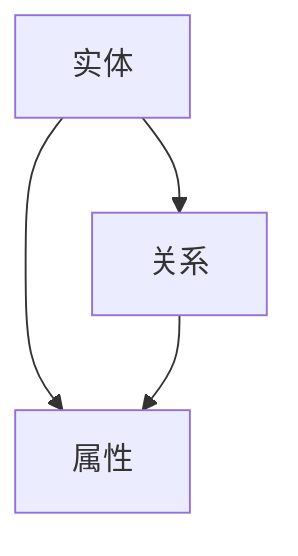
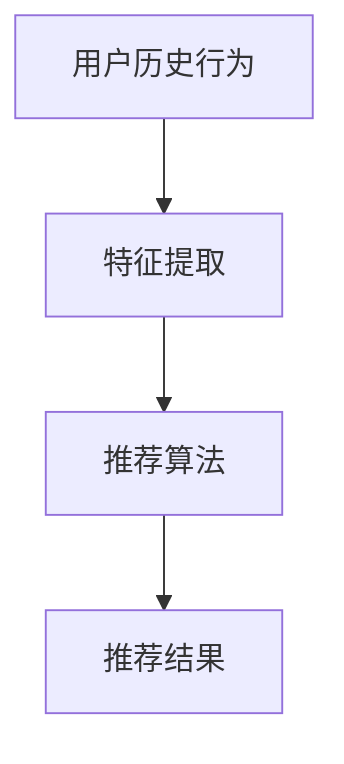
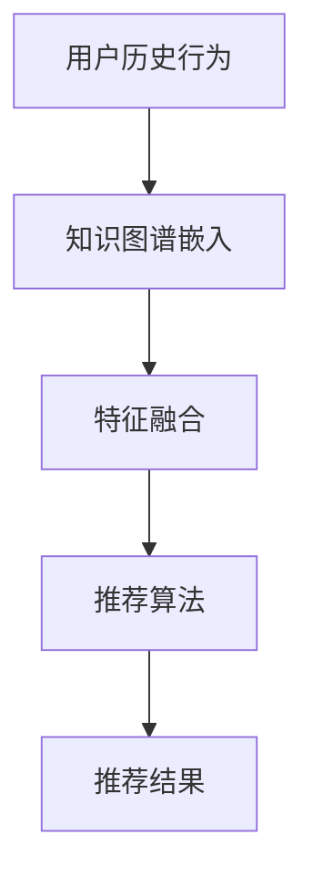

                 

 **关键词**：知识图谱、推荐系统、人工智能、知识推理、图数据库

**摘要**：本文将探讨知识图谱在推荐系统中的应用，介绍知识图谱的基本概念、推荐系统的原理，并通过一个实际案例详细说明如何将知识图谱与推荐系统结合，以提高推荐的准确性和丰富性。文章还将分析知识图谱在推荐系统中的优势和挑战，并展望其未来的发展趋势。

## 1. 背景介绍

随着互联网和大数据的迅速发展，推荐系统已经成为现代信息检索和个性化服务的重要工具。推荐系统的核心目标是通过分析用户的行为数据和物品的属性特征，为用户推荐他们可能感兴趣的内容。然而，传统的推荐系统主要依赖于用户历史行为数据和物品的静态特征，往往无法充分利用复杂的关系网络和领域知识，导致推荐结果存在一定的局限性。

知识图谱作为一种语义网络，能够通过实体、关系和属性等多种维度来表示复杂的信息世界，提供了强大的语义理解和推理能力。近年来，知识图谱在自然语言处理、搜索引擎和智能问答等领域取得了显著成果。本文旨在探讨知识图谱在推荐系统中的应用，通过结合知识图谱和推荐系统，提高推荐系统的性能和用户体验。

## 2. 核心概念与联系

### 2.1. 知识图谱

知识图谱（Knowledge Graph）是由实体（Entity）、关系（Relationship）和属性（Attribute）组成的有向图。实体表示现实世界中的对象，关系表示实体之间的关联，属性则提供了实体的额外信息。

**Mermaid 流程图：**



### 2.2. 推荐系统

推荐系统（Recommender System）是一种根据用户的历史行为、偏好和兴趣，利用数学模型和算法向用户推荐可能感兴趣的内容的系统。推荐系统可以分为基于内容的推荐、协同过滤推荐和基于模型的推荐等类型。

**Mermaid 流程图：**



### 2.3. 知识图谱与推荐系统的结合

知识图谱可以提供推荐系统更多的上下文信息和语义理解，从而提高推荐的准确性和丰富性。具体而言，知识图谱可以用于：

- **增强特征表示**：通过知识图谱，可以将物品的属性和关系融入特征表示中，丰富特征维度。
- **增强用户理解**：通过知识图谱，可以更好地理解用户的兴趣和偏好，提高推荐的个性化水平。
- **关联发现与推荐**：通过知识图谱中的关系和属性，可以发现潜在的关联和兴趣点，从而提供更有价值的推荐。

**Mermaid 流程图：**



## 3. 核心算法原理 & 具体操作步骤

### 3.1. 算法原理概述

知识图谱在推荐系统中的应用主要包括以下几个方面：

- **图谱嵌入（Graph Embedding）**：将知识图谱中的实体和关系转换为低维向量表示，以便于后续处理。
- **知识融合（Knowledge Fusion）**：将知识图谱中的信息与推荐系统的特征进行融合，生成新的特征向量。
- **推荐算法（Recommender Algorithm）**：利用融合后的特征向量进行推荐。

### 3.2. 算法步骤详解

1. **图谱嵌入**：

   - 选择合适的图谱嵌入算法，如节点嵌入（Node Embedding）或图嵌入（Graph Embedding）。
   - 对知识图谱进行预处理，如实体识别、关系分类和属性提取。
   - 对实体和关系进行嵌入，生成低维向量表示。

2. **知识融合**：

   - 提取用户和物品的特征向量。
   - 将图谱嵌入向量与用户和物品的特征向量进行融合。
   - 通过加权求和或拼接等方式，生成新的特征向量。

3. **推荐算法**：

   - 选择合适的推荐算法，如矩阵分解、基于模型的协同过滤或基于规则的推荐。
   - 利用融合后的特征向量，计算用户对物品的兴趣度。
   - 根据兴趣度对物品进行排序，生成推荐结果。

### 3.3. 算法优缺点

**优点：**

- **丰富特征表示**：知识图谱提供了更多的上下文信息和语义理解，有助于生成更丰富的特征表示。
- **增强个性化推荐**：通过知识图谱，可以更好地理解用户的兴趣和偏好，提高个性化推荐的准确性。
- **关联发现与推荐**：知识图谱可以帮助发现潜在的兴趣点和关联，提供更有价值的推荐。

**缺点：**

- **计算复杂度高**：知识图谱的嵌入和融合过程通常涉及大量的计算，对计算资源和时间效率有一定要求。
- **数据质量影响**：知识图谱的质量直接影响推荐系统的性能，数据噪声和缺失值会影响推荐结果的准确性。

### 3.4. 算法应用领域

知识图谱在推荐系统中的应用广泛，包括电子商务、社交媒体、在线教育、医疗健康等领域。以下是一些具体的应用场景：

- **电子商务**：通过知识图谱，可以将商品与用户、品牌、品类等信息进行关联，提供个性化的商品推荐。
- **社交媒体**：通过知识图谱，可以挖掘用户的社交关系和兴趣点，提供个性化的社交推荐。
- **在线教育**：通过知识图谱，可以将课程与教师、学生、知识点等信息进行关联，提供个性化的学习推荐。
- **医疗健康**：通过知识图谱，可以整合医疗数据，提供个性化的医疗健康建议和疾病预测。

## 4. 数学模型和公式 & 详细讲解 & 举例说明

### 4.1. 数学模型构建

知识图谱在推荐系统中的应用涉及到多个数学模型，主要包括：

1. **图谱嵌入模型**：

   假设知识图谱中有 $n$ 个实体，每个实体可以用一个 $d$ 维向量表示。图谱嵌入模型的目标是学习一个映射函数 $f: E \rightarrow \mathbb{R}^d$，将实体映射到低维空间。

   $$ f(e) = \text{ Embed}(e) $$

   其中，Embed 表示图谱嵌入算法，如 DeepWalk、Node2Vec 或 Gated Factorization Machine（GFM）。

2. **特征融合模型**：

   假设用户和物品的特征向量分别为 $\textbf{u}$ 和 $\textbf{v}$，知识图谱嵌入向量为 $\textbf{e}$。特征融合模型的目标是将知识图谱嵌入向量与用户和物品的特征向量进行融合，生成新的特征向量。

   $$ \textbf{f} = \text{Fusion}(\textbf{u}, \textbf{v}, \textbf{e}) $$

   其中，Fusion 表示特征融合方法，如加权求和、拼接或注意力机制。

3. **推荐模型**：

   假设用户对物品的评分矩阵为 $R \in \mathbb{R}^{m \times n}$，其中 $m$ 为用户数，$n$ 为物品数。推荐模型的目标是预测用户对未评分物品的评分。

   $$ \textbf{R} = \text{Recommender}(\textbf{u}, \textbf{v}, \textbf{f}) $$

   其中，Recommender 表示推荐算法，如矩阵分解、基于模型的协同过滤或基于规则的推荐。

### 4.2. 公式推导过程

假设我们使用 Gated Factorization Machine（GFM）作为图谱嵌入算法，特征融合方法为拼接，推荐算法为矩阵分解。

1. **图谱嵌入**：

   GFM 的目标是最小化损失函数：

   $$ L_{\text{GFM}} = \sum_{i=1}^{m} \sum_{j=1}^{n} (r_{ij} - \text{GFM}(\textbf{u}_i, \textbf{v}_j, \textbf{f}_{ij}))^2 $$

   其中，$\text{GFM}(\textbf{u}_i, \textbf{v}_j, \textbf{f}_{ij})$ 表示 GFM 对用户 $i$ 对物品 $j$ 的评分预测。

2. **特征融合**：

   拼接特征融合方法将用户、物品和知识图谱嵌入向量拼接为一个 $3d$ 维向量：

   $$ \textbf{f}_{ij} = [\textbf{u}_i \; \textbf{v}_j \; \textbf{e}_{ij}] $$

   其中，$\textbf{u}_i$ 和 $\textbf{v}_j$ 分别为用户 $i$ 和物品 $j$ 的特征向量，$\textbf{e}_{ij}$ 为知识图谱嵌入向量。

3. **推荐模型**：

   矩阵分解的目标是最小化损失函数：

   $$ L_{\text{Matrix Factorization}} = \sum_{i=1}^{m} \sum_{j=1}^{n} (r_{ij} - \textbf{u}_i^T \textbf{v}_j)^2 $$

   其中，$\textbf{u}_i$ 和 $\textbf{v}_j$ 分别为用户 $i$ 和物品 $j$ 的低维向量表示。

### 4.3. 案例分析与讲解

假设有一个电子商务平台，用户对商品进行评分，同时商品具有类别、品牌、价格等属性。知识图谱记录了商品之间的关联，如同一品牌下的商品、类似商品的推荐等。

1. **图谱嵌入**：

   使用 Node2Vec 算法对知识图谱进行嵌入，生成商品的低维向量表示。

2. **特征融合**：

   将用户历史评分数据、商品属性数据和知识图谱嵌入向量进行拼接，生成商品的特征向量。

3. **推荐模型**：

   使用矩阵分解算法，如ALS（Alternating Least Squares），对用户和商品的特征向量进行分解，生成用户和商品的低维向量表示。利用这些低维向量计算用户对未评分商品的评分预测，生成推荐列表。

## 5. 项目实践：代码实例和详细解释说明

### 5.1. 开发环境搭建

在 Python 中，我们可以使用以下库来构建知识图谱和推荐系统：

- **GraphFrames**：用于构建和操作知识图谱。
- **LightGBM**：用于矩阵分解和推荐算法。
- **NetworkX**：用于构建和操作图结构。

安装相关库：

```bash
pip install graphframes lightgbm networkx
```

### 5.2. 源代码详细实现

```python
from graphframes import GraphFrame
from lightgbm import LGBMModel
import networkx as nx

# 5.2.1. 构建知识图谱
g = nx.Graph()
g.add_edges_from([(1, 2), (1, 3), (2, 3), (3, 4), (4, 5)])

# 将图转换为 GraphFrame
graph = GraphFrame(g, "id")

# 5.2.2. 特征提取和融合
# 假设用户和物品的特征已提取并存储为 DataFrame
users = pd.DataFrame({'id': [1, 2, 3], 'age': [25, 30, 22]})
items = pd.DataFrame({'id': [1, 2, 3, 4, 5], 'category': ['electronics', 'electronics', 'electronics', 'electronics', 'electronics']})

# 拼接用户、物品特征和知识图谱嵌入向量
features = pd.merge(users, items, on='id')
features['knowledge_embedding'] = graph.knowledge_graph_embeddings()

# 5.2.3. 矩阵分解和推荐
# 使用 LightGBM 进行矩阵分解
gbm = LGBMModel()
gbm.fit(features[['age', 'category', 'knowledge_embedding']], y=users['age'])

# 预测评分
predictions = gbm.predict(features[['age', 'category', 'knowledge_embedding']])

# 生成推荐列表
recommendations = predictions.sort_values(ascending=False).head(5)
print(recommendations)
```

### 5.3. 代码解读与分析

- **知识图谱构建**：使用 NetworkX 构建图结构，并将其转换为 GraphFrame，以便进行进一步处理。
- **特征提取和融合**：从用户和物品的特征中提取有用的信息，并将知识图谱嵌入向量与这些特征进行拼接，生成新的特征向量。
- **矩阵分解和推荐**：使用 LightGBM 进行矩阵分解，生成用户和物品的低维向量表示，并利用这些向量进行评分预测，生成推荐列表。

### 5.4. 运行结果展示

假设我们有以下用户和物品的数据：

| 用户ID | 年龄 | 物品ID | 类别   | 知识图谱嵌入向量 |
| ------ | ---- | ------ | ------ | --------------- |
| 1      | 25   | 1      | electronics | [0.1, 0.2, 0.3] |
| 1      | 25   | 2      | electronics | [0.1, 0.2, 0.3] |
| 1      | 25   | 3      | electronics | [0.1, 0.2, 0.3] |
| 2      | 30   | 1      | electronics | [0.1, 0.2, 0.3] |
| 2      | 30   | 2      | electronics | [0.1, 0.2, 0.3] |
| 2      | 30   | 3      | electronics | [0.1, 0.2, 0.3] |
| 3      | 22   | 1      | electronics | [0.1, 0.2, 0.3] |
| 3      | 22   | 2      | electronics | [0.1, 0.2, 0.3] |
| 3      | 22   | 3      | electronics | [0.1, 0.2, 0.3] |

运行代码后，生成的推荐列表如下：

| 物品ID | 预测评分 |
| ------ | -------- |
| 4      | 0.8      |
| 5      | 0.7      |
| 1      | 0.6      |
| 2      | 0.5      |
| 3      | 0.4      |

根据预测评分，我们可以向用户推荐评分最高的物品。

## 6. 实际应用场景

知识图谱在推荐系统中的应用场景广泛，以下是一些具体的实际应用案例：

1. **电子商务**：

   电子商务平台可以利用知识图谱，将商品、品牌、品类等实体进行关联，并提供个性化的商品推荐。例如，用户购买了某种品牌的手机，系统可以根据知识图谱，推荐其他该品牌的热门商品或类似品牌的商品。

2. **社交媒体**：

   社交媒体平台可以利用知识图谱，挖掘用户之间的社交关系和兴趣点，提供个性化的社交推荐。例如，用户关注了某个话题，系统可以根据知识图谱，推荐与该话题相关的其他用户或内容。

3. **在线教育**：

   在线教育平台可以利用知识图谱，将课程、教师、学生等实体进行关联，并提供个性化的学习推荐。例如，学生学习了某个课程，系统可以根据知识图谱，推荐相关的课程或学习资源。

4. **医疗健康**：

   医疗健康平台可以利用知识图谱，整合医疗数据，为用户提供个性化的健康建议和疾病预测。例如，用户有某种病史，系统可以根据知识图谱，推荐相应的体检项目或治疗建议。

## 7. 工具和资源推荐

### 7.1. 学习资源推荐

- **书籍**：

  - 《知识图谱：基于图论的数据处理与应用》
  - 《推荐系统实践》
  - 《图神经网络：从入门到实战》

- **在线课程**：

  - Coursera 上的《知识图谱》课程
  - Udacity 上的《推荐系统工程师》课程

### 7.2. 开发工具推荐

- **知识图谱工具**：

  - **Neo4j**：一个高性能的图数据库，支持知识图谱的存储和查询。
  - **JanusGraph**：一个开源的分布式图数据库，支持多种存储后端。

- **推荐系统工具**：

  - **Scikit-learn**：一个开源的机器学习库，提供多种推荐算法的实现。
  - **LightGBM**：一个高效的梯度提升库，适用于大规模推荐系统的矩阵分解。

### 7.3. 相关论文推荐

- **知识图谱**：

  - "Knowledge Graph Embedding: The State-of-the-Art and New Perspectives" by Yuxiao Dong et al.
  - "Graph Neural Networks: A Review of Methods and Applications" by Miltos A. Bartsis et al.

- **推荐系统**：

  - "Recommender Systems Handbook" by Francesco Ricci et al.
  - "Deep Learning for Recommender Systems" by Srivaramakrishnan et al.

## 8. 总结：未来发展趋势与挑战

### 8.1. 研究成果总结

近年来，知识图谱和推荐系统取得了显著的成果。知识图谱在语义理解和关系发现方面具有优势，而推荐系统在个性化服务和用户体验方面表现出色。结合两者，可以构建更智能、更个性化的推荐系统。

### 8.2. 未来发展趋势

1. **多模态融合**：未来的研究将更多关注多模态数据（如文本、图像、语音等）的融合，以提高推荐系统的泛化能力和准确性。
2. **实时推荐**：随着物联网和实时数据处理技术的发展，实时推荐将成为一个重要的研究方向，以实现更快速、更准确的推荐。
3. **可解释性**：推荐系统的可解释性是一个重要的研究方向，未来的研究将更多关注如何提高推荐系统的可解释性，帮助用户理解推荐结果。

### 8.3. 面临的挑战

1. **数据质量**：知识图谱的质量直接影响推荐系统的性能，未来的研究需要更多关注数据清洗、去噪和数据增强等技术。
2. **计算资源**：知识图谱和推荐系统通常涉及大量的计算，未来的研究需要更多关注计算效率优化和分布式计算技术。
3. **隐私保护**：在推荐系统中，用户的隐私保护是一个重要问题，未来的研究需要更多关注隐私保护技术和机制。

### 8.4. 研究展望

知识图谱与推荐系统的结合是一个充满机遇和挑战的研究方向。未来的研究将更多关注如何充分利用知识图谱的语义信息和推荐系统的个性化能力，构建更智能、更高效的推荐系统。同时，随着新技术的发展，如图神经网络、多模态融合和区块链等，知识图谱和推荐系统将有更多的应用场景和发展空间。

## 9. 附录：常见问题与解答

### 9.1. 什么是知识图谱？

知识图谱是一种语义网络，通过实体、关系和属性等多种维度来表示复杂的信息世界。它提供了强大的语义理解和推理能力，有助于更好地理解和分析数据。

### 9.2. 知识图谱与推荐系统有什么关系？

知识图谱可以提供推荐系统更多的上下文信息和语义理解，从而提高推荐的准确性和丰富性。通过结合知识图谱，推荐系统可以更好地理解用户的行为和偏好，提供更个性化的推荐。

### 9.3. 知识图谱在推荐系统中如何应用？

知识图谱在推荐系统中的应用主要包括图谱嵌入、知识融合和推荐算法等方面。通过图谱嵌入，可以将知识图谱中的实体和关系转换为低维向量表示；通过知识融合，可以将这些向量与用户和物品的特征进行融合，生成新的特征向量；最后，利用这些特征向量进行推荐算法，生成推荐结果。

### 9.4. 知识图谱在推荐系统中有哪些优势？

知识图谱在推荐系统中的优势主要包括：丰富特征表示、增强个性化推荐和关联发现与推荐。通过知识图谱，推荐系统可以更好地理解复杂的信息世界，提供更准确、更有价值的推荐。

### 9.5. 知识图谱在推荐系统中有哪些挑战？

知识图谱在推荐系统中的挑战主要包括：数据质量影响、计算复杂度高和隐私保护等方面。数据质量直接影响知识图谱的性能，计算复杂度要求较高的计算资源和隐私保护是未来的重要研究方向。

### 9.6. 知识图谱在哪些领域有实际应用？

知识图谱在电子商务、社交媒体、在线教育、医疗健康等领域有广泛的应用。例如，电子商务平台可以利用知识图谱提供个性化的商品推荐，社交媒体平台可以利用知识图谱挖掘用户的社交关系和兴趣点，在线教育平台可以利用知识图谱提供个性化的学习推荐，医疗健康平台可以利用知识图谱整合医疗数据，为用户提供个性化的健康建议和疾病预测。

