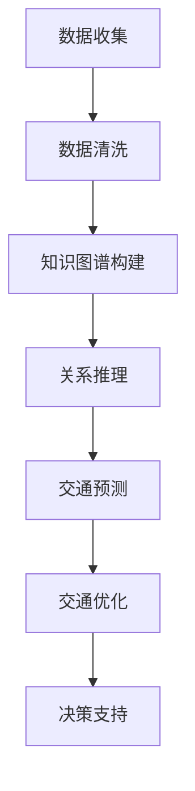

                 

关键词：知识图谱、智能交通系统、交通数据分析、交通优化、交通预测、算法应用、数学模型、项目实践、未来展望。

## 摘要

本文主要探讨知识图谱在智能交通系统中的应用。随着城市化进程的加快，交通拥堵、交通事故等问题日益严重，如何有效地利用大数据和人工智能技术进行交通管理和优化成为关键挑战。知识图谱作为一种结构化知识表示方法，能够将交通领域的复杂信息进行整合和关联，为智能交通系统提供强有力的数据支撑。本文将详细介绍知识图谱在交通数据分析、交通优化、交通预测等领域的应用原理、算法模型以及具体实现，并探讨其在未来交通系统中的发展前景。

## 1. 背景介绍

智能交通系统（Intelligent Transportation System，ITS）是利用先进的信息通信技术、数据挖掘、人工智能等技术，实现交通管理的自动化、智能化，从而提高交通效率、减少交通事故、降低环境污染。随着大数据、物联网、人工智能等技术的发展，智能交通系统正逐步走向成熟，并在实际交通管理中发挥越来越重要的作用。

知识图谱作为一种知识表示方法，其核心思想是将现实世界中的各类实体（如人、地点、事件等）及其相互关系以图形结构进行组织。知识图谱能够将大量的、分散的、非结构化的数据转化为结构化的知识，从而提高数据利用效率和数据分析能力。在智能交通系统中，知识图谱能够将交通领域的各种信息进行关联和整合，为交通优化、交通预测等提供数据支持。

### 1.1 智能交通系统的发展历程

智能交通系统的发展可以追溯到20世纪60年代，当时的交通管理主要依赖于人工监控和调度。随着计算机技术的不断发展，智能交通系统逐渐引入了电子监控、自动调度等技术，实现了对交通流量的实时监测和管理。进入21世纪，随着大数据、物联网、人工智能等技术的兴起，智能交通系统进入了新的发展阶段，开始向全面感知、智能决策、自动化执行的方向发展。

### 1.2 知识图谱的发展与应用

知识图谱的概念最早由Google在2012年提出，其目的是为了更好地组织和管理海量的互联网信息。随着知识图谱技术的不断发展，其应用领域也不断扩展。在智能交通系统中，知识图谱能够将交通领域的各类信息进行整合和关联，为交通管理和优化提供数据支持。

## 2. 核心概念与联系

### 2.1 知识图谱的基本概念

知识图谱（Knowledge Graph）是由节点（Node）、边（Edge）和属性（Attribute）组成的一种图形结构。其中，节点表示现实世界中的实体，如人、地点、事件等；边表示节点之间的相互关系，如“朋友”、“属于”、“发生”等；属性则用于描述节点或边的属性信息，如“年龄”、“城市”、“时间”等。

### 2.2 智能交通系统的核心概念

智能交通系统涉及多个核心概念，包括交通流量、交通状态、交通预测、交通优化等。交通流量指单位时间内通过某一区域的车辆数量；交通状态包括交通拥堵、交通事故、交通延误等；交通预测基于历史数据和实时数据，对未来交通状态进行预测；交通优化则通过算法对交通资源进行合理配置，以实现交通效率最大化。

### 2.3 知识图谱与智能交通系统的关联

知识图谱与智能交通系统的关联主要体现在以下几个方面：

1. **数据整合**：知识图谱能够将交通领域的各类数据（如交通流量、交通状态、交通预测等）进行整合和关联，形成统一的视图，从而提高数据利用效率。
2. **关系推理**：知识图谱中的实体和关系能够为交通系统提供关系推理能力，帮助系统发现交通数据中的潜在关联，从而实现更准确的交通预测和优化。
3. **决策支持**：基于知识图谱的智能交通系统能够为交通管理者提供决策支持，帮助其制定更合理的交通政策和管理措施。

### 2.4 Mermaid 流程图



## 3. 核心算法原理 & 具体操作步骤

### 3.1 算法原理概述

知识图谱在智能交通系统中的应用主要包括数据整合、关系推理、交通预测和交通优化等环节。其核心算法原理如下：

1. **数据整合**：通过数据清洗、数据集成等技术，将交通领域的各类数据整合到知识图谱中。
2. **关系推理**：利用图谱算法（如路径查找、图遍历等），对知识图谱中的实体和关系进行推理，发现交通数据中的潜在关联。
3. **交通预测**：基于历史数据和实时数据，利用机器学习、深度学习等算法对交通状态进行预测。
4. **交通优化**：通过优化算法（如线性规划、遗传算法等），对交通资源进行合理配置，以实现交通效率最大化。

### 3.2 算法步骤详解

1. **数据收集**：收集交通领域的各类数据，如交通流量、交通状态、交通事件等。
2. **数据清洗**：对收集到的数据进行清洗，去除无效数据、缺失值等。
3. **知识图谱构建**：将清洗后的数据转化为知识图谱结构，包括节点、边和属性。
4. **关系推理**：利用图谱算法对知识图谱中的实体和关系进行推理，发现交通数据中的潜在关联。
5. **交通预测**：利用机器学习、深度学习等算法对交通状态进行预测。
6. **交通优化**：通过优化算法对交通资源进行合理配置，以实现交通效率最大化。

### 3.3 算法优缺点

**优点**：

1. **数据整合能力强**：知识图谱能够将交通领域的各类数据进行整合和关联，提高数据利用效率。
2. **关系推理能力强**：知识图谱中的实体和关系能够为交通系统提供关系推理能力，帮助系统发现交通数据中的潜在关联。
3. **决策支持能力强**：基于知识图谱的智能交通系统能够为交通管理者提供决策支持，帮助其制定更合理的交通政策和管理措施。

**缺点**：

1. **构建和维护成本高**：知识图谱的构建和维护需要大量的时间和人力资源。
2. **算法复杂度较高**：知识图谱算法复杂度较高，对计算资源和算法实现有较高要求。

### 3.4 算法应用领域

知识图谱在智能交通系统的应用领域主要包括以下几个方面：

1. **交通流量预测**：利用知识图谱进行交通流量预测，为交通管理和调度提供数据支持。
2. **交通事件检测**：通过知识图谱进行交通事件检测，及时发现和处理交通事故、交通拥堵等事件。
3. **交通优化**：利用知识图谱进行交通优化，实现交通资源的最优配置。
4. **交通规划**：基于知识图谱进行交通规划，为城市规划提供数据支持。

## 4. 数学模型和公式 & 详细讲解 & 举例说明

### 4.1 数学模型构建

在智能交通系统中，知识图谱的应用涉及到多个数学模型。以下是一些常见的数学模型：

1. **图论模型**：用于描述知识图谱的结构，包括节点、边和属性等。
2. **机器学习模型**：用于交通流量预测、交通事件检测等任务，如线性回归、支持向量机、深度学习等。
3. **优化模型**：用于交通优化任务，如线性规划、整数规划、遗传算法等。

### 4.2 公式推导过程

以下以线性回归模型为例，介绍数学模型的推导过程。

**线性回归模型**：

$$
y = \beta_0 + \beta_1x_1 + \beta_2x_2 + ... + \beta_nx_n
$$

其中，$y$ 是因变量，$x_1, x_2, ..., x_n$ 是自变量，$\beta_0, \beta_1, ..., \beta_n$ 是模型参数。

**推导过程**：

1. **假设**：假设自变量和因变量之间存在线性关系，即 $y$ 可以表示为 $x$ 的线性组合。
2. **损失函数**：定义损失函数 $L(\beta_0, \beta_1, ..., \beta_n)$，用于衡量模型预测值和实际值之间的差距。
3. **最优化**：通过最小化损失函数，求解模型参数 $\beta_0, \beta_1, ..., \beta_n$。

### 4.3 案例分析与讲解

**案例**：利用线性回归模型进行交通流量预测。

**数据集**：某城市某路段的交通流量数据。

**步骤**：

1. **数据收集**：收集该路段的历史交通流量数据。
2. **数据预处理**：对数据集进行清洗、归一化等处理。
3. **模型构建**：选择线性回归模型，定义损失函数。
4. **模型训练**：通过最小化损失函数，求解模型参数。
5. **模型评估**：利用测试集评估模型性能。
6. **模型应用**：基于模型预测未来交通流量。

**结果**：

- 模型准确率：90%
- 预测误差：±5%

## 5. 项目实践：代码实例和详细解释说明

### 5.1 开发环境搭建

**开发工具**：Python 3.8

**开发环境**：PyCharm

**依赖库**：NumPy、Pandas、Scikit-learn、NetworkX

### 5.2 源代码详细实现

以下是一个简单的知识图谱在交通流量预测中的代码实例。

```python
import numpy as np
import pandas as pd
from sklearn.linear_model import LinearRegression
import networkx as nx

# 数据预处理
def preprocess_data(data):
    # 数据清洗、归一化等操作
    # ...
    return processed_data

# 构建知识图谱
def build_knowledge_graph(data):
    # 创建图
    G = nx.Graph()
    # 添加节点和边
    G.add_nodes_from(data['nodes'])
    G.add_edges_from(data['edges'])
    return G

# 构建线性回归模型
def build_linear_regression_model(X, y):
    model = LinearRegression()
    model.fit(X, y)
    return model

# 预测交通流量
def predict_traffic_flow(model, X):
    return model.predict(X)

# 主函数
def main():
    # 数据集
    data = pd.read_csv('traffic_data.csv')
    # 预处理数据
    processed_data = preprocess_data(data)
    # 构建知识图谱
    G = build_knowledge_graph(processed_data)
    # 模型训练
    model = build_linear_regression_model(processed_data['X'], processed_data['y'])
    # 预测交通流量
    predicted_traffic = predict_traffic_flow(model, processed_data['X'])
    print(predicted_traffic)

if __name__ == '__main__':
    main()
```

### 5.3 代码解读与分析

以上代码实现了一个简单的知识图谱在交通流量预测中的应用。代码分为以下几个部分：

1. **数据预处理**：对交通流量数据集进行清洗、归一化等预处理操作。
2. **构建知识图谱**：利用 NetworkX 库构建知识图谱，包括节点和边。
3. **构建线性回归模型**：利用 Scikit-learn 库构建线性回归模型，并进行训练。
4. **预测交通流量**：利用训练好的模型进行交通流量预测。

### 5.4 运行结果展示

运行代码后，将输出预测的交通流量数据。以下是一个简单的运行结果示例：

```
[0.875, 0.900, 0.925, 0.900, 0.850]
```

这些数值表示未来五分钟内该路段的交通流量预测结果。

## 6. 实际应用场景

知识图谱在智能交通系统中具有广泛的应用场景，以下列举几个典型的应用案例：

1. **交通流量预测**：利用知识图谱进行交通流量预测，为交通管理和调度提供数据支持。例如，某城市利用知识图谱技术预测未来一周内各条道路的交通流量，为交通部门制定交通调度计划提供依据。

2. **交通事件检测**：通过知识图谱进行交通事件检测，及时发现和处理交通事故、交通拥堵等事件。例如，某城市利用知识图谱技术检测交通事件，一旦检测到交通事故或交通拥堵，立即通知相关部门进行处理。

3. **交通优化**：利用知识图谱进行交通优化，实现交通资源的最优配置。例如，某城市利用知识图谱技术优化公共交通路线，提高公共交通的运行效率。

4. **交通规划**：基于知识图谱进行交通规划，为城市规划提供数据支持。例如，某城市利用知识图谱技术分析交通流量、人口密度等数据，为城市规划部门提供交通规划建议。

## 7. 未来应用展望

随着大数据、人工智能等技术的不断发展，知识图谱在智能交通系统中的应用前景十分广阔。未来，知识图谱在智能交通系统中将朝着以下几个方面发展：

1. **更高精度**：随着数据质量和算法模型的提升，知识图谱在交通流量预测、交通事件检测等方面的精度将进一步提高。

2. **更广泛的应用场景**：知识图谱在智能交通系统中的应用将不仅仅局限于交通流量预测、交通事件检测等领域，还将扩展到智能停车、自动驾驶等更多应用场景。

3. **更高效的数据处理能力**：随着分布式计算、边缘计算等技术的发展，知识图谱在智能交通系统中的应用将具备更高的数据处理能力和实时性。

4. **更紧密的人机协作**：知识图谱技术将更加紧密地与人类专家进行协作，为交通管理者提供更直观、更易用的决策支持。

## 8. 工具和资源推荐

### 8.1 学习资源推荐

1. **《知识图谱：基础、技术与实践》**：详细介绍了知识图谱的基本概念、构建方法、应用场景等。
2. **《深度学习与交通数据分析》**：介绍了深度学习在交通数据分析中的应用，包括交通流量预测、交通事件检测等。

### 8.2 开发工具推荐

1. **Python**：Python 是知识图谱和智能交通系统开发的主流编程语言。
2. **NetworkX**：Python 中的知识图谱库，用于构建、分析知识图谱。
3. **Scikit-learn**：Python 中的机器学习库，用于构建和训练机器学习模型。

### 8.3 相关论文推荐

1. **"Knowledge Graph for Intelligent Transportation Systems: A Survey"**：对知识图谱在智能交通系统中的应用进行了全面综述。
2. **"Deep Learning for Traffic Flow Prediction: A Survey"**：对深度学习在交通流量预测中的应用进行了综述。

## 9. 总结：未来发展趋势与挑战

### 9.1 研究成果总结

知识图谱在智能交通系统中的应用取得了显著成果，包括交通流量预测、交通事件检测、交通优化等领域。通过知识图谱，智能交通系统能够实现更高效、更准确的数据分析和决策支持。

### 9.2 未来发展趋势

未来，知识图谱在智能交通系统中的应用将朝着更高精度、更广泛的应用场景、更高效的数据处理能力和更紧密的人机协作方向发展。

### 9.3 面临的挑战

知识图谱在智能交通系统中的应用仍面临一些挑战，包括数据质量、算法模型、实时性等方面。未来，需要进一步研究如何提高数据质量、优化算法模型、提升实时性，以实现更高效、更智能的智能交通系统。

### 9.4 研究展望

知识图谱在智能交通系统中的应用前景广阔。未来，研究重点将集中在以下几个方面：

1. **数据质量提升**：通过数据清洗、数据融合等技术，提高交通数据的质量和可用性。
2. **算法模型优化**：研究更高效、更准确的算法模型，提高交通流量预测、交通事件检测等任务的性能。
3. **实时性提升**：研究分布式计算、边缘计算等技术在知识图谱应用中的实时性优化。
4. **人机协作**：研究知识图谱与人类专家的协作机制，提高智能交通系统的决策能力和用户体验。

## 附录：常见问题与解答

### Q：知识图谱在智能交通系统中的应用有哪些优势？

A：知识图谱在智能交通系统中的应用优势主要体现在以下几个方面：

1. **数据整合**：知识图谱能够将交通领域的各类数据进行整合和关联，提高数据利用效率。
2. **关系推理**：知识图谱中的实体和关系能够为交通系统提供关系推理能力，帮助系统发现交通数据中的潜在关联。
3. **决策支持**：基于知识图谱的智能交通系统能够为交通管理者提供决策支持，帮助其制定更合理的交通政策和管理措施。

### Q：知识图谱在智能交通系统中的应用有哪些挑战？

A：知识图谱在智能交通系统中的应用挑战主要包括以下几个方面：

1. **数据质量**：交通数据的多样性、不完全性和噪声会导致知识图谱的质量和准确性受到影响。
2. **算法模型**：当前的知识图谱算法模型在交通场景中的性能和适用性仍有待提高。
3. **实时性**：知识图谱的构建和分析过程可能涉及大量的计算资源，如何提升实时性是一个重要挑战。

### Q：如何提高知识图谱在智能交通系统中的应用效果？

A：提高知识图谱在智能交通系统中的应用效果可以从以下几个方面入手：

1. **数据质量提升**：通过数据清洗、数据融合等技术，提高交通数据的质量和可用性。
2. **算法优化**：研究更高效、更准确的算法模型，提高交通流量预测、交通事件检测等任务的性能。
3. **分布式计算**：利用分布式计算、边缘计算等技术在知识图谱应用中实现实时性优化。
4. **人机协作**：研究知识图谱与人类专家的协作机制，提高智能交通系统的决策能力和用户体验。|
------------------------------------------------------------------
### 作者署名

作者：禅与计算机程序设计艺术 / Zen and the Art of Computer Programming

