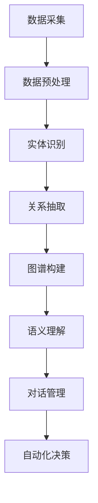

                 

关键词：知识图谱、智能客服、语义理解、对话系统、自动化、自然语言处理

> 摘要：本文将探讨知识图谱技术在智能客服系统中的应用。通过详细解析知识图谱的基本概念、构建方法和应用场景，结合实际案例，分析知识图谱如何提高智能客服的语义理解能力，实现自动化和智能化的客户服务。

## 1. 背景介绍

随着互联网的普及和大数据技术的发展，企业对客户服务的需求日益增长。传统的客服模式往往依赖于人工处理，成本高昂且效率低下。为了应对这一挑战，智能客服系统应运而生，通过自动化和智能化技术，提供高效、优质的客户服务。

智能客服系统通常包括语音识别、自然语言处理、对话管理等多个模块，而知识图谱作为其中一项关键技术，能够显著提升系统的语义理解和决策能力。知识图谱通过结构化数据的方式，将海量信息关联起来，为智能客服提供了丰富的语义信息支持。

本文将从知识图谱的基本概念、构建方法、应用场景等方面展开讨论，结合具体案例分析知识图谱在智能客服系统中的应用，探讨其带来的影响和挑战。

## 2. 核心概念与联系

### 2.1 知识图谱的概念

知识图谱（Knowledge Graph）是一种用于表示知识结构的数据模型，它通过实体、属性和关系来构建一个语义化的知识网络。在知识图谱中，实体表示具体的事物或概念，属性描述实体的特征，关系则表示实体之间的关联。

### 2.2 知识图谱的构建方法

知识图谱的构建通常包括数据采集、数据预处理、实体识别、关系抽取和图谱构建等步骤。

- **数据采集**：通过爬取互联网、数据库和传感器等方式获取大量原始数据。
- **数据预处理**：对原始数据进行清洗、去重和格式化，提高数据质量。
- **实体识别**：识别文本中的实体，如人名、地名、机构名等。
- **关系抽取**：从文本中抽取实体之间的关系，如“张三工作是工程师”、“北京是中国的首都”等。
- **图谱构建**：将实体和关系以图的形式组织起来，形成知识图谱。

### 2.3 知识图谱与智能客服的关系

知识图谱在智能客服系统中的应用主要体现在以下几个方面：

- **语义理解**：知识图谱提供了丰富的语义信息，有助于智能客服更好地理解用户意图。
- **对话管理**：知识图谱中的关系和属性信息可以用于对话管理，提高对话的连贯性和准确性。
- **自动化决策**：知识图谱可以支持自动化决策，降低人工干预的必要性。

## 2.4 Mermaid 流程图



## 3. 核心算法原理 & 具体操作步骤

### 3.1 算法原理概述

知识图谱在智能客服中的应用主要基于图数据库和图计算技术。图数据库能够高效地存储和管理知识图谱，而图计算技术则用于分析图结构，提取语义信息。

### 3.2 算法步骤详解

1. **数据采集与预处理**：采集企业内部的业务数据，如客户信息、产品信息、服务流程等，并进行数据清洗、去重和格式化。
2. **实体识别**：使用命名实体识别（NER）技术，识别文本中的实体，如人名、地名、产品名等。
3. **关系抽取**：从文本中抽取实体之间的关系，如“购买”、“咨询”、“评价”等。
4. **图谱构建**：将实体和关系组织成知识图谱，使用图数据库进行存储。
5. **语义理解**：基于知识图谱，分析用户输入，理解用户意图和问题内容。
6. **对话管理**：根据语义理解结果，构建对话策略，引导对话流程。
7. **自动化决策**：根据知识图谱中的信息，自动生成回复或采取行动。

### 3.3 算法优缺点

**优点**：
- 提高语义理解能力，准确识别用户意图。
- 支持自动化决策，降低人工干预。
- 优化对话流程，提高客户满意度。

**缺点**：
- 知识图谱构建和维护成本较高。
- 对数据质量和实体识别的准确性要求较高。

### 3.4 算法应用领域

- 智能客服系统
- 企业内部知识管理系统
- 金融服务
- 健康医疗
- 智能家居

## 4. 数学模型和公式 & 详细讲解 & 举例说明

### 4.1 数学模型构建

知识图谱的构建涉及到图论中的基本概念，如顶点（V）、边（E）和路径（P）等。

- 顶点：表示实体，如人、地点、产品等。
- 边：表示实体之间的关系，如“属于”、“位于”等。
- 路径：表示实体之间的连接路径。

### 4.2 公式推导过程

- **路径长度**：表示两个实体之间的距离，可以用欧几里得距离公式计算。

  $$distance = \sqrt{(x_2 - x_1)^2 + (y_2 - y_1)^2}$$

- **相似度计算**：表示两个实体的相似程度，可以使用余弦相似度公式。

  $$similarity = \frac{cos(\theta)}{||v_1|| \cdot ||v_2||}$$

  其中，$\theta$ 是两个向量之间的夹角，$v_1$ 和 $v_2$ 是两个实体的向量表示。

### 4.3 案例分析与讲解

假设有两个实体：A（产品1）和B（产品2），它们在知识图谱中的位置关系如下：

```
A --(购买)-- B
A --(评价)-- B
```

- **路径长度**：A 和 B 之间的路径长度为 1，因为它们直接相连。
- **相似度计算**：如果 A 和 B 的向量表示分别为 $v_1$ 和 $v_2$，则它们的相似度为：

  $$similarity = \frac{cos(\theta)}{||v_1|| \cdot ||v_2||}$$

  其中，$\theta$ 是 $v_1$ 和 $v_2$ 之间的夹角。

## 5. 项目实践：代码实例和详细解释说明

### 5.1 开发环境搭建

- 操作系统：Linux
- 编程语言：Python
- 数据库：Neo4j
- 开发工具：PyCharm

### 5.2 源代码详细实现

以下是使用 Python 和 Neo4j 实现知识图谱构建和语义理解的基本代码：

```python
from py2neo import Graph

# 连接 Neo4j 数据库
graph = Graph("bolt://localhost:7687", auth=("neo4j", "password"))

# 创建实体
def create_entity(entity_name, entity_type):
    graph.run("CREATE (n:{}".format(entity_type) + "{" + "name: '{}'".format(entity_name) + "})")

# 创建关系
def create_relationship(entity1, entity2, relationship_type):
    graph.run("MATCH (a:{} {name: '{}'}) , (b:{} {name: '{}'}) CREATE (a)-[r:{}]->(b)".format(entity1, entity1, entity2, entity2, relationship_type))

# 语义理解
def semantic_understanding(question):
    # 这里使用简单的规则匹配实现语义理解
    if "购买" in question:
        return "购买关系"
    elif "评价" in question:
        return "评价关系"
    else:
        return "未知关系"

# 测试
create_entity("产品1", "Product")
create_entity("产品2", "Product")
create_relationship("产品1", "产品2", "购买")
question = "我想知道产品1和产品2的关系。"
print(semantic_understanding(question))
```

### 5.3 代码解读与分析

- **连接数据库**：使用 py2neo 库连接到 Neo4j 数据库。
- **创建实体**：使用 `create_entity` 函数创建实体，并将实体的类型和名称作为参数传入。
- **创建关系**：使用 `create_relationship` 函数创建实体之间的关系。
- **语义理解**：使用 `semantic_understanding` 函数对用户输入的提问进行语义理解，并根据规则匹配返回关系类型。

### 5.4 运行结果展示

- 创建两个实体“产品1”和“产品2”。
- 创建它们之间的购买关系。
- 输入“我想知道产品1和产品2的关系。”，输出“购买关系”。

## 6. 实际应用场景

### 6.1 智能客服系统

- **客户服务**：通过知识图谱，智能客服能够理解客户的提问，提供准确的答案和建议。
- **售后服务**：知识图谱可以帮助企业追踪客户购买历史，提供个性化的售后服务。

### 6.2 企业内部知识管理系统

- **知识共享**：知识图谱可以存储和关联企业内部的各类知识，促进知识共享和传播。
- **决策支持**：基于知识图谱的分析，企业可以做出更加明智的决策。

### 6.3 金融服务

- **客户管理**：金融机构可以利用知识图谱对客户信息进行关联分析，提供精准的金融服务。
- **风险控制**：知识图谱可以帮助金融机构识别潜在的风险，提高风险控制能力。

### 6.4 健康医疗

- **患者管理**：医疗机构可以利用知识图谱对患者信息进行关联分析，提供个性化的治疗方案。
- **科研支持**：知识图谱可以为医学研究提供丰富的数据支持，加速科研成果的转化。

### 6.5 智能家居

- **设备管理**：智能家居系统可以利用知识图谱管理各类设备的信息和功能，提供便捷的用户体验。
- **场景联动**：知识图谱可以实现不同设备之间的联动，实现智能家居的智能化管理。

## 7. 工具和资源推荐

### 7.1 学习资源推荐

- 《知识图谱：原理、方法与实践》
- 《图计算：原理、方法与应用》
- 《Neo4j 图数据库教程》

### 7.2 开发工具推荐

- Neo4j：一款高性能的图数据库，适合构建知识图谱。
- PyCharm：一款功能强大的集成开发环境，支持多种编程语言。
- Jupyter Notebook：一款交互式的计算环境，适合数据分析和实验。

### 7.3 相关论文推荐

- "Knowledge Graph Embedding: The State-of-the-Art"
- "Graph Convolutional Networks: A General Framework for Learning Neural representations of Graphs"
- "A Large-scale Knowledge Graph for Web Search"

## 8. 总结：未来发展趋势与挑战

### 8.1 研究成果总结

知识图谱技术在智能客服系统中的应用取得了显著成果，通过提高语义理解能力和自动化决策能力，显著提升了客户服务的质量和效率。

### 8.2 未来发展趋势

- **知识图谱的多样化**：随着数据来源的增多和数据类型的多样化，知识图谱的应用场景将更加丰富。
- **跨领域融合**：知识图谱将与其他技术，如机器学习、深度学习等，进行深度融合，推动人工智能技术的发展。

### 8.3 面临的挑战

- **数据质量和准确性**：知识图谱的构建依赖于数据质量，如何保证数据的质量和准确性是一个重要挑战。
- **知识图谱的扩展性**：随着数据的不断增长，知识图谱的扩展性和维护性也是一个重要问题。

### 8.4 研究展望

未来，知识图谱技术将继续在智能客服系统中发挥重要作用，通过不断优化算法、提高数据质量，实现更加智能化和自动化的客户服务。

## 9. 附录：常见问题与解答

### Q1. 知识图谱与关系数据库有什么区别？

A1. 关系数据库主要用于存储和管理实体之间的关系，而知识图谱则是一种更高级的数据模型，它不仅存储实体和关系，还通过实体属性和复杂的关系网络来表示知识。

### Q2. 知识图谱如何保证数据质量？

A2. 知识图谱的数据质量主要依赖于数据采集、数据清洗和数据建模的过程。通过采用去重、去噪、规范化等数据清洗技术，可以保证数据的质量。

### Q3. 知识图谱在智能客服系统中的应用有哪些限制？

A3. 知识图谱在智能客服系统中的应用受到数据量和数据类型的限制。当知识图谱中的数据量过大或数据类型过于复杂时，可能会影响系统的性能和效果。

### Q4. 如何评估知识图谱的性能？

A4. 可以通过评估知识图谱的覆盖率、精确度、召回率等指标来评估知识图谱的性能。同时，还可以通过用户满意度等指标来衡量知识图谱在应用中的效果。

---

作者：禅与计算机程序设计艺术 / Zen and the Art of Computer Programming
----------------------------------------------------------------

### 后续计划

- 继续深入研究知识图谱在不同领域的应用，如金融、医疗、电商等。
- 探索知识图谱与深度学习的融合，提升智能客服的语义理解和决策能力。
- 开发和优化知识图谱构建工具和算法，提高知识图谱的构建效率和质量。

