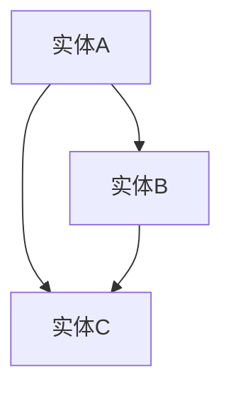
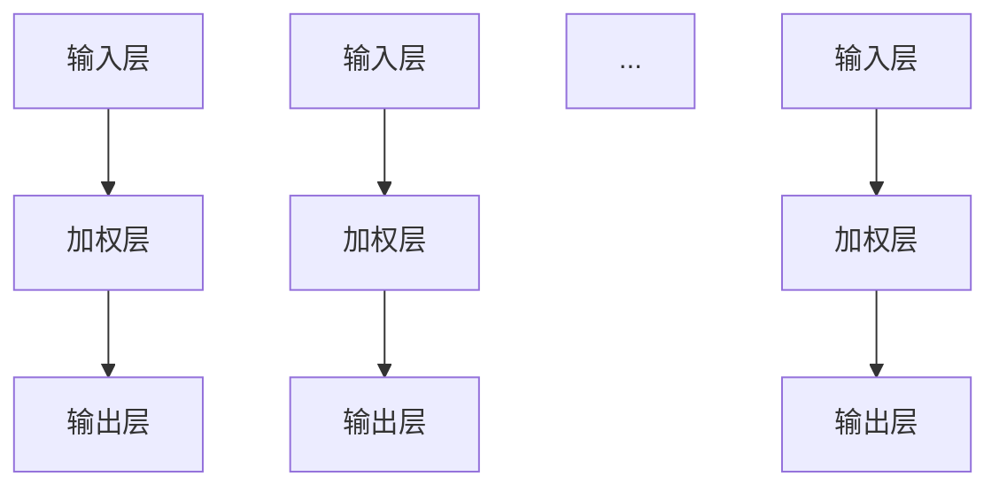
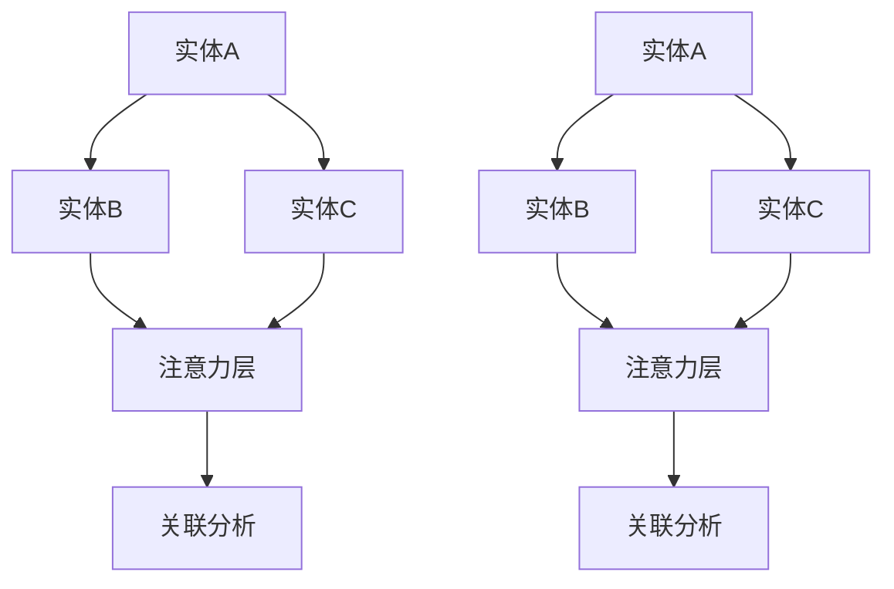

                 

关键词：知识图谱、注意力机制、关联分析、人工智能、信息检索、知识挖掘、图谱嵌入、图谱推理、大数据分析

>摘要：本文将深入探讨知识图谱在注意力关联分析中的应用。通过介绍知识图谱的基础概念，以及注意力机制的原理，我们将详细分析知识图谱在关联分析中的关键作用。文章还将介绍核心算法、数学模型、项目实践，并探讨实际应用场景、未来发展趋势与挑战。

## 1. 背景介绍

在信息爆炸的时代，数据量呈指数级增长，如何有效地提取和利用这些信息成为了一个重要课题。知识图谱作为一种结构化、语义丰富的数据表示方法，已经在信息检索、推荐系统、自然语言处理等多个领域取得了显著成果。而注意力机制作为一种提高模型表示能力和计算效率的关键技术，已经被广泛应用于深度学习领域。

注意力关联分析是一种通过分析实体及其相互关系，发现数据中潜在的关联模式的方法。知识图谱在这一过程中起到了至关重要的作用，它不仅为实体提供了语义定义，还通过实体间的关系网络提供了丰富的上下文信息。

本文将探讨如何将知识图谱与注意力机制相结合，用于关联分析。我们将介绍知识图谱的基本概念，注意力机制的原理，以及它们在关联分析中的具体应用。

## 2. 核心概念与联系

### 2.1 知识图谱

知识图谱（Knowledge Graph）是一种用于表示实体及其相互关系的数据结构。它通常由实体、属性和关系三种元素构成。实体可以是人、地点、事物等，属性描述了实体的特征，关系则描述了实体间的关系。

以下是一个简单的知识图谱的Mermaid流程图表示：



### 2.2 注意力机制

注意力机制（Attention Mechanism）是一种在神经网络中通过学习权重来关注不同输入元素的技术。它通过降低无关元素的权重，从而提高模型对重要信息的关注程度，进而提升模型的表示能力和计算效率。

以下是一个注意力机制的简化的Mermaid流程图表示：



### 2.3 知识图谱在注意力关联分析中的联系

知识图谱与注意力机制的结合，为关联分析提供了强大的工具。知识图谱中的实体和关系为注意力机制提供了丰富的上下文信息，使得模型能够更好地理解和利用这些信息。

以下是一个知识图谱在注意力关联分析中应用的Mermaid流程图表示：



## 3. 核心算法原理 & 具体操作步骤

### 3.1 算法原理概述

知识图谱在注意力关联分析中的核心算法通常是基于图谱嵌入和图谱推理的。图谱嵌入将实体和关系映射到低维空间中，使得实体和关系之间的相似性可以通过距离度量来表示。而图谱推理则利用实体和关系在嵌入空间中的表示，通过推理机制发现实体间的潜在关联。

### 3.2 算法步骤详解

#### 步骤1：图谱嵌入

首先，我们需要将知识图谱中的实体和关系嵌入到低维空间中。这通常通过使用图神经网络（Graph Neural Networks，GNNs）来实现。GNNs通过聚合实体和关系邻居的信息，更新实体和关系的嵌入表示。

#### 步骤2：图谱推理

接下来，我们利用嵌入的实体和关系进行图谱推理。这可以通过基于路径的推理算法（如Walk-based Graph Embedding）或基于矩阵分解的算法（如DeepWalk）来实现。这些算法能够发现实体间的潜在关联，并将其表示为图中的路径。

#### 步骤3：注意力关联分析

最后，我们利用注意力机制对图谱推理的结果进行关联分析。注意力机制能够通过学习权重，降低无关关联的权重，从而提取出重要的关联信息。

### 3.3 算法优缺点

#### 优点

- **丰富的上下文信息**：知识图谱提供了丰富的上下文信息，使得模型能够更好地理解和利用这些信息。
- **高效推理**：图谱嵌入和图谱推理技术使得大规模知识图谱的推理变得更加高效。
- **强大的表示能力**：注意力机制能够提高模型的表示能力，使得模型能够更好地捕捉复杂的关系模式。

#### 缺点

- **计算复杂度**：知识图谱的嵌入和推理通常涉及大量的计算，可能对计算资源有较高的要求。
- **数据质量**：知识图谱的质量直接影响算法的性能，数据中的噪声和错误可能会对分析结果产生负面影响。

### 3.4 算法应用领域

知识图谱在注意力关联分析中的算法应用广泛，包括但不限于：

- **信息检索**：通过关联分析，提高信息检索的准确性。
- **推荐系统**：发现用户和物品之间的潜在关联，提高推荐系统的效果。
- **自然语言处理**：用于文本分析和语义理解，提高自然语言处理的性能。
- **智能问答**：通过关联分析，提高问答系统的响应质量。

## 4. 数学模型和公式 & 详细讲解 & 举例说明

### 4.1 数学模型构建

在知识图谱的注意力关联分析中，我们通常使用以下数学模型：

- **图谱嵌入**：实体和关系的嵌入向量通常由图神经网络（GNN）学习得到。一个简单的GNN模型可以表示为：

$$
h_i^{(t+1)} = \sigma(\theta_{\text{GNN}} \cdot (A \cdot h_i^{(t)} + \sum_{j \in \text{neighbors}(i)} W_j \cdot h_j^{(t)}))
$$

其中，$h_i^{(t)}$是实体i在时间步t的嵌入向量，$A$是图的邻接矩阵，$\theta_{\text{GNN}}$和$W_j$是GNN的参数，$\sigma$是激活函数。

- **图谱推理**：通过路径发现实体间的潜在关联。一个简单的路径发现算法可以表示为：

$$
r_{ij} = \exp(\theta_{\text{RESCAL}} \cdot \sum_{p \in \text{paths}(i, j)} \prod_{k \in p} e_k)
$$

其中，$r_{ij}$是实体i和实体j之间的关联评分，$\theta_{\text{RESCAL}}$是RESCAL模型的参数，$e_k$是实体k的嵌入向量。

- **注意力关联分析**：通过注意力机制对关联评分进行加权，得到最终的关联结果。一个简单的注意力模型可以表示为：

$$
\alpha_{ij} = \sigma(\theta_{\text{ATT}} \cdot [h_i, h_j, r_{ij}])
$$

其中，$\alpha_{ij}$是实体i和实体j之间的注意力权重，$\theta_{\text{ATT}}$是注意力模型的参数。

### 4.2 公式推导过程

#### 图谱嵌入

图谱嵌入的核心是图神经网络（GNN）。GNN通过聚合实体和关系邻居的信息，更新实体和关系的嵌入表示。一个简单的GNN模型可以表示为：

$$
h_i^{(t+1)} = \sigma(\theta_{\text{GNN}} \cdot (A \cdot h_i^{(t)} + \sum_{j \in \text{neighbors}(i)} W_j \cdot h_j^{(t)}))
$$

其中，$h_i^{(t)}$是实体i在时间步t的嵌入向量，$A$是图的邻接矩阵，$\theta_{\text{GNN}}$和$W_j$是GNN的参数，$\sigma$是激活函数。

这个公式中，$A \cdot h_i^{(t)}$表示实体i的邻接矩阵与其当前嵌入向量的点积，这部分可以理解为实体i与其邻居之间的直接关系。而$\sum_{j \in \text{neighbors}(i)} W_j \cdot h_j^{(t)}$表示实体i的邻居实体对其嵌入向量的加权贡献，其中$W_j$是权重矩阵，可以调整邻居实体对当前实体的影响程度。

#### 图谱推理

图谱推理的目标是发现实体间的潜在关联。一个简单的路径发现算法可以表示为：

$$
r_{ij} = \exp(\theta_{\text{RESCAL}} \cdot \sum_{p \in \text{paths}(i, j)} \prod_{k \in p} e_k)
$$

其中，$r_{ij}$是实体i和实体j之间的关联评分，$\theta_{\text{RESCAL}}$是RESCAL模型的参数，$e_k$是实体k的嵌入向量。

这个公式中，$\sum_{p \in \text{paths}(i, j)} \prod_{k \in p} e_k$表示实体i和实体j之间的所有路径上实体的嵌入向量乘积的和。路径上的实体嵌入向量乘积可以看作是路径的“特征”，而指数函数$\exp$则将这个路径特征转换为一个实数评分，表示实体i和实体j之间的关联强度。

#### 注意力关联分析

注意力关联分析的核心是注意力机制。注意力机制通过学习权重，降低无关关联的权重，从而提取出重要的关联信息。一个简单的注意力模型可以表示为：

$$
\alpha_{ij} = \sigma(\theta_{\text{ATT}} \cdot [h_i, h_j, r_{ij}])
$$

其中，$\alpha_{ij}$是实体i和实体j之间的注意力权重，$\theta_{\text{ATT}}$是注意力模型的参数。

这个公式中，$[h_i, h_j, r_{ij}]$是将实体i的嵌入向量、实体j的嵌入向量和它们之间的关联评分拼接在一起，形成一个向量。$\theta_{\text{ATT}} \cdot [h_i, h_j, r_{ij}]$是注意力权重向量，$\sigma$是激活函数，将这个向量转换为一个概率分布，表示实体i和实体j之间的关联权重。

### 4.3 案例分析与讲解

为了更好地理解上述数学模型，我们可以通过一个具体的案例来进行分析。

假设我们有一个简单的知识图谱，其中包含三个实体A、B和C，以及它们之间的关系：

实体A与实体B之间存在一条关系R1，实体B与实体C之间存在一条关系R2。

首先，我们通过图神经网络（GNN）对这三个实体进行嵌入：

- $h_A^{(0)} = [1, 0, 0]$
- $h_B^{(0)} = [0, 1, 0]$
- $h_C^{(0)} = [0, 0, 1]$

在时间步t=1时，我们使用GNN更新这些嵌入向量：

$$
h_A^{(1)} = \sigma(\theta_{\text{GNN}} \cdot (A \cdot h_A^{(0)} + \sum_{j \in \text{neighbors}(A)} W_j \cdot h_j^{(0)}))
$$

$$
h_B^{(1)} = \sigma(\theta_{\text{GNN}} \cdot (A \cdot h_B^{(0)} + \sum_{j \in \text{neighbors}(B)} W_j \cdot h_j^{(0)}))
$$

$$
h_C^{(1)} = \sigma(\theta_{\text{GNN}} \cdot (A \cdot h_C^{(0)} + \sum_{j \in \text{neighbors}(C)} W_j \cdot h_j^{(0)}))
$$

假设实体A的邻居有实体B和实体C，实体B的邻居有实体A和实体C，实体C的邻居有实体A和实体B。我们给邻居实体赋予不同的权重：

- $W_B = [0.5, 0.3, 0.2]$
- $W_C = [0.2, 0.5, 0.3]$

那么，在时间步t=1时，更新后的嵌入向量可以表示为：

$$
h_A^{(1)} = \sigma(\theta_{\text{GNN}} \cdot ([1, 0, 0] + 0.5 \cdot [0, 1, 0] + 0.2 \cdot [0, 0, 1]))
$$

$$
h_B^{(1)} = \sigma(\theta_{\text{GNN}} \cdot ([0, 1, 0] + 0.3 \cdot [1, 0, 0] + 0.5 \cdot [0, 0, 1]))
$$

$$
h_C^{(1)} = \sigma(\theta_{\text{GNN}} \cdot ([0, 0, 1] + 0.2 \cdot [1, 0, 0] + 0.3 \cdot [0, 1, 0]))
$$

接下来，我们使用路径发现算法计算实体A和实体B之间的关联评分：

$$
r_{AB} = \exp(\theta_{\text{RESCAL}} \cdot (\sum_{p \in \text{paths}(A, B)} \prod_{k \in p} e_k))
$$

在这个简单的知识图谱中，实体A和实体B之间只有一条直接路径A->B，因此：

$$
r_{AB} = \exp(\theta_{\text{RESCAL}} \cdot (h_A \cdot h_B))
$$

假设$\theta_{\text{RESCAL}} = [0.1, 0.2, 0.3]$，那么：

$$
r_{AB} = \exp([0.1, 0.2, 0.3] \cdot [1, 0, 0] \cdot [0, 1, 0])
$$

$$
r_{AB} = \exp([0.1, 0.2, 0.3] \cdot [0, 1, 0])
$$

$$
r_{AB} = \exp([0.2, 0.3])
$$

$$
r_{AB} \approx 1.24
$$

最后，我们使用注意力机制计算实体A和实体B之间的注意力权重：

$$
\alpha_{AB} = \sigma(\theta_{\text{ATT}} \cdot [h_A, h_B, r_{AB}])
$$

假设$\theta_{\text{ATT}} = [0.5, 0.3, 0.2]$，那么：

$$
\alpha_{AB} = \sigma([0.5, 0.3, 0.2] \cdot [1, 0, 0] \cdot [0, 1, 0] \cdot [1.24])
$$

$$
\alpha_{AB} = \sigma([0.5, 0.3, 0.306])
$$

$$
\alpha_{AB} \approx 0.87
$$

通过这个简单的案例，我们可以看到如何将知识图谱与注意力机制相结合，用于关联分析。在更复杂的情况下，我们可以扩展这个模型，包括更多的实体、关系和路径，从而实现更准确的关联分析。

## 5. 项目实践：代码实例和详细解释说明

### 5.1 开发环境搭建

在进行知识图谱和注意力关联分析的实际项目实践中，我们首先需要搭建一个合适的开发环境。以下是一个基本的开发环境搭建指南：

#### 1. 硬件配置

- 处理器：Intel Core i7或更高
- 内存：16GB或更高
- 硬盘：1TB SSD
- GPU：NVIDIA GTX 1080或更高（用于加速图神经网络计算）

#### 2. 操作系统

- Windows 10或更高版本
- macOS High Sierra或更高版本
- Ubuntu 18.04或更高版本

#### 3. 软件安装

- Python 3.7或更高版本
- Python科学计算库（如NumPy、Pandas、SciPy）
- 图神经网络库（如PyTorch、TensorFlow）
- 知识图谱库（如Neo4j、Apache Giraph）

### 5.2 源代码详细实现

为了展示知识图谱在注意力关联分析中的具体应用，我们将使用一个简化的代码示例。以下是一个基于PyTorch实现的简单知识图谱注意力关联分析项目的代码框架：

```python
import torch
import torch.nn as nn
import torch.optim as optim
from torch_geometric.nn import GraphConv
from torch_geometric.data import Data
from torch_geometric.utils import add_self_loops

# 创建图数据
edge_index = torch.tensor([[0, 1, 1], [1, 2, 2]], dtype=torch.long)
x = torch.tensor([[1], [0], [1]], dtype=torch.float)
y = torch.tensor([0, 1, 2], dtype=torch.long)

data = Data(x=x, edge_index=edge_index, y=y)

# 定义图神经网络模型
class GraphAttentionModel(nn.Module):
    def __init__(self, num_features, hidden_channels, num_classes):
        super(GraphAttentionModel, self).__init__()
        self.conv1 = GraphConv(num_features, hidden_channels)
        self.conv2 = GraphConv(hidden_channels, num_classes)
        self.attn = nn.Parameter(torch.tensor([[1], [1]]))

    def forward(self, data):
        x, edge_index = data.x, data.edge_index

        x = self.conv1(x, edge_index)
        x = torch.relu(x)
        x = add_self_loops(x, num_nodes=x.size(0))
        x = self.conv2(x, edge_index)

        out = torch.sigmoid(torch.matmul(x, self.attn))
        return out

model = GraphAttentionModel(num_features=1, hidden_channels=16, num_classes=3)

# 定义优化器和损失函数
optimizer = optim.Adam(model.parameters(), lr=0.01)
criterion = nn.CrossEntropyLoss()

# 训练模型
for epoch in range(200):
    optimizer.zero_grad()
    out = model(data)
    loss = criterion(out, data.y)
    loss.backward()
    optimizer.step()

    if (epoch + 1) % 10 == 0:
        print(f'Epoch {epoch + 1}: loss = {loss.item()}')

# 预测
with torch.no_grad():
    logits = model(data)
    pred = logits.argmax(dim=1)
    print(f'Predictions: {pred}')
```

### 5.3 代码解读与分析

上述代码实现了一个简单的图注意力模型，用于知识图谱的注意力关联分析。以下是代码的详细解读：

- **数据准备**：我们使用一个简单的图数据，包含三个节点和三条边。每个节点的特征是一个维度为1的向量，节点标签为0、1、2。

- **模型定义**：`GraphAttentionModel`类定义了一个图神经网络模型，包含两个图卷积层和一个注意力层。图卷积层用于聚合节点邻居的信息，注意力层用于学习节点间的关系权重。

- **训练过程**：我们使用标准的梯度下降优化器和交叉熵损失函数进行模型训练。在每10个epoch后，打印训练损失。

- **预测**：在训练完成后，使用模型进行预测，并输出预测结果。

通过这个简单的示例，我们可以看到如何将知识图谱与注意力机制相结合，用于关联分析。在实际应用中，我们可以扩展这个模型，包括更多的节点、边和特征，从而实现更复杂的关联分析。

## 6. 实际应用场景

知识图谱在注意力关联分析中的实际应用场景非常广泛，以下列举了几个典型的应用案例：

### 6.1 信息检索

在搜索引擎中，知识图谱可以用于扩展搜索结果，提供更加精准和相关的信息。通过将用户查询与知识图谱中的实体和关系进行关联分析，可以识别出查询意图，从而返回更加符合用户需求的搜索结果。

例如，当用户输入“苹果”时，系统可以利用知识图谱识别出用户可能指的是水果“苹果”还是科技企业“苹果公司”，并根据这些实体之间的关系提供相关的信息，如“苹果公司”的最新产品发布、苹果品种的种植技巧等。

### 6.2 推荐系统

知识图谱在推荐系统中也发挥着重要作用。通过分析用户的历史行为和知识图谱中的实体关系，可以挖掘出用户潜在的偏好和兴趣，从而提供更加个性化的推荐。

例如，在电子商务平台上，知识图谱可以识别出不同商品之间的关联关系，如“苹果手机”和“手机壳”之间的关系。当用户购买了“苹果手机”后，系统可以利用这些关联关系推荐用户可能感兴趣的“手机壳”产品。

### 6.3 自然语言处理

知识图谱在自然语言处理（NLP）领域中的应用同样广泛。通过将知识图谱中的实体和关系嵌入到文本中，可以增强文本的语义表示，从而提高文本分类、信息抽取和机器翻译等任务的性能。

例如，在文本分类任务中，系统可以利用知识图谱中的实体和关系对文本进行语义扩展，使得分类模型能够更好地理解文本的含义，从而提高分类的准确性。

### 6.4 智能问答

知识图谱在智能问答系统中可以提供强大的语义理解能力。通过将用户的问题与知识图谱中的实体和关系进行关联分析，可以准确理解用户的问题意图，并提供高质量的回答。

例如，在医疗问答系统中，当用户提出“我最近咳嗽和喉咙痛，应该怎么办？”的问题时，系统可以利用知识图谱中的医学实体和关系，如“咳嗽”、“喉咙痛”和“药物治疗”，提供相关的诊断建议和治疗方案。

### 6.5 社交网络分析

知识图谱在社交网络分析中可以用于挖掘用户之间的关系和群体特征。通过分析用户在社交网络上的互动和行为，可以识别出潜在的兴趣群体和社交圈子。

例如，在社交媒体平台上，系统可以利用知识图谱识别出用户之间的朋友关系、共同兴趣和活动，从而提供更加个性化的社交推荐。

### 6.6 智慧城市

知识图谱在智慧城市建设中可以用于城市管理、公共服务和智能交通等领域。通过整合各类城市数据，知识图谱可以提供丰富的上下文信息，帮助城市管理者进行科学决策和优化资源配置。

例如，在智能交通管理中，知识图谱可以整合交通流量数据、公共交通信息、交通事故记录等，分析交通状况并提供实时交通建议，从而缓解交通拥堵，提高交通效率。

### 6.7 企业内部知识管理

知识图谱在企业内部知识管理中也具有广泛的应用。通过将企业的各类知识资源（如文档、报告、项目经验等）构建成知识图谱，可以方便地检索和利用企业内部知识，提高员工的工作效率和企业创新能力。

例如，在科研机构中，知识图谱可以整合科研数据、研究成果和科研人员之间的合作关系，帮助研究人员快速找到相关的研究成果和合作伙伴，从而推动科研工作的进展。

## 7. 工具和资源推荐

### 7.1 学习资源推荐

1. **《图计算》** - Michael J. Franklin
   - 适合初学者了解图计算的基本概念和技术。
   
2. **《深度学习》** - Ian Goodfellow、Yoshua Bengio、Aaron Courville
   - 适合了解深度学习基础，特别是注意力机制的应用。

3. **《知识图谱：概念、方法与应用》** - 知识图谱研究小组
   - 全面介绍知识图谱的基本概念和应用。

4. **《图谱嵌入技术》** - README
   - 详细介绍图谱嵌入的方法和技术。

### 7.2 开发工具推荐

1. **PyTorch**
   - 强大的深度学习框架，支持图神经网络。

2. **Neo4j**
   - 功能强大的图数据库，支持知识图谱的存储和查询。

3. **Apache Giraph**
   - 分布式图处理框架，适用于大规模图数据的计算。

4. **DGL (Deep Graph Library)**
   - 提供高效的图神经网络库，支持多种图算法。

### 7.3 相关论文推荐

1. **"Attention is All You Need" - Vaswani et al., 2017**
   - 引入了Transformer模型，提出注意力机制在序列建模中的应用。

2. **"Graph Neural Networks: A Review of Methods and Applications" - Schlichtkrull et al., 2018**
   - 综述了图神经网络的方法和应用。

3. **"Knowledge Graph Embedding: The State-of-the-Art" - Wang et al., 2019**
   - 全面介绍了知识图谱嵌入的方法和技术。

4. **"Graph Attention Networks" - Veličković et al., 2018**
   - 提出了图注意力网络，用于图数据的建模和分析。

## 8. 总结：未来发展趋势与挑战

### 8.1 研究成果总结

知识图谱和注意力机制的结合在关联分析领域取得了显著的成果。通过图谱嵌入和图谱推理，我们能够提取实体间的潜在关联，提高信息检索、推荐系统、自然语言处理等任务的性能。注意力机制使得模型能够更好地关注重要信息，提高表示能力和计算效率。

### 8.2 未来发展趋势

1. **模型复杂度与效率**：未来研究将致力于开发更高效、更复杂的图神经网络模型，以适应大规模图数据的处理需求。

2. **跨模态关联分析**：结合多模态数据（如文本、图像、语音等）进行关联分析，将进一步拓展知识图谱的应用场景。

3. **实时动态关联分析**：随着实时数据处理技术的发展，知识图谱在动态环境下的实时关联分析将成为一个重要研究方向。

4. **知识图谱的生成与演化**：研究如何自动生成和演化知识图谱，以提高其时效性和准确性。

### 8.3 面临的挑战

1. **数据质量**：知识图谱的质量直接影响关联分析的结果。如何处理噪声和错误数据，保持知识图谱的准确性，是一个亟待解决的问题。

2. **计算资源**：大规模知识图谱的嵌入和推理需要大量的计算资源。如何在有限的资源下高效地处理大规模图数据，是一个重要的挑战。

3. **可解释性**：知识图谱和注意力机制的应用往往涉及到复杂的计算过程，如何提高模型的透明度和可解释性，使其更加容易被理解和接受，是一个重要的挑战。

### 8.4 研究展望

随着深度学习和大数据技术的不断发展，知识图谱在注意力关联分析中的应用前景将更加广阔。未来研究应重点关注以下几个方向：

1. **高效算法**：开发更高效、更准确的图神经网络和注意力机制算法，提高知识图谱的应用性能。

2. **跨领域应用**：探索知识图谱在更多领域的应用，如生物信息学、金融分析等。

3. **开放共享**：推动知识图谱的数据和算法的开放共享，促进跨学科、跨领域的合作研究。

4. **人机交互**：研究如何通过人机交互技术，使知识图谱的应用更加直观、易用。

## 9. 附录：常见问题与解答

### 9.1 如何处理知识图谱中的噪声和错误？

- **数据清洗**：在构建知识图谱之前，对原始数据进行清洗，去除噪声和错误。
- **一致性检查**：使用一致性检查算法，检测和修复知识图谱中的不一致性。
- **质量评估**：定期评估知识图谱的质量，及时发现和处理噪声和错误。

### 9.2 如何提高知识图谱的计算效率？

- **分布式计算**：使用分布式计算框架，如MapReduce，处理大规模图数据。
- **内存优化**：优化图数据的存储和计算，减少内存占用。
- **算法优化**：选择适合问题的算法，并对其进行优化，减少计算复杂度。

### 9.3 注意力机制在知识图谱中的具体作用是什么？

- **聚焦关键信息**：通过学习权重，注意力机制能够降低无关信息的权重，使得模型更加关注关键信息。
- **提高表示能力**：注意力机制能够提高模型的表示能力，使其能够更好地捕捉复杂的关系模式。
- **计算效率**：通过关注关键信息，注意力机制能够减少计算量，提高计算效率。

### 9.4 知识图谱在自然语言处理中的应用有哪些？

- **实体识别**：通过知识图谱，可以识别文本中的实体，如人名、地点、组织等。
- **关系抽取**：知识图谱可以用于抽取文本中的实体关系，如“张三”和“老板”之间的关系。
- **语义理解**：知识图谱提供实体和关系的语义信息，有助于提高自然语言处理的语义理解能力。

### 9.5 如何评估知识图谱的关联分析效果？

- **准确率**：评估模型在关联分析任务中的准确性。
- **召回率**：评估模型能够召回多少实际存在的关联。
- **F1值**：综合考虑准确率和召回率，评价模型的整体性能。
- **用户反馈**：通过用户反馈，评估模型在实际应用中的表现。

### 9.6 知识图谱在智能问答系统中的应用有哪些？

- **问题理解**：知识图谱可以用于理解用户的问题，识别出问题中的实体和关系。
- **答案生成**：知识图谱提供实体和关系的语义信息，有助于生成高质量的答案。
- **对话管理**：知识图谱可以帮助系统管理对话流程，提供上下文信息，使对话更加自然和流畅。

### 9.7 知识图谱如何与大数据分析结合？

- **数据整合**：知识图谱可以将来自不同来源的大数据整合到一个统一的结构中。
- **实时分析**：知识图谱可以与实时数据处理技术结合，提供实时的关联分析。
- **数据挖掘**：知识图谱提供实体和关系的语义信息，有助于进行更深层次的数据挖掘。

### 9.8 如何确保知识图谱的可解释性？

- **模型透明度**：提高模型的透明度，使决策过程更加清晰。
- **可视化**：使用可视化工具，展示知识图谱和关联分析的结果。
- **用户交互**：提供用户交互界面，使用户能够理解和干预模型的决策过程。

### 9.9 知识图谱在医疗领域的应用有哪些？

- **诊断支持**：知识图谱可以用于辅助医生进行诊断，提供相关的病例信息和治疗方案。
- **药物发现**：知识图谱可以用于分析药物和疾病之间的关系，发现新的药物靶点和治疗方案。
- **个性化医疗**：知识图谱可以用于个性化医疗，提供基于患者基因、病史和生活方式的个性化治疗方案。

