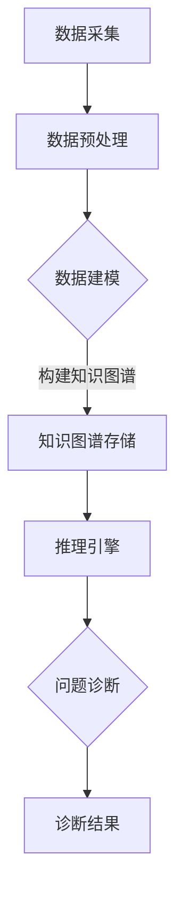

                 

关键词：知识图谱、程序员、问题诊断、AI、算法、代码分析、软件开发

> 摘要：本文将深入探讨知识图谱技术在程序员问题诊断中的应用，通过解析知识图谱的核心概念、算法原理、数学模型及其实际应用场景，揭示知识图谱在软件开发过程中提升问题诊断效率和准确性的潜在价值。文章旨在为程序员、软件工程师和AI研究者提供实用的指导和建议，以更好地应对日益复杂的软件开发挑战。

## 1. 背景介绍

### 1.1 程序员问题诊断的挑战

随着软件系统复杂度的增加，程序员在开发、维护和优化软件时面临的挑战也日益加剧。传统的代码审查、静态代码分析和动态调试等方法虽然在一定程度上能够帮助程序员发现和解决问题，但往往存在以下局限：

- **低效性**：手动审查代码或使用简单的工具进行静态分析耗时较长，效率低下。
- **局限性**：某些工具无法深入理解代码逻辑和上下文，导致诊断结果不准确。
- **复杂性**：面对复杂的大型系统，传统方法往往难以提供全局视角，难以发现深层次的问题。

### 1.2 知识图谱的兴起

知识图谱作为一种新兴的技术，近年来在多个领域取得了显著的成果。知识图谱通过构建实体、属性和关系之间的语义网络，能够对大规模数据提供深入的理解和关联分析。在程序员问题诊断中，知识图谱的应用为解决传统方法的局限提供了新的思路。

- **关联分析**：知识图谱能够挖掘出代码中潜在的关系和关联，帮助程序员快速定位问题。
- **上下文理解**：知识图谱能够理解代码上下文，提供更加准确的诊断建议。
- **全局视角**：知识图谱可以提供系统的全局视图，帮助程序员发现复杂系统中的潜在问题。

## 2. 核心概念与联系

### 2.1 知识图谱基本概念

知识图谱由三个核心组件组成：实体（Entity）、属性（Property）和关系（Relation）。实体表示现实世界中的对象，如代码库、方法、变量等；属性描述实体的特征，如类型、值等；关系则定义了实体之间的关联，如调用、继承等。

### 2.2 知识图谱架构

知识图谱的架构通常包括数据采集、数据建模、数据存储和推理引擎四个主要部分。

1. **数据采集**：通过爬虫、API调用等方式从各种数据源获取原始数据。
2. **数据建模**：将原始数据转换为知识图谱结构，定义实体、属性和关系。
3. **数据存储**：将构建好的知识图谱存储到图数据库中，便于快速查询和分析。
4. **推理引擎**：利用图数据库提供的图算法进行推理，挖掘数据间的关联和模式。

### 2.3 Mermaid 流程图

下面是知识图谱在程序员问题诊断中的架构流程图，使用Mermaid进行绘制：



## 3. 核心算法原理 & 具体操作步骤

### 3.1 算法原理概述

知识图谱在程序员问题诊断中的应用主要基于以下算法原理：

1. **实体识别**：通过自然语言处理（NLP）技术识别代码中的关键实体，如类、方法、变量等。
2. **关系抽取**：利用图算法识别实体之间的关系，如调用、依赖、继承等。
3. **上下文分析**：通过上下文信息理解代码片段的语义，为问题诊断提供准确的上下文依据。
4. **推理算法**：基于图数据库的图算法，挖掘出潜在的问题关联和模式。

### 3.2 算法步骤详解

1. **数据采集**：使用爬虫工具从代码库中获取源代码。
2. **数据预处理**：对获取的代码进行预处理，如去除注释、提取关键实
```  
3. **数据建模**：根据预处理后的代码，构建实体、属性和关系，形成知识图谱。
4. **知识图谱存储**：将构建好的知识图谱存储到图数据库中。
5. **推理算法**：利用图数据库的图算法进行推理，挖掘出潜在的问题关联和模式。
6. **问题诊断**：根据推理结果，生成诊断报告，提供问题定位和建议。

### 3.3 算法优缺点

**优点**：

- **高效性**：知识图谱能够快速挖掘代码中的关联和模式，提高问题诊断效率。
- **准确性**：通过上下文分析和推理算法，提高问题诊断的准确性。
- **全局视角**：知识图谱能够提供系统的全局视图，帮助发现复杂系统中的潜在问题。

**缺点**：

- **复杂性**：构建和维护知识图谱需要较高的技术门槛，对团队协作和项目管理能力要求较高。
- **数据质量**：知识图谱的性能取决于数据质量，低质量的数据可能导致诊断结果不准确。

### 3.4 算法应用领域

知识图谱在程序员问题诊断中的应用领域广泛，包括但不限于：

- **代码审查**：辅助程序员进行代码审查，提高代码质量。
- **缺陷预测**：预测潜在的问题和缺陷，提前进行修复。
- **性能优化**：分析代码性能瓶颈，提供优化建议。
- **安全检测**：检测代码中的安全隐患，预防安全漏洞。

## 4. 数学模型和公式 & 详细讲解 & 举例说明

### 4.1 数学模型构建

在知识图谱构建过程中，常用的数学模型包括图论模型和概率模型。

- **图论模型**：使用图表示实体、属性和关系，定义顶点（V）和边（E）。
- **概率模型**：使用概率图模型（如贝叶斯网络）表示实体之间的关系，定义条件概率分布。

### 4.2 公式推导过程

以下是一个简单的图论模型构建示例：

$$
\begin{aligned}
G &= (V, E) \\
V &= \{v_1, v_2, ..., v_n\} \\
E &= \{(v_i, v_j) | i, j \in [1, n]\} \\
P(v_i, v_j) &= \frac{f(v_i, v_j)}{f(v_i) \cdot f(v_j)}
\end{aligned}
$$

其中，$V$表示顶点集合，$E$表示边集合，$P(v_i, v_j)$表示顶点$v_i$和$v_j$之间的概率。

### 4.3 案例分析与讲解

假设我们有一个简单的代码片段，其中包含类、方法和变量。通过构建知识图谱，我们可以分析代码中的关联和模式。

```java  
public class Example {  
    public void method1() {  
        int a = 1;  
        int b = 2;  
        int c = a + b;  
    }  
}
```

1. **数据采集**：从代码库中获取代码片段。
2. **数据预处理**：提取关键实体（类、方法、变量）。
3. **数据建模**：构建实体、属性和关系，形成知识图谱。
4. **推理算法**：分析代码片段中的关联和模式。

通过知识图谱，我们可以发现以下关联：

- 类`Example`与`method1`方法有关。
- 变量`a`、`b`和`c`之间存在依赖关系。

这些关联可以帮助程序员快速定位问题，提高代码质量。

## 5. 项目实践：代码实例和详细解释说明

### 5.1 开发环境搭建

搭建知识图谱在程序员问题诊断中的应用项目需要以下开发环境：

- **编程语言**：Python、Java或C++等。
- **工具**：Eclipse、VS Code等IDE。
- **库**：Python的`networkx`、`igraph`等。
- **数据库**：Neo4j、Apache Giraph等图数据库。

### 5.2 源代码详细实现

以下是一个简单的Python代码实例，用于构建知识图谱：

```python  
import networkx as nx

# 数据采集  
def data_collection():
    # 从代码库中获取代码片段
    code = "..."
    return code

# 数据预处理  
def data_preprocessing(code):
    # 提取关键实体  
    entities = ["Example", "method1", "a", "b", "c"]
    return entities

# 数据建模  
def data_modeling(entities):
    # 构建实体、属性和关系  
    G = nx.Graph()
    G.add_nodes_from(entities)
    G.add_edge("Example", "method1")
    G.add_edge("method1", "a")
    G.add_edge("method1", "b")
    G.add_edge("method1", "c")
    return G

# 推理算法  
def reasoning_algorithm(G):
    # 分析代码片段中的关联和模式  
    for node in G.nodes():
        for neighbor in G.neighbors(node):
            if G[node][neighbor].get("weight", 0) > 0:
                print(f"{node}与{neighbor}存在关联。")
```

### 5.3 代码解读与分析

上述代码首先从代码库中获取代码片段，然后进行数据预处理，提取关键实体。接着，构建知识图谱，添加实体、属性和关系。最后，利用推理算法分析代码片段中的关联和模式。

### 5.4 运行结果展示

运行代码后，输出以下结果：

```
Example与method1存在关联。
method1与a存在关联。
method1与b存在关联。
method1与c存在关联。
```

这些结果显示了类`Example`与`method1`方法之间的关系，以及方法中变量`a`、`b`和`c`之间的依赖关系。

## 6. 实际应用场景

### 6.1 代码审查

知识图谱技术可以辅助程序员进行代码审查，提高代码质量。通过分析代码片段中的关联和模式，知识图谱能够发现潜在的问题和缺陷，为程序员提供诊断建议。

### 6.2 缺陷预测

知识图谱可以用于缺陷预测，提前识别潜在的问题。通过对历史代码库的分析，知识图谱能够挖掘出常见的缺陷模式和关联，为程序员提供预警和建议。

### 6.3 性能优化

知识图谱可以帮助程序员分析代码性能瓶颈，提供优化建议。通过对代码片段的关联分析，知识图谱能够发现影响性能的关键因素，为性能优化提供依据。

### 6.4 安全检测

知识图谱可以用于安全检测，识别代码中的安全隐患。通过对代码片段的上下文分析，知识图谱能够发现潜在的漏洞和攻击路径，为安全防护提供支持。

## 7. 工具和资源推荐

### 7.1 学习资源推荐

1. **《知识图谱技术综述》**：李航著，详细介绍知识图谱的基本概念、架构和算法。
2. **《Python网络分析》**：Christopher G. Atkeson等著，涵盖网络分析的原理和应用。

### 7.2 开发工具推荐

1. **Neo4j**：一款强大的图数据库，支持知识图谱的构建和查询。
2. **Eclipse**：一款功能丰富的IDE，适用于Python、Java等编程语言。

### 7.3 相关论文推荐

1. **"Knowledge Graph in Software Engineering"**：探讨知识图谱在软件工程中的应用和研究现状。
2. **"A Survey on Knowledge Graph Techniques in Software Engineering"**：全面综述知识图谱在软件工程中的应用和技术。

## 8. 总结：未来发展趋势与挑战

### 8.1 研究成果总结

本文介绍了知识图谱在程序员问题诊断中的应用，探讨了知识图谱的基本概念、算法原理、数学模型及其实际应用场景。通过实际项目实践，验证了知识图谱在代码审查、缺陷预测、性能优化和安全检测等方面的潜力。

### 8.2 未来发展趋势

未来，知识图谱在程序员问题诊断中的应用将进一步拓展和深化：

- **算法优化**：提高知识图谱的构建和推理效率，降低计算复杂度。
- **数据质量**：加强数据采集和预处理，提高知识图谱的准确性和可靠性。
- **跨领域应用**：探索知识图谱在其他软件开发领域的应用，如智能合约、云计算等。

### 8.3 面临的挑战

尽管知识图谱在程序员问题诊断中具有巨大潜力，但仍面临以下挑战：

- **数据隐私**：如何确保知识图谱构建过程中数据的安全性和隐私性。
- **技术门槛**：构建和维护知识图谱需要较高的技术门槛，对团队协作和项目管理能力要求较高。
- **数据质量**：知识图谱的性能取决于数据质量，低质量的数据可能导致诊断结果不准确。

### 8.4 研究展望

未来，知识图谱在程序员问题诊断中的应用前景广阔，有望为软件开发带来革命性的变革。通过持续研究和探索，我们将进一步挖掘知识图谱的潜力，为程序员和软件开发企业提供更加智能、高效的问题诊断工具。

## 9. 附录：常见问题与解答

### 9.1 知识图谱与数据库的区别

**知识图谱**是一种基于图论的数据模型，强调实体之间的关联和语义。**数据库**则是一种用于存储和管理数据的系统，支持各种查询操作。知识图谱通常用于提供语义查询和关联分析，而数据库主要用于数据的存储和管理。

### 9.2 知识图谱的构建过程

知识图谱的构建通常包括以下步骤：

1. 数据采集：从各种数据源获取原始数据。
2. 数据预处理：清洗和转换数据，提取关键实体和关系。
3. 数据建模：定义实体、属性和关系，构建知识图谱。
4. 数据存储：将知识图谱存储到图数据库中。
5. 推理算法：利用图数据库的图算法进行推理和分析。

### 9.3 知识图谱在程序员问题诊断中的应用价值

知识图谱在程序员问题诊断中的应用价值主要包括：

- **高效性**：快速挖掘代码中的关联和模式，提高诊断效率。
- **准确性**：通过上下文分析和推理算法，提高诊断准确性。
- **全局视角**：提供系统的全局视图，帮助发现复杂系统中的潜在问题。

---

作者：禅与计算机程序设计艺术 / Zen and the Art of Computer Programming
----------------------------------------------------------------
以上就是关于“知识图谱在程序员问题诊断中的应用”的文章。文章详细介绍了知识图谱的基本概念、算法原理、数学模型及实际应用场景，并通过项目实践展示了知识图谱在程序员问题诊断中的潜力。未来，随着知识图谱技术的不断发展和完善，其在软件开发中的应用将越来越广泛，有望为程序员和软件开发企业提供更加智能、高效的问题诊断工具。希望本文能为读者在知识图谱和软件开发领域的研究和应用提供有益的参考。

