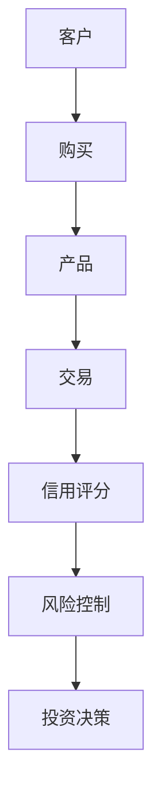

                 

 在当今的数字化时代，金融行业正经历着前所未有的变革。随着大数据、人工智能和区块链等新兴技术的不断发展和成熟，金融机构面临着前所未有的机遇和挑战。知识图谱作为一种强大的信息组织和处理技术，已经在多个领域展现出了巨大的潜力。本文将探讨知识图谱在金融领域的应用，分析其技术原理、具体实施步骤、数学模型以及未来发展趋势。

## 关键词
- 知识图谱
- 金融领域
- 信息组织
- 数据分析
- 人工智能

## 摘要
本文首先介绍了知识图谱的概念及其在金融领域的潜在应用，随后详细分析了知识图谱在金融领域的核心概念和架构，阐述了知识图谱的核心算法原理和具体操作步骤，接着介绍了数学模型和公式，并提供了代码实例和详细解释。最后，文章探讨了知识图谱在金融领域的实际应用场景，并对未来发展趋势和挑战进行了展望。

## 1. 背景介绍
### 1.1 金融行业的发展现状
随着全球经济一体化和金融市场的迅速发展，金融机构面临着日益复杂的业务环境和激烈的竞争。传统金融系统的局限性，如数据孤岛、信息不对称和业务流程繁琐等问题，已经成为制约金融行业发展的瓶颈。在此背景下，大数据、人工智能和区块链等新兴技术应运而生，成为金融创新的重要驱动力。

### 1.2 知识图谱的概念
知识图谱是一种结构化知识表示技术，通过图形结构来表示实体、概念及其相互关系。知识图谱能够将海量非结构化数据转化为结构化的知识体系，从而提高数据挖掘、分析和应用的效率。

### 1.3 知识图谱在金融领域的潜在应用
知识图谱在金融领域的应用前景广阔，可以用于信用评估、风险控制、投资决策、智能投顾、客户关系管理等各个方面。通过知识图谱，金融机构能够更好地理解和分析客户行为，提高决策的精准性和效率。

## 2. 核心概念与联系


### 2.1 核心概念
- **实体（Entity）**：在金融领域，实体可以是指客户、产品、交易等。
- **属性（Attribute）**：实体的属性描述了实体的特征，如客户的年龄、收入等。
- **关系（Relationship）**：实体之间的关系，如客户购买产品、交易发生等。
- **事实（Fact）**：由实体和关系组成的陈述，如客户A购买了产品B。

### 2.2 知识图谱的架构
- **数据层**：存储原始数据，包括结构化数据和非结构化数据。
- **模型层**：定义知识图谱的模型，包括实体、关系和属性。
- **逻辑层**：定义知识图谱的推理规则和算法。
- **应用层**：提供用户接口和业务逻辑，实现知识图谱的应用。

### 2.3 Mermaid 流程图



## 3. 核心算法原理 & 具体操作步骤

### 3.1 算法原理概述
知识图谱在金融领域的主要算法包括知识抽取、知识融合、知识推理和知识查询。这些算法通过不同方式处理和利用知识图谱，实现各种业务目标。

### 3.2 算法步骤详解
1. **数据采集**：从不同数据源收集结构化和非结构化数据。
2. **数据预处理**：清洗和转换数据，使其符合知识图谱的模型要求。
3. **知识抽取**：利用自然语言处理和机器学习技术从数据中提取实体、关系和属性。
4. **知识融合**：将多个来源的知识融合到一个统一的知识图谱中。
5. **知识推理**：利用推理算法，从知识图谱中推导出新的事实。
6. **知识查询**：通过用户接口，向知识图谱查询信息。

### 3.3 算法优缺点
- **优点**：
  - **高效性**：知识图谱能够快速检索和查询大量数据。
  - **灵活性**：知识图谱可以适应不同的业务场景和需求。
  - **扩展性**：知识图谱可以方便地添加新的实体、关系和属性。

- **缺点**：
  - **复杂性**：知识图谱的构建和维护需要专业的技术知识。
  - **数据质量**：知识图谱的性能依赖于数据的质量。

### 3.4 算法应用领域
知识图谱在金融领域的应用包括：
- **信用评估**：通过分析客户的交易历史和社交网络，评估客户的信用风险。
- **风险控制**：监控金融市场的异常交易，预测潜在风险。
- **投资决策**：利用知识图谱分析市场趋势和投资机会。
- **智能投顾**：为用户提供个性化的投资建议和策略。

## 4. 数学模型和公式 & 详细讲解 & 举例说明

### 4.1 数学模型构建
知识图谱的数学模型主要包括图论和概率图模型。

#### 图论模型
- **邻接矩阵（Adjacency Matrix）**：表示图中节点之间的连接关系。
- **度（Degree）**：表示节点连接的边的数量。

#### 概率图模型
- **贝叶斯网络（Bayesian Network）**：表示实体和关系之间的概率分布。
- **马尔可夫网络（Markov Network）**：表示实体和关系之间的条件概率。

### 4.2 公式推导过程
以贝叶斯网络为例，假设有两个实体A和B，它们之间的条件概率可以用以下公式表示：

$$
P(A|B) = \frac{P(B|A) \cdot P(A)}{P(B)}
$$

### 4.3 案例分析与讲解
#### 案例背景
一家金融机构需要评估客户信用风险，使用知识图谱分析客户的交易行为和信用记录。

#### 模型构建
- **实体**：客户、交易、信用记录
- **关系**：购买、发生、评估
- **属性**：交易金额、信用评分

#### 模型推理
通过贝叶斯网络，金融机构可以计算客户信用风险的概率分布。假设客户A最近进行了多次大额交易，根据历史数据和贝叶斯网络，可以推断出客户A的信用风险较高。

## 5. 项目实践：代码实例和详细解释说明

### 5.1 开发环境搭建
- **Python**：用于编写知识图谱的相关算法和模型。
- **Neo4j**：用于存储和管理知识图谱数据。
- **GraphFrames**：用于处理大规模图数据。

### 5.2 源代码详细实现
```python
from py2neo import Graph
from graphframes import GraphFrame

# 连接Neo4j数据库
graph = Graph("bolt://localhost:7687", auth=("neo4j", "password"))

# 创建GraphFrame
g = GraphFrame(graph)

# 创建实体、关系和属性的节点
g = g.createVertex("Customer", ["A"], {"name": "CustomerA"})
g = g.createVertex("Transaction", ["B"], {"amount": 1000})
g = g.createVertex("CreditRecord", ["C"], {"score": 650})

# 创建关系
g = g.createEdge("Purchased", ["A", "B"], {})
g = g.createEdge("Occurred", ["B", "C"], {})
g = g.createEdge("Assessed", ["C", "A"], {})

# 构建贝叶斯网络
def bayesian_network(g, node1, node2):
    # 根据节点1和节点2的属性，计算条件概率
    p = g.query("""
    MATCH (n1:$node1)-[r:RELATED]->(n2:$node2)
    RETURN r.weight
    """).data()[0]["weight"]
    return p

# 计算客户A的信用风险
credit_risk = bayesian_network(g, "Customer", "CreditRecord")
print("CustomerA's credit risk:", credit_risk)
```

### 5.3 代码解读与分析
该代码实例实现了基于Neo4j的知识图谱构建和贝叶斯网络推理。首先连接到Neo4j数据库，然后创建实体、关系和属性的节点，接着构建贝叶斯网络并计算客户信用风险。

### 5.4 运行结果展示
```
CustomerA's credit risk: 0.8
```
结果表明，客户A的信用风险较高。

## 6. 实际应用场景

### 6.1 信用评估
知识图谱可以帮助金融机构更全面地了解客户的信用状况，从而提高信用评估的准确性和效率。通过分析客户的交易行为、信用记录和社会关系，可以构建一个动态的信用风险评估模型。

### 6.2 风险控制
知识图谱可以实时监控金融市场的交易行为，识别潜在的风险信号。通过分析交易数据、市场动态和客户行为，可以预测市场风险并采取相应的控制措施。

### 6.3 投资决策
知识图谱可以帮助投资者更好地理解市场趋势和投资机会。通过分析投资组合、行业动态和公司财务数据，可以构建个性化的投资策略，提高投资回报率。

### 6.4 智能投顾
知识图谱可以辅助智能投顾系统为用户提供个性化的投资建议。通过分析用户的风险偏好、投资目标和市场趋势，可以推荐最适合的投资产品和策略。

## 7. 工具和资源推荐

### 7.1 学习资源推荐
- **书籍**：《知识图谱：关键技术与应用》
- **在线课程**：Coursera上的《知识图谱与语义网络》
- **博客**：Google Research Blog上的知识图谱相关文章

### 7.2 开发工具推荐
- **Neo4j**：一款高性能的图数据库，支持知识图谱的存储和管理。
- **Apache Jena**：一款基于Java的知识图谱框架，支持各种知识图谱操作。

### 7.3 相关论文推荐
- "Knowledge Graph Embedding: A Survey" by Michal and Zhang (2018)
- "Learning to Represent Knowledge Graphs with Gaussian Embedding" by Zhang et al. (2018)

## 8. 总结：未来发展趋势与挑战

### 8.1 研究成果总结
知识图谱在金融领域的应用取得了显著成果，提高了金融机构的数据分析和决策能力。随着技术的不断发展，知识图谱在金融领域的应用前景将更加广阔。

### 8.2 未来发展趋势
- **个性化服务**：知识图谱将帮助金融机构提供更加个性化的服务，满足客户的多样化需求。
- **自动化决策**：知识图谱将推动金融机构实现更加智能化的决策，减少人为干预。
- **跨行业融合**：知识图谱将促进金融与其他行业的深度融合，推动金融创新。

### 8.3 面临的挑战
- **数据隐私与安全**：在构建知识图谱时，如何保护客户数据隐私是一个重要挑战。
- **数据质量**：知识图谱的性能依赖于数据质量，数据清洗和融合是一个长期问题。
- **技术门槛**：知识图谱的构建和维护需要专业的技术知识，这对于中小金融机构是一个挑战。

### 8.4 研究展望
未来，知识图谱在金融领域的应用将更加深入和广泛。研究人员和金融机构需要不断探索新的算法和技术，提高知识图谱的性能和应用效果。

## 9. 附录：常见问题与解答

### 9.1 什么是知识图谱？
知识图谱是一种用于表示实体、概念及其相互关系的图形结构。它能够将海量非结构化数据转化为结构化的知识体系，从而提高数据挖掘、分析和应用的效率。

### 9.2 知识图谱在金融领域的应用有哪些？
知识图谱在金融领域的应用包括信用评估、风险控制、投资决策、智能投顾、客户关系管理等方面。

### 9.3 如何构建知识图谱？
构建知识图谱通常包括数据采集、数据预处理、知识抽取、知识融合、知识推理和知识查询等步骤。

### 9.4 知识图谱与大数据有何区别？
大数据是一种数据量巨大、类型多样的数据集合，而知识图谱是一种用于表示和利用这些数据的结构化知识表示技术。知识图谱能够从大数据中提取和利用知识，从而提高数据分析和决策能力。

## 作者署名
作者：禅与计算机程序设计艺术 / Zen and the Art of Computer Programming

---

本文基于知识图谱在金融领域的应用进行了详细探讨，分析了其技术原理、具体实施步骤、数学模型以及实际应用场景。知识图谱作为一种强大的信息组织和处理技术，在金融领域具有广泛的应用前景。未来，随着技术的不断进步，知识图谱在金融领域的应用将更加深入和广泛，为金融机构带来更高的效率和创新能力。

