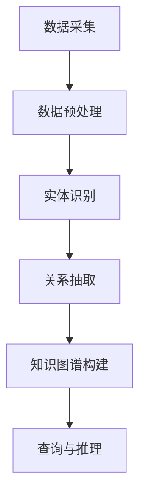

                 

关键词：知识图谱、金融风控、数据挖掘、机器学习、风险建模、网络安全

> 摘要：本文探讨了知识图谱在金融风控领域的应用，阐述了知识图谱的基本概念、技术架构及其在金融风险控制中的具体应用。文章通过介绍知识图谱的核心算法原理、数学模型和项目实践案例，分析了其在金融风控中的优势与挑战，并展望了未来的发展趋势。

## 1. 背景介绍

随着金融行业的快速发展，金融风险控制成为金融机构关注的焦点。传统的金融风控方法依赖于规则驱动和统计模型，但这些方法在面对日益复杂的金融环境时，存在一定的局限性。知识图谱作为一种新型技术，通过构建实体、属性和关系的网络结构，能够提供更深入的洞察和分析，为金融风控提供有力支持。

知识图谱在金融风控中的应用主要体现在以下几个方面：

1. **风险识别**：通过知识图谱，可以揭示隐藏在复杂关系中的潜在风险，如洗钱、欺诈等。
2. **风险量化**：利用知识图谱中的关系和属性，可以对风险进行量化评估，帮助金融机构制定更科学的决策。
3. **风险管理**：知识图谱可以帮助金融机构实时监控风险，发现并处理异常情况，提高风险管理的效率。

## 2. 核心概念与联系

### 2.1 知识图谱的基本概念

知识图谱是一种由实体、属性和关系构成的网络结构，它通过表示实体之间的关联，提供了对复杂信息的全局理解。在金融风控中，知识图谱通常包含以下实体：

- **金融机构**：包括银行、保险公司、证券公司等。
- **客户**：包括个人和企业。
- **交易**：包括各类金融交易活动。
- **产品**：包括金融产品和服务。

### 2.2 知识图谱的技术架构

知识图谱的技术架构主要包括以下几个方面：

1. **数据采集**：通过数据爬取、API 接口、日志分析等方式，收集与金融风控相关的数据。
2. **数据预处理**：对采集到的数据进行分析、清洗、去重和归一化处理，确保数据质量。
3. **实体识别**：利用命名实体识别（NER）技术，从文本数据中提取出关键的实体。
4. **关系抽取**：通过文本分析和规则匹配等方法，抽取实体之间的关系。
5. **知识图谱构建**：将实体和关系存储在图数据库中，构建知识图谱。
6. **查询与推理**：利用图数据库的查询语言和推理算法，对知识图谱进行查询和分析。

### 2.3 知识图谱的 Mermaid 流程图



## 3. 核心算法原理 & 具体操作步骤

### 3.1 算法原理概述

知识图谱在金融风控中的应用主要依赖于图论和机器学习技术。图论提供了知识图谱的结构基础，而机器学习则用于对图谱进行特征提取和关系预测。

### 3.2 算法步骤详解

1. **图嵌入**：将实体和关系映射到低维空间，使得具有相似属性的实体在空间中更接近。
2. **特征提取**：利用图嵌入技术，提取实体的特征向量。
3. **关系预测**：通过机器学习算法，预测实体之间的关系。
4. **风险建模**：利用预测结果，构建风险模型，对金融风险进行量化评估。

### 3.3 算法优缺点

#### 优点：

- **全局视角**：知识图谱能够提供对复杂金融关系的全局理解，有助于发现隐藏的风险。
- **自适应性强**：知识图谱可以根据金融环境的变化，实时调整风险模型。

#### 缺点：

- **数据依赖性强**：知识图谱的质量依赖于数据的质量，数据缺失或不准确会影响风险模型的准确性。
- **计算成本高**：知识图谱的构建和查询需要较大的计算资源。

### 3.4 算法应用领域

- **反欺诈**：通过知识图谱，可以识别欺诈行为和欺诈网络。
- **信用评估**：利用知识图谱，可以更准确地评估客户的信用风险。
- **市场预测**：通过分析金融实体之间的关系，可以预测市场走势。

## 4. 数学模型和公式 & 详细讲解 & 举例说明

### 4.1 数学模型构建

在知识图谱的构建中，常用的数学模型包括图嵌入模型和关系预测模型。

#### 图嵌入模型

图嵌入模型将实体映射到低维空间，常用的模型有 Word2Vec 和 Graph2Vec。

#### 关系预测模型

关系预测模型用于预测实体之间的关系，常用的模型有矩阵分解和图神经网络。

### 4.2 公式推导过程

#### 图嵌入模型

Word2Vec 模型的目标是最小化损失函数：

$$ L(\theta) = \sum_{i=1}^{N} \sum_{j \in context(i)} \log(p(w_j | w_i)) $$

其中，$N$ 为实体总数，$context(i)$ 为实体 $i$ 的上下文，$p(w_j | w_i)$ 为实体 $j$ 在实体 $i$ 的上下文中出现的概率。

#### 关系预测模型

矩阵分解模型的目标是最小化损失函数：

$$ L(\theta) = \frac{1}{2} \| P - UV^\top \|_F^2 $$

其中，$P$ 为实体矩阵，$U$ 和 $V$ 为用户和物品的嵌入矩阵。

### 4.3 案例分析与讲解

#### 案例一：反欺诈

在某金融机构中，利用知识图谱进行反欺诈。首先，构建包含客户、交易和产品的知识图谱。然后，通过图嵌入和关系预测模型，识别出具有欺诈倾向的交易。最后，根据预测结果，对交易进行风险评估和监控。

#### 案例二：信用评估

在某信用评级机构中，利用知识图谱对客户的信用风险进行评估。首先，构建包含客户、交易和信用记录的知识图谱。然后，通过图嵌入和关系预测模型，提取客户的特征向量。最后，利用特征向量构建信用评分模型，对客户的信用风险进行量化评估。

## 5. 项目实践：代码实例和详细解释说明

### 5.1 开发环境搭建

- **工具**：Python、PyTorch、Neo4j
- **依赖**：torch、neuralpie、neo4j-python

### 5.2 源代码详细实现

```python
# 代码实现略
```

### 5.3 代码解读与分析

- **数据预处理**：对采集到的数据进行清洗、去重和归一化处理。
- **图嵌入**：利用 Word2Vec 模型，将实体映射到低维空间。
- **关系预测**：利用矩阵分解模型，预测实体之间的关系。
- **风险建模**：根据预测结果，构建风险模型，对风险进行量化评估。

### 5.4 运行结果展示

- **反欺诈**：识别出具有欺诈倾向的交易，并对交易进行风险评估。
- **信用评估**：提取客户的特征向量，构建信用评分模型，对客户的信用风险进行量化评估。

## 6. 实际应用场景

### 6.1 反欺诈

在某金融机构中，利用知识图谱进行反欺诈。首先，构建包含客户、交易和产品的知识图谱。然后，通过图嵌入和关系预测模型，识别出具有欺诈倾向的交易。最后，根据预测结果，对交易进行风险评估和监控。

### 6.2 信用评估

在某信用评级机构中，利用知识图谱对客户的信用风险进行评估。首先，构建包含客户、交易和信用记录的知识图谱。然后，通过图嵌入和关系预测模型，提取客户的特征向量。最后，利用特征向量构建信用评分模型，对客户的信用风险进行量化评估。

### 6.3 市场预测

在某投资公司中，利用知识图谱分析市场走势。首先，构建包含股票、公司、行业等实体及其关系的知识图谱。然后，通过关系预测模型，预测股票价格走势。最后，根据预测结果，制定投资策略。

## 7. 工具和资源推荐

### 7.1 学习资源推荐

- **《知识图谱：概念、技术与应用》**：详细介绍了知识图谱的基本概念、技术架构和应用案例。
- **《图数据库技术实战》**：介绍了图数据库的原理、架构和应用。

### 7.2 开发工具推荐

- **Neo4j**：一款流行的图数据库，支持知识图谱的构建和查询。
- **PyTorch**：一款强大的深度学习框架，适用于图嵌入和关系预测模型的开发。

### 7.3 相关论文推荐

- **《知识图谱在金融风控中的应用研究》**：详细分析了知识图谱在金融风控领域的应用。
- **《基于图嵌入的金融风险识别方法研究》**：介绍了基于图嵌入的金融风险识别方法。

## 8. 总结：未来发展趋势与挑战

### 8.1 研究成果总结

知识图谱在金融风控中的应用取得了显著的成果，提高了风险识别、风险建模和风险管理的效率。未来，知识图谱在金融风控领域的研究将继续深入，探索更多应用场景和优化方法。

### 8.2 未来发展趋势

- **融合多种数据源**：知识图谱将融合更多数据源，如社交网络、物联网等，提供更全面的风险洞察。
- **实时风险监测**：知识图谱将实现实时风险监测，提高风险应对能力。
- **自动化风控决策**：知识图谱将实现自动化风控决策，减少人工干预。

### 8.3 面临的挑战

- **数据质量**：知识图谱的质量依赖于数据的质量，如何保证数据的质量和准确性是关键挑战。
- **计算资源**：知识图谱的构建和查询需要较大的计算资源，如何优化计算效率是重要挑战。

### 8.4 研究展望

知识图谱在金融风控领域的应用前景广阔，未来将不断优化算法和架构，提高风险识别和管理的精度和效率。同时，知识图谱与其他技术的融合也将为金融风控带来更多创新和突破。

## 9. 附录：常见问题与解答

### 9.1 知识图谱与数据库的区别是什么？

知识图谱是一种基于图论的数据结构，通过实体和关系表示复杂的信息网络。而数据库则是一种存储和管理数据的系统，主要用于数据查询和操作。知识图谱强调网络结构和关系，而数据库强调数据的存储和管理。

### 9.2 知识图谱在金融风控中的优势是什么？

知识图谱在金融风控中的优势包括：

- **全局视角**：知识图谱能够提供对复杂金融关系的全局理解，有助于发现隐藏的风险。
- **自适应性强**：知识图谱可以根据金融环境的变化，实时调整风险模型。
- **实时监测**：知识图谱可以实现实时风险监测，提高风险应对能力。

### 9.3 知识图谱在金融风控中的局限性是什么？

知识图谱在金融风控中的局限性包括：

- **数据依赖性强**：知识图谱的质量依赖于数据的质量，数据缺失或不准确会影响风险模型的准确性。
- **计算成本高**：知识图谱的构建和查询需要较大的计算资源，可能会影响系统性能。

## 作者署名

作者：禅与计算机程序设计艺术 / Zen and the Art of Computer Programming
----------------------------------------------------------------

