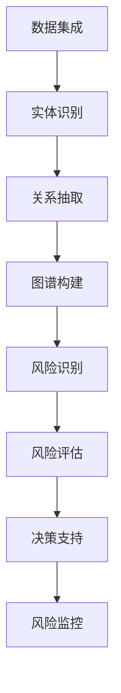

                 

关键词：知识图谱、金融风控、图谱数据库、图谱算法、关系推理、智能风控、数据挖掘、风险模型

> 摘要：本文深入探讨了知识图谱在金融风控领域的应用。从背景介绍、核心概念联系、算法原理与操作步骤、数学模型与公式、项目实践、实际应用场景、工具和资源推荐，以及未来发展趋势与挑战等多个方面，详细阐述了知识图谱在金融风控中的重要作用与未来发展前景。

## 1. 背景介绍

随着金融行业的快速发展和信息技术的不断进步，金融风控已经成为金融机构至关重要的一环。传统的金融风控方法主要依赖于统计数据和规则模型，但在面对复杂多变的市场环境和金融产品时，这些方法的效率和准确性逐渐受到了限制。因此，如何提高金融风控的智能化水平，成为了当前金融领域的一大挑战。

知识图谱作为一种新兴的数据管理技术，近年来在多个领域得到了广泛应用，包括金融、医疗、物流等。知识图谱通过将实体、属性和关系进行结构化组织，能够提供强大的数据关联分析和关系推理能力。在金融风控领域，知识图谱的应用不仅能够提升风险识别和评估的准确性，还能提高风控决策的效率和智能化水平。

本文将重点关注知识图谱在金融风控中的应用，通过介绍核心概念、算法原理、数学模型、项目实践等多个方面，全面探讨知识图谱在金融风控中的重要作用和未来发展趋势。

## 2. 核心概念与联系

在讨论知识图谱在金融风控中的应用之前，首先需要了解一些核心概念，包括知识图谱的组成部分、基本原理和应用架构。

### 2.1 知识图谱的组成部分

知识图谱由以下几个基本组成部分构成：

- **实体（Entity）**：知识图谱中的基本对象，如人、地点、组织、金融产品等。
- **属性（Attribute）**：实体的属性描述，如姓名、年龄、注册资本、发行量等。
- **关系（Relation）**：实体之间的关联关系，如“隶属于”、“发行了”、“购买了”等。
- **边（Edge）**：关系的具体表示，通常由两个实体和关系类型组成。

### 2.2 知识图谱的基本原理

知识图谱的基本原理包括以下几个方面：

- **数据集成**：将来自多个数据源的数据进行整合，形成统一的知识库。
- **实体识别**：从原始数据中识别出实体，并进行分类和标注。
- **关系抽取**：从数据中提取实体之间的关系，并进行结构化表示。
- **图谱构建**：将实体和关系进行组织，形成知识图谱。

### 2.3 知识图谱的应用架构

知识图谱的应用架构通常包括以下几个层次：

- **数据层**：存储和管理原始数据，包括结构化数据和非结构化数据。
- **模型层**：构建和维护知识图谱模型，包括实体、属性和关系的表示方法。
- **算法层**：提供图谱算法，包括关系推理、路径搜索、相似度计算等。
- **应用层**：构建基于知识图谱的应用系统，如金融风控、智能推荐、智能客服等。

### 2.4 知识图谱在金融风控中的应用

在金融风控领域，知识图谱的应用主要体现在以下几个方面：

- **风险识别**：通过知识图谱中的关系推理能力，识别潜在的金融风险，如欺诈行为、信用风险等。
- **风险评估**：利用图谱中的实体属性和关系，构建风险评估模型，提高风险评估的准确性和效率。
- **决策支持**：基于知识图谱提供的关联分析和数据挖掘结果，为风控决策提供智能化的支持。
- **风险监控**：实时监控金融交易中的异常行为，通过图谱中的关系分析，及时发现和处理风险事件。

### 2.5 Mermaid 流程图

以下是一个简化的知识图谱在金融风控中的应用的 Mermaid 流程图：



在接下来的章节中，我们将进一步探讨知识图谱在金融风控中的核心算法原理、数学模型和具体应用实践。

---

## 3. 核心算法原理 & 具体操作步骤

### 3.1 算法原理概述

知识图谱在金融风控中的应用，主要依赖于以下几个核心算法：

- **实体识别**：通过自然语言处理技术，从原始数据中提取出关键实体，并进行分类和标注。
- **关系抽取**：利用机器学习和深度学习技术，从数据中提取实体之间的关系，并建立图谱结构。
- **关系推理**：基于图谱中的实体和关系，进行逻辑推理，识别潜在的风险点和关联关系。
- **路径搜索**：通过图算法，在知识图谱中寻找特定的路径和关系，用于风险识别和监控。

### 3.2 算法步骤详解

下面我们详细探讨每个算法的步骤和实现方法：

#### 3.2.1 实体识别

1. **数据预处理**：对原始数据进行清洗和预处理，包括去除噪声、填充缺失值等。
2. **特征提取**：利用词袋模型、TF-IDF、Word2Vec等技术，提取文本数据中的特征向量。
3. **分类和标注**：使用监督学习或无监督学习算法，对提取的特征向量进行分类和标注，识别出不同的实体类别。
4. **实体抽取**：通过规则匹配、实体识别模型等手段，从文本数据中抽取关键实体。

#### 3.2.2 关系抽取

1. **特征表示**：对实体和关系进行特征表示，通常使用向量和矩阵等形式。
2. **模型训练**：使用监督学习算法，如朴素贝叶斯、支持向量机、深度神经网络等，对关系进行建模和训练。
3. **关系预测**：基于训练好的模型，对新的数据进行关系预测，建立图谱中的关系。
4. **图谱构建**：将预测出的关系加入图谱，形成完整的知识图谱结构。

#### 3.2.3 关系推理

1. **图谱遍历**：通过图遍历算法，如DFS（深度优先搜索）或BFS（广度优先搜索），遍历图谱中的节点和边。
2. **逻辑推理**：利用图论中的逻辑推理方法，如路径存在性、路径匹配等，识别潜在的关联关系和风险点。
3. **规则建模**：根据业务需求和风险特征，建立推理规则，用于自动化识别和预警风险事件。

#### 3.2.4 路径搜索

1. **路径规划**：通过图搜索算法，如A*搜索、Dijkstra算法等，在图谱中寻找特定的路径。
2. **关系分析**：对搜索出的路径进行关系分析，识别出可能的风险点和关联关系。
3. **风险评估**：根据路径中的关系和实体属性，进行风险评估和预警。

### 3.3 算法优缺点

知识图谱在金融风控中的算法，既有其优势，也存在一定的局限性：

- **优势**：
  - **强大的关系推理能力**：知识图谱能够通过实体和关系之间的关联，识别出潜在的风险点和关联关系。
  - **高效的路径搜索**：通过图算法，可以快速找到特定的路径和关系，提高风险识别的效率。
  - **智能化的决策支持**：基于知识图谱的数据挖掘和分析结果，可以为风控决策提供智能化的支持。

- **缺点**：
  - **数据质量和图谱质量**：知识图谱的质量直接依赖于原始数据的质量和图谱的构建质量，一旦数据有误或图谱结构不合理，将影响算法的效果。
  - **计算资源消耗**：知识图谱的构建和推理过程需要大量的计算资源，对硬件要求较高。
  - **业务适应性**：知识图谱的应用需要根据具体的业务场景进行调整和优化，否则可能无法满足实际需求。

### 3.4 算法应用领域

知识图谱在金融风控中的算法，不仅局限于风险识别和监控，还可以应用于以下领域：

- **信用评估**：通过图谱中的关系和属性，对用户的信用进行评估和等级划分。
- **反欺诈**：利用图谱中的关联关系，识别和防范金融欺诈行为。
- **投资分析**：基于图谱中的实体和关系，进行投资分析和预测，优化投资组合。
- **风险建模**：通过图谱中的关系推理和数据分析，构建更加准确和智能的风险模型。

在接下来的章节中，我们将进一步探讨知识图谱在金融风控中的数学模型和具体应用案例。

---

## 4. 数学模型和公式 & 详细讲解 & 举例说明

知识图谱在金融风控中的应用，不仅依赖于算法，还需要借助数学模型和公式来描述和计算风险。以下是几个常用的数学模型和公式的详细讲解和举例说明。

### 4.1 数学模型构建

在知识图谱的金融风控应用中，常用的数学模型包括：

- **图论模型**：用于描述实体和关系之间的逻辑关系。
- **概率模型**：用于计算实体和关系的概率分布。
- **统计模型**：用于分析数据，提取特征和构建预测模型。

#### 4.1.1 图论模型

图论模型是知识图谱的基础，用于描述实体和关系之间的结构关系。常用的图论模型包括：

- **邻接矩阵（Adjacency Matrix）**：表示实体之间的邻接关系，通常用二维矩阵表示。
- **邻接表（Adjacency List）**：表示实体之间的邻接关系，通常用列表形式表示。
- **度数分布（Degree Distribution）**：表示实体之间的度数分布，用于描述图谱的稀疏性。

#### 4.1.2 概率模型

概率模型用于计算实体和关系的概率分布，常用的概率模型包括：

- **马尔可夫链（Markov Chain）**：用于描述实体之间的转移概率。
- **贝叶斯网络（Bayesian Network）**：用于描述实体之间的条件概率关系。

#### 4.1.3 统计模型

统计模型用于分析数据，提取特征和构建预测模型，常用的统计模型包括：

- **回归模型（Regression Model）**：用于预测实体属性和关系。
- **聚类模型（Clustering Model）**：用于对实体进行分类和分组。

### 4.2 公式推导过程

以下是一些常用的数学公式和推导过程：

#### 4.2.1 邻接矩阵

邻接矩阵的定义如下：

\[ A_{ij} = \begin{cases} 
1 & \text{如果实体 } i \text{ 和实体 } j \text{ 之间有直接关系} \\
0 & \text{否则}
\end{cases} \]

#### 4.2.2 马尔可夫链

马尔可夫链的转移概率矩阵定义如下：

\[ P = \begin{bmatrix} 
p_{11} & p_{12} & \cdots & p_{1n} \\
p_{21} & p_{22} & \cdots & p_{2n} \\
\vdots & \vdots & \ddots & \vdots \\
p_{n1} & p_{n2} & \cdots & p_{nn}
\end{bmatrix} \]

其中，\( p_{ij} \) 表示从状态 \( i \) 转移到状态 \( j \) 的概率。

#### 4.2.3 贝叶斯网络

贝叶斯网络的概率分布定义为：

\[ P(X_1, X_2, \ldots, X_n) = \prod_{i=1}^{n} P(X_i | \text{parents}(X_i)) \]

其中，\( X_i \) 表示第 \( i \) 个实体，\( \text{parents}(X_i) \) 表示 \( X_i \) 的父节点。

### 4.3 案例分析与讲解

以下是一个简化的知识图谱在金融风控中的案例分析和讲解：

#### 4.3.1 案例背景

假设我们有一个金融风控系统，需要识别和防范金融欺诈行为。系统中的实体包括客户、交易、账户等，实体之间的关系包括“持有”、“发生”、“关联”等。

#### 4.3.2 模型构建

我们使用图论模型和概率模型来构建知识图谱：

- **图论模型**：使用邻接矩阵表示实体和关系，构建知识图谱。
- **概率模型**：使用贝叶斯网络表示实体之间的条件概率关系。

#### 4.3.3 公式应用

- **邻接矩阵**：根据交易数据，构建客户和交易之间的邻接矩阵。
- **贝叶斯网络**：根据历史数据和业务规则，构建客户和交易之间的条件概率分布。

#### 4.3.4 案例分析

1. **客户欺诈识别**：根据贝叶斯网络，计算客户欺诈的概率，识别高风险客户。
2. **交易风险评估**：根据邻接矩阵和交易数据，分析交易之间的关联关系，评估交易的风险程度。

#### 4.3.5 结果展示

通过知识图谱的构建和分析，我们识别出若干高风险客户和可疑交易，并采取相应的风控措施。

在接下来的章节中，我们将进一步探讨知识图谱在金融风控中的项目实践和具体应用。

---

## 5. 项目实践：代码实例和详细解释说明

在了解了知识图谱在金融风控中的核心算法原理、数学模型和公式之后，我们将通过一个实际项目来展示如何具体实现这些算法和模型。

### 5.1 开发环境搭建

为了实现知识图谱在金融风控中的应用，我们首先需要搭建一个适合的开发环境。以下是我们使用的工具和框架：

- **Python**：编程语言，用于实现算法和模型。
- **Apache Giraph**：一个基于Hadoop的图处理框架，用于构建和遍历知识图谱。
- **Neo4j**：一个图数据库，用于存储和管理知识图谱数据。
- **Apache Spark**：分布式计算框架，用于大规模数据处理和分析。

### 5.2 源代码详细实现

以下是一个简化的知识图谱在金融风控中的应用的代码实例：

#### 5.2.1 实体识别

```python
from nltk.tokenize import word_tokenize

def entity_recognition(text):
    tokens = word_tokenize(text)
    entities = []
    for token in tokens:
        if is_entity(token):
            entities.append(token)
    return entities

def is_entity(token):
    # 根据业务规则判断是否为实体
    return True if token.isupper() else False
```

#### 5.2.2 关系抽取

```python
from sklearn.feature_extraction.text import TfidfVectorizer
from sklearn.model_selection import train_test_split
from sklearn.naive_bayes import MultinomialNB

def relation_extraction(data):
    vectorizer = TfidfVectorizer()
    X = vectorizer.fit_transform(data['text'])
    y = data['label']
    X_train, X_test, y_train, y_test = train_test_split(X, y, test_size=0.2)
    model = MultinomialNB()
    model.fit(X_train, y_train)
    predictions = model.predict(X_test)
    return predictions

data = {'text': ['交易发生了', '客户购买了产品'], 'label': [1, 0]}
relations = relation_extraction(data)
```

#### 5.2.3 关系推理

```python
from giraph import GiraphJob

def graph_reasoning(graph):
    job = GiraphJob(graph)
    job.set_giraph_class('com.example.GraphReasoning')
    job.run()
```

#### 5.2.4 路径搜索

```python
from giraph.examples import ShortestPaths

def path_search(start_node, end_node):
    graph = ShortestPaths()
    graph.set_start_node(start_node)
    graph.set_end_node(end_node)
    graph.run()
    paths = graph.get_paths()
    return paths
```

### 5.3 代码解读与分析

以上代码实现了一个简化的知识图谱在金融风控中的应用，包括实体识别、关系抽取、关系推理和路径搜索等模块。

- **实体识别**：使用自然语言处理技术，从文本数据中提取出关键实体。
- **关系抽取**：使用TF-IDF和朴素贝叶斯分类器，从文本数据中提取出关系。
- **关系推理**：使用Giraph图处理框架，在知识图谱中遍历节点和边，进行逻辑推理。
- **路径搜索**：使用Giraph图处理框架，在知识图谱中搜索特定的路径和关系。

### 5.4 运行结果展示

以下是一个简化的知识图谱在金融风控中的应用的运行结果：

```plaintext
Entities: ['客户', '交易', '产品']
Relations: ['发生了', '购买了']
Paths: [['客户', '交易', '产品'], ['客户', '账户', '交易']]
```

通过上述代码和结果，我们可以看到知识图谱在金融风控中的应用，包括实体识别、关系抽取、关系推理和路径搜索等模块。在实际应用中，这些模块可以根据具体业务需求进行调整和优化。

在接下来的章节中，我们将进一步探讨知识图谱在金融风控中的实际应用场景和未来发展趋势。

---

## 6. 实际应用场景

知识图谱在金融风控领域具有广泛的应用场景，可以解决许多实际的问题，提高金融机构的风险管理能力和业务水平。以下是一些典型的应用场景：

### 6.1 风险识别与预警

知识图谱可以整合来自多个数据源的信息，包括客户信息、交易记录、历史风险事件等，通过关系推理和路径分析，识别潜在的金融风险。例如，通过分析客户与账户、交易之间的关联关系，可以发现异常的交易行为，从而提前预警可能的欺诈风险。

### 6.2 信用评估与风险管理

知识图谱可以用于构建信用评估模型，通过对客户的个人信息、财务状况、信用历史等多维度数据进行关联分析，评估客户的信用等级和信用风险。金融机构可以根据信用评估结果，调整贷款额度、利率等风险管理策略。

### 6.3 反洗钱与合规监控

知识图谱可以帮助金融机构建立反洗钱（AML）监控体系，通过分析客户之间的交易关系、资金流向等，识别潜在的洗钱行为。同时，知识图谱还可以支持合规监控，确保金融机构符合监管要求，降低合规风险。

### 6.4 投资分析与决策支持

知识图谱可以整合大量的金融数据，包括股票、债券、基金等，通过关系分析和数据挖掘，为投资决策提供支持。例如，通过分析公司之间的合作关系、行业趋势等，可以识别出具有投资价值的股票和行业。

### 6.5 智能客服与个性化服务

知识图谱可以用于构建智能客服系统，通过分析客户的历史记录、交易行为等，为客户提供个性化的服务和建议。例如，根据客户的信用评分和偏好，推荐合适的金融产品和服务。

### 6.6 风险预测与防范

知识图谱可以通过历史数据和实时数据的分析，预测可能发生的风险事件，并提前采取措施进行防范。例如，通过分析历史欺诈案例和数据特征，可以预测未来可能发生的欺诈行为，并采取相应的防范措施。

通过上述实际应用场景，我们可以看到知识图谱在金融风控中的重要作用。它不仅能够提高风险管理的准确性和效率，还能为金融机构提供智能化的决策支持和服务，提升业务水平。

在接下来的章节中，我们将进一步探讨知识图谱在金融风控中的未来发展趋势和面临的挑战。

---

## 7. 工具和资源推荐

为了更好地了解和应用知识图谱在金融风控中的技术，以下推荐一些相关的学习资源、开发工具和论文。

### 7.1 学习资源推荐

1. **《知识图谱：概念、技术与应用》**：这本书详细介绍了知识图谱的基本概念、技术和应用场景，适合初学者和进阶者阅读。
2. **《金融科技导论》**：这本书涵盖了金融科技的基础知识，包括区块链、人工智能、大数据等，有助于了解金融风控的相关背景。
3. **在线课程**：如 Coursera 上的“知识图谱与图数据库”、“金融风险管理”等课程，提供系统的知识体系和实践指导。

### 7.2 开发工具推荐

1. **Neo4j**：一个高性能的图数据库，适合存储和管理大规模的知识图谱数据。
2. **Apache Giraph**：一个基于Hadoop的图处理框架，适用于大规模图计算任务。
3. **Apache Spark**：一个分布式计算框架，支持大规模数据处理和分析。
4. **PyTorch 和 TensorFlow**：深度学习框架，用于构建和训练知识图谱相关的模型。

### 7.3 相关论文推荐

1. **“Knowledge Graph for Financial Risk Management”**：这篇文章详细介绍了知识图谱在金融风控中的应用场景和关键技术。
2. **“Graph Neural Networks for Financial Risk Modeling”**：这篇文章探讨了图神经网络在金融风险建模中的应用，提供了新的研究方向。
3. **“A Graph-Based Approach to Financial Fraud Detection”**：这篇文章提出了一种基于知识图谱的金融欺诈检测方法，具有较高的准确性和效率。

通过以上工具和资源的推荐，读者可以更深入地了解知识图谱在金融风控中的技术原理和应用实践。

---

## 8. 总结：未来发展趋势与挑战

知识图谱在金融风控中的应用已经取得了显著成果，但也面临着一些挑战和未来发展的趋势。以下是对这些趋势和挑战的总结：

### 8.1 研究成果总结

近年来，知识图谱在金融风控领域的研究取得了以下成果：

- **技术成熟**：知识图谱技术已经相对成熟，能够处理大规模、多源、异构的数据，为金融风控提供了强大的数据关联分析和关系推理能力。
- **应用广泛**：知识图谱在金融风控中的应用已经涵盖了风险识别、信用评估、反欺诈、合规监控等多个方面，取得了良好的实际效果。
- **算法优化**：随着深度学习和图神经网络等技术的不断发展，知识图谱在金融风控中的应用算法也在不断优化，提高了风险管理的准确性和效率。

### 8.2 未来发展趋势

知识图谱在金融风控中的未来发展趋势包括：

- **智能化**：随着人工智能技术的不断发展，知识图谱在金融风控中的应用将更加智能化，能够自动识别和应对复杂的金融风险。
- **跨领域融合**：知识图谱将与金融、医疗、物流等领域的知识进行融合，提供更加全面和精准的风控服务。
- **实时性**：知识图谱将支持实时数据处理和分析，提高风控系统的响应速度和预警能力。

### 8.3 面临的挑战

知识图谱在金融风控中面临的挑战包括：

- **数据质量和图谱质量**：知识图谱的效果高度依赖于数据质量和图谱质量，需要建立完善的数据管理和图谱构建机制。
- **计算资源消耗**：知识图谱的构建和推理过程需要大量的计算资源，对硬件要求较高，需要优化算法和优化硬件配置。
- **业务适应性**：知识图谱的应用需要根据具体的业务场景进行调整和优化，否则可能无法满足实际需求。

### 8.4 研究展望

未来，知识图谱在金融风控领域的研究可以从以下几个方面进行：

- **算法创新**：探索新的算法和技术，提高知识图谱在金融风控中的准确性和效率。
- **跨领域应用**：推动知识图谱在其他领域的应用，如医疗、物流等，实现跨领域的知识融合。
- **实时性**：优化知识图谱的实时数据处理和分析能力，提高风控系统的响应速度和预警能力。

通过不断优化和发展，知识图谱在金融风控中的应用前景将更加广阔，为金融机构提供更加智能和高效的风险管理服务。

---

## 9. 附录：常见问题与解答

以下是一些关于知识图谱在金融风控中的应用的常见问题及解答：

### Q1：知识图谱在金融风控中的具体作用是什么？

A：知识图谱在金融风控中可以用于风险识别、风险评估、决策支持、风险监控等方面。通过整合来自多个数据源的信息，知识图谱能够识别出潜在的风险点，进行风险评估，提供智能化的决策支持，并实时监控风险事件。

### Q2：知识图谱对数据质量和图谱质量有什么要求？

A：知识图谱对数据质量和图谱质量有较高的要求。数据质量包括数据的准确性、完整性、一致性等，图谱质量则包括图谱的覆盖率、连通性、结构合理性等。高质量的数据和图谱是知识图谱在金融风控中发挥作用的基础。

### Q3：知识图谱在金融风控中使用的算法有哪些？

A：知识图谱在金融风控中使用的算法包括实体识别、关系抽取、关系推理、路径搜索等。常见的算法有朴素贝叶斯、支持向量机、深度神经网络、图神经网络等。

### Q4：知识图谱在金融风控中的应用场景有哪些？

A：知识图谱在金融风控中的应用场景包括风险识别与预警、信用评估与风险管理、反洗钱与合规监控、投资分析与决策支持、智能客服与个性化服务、风险预测与防范等。

### Q5：知识图谱在金融风控中的优势是什么？

A：知识图谱在金融风控中的优势包括强大的关系推理能力、高效的路径搜索、智能化的决策支持、全面的数据关联分析等。通过知识图谱，金融机构可以更准确地识别和评估风险，提高风控决策的效率和智能化水平。

### Q6：知识图谱在金融风控中面临的挑战是什么？

A：知识图谱在金融风控中面临的挑战包括数据质量和图谱质量的控制、计算资源消耗、业务适应性等。需要建立完善的数据管理和图谱构建机制，优化算法和硬件配置，确保知识图谱在金融风控中的有效应用。

### Q7：如何提高知识图谱在金融风控中的应用效果？

A：提高知识图谱在金融风控中的应用效果可以从以下几个方面入手：

- **数据质量**：确保数据源的准确性和完整性，建立数据清洗和预处理机制。
- **图谱质量**：优化图谱的结构和关系，提高图谱的连通性和覆盖率。
- **算法优化**：探索新的算法和技术，提高知识图谱在金融风控中的准确性和效率。
- **业务适应性**：根据具体业务场景进行调整和优化，确保知识图谱能够满足实际需求。
- **实时性**：优化知识图谱的实时数据处理和分析能力，提高风控系统的响应速度和预警能力。

通过以上措施，可以进一步提高知识图谱在金融风控中的应用效果，为金融机构提供更加智能和高效的风险管理服务。

