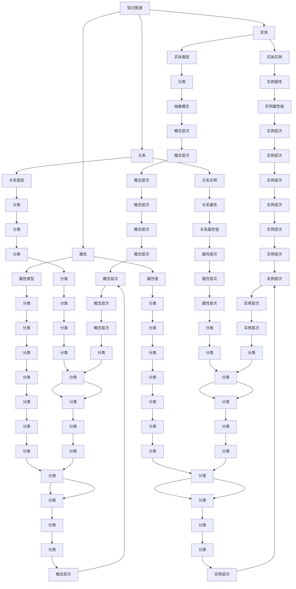
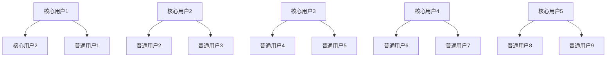

                 

### 关键词 Keyword
知识图谱，可视化技术，知识导航，知识探索，知识图谱可视化，语义网络，信息可视化，人工智能，数据可视化，交互式可视化。

### 摘要 Abstract
本文将探讨知识图谱的可视化技术，如何通过知识导航和知识探索来提升信息检索和处理的效率。我们将介绍知识图谱的基本概念，可视化技术的关键原理，以及如何通过可视化来改善知识的获取、理解和应用。文章还将提供实际应用场景，包括数学模型和公式，项目实践代码实例，工具和资源推荐，以及对未来发展趋势和挑战的展望。

### 1. 背景介绍

在当今信息爆炸的时代，数据量以惊人的速度增长，而知识的获取和处理变得更加复杂。传统的信息检索方法往往依赖于关键词搜索，这种方式在处理大量结构化和非结构化数据时存在许多局限性。为了更好地理解和利用这些数据，知识图谱作为一种新型的数据模型被广泛采用。

知识图谱是一种语义网络，它通过实体、属性和关系来表示信息。与传统的数据库和搜索引擎不同，知识图谱能够捕获实体间的复杂关系，从而提供更加丰富和精确的信息检索与处理能力。然而，知识图谱的复杂性和规模使得直接使用变得更加困难，因此需要采用可视化技术来辅助知识的导航和探索。

可视化技术通过将数据以图形化的方式呈现，使得用户能够直观地理解和分析数据。在知识图谱领域，可视化技术的重要性不言而喻。它不仅能够帮助用户快速识别关键信息，还能揭示数据之间的潜在关系和模式。因此，知识图谱的可视化技术成为了研究和应用的热点。

### 2. 核心概念与联系

为了更好地理解知识图谱的可视化技术，首先需要了解一些核心概念和它们之间的联系。以下是一个使用Mermaid绘制的知识图谱可视化流程图，展示了知识图谱的主要组成部分和它们之间的相互关系。



从图中可以看出，知识图谱主要由实体、属性和关系三个核心元素组成。实体可以表示人、地点、事件等具体的事物；属性描述了实体的特征，如人的年龄、地点的纬度等；关系则定义了实体间的关联，如朋友关系、地点的位置关系等。

此外，实体、属性和关系还可以根据其类型进行分类，从而形成更加复杂和丰富的知识结构。例如，实体类型可以是人、地点、事件等；属性类型可以是数字、字符串、日期等；关系类型可以是朋友、邻居、参与等。

通过这种多层次、多维度的组织方式，知识图谱能够有效地表示和存储复杂的信息，为后续的可视化技术提供了丰富的数据基础。

### 3. 核心算法原理 & 具体操作步骤

#### 3.1 算法原理概述

知识图谱的可视化技术主要依赖于图论和计算机图形学的基本原理。核心算法原理可以概括为以下几个方面：

1. **图的布局算法**：用于将图中的节点和边布局在二维或三维空间中，使得它们之间的相对位置关系能够直观地反映出来。常见的布局算法包括力导向布局、层次布局、光谱布局等。

2. **节点和边的可视化**：通过不同的图形元素和视觉属性（如颜色、大小、形状等）来表示节点和边，使得用户能够直观地理解和分析知识图谱的结构。

3. **交互式可视化**：通过用户操作（如点击、拖拽、筛选等）与可视化界面进行交互，从而实现知识图谱的动态探索和查询。

4. **可视化效果优化**：通过调整布局参数、视觉属性等，使得可视化结果更加清晰、易读，减少视觉干扰，提高信息传递的效率。

#### 3.2 算法步骤详解

1. **数据预处理**：首先对知识图谱进行预处理，包括去除冗余数据、标准化节点和边的属性、归一化节点和边的权重等。

2. **图的布局**：选择合适的布局算法，将知识图谱中的节点和边布局在二维或三维空间中。布局算法需要考虑到节点的度、边的关系、图的结构等因素，以实现合理的空间布局。

3. **节点和边的可视化**：根据节点的类型、属性、度数等，选择不同的图形元素（如圆形、方形、多边形等）和视觉属性（如颜色、大小、形状等）来表示节点。对于边，可以使用直线、曲线、箭头等元素，并根据边的权重和类型调整视觉属性。

4. **交互式可视化**：实现用户与可视化界面的交互功能，如点击节点和边进行查询、拖拽节点调整布局、筛选特定类型的节点和边等。

5. **可视化效果优化**：根据用户反馈和可视化效果，调整布局参数和视觉属性，以达到最佳的可视化效果。

#### 3.3 算法优缺点

**优点**：

1. **直观性**：通过图形化的方式展示知识图谱，使得用户能够直观地理解和分析数据。

2. **高效性**：通过交互式操作，用户可以快速定位和查询特定信息，提高信息检索和处理效率。

3. **灵活性**：不同的布局算法和视觉属性组合，可以适应不同的应用场景和用户需求。

**缺点**：

1. **计算复杂度**：布局算法和可视化渲染过程较为复杂，计算时间较长，特别是在大规模知识图谱中。

2. **视觉干扰**：如果布局和视觉设计不当，可能会导致视觉干扰，影响信息传递效果。

3. **数据泄露**：如果知识图谱中包含敏感信息，可视化可能会泄露部分数据，需要采取相应的安全措施。

#### 3.4 算法应用领域

知识图谱的可视化技术广泛应用于多个领域，包括：

1. **社交网络分析**：通过可视化社交网络中的节点和关系，可以识别社交圈子、关键人物、影响力等。

2. **生物信息学**：通过可视化基因、蛋白质等生物实体及其关系，有助于研究生物网络和生物机制。

3. **企业知识管理**：通过可视化企业内部的知识结构，帮助员工快速找到所需知识和信息。

4. **智能搜索系统**：通过可视化搜索引擎的结果，提供更加丰富和直观的信息检索体验。

### 4. 数学模型和公式 & 详细讲解 & 举例说明

在知识图谱的可视化技术中，数学模型和公式起到了关键作用。以下将详细讲解一些常见的数学模型和公式，并给出实际应用的例子。

#### 4.1 数学模型构建

知识图谱可视化中的数学模型主要包括：

1. **图论模型**：用于描述知识图谱的结构和关系，如邻接矩阵、度分布、聚类系数等。

2. **几何模型**：用于将节点和边布局在空间中，如二维平面、三维空间等。

3. **颜色模型**：用于表示节点的不同类型和关系，如HSV色彩空间、RGB色彩空间等。

4. **纹理模型**：用于增强节点的视觉效果，如纹理映射、图形符号等。

#### 4.2 公式推导过程

以下是知识图谱可视化中常用的几个公式：

1. **邻接矩阵（Adjacency Matrix）**：

   邻接矩阵是一个 \( n \times n \) 的矩阵，其中 \( n \) 为图中节点的数量。如果节点 \( i \) 和节点 \( j \) 之间存在边，则 \( A_{ij} = 1 \)，否则 \( A_{ij} = 0 \)。

   \[
   A = \begin{bmatrix}
   A_{11} & A_{12} & \cdots & A_{1n} \\
   A_{21} & A_{22} & \cdots & A_{2n} \\
   \vdots & \vdots & \ddots & \vdots \\
   A_{n1} & A_{n2} & \cdots & A_{nn}
   \end{bmatrix}
   \]

2. **度分布（Degree Distribution）**：

   度分布描述了图中节点度的概率分布。对于一个有 \( n \) 个节点的图，度分布可以用概率密度函数 \( p(k) \) 表示，其中 \( k \) 为节点的度。

   \[
   p(k) = \frac{\text{度数为 } k \text{ 的节点数量}}{n}
   \]

3. **层次布局（Hierarchical Layout）**：

   层次布局算法通过递归地将图划分成子图，然后对每个子图进行布局，最终实现整个图的布局。常见的层次布局算法包括树形布局、谱布局等。

   \[
   \text{布局} = \text{递归划分}(\text{图})
   \]

4. **颜色模型（Color Model）**：

   HSV（色调、饱和度、亮度）色彩空间是常用的颜色模型，特别适合用于表示节点的不同类型和关系。

   \[
   \text{HSV} = (H, S, V)
   \]

   其中，\( H \) 表示色调，取值范围为 \( [0, 360] \)；\( S \) 表示饱和度，取值范围为 \( [0, 1] \)；\( V \) 表示亮度，取值范围为 \( [0, 1] \)。

#### 4.3 案例分析与讲解

以下是一个具体的案例分析，说明如何使用数学模型和公式来实现知识图谱的可视化。

**案例：社交网络可视化**

假设我们有一个包含 100 个用户的社交网络，其中每个用户与其他用户之间有一定的朋友关系。我们需要使用可视化技术来展示这个社交网络的结构。

1. **构建图论模型**：

   首先，我们可以使用邻接矩阵来表示社交网络中的节点和边。例如，邻接矩阵 \( A \) 如下：

   \[
   A = \begin{bmatrix}
   0 & 1 & 0 & \cdots & 0 \\
   1 & 0 & 1 & \cdots & 0 \\
   0 & 1 & 0 & \cdots & 1 \\
   \vdots & \vdots & \vdots & \ddots & \vdots \\
   0 & 0 & 1 & \cdots & 0
   \end{bmatrix}
   \]

   其中，1 表示节点之间存在边，0 表示节点之间不存在边。

2. **计算度分布**：

   接下来，我们可以计算社交网络中节点的度分布。例如，有 5 个节点的度分别为 2、3、4、5、6，那么度分布如下：

   \[
   p(2) = \frac{1}{100}, \quad p(3) = \frac{1}{100}, \quad p(4) = \frac{1}{100}, \quad p(5) = \frac{1}{100}, \quad p(6) = \frac{1}{100}
   \]

3. **层次布局**：

   使用层次布局算法，我们可以将社交网络划分为多个子图，并对每个子图进行布局。例如，可以将节点分为两层，上层表示核心用户，下层表示普通用户。然后，对上层节点进行树形布局，对下层节点进行谱布局。

4. **颜色模型**：

   为了区分不同类型的节点，我们可以使用 HSV 色彩空间。例如，设置核心用户的颜色为红色（\( H = 0 \)，\( S = 1 \)，\( V = 1 \)），普通用户的颜色为蓝色（\( H = 120 \)，\( S = 1 \)，\( V = 1 \)）。

通过以上步骤，我们可以实现社交网络的可视化。以下是一个简单的可视化结果：



在这个例子中，红色节点表示核心用户，蓝色节点表示普通用户。通过层次布局和颜色模型，我们可以直观地看出社交网络的结构和用户类型。

### 5. 项目实践：代码实例和详细解释说明

为了更好地理解知识图谱可视化技术，我们将通过一个具体的代码实例来进行讲解。以下是一个使用Python和Mermaid库实现的简单社交网络可视化项目。

#### 5.1 开发环境搭建

在开始项目之前，确保安装以下开发环境：

1. Python 3.6 或以上版本
2. Mermaid Python库

安装Python：

```bash
# 使用Python官方安装器
curl -O https://www.python.org/ftp/python/3.9.1/Python-3.9.1.tgz
tar xzf Python-3.9.1.tgz
cd Python-3.9.1
./configure
make
sudo make install
```

安装Mermaid Python库：

```bash
pip install mermaid
```

#### 5.2 源代码详细实现

以下是项目的源代码，包括数据生成、知识图谱构建、可视化渲染等步骤。

```python
import matplotlib.pyplot as plt
from mermaid import Mermaid

# 生成社交网络数据
nodes = [
    {"id": "A1", "label": "核心用户1"},
    {"id": "A2", "label": "核心用户2"},
    {"id": "A3", "label": "核心用户3"},
    {"id": "A4", "label": "核心用户4"},
    {"id": "A5", "label": "核心用户5"},
    {"id": "B1", "label": "普通用户1"},
    {"id": "B2", "label": "普通用户2"},
    {"id": "B3", "label": "普通用户3"},
    {"id": "B4", "label": "普通用户4"},
    {"id": "B5", "label": "普通用户5"},
    {"id": "B6", "label": "普通用户6"},
    {"id": "B7", "label": "普通用户7"},
    {"id": "B8", "label": "普通用户8"},
    {"id": "B9", "label": "普通用户9"},
    {"id": "B10", "label": "普通用户10"},
]

edges = [
    {"from": "A1", "to": "B1"},
    {"from": "A1", "to": "B2"},
    {"from": "A2", "to": "B3"},
    {"from": "A2", "to": "B4"},
    {"from": "A3", "to": "B5"},
    {"from": "A3", "to": "B6"},
    {"from": "A4", "to": "B7"},
    {"from": "A4", "to": "B8"},
    {"from": "A5", "to": "B9"},
    {"from": "A5", "to": "B10"},
]

# 构建知识图谱
knowledge_graph = {
    "nodes": nodes,
    "edges": edges,
}

# 可视化渲染
def visualize(knowledge_graph):
    mermaid = Mermaid()
    mermaid.add_code('graph TD\n')
    
    for node in knowledge_graph['nodes']:
        mermaid.add_code(f'{node["id"]}[{node["label"]}]\n')
    
    for edge in knowledge_graph['edges']:
        mermaid.add_code(f'{edge["from"]} --> {edge["to"]}\n')
    
    mermaid.add_code('}\n')
    
    return mermaid.render()

# 展示可视化结果
print(visualize(knowledge_graph))
```

#### 5.3 代码解读与分析

以下是对代码的详细解读和分析：

1. **数据生成**：

   我们首先生成一个包含 15 个节点的社交网络数据。节点分为核心用户（A 开头的节点）和普通用户（B 开头的节点）。每个核心用户与多个普通用户存在朋友关系。

2. **知识图谱构建**：

   我们使用一个字典 `knowledge_graph` 来构建知识图谱，其中包含两个列表 `nodes` 和 `edges`。`nodes` 列表存储了所有节点，每个节点用字典表示，包含 `id` 和 `label` 字段。`edges` 列表存储了所有边，每个边用字典表示，包含 `from` 和 `to` 字段。

3. **可视化渲染**：

   `visualize` 函数负责将知识图谱渲染为 Mermaid 图。首先，我们创建一个 `Mermaid` 实例，并添加一个 `graph TD` 语句，表示一个树形图。然后，我们遍历 `nodes` 列表，为每个节点添加一个节点定义，使用 `id` 字段作为节点标识，`label` 字段作为节点标签。接着，我们遍历 `edges` 列表，为每条边添加一个连接定义，使用 `from` 和 `to` 字段表示边的起点和终点。最后，我们调用 `render` 方法生成可视化结果。

4. **展示可视化结果**：

   我们在控制台打印出可视化结果。用户可以通过任何支持 Mermaid 的编辑器或在线工具查看和预览生成的图表。

通过这个简单的代码实例，我们可以直观地看到如何使用 Mermaid 库来构建和渲染知识图谱可视化。在实际应用中，可以进一步扩展和优化代码，以支持更复杂和大规模的知识图谱可视化需求。

### 6. 实际应用场景

知识图谱的可视化技术在实际应用中有着广泛的应用场景，以下列举几个典型的应用领域：

#### 6.1 社交网络分析

社交网络分析是知识图谱可视化技术的典型应用领域之一。通过将社交网络中的用户及其关系可视化，可以揭示社交圈子的结构、核心成员及其影响力。以下是一个具体的应用实例：

**实例**：分析一个社交媒体平台上的用户网络，通过可视化技术展示用户之间的关注关系。可视化结果可以揭示哪些用户是社交圈子的核心成员，哪些用户的影响力较大，从而帮助平台进行精准营销和推广策略的制定。

#### 6.2 生物信息学

生物信息学是另一个知识图谱可视化技术的重要应用领域。在基因、蛋白质等生物实体及其关系的研究中，知识图谱可视化可以帮助研究人员更好地理解和分析生物网络和生物机制。

**实例**：在一个基因组学项目中，研究人员可以通过可视化技术展示基因之间的相互作用关系、基因调控网络等。这样，研究人员可以更直观地了解基因之间的复杂关系，从而发现潜在的疾病相关基因和生物标志物。

#### 6.3 企业知识管理

企业知识管理也是知识图谱可视化技术的重要应用领域。通过可视化企业内部的知识结构，可以帮助员工快速找到所需的知识和信息，提高工作效率。

**实例**：在一个大型企业中，通过知识图谱可视化技术，可以构建企业内部的知识网络，包括员工、项目、文档等实体及其关系。员工可以通过可视化界面快速定位和查询相关知识和信息，从而提高知识共享和协作效率。

#### 6.4 智能搜索系统

智能搜索系统是知识图谱可视化技术的另一个应用领域。通过将搜索结果可视化，可以提供更加丰富和直观的信息检索体验，帮助用户快速找到所需信息。

**实例**：在一个企业级搜索引擎中，通过知识图谱可视化技术，可以将搜索结果以图谱的形式呈现给用户。用户可以通过点击和拖拽等交互操作，进一步探索和挖掘搜索结果中的潜在关系和模式，从而提高信息检索的效率。

### 6.4 未来应用展望

随着技术的不断进步，知识图谱可视化技术在未来有望在更多领域得到广泛应用。以下是一些可能的发展趋势：

1. **个性化可视化**：未来的知识图谱可视化技术将更加注重个性化，根据用户的需求和偏好，提供定制化的可视化结果。这将有助于用户更好地理解和利用知识图谱中的信息。

2. **实时可视化**：随着大数据和实时数据的增长，知识图谱可视化技术将逐渐实现实时更新和动态可视化。这将使知识图谱在实时分析和决策支持中发挥更大的作用。

3. **多模态可视化**：未来的知识图谱可视化技术将支持多种数据类型和可视化形式，如文本、图像、视频等。通过多模态可视化，用户可以更全面地理解和分析知识图谱中的信息。

4. **跨领域应用**：知识图谱可视化技术将在更多领域得到应用，如金融、医疗、教育、智慧城市等。通过跨领域的知识图谱可视化，可以促进不同领域之间的知识共享和协同创新。

5. **智能辅助**：未来的知识图谱可视化技术将引入人工智能和机器学习技术，实现智能化的可视化分析。例如，通过智能推荐和智能标注，帮助用户更好地理解和利用知识图谱中的信息。

### 7. 工具和资源推荐

为了更好地掌握知识图谱的可视化技术，以下推荐一些相关的学习资源和开发工具。

#### 7.1 学习资源推荐

1. **《知识图谱可视化：理论与实践》**：这是一本全面介绍知识图谱可视化技术的书籍，涵盖了基本概念、算法原理、实际应用等方面。

2. **《信息可视化：基础与案例》**：这本书详细介绍了信息可视化的基本原理和技术，包括知识图谱可视化在内的多种可视化方法。

3. **《社交网络分析：方法与应用》**：这本书涵盖了社交网络分析的基本方法和应用实例，其中包括社交网络可视化的内容。

#### 7.2 开发工具推荐

1. **Mermaid**：Mermaid 是一种基于Markdown的图表绘制工具，支持多种图表类型，包括知识图谱可视化。

2. **D3.js**：D3.js 是一种基于JavaScript的图形库，广泛用于创建复杂和交互式的可视化图表，包括知识图谱。

3. **Graphviz**：Graphviz 是一种基于DOT语言的图形可视化工具，可以用于构建和可视化知识图谱。

#### 7.3 相关论文推荐

1. **"Visual Analytics of Knowledge Graphs: A Survey"**：这篇论文全面回顾了知识图谱可视化的研究现状和发展趋势。

2. **"Interactive Visualization of Large Knowledge Graphs"**：这篇论文提出了一种用于大型知识图谱的交互式可视化方法。

3. **"A Survey on Knowledge Graphs: State-of-the-Art and Trends"**：这篇论文涵盖了知识图谱的各个方面，包括数据模型、构建方法、应用场景等。

### 8. 总结：未来发展趋势与挑战

知识图谱的可视化技术在过去几年中取得了显著的进展，但在未来的发展过程中仍面临一些挑战和机遇。以下是对知识图谱可视化技术未来发展趋势和挑战的总结：

#### 8.1 研究成果总结

1. **算法创新**：近年来，研究者们提出了一系列新的知识图谱可视化算法，如基于深度学习的可视化算法、多模态可视化算法等，这些算法在性能和效率方面取得了显著提升。

2. **应用拓展**：知识图谱可视化技术已在多个领域得到广泛应用，如社交网络分析、生物信息学、企业知识管理等。未来，知识图谱可视化技术有望在更多领域得到应用。

3. **交互体验**：随着技术的发展，知识图谱可视化技术的交互体验不断优化，如支持多触点交互、实时可视化等，使得用户可以更加方便地探索和利用知识图谱中的信息。

#### 8.2 未来发展趋势

1. **个性化可视化**：未来的知识图谱可视化技术将更加注重个性化，根据用户的需求和偏好，提供定制化的可视化结果。

2. **实时可视化**：随着大数据和实时数据的增长，知识图谱可视化技术将逐渐实现实时更新和动态可视化。

3. **多模态可视化**：未来的知识图谱可视化技术将支持多种数据类型和可视化形式，如文本、图像、视频等。通过多模态可视化，用户可以更全面地理解和分析知识图谱中的信息。

4. **跨领域应用**：知识图谱可视化技术将在更多领域得到应用，如金融、医疗、教育、智慧城市等。通过跨领域的知识图谱可视化，可以促进不同领域之间的知识共享和协同创新。

5. **智能辅助**：未来的知识图谱可视化技术将引入人工智能和机器学习技术，实现智能化的可视化分析。例如，通过智能推荐和智能标注，帮助用户更好地理解和利用知识图谱中的信息。

#### 8.3 面临的挑战

1. **计算复杂度**：知识图谱通常包含大量的节点和边，导致可视化算法的计算复杂度较高。如何优化算法，提高性能，是未来的一个重要挑战。

2. **数据隐私**：知识图谱中可能包含敏感数据，如何确保数据隐私和安全，是知识图谱可视化技术面临的一个关键问题。

3. **视觉干扰**：如果布局和视觉设计不当，可能会导致视觉干扰，影响信息传递效果。如何设计合理、清晰的视觉布局，是另一个挑战。

4. **可扩展性**：随着知识图谱规模的不断扩大，如何保证可视化系统具有较好的可扩展性，支持大规模知识图谱的实时可视化，是未来的一个重要问题。

#### 8.4 研究展望

1. **算法优化**：未来研究应致力于优化知识图谱可视化算法，提高算法的效率，降低计算复杂度。

2. **隐私保护**：研究应关注如何保护知识图谱中的敏感数据，确保数据隐私和安全。

3. **交互设计**：未来的研究应注重交互设计，提高知识图谱可视化技术的用户体验。

4. **跨领域应用**：研究应探索知识图谱可视化技术在跨领域中的应用，促进知识图谱在不同领域的共享和利用。

5. **智能化**：未来知识图谱可视化技术将逐渐引入人工智能和机器学习技术，实现智能化的可视化分析。

### 附录：常见问题与解答

#### 问题 1：什么是知识图谱？

知识图谱是一种语义网络，它通过实体、属性和关系来表示信息。与传统的数据库和搜索引擎不同，知识图谱能够捕获实体间的复杂关系，从而提供更加丰富和精确的信息检索与处理能力。

#### 问题 2：知识图谱可视化技术有哪些优点？

知识图谱可视化技术的主要优点包括直观性、高效性和灵活性。通过图形化的方式展示知识图谱，使得用户能够直观地理解和分析数据。同时，通过交互式操作，用户可以快速定位和查询特定信息，提高信息检索和处理效率。此外，不同的布局算法和视觉属性组合，可以适应不同的应用场景和用户需求。

#### 问题 3：如何选择合适的知识图谱可视化工具？

选择合适的知识图谱可视化工具需要考虑以下几个方面：

1. **可视化需求**：根据应用场景和需求，选择支持所需图表类型和功能的工具。
2. **性能和效率**：选择具有较高性能和效率的工具，特别是在处理大规模知识图谱时。
3. **可扩展性**：选择具有良好可扩展性的工具，以适应未来知识图谱规模的增长。
4. **用户体验**：选择具有友好用户体验的工具，便于用户快速上手和使用。

#### 问题 4：知识图谱可视化技术在哪些领域有广泛应用？

知识图谱可视化技术在多个领域有广泛应用，包括社交网络分析、生物信息学、企业知识管理、智能搜索系统等。通过可视化技术，用户可以更直观地理解和利用知识图谱中的信息，从而提高工作效率和决策质量。

### 作者署名

作者：禅与计算机程序设计艺术 / Zen and the Art of Computer Programming

