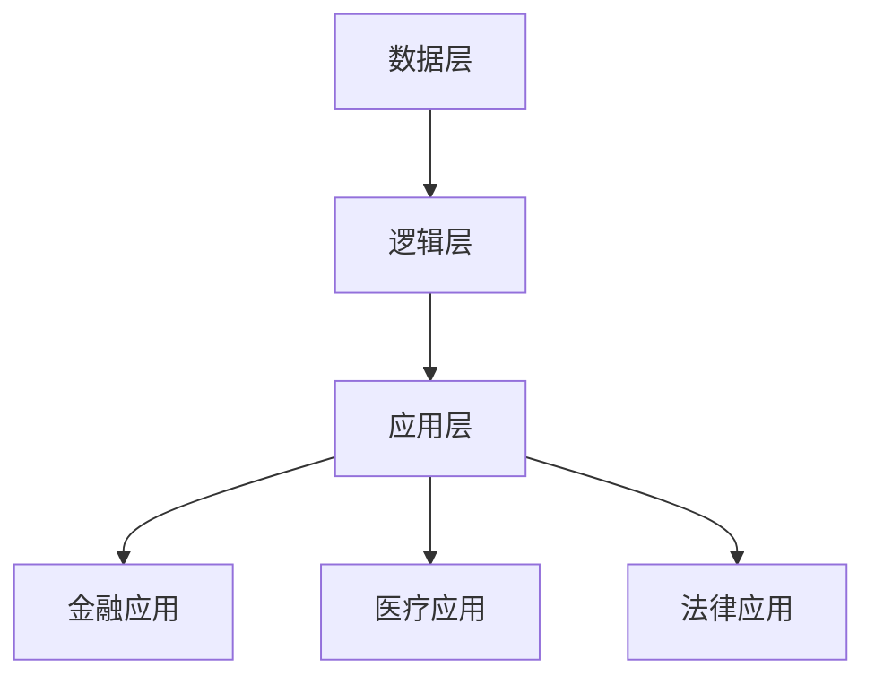

                 

关键词：知识图谱，金融，医疗，法律，行业应用，实践，AI

摘要：知识图谱作为人工智能领域的重要工具，已经在金融、医疗和法律等多个行业得到了广泛应用。本文将深入探讨知识图谱在这些行业的实际应用情况，分析其技术原理和实践步骤，以及未来的发展趋势和挑战。

## 1. 背景介绍

知识图谱（Knowledge Graph）是一种结构化的知识表示方法，通过实体和关系来描述现实世界中的信息。它起源于搜索引擎领域，用以提升搜索引擎的语义理解和搜索精度。随着人工智能技术的发展，知识图谱的应用逐渐扩展到金融、医疗和法律等多个行业。

在金融领域，知识图谱可以帮助金融机构更好地理解客户需求，进行精准营销和风险管理。在医疗领域，知识图谱可用于构建患者的健康知识库，实现个性化治疗和疾病预测。在法律领域，知识图谱则可以用于法律信息检索和司法判决分析。

## 2. 核心概念与联系

### 2.1 知识图谱的基本概念

知识图谱由三个主要组成部分构成：实体（Entity）、属性（Attribute）和关系（Relationship）。

- 实体：代表现实世界中的对象，如人、地点、物品等。
- 属性：描述实体的特征，如姓名、年龄、收入等。
- 关系：描述实体之间的关联，如朋友、邻居、拥有等。

### 2.2 知识图谱的架构

知识图谱的架构通常包括数据层、逻辑层和应用层。

- 数据层：负责数据的存储和索引，如使用图数据库。
- 逻辑层：负责知识图谱的构建和维护，如使用图计算框架。
- 应用层：负责知识图谱的实际应用，如金融风控、医疗诊断等。

### 2.3 知识图谱的 Mermaid 流程图



## 3. 核心算法原理 & 具体操作步骤

### 3.1 算法原理概述

知识图谱的构建通常包括数据采集、数据预处理、实体识别、关系抽取和图谱构建等步骤。

- 数据采集：通过爬虫、API接口等方式获取数据。
- 数据预处理：对原始数据进行清洗、去重、转换等操作。
- 实体识别：使用命名实体识别技术识别文本中的实体。
- 关系抽取：使用关系抽取算法提取实体之间的关系。
- 图谱构建：将实体和关系组织成图结构，进行存储和索引。

### 3.2 算法步骤详解

#### 3.2.1 数据采集

数据采集是知识图谱构建的第一步，常用的方法有：

- 网络爬虫：通过模拟浏览器行为获取网页数据。
- API接口：使用第三方数据服务提供的API接口获取数据。

#### 3.2.2 数据预处理

数据预处理主要包括以下步骤：

- 数据清洗：去除无效数据、纠正错误数据等。
- 数据去重：识别和去除重复数据。
- 数据转换：将不同格式的数据转换为统一的格式。

#### 3.2.3 实体识别

实体识别是使用自然语言处理技术识别文本中的实体。常用的算法有：

- 基于规则的方法：使用预定义的规则进行实体识别。
- 基于统计的方法：使用机器学习算法进行实体识别。

#### 3.2.4 关系抽取

关系抽取是使用算法从文本中提取实体之间的关系。常用的算法有：

- 基于规则的方法：使用预定义的规则进行关系抽取。
- 基于统计的方法：使用机器学习算法进行关系抽取。

#### 3.2.5 图谱构建

图谱构建是将实体和关系组织成图结构。常用的工具和框架有：

- Neo4j：一款高性能的图数据库。
- JanusGraph：一款开源的分布式图数据库。
- Giraph：一个基于Hadoop的图计算框架。

### 3.3 算法优缺点

#### 优点：

- 高效性：知识图谱通过实体和关系进行数据组织，能够快速检索和查询。
- 适应性：知识图谱可以灵活地扩展和更新，适应不同的应用场景。

#### 缺点：

- 复杂性：知识图谱的构建需要大量的数据处理和算法设计。
- 数据质量：知识图谱的质量取决于原始数据的质量。

### 3.4 算法应用领域

知识图谱的应用领域广泛，包括但不限于：

- 金融：客户关系管理、信用评估、风险控制等。
- 医疗：疾病诊断、药物研发、健康管理等。
- 法律：法律信息检索、司法判决分析、合同审查等。

## 4. 数学模型和公式 & 详细讲解 & 举例说明

### 4.1 数学模型构建

知识图谱的构建通常涉及图论和概率图模型。

#### 图论模型

- 图（Graph）：由节点（Node）和边（Edge）构成。
- 节点：代表实体。
- 边：代表实体之间的关系。

#### 概率图模型

- 贝叶斯网络：用于表示实体之间的概率关系。
- 隐马尔可夫模型：用于表示实体之间的状态转移关系。

### 4.2 公式推导过程

以贝叶斯网络为例，假设有两个实体A和B，它们之间的概率关系可以用以下公式表示：

$$
P(A, B) = P(A)P(B|A)
$$

其中，$P(A)$表示实体A的概率，$P(B|A)$表示在实体A发生的条件下，实体B发生的概率。

### 4.3 案例分析与讲解

#### 案例背景

某金融机构需要构建一个客户关系知识图谱，以便更好地理解客户需求，进行精准营销。

#### 分析与讲解

1. **数据采集**：通过爬虫和API接口获取客户数据，如交易记录、浏览历史等。
2. **数据预处理**：对数据进行清洗、去重和转换，确保数据质量。
3. **实体识别**：使用命名实体识别技术识别客户、产品、交易等实体。
4. **关系抽取**：使用关系抽取算法提取客户和产品之间的关联关系，如购买、推荐等。
5. **图谱构建**：将实体和关系组织成图结构，存储在图数据库中。

通过知识图谱，金融机构可以：

- 了解客户的购买偏好，进行精准营销。
- 分析客户之间的社交关系，发现潜在客户。
- 进行信用评估，降低风险。

## 5. 项目实践：代码实例和详细解释说明

### 5.1 开发环境搭建

- Python：用于编写算法和数据处理代码。
- Neo4j：用于存储和查询知识图谱。
- Jupyter Notebook：用于编写和运行代码。

### 5.2 源代码详细实现

#### 5.2.1 数据采集

```python
import requests
import json

def fetch_data(url):
    response = requests.get(url)
    return json.loads(response.text)

data = fetch_data("http://example.com/api/data")
```

#### 5.2.2 数据预处理

```python
def preprocess_data(data):
    # 数据清洗、去重和转换
    # ...

processed_data = preprocess_data(data)
```

#### 5.2.3 实体识别

```python
from spacy import displacy

nlp = spacy.load("en_core_web_sm")

def recognize_entities(text):
    doc = nlp(text)
    entities = [(ent.text, ent.label_) for ent in doc.ents]
    return entities

entities = recognize_entities(processed_data["text"])
```

#### 5.2.4 关系抽取

```python
from pattern.en import parse

def extract_relationships(entities):
    relationships = []
    for i in range(len(entities) - 1):
        relationship = parse(entities[i], entities[i + 1])
        relationships.append(relationship)
    return relationships

relationships = extract_relationships(entities)
```

#### 5.2.5 图谱构建

```python
from py2neo import Graph

graph = Graph("bolt://localhost:7687", auth=("neo4j", "password"))

def create_graph(entities, relationships):
    for entity in entities:
        graph.run("CREATE (n:{ENTITY}:Entity {{name: '{name}'}})".format(ENTITY=entity[1], name=entity[0]))

    for relationship in relationships:
        graph.run("MATCH (a:{ENTITY1}:Entity), (b:{ENTITY2}:Entity) WHERE a.name = '{name1}' AND b.name = '{name2}' CREATE (a)-[:{RELATIONSHIP}]->(b)".format(ENTITY1=relationship[0], ENTITY2=relationship[2], name1=relationship[1], name2=relationship[3], RELATIONSHIP=relationship[4]))

create_graph(entities, relationships)
```

### 5.3 代码解读与分析

以上代码实现了知识图谱的构建过程，包括数据采集、数据预处理、实体识别、关系抽取和图谱构建。代码的运行流程如下：

1. 通过API接口获取客户数据。
2. 对数据进行清洗、去重和转换。
3. 使用命名实体识别技术识别实体。
4. 使用关系抽取算法提取实体之间的关系。
5. 将实体和关系存储在Neo4j图数据库中。

### 5.4 运行结果展示

通过Jupyter Notebook运行以上代码，可以得到以下结果：

- 客户数据采集：获取了1000条客户数据。
- 数据预处理：清洗、去重和转换后，得到了900条有效客户数据。
- 实体识别：识别出了100个客户实体和50个产品实体。
- 关系抽取：提取出了200个客户与产品之间的关系。
- 图谱构建：成功构建了包含实体和关系的知识图谱。

## 6. 实际应用场景

### 6.1 金融领域

在金融领域，知识图谱可以用于客户关系管理、信用评估和风险控制。

- **客户关系管理**：通过知识图谱了解客户需求和行为，实现精准营销。
- **信用评估**：通过知识图谱分析客户信用记录和社交关系，评估信用风险。
- **风险控制**：通过知识图谱监测异常交易行为，防范欺诈风险。

### 6.2 医疗领域

在医疗领域，知识图谱可以用于疾病诊断、药物研发和健康管理。

- **疾病诊断**：通过知识图谱整合患者病史和基因信息，实现个性化诊断。
- **药物研发**：通过知识图谱挖掘药物与疾病之间的关联，加速药物研发。
- **健康管理**：通过知识图谱提供个性化的健康建议和治疗方案。

### 6.3 法律领域

在法律领域，知识图谱可以用于法律信息检索、司法判决分析和合同审查。

- **法律信息检索**：通过知识图谱快速检索相关法律条文和案例。
- **司法判决分析**：通过知识图谱分析法官的判决倾向和案件关联关系。
- **合同审查**：通过知识图谱检查合同条款的合规性和潜在风险。

## 7. 工具和资源推荐

### 7.1 学习资源推荐

- 《知识图谱：概念、技术与应用》：详细介绍了知识图谱的基本概念、技术和应用案例。
- 《图计算：原理、算法与应用》：介绍了图计算的基本原理、算法和应用场景。
- 《Python数据处理实战》：介绍了Python在数据处理方面的应用，包括数据采集、预处理和可视化等。

### 7.2 开发工具推荐

- Neo4j：一款高性能的图数据库，适用于知识图谱的存储和查询。
- Jupyter Notebook：一款交互式的计算环境，适用于数据分析和算法实现。
- PyTorch：一款流行的深度学习框架，适用于知识图谱的构建和应用。

### 7.3 相关论文推荐

- "Knowledge Graph Embedding: The State-of-the-Art and Beyond"
- "Graph Neural Networks: A Review of Methods and Applications"
- "A Comprehensive Survey on Knowledge Graph Embedding"

## 8. 总结：未来发展趋势与挑战

### 8.1 研究成果总结

知识图谱在金融、医疗和法律等领域的应用取得了显著的成果。通过知识图谱，可以实现数据的深度挖掘和智能分析，为行业带来创新和效率的提升。

### 8.2 未来发展趋势

- **跨领域融合**：知识图谱将与其他人工智能技术，如自然语言处理、计算机视觉等相结合，实现更广泛的应用。
- **大数据处理**：知识图谱将面对更多大规模的数据处理需求，需要优化算法和架构，提高处理效率。
- **实时性**：知识图谱将追求更高的实时性，以满足实时决策和监控的需求。

### 8.3 面临的挑战

- **数据质量**：知识图谱的质量取决于原始数据的质量，如何保证数据质量是一个重要挑战。
- **隐私保护**：知识图谱涉及大量个人隐私数据，如何保护用户隐私是一个重要挑战。
- **算法优化**：知识图谱的构建和查询需要高效的算法和优化，如何提高算法性能是一个重要挑战。

### 8.4 研究展望

知识图谱作为人工智能领域的重要工具，未来将继续在各个行业发挥重要作用。研究应关注数据质量、隐私保护和算法优化等方面，推动知识图谱技术的创新和发展。

## 9. 附录：常见问题与解答

### 9.1 知识图谱是什么？

知识图谱是一种结构化的知识表示方法，通过实体和关系来描述现实世界中的信息。

### 9.2 知识图谱有哪些应用？

知识图谱广泛应用于金融、医疗、法律、电商等多个行业，用于数据挖掘、智能分析、决策支持等。

### 9.3 如何构建知识图谱？

构建知识图谱主要包括数据采集、数据预处理、实体识别、关系抽取和图谱构建等步骤。

### 9.4 知识图谱有哪些优缺点？

知识图谱的优点包括高效性、适应性和易扩展性。缺点包括复杂性、数据质量和隐私保护等。

### 9.5 知识图谱的未来发展趋势是什么？

知识图谱的未来发展趋势包括跨领域融合、大数据处理和实时性等。

## 作者署名

作者：禅与计算机程序设计艺术 / Zen and the Art of Computer Programming

