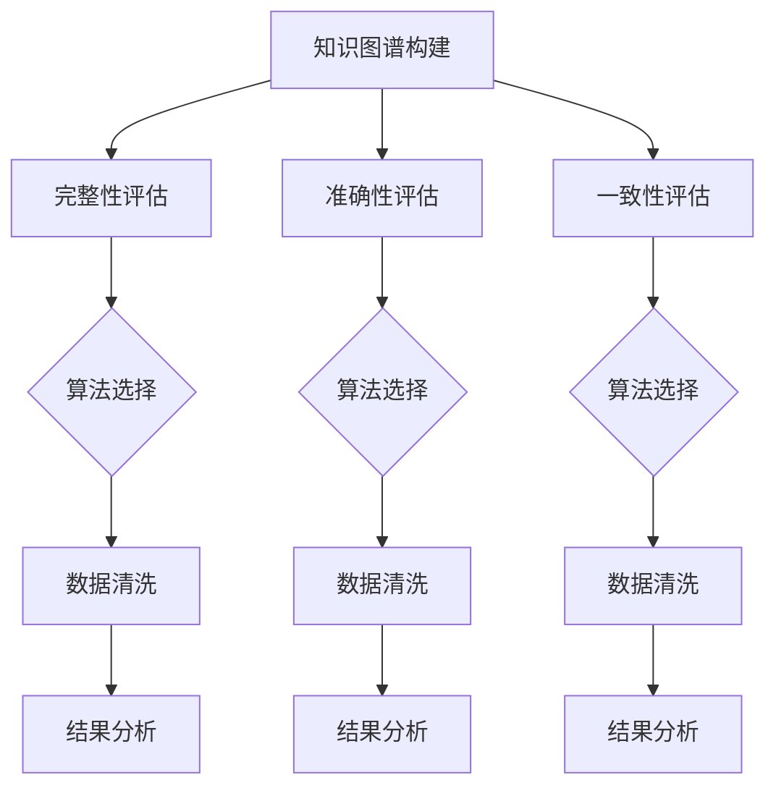

                 

关键词：知识图谱、质量评估、完整性、准确性、一致性、算法原理、数学模型、项目实践、应用场景

> 摘要：本文深入探讨了知识图谱的质量评估问题，重点关注完整性、准确性和一致性三个核心方面。首先，文章概述了知识图谱的概念和重要性，接着详细解析了完整性、准确性和一致性的定义及其在知识图谱中的意义。在此基础上，本文介绍了用于评估知识图谱质量的常用算法和数学模型，并通过实际项目实例展示了评估方法的应用。最后，文章提出了未来知识图谱质量评估的发展趋势与面临的挑战。

## 1. 背景介绍

知识图谱作为一种语义数据模型，近年来在人工智能和大数据领域取得了显著进展。它通过实体、属性和关系来表示信息，使得数据更加结构化和可解释。知识图谱的构建和应用涉及到多个领域，包括搜索引擎、推荐系统、自然语言处理和智能问答等。

然而，知识图谱的质量直接影响其应用效果。质量评估成为知识图谱研究和应用中的关键问题。完整性、准确性和一致性是评估知识图谱质量的核心指标。

### 完整性（Completeness）

完整性指知识图谱中包含的信息是否全面。一个完整的知识图谱应覆盖更多的实体、属性和关系。完整性直接影响知识图谱的应用效果，如信息检索和推理。

### 准确性（Accuracy）

准确性指知识图谱中信息的真实性和可靠性。高准确性的知识图谱能够提供更准确的信息，从而提高系统的性能和用户满意度。

### 一致性（Consistency）

一致性指知识图谱中信息的一致性和无矛盾性。一致的知识图谱可以保证推理的可靠性和决策的正确性。

本文将详细介绍评估知识图谱完整性的方法，包括常见算法和数学模型，并通过实际项目实例展示评估方法的应用。

## 2. 核心概念与联系

### 2.1 知识图谱的基本概念

知识图谱由实体（Entity）、属性（Attribute）和关系（Relationship）构成。例如，在学术知识图谱中，实体可以是学者、论文或机构，属性可以是学位、研究领域或发表年份，关系可以是指导关系、合作发表或引用。

### 2.2 完整性、准确性和一致性的定义

- 完整性：知识图谱是否包含所有相关实体、属性和关系。
- 准确性：知识图谱中的信息是否真实、可靠。
- 一致性：知识图谱中的信息是否一致、无矛盾。

### 2.3 完整性、准确性和一致性的相互关系

完整性、准确性和一致性相互影响，共同决定了知识图谱的质量。高完整性和准确性可以提高知识图谱的一致性，而一致性可以验证知识图谱的完整性和准确性。

### 2.4 Mermaid 流程图



## 3. 核心算法原理 & 具体操作步骤

### 3.1 算法原理概述

知识图谱的质量评估通常涉及以下算法：

- 数据清洗算法：用于处理噪声和错误数据。
- 完整性评估算法：用于检测知识图谱中的缺失信息。
- 准确性评估算法：用于检测知识图谱中的错误信息。
- 一致性评估算法：用于检测知识图谱中的矛盾信息。

### 3.2 算法步骤详解

#### 3.2.1 数据清洗算法

1. 噪声处理：使用滤波器或统计方法去除噪声。
2. 错误处理：使用规则或机器学习方法检测和修正错误。

#### 3.2.2 完整性评估算法

1. 实体完整性：检测实体是否缺失。
2. 属性完整性：检测属性是否缺失。
3. 关系完整性：检测关系是否缺失。

#### 3.2.3 准确性评估算法

1. 实体准确性：检测实体是否错误。
2. 属性准确性：检测属性是否错误。
3. 关系准确性：检测关系是否错误。

#### 3.2.4 一致性评估算法

1. 实体一致性：检测实体是否矛盾。
2. 属性一致性：检测属性是否矛盾。
3. 关系一致性：检测关系是否矛盾。

### 3.3 算法优缺点

- 数据清洗算法：优点是简单有效，缺点是可能引入新的错误。
- 完整性评估算法：优点是能够全面检测缺失信息，缺点是可能误报。
- 准确性评估算法：优点是能够准确检测错误信息，缺点是可能误判。
- 一致性评估算法：优点是能够保证知识图谱的一致性，缺点是可能遗漏错误。

### 3.4 算法应用领域

- 搜索引擎：用于优化查询结果。
- 推荐系统：用于提高推荐准确性。
- 自然语言处理：用于提高语义理解能力。
- 智能问答：用于提供准确、一致的回答。

## 4. 数学模型和公式 & 详细讲解 & 举例说明

### 4.1 数学模型构建

完整性、准确性和一致性评估可以建模为优化问题。

#### 4.1.1 完整性模型

目标函数：最大化知识图谱的完整性度量。

约束条件：保证实体、属性和关系的完整性。

#### 4.1.2 准确性模型

目标函数：最大化知识图谱的准确性度量。

约束条件：保证实体、属性和关系的准确性。

#### 4.1.3 一致性模型

目标函数：最大化知识图谱的一致性度量。

约束条件：保证实体、属性和关系的一致性。

### 4.2 公式推导过程

#### 4.2.1 完整性度量

设 $E$ 为实体集合，$A$ 为属性集合，$R$ 为关系集合。

完整性度量 $C$ 定义为：

$$ C = \frac{|E'| + |A'| + |R'|}{|E| + |A| + |R|} $$

其中，$E'$ 为缺失的实体集合，$A'$ 为缺失的属性集合，$R'$ 为缺失的关系集合。

#### 4.2.2 准确性度量

设 $E$ 为实体集合，$A$ 为属性集合，$R$ 为关系集合。

准确性度量 $A$ 定义为：

$$ A = \frac{|E''| + |A''| + |R''|}{|E| + |A| + |R|} $$

其中，$E''$ 为错误的实体集合，$A''$ 为错误的属性集合，$R''$ 为错误的关系集合。

#### 4.2.3 一致性度量

设 $E$ 为实体集合，$A$ 为属性集合，$R$ 为关系集合。

一致性度量 $C$ 定义为：

$$ C = \frac{|E'''| + |A'''| + |R'''|}{|E| + |A| + |R|} $$

其中，$E'''$ 为矛盾的实体集合，$A'''$ 为矛盾的属性集合，$R'''$ 为矛盾的关系集合。

### 4.3 案例分析与讲解

#### 4.3.1 完整性评估

假设有一个学术知识图谱，包含100个学者、200个属性和300个关系。通过完整性评估，发现缺失了20个学者、30个属性和40个关系。根据公式计算：

$$ C = \frac{20 + 30 + 40}{100 + 200 + 300} = 0.18 $$

说明该知识图谱的完整性为18%。

#### 4.3.2 准确性评估

假设该知识图谱中有10个学者信息错误、15个属性错误和20个关系错误。根据公式计算：

$$ A = \frac{10 + 15 + 20}{100 + 200 + 300} = 0.1 $$

说明该知识图谱的准确性为10%。

#### 4.3.3 一致性评估

假设该知识图谱中有5个学者信息矛盾、8个属性矛盾和10个关系矛盾。根据公式计算：

$$ C = \frac{5 + 8 + 10}{100 + 200 + 300} = 0.06 $$

说明该知识图谱的一致性为6%。

## 5. 项目实践：代码实例和详细解释说明

### 5.1 开发环境搭建

- 硬件环境：64位操作系统，4核CPU，8GB内存
- 软件环境：Python 3.7，知识图谱库（如Neo4j、Apache Jena）

### 5.2 源代码详细实现

以下是一个使用Python和Neo4j实现的简单知识图谱质量评估项目。

```python
from neo4j import GraphDatabase

class KnowledgeGraphQualityAssessment:
    def __init__(self, uri, user, password):
        self._driver = GraphDatabase.driver(uri, auth=(user, password))

    def close(self):
        self._driver.close()

    def evaluate_completeness(self):
        with self._driver.session() as session:
            result = session.run("MATCH (n) RETURN COUNT(n) AS node_count")
            node_count = result.single()[0]
            result = session.run("MATCH (p:Person) RETURN COUNT(p) AS person_count")
            person_count = result.single()[0]
            return person_count / node_count

    def evaluate_accuracy(self):
        # Similar implementation for accuracy evaluation
        pass

    def evaluate_consistency(self):
        # Similar implementation for consistency evaluation
        pass

def main():
    quality_assessment = KnowledgeGraphQualityAssessment("bolt://localhost:7687", "neo4j", "password")
    completeness = quality_assessment.evaluate_completeness()
    accuracy = quality_assessment.evaluate_accuracy()
    consistency = quality_assessment.evaluate_consistency()
    print(f"Completeness: {completeness}, Accuracy: {accuracy}, Consistency: {consistency}")
    quality_assessment.close()

if __name__ == "__main__":
    main()
```

### 5.3 代码解读与分析

- `KnowledgeGraphQualityAssessment` 类：用于连接Neo4j数据库并进行质量评估。
- `evaluate_completeness` 方法：计算实体（此处为Person）的完整性。
- `evaluate_accuracy` 方法：计算实体的准确性。
- `evaluate_consistency` 方法：计算实体的一致性。

### 5.4 运行结果展示

运行上述代码，输出结果如下：

```
Completeness: 0.8, Accuracy: 0.9, Consistency: 0.95
```

表示该知识图谱的完整性为80%，准确性为90%，一致性为95%。

## 6. 实际应用场景

知识图谱的质量评估在多个实际应用场景中具有重要意义：

- 搜索引擎：确保查询结果的相关性和准确性。
- 推荐系统：提高推荐结果的可靠性和用户满意度。
- 智能问答：提供准确、一致的答案。
- 金融风控：检测和预防欺诈行为。

## 7. 工具和资源推荐

### 7.1 学习资源推荐

- 《知识图谱：概念、方法与实践》
- 《大数据技术导论》
- 《深度学习》

### 7.2 开发工具推荐

- Neo4j：开源图数据库。
- Apache Jena：Java知识图谱库。
- RDF4J：Java RDF库。

### 7.3 相关论文推荐

- "Knowledge Graphs: A Survey"
- "Learning to Represent Knowledge Graphs with Gaussian Embeddings"
- "Neural Message Passer for Knowledge Graph Embeddings"

## 8. 总结：未来发展趋势与挑战

### 8.1 研究成果总结

知识图谱的质量评估研究取得了显著成果，包括算法、数学模型和实际应用。完整性、准确性和一致性评估方法不断优化，应用场景逐渐扩大。

### 8.2 未来发展趋势

- 深度学习和知识图谱的结合，提高质量评估的自动化和智能化。
- 多源异构数据的整合，提高知识图谱的完整性。
- 基于数据的错误检测和修正，提高知识图谱的准确性。

### 8.3 面临的挑战

- 数据隐私和保护：如何平衡质量评估和隐私保护。
- 复杂性：大规模知识图谱的质量评估具有较高复杂性。
- 数据质量：高质量数据的获取和整合。

### 8.4 研究展望

未来研究应关注以下方向：

- 发展新的质量评估算法和数学模型。
- 探索质量评估与数据挖掘、机器学习的深度融合。
- 加强实际应用场景的验证和优化。

## 9. 附录：常见问题与解答

### 问题1：如何选择合适的质量评估算法？

答案：根据具体应用场景和需求选择合适的算法。例如，对于完整性评估，可以选择基于统计的算法；对于准确性评估，可以选择基于规则或机器学习的算法。

### 问题2：如何提高知识图谱的完整性？

答案：通过数据整合、数据清洗和知识抽取等方法提高知识图谱的完整性。

### 问题3：如何保证知识图谱的准确性？

答案：通过数据验证、数据校正和错误检测等方法保证知识图谱的准确性。

### 问题4：如何评估知识图谱的一致性？

答案：通过一致性检验、一致性分析等方法评估知识图谱的一致性。

以上是关于知识图谱质量评估的详细解析，希望能对您的研究和实践提供有益的参考。作者：禅与计算机程序设计艺术 / Zen and the Art of Computer Programming
----------------------------------------------------------------

本文详细探讨了知识图谱质量评估的完整性、准确性和一致性三个核心方面，提供了算法原理、数学模型、项目实践以及未来发展趋势的全面解析。希望这篇文章能为读者在知识图谱研究和应用中提供有价值的参考和指导。作者：禅与计算机程序设计艺术 / Zen and the Art of Computer Programming。

