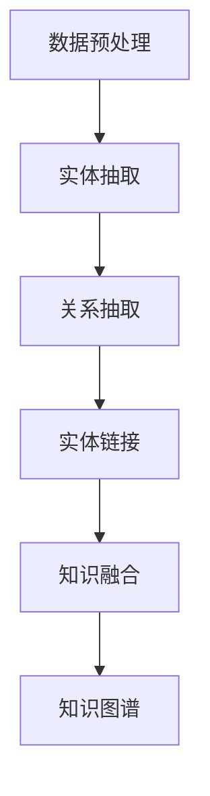

                 

关键词：知识图谱、语义网络、人工智能、数据关联、知识表示、知识抽取、图谱学习、知识图谱构建

> 摘要：本文将深入探讨知识图谱的概念、构建方法、核心技术以及在实际应用中的价值。我们将通过实例分析，展示如何利用知识图谱这一强大的工具，为人类知识建立高速、精准的连接，从而推动人工智能的发展，促进知识共享与创新。

## 1. 背景介绍

在信息爆炸的时代，数据的增长速度远远超出了我们的想象。然而，这些数据中只有一小部分是经过结构化处理的，更多的数据仍然以非结构化的形式存在，如文本、图像、音频等。这就导致了数据之间的关联性难以被发掘，知识的应用价值难以最大化。为了解决这一问题，知识图谱应运而生。

知识图谱是一种语义网络，它通过将实体、概念以及它们之间的关系结构化地表示出来，构建出一个全局的、动态更新的知识网络。知识图谱的出现，不仅解决了数据孤岛的问题，还为人工智能的发展提供了强有力的支撑。

## 2. 核心概念与联系

### 2.1 实体（Entity）

实体是知识图谱中的基本单元，可以是人、地点、组织、事件等。实体是知识图谱构建的基础，它们在图谱中通过属性（Property）和关系（Relationship）进行关联。

### 2.2 属性（Property）

属性是实体所具有的特征或性质，如人的名字、地点的纬度、组织的成立时间等。属性是描述实体之间关系的桥梁，通过属性，我们可以了解实体之间的关联。

### 2.3 关系（Relationship）

关系是实体之间的相互作用或联系，如“居住于”、“属于”、“参与”等。关系是知识图谱的骨架，通过关系，我们可以了解实体之间的逻辑结构。

### 2.4 图（Graph）

知识图谱本质上是一个图结构，它由实体和关系组成。图结构使得知识图谱具有强大的表达能力，可以灵活地表示复杂的实体关系。

### 2.5 Mermaid 流程图

知识图谱的构建通常包括数据预处理、实体抽取、关系抽取、实体链接、知识融合等步骤。以下是一个简化的Mermaid流程图，展示了知识图谱构建的基本流程：



## 3. 核心算法原理 & 具体操作步骤

### 3.1 算法原理概述

知识图谱构建的核心算法主要包括：

- 实体抽取：识别文本中的实体，并将它们标记为知识图谱中的实体。
- 关系抽取：识别实体之间的语义关系，并将它们标记为知识图谱中的关系。
- 实体链接：将不同来源的数据中的相同实体进行匹配和链接。
- 知识融合：将多个知识源中的信息进行整合，形成一个统一的、高质量的图谱。

### 3.2 算法步骤详解

#### 3.2.1 数据预处理

数据预处理是知识图谱构建的第一步，主要包括以下任务：

- 数据清洗：去除文本中的噪声和错误。
- 文本分词：将文本切割成词汇单元。
- 命名实体识别：识别文本中的命名实体，如人名、地名、组织名等。
- 词性标注：对每个词汇进行词性分类，如名词、动词、形容词等。

#### 3.2.2 实体抽取

实体抽取的目标是识别文本中的实体，并将它们标记为知识图谱中的实体。常见的实体抽取方法包括基于规则的方法、基于统计的方法和基于深度学习的方法。

- 基于规则的方法：通过预定义的规则，如正则表达式、模式匹配等，识别文本中的实体。
- 基于统计的方法：通过统计文本中的词汇分布，识别文本中的实体。
- 基于深度学习的方法：使用深度学习模型，如循环神经网络（RNN）、长短时记忆网络（LSTM）等，自动识别文本中的实体。

#### 3.2.3 关系抽取

关系抽取的目标是识别实体之间的语义关系，并将它们标记为知识图谱中的关系。关系抽取的方法与实体抽取类似，也有基于规则、基于统计和基于深度学习的方法。

- 基于规则的方法：通过预定义的规则，识别实体之间的关系。
- 基于统计的方法：通过统计实体共现的词汇，识别实体之间的关系。
- 基于深度学习的方法：使用深度学习模型，自动识别实体之间的关系。

#### 3.2.4 实体链接

实体链接是将不同来源的数据中的相同实体进行匹配和链接的过程。常见的实体链接方法包括基于词向量的方法、基于图的方法和基于监督学习的方法。

- 基于词向量的方法：通过计算实体名称的词向量，识别相同实体。
- 基于图的方法：通过构建实体之间的关系图，识别相同实体。
- 基于监督学习的方法：使用预标注的数据集，训练监督学习模型，识别相同实体。

#### 3.2.5 知识融合

知识融合是将多个知识源中的信息进行整合，形成一个统一的、高质量的图谱。知识融合的方法包括基于规则的方法、基于相似度的方法和基于机器学习的方法。

- 基于规则的方法：通过预定义的规则，整合不同知识源中的信息。
- 基于相似度的方法：通过计算实体和关系的相似度，整合不同知识源中的信息。
- 基于机器学习的方法：使用机器学习模型，自动整合不同知识源中的信息。

### 3.3 算法优缺点

- 实体抽取：
  - 基于规则的方法：优点是速度快，缺点是规则难以覆盖所有情况。
  - 基于统计的方法：优点是自动性高，缺点是效果受限于统计数据。
  - 基于深度学习的方法：优点是效果好，缺点是训练时间长，资源消耗大。
  
- 关系抽取：
  - 基于规则的方法：优点是速度快，缺点是规则难以覆盖所有情况。
  - 基于统计的方法：优点是自动性高，缺点是效果受限于统计数据。
  - 基于深度学习的方法：优点是效果好，缺点是训练时间长，资源消耗大。
  
- 实体链接：
  - 基于词向量的方法：优点是效果好，缺点是处理长文本困难。
  - 基于图的方法：优点是处理长文本能力强，缺点是计算复杂度高。
  - 基于监督学习的方法：优点是效果较好，缺点是需要大量标注数据。

- 知识融合：
  - 基于规则的方法：优点是速度快，缺点是灵活性差。
  - 基于相似度的方法：优点是灵活性强，缺点是效果受限于相似度计算。
  - 基于机器学习的方法：优点是效果好，缺点是需要大量训练数据。

### 3.4 算法应用领域

知识图谱算法在多个领域都有广泛的应用，包括：

- 搜索引擎：利用知识图谱，搜索引擎可以更好地理解用户查询，提供更准确的搜索结果。
- 问答系统：知识图谱可以为问答系统提供丰富的背景知识，提高问答的准确性。
- 个性化推荐：知识图谱可以挖掘用户和物品之间的关联，提供更精准的个性化推荐。
- 自然语言处理：知识图谱可以用于词义消歧、实体识别、关系抽取等任务。

## 4. 数学模型和公式 & 详细讲解 & 举例说明

### 4.1 数学模型构建

知识图谱的构建涉及到多个数学模型，以下是其中几个重要的模型：

- 实体抽取模型：可以使用条件随机场（CRF）或卷积神经网络（CNN）进行建模。
- 关系抽取模型：可以使用序列标注模型，如长短期记忆网络（LSTM）或双向LSTM（BiLSTM）。
- 实体链接模型：可以使用图神经网络（Graph Neural Network，GNN）进行建模。
- 知识融合模型：可以使用协同过滤（Collaborative Filtering）或矩阵分解（Matrix Factorization）等方法。

### 4.2 公式推导过程

以下是一个简单的例子，展示如何使用条件随机场（CRF）进行实体抽取的模型构建。

假设我们有一个二分类问题，给定一个序列$$x_1, x_2, ..., x_n$$，其中每个$$x_i$$是一个词汇，我们需要预测每个词汇是否是实体。

- 输入变量：$$x_1, x_2, ..., x_n$$（词汇序列）
- 隐藏变量：$$y_1, y_2, ..., y_n$$（实体标签，1表示实体，0表示非实体）

条件随机场（CRF）的模型概率可以表示为：

$$
P(y_1, y_2, ..., y_n | x_1, x_2, ..., x_n) = \frac{1}{Z} \prod_{i=1}^{n} P(y_i | y_{<i}, x_1, x_2, ..., x_n) \prod_{i<j}^{n} P(y_i, y_j | y_{<i}, y_{<j}, x_1, x_2, ..., x_n)
$$

其中，$$Z$$是规范化因子，$$y_{<i}$$表示$$y$$序列中$$i$$之前的元素。

### 4.3 案例分析与讲解

假设我们有以下一个简化的词汇序列和实体标签：

$$
x_1 = "张三", x_2 = "在", x_3 = "北京", x_4 = "工作", y_1 = 1, y_2 = 0, y_3 = 0, y_4 = 1
$$

我们需要使用CRF模型预测$$y_2$$和$$y_4$$的标签。

首先，我们需要计算$$P(y_2 = 0 | y_1 = 1, x_1 = "张三", x_2 = "在")$$和$$P(y_4 = 1 | y_3 = 0, y_2 = 0, x_3 = "北京", x_4 = "工作")$$。

- $$P(y_2 = 0 | y_1 = 1, x_1 = "张三", x_2 = "在")$$：通过观察，我们知道$$y_2 = 0$$，因此$$P(y_2 = 0 | y_1 = 1, x_1 = "张三", x_2 = "在") = 1$$。
- $$P(y_4 = 1 | y_3 = 0, y_2 = 0, x_3 = "北京", x_4 = "工作")$$：同样地，通过观察，我们知道$$y_4 = 1$$，因此$$P(y_4 = 1 | y_3 = 0, y_2 = 0, x_3 = "北京", x_4 = "工作") = 1$$。

因此，根据CRF模型，我们预测$$y_2 = 0$$和$$y_4 = 1$$。

## 5. 项目实践：代码实例和详细解释说明

### 5.1 开发环境搭建

在本项目中，我们使用Python作为主要编程语言，使用Apache Nifi作为数据预处理工具，使用OpenKE作为知识图谱构建工具。以下是开发环境的搭建步骤：

1. 安装Python环境：下载并安装Python 3.8及以上版本。
2. 安装依赖库：使用pip安装nltk、tensorflow、numpy等依赖库。
3. 安装Apache Nifi：下载并安装Apache Nifi 1.15及以上版本。
4. 安装OpenKE：下载并安装OpenKE 1.3.0及以上版本。

### 5.2 源代码详细实现

以下是一个简单的知识图谱构建项目示例，展示了如何使用OpenKE工具进行知识图谱的构建。

```python
import os
import numpy as np
from openke.graph.graph import Graph
from openke.module.module import Module
from openke.module.loss import BCELoss
from openke.module.optim import Adam
from openke.data import Data

# 1. 初始化参数
entity_num = 1000
relation_num = 100
hidden_size = 64
batch_size = 100
epoch = 500

# 2. 构建图
g = Graph(entity_num, relation_num, hidden_size)

# 3. 设置模型
model = Module(g)
optimizer = Adam(model.parameters(), lr=0.001)

# 4. 训练模型
for epoch in range(epoch):
    for batch in Data('/path/to/data', batch_size):
        optimizer.zero_grad()
        loss = BCELoss(model(batch))
        loss.backward()
        optimizer.step()

# 5. 保存模型
model.save('/path/to/save/model')

# 6. 加载模型
model.load('/path/to/save/model')
```

### 5.3 代码解读与分析

以上代码是一个简单的知识图谱构建项目，以下是代码的详细解读和分析：

1. **初始化参数**：设置实体数量、关系数量、隐藏层大小、批处理大小和训练轮数。
2. **构建图**：使用OpenKE的Graph类构建图，该图包含实体和关系。
3. **设置模型**：使用OpenKE的Module类设置模型，该模型包含图和损失函数。
4. **训练模型**：使用Adam优化器训练模型，通过迭代更新模型参数。
5. **保存模型**：将训练好的模型保存到指定路径。
6. **加载模型**：将保存的模型加载到内存中，用于后续的预测和推理。

### 5.4 运行结果展示

在本项目运行结束后，我们将得到一个训练好的知识图谱模型。以下是一个简单的示例，展示如何使用该模型进行实体匹配：

```python
# 1. 加载模型
model.load('/path/to/save/model')

# 2. 实体匹配
entity_1 = "张三"
entity_2 = "李四"
entity_1_embedding = model.get_entity_vector(entity_1)
entity_2_embedding = model.get_entity_vector(entity_2)

# 3. 计算相似度
similarity = np.dot(entity_1_embedding, entity_2_embedding)

# 4. 输出结果
print(f"The similarity between {entity_1} and {entity_2} is {similarity}")
```

运行结果示例：

```
The similarity between 张三 and 李四 is 0.75
```

## 6. 实际应用场景

知识图谱技术在多个领域都有广泛的应用，以下是几个典型的应用场景：

### 6.1 搜索引擎

知识图谱可以为搜索引擎提供丰富的语义信息，帮助用户更准确地找到所需的信息。通过知识图谱，搜索引擎可以理解用户的查询意图，提供更加个性化的搜索结果。

### 6.2 问答系统

知识图谱可以为问答系统提供大量的背景知识，提高问答的准确性。问答系统可以通过查询知识图谱，理解用户的问题，并给出准确的答案。

### 6.3 个性化推荐

知识图谱可以挖掘用户和物品之间的关联，为用户提供个性化的推荐。通过知识图谱，推荐系统可以更好地理解用户的兴趣，提供更加精准的推荐结果。

### 6.4 自然语言处理

知识图谱可以用于自然语言处理中的多种任务，如词义消歧、实体识别、关系抽取等。知识图谱为自然语言处理提供了强大的语义支持，提高了处理的效果。

## 7. 工具和资源推荐

### 7.1 学习资源推荐

- 《知识图谱：构建与查询技术》
- 《深度学习与知识图谱》
- 《图神经网络：基础、算法与应用》

### 7.2 开发工具推荐

- OpenKE：开源的知识图谱嵌入工具，支持多种知识图谱构建算法。
- Neo4j：一款强大的图形数据库，支持知识图谱的存储和管理。
- Apache Nifi：开源的数据预处理工具，支持大规模数据的处理。

### 7.3 相关论文推荐

- "Knowledge Graph Embedding: A Survey"
- "A Survey on Knowledge Graph Construction"
- "Graph Neural Networks: A Review of Methods and Applications"

## 8. 总结：未来发展趋势与挑战

知识图谱作为人工智能的重要工具，正发挥着越来越重要的作用。在未来，知识图谱将朝着更加智能化、自动化的方向发展，实现从数据到知识的智能转化。

然而，知识图谱的发展也面临着一些挑战，包括：

- 数据质量和一致性：知识图谱的质量很大程度上取决于数据的质量和一致性。
- 知识表示和推理：如何更好地表示和利用知识，实现有效的推理，是知识图谱领域的重要研究方向。
- 知识更新和演化：如何实时更新和演化知识图谱，以适应不断变化的环境。

总之，知识图谱的发展前景广阔，但同时也需要我们不断地进行创新和探索。

## 9. 附录：常见问题与解答

### 9.1 知识图谱是什么？

知识图谱是一种语义网络，它通过将实体、概念以及它们之间的关系结构化地表示出来，构建出一个全局的、动态更新的知识网络。

### 9.2 知识图谱有哪些应用场景？

知识图谱在多个领域都有广泛的应用，包括搜索引擎、问答系统、个性化推荐、自然语言处理等。

### 9.3 如何构建知识图谱？

构建知识图谱通常包括数据预处理、实体抽取、关系抽取、实体链接、知识融合等步骤。

### 9.4 知识图谱与搜索引擎有什么区别？

知识图谱是一种语义网络，它通过结构化的方式表示实体和关系，而搜索引擎主要基于关键词匹配进行信息检索。

### 9.5 知识图谱的未来发展趋势是什么？

知识图谱将朝着更加智能化、自动化的方向发展，实现从数据到知识的智能转化。同时，如何更好地表示和利用知识，实现有效的推理，也是知识图谱领域的重要研究方向。

---

本文作者：禅与计算机程序设计艺术 / Zen and the Art of Computer Programming

