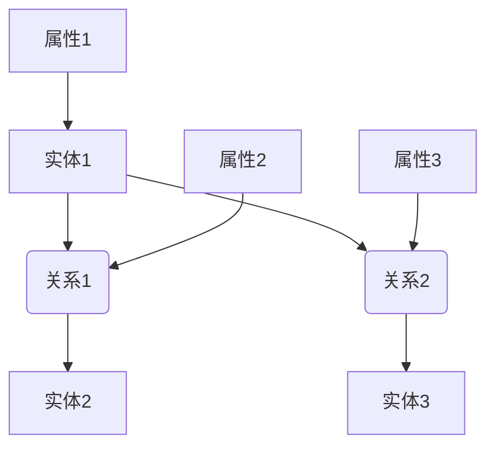

                 

关键词：知识图谱、数据结构、人工智能、语义理解、图数据库

> 摘要：本文将深入探讨知识图谱的概念、构建方法以及其在人工智能领域的应用。我们将分析知识图谱的结构、核心算法、数学模型，并通过实际项目实践和未来展望，展现知识图谱在构建人类智慧数字地图中的重要地位。

## 1. 背景介绍

随着互联网的快速发展，数据爆炸式增长，传统的数据库技术已经无法满足我们对数据的处理和分析需求。此时，知识图谱作为一种新兴的数据结构，逐渐成为研究热点。知识图谱通过构建实体与实体之间的关系网络，为语义理解和数据挖掘提供了强大的工具。

知识图谱的核心思想是将现实世界中的事物抽象为节点，将它们之间的关系表示为边。这种图结构不仅可以表示复杂的关系，还可以通过图算法进行高效的计算和分析。

知识图谱在多个领域都有广泛应用，如搜索引擎、推荐系统、自然语言处理、智能问答等。它不仅能够提高数据处理的效率，还可以为人工智能提供更丰富的语义信息。

## 2. 核心概念与联系

### 2.1 实体（Entity）

实体是知识图谱中的基本元素，可以表示为任何具有特定属性和关系的对象。例如，人、地点、组织、物品等都可以作为实体。

### 2.2 关系（Relationship）

关系是实体之间的关联，表示两个实体之间的交互或影响。例如，“居住在”、“属于”、“购买”等。

### 2.3 属性（Attribute）

属性是实体的特征或描述，可以为实体提供更详细的信息。例如，人的姓名、年龄、职业等。

### 2.4 知识图谱的基本结构

知识图谱的基本结构由实体、关系和属性组成。这些元素通过图结构相互连接，形成一个复杂的关系网络。

### 2.5 Mermaid 流程图

下面是一个知识图谱的 Mermaid 流程图示例：



## 3. 核心算法原理 & 具体操作步骤

### 3.1 算法原理概述

知识图谱的核心算法主要包括实体抽取、关系抽取和实体关系建模。这些算法共同作用，构建出一个完整的知识图谱。

### 3.2 算法步骤详解

#### 3.2.1 实体抽取

实体抽取是指从原始文本数据中识别出实体。常用的方法包括基于规则的方法、基于机器学习的方法和基于深度学习的方法。

#### 3.2.2 关系抽取

关系抽取是指从原始文本数据中识别出实体之间的关系。常用的方法包括基于规则的方法、基于机器学习的方法和基于深度学习的方法。

#### 3.2.3 实体关系建模

实体关系建模是指将识别出的实体和关系构建成知识图谱。常用的方法包括基于图数据库的方法和基于图神经网络的方法。

### 3.3 算法优缺点

#### 3.3.1 优点

- **高效性**：知识图谱通过图结构进行数据表示，可以高效地处理复杂的关系。
- **扩展性**：知识图谱可以灵活地扩展，适应不断变化的数据需求。
- **语义理解**：知识图谱提供了丰富的语义信息，有助于提高自然语言处理和推荐的准确度。

#### 3.3.2 缺点

- **复杂性**：构建和维护知识图谱需要大量的时间和资源。
- **数据质量**：知识图谱的质量取决于原始数据的质量，数据噪声和错误可能会影响图谱的性能。

### 3.4 算法应用领域

知识图谱在多个领域都有广泛应用，如：

- **搜索引擎**：通过知识图谱提高搜索结果的准确性和相关性。
- **推荐系统**：利用知识图谱发现用户和物品之间的潜在关系，提供更个性化的推荐。
- **自然语言处理**：利用知识图谱进行语义理解和文本生成。

## 4. 数学模型和公式 & 详细讲解 & 举例说明

### 4.1 数学模型构建

知识图谱的数学模型主要涉及图论和概率图模型。

#### 4.1.1 图论

知识图谱可以表示为一个无向图 \( G = (V, E) \)，其中 \( V \) 是实体集，\( E \) 是关系集。

#### 4.1.2 概率图模型

概率图模型用于描述实体和关系之间的概率关系。常用的概率图模型包括贝叶斯网络和马尔可夫网络。

### 4.2 公式推导过程

假设我们有一个知识图谱 \( G = (V, E) \)，其中实体集 \( V = \{v_1, v_2, ..., v_n\} \)，关系集 \( E = \{e_1, e_2, ..., e_m\} \)。

我们定义一个概率分布 \( P(V, E) \)，表示实体和关系出现的概率。

#### 4.2.1 贝叶斯网络

贝叶斯网络是一个有向无环图，表示实体和关系之间的条件概率。

$$
P(V, E) = \prod_{i=1}^{n} P(v_i) \prod_{i=1}^{m} P(e_i|v_i)
$$

#### 4.2.2 马尔可夫网络

马尔可夫网络是一个无向图，表示实体和关系之间的马尔可夫性质。

$$
P(V, E) = \prod_{i=1}^{n} \prod_{j=1}^{m} P(e_j|v_i)
$$

### 4.3 案例分析与讲解

假设我们有一个简单的知识图谱，表示城市、航班和机场之间的关系。

- 实体：城市、航班、机场
- 关系：航班从某城市出发，机场是航班的起降地

我们可以构建一个贝叶斯网络，表示城市、航班和机场之间的概率关系。

$$
P(城市, 航班, 机场) = P(城市) \cdot P(航班|城市) \cdot P(机场|航班)
$$

例如，航班从北京出发，机场是北京首都国际机场的概率为：

$$
P(北京, 航班, 北京首都国际机场) = P(北京) \cdot P(航班|北京) \cdot P(北京首都国际机场|航班)
$$

我们可以通过查询历史数据，估计出上述概率。

## 5. 项目实践：代码实例和详细解释说明

### 5.1 开发环境搭建

在本文中，我们将使用Python和Neo4j图数据库进行知识图谱的构建。

- 安装Python（3.8及以上版本）
- 安装Neo4j（社区版）
- 安装Neo4j Python驱动（neo4j）

### 5.2 源代码详细实现

以下是一个简单的知识图谱构建代码示例：

```python
from neo4j import GraphDatabase

class KnowledgeGraph:
    def __init__(self, uri, user, password):
        self._driver = GraphDatabase.driver(uri, auth=(user, password))

    def create_entity(self, label, properties):
        with self._driver.session() as session:
            session.run("CREATE (n:" + label + "[{$properties}])", properties=properties)

    def create_relationship(self, start_node, relationship, end_node):
        with self._driver.session() as session:
            session.run("MATCH (a:" + start_node + "), (b:" + end_node + ") CREATE (a)-[r:" + relationship + "]->(b)")

    def close(self):
        self._driver.close()

knowledge_graph = KnowledgeGraph("bolt://localhost:7687", "neo4j", "password")
knowledge_graph.create_entity("City", {"name": "北京"})
knowledge_graph.create_entity("Airport", {"name": "北京首都国际机场"})
knowledge_graph.create_relationship("City", "located_at", "Airport")
knowledge_graph.close()
```

### 5.3 代码解读与分析

上述代码定义了一个知识图谱类 `KnowledgeGraph`，用于创建实体和关系。我们通过 `create_entity` 方法创建实体，通过 `create_relationship` 方法创建关系。

在创建实体时，我们指定了实体的标签（如 `City`、`Airport`）和属性（如 `name`）。在创建关系时，我们指定了关系的起点实体、关系标签和终点实体。

### 5.4 运行结果展示

运行上述代码后，我们会在Neo4j数据库中创建一个知识图谱，包含城市和机场实体，以及它们之间的 `located_at` 关系。


## 6. 实际应用场景

### 6.1 搜索引擎

知识图谱可以提高搜索引擎的搜索结果准确性和相关性。例如，当用户搜索“北京”时，搜索引擎可以利用知识图谱提供关于北京的详细信息，如城市介绍、旅游景点、天气等。

### 6.2 推荐系统

知识图谱可以帮助推荐系统发现用户和物品之间的潜在关系，提供更个性化的推荐。例如，当用户浏览了一个旅游网站时，网站可以利用知识图谱推荐与用户兴趣相关的旅游景点。

### 6.3 自然语言处理

知识图谱可以提高自然语言处理的语义理解能力。例如，在机器翻译中，知识图谱可以帮助翻译系统理解词汇之间的语义关系，提高翻译质量。

## 7. 工具和资源推荐

### 7.1 学习资源推荐

- 《知识图谱：原理、方法与应用》
- 《图计算：原理、算法与应用》
- 《Python Graph Gallery》：一个包含多种图结构和算法的Python库

### 7.2 开发工具推荐

- Neo4j：一款流行的图数据库
- Python：一种流行的编程语言
- Py2neo：Neo4j的Python驱动

### 7.3 相关论文推荐

- [“Knowledge Graph Construction and Its Applications”](http://arxiv.org/abs/1503.03578)
- [“Graph Embedding Techniques, Applications, and Performance”](https://www.kdd.org/kdd2018/accepts/p1278-html.html)
- [“A Comprehensive Survey on Knowledge Graph”](https://arxiv.org/abs/1811.08065)

## 8. 总结：未来发展趋势与挑战

### 8.1 研究成果总结

知识图谱作为一种强大的数据结构，已经在多个领域取得了显著的成果。然而，知识图谱的构建、维护和应用仍然面临许多挑战。

### 8.2 未来发展趋势

- **数据多样性**：未来知识图谱将涵盖更多类型的数据，如多媒体、传感器数据等。
- **实时性**：知识图谱将支持实时更新和查询。
- **自动化构建**：自动化算法将使知识图谱的构建更加高效和准确。

### 8.3 面临的挑战

- **数据质量**：数据噪声和错误会影响知识图谱的性能。
- **数据隐私**：知识图谱构建过程中可能涉及敏感数据。
- **计算资源**：大规模知识图谱的存储和计算需要大量的资源。

### 8.4 研究展望

知识图谱在构建人类智慧数字地图中具有巨大的潜力。未来，我们需要进一步探索知识图谱的构建方法、优化算法，并解决数据质量和隐私等问题，以实现知识图谱的广泛应用。

## 9. 附录：常见问题与解答

### 9.1 什么是知识图谱？

知识图谱是一种用于表示实体和它们之间关系的图结构。它通过构建实体-关系网络，为语义理解和数据挖掘提供了强大的工具。

### 9.2 知识图谱有哪些应用领域？

知识图谱在多个领域都有应用，如搜索引擎、推荐系统、自然语言处理、智能问答等。

### 9.3 如何构建知识图谱？

构建知识图谱通常包括实体抽取、关系抽取和实体关系建模等步骤。具体方法包括基于规则的方法、基于机器学习的方法和基于深度学习的方法。

### 9.4 知识图谱有哪些优点和缺点？

知识图谱的优点包括高效性、扩展性和语义理解。缺点包括复杂性、数据质量依赖和计算资源需求。

---

作者：禅与计算机程序设计艺术 / Zen and the Art of Computer Programming
------------------------------------------------------------------------

