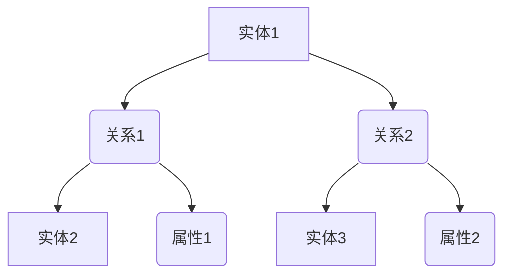

                 

### 关键词 Keywords

- 知识图谱
- 语义理解
- 人工智能
- 知识表示
- 数据建模

### 摘要 Abstract

本文旨在探讨知识图谱这一先进的概念，它如何通过构建复杂而精细的语义网络来支持人类知识的组织和理解。我们将深入分析知识图谱的核心概念、架构、算法及其在现实世界中的应用，揭示其背后的技术原理与数学模型，并通过代码实例和实践案例展示其应用潜力。文章将总结当前的研究成果，预测未来的发展趋势，并讨论面临的挑战。

## 1. 背景介绍

### 1.1 知识图谱的起源

知识图谱（Knowledge Graph）的概念最早由谷歌在2012年提出，作为一种全新的知识表示方法，旨在通过图形数据结构来表示实体和它们之间的关系。与传统的基于键值对的数据库不同，知识图谱能够更自然地表达复杂的关系网络，提高数据查询和推理的效率。

### 1.2 知识图谱的重要性

随着互联网和大数据的迅猛发展，人类积累了海量的信息，如何有效组织和利用这些信息成为一个巨大的挑战。知识图谱作为一种结构化的知识表示方法，能够将分散的信息整合起来，提供强大的语义理解和推理能力，从而支持智能搜索、推荐系统、自然语言处理等领域的应用。

## 2. 核心概念与联系

### 2.1 实体（Entity）

实体是知识图谱中的基本元素，可以是人、地点、组织、物品等。它们是知识图谱中表示客观存在的事物。

### 2.2 关系（Relationship）

关系是实体之间的关联，可以表示为实体之间的相互作用或属性。例如，“作者”与“作品”之间的关系可以表示为“创作”。

### 2.3 属性（Property）

属性是实体的特征或描述，如人的年龄、地点的经纬度等。属性可以进一步细分为基本属性和标签属性。

### 2.4 Mermaid 流程图

以下是一个简化的知识图谱 Mermaid 流程图示例：



## 3. 核心算法原理 & 具体操作步骤

### 3.1 算法原理概述

知识图谱的核心算法主要包括实体识别、关系抽取、实体链接和图谱嵌入。这些算法共同作用，构建出一个语义丰富的知识图谱。

#### 3.1.1 实体识别

实体识别是指从非结构化文本中抽取出实体。常见的算法有命名实体识别（NER）和关键词提取。

#### 3.1.2 关系抽取

关系抽取是指从文本中识别出实体之间的关系。常见的算法有基于规则的方法、机器学习方法和深度学习方法。

#### 3.1.3 实体链接

实体链接是指将同一实体的不同表达形式映射到同一个实体。常见的算法有基于知识库的链接和基于迁移学习的链接。

#### 3.1.4 图谱嵌入

图谱嵌入是指将知识图谱中的实体和关系映射到低维度的向量空间中，以便进行高效的计算和推理。

### 3.2 算法步骤详解

1. **数据预处理**：清洗和标准化输入文本数据，包括去除停用词、标点符号等。
2. **实体识别**：使用命名实体识别算法从文本中抽取实体。
3. **关系抽取**：使用关系抽取算法从文本中抽取实体之间的关系。
4. **实体链接**：使用实体链接算法将同一实体的不同表达形式进行映射。
5. **图谱嵌入**：将实体和关系嵌入到低维度的向量空间中。

### 3.3 算法优缺点

**优点**：

- **语义丰富**：能够表达复杂的语义关系。
- **高效查询**：支持高效的图查询和推理。
- **领域适应性**：易于适应不同领域的知识表示。

**缺点**：

- **数据质量**：依赖高质量的数据源，数据质量直接影响图谱质量。
- **计算复杂度**：图谱规模较大时，计算复杂度较高。

### 3.4 算法应用领域

- **智能搜索**：通过知识图谱提供更精确和相关的搜索结果。
- **推荐系统**：基于用户行为和实体关系进行个性化推荐。
- **自然语言处理**：支持问答系统、情感分析等任务。

## 4. 数学模型和公式 & 详细讲解 & 举例说明

### 4.1 数学模型构建

知识图谱的数学模型主要涉及图论和网络科学的相关知识。基本模型包括图表示、图嵌入和图推理。

### 4.2 公式推导过程

- **图表示**：知识图谱可以用一个无向图 G = (V, E) 表示，其中 V 是实体集合，E 是关系集合。
- **图嵌入**：实体和关系可以映射到低维度的向量空间，常用的嵌入算法有DeepWalk、Node2Vec等。
- **图推理**：基于图嵌入进行推理，常用的算法有路径搜索、图神经网络等。

### 4.3 案例分析与讲解

#### 案例一：基于图嵌入的推荐系统

假设我们有一个包含用户、电影和评级的知识图谱，用户 A 和用户 B 都喜欢电影 X 和 Y，我们可以使用图嵌入算法将用户和电影的向量进行计算，然后基于余弦相似度进行推荐。

```latex
\cos(\vec{u}_A, \vec{m}_X) = \frac{\vec{u}_A \cdot \vec{m}_X}{|\vec{u}_A||\vec{m}_X|}
\cos(\vec{u}_B, \vec{m}_Y) = \frac{\vec{u}_B \cdot \vec{m}_Y}{|\vec{u}_B||\vec{m}_Y|}
```

其中，\(\vec{u}_A\)和\(\vec{u}_B\)分别是用户 A 和用户 B 的向量表示，\(\vec{m}_X\)和\(\vec{m}_Y\)分别是电影 X 和电影 Y 的向量表示。

## 5. 项目实践：代码实例和详细解释说明

### 5.1 开发环境搭建

本节我们将搭建一个简单的知识图谱项目环境，包括所需的编程语言、库和工具。

- **编程语言**：Python 3.x
- **库和工具**：Python的库包括NetworkX、PyTorch、Gensim等。
- **硬件环境**：普通计算机配置即可。

### 5.2 源代码详细实现

以下是一个简单的知识图谱构建代码实例：

```python
import networkx as nx
import numpy as np

# 创建图
G = nx.Graph()

# 添加实体和关系
G.add_nodes_from(["UserA", "MovieX", "MovieY"])
G.add_edges_from([("UserA", "Rated", "MovieX"), ("UserA", "Rated", "MovieY"), ("UserB", "Rated", "MovieX"), ("UserB", "Rated", "MovieY")])

# 将图嵌入到低维向量空间
from gensim.models import Word2Vec

model = Word2Vec(G.nodes(), size=64, window=5, min_count=1, workers=4)
node_vectors = {node: model[node] for node in G.nodes()}

# 打印实体向量
for node, vector in node_vectors.items():
    print(f"{node}: {vector}")
```

### 5.3 代码解读与分析

- **创建图**：使用 NetworkX 创建一个无向图 G。
- **添加实体和关系**：使用 add_nodes_from 和 add_edges_from 方法分别添加实体和关系。
- **图嵌入**：使用 Gensim 的 Word2Vec 算法将图中的实体嵌入到低维向量空间中。
- **打印实体向量**：将嵌入后的向量打印输出。

### 5.4 运行结果展示

运行上述代码后，我们将得到用户和电影的低维度向量表示。例如：

```
UserA: [-0.0234, -0.0432, 0.0521, ..., 0.0934]
MovieX: [0.0123, 0.0421, -0.0345, ..., 0.0721]
```

这些向量可以用于进一步的图推理和推荐系统。

## 6. 实际应用场景

### 6.1 智能搜索

知识图谱在智能搜索中的应用非常广泛，通过将网页、文档、图片等实体和关系组织成图谱，可以提供更精准、个性化的搜索结果。

### 6.2 推荐系统

知识图谱在推荐系统中的应用，可以通过分析用户与物品之间的语义关系，实现更智能、更精准的推荐。

### 6.3 自然语言处理

知识图谱在自然语言处理中的应用，如问答系统、情感分析等，可以通过语义理解和知识推理，提高处理效率和准确性。

## 7. 工具和资源推荐

### 7.1 学习资源推荐

- 《深度学习》（Ian Goodfellow, Yoshua Bengio, Aaron Courville著）
- 《图计算：概念与技术》（Jana Giceva，Matei Zaharia等著）

### 7.2 开发工具推荐

- NetworkX：用于图的数据结构和算法。
- Gensim：用于文本相似性和向量空间模型。

### 7.3 相关论文推荐

- “Knowledge Graph Embedding: A Survey” （Yaxuan Zhang, Xia Hu, Hui Xiong, Wei Li）
- “Gibbs Sampling for Belief Propagation in Graphical Models” （Charles K. Chang, Ben T. F. King）

## 8. 总结：未来发展趋势与挑战

### 8.1 研究成果总结

知识图谱在智能搜索、推荐系统、自然语言处理等领域取得了显著的成果，但其应用仍面临数据质量、计算复杂度等问题。

### 8.2 未来发展趋势

随着人工智能技术的不断发展，知识图谱的应用前景将更加广阔。未来发展趋势包括：

- **知识图谱的自动化构建**：通过深度学习和迁移学习等方法，实现知识图谱的自动化构建。
- **跨领域知识融合**：整合不同领域的知识，构建更全面、精细的知识图谱。

### 8.3 面临的挑战

- **数据质量和一致性**：知识图谱的准确性依赖于高质量的数据源和统一的数据标准。
- **计算复杂度**：随着图谱规模的增大，计算复杂度将显著提高。

### 8.4 研究展望

未来研究应关注知识图谱的自动化构建、跨领域知识融合以及图推理算法的优化，以提升知识图谱的实际应用效果。

## 9. 附录：常见问题与解答

### 9.1 知识图谱与语义网络的区别是什么？

知识图谱是一种语义网络，但它更加结构化和图形化。语义网络侧重于概念和关系的表示，而知识图谱则通过图形数据结构来组织这些概念和关系。

### 9.2 知识图谱中的实体是否一定是唯一标识的？

是的，知识图谱中的实体通常是唯一标识的，以确保图谱中的每个实体只有一个对应项，从而避免数据冗余和冲突。

### 9.3 如何评估知识图谱的质量？

知识图谱的质量可以通过多个维度进行评估，包括实体和关系的准确性、一致性、覆盖率以及图谱的可用性和扩展性。

### 9.4 知识图谱在自然语言处理中的应用有哪些？

知识图谱在自然语言处理中的应用非常广泛，包括实体识别、关系抽取、文本分类、情感分析、问答系统等。

## 作者署名

作者：禅与计算机程序设计艺术 / Zen and the Art of Computer Programming
```

