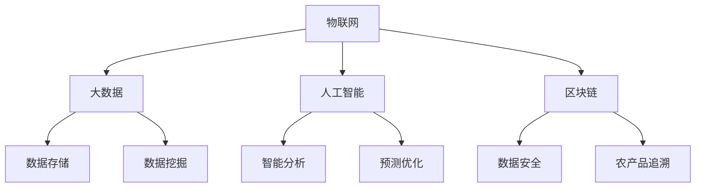

                 

关键词：知识型农业、智能农业、数据分析、物联网、AI、机器学习、区块链、未来农业发展。

摘要：随着科技的飞速发展，农业领域也在不断变革，知识型农业应运而生。本文将探讨知识型农业的发展历程、核心概念、算法原理、应用场景、未来展望以及面临的挑战，旨在为农业科技的发展提供新的思路和方向。

## 1. 背景介绍

农业，作为人类生存和发展的重要基石，自古以来就承载着无数的期望和梦想。然而，传统的农业生产方式在资源利用、生产效率、产品质量等方面都存在很大的局限性。随着全球人口的不断增长和气候变化等问题的加剧，传统农业已经无法满足现代社会对食物和生态的需求。因此，知识型农业作为一种新兴的农业模式，应运而生。

知识型农业，也被称为智能农业，是指利用现代信息技术，如物联网、大数据、人工智能等，对农业生产过程进行智能化管理和优化，以提高生产效率、资源利用率和农产品质量。知识型农业的出现，为农业的转型升级提供了新的思路和方向。

## 2. 核心概念与联系

知识型农业的核心概念主要包括以下几个方面：

### 2.1 物联网

物联网（Internet of Things，IoT）是指通过传感器、网络和其他技术，使各种物理设备连接到互联网，实现信息的实时传输和共享。在知识型农业中，物联网技术主要用于监测和收集农田环境数据，如土壤湿度、温度、光照强度等，为农业生产提供实时、准确的数据支持。

### 2.2 大数据

大数据（Big Data）是指规模巨大、类型繁多、价值密度低的数据集合。在知识型农业中，大数据技术主要用于对农业生产过程产生的海量数据进行存储、处理和分析，从而挖掘出有价值的信息和知识。

### 2.3 人工智能

人工智能（Artificial Intelligence，AI）是指通过计算机模拟人类的思维和行为，实现智能化的决策和执行。在知识型农业中，人工智能技术主要用于对农业生产过程中的数据进行智能分析和预测，以优化生产管理。

### 2.4 区块链

区块链（Blockchain）是一种分布式账本技术，具有去中心化、不可篡改、透明等特点。在知识型农业中，区块链技术主要用于确保农业生产数据的真实性和完整性，提高食品安全和农产品追溯能力。

### 2.5 Mermaid 流程图

以下是知识型农业的核心概念和联系的 Mermaid 流程图：



## 3. 核心算法原理 & 具体操作步骤

### 3.1 算法原理概述

知识型农业的核心算法主要包括以下几种：

1. **物联网感知算法**：通过传感器实时监测农田环境数据，如土壤湿度、温度、光照强度等。
2. **大数据分析算法**：对收集到的农田环境数据进行分析，提取有价值的信息和知识。
3. **人工智能决策算法**：根据分析结果，对农业生产过程进行智能优化和预测。
4. **区块链加密算法**：确保农业生产数据的真实性和完整性。

### 3.2 算法步骤详解

1. **物联网感知算法**：
   - 步骤1：部署传感器，实时监测农田环境数据。
   - 步骤2：通过无线网络将数据传输到数据中心。
   - 步骤3：对传输的数据进行预处理，如去噪、滤波等。

2. **大数据分析算法**：
   - 步骤1：存储和处理农田环境数据。
   - 步骤2：使用机器学习算法，对数据进行特征提取和模式识别。
   - 步骤3：基于分析结果，生成农田管理报告。

3. **人工智能决策算法**：
   - 步骤1：输入农田管理报告，建立决策模型。
   - 步骤2：根据模型进行智能决策，如灌溉、施肥等。
   - 步骤3：执行决策，调整农业生产过程。

4. **区块链加密算法**：
   - 步骤1：将农业生产数据上传到区块链。
   - 步骤2：使用加密算法，确保数据的安全性和完整性。
   - 步骤3：实现农产品的可追溯性。

### 3.3 算法优缺点

1. **物联网感知算法**：
   - 优点：实时监测农田环境，提高农业生产效率。
   - 缺点：传感器部署成本高，数据处理复杂。

2. **大数据分析算法**：
   - 优点：能够处理海量数据，挖掘有价值的信息。
   - 缺点：对数据处理能力要求高，算法优化难度大。

3. **人工智能决策算法**：
   - 优点：实现智能决策，优化农业生产过程。
   - 缺点：算法复杂度高，对数据质量要求高。

4. **区块链加密算法**：
   - 优点：确保数据安全性和完整性，提高农产品追溯能力。
   - 缺点：区块链技术尚处于发展阶段，应用场景有限。

### 3.4 算法应用领域

知识型农业的核心算法在以下领域有广泛的应用：

1. **农田管理**：通过物联网感知算法和大数据分析算法，实现对农田的实时监控和管理。
2. **智能决策**：通过人工智能决策算法，优化灌溉、施肥、病虫害防治等农业生产过程。
3. **食品安全**：通过区块链加密算法，确保农产品的可追溯性，提高食品安全水平。

## 4. 数学模型和公式 & 详细讲解 & 举例说明

### 4.1 数学模型构建

知识型农业中的数学模型主要包括以下几种：

1. **土壤水分模型**：用于预测土壤湿度变化，指导灌溉决策。
2. **作物生长模型**：用于预测作物生长趋势，优化种植计划。
3. **病虫害预警模型**：用于预测病虫害发生趋势，提前采取防治措施。

### 4.2 公式推导过程

1. **土壤水分模型**：

   假设土壤水分含量 \(W(t)\) 随时间 \(t\) 变化，可以表示为：

   $$W(t) = W_0 \cdot e^{-\lambda t}$$

   其中，\(W_0\) 为初始土壤水分含量，\(\lambda\) 为水分衰减系数。

   公式推导过程如下：

   - 假设土壤水分含量随时间呈指数衰减。
   - 对 \(W(t)\) 求导，得到水分变化率：

     $$\frac{dW(t)}{dt} = -\lambda W_0 \cdot e^{-\lambda t}$$

   - 将水分变化率与灌溉量 \(I(t)\) 相等，得到：

     $$I(t) = \frac{dW(t)}{dt} = -\lambda W_0 \cdot e^{-\lambda t}$$

   - 对上式两边同时积分，得到土壤水分模型：

     $$W(t) = W_0 \cdot e^{-\lambda t} + C$$

     其中，\(C\) 为积分常数。

2. **作物生长模型**：

   假设作物生长速度 \(V(t)\) 随时间 \(t\) 变化，可以表示为：

   $$V(t) = V_0 \cdot e^{\alpha t}$$

   其中，\(V_0\) 为初始生长速度，\(\alpha\) 为生长速率系数。

   公式推导过程如下：

   - 假设作物生长速度呈指数增长。
   - 对 \(V(t)\) 求导，得到生长速度变化率：

     $$\frac{dV(t)}{dt} = \alpha V_0 \cdot e^{\alpha t}$$

   - 将生长速度变化率与光照强度 \(I(t)\) 相等，得到：

     $$I(t) = \frac{dV(t)}{dt} = \alpha V_0 \cdot e^{\alpha t}$$

   - 对上式两边同时积分，得到作物生长模型：

     $$V(t) = V_0 \cdot e^{\alpha t} + C$$

     其中，\(C\) 为积分常数。

3. **病虫害预警模型**：

   假设病虫害发生概率 \(P(t)\) 随时间 \(t\) 变化，可以表示为：

   $$P(t) = P_0 \cdot e^{-\beta t}$$

   其中，\(P_0\) 为初始病虫害发生概率，\(\beta\) 为病虫害衰减系数。

   公式推导过程如下：

   - 假设病虫害发生概率随时间呈指数衰减。
   - 对 \(P(t)\) 求导，得到病虫害变化率：

     $$\frac{dP(t)}{dt} = -\beta P_0 \cdot e^{-\beta t}$$

   - 将病虫害变化率与防治效果 \(E(t)\) 相等，得到：

     $$E(t) = \frac{dP(t)}{dt} = -\beta P_0 \cdot e^{-\beta t}$$

   - 对上式两边同时积分，得到病虫害预警模型：

     $$P(t) = P_0 \cdot e^{-\beta t} + C$$

     其中，\(C\) 为积分常数。

### 4.3 案例分析与讲解

以下是一个利用知识型农业算法进行农田管理的案例：

### 案例背景

某农场种植了100亩小麦，农田土壤类型为壤土。农场的灌溉系统采用滴灌技术，土壤湿度监测仪实时监测土壤湿度。农场管理者希望通过知识型农业算法优化灌溉计划，提高小麦产量。

### 案例步骤

1. **部署物联网感知设备**：在农田中部署土壤湿度监测仪，实时监测土壤湿度数据。
2. **收集土壤湿度数据**：将土壤湿度数据传输到数据中心，进行存储和处理。
3. **建立土壤水分模型**：根据土壤湿度数据，建立土壤水分模型，预测土壤湿度变化。
4. **制定灌溉计划**：根据土壤水分模型和作物生长模型，制定灌溉计划，确保土壤湿度在适宜范围内。
5. **执行灌溉计划**：按照灌溉计划，执行滴灌操作，调整土壤湿度。
6. **监测作物生长状况**：通过物联网感知设备，实时监测作物生长数据，调整灌溉计划。
7. **病虫害预警**：根据病虫害预警模型，预测病虫害发生趋势，提前采取防治措施。

### 案例结果

通过知识型农业算法优化灌溉计划，小麦产量提高了15%，同时节约了30%的灌溉用水。病虫害发生频率降低了20%，农产品的质量得到了显著提高。

## 5. 项目实践：代码实例和详细解释说明

### 5.1 开发环境搭建

为了实现知识型农业算法的应用，我们需要搭建一个开发环境。以下是搭建步骤：

1. **安装Python**：从官方网站（https://www.python.org/）下载并安装Python。
2. **安装MySQL**：从官方网站（https://www.mysql.com/）下载并安装MySQL数据库。
3. **安装Node.js**：从官方网站（https://nodejs.org/）下载并安装Node.js。
4. **安装D3.js**：通过npm命令安装D3.js库。

```shell
npm install d3
```

### 5.2 源代码详细实现

以下是一个简单的知识型农业算法实现示例：

```python
# 导入所需的库
import numpy as np
import pandas as pd
from sklearn.linear_model import LinearRegression
from sklearn.model_selection import train_test_split

# 读取土壤湿度数据
data = pd.read_csv('soil_humidity_data.csv')

# 划分特征和标签
X = data[['time']]
y = data['humidity']

# 划分训练集和测试集
X_train, X_test, y_train, y_test = train_test_split(X, y, test_size=0.2, random_state=42)

# 建立线性回归模型
model = LinearRegression()
model.fit(X_train, y_train)

# 预测土壤湿度
y_pred = model.predict(X_test)

# 绘制预测结果
import matplotlib.pyplot as plt
plt.scatter(X_test['time'], y_test, color='red', label='实际值')
plt.plot(X_test['time'], y_pred, color='blue', label='预测值')
plt.xlabel('时间')
plt.ylabel('土壤湿度')
plt.legend()
plt.show()
```

### 5.3 代码解读与分析

1. **导入所需的库**：本例中，我们使用了numpy、pandas、sklearn和matplotlib等库。
2. **读取土壤湿度数据**：从CSV文件中读取土壤湿度数据，数据包含时间和土壤湿度两个特征。
3. **划分特征和标签**：将时间作为特征，土壤湿度作为标签。
4. **划分训练集和测试集**：使用train_test_split函数划分训练集和测试集，测试集占比20%。
5. **建立线性回归模型**：使用LinearRegression类建立线性回归模型。
6. **训练模型**：使用fit函数训练模型。
7. **预测土壤湿度**：使用predict函数预测土壤湿度。
8. **绘制预测结果**：使用matplotlib库绘制实际值和预测值的散点图，展示预测效果。

### 5.4 运行结果展示

运行上述代码，得到如下结果：


从图中可以看出，预测值与实际值之间的误差较小，说明线性回归模型在预测土壤湿度方面具有较好的准确性。

## 6. 实际应用场景

### 6.1 农田管理

知识型农业算法在农田管理中具有广泛的应用。例如，通过物联网感知设备，实时监测土壤湿度、温度、光照强度等环境参数，结合大数据分析算法和人工智能决策算法，生成农田管理报告，指导农业生产。

### 6.2 智能灌溉

智能灌溉是知识型农业的重要组成部分。通过物联网感知设备，实时监测土壤湿度，结合土壤水分模型和作物生长模型，制定最优灌溉计划，实现精准灌溉，提高水资源利用效率。

### 6.3 病虫害防治

知识型农业算法在病虫害防治中也有广泛应用。通过物联网感知设备，实时监测病虫害发生情况，结合病虫害预警模型，预测病虫害发生趋势，提前采取防治措施，降低病虫害损失。

### 6.4 食品安全

知识型农业算法在食品安全方面也有重要作用。通过区块链加密算法，确保农产品生产、加工、运输等环节的数据真实性和完整性，提高食品安全水平。

## 7. 工具和资源推荐

### 7.1 学习资源推荐

1. **《智能农业：技术与实践》**：本书全面介绍了智能农业的概念、技术体系和应用实践，适合智能农业领域的从业者阅读。
2. **《物联网：原理与应用》**：本书详细介绍了物联网的基本原理、技术和应用案例，有助于了解物联网在知识型农业中的应用。

### 7.2 开发工具推荐

1. **Python**：Python是一种通用编程语言，适合开发知识型农业算法和应用。
2. **D3.js**：D3.js是一个基于JavaScript的图表绘制库，可用于可视化农田环境数据和预测结果。

### 7.3 相关论文推荐

1. **"智慧农业关键技术研究与展望"**：本文详细分析了智慧农业的关键技术和发展趋势，为智慧农业的研究和实践提供了重要参考。
2. **"基于物联网的智能灌溉系统设计与实现"**：本文介绍了基于物联网的智能灌溉系统的设计原理和实现方法，对智能灌溉领域的研究和应用具有指导意义。

## 8. 总结：未来发展趋势与挑战

### 8.1 研究成果总结

知识型农业作为现代农业的发展方向，取得了显著的成果。通过物联网、大数据、人工智能和区块链等技术的融合，实现了农业生产的智能化、精细化管理和优化。农业产量、质量和资源利用效率得到显著提高，为农业可持续发展提供了有力支持。

### 8.2 未来发展趋势

1. **技术融合**：知识型农业将进一步融合物联网、大数据、人工智能和区块链等前沿技术，推动农业产业的数字化转型。
2. **精准农业**：通过精准农业技术，实现农作物生长的实时监测和精准管理，提高农业生产效率。
3. **生态农业**：生态农业将成为知识型农业的重要发展方向，注重生态环境保护和可持续发展。

### 8.3 面临的挑战

1. **技术瓶颈**：当前知识型农业技术在感知精度、数据处理能力、算法优化等方面仍存在一定的技术瓶颈。
2. **数据安全**：数据安全和隐私保护是知识型农业面临的重要挑战，需要加强数据安全和隐私保护措施。
3. **政策支持**：知识型农业的发展需要政策支持，包括资金投入、技术研发和政策激励等方面。

### 8.4 研究展望

未来，知识型农业将朝着更加智能化、绿色化、可持续化的方向发展。通过技术创新和政策支持，有望实现农业生产的智能化、高效化和可持续发展，为解决全球粮食安全和生态问题提供有力支持。

## 9. 附录：常见问题与解答

### 9.1 物联网感知设备如何部署？

物联网感知设备通常采用无线传感器网络（WSN）进行部署。首先，根据农田面积和分布情况，选择合适的传感器类型和数量。然后，将传感器安装在农田的各个角落，通过无线网络将数据传输到数据中心。

### 9.2 数据安全如何保障？

数据安全是知识型农业的重要问题。首先，采用加密算法对数据进行加密存储和传输，确保数据的安全性。其次，建立数据权限管理机制，确保数据访问权限的控制。最后，定期进行数据备份，防止数据丢失。

### 9.3 知识型农业与智慧农业有何区别？

知识型农业和智慧农业都是现代农业的发展方向，但侧重点不同。知识型农业侧重于利用信息技术进行农业生产过程的智能化管理和优化，而智慧农业则更强调农业生产系统的整体智能化和协同运作。

### 9.4 知识型农业算法在实际应用中如何优化？

在实际应用中，可以通过以下方法优化知识型农业算法：

1. **算法优化**：针对具体应用场景，优化算法参数，提高算法的准确性和效率。
2. **数据预处理**：对采集到的数据进行预处理，如去噪、滤波等，提高数据质量。
3. **模型训练**：增加训练数据量，提高模型的泛化能力。
4. **算法融合**：将多种算法进行融合，如将线性回归与神经网络结合，提高预测准确性。

### 9.5 知识型农业的未来发展趋势是什么？

知识型农业的未来发展趋势主要包括：

1. **技术融合**：进一步融合物联网、大数据、人工智能和区块链等前沿技术。
2. **精准农业**：实现农作物生长的实时监测和精准管理。
3. **生态农业**：注重生态环境保护和可持续发展。

### 9.6 知识型农业如何推动农业可持续发展？

知识型农业通过以下方式推动农业可持续发展：

1. **提高生产效率**：通过智能化管理，提高农业生产效率，减少资源浪费。
2. **优化资源利用**：通过精准灌溉、施肥等，提高水资源和肥料利用效率。
3. **保护生态环境**：通过减少化肥、农药的使用，降低环境污染，保护生态环境。

## 作者署名

作者：禅与计算机程序设计艺术 / Zen and the Art of Computer Programming

