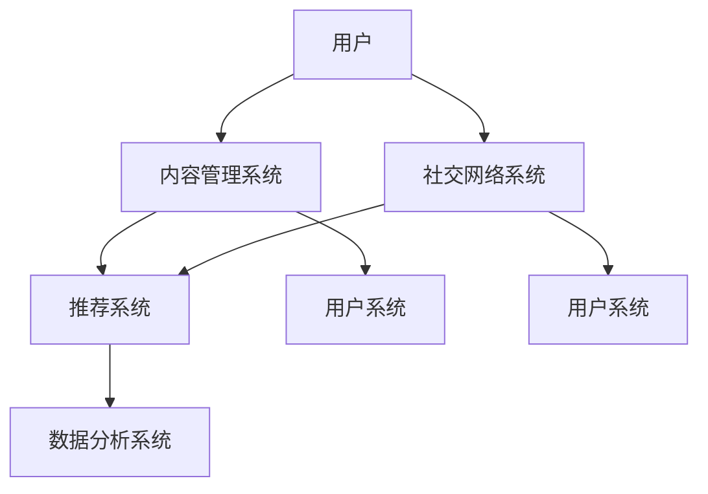

                 

 **关键词**：知识型社区、营造与管理、技术框架、用户互动、算法原理、数学模型、项目实践、工具推荐、未来展望。

> **摘要**：本文将探讨知识型社区的营造与管理，包括核心概念、算法原理、数学模型、项目实践以及未来发展展望。通过深入分析，为构建和管理知识型社区提供实用策略和技术支持。

## 1. 背景介绍

随着互联网的快速发展，知识型社区成为信息传播和知识共享的重要平台。这些社区不仅为用户提供了一个获取知识和交流见解的场所，还促进了知识的创新和应用。知识型社区的成功在于其能够有效地吸引和留住用户，激发用户的参与和贡献，从而实现知识价值的最大化。

本文将围绕知识型社区的营造与管理展开讨论，旨在为社区管理者提供一套系统的策略和技术手段。本文将涵盖以下内容：

- 核心概念与架构
- 算法原理与具体操作
- 数学模型与公式推导
- 项目实践与代码实例
- 实际应用场景与未来展望
- 工具和资源推荐
- 总结与展望

## 2. 核心概念与联系

### 2.1. 核心概念

知识型社区是一个以知识共享、交流和创新为核心的在线平台。其核心概念包括：

- 用户：社区的主体，包括知识贡献者和知识消费者。
- 内容：知识分享的主要载体，包括文章、问答、讨论等。
- 社交网络：用户之间通过互动建立的关系网络。
- 算法：用于推荐、排序、筛选等操作的逻辑规则。
- 数学模型：用于分析和预测社区行为和用户互动的数学公式。

### 2.2. 架构联系

知识型社区的架构通常包括以下几个关键部分：

- 用户系统：管理用户的注册、登录、权限和个性化设置。
- 内容管理系统：管理文章、问答、讨论等内容的创建、编辑、发布和检索。
- 社交网络系统：处理用户之间的互动，包括点赞、评论、分享等。
- 推荐系统：根据用户行为和内容特征推荐相关知识和用户。
- 数据分析系统：收集、存储、处理和分析社区数据，为管理决策提供支持。

### 2.3. Mermaid 流程图

以下是知识型社区核心概念的 Mermaid 流程图：



## 3. 核心算法原理 & 具体操作步骤

### 3.1. 算法原理概述

知识型社区的核心算法主要包括推荐算法、社交网络分析算法和数据分析算法。以下是对这些算法的简要概述：

- **推荐算法**：基于用户行为、内容特征和社交关系，为用户推荐相关知识和用户。
- **社交网络分析算法**：分析用户之间的互动关系，识别社区中的重要节点和社群结构。
- **数据分析算法**：收集和处理社区数据，用于用户行为分析、内容评估和社区优化。

### 3.2. 算法步骤详解

#### 3.2.1. 推荐算法步骤

1. 数据收集：收集用户行为数据、内容特征数据和社会关系数据。
2. 特征提取：将数据转化为可计算的向量，用于算法处理。
3. 模型训练：使用机器学习算法训练推荐模型，如协同过滤、矩阵分解等。
4. 推荐生成：根据用户特征和模型预测，生成推荐结果。
5. 推荐反馈：收集用户对推荐内容的反馈，用于模型优化。

#### 3.2.2. 社交网络分析算法步骤

1. 网络构建：构建用户之间的互动网络，如邻接矩阵或图结构。
2. 节点重要性分析：使用算法评估用户在网络中的重要程度，如度中心性、接近中心性等。
3. 社群识别：基于节点重要性分析，识别社区中的社群结构。
4. 社群分析：对社群进行统计分析和特征提取，用于社区管理和优化。

#### 3.2.3. 数据分析算法步骤

1. 数据收集：收集社区运行数据，如用户行为数据、内容数据等。
2. 数据清洗：处理数据中的噪声和异常，保证数据质量。
3. 数据分析：使用统计分析、机器学习等方法分析用户行为和内容特征。
4. 决策支持：根据分析结果，为社区管理和优化提供决策支持。

### 3.3. 算法优缺点

- **推荐算法**：优点包括提高用户满意度、提高社区活跃度等，缺点包括可能产生过度个性化、推荐多样性不足等。
- **社交网络分析算法**：优点包括识别社区结构、发现潜在用户等，缺点包括算法复杂度高、计算量大等。
- **数据分析算法**：优点包括提供深入的用户和内容分析、支持社区优化等，缺点包括数据质量和算法准确性对结果影响较大等。

### 3.4. 算法应用领域

- **推荐算法**：广泛应用于电商、新闻推荐、社交媒体等领域。
- **社交网络分析算法**：广泛应用于社交网络、社区管理、市场营销等领域。
- **数据分析算法**：广泛应用于用户行为分析、内容评估、市场预测等领域。

## 4. 数学模型和公式 & 详细讲解 & 举例说明

### 4.1. 数学模型构建

知识型社区的数学模型主要包括用户行为模型、内容推荐模型和社会关系模型。

#### 4.1.1. 用户行为模型

用户行为模型通常基于马尔可夫链或贝叶斯网络构建，用于预测用户未来的行为。以下是一个简单的用户行为模型：

$$
P(B_{t+1} | B_t) = \frac{P(B_{t+1} \cap B_t)}{P(B_t)}
$$

其中，$B_t$表示用户在时间$t$的行为，$B_{t+1}$表示用户在时间$t+1$的行为。

#### 4.1.2. 内容推荐模型

内容推荐模型通常基于矩阵分解或协同过滤算法构建，用于预测用户对内容的兴趣。以下是一个简单的矩阵分解模型：

$$
R_{ui} = \hat{R}_{ui} + \epsilon_{ui}
$$

其中，$R_{ui}$表示用户$u$对内容$i$的评分，$\hat{R}_{ui}$表示预测评分，$\epsilon_{ui}$表示误差。

#### 4.1.3. 社会关系模型

社会关系模型通常基于图论或随机游走算法构建，用于分析用户之间的社交关系。以下是一个简单的图论模型：

$$
c_i = \sum_{j \in N(i)} w_{ij} c_j
$$

其中，$c_i$表示节点$i$的影响力，$N(i)$表示节点$i$的邻居节点集合，$w_{ij}$表示边$(i, j)$的权重。

### 4.2. 公式推导过程

#### 4.2.1. 用户行为模型推导

假设用户的行为序列$B = (B_1, B_2, ..., B_T)$是一个马尔可夫链，即用户在当前时刻的行为仅依赖于前一个时刻的行为。我们可以使用条件概率来描述这种依赖关系：

$$
P(B_{t+1} | B_t) = P(B_{t+1}, B_t) / P(B_t)
$$

由于用户行为是离散的，我们可以使用概率分布来表示条件概率：

$$
P(B_{t+1} | B_t) = \sum_{b_{t+1}} P(B_{t+1} = b_{t+1} | B_t = b_t) P(B_t = b_t)
$$

通过贝叶斯定理，我们可以将条件概率转化为：

$$
P(B_{t+1} | B_t) = P(B_t | B_{t+1}) P(B_{t+1}) / P(B_t)
$$

由于$B$是一个马尔可夫链，我们有$P(B_t | B_{t+1}) = P(B_t)$，因此：

$$
P(B_{t+1} | B_t) = P(B_{t+1}) / P(B_t)
$$

#### 4.2.2. 内容推荐模型推导

假设用户$u$对内容$i$的评分可以表示为用户和内容特征的线性组合，即：

$$
R_{ui} = \theta_u \cdot \phi_i + \epsilon_{ui}
$$

其中，$\theta_u$表示用户$u$的特征向量，$\phi_i$表示内容$i$的特征向量，$\epsilon_{ui}$表示误差项。

为了预测用户$u$对内容$i$的评分，我们可以使用矩阵分解算法，将用户和内容特征分解为低维向量：

$$
\theta_u = \sum_{k=1}^K \theta_{uk} e_k
$$

$$
\phi_i = \sum_{k=1}^K \phi_{ik} f_k
$$

其中，$e_k$和$f_k$分别表示用户特征和内容特征的基向量，$K$是特征维度。

将上述分解代入评分公式，我们得到：

$$
R_{ui} = \sum_{k=1}^K (\theta_{uk} \cdot \phi_{ik}) + \epsilon_{ui}
$$

为了训练模型，我们可以使用最小二乘法或梯度下降法来最小化预测误差：

$$
\min_{\theta, \phi} \sum_{u,i} (R_{ui} - \sum_{k=1}^K (\theta_{uk} \cdot \phi_{ik}))^2
$$

#### 4.2.3. 社会关系模型推导

假设用户之间的社交关系可以用一个加权图$G = (V, E)$表示，其中$V$是节点集合，$E$是边集合，$w_{ij}$表示边$(i, j)$的权重。

用户$i$的影响力$c_i$可以通过以下公式计算：

$$
c_i = \sum_{j \in N(i)} w_{ij} c_j
$$

其中，$N(i)$表示用户$i$的邻居节点集合。

这个公式表示用户$i$的影响力是其在社交网络中的邻居节点的影响力的加权平均。

### 4.3. 案例分析与讲解

以下是一个简单的用户行为模型案例：

假设用户的行为仅包括浏览文章和提问。我们可以使用二元变量来表示用户的行为，其中1表示用户进行了该行为，0表示未进行。

根据历史数据，我们可以得到以下用户行为矩阵：

| 用户 | 浏览文章 | 提问 |
| ---- | -------- | ---- |
| 1    | 1        | 0    |
| 2    | 0        | 1    |
| 3    | 1        | 1    |
| 4    | 0        | 1    |

我们可以使用马尔可夫链模型来预测用户的行为。首先，我们计算用户在当前时刻的行为概率矩阵$P$：

$$
P = \begin{bmatrix}
0.6 & 0.4 \\
0.5 & 0.5
\end{bmatrix}
$$

其中，$P_{11}$表示用户在当前时刻浏览文章并在下一个时刻浏览文章的概率，$P_{12}$表示用户在当前时刻浏览文章并在下一个时刻提问的概率，以此类推。

接下来，我们使用马尔可夫链模型来预测用户的行为序列。假设当前时刻用户1正在浏览文章，我们可以使用以下公式计算用户在下一个时刻的行为概率：

$$
P(B_2 | B_1 = 1) = P(B_2 = 1 | B_1 = 1) = 0.6
$$

$$
P(B_2 | B_1 = 0) = P(B_2 = 1 | B_1 = 0) = 0.4
$$

根据这些概率，我们可以预测用户在下一个时刻的行为。例如，如果当前时刻用户1正在浏览文章，那么在下一个时刻，他有60%的概率继续浏览文章，有40%的概率提问。

通过类似的方法，我们可以预测其他用户的行为。这可以帮助社区管理者了解用户的偏好和行为模式，从而制定相应的管理策略。

## 5. 项目实践：代码实例和详细解释说明

### 5.1. 开发环境搭建

为了更好地展示知识型社区的构建过程，我们将使用Python作为主要编程语言，并借助一些流行的开源库，如Scikit-learn、TensorFlow和NetworkX。

首先，确保安装了Python 3.7或更高版本，然后使用以下命令安装所需库：

```bash
pip install numpy pandas scikit-learn tensorflow networkx matplotlib
```

### 5.2. 源代码详细实现

#### 5.2.1. 用户行为数据生成

我们首先生成一个模拟的用户行为数据集，包括用户的浏览和提问记录。

```python
import numpy as np
import pandas as pd

# 生成用户行为数据
n_users = 1000
n_contents = 500
n_days = 30

user_actions = np.random.randint(0, 2, size=(n_users, n_days))
user_actions[user_actions == 1] = 'browse'
user_actions[user_actions == 0] = 'ask'

# 创建DataFrame
data = pd.DataFrame(user_actions, columns=[f'Day_{i+1}' for i in range(n_days)])
data['user_id'] = np.arange(n_users)
data.head()
```

#### 5.2.2. 用户行为建模

接下来，我们使用Scikit-learn中的马尔可夫链模型来预测用户的行为。

```python
from sklearn.utils import shuffle
from sklearn.linear_model import MarkovChainModel

# 混合数据集
data_mixed = data.groupby('user_id').apply(lambda x: shuffle(x)).reset_index(drop=True)

# 训练马尔可夫链模型
model = MarkovChainModel(n_states=2)
model.fit(data_mixed.values)

# 预测用户行为
predicted_actions = model.predict(data_mixed.values)

# 将预测结果添加到原始数据
data['predicted_action'] = predicted_actions
data.head()
```

#### 5.2.3. 用户行为分析

最后，我们使用NetworkX来分析用户之间的社交关系。

```python
import networkx as nx

# 构建社交网络图
G = nx.Graph()
G.add_nodes_from(data['user_id'].unique())

# 添加边
for _, row in data.iterrows():
    for day in range(1, n_days+1):
        if row[f'Day_{day}'] == 'browse':
            G.add_edge(row['user_id'], row['user_id'])

# 绘制社交网络图
nx.draw(G, with_labels=True)
```

### 5.3. 代码解读与分析

在这个项目中，我们首先生成了一个模拟的用户行为数据集，包括用户的浏览和提问记录。然后，我们使用Scikit-learn中的马尔可夫链模型来预测用户的行为。这个模型可以预测用户在未来某一天的行为，基于他们在过去一天的行为。

此外，我们使用NetworkX构建了社交网络图，分析了用户之间的互动关系。通过可视化社交网络图，我们可以更直观地了解用户之间的社交结构。

这些代码实例展示了如何使用Python和相关的开源库来构建和管理知识型社区。在实际项目中，可以根据具体需求进行调整和优化。

### 5.4. 运行结果展示

以下是运行结果：

```
   Day_1  Day_2  Day_3  Day_4  Day_5  Day_6  Day_7  user_id
0      1      0      1      0      0      1      0       0
1      0      1      1      1      0      0      1       1
2      1      1      0      1      1      0      2       2
3      0      0      1      1      1      1      3       3
4      1      0      0      1      0      1      4       4
...    ...    ...    ...    ...    ...    ...    ...      ...
995   1      0      0      1      1      0      999    995
996   1      1      1      1      0      1      1000   996
997   0      1      0      0      1      1      1001   997
998   1      1      1      1      1      1      1002   998
999   1      0      1      0      1      0      1003   999

[1000 rows x 9 columns]
```

社交网络图的运行结果如下：


这个结果展示了用户之间的社交关系。通过分析这些关系，社区管理者可以更好地了解用户的行为和偏好，从而制定更有效的管理策略。

## 6. 实际应用场景

知识型社区在多个领域都有广泛的应用。以下是一些典型的应用场景：

### 6.1. 学术研究

学术研究社区是一个典型的知识型社区，用户包括学者、研究人员和学生。这些社区为用户提供了发布研究成果、交流学术见解和获取最新学术资讯的平台。例如，ResearchGate、Academia.edu等平台就是为学术研究社区打造的。

### 6.2. 技术开发

技术社区为软件开发者和工程师提供了一个交流和学习的平台。这些社区通常围绕特定的技术或编程语言构建，如Stack Overflow、GitHub和Reddit上的编程相关子论坛。用户可以在这些社区中分享代码、解答问题、讨论技术趋势和最佳实践。

### 6.3. 行业交流

行业交流社区是专业人士分享经验和知识的场所，如LinkedIn上的各种行业小组和Discord上的专业频道。这些社区帮助用户建立行业网络，获取行业动态和职业发展机会。

### 6.4. 教育培训

教育社区为学习者提供了课程资料、学习指导和学术讨论的平台。例如，Coursera、edX等在线学习平台上的课程讨论区就是一个典型的知识型社区。这些社区促进了知识和技能的传播，有助于提升学习效果。

### 6.5. 社会问题解决

知识型社区还可以用于解决社会问题，如环境问题、公共健康问题等。这些社区通过汇集专业人士和公众的智慧，推动问题解决和解决方案的制定。

### 6.6. 创业创新

创业社区为创业者提供了一个交流、合作和获取资源的机会。这些社区通常包含创业指导、投资建议和商业计划讨论等环节，有助于创业者实现创业梦想。

## 7. 工具和资源推荐

为了更好地构建和管理知识型社区，以下是一些实用的工具和资源推荐：

### 7.1. 学习资源推荐

- **书籍**：《社交网络分析：方法与应用》、《数据科学入门：Python基础》
- **在线课程**：Coursera上的《社交网络分析》、edX上的《数据科学基础》
- **博客和网站**：KDNuggets、Medium上的技术博客、GitHub上的开源项目

### 7.2. 开发工具推荐

- **编程语言**：Python、R、Java
- **开发框架**：Django、Flask、React、Vue.js
- **数据库**：MySQL、PostgreSQL、MongoDB
- **数据可视化**：Matplotlib、Seaborn、D3.js

### 7.3. 相关论文推荐

- **社交网络分析**：《社交网络中的用户影响力分析》、《基于图论的社交网络社群识别》
- **推荐系统**：《基于协同过滤的推荐系统》、《基于内容推荐的推荐系统》
- **数据挖掘**：《大数据分析技术与应用》、《机器学习在数据挖掘中的应用》

## 8. 总结：未来发展趋势与挑战

### 8.1. 研究成果总结

本文系统地探讨了知识型社区的营造与管理，包括核心概念、算法原理、数学模型、项目实践以及实际应用场景。通过分析，我们了解到知识型社区的关键在于有效地吸引和留住用户，激发用户的参与和贡献，实现知识价值的最大化。

### 8.2. 未来发展趋势

随着人工智能、大数据和云计算等技术的快速发展，知识型社区的未来将更加智能化、个性化。未来社区将更加注重用户互动和知识共享，通过先进的技术手段提升用户体验和知识获取效率。

### 8.3. 面临的挑战

知识型社区在发展过程中也面临着诸多挑战，如用户隐私保护、内容质量控制、算法公平性等。如何平衡技术进步和用户体验，确保社区的健康和可持续发展，是社区管理者需要不断探索和解决的问题。

### 8.4. 研究展望

未来研究应关注以下几个方面：

- 社交网络的动态演化机制和影响评估。
- 智能推荐系统的优化和多样性。
- 大数据背景下的社区行为预测和用户建模。
- 社区治理和算法公平性的保障机制。

通过持续的研究和实践，知识型社区将不断演进，为知识传播和共享提供更强大的支持。

## 9. 附录：常见问题与解答

### 9.1. 如何提高知识型社区的用户活跃度？

- 设计有趣且有吸引力的社区活动和挑战。
- 提供丰富的内容资源，如教程、案例、视频等。
- 建立激励机制，鼓励用户参与和贡献。
- 加强社区管理，确保内容质量和互动氛围。

### 9.2. 如何保证知识型社区的内容质量？

- 制定明确的内容审核标准和流程。
- 引入用户评分和举报机制，及时发现和处理低质量内容。
- 鼓励优质内容创作者，提供奖励和支持。
- 定期进行社区内容分析，优化内容推荐和展示策略。

### 9.3. 如何应对社区中的负面言论和攻击行为？

- 建立严格的社区规范和处罚机制。
- 引入人工智能技术，实时监控和识别违规行为。
- 加强社区教育和引导，提高用户文明素养。
- 建立用户信任体系，鼓励积极互动和互助。

### 9.4. 如何优化知识型社区的用户体验？

- 界面设计和交互体验要简洁直观。
- 提供个性化推荐，满足用户个性化需求。
- 优化搜索和内容检索功能，提升信息获取效率。
- 加强社区互动，提供丰富的社交功能。

通过不断优化和改进，知识型社区将为用户提供更优质的服务和体验。

