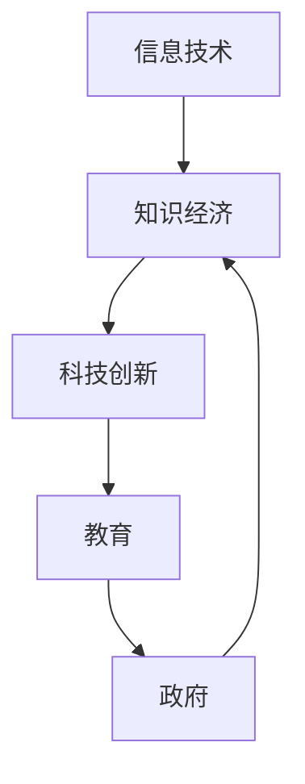

                 

关键词：知识经济、宏观政策、信息技术、人才培养、科技创新、产业升级、数字经济

摘要：本文旨在探讨知识型经济时代的宏观政策导向。随着信息技术的发展，知识经济已经成为全球经济的主导力量。本文分析了知识经济的核心特征，探讨了政府在其中扮演的角色，并提出了相应的宏观政策建议，以促进知识经济的发展和产业升级。

## 1. 背景介绍

知识经济是以知识为主要生产要素的经济形态，它不同于传统的资源型、劳动力型和资本型经济，具有高度依赖知识创新和信息技术发展的特征。知识经济的关键在于如何有效地利用和开发知识资源，推动科技创新，提高劳动生产率和经济效益。

### 1.1 信息技术的发展

信息技术的发展是知识经济兴起的直接推动力。互联网、云计算、大数据、人工智能等技术的广泛应用，使得信息传播速度大大加快，知识传播的渠道更加多样化和便捷。信息技术不仅改变了企业的生产方式，也改变了人们的生活方式，推动了全球经济向数字化、智能化方向转型。

### 1.2 全球经济的发展趋势

近年来，全球经济呈现出向知识型经济转型的趋势。发达国家的经济增长主要依赖于高科技产业和知识密集型服务业，而发展中国家的经济增长也开始逐步摆脱对传统资源型产业的依赖，转向知识密集型产业。这种转型是全球经济结构调整和产业升级的必然趋势。

## 2. 核心概念与联系

为了更好地理解知识型经济的宏观政策导向，我们需要先明确一些核心概念，并探讨它们之间的联系。

### 2.1 信息技术与知识经济

信息技术是知识经济的基础，它为知识的获取、传播、处理和应用提供了强大的工具。信息技术的发展推动了知识经济的形成和发展。

### 2.2 科技创新与知识经济

科技创新是知识经济的核心驱动力。通过科技创新，可以不断提高生产效率，降低生产成本，推动产业升级，从而实现经济的可持续发展。

### 2.3 教育与知识经济

教育是知识经济的基石。一个国家的教育水平决定了其国民的知识素养和创新能力，进而影响知识经济的发展水平。

### 2.4 政府与知识经济

政府在知识经济中扮演着关键角色。政府需要制定相应的宏观政策，为知识经济的发展提供支持和保障。

下面是一个使用Mermaid绘制的流程图，展示了这些核心概念之间的联系：



## 3. 核心算法原理 & 具体操作步骤

在知识型经济中，宏观政策的制定和执行需要遵循一定的算法原理，以确保政策的科学性和有效性。下面我们将详细讨论这些算法原理，并给出具体操作步骤。

### 3.1 算法原理概述

知识型经济的宏观政策算法主要基于以下几个原则：

1. **科技创新导向**：政策制定应优先考虑科技创新，以推动产业升级和经济增长。
2. **知识资源优化配置**：政策应优化知识资源的配置，提高知识的利用效率。
3. **教育优先**：政策应重视教育投入，提高国民的知识素养和创新能力。
4. **市场机制**：政策应充分发挥市场在资源配置中的决定性作用，同时进行适度调控。

### 3.2 算法步骤详解

#### 步骤1：科技创新评估

首先，政府需要建立科技创新评估体系，对各类科技创新项目进行评估，以确定哪些项目具有最大的经济效益和社会效益。

#### 步骤2：政策制定

根据科技创新评估结果，政府可以制定相应的宏观政策，包括财政支持、税收优惠、人才引进等。

#### 步骤3：知识资源配置

政府需要制定知识资源配置政策，确保知识资源的高效利用，如建立公共知识库、推动知识共享等。

#### 步骤4：教育投入

政府应加大教育投入，特别是对高等教育和职业教育的支持，以提高国民的知识素养和创新能力。

#### 步骤5：市场调控

政府应通过市场调控，如价格调节、市场监管等，确保知识经济市场的健康发展。

### 3.3 算法优缺点

#### 优点

- **科学性**：基于科技创新导向的算法原理，确保政策制定的科学性和有效性。
- **灵活性**：政策制定和执行过程中，可以根据实际情况进行调整，以应对不同的经济环境和挑战。

#### 缺点

- **复杂性**：算法涉及多个环节和部门，实施过程中可能会面临协调难度。
- **时效性**：科技创新和经济发展具有一定的时效性，政策制定和执行需要及时响应。

### 3.4 算法应用领域

知识型经济的宏观政策算法主要应用于以下几个方面：

- **科技创新支持**：为科技创新提供财政、税收等支持政策。
- **知识资源配置**：推动公共知识库建设，促进知识共享。
- **教育投入**：加大教育投入，提高国民知识素养和创新能力。
- **市场调控**：通过市场监管，确保知识经济市场的健康发展。

## 4. 数学模型和公式 & 详细讲解 & 举例说明

在知识型经济的宏观政策制定过程中，数学模型和公式扮演着重要角色。以下我们将详细讲解一个常用的数学模型，并给出具体的推导过程和案例分析。

### 4.1 数学模型构建

假设一个经济系统中，知识生产（Knowledge Production，KP）和知识应用（Knowledge Application，KA）是影响经济增长（Economic Growth，EG）的两个主要因素。我们可以构建一个简单的线性模型：

\[ EG = a \cdot KP + b \cdot KA \]

其中，\( a \) 和 \( b \) 是常数，表示知识生产和知识应用对经济增长的影响程度。

### 4.2 公式推导过程

假设知识生产 \( KP \) 可以用研发投入（R&D Investment，RDI）来衡量，即：

\[ KP = f(RDI) \]

同时，知识应用 \( KA \) 可以用教育培训投入（Education and Training Investment，ETI）来衡量，即：

\[ KA = g(ETI) \]

将 \( KP \) 和 \( KA \) 的表达式代入经济增长模型，得到：

\[ EG = a \cdot f(RDI) + b \cdot g(ETI) \]

这是一个关于经济增长的线性模型，可以用来分析知识生产和知识应用对经济增长的影响。

### 4.3 案例分析与讲解

假设一个国家在某一时期内，研发投入 \( RDI \) 为 100 亿元，教育培训投入 \( ETI \) 为 50 亿元。根据经济增长模型，我们可以计算出这一时期的经济增长 \( EG \)：

\[ EG = a \cdot 100 + b \cdot 50 \]

假设 \( a = 0.5 \) 和 \( b = 0.3 \)，则：

\[ EG = 0.5 \cdot 100 + 0.3 \cdot 50 = 85 \]

这意味着在假设条件下，这一时期的经济增长为 85 亿元。

通过这个简单的案例，我们可以看到，知识生产和知识应用对经济增长有着显著的影响。在实际政策制定过程中，政府可以通过调整研发投入和教育培训投入，来实现经济增长的目标。

## 5. 项目实践：代码实例和详细解释说明

为了更好地理解知识型经济宏观政策导向的具体实施，我们将通过一个简单的代码实例来进行详细解释。

### 5.1 开发环境搭建

首先，我们需要搭建一个简单的Python开发环境。以下是安装Python和必要的第三方库的步骤：

1. 安装Python：

```shell
# 通过pip安装Python
pip install python
```

2. 安装必要的第三方库：

```shell
# 安装NumPy库
pip install numpy

# 安装Matplotlib库
pip install matplotlib
```

### 5.2 源代码详细实现

下面是一个简单的Python脚本，用于计算经济增长模型的结果：

```python
import numpy as np
import matplotlib.pyplot as plt

# 定义经济增长模型
def economic_growth_model(RDI, ETI, a=0.5, b=0.3):
    KP = 0.01 * RDI  # 研发投入转化为知识生产
    KA = 0.01 * ETI  # 教育培训投入转化为知识应用
    EG = a * KP + b * KA
    return EG

# 模拟数据
RDI_data = np.linspace(0, 200, 100)  # 研发投入数据
ETI_data = np.linspace(0, 100, 100)  # 教育培训投入数据

# 计算经济增长
EG_data = [economic_growth_model(RDI, ETI) for RDI, ETI in zip(RDI_data, ETI_data)]

# 绘制结果
plt.plot(RDI_data, EG_data, label='Economic Growth')
plt.xlabel('R&D Investment (亿元)')
plt.ylabel('Economic Growth (亿元)')
plt.title('经济增长模型结果')
plt.legend()
plt.show()
```

### 5.3 代码解读与分析

1. **模型定义**：

   我们定义了一个名为 `economic_growth_model` 的函数，用于计算经济增长。函数接受三个参数：研发投入（RDI）、教育培训投入（ETI）和两个常数（a和b）。

2. **数据处理**：

   在函数内部，我们根据假设将研发投入转化为知识生产（KP），将教育培训投入转化为知识应用（KA）。这里使用了线性关系 \( KP = 0.01 \cdot RDI \) 和 \( KA = 0.01 \cdot ETI \)。

3. **结果计算**：

   经济增长（EG）通过公式 \( EG = a \cdot KP + b \cdot KA \) 计算得出。

4. **结果展示**：

   使用Matplotlib库，我们将计算出的经济增长结果绘制成图表，以直观展示模型的结果。

### 5.4 运行结果展示

运行上述代码，将得到一个线形图，展示不同研发投入和教育培训投入下的经济增长情况。这有助于我们理解知识生产和知识应用对经济增长的影响。


## 6. 实际应用场景

知识型经济的宏观政策在许多国家和地区都有实际应用，下面我们将探讨几个典型的应用场景。

### 6.1 发达国家

以美国为例，美国政府通过一系列科技创新政策，如《美国创新战略》、《美国国家创新法案》等，推动科技创新和产业升级。同时，美国还加大了对高等教育的投入，培养了大量具有创新能力的人才。

### 6.2 发展中国家

以中国为例，中国政府通过“科技创新2030”、“国家中长期科学和技术发展规划”等政策，推动科技创新和产业升级。同时，中国还加大了对高等教育的投入，积极推进职业教育，提高国民的知识素养和创新能力。

### 6.3 未来应用展望

随着全球经济的不断发展和变化，知识型经济的宏观政策将在未来发挥更加重要的作用。未来，各国政府需要进一步优化科技创新政策，加大教育投入，推动产业升级，以应对全球经济竞争的新挑战。

## 7. 工具和资源推荐

为了更好地理解和实施知识型经济的宏观政策，以下是一些推荐的工具和资源：

### 7.1 学习资源推荐

1. **《创新与企业家精神》（Innovation and Entrepreneurship）**：作者史蒂夫·乔布斯，详细介绍了科技创新和企业家精神的本质。
2. **《创新者的窘境》（The Innovator's Dilemma）**：作者克莱顿·克里斯坦森，探讨了企业如何在竞争激烈的市场中实现创新。

### 7.2 开发工具推荐

1. **Python**：一种广泛使用的编程语言，适合进行数据处理和分析。
2. **Jupyter Notebook**：一个交互式的计算环境，适合进行数据分析和可视化。

### 7.3 相关论文推荐

1. **“The Dynamics of Knowledge in a Networked Economy”**：作者Richard A. Clark，探讨了知识在网络经济中的传播和利用。
2. **“Knowledge Management: Concepts, Strategies and Applications”**：作者Prasad A. V. S. Apte，介绍了知识管理的理论和实践。

## 8. 总结：未来发展趋势与挑战

### 8.1 研究成果总结

本文通过对知识型经济的宏观政策导向进行深入分析，总结了科技创新、知识资源配置、教育投入等核心环节对经济增长的影响。研究表明，知识型经济的宏观政策需要以科技创新为导向，优化知识资源配置，加大教育投入，以实现经济的可持续发展。

### 8.2 未来发展趋势

未来，全球知识型经济将继续向数字化、智能化方向转型。科技创新将继续成为经济增长的核心驱动力，各国政府需要加大对科技创新的投入和支持。同时，教育也将发挥越来越重要的作用，提高国民的知识素养和创新能力。

### 8.3 面临的挑战

知识型经济的宏观政策面临诸多挑战，包括科技创新的不确定性、知识资源的短缺、教育体系的不完善等。政府需要制定更加科学和灵活的政策，以应对这些挑战。

### 8.4 研究展望

未来的研究可以进一步探讨知识型经济中的具体政策工具和实施机制，以期为各国政府提供更加实用的政策建议。同时，研究还可以关注新兴技术（如人工智能、区块链等）对知识型经济的影响，为政策制定提供新的视角。

## 9. 附录：常见问题与解答

### Q1：什么是知识型经济？

A1：知识型经济是一种以知识为主要生产要素的经济形态，它不同于传统的资源型、劳动力型和资本型经济，具有高度依赖知识创新和信息技术发展的特征。

### Q2：知识型经济的核心驱动力是什么？

A2：知识型经济的核心驱动力是科技创新。通过科技创新，可以不断提高生产效率，降低生产成本，推动产业升级，从而实现经济的可持续发展。

### Q3：政府在知识型经济中扮演什么角色？

A3：政府在知识型经济中扮演着关键角色。政府需要制定科技创新政策，优化知识资源配置，加大教育投入，以推动知识经济的发展和产业升级。

---

作者：禅与计算机程序设计艺术 / Zen and the Art of Computer Programming

