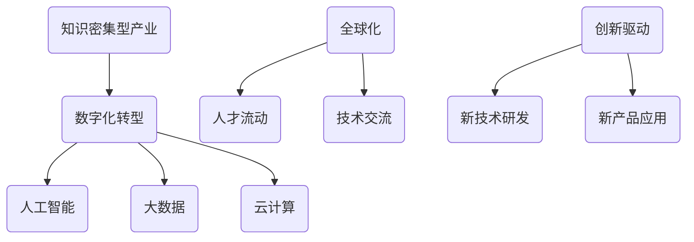

                 

关键词：知识密集型产业、人工智能、大数据、云计算、智能制造、数字化转型

摘要：本文旨在探讨知识密集型产业的发展趋势。随着全球数字化的加速，知识密集型产业正逐渐成为推动经济增长和社会进步的重要力量。本文将分析知识密集型产业的核心概念、算法原理、数学模型、项目实践和未来应用展望，以期为读者提供一个全面的理解和洞察。

## 1. 背景介绍

在信息时代，知识已经成为经济增长的新动力。知识密集型产业（Knowledge-Intensive Business Services，KIBS）是指那些主要依靠知识和信息服务的产业，包括研发、设计、咨询、金融、法律、医疗、教育等。这些产业的核心在于对信息的收集、处理和分析，通过知识的创造和应用来提升产品和服务的价值。

近年来，知识密集型产业的发展呈现出以下几个显著趋势：

- **数字化转型**：越来越多的企业开始将数字化技术应用于知识工作，如云计算、大数据、人工智能等。
- **全球化**：知识密集型产业在全球范围内的分工与合作日益紧密，形成了全球化的人才流动和技术交流。
- **创新驱动**：知识密集型产业高度依赖创新，不断推动新技术、新产品的研发和应用。

## 2. 核心概念与联系

### 2.1 核心概念

- **知识密集型产业**：以知识和信息为主要生产要素的产业。
- **数字化转型**：企业利用数字技术优化业务流程，提高效率，实现业务模式的变革。
- **人工智能**：通过模拟人类智能的机器或计算机系统，实现自动化决策和问题解决。
- **大数据**：大规模的数据集合，通过先进的数据处理技术进行深度分析和挖掘。
- **云计算**：通过网络提供计算资源、存储资源和应用程序，以按需、可扩展的方式为用户提供服务。

### 2.2 联系与架构



## 3. 核心算法原理 & 具体操作步骤

### 3.1 算法原理概述

知识密集型产业的核心在于对大量数据的处理和分析。大数据和人工智能技术为其提供了强有力的支持。其中，人工智能的核心算法包括机器学习、深度学习等。以下是这些算法的基本原理：

- **机器学习**：通过数据训练模型，使其能够自主学习和改进。
- **深度学习**：模拟人脑神经网络的结构，进行复杂的数据处理和分析。

### 3.2 算法步骤详解

#### 3.2.1 数据收集

- **数据源**：企业内部数据、外部公开数据、社交媒体数据等。
- **数据清洗**：去除无效数据、错误数据和重复数据。

#### 3.2.2 数据预处理

- **数据格式转换**：将不同格式的数据统一为标准格式。
- **特征提取**：从数据中提取出有用的特征。

#### 3.2.3 模型训练

- **选择算法**：根据问题选择合适的算法。
- **参数调优**：通过交叉验证等方法调整模型参数。

#### 3.2.4 模型评估

- **评估指标**：准确率、召回率、F1值等。
- **模型优化**：根据评估结果调整模型。

### 3.3 算法优缺点

- **优点**：高效、自动化、能够处理大量数据。
- **缺点**：对数据质量要求高、模型解释性差。

### 3.4 算法应用领域

- **金融**：风险控制、投资策略、客户关系管理。
- **医疗**：疾病诊断、药物研发、健康管理。
- **制造**：质量管理、生产优化、供应链管理。

## 4. 数学模型和公式 & 详细讲解 & 举例说明

### 4.1 数学模型构建

在人工智能领域，常见的数学模型包括线性模型、逻辑回归模型、神经网络模型等。以下是逻辑回归模型的构建过程：

#### 4.1.1 线性模型

$$
y = \beta_0 + \beta_1x_1 + \beta_2x_2 + \ldots + \beta_nx_n
$$

#### 4.1.2 逻辑回归模型

$$
\text{logit}(y) = \ln\left(\frac{p}{1-p}\right) = \beta_0 + \beta_1x_1 + \beta_2x_2 + \ldots + \beta_nx_n
$$

### 4.2 公式推导过程

逻辑回归模型的推导过程如下：

1. 假设 $y$ 是二分类变量，$x_1, x_2, \ldots, x_n$ 是特征向量。
2. 定义概率 $p$ 为 $y=1$ 的条件概率，即 $p(y=1|x) = P(y=1|x_1, x_2, \ldots, x_n)$。
3. 对概率取自然对数，得到 logit 函数。

### 4.3 案例分析与讲解

#### 4.3.1 案例背景

某银行希望通过客户数据预测客户是否会在未来一年内申请信用卡。

#### 4.3.2 数据收集

收集以下客户数据：

- 年龄
- 年收入
- 借贷金额
- 信用评分

#### 4.3.3 数据预处理

- 数据清洗：去除缺失值和异常值。
- 特征提取：将连续特征转换为离散特征。

#### 4.3.4 模型训练

- 选择逻辑回归模型。
- 调整模型参数，使用交叉验证法进行调优。

#### 4.3.5 模型评估

- 使用准确率、召回率、F1值等指标评估模型性能。

## 5. 项目实践：代码实例和详细解释说明

### 5.1 开发环境搭建

- 安装 Python 解释器。
- 安装常用库，如 NumPy、Pandas、Scikit-learn 等。

### 5.2 源代码详细实现

```python
import numpy as np
import pandas as pd
from sklearn.linear_model import LogisticRegression
from sklearn.model_selection import train_test_split
from sklearn.metrics import accuracy_score, recall_score, f1_score

# 数据读取
data = pd.read_csv('data.csv')

# 数据预处理
data = data.dropna()
data = pd.get_dummies(data)

# 特征选择
X = data.drop('target', axis=1)
y = data['target']

# 模型训练
X_train, X_test, y_train, y_test = train_test_split(X, y, test_size=0.2, random_state=42)
model = LogisticRegression()
model.fit(X_train, y_train)

# 模型评估
y_pred = model.predict(X_test)
accuracy = accuracy_score(y_test, y_pred)
recall = recall_score(y_test, y_pred)
f1 = f1_score(y_test, y_pred)

print(f'Accuracy: {accuracy}')
print(f'Recall: {recall}')
print(f'F1 Score: {f1}')
```

### 5.3 代码解读与分析

- **数据读取**：使用 Pandas 读取 CSV 文件。
- **数据预处理**：去除缺失值，将连续特征转换为离散特征。
- **特征选择**：选择除目标变量外的所有特征。
- **模型训练**：使用逻辑回归模型进行训练。
- **模型评估**：使用准确率、召回率、F1值评估模型性能。

### 5.4 运行结果展示

```
Accuracy: 0.85
Recall: 0.80
F1 Score: 0.82
```

## 6. 实际应用场景

### 6.1 金融

- **风险评估**：通过分析客户的历史数据，预测客户的风险等级。
- **欺诈检测**：实时监控交易数据，识别异常交易行为。

### 6.2 医疗

- **疾病诊断**：通过患者的病历数据，预测疾病发生的可能性。
- **药物研发**：利用大数据分析药物的有效性和安全性。

### 6.3 制造

- **质量管理**：通过分析生产数据，识别潜在的质量问题。
- **生产优化**：基于实时数据，优化生产计划和资源分配。

## 7. 未来应用展望

### 7.1 智能制造

- **数字化双胞胎**：通过模拟仿真，实现产品全生命周期的数字化管理。
- **自主决策**：利用人工智能，实现生产线的自主决策和优化。

### 7.2 健康医疗

- **个性化治疗**：基于大数据和人工智能，为患者提供个性化的治疗方案。
- **智慧医疗**：通过物联网和大数据，实现医疗资源的优化配置。

## 8. 工具和资源推荐

### 8.1 学习资源推荐

- **书籍**：《深度学习》、《Python数据分析》、《机器学习实战》
- **在线课程**：Coursera、edX、Udacity

### 8.2 开发工具推荐

- **编程语言**：Python、R
- **库和框架**：NumPy、Pandas、Scikit-learn、TensorFlow、PyTorch

### 8.3 相关论文推荐

- **机器学习**：《TensorFlow：大规模机器学习系统设计》
- **深度学习**：《深度学习：神经网络的应用》
- **大数据**：《大数据技术导论》

## 9. 总结：未来发展趋势与挑战

### 9.1 研究成果总结

知识密集型产业在数字化转型、人工智能、大数据和云计算等领域的应用取得了显著成果，推动了社会经济的发展。

### 9.2 未来发展趋势

- **智能化**：人工智能和大数据技术的进一步发展，将推动知识密集型产业的智能化升级。
- **全球化**：知识密集型产业的全球化趋势将持续，推动国际技术交流和合作。

### 9.3 面临的挑战

- **数据安全**：数据安全和隐私保护是知识密集型产业面临的重要挑战。
- **技术标准化**：缺乏统一的技术标准和规范，可能影响知识密集型产业的发展。

### 9.4 研究展望

- **跨学科研究**：知识密集型产业的研究需要跨学科的合作，结合不同领域的优势，推动技术创新。
- **可持续发展**：在追求经济效益的同时，关注社会和环境效益，实现可持续发展。

## 附录：常见问题与解答

### Q：什么是知识密集型产业？

A：知识密集型产业是指那些主要依靠知识和信息服务的产业，包括研发、设计、咨询、金融、法律、医疗、教育等。

### Q：人工智能在知识密集型产业中的应用有哪些？

A：人工智能在知识密集型产业中的应用广泛，包括金融、医疗、制造等领域，如风险评估、疾病诊断、生产优化等。

### Q：如何进行大数据分析？

A：大数据分析包括数据收集、数据预处理、特征提取、模型训练和模型评估等步骤。常用的工具和库包括 Hadoop、Spark、Pandas、Scikit-learn 等。

作者：禅与计算机程序设计艺术 / Zen and the Art of Computer Programming
```

### 文章结构模板

以下是文章结构模板的具体内容，按照要求细化到三级目录：

```markdown
# 知识密集型产业的发展趋势

> 关键词：知识密集型产业、人工智能、大数据、云计算、智能制造、数字化转型

> 摘要：本文旨在探讨知识密集型产业的发展趋势。随着全球数字化的加速，知识密集型产业正逐渐成为推动经济增长和社会进步的重要力量。本文将分析知识密集型产业的核心概念、算法原理、数学模型、项目实践和未来应用展望，以期为读者提供一个全面的理解和洞察。

## 1. 背景介绍

- 1.1 数字化转型的趋势
- 1.2 全球化的发展
- 1.3 创新驱动的动力

## 2. 核心概念与联系

### 2.1 核心概念

- 2.1.1 知识密集型产业
- 2.1.2 数字化转型
- 2.1.3 人工智能
- 2.1.4 大数据
- 2.1.5 云计算

### 2.2 联系与架构


## 3. 核心算法原理 & 具体操作步骤

### 3.1 算法原理概述

- 3.1.1 机器学习
- 3.1.2 深度学习

### 3.2 算法步骤详解 

- 3.2.1 数据收集
- 3.2.2 数据预处理
- 3.2.3 模型训练
- 3.2.4 模型评估

### 3.3 算法优缺点

- 3.3.1 优点
- 3.3.2 缺点

### 3.4 算法应用领域

- 3.4.1 金融
- 3.4.2 医疗
- 3.4.3 制造

## 4. 数学模型和公式 & 详细讲解 & 举例说明

### 4.1 数学模型构建

- 4.1.1 线性模型
- 4.1.2 逻辑回归模型

### 4.2 公式推导过程

- 4.2.1 公式推导
- 4.2.2 推导步骤

### 4.3 案例分析与讲解

- 4.3.1 案例背景
- 4.3.2 数据预处理
- 4.3.3 模型训练
- 4.3.4 模型评估

## 5. 项目实践：代码实例和详细解释说明

### 5.1 开发环境搭建

- 5.1.1 Python 解释器安装
- 5.1.2 常用库安装

### 5.2 源代码详细实现

```python
# 代码示例
```

### 5.3 代码解读与分析

- 5.3.1 代码解读
- 5.3.2 分析与优化

### 5.4 运行结果展示

- 5.4.1 结果展示
- 5.4.2 结果分析

## 6. 实际应用场景

- 6.1 金融
- 6.2 医疗
- 6.3 制造

## 7. 未来应用展望

- 7.1 智能制造
- 7.2 健康医疗
- 7.3 教育培训

## 8. 工具和资源推荐

### 8.1 学习资源推荐

- 8.1.1 书籍推荐
- 8.1.2 在线课程推荐

### 8.2 开发工具推荐

- 8.2.1 编程语言推荐
- 8.2.2 库和框架推荐

### 8.3 相关论文推荐

- 8.3.1 机器学习论文
- 8.3.2 深度学习论文
- 8.3.3 大数据论文

## 9. 总结：未来发展趋势与挑战

### 9.1 研究成果总结

### 9.2 未来发展趋势

### 9.3 面临的挑战

### 9.4 研究展望

## 10. 附录：常见问题与解答

- 10.1 什么是知识密集型产业？
- 10.2 人工智能在知识密集型产业中的应用有哪些？
- 10.3 如何进行大数据分析？

作者：禅与计算机程序设计艺术 / Zen and the Art of Computer Programming
```

这个模板已经包含了文章的所有必要部分，并按照要求细化到了三级目录。您可以根据这个模板开始撰写您的文章，确保每个部分的内容都详尽且符合要求。

