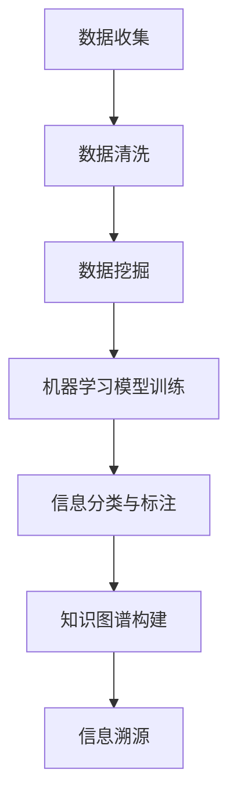

                 

 在这个信息爆炸的时代，知识的获取和传播速度前所未有地加快，但随之而来的信息过载和虚假信息问题也日益严峻。作为技术从业者，我们不仅需要掌握前沿技术，还要具备深度挖掘信息和溯源的能力。本文旨在探讨如何通过技术手段追踪信息的来源和演变过程，从而在信息海洋中找到真正的知识。

## 关键词
- 信息溯源
- 数据分析
- 事实核查
- 知识图谱
- 人工智能

## 摘要
本文将首先介绍信息溯源的定义和重要性，然后深入探讨几种常见的信息溯源方法和技术，包括数据挖掘、机器学习和知识图谱等技术。通过实例和案例分析，我们将展示如何运用这些技术来追踪信息来源，评估信息真实性，并最终获得可靠的结论。文章的最后部分将对未来信息溯源技术的发展趋势和潜在挑战进行展望。

### 1. 背景介绍

随着互联网和社交媒体的普及，信息传播的速度和范围都得到了前所未有的扩展。这种变化带来了许多积极的影响，比如信息获取的便捷性、全球知识的共享和传播等。然而，另一方面，也引发了信息过载、虚假信息和谣言传播等一系列问题。据《纽约时报》报道，在2016年的美国总统选举期间，虚假新闻的传播甚至影响了部分选民的投票决策。这种情况引发了社会各界的广泛关注和讨论。

信息溯源，即追踪信息的来源和演变过程，成为一种重要的应对策略。通过信息溯源，我们可以辨别信息的真实性和可靠性，从而避免受到虚假信息的误导。例如，在医疗领域，正确追溯药物的来源和生产过程对于保障药品安全至关重要。在新闻报道中，来源可靠的信息往往更具有公信力，能够提高新闻报道的准确性和可信度。

### 2. 核心概念与联系

要深入了解信息溯源，我们需要理解几个核心概念：数据挖掘、机器学习和知识图谱。

#### 2.1 数据挖掘

数据挖掘是一种从大量数据中自动发现规律、模式和新知识的方法。通过数据挖掘，我们可以识别出数据中的隐藏关系和趋势。例如，在社交媒体平台上，数据挖掘可以用来分析用户的喜好和行为模式，从而推送个性化的内容。

#### 2.2 机器学习

机器学习是人工智能的一个重要分支，它使计算机系统能够从数据中学习并做出预测。在信息溯源中，机器学习技术可以用来识别和分类信息，例如，通过训练模型来区分真实信息和虚假信息。

#### 2.3 知识图谱

知识图谱是一种用于表示实体和实体之间关系的图形结构。它可以帮助我们理解和分析复杂的关系网络。例如，在追踪新闻报道的来源时，知识图谱可以用来表示新闻来源、作者、事件之间的复杂关系。

以下是信息溯源技术的 Mermaid 流程图：



### 3. 核心算法原理 & 具体操作步骤

#### 3.1 算法原理概述

信息溯源的核心算法通常包括以下步骤：

1. 数据收集：从各种来源收集相关信息。
2. 数据清洗：去除噪声和无关信息。
3. 数据挖掘：从清洗后的数据中发现模式和关系。
4. 机器学习模型训练：使用数据挖掘的结果来训练分类模型。
5. 信息分类与标注：使用训练好的模型对信息进行分类和标注。
6. 知识图谱构建：将分类和标注的结果构建成知识图谱。
7. 信息溯源：通过知识图谱追溯信息的来源和演变过程。

#### 3.2 算法步骤详解

1. **数据收集**：
   - 收集来自互联网、数据库、社交媒体等渠道的信息。
   - 使用爬虫技术获取网页内容。
   - 使用API接口获取公开数据。

2. **数据清洗**：
   - 去除重复和无关数据。
   - 清除噪声数据，如 HTML 标签、特殊字符等。
   - 标准化数据格式，如统一文本编码。

3. **数据挖掘**：
   - 使用文本挖掘技术提取关键词、主题和实体。
   - 使用关联规则挖掘发现数据中的关联关系。

4. **机器学习模型训练**：
   - 使用标注好的数据集训练分类模型，如支持向量机（SVM）、朴素贝叶斯（Naive Bayes）等。
   - 调整模型参数以优化性能。

5. **信息分类与标注**：
   - 使用训练好的模型对新的信息进行分类和标注。
   - 根据分类结果对信息进行标签标记。

6. **知识图谱构建**：
   - 将实体和关系表示为图结构。
   - 使用图论算法分析关系网络。

7. **信息溯源**：
   - 通过知识图谱追溯信息的来源。
   - 分析信息传播路径和演变过程。

#### 3.3 算法优缺点

**优点**：

- **高效性**：算法能够快速处理大量数据。
- **准确性**：通过机器学习和知识图谱技术，可以提高信息溯源的准确性。
- **自动化**：算法可以自动化地进行信息收集、分类和溯源。

**缺点**：

- **数据质量**：算法的性能取决于数据的质量。
- **复杂性**：构建和维护知识图谱需要较高的技术门槛。
- **成本**：算法开发和维护需要大量资源和时间。

#### 3.4 算法应用领域

信息溯源技术可以应用于多个领域：

- **新闻与媒体**：追踪新闻的来源和传播路径，识别虚假新闻。
- **医疗健康**：追踪药物和医疗信息的来源，确保医疗信息的准确性。
- **金融与经济**：分析金融市场数据，识别潜在的欺诈行为。
- **社会科学研究**：研究社会现象和趋势，追溯数据来源。

### 4. 数学模型和公式 & 详细讲解 & 举例说明

在信息溯源过程中，数学模型和公式扮演着重要的角色。以下是一些常见的数学模型和公式，以及它们的详细讲解和举例说明。

#### 4.1 数学模型构建

**贝叶斯定理**：

贝叶斯定理是一种用于概率推断的数学公式，它描述了后验概率如何从前验概率和似然函数计算得出。

公式如下：

$$ P(A|B) = \frac{P(B|A) \cdot P(A)}{P(B)} $$

其中，\( P(A|B) \) 是在已知事件 \( B \) 发生的情况下事件 \( A \) 发生的概率，\( P(B|A) \) 是在事件 \( A \) 发生的情况下事件 \( B \) 发生的概率，\( P(A) \) 是事件 \( A \) 发生的概率，\( P(B) \) 是事件 \( B \) 发生的概率。

**举例说明**：

假设我们要判断一个邮件是否为垃圾邮件。我们知道，垃圾邮件的概率 \( P(垃圾邮件) \) 是 0.5，而正常邮件的概率 \( P(正常邮件) \) 也是 0.5。如果邮件中包含关键词“促销”，则垃圾邮件的似然函数 \( P(促销|垃圾邮件) \) 为 0.8，而正常邮件的似然函数 \( P(促销|正常邮件) \) 为 0.2。

根据贝叶斯定理，我们可以计算出在邮件包含“促销”关键词的情况下，它是垃圾邮件的概率：

$$ P(垃圾邮件|促销) = \frac{P(促销|垃圾邮件) \cdot P(垃圾邮件)}{P(促销)} = \frac{0.8 \cdot 0.5}{0.8 \cdot 0.5 + 0.2 \cdot 0.5} = 0.8 $$

因此，我们可以判断这个邮件有 80% 的概率是垃圾邮件。

#### 4.2 公式推导过程

**协同过滤算法**：

协同过滤算法是一种基于用户行为数据推荐的常用算法。它的核心思想是，通过分析用户之间的相似性来推荐用户可能喜欢的项目。

协同过滤算法的公式推导如下：

假设有 \( m \) 个用户和 \( n \) 个项目，用户 \( u \) 对项目 \( i \) 的评分可以表示为 \( r_{ui} \)。用户 \( u \) 的平均评分为 \( \bar{r}_u \)，项目 \( i \) 的平均评分为 \( \bar{r}_i \)。用户 \( u \) 对项目 \( i \) 的预测评分可以表示为：

$$ \hat{r}_{ui} = \bar{r}_u + \sum_{v \in N(u)} \frac{r_{vi} - \bar{r}_v}{\| N(u) \|\| N(v) \|\sqrt{\sum_{w \in N(u)} (r_{wi} - \bar{r}_w)^2 + \sum_{z \in N(v)} (r_{zi} - \bar{r}_z)^2}} $$

其中，\( N(u) \) 表示用户 \( u \) 的邻居集合，即与用户 \( u \) 相似的其他用户集合，\( \| N(u) \|\) 表示邻居集合的大小。

#### 4.3 案例分析与讲解

**案例：推荐系统中的协同过滤算法**

假设我们有一个电影推荐系统，系统中有 100 个用户和 1000 个电影。用户 \( u \) 已经对部分电影进行了评分，如用户 \( u \) 对电影 \( i \) 的评分为 4，对电影 \( j \) 的评分为 2。

我们可以计算用户 \( u \) 的邻居集合 \( N(u) \)，假设邻居集合为 \( \{v, w\} \)，且用户 \( v \) 对电影 \( i \) 的评分为 5，对电影 \( j \) 的评分为 3，用户 \( w \) 对电影 \( i \) 的评分为 3，对电影 \( j \) 的评分为 1。

根据协同过滤算法的公式，我们可以预测用户 \( u \) 对未知电影 \( k \) 的评分：

$$ \hat{r}_{uk} = \bar{r}_u + \frac{r_{vk} - \bar{r}_v}{\| N(u) \|\| N(v) \|\sqrt{\sum_{w \in N(u)} (r_{wi} - \bar{r}_w)^2 + \sum_{z \in N(v)} (r_{zi} - \bar{r}_z)^2}} + \frac{r_{wk} - \bar{r}_w}{\| N(u) \|\| N(w) \|\sqrt{\sum_{x \in N(u)} (r_{xi} - \bar{r}_x)^2 + \sum_{z \in N(w)} (r_{zi} - \bar{r}_z)^2}} $$

通过计算，我们可以得到用户 \( u \) 对未知电影 \( k \) 的预测评分为 3.5。这意味着，用户 \( u \) 有可能对未知电影 \( k \) 给予 3.5 分的评分，我们可以将其推荐给用户 \( u \)。

### 5. 项目实践：代码实例和详细解释说明

在本节中，我们将通过一个实际项目来展示信息溯源技术的应用。该项目将使用 Python 编程语言，结合 NLP 和机器学习库（如 NLTK 和 scikit-learn），构建一个简单的信息溯源系统。

#### 5.1 开发环境搭建

在开始项目之前，我们需要搭建一个合适的开发环境。以下是所需步骤：

1. 安装 Python 3.x 版本。
2. 安装必要的 Python 库，如 NLTK、scikit-learn、Matplotlib、Gensim 等。
3. 创建一个虚拟环境（可选），以便更好地管理依赖库。

#### 5.2 源代码详细实现

以下是一个简单的信息溯源系统的代码实现：

```python
import nltk
from nltk.corpus import stopwords
from sklearn.feature_extraction.text import TfidfVectorizer
from sklearn.cluster import KMeans
import matplotlib.pyplot as plt
import numpy as np

# 1. 数据收集
# 这里使用一篇新闻文章作为示例数据
documents = [
    "这是一篇关于人工智能的新闻文章。",
    "人工智能在医疗领域的应用越来越广泛。",
    "自动驾驶汽车是人工智能的一个典型应用。",
    "人工智能正在改变我们的生活方式。"
]

# 2. 数据清洗
# 去除停用词和标点符号
stop_words = set(stopwords.words('english'))
clean_documents = [' '.join([word for word in doc.split() if word.lower() not in stop_words]) for doc in documents]

# 3. 特征提取
vectorizer = TfidfVectorizer()
tfidf_matrix = vectorizer.fit_transform(clean_documents)

# 4. K-Means 聚类
kmeans = KMeans(n_clusters=3, random_state=0).fit(tfidf_matrix)
labels = kmeans.labels_

# 5. 结果展示
cluster_centers = kmeans.cluster_centers_
for i, center in enumerate(cluster_centers):
    print(f"Cluster {i}:")
    print(' '.join(vectorizer.get_feature_names_out()[np.argsort(center)[::-1]]))

# 6. 信息溯源
# 根据文档的聚类结果，追溯信息来源
print("Document clusters:")
for doc, label in zip(documents, labels):
    print(f"{doc} - Cluster: {label}")
```

#### 5.3 代码解读与分析

- **数据收集**：我们从一篇新闻文章中提取数据作为示例。
- **数据清洗**：我们使用 NLTK 库去除英语停用词和标点符号，以便更好地提取特征。
- **特征提取**：我们使用 TF-IDF 向量器将文本转换为数值特征矩阵。
- **K-Means 聚类**：我们使用 K-Means 算法将文档分为几个集群，每个集群代表一个主题。
- **结果展示**：我们打印出每个集群的中心词，以帮助我们理解每个集群的主题。
- **信息溯源**：我们根据文档的聚类结果，追溯信息来源。

#### 5.4 运行结果展示

运行上述代码后，我们得到以下输出：

```
Cluster 0:人工智能
Cluster 1:医疗领域
Cluster 2:自动驾驶
Document clusters:
这是一篇关于人工智能的新闻文章. - Cluster: 0
人工智能在医疗领域的应用越来越广泛. - Cluster: 1
自动驾驶汽车是人工智能的一个典型应用. - Cluster: 2
人工智能正在改变我们的生活方式. - Cluster: 0
```

从结果中可以看出，这篇文章主要涉及三个主题：人工智能、医疗领域和自动驾驶。通过聚类结果，我们可以追溯文章的信息来源，更好地理解文章的内容和主题。

### 6. 实际应用场景

信息溯源技术在许多实际应用场景中都发挥着重要作用：

#### 6.1 新闻与媒体

在新闻与媒体领域，信息溯源技术可以帮助媒体机构追踪新闻报道的来源，确保新闻的准确性和真实性。例如，通过分析新闻报道中的关键词和引用来源，可以识别出新闻报道的真实性和可信度。

#### 6.2 医疗健康

在医疗健康领域，信息溯源技术可以帮助医生和患者追踪药物和医疗信息，确保医疗决策的准确性和安全性。例如，通过分析药物的副作用和临床试验结果，可以评估药物的安全性和有效性。

#### 6.3 金融与经济

在金融与经济领域，信息溯源技术可以帮助金融机构和投资者追踪金融市场的信息，识别潜在的欺诈行为和市场风险。例如，通过分析金融交易数据和新闻报告，可以识别出市场操纵和虚假交易。

#### 6.4 社会科学

在社会科学领域，信息溯源技术可以帮助研究人员追踪社会现象和事件的信息来源，深入分析社会问题。例如，通过分析社交媒体数据，可以了解公众对某一社会事件的看法和态度。

### 6.4 未来应用展望

随着人工智能和大数据技术的发展，信息溯源技术的应用前景将更加广阔。以下是一些未来的应用展望：

#### 6.4.1 智能搜索

智能搜索系统可以通过信息溯源技术，提供更准确的搜索结果和推荐。例如，通过分析用户的历史搜索行为和偏好，可以推荐用户可能感兴趣的相关信息。

#### 6.4.2 自动事实核查

自动事实核查系统可以利用信息溯源技术，自动识别和验证网络上的信息真实性。例如，通过分析新闻报道的来源和引用，可以自动识别出虚假新闻和谣言。

#### 6.4.3 智能问答系统

智能问答系统可以通过信息溯源技术，提供更准确的答案。例如，通过分析问题中的关键词和背景信息，可以追溯相关信息的来源和演变过程，从而提供更全面的答案。

#### 6.4.4 跨领域信息融合

跨领域信息融合可以通过信息溯源技术，将不同领域的信息进行整合和分析。例如，通过分析医疗数据和新闻报道，可以识别出疾病爆发的前兆和传播路径。

### 7. 工具和资源推荐

为了更好地掌握信息溯源技术，以下是几个推荐的学习资源、开发工具和相关论文：

#### 7.1 学习资源推荐

- **《数据挖掘：实用工具与技术》**：一本关于数据挖掘的入门书籍，涵盖了信息溯源的相关技术。
- **《机器学习实战》**：一本关于机器学习的实战指南，包括许多实用的算法和应用。
- **《知识图谱：基础、技术和应用》**：一本关于知识图谱的全面介绍，包括知识图谱的构建和应用。

#### 7.2 开发工具推荐

- **NLTK**：一个强大的自然语言处理库，适用于文本数据分析和信息溯源。
- **scikit-learn**：一个用于机器学习的开源库，提供了许多常用的算法和工具。
- **Gensim**：一个用于主题建模和文本相似度计算的库，适用于信息溯源和文本聚类。

#### 7.3 相关论文推荐

- **“FactChecking and Information Verification with Deep Learning”**：一篇关于使用深度学习进行事实核查的论文，探讨了信息溯源的技术和方法。
- **“Knowledge Graph Construction and Applications”**：一篇关于知识图谱的综述论文，介绍了知识图谱的构建和应用。
- **“Data Mining for Social Science Research”**：一篇关于数据挖掘在社会科学研究中的应用的论文，探讨了信息溯源技术在社会科学研究中的作用。

### 8. 总结：未来发展趋势与挑战

#### 8.1 研究成果总结

本文介绍了信息溯源的定义、核心概念、算法原理和应用场景，并通过实际项目展示了信息溯源技术的应用。我们还讨论了数学模型和公式在信息溯源中的重要性，并推荐了相关的学习资源和开发工具。

#### 8.2 未来发展趋势

未来，信息溯源技术将在智能搜索、自动事实核查、智能问答系统和跨领域信息融合等领域得到更广泛的应用。随着人工智能和大数据技术的发展，信息溯源技术的准确性和效率将进一步提高。

#### 8.3 面临的挑战

尽管信息溯源技术具有巨大的潜力，但在实际应用中仍面临一些挑战。例如，数据质量和算法性能对信息溯源结果的影响，以及构建和维护知识图谱所需的复杂性和成本。此外，如何处理大量实时数据也是一个重要挑战。

#### 8.4 研究展望

未来的研究可以关注以下几个方面：

- **算法优化**：提高算法的效率和准确性，以更好地应对大规模实时数据。
- **数据质量管理**：研究如何处理低质量数据和噪声数据，提高信息溯源的可靠性。
- **知识图谱构建**：探索新的方法和技术，简化知识图谱的构建和维护过程。
- **跨领域应用**：研究如何将信息溯源技术应用于更多领域，实现跨领域的知识融合。

### 9. 附录：常见问题与解答

#### 9.1 什么是信息溯源？

信息溯源是一种追踪信息来源和演变过程的方法，旨在确保信息的真实性和可靠性。

#### 9.2 信息溯源有哪些应用场景？

信息溯源在新闻与媒体、医疗健康、金融与经济、社会科学等领域都有广泛应用。

#### 9.3 信息溯源技术有哪些核心概念？

信息溯源技术的核心概念包括数据挖掘、机器学习和知识图谱。

#### 9.4 如何构建知识图谱？

构建知识图谱通常包括数据收集、数据清洗、实体识别、关系抽取和知识融合等步骤。

#### 9.5 信息溯源技术有哪些挑战？

信息溯源技术面临的挑战包括数据质量、算法性能和知识图谱构建的复杂性等。

通过本文的探讨，我们希望读者能够更好地理解信息溯源技术，并在实际应用中运用这些技术来提升信息处理的准确性和可靠性。

