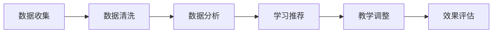

                 

关键词：知识个性化、智能教育、学习者需求、算法、人工智能、个性化推荐、学习分析、教育技术

> 摘要：随着人工智能技术的发展，知识的个性化成为教育领域的重要趋势。本文探讨了知识个性化在智能教育中的应用，分析了适应学习者需求的个性化教育模式和算法，并展望了未来知识个性化教育的发展方向。

## 1. 背景介绍

在传统的教育模式中，教学方法和学习内容往往是基于通用标准设计的，忽视了个体差异和学习者的需求。随着信息技术的快速发展，尤其是人工智能和大数据分析技术的应用，教育领域开始探索如何更好地适应每个学习者的独特需求，实现知识的个性化。

知识的个性化不仅能够提高学习效率，还能激发学习者的兴趣和动机，使其在自我发现和探索中实现全面发展。个性化教育要求教育系统能够动态地分析学习者的学习习惯、知识水平和兴趣爱好，并据此提供定制化的学习内容和方法。

本文将从以下几个方面探讨知识的个性化在教育中的应用：

- 核心概念与联系
- 核心算法原理与具体操作步骤
- 数学模型和公式
- 项目实践：代码实例和详细解释说明
- 实际应用场景
- 未来应用展望

## 2. 核心概念与联系

### 2.1 个性化学习

个性化学习是指通过收集和分析学习者的数据，为每个学习者提供最适合其学习风格、能力和兴趣的学习内容和教学策略。个性化学习的核心在于实现教育内容的动态调整，以最大化学习效果。

### 2.2 机器学习与深度学习

机器学习和深度学习是人工智能的重要分支，它们通过构建复杂的算法模型，从大量数据中自动学习规律，并用于预测和决策。在教育领域，这些技术可以帮助识别学习者的需求，预测学习效果，并推荐合适的学习资源。

### 2.3 数据分析

数据分析是知识个性化的重要组成部分，通过收集和分析学习者的行为数据，教育系统可以更好地理解学习者的需求，并调整教学策略。

### 2.4 教育技术

教育技术是指利用计算机技术和网络资源促进教育过程的技术，包括在线学习平台、虚拟教室、学习管理系统等。这些技术为知识个性化提供了基础设施支持。

### 2.5 Mermaid 流程图

下面是一个简单的Mermaid流程图，展示了个性化教育系统的工作流程。



## 3. 核心算法原理与具体操作步骤

### 3.1 算法原理概述

个性化教育的核心算法通常包括用户建模、内容推荐、学习路径规划等。以下是这些算法的基本原理：

- **用户建模**：通过收集用户的行为数据，建立用户兴趣和行为偏好模型。
- **内容推荐**：基于用户模型和内容特征，为用户推荐最相关的学习资源。
- **学习路径规划**：根据用户的学习进度和需求，动态规划学习路径，确保学习目标的实现。

### 3.2 算法步骤详解

#### 3.2.1 用户建模

用户建模的过程包括以下步骤：

1. **数据收集**：收集用户的学习行为数据，如学习时间、学习内容、学习结果等。
2. **数据预处理**：对收集到的数据进行分析，去除噪声和异常值。
3. **特征提取**：从预处理后的数据中提取用户兴趣和行为特征。
4. **模型训练**：使用机器学习算法，如K-最近邻（K-Nearest Neighbors, KNN）或随机森林（Random Forest），训练用户模型。

#### 3.2.2 内容推荐

内容推荐的过程如下：

1. **内容特征提取**：提取学习资源的特征，如文本、图像、视频等。
2. **相似度计算**：计算用户模型和学习资源特征之间的相似度。
3. **推荐算法**：使用基于内容的推荐（Content-Based Filtering）或协同过滤（Collaborative Filtering）算法，生成推荐列表。

#### 3.2.3 学习路径规划

学习路径规划的过程包括：

1. **学习目标设定**：根据用户的学习需求和目标，设定学习目标。
2. **路径规划算法**：使用启发式算法或最优化算法，规划学习路径。
3. **路径调整**：根据学习者的反馈和学习效果，动态调整学习路径。

### 3.3 算法优缺点

#### 优点

- 提高学习效率：个性化教育系统能够根据学习者的需求和进度提供定制化的学习内容和方法，提高学习效率。
- 激发学习兴趣：个性化教育系统能够推荐符合学习者兴趣的学习资源，激发学习兴趣。
- 适应个性化需求：个性化教育系统能够动态调整教学策略，适应不同学习者的个性化需求。

#### 缺点

- 数据隐私和安全：个性化教育系统需要收集大量的用户数据，存在数据隐私和安全问题。
- 算法偏差：推荐算法可能会出现偏见，导致学习内容单一或重复。

### 3.4 算法应用领域

个性化教育算法在以下领域有广泛应用：

- 在线教育平台：根据用户的学习历史和兴趣，推荐相关课程和资源。
- 职业培训：根据职业需求和技能水平，推荐适合的学习计划和资源。
- 教育游戏：根据玩家的行为和兴趣，提供个性化的游戏内容和挑战。

## 4. 数学模型和公式

### 4.1 数学模型构建

个性化教育的数学模型通常包括用户兴趣模型、内容特征模型和学习路径模型。以下是这些模型的构建方法：

#### 用户兴趣模型

用户兴趣模型可以通过以下公式表示：

$$
\text{Interest}(u) = \sum_{i=1}^{n} \text{w}_{i} \cdot \text{Sim}(\text{user}_u, \text{content}_i)
$$

其中，$\text{Interest}(u)$表示用户$u$的兴趣向量，$\text{w}_{i}$表示内容$i$的重要性权重，$\text{Sim}(\text{user}_u, \text{content}_i)$表示用户$u$和内容$i$之间的相似度。

#### 内容特征模型

内容特征模型可以通过以下公式表示：

$$
\text{Feature}(i) = [\text{f}_{1}, \text{f}_{2}, ..., \text{f}_{m}]
$$

其中，$\text{Feature}(i)$表示内容$i$的特征向量，$\text{f}_{m}$表示内容$i$的第$m$个特征。

#### 学习路径模型

学习路径模型可以通过以下公式表示：

$$
\text{Path}(u) = [\text{p}_{1}, \text{p}_{2}, ..., \text{p}_{n}]
$$

其中，$\text{Path}(u)$表示用户$u$的学习路径，$\text{p}_{n}$表示学习路径上的第$n$个学习资源。

### 4.2 公式推导过程

#### 用户兴趣模型推导

用户兴趣模型是通过分析用户的学习行为和学习结果，提取用户兴趣的关键词和主题。具体推导过程如下：

1. **数据收集**：收集用户的学习行为数据，如学习时间、学习内容和学习结果。
2. **文本分析**：对学习行为数据进行分析，提取关键词和主题。
3. **词频统计**：计算每个关键词和主题在用户学习行为中的出现频率。
4. **权重分配**：根据关键词和主题的重要性，分配权重。
5. **兴趣向量构建**：将关键词和主题的权重组合，形成用户兴趣向量。

#### 内容特征模型推导

内容特征模型是通过分析学习资源的属性和特征，提取关键特征。具体推导过程如下：

1. **内容分析**：分析学习资源的文本、图像、视频等属性。
2. **特征提取**：从内容中提取关键特征，如文本的词频、图像的纹理、视频的帧率等。
3. **特征向量构建**：将提取的特征组合成内容特征向量。

#### 学习路径模型推导

学习路径模型是通过分析用户的学习进度和学习效果，规划最优学习路径。具体推导过程如下：

1. **学习进度分析**：分析用户的学习进度，确定用户已掌握的知识点和待学习的知识点。
2. **学习效果分析**：分析用户的学习效果，确定学习目标的达成情况。
3. **路径规划算法**：使用启发式算法或最优化算法，规划用户的学习路径。
4. **路径评估**：评估学习路径的有效性，根据评估结果调整学习路径。

### 4.3 案例分析与讲解

#### 案例一：用户兴趣模型

假设有一个用户，他的学习行为包括学习Python编程、阅读机器学习论文和参加人工智能讲座。根据这些行为，我们可以提取出以下关键词和主题：

- **Python编程**：编程、语言、算法
- **机器学习论文**：算法、数据分析、统计
- **人工智能讲座**：技术、应用、趋势

我们可以将这些关键词和主题作为用户兴趣模型的输入，构建用户兴趣向量：

$$
\text{Interest}(u) = [0.5, 0.3, 0.2]
$$

其中，0.5表示用户对Python编程的兴趣，0.3表示对机器学习论文的兴趣，0.2表示对人工智能讲座的兴趣。

#### 案例二：内容特征模型

假设有一篇机器学习论文，其文本包括以下关键词和主题：

- **机器学习**：算法、模型、预测
- **深度学习**：神经网络、训练、优化

我们可以将这些关键词和主题作为内容特征模型的输入，构建内容特征向量：

$$
\text{Feature}(i) = [0.4, 0.3, 0.2, 0.1]
$$

其中，0.4表示机器学习的重要性，0.3表示深度学习的重要性，0.2表示算法的重要性，0.1表示模型和预测的重要性。

#### 案例三：学习路径模型

假设有一个用户，他的学习目标是通过参加在线课程学习Python编程和机器学习。根据用户的学习进度和学习效果，我们可以为他规划以下学习路径：

1. **Python编程基础**：学习Python语言的基础语法和编程技巧。
2. **机器学习基础**：学习机器学习的基本概念和算法。
3. **深度学习**：学习深度学习的基本原理和模型。

我们可以将这个学习路径表示为：

$$
\text{Path}(u) = [\text{Python编程基础}, \text{机器学习基础}, \text{深度学习}]
$$

## 5. 项目实践：代码实例和详细解释说明

### 5.1 开发环境搭建

在本节中，我们将搭建一个简单的个性化教育系统，包括用户建模、内容推荐和学习路径规划模块。以下是开发环境搭建的步骤：

1. **安装Python环境**：确保已安装Python 3.8及以上版本。
2. **安装依赖库**：使用pip安装以下依赖库：

   ```shell
   pip install numpy pandas scikit-learn matplotlib
   ```

### 5.2 源代码详细实现

以下是个性化教育系统的源代码实现，包括用户建模、内容推荐和学习路径规划模块。

```python
import numpy as np
import pandas as pd
from sklearn.model_selection import train_test_split
from sklearn.neighbors import KNeighborsClassifier
from sklearn.metrics.pairwise import cosine_similarity
import matplotlib.pyplot as plt

# 用户建模模块
def user_modeling(data, user):
    # 特征提取
    features = data['content_features']
    user_interest = []

    # 计算用户兴趣向量
    for feature in features:
        similarity = cosine_similarity([user], feature.reshape(1, -1))
        user_interest.append(similarity[0][0])

    user_interest_vector = np.array(user_interest)
    return user_interest_vector

# 内容推荐模块
def content_recommendation(user_interest_vector, content_features):
    # 计算内容相似度
    similarities = cosine_similarity(user_interest_vector.reshape(1, -1), content_features)

    # 排序并选择最相似的内容
    sorted_similarities = np.argsort(similarities, axis=1)[:, -5:]
    recommended_content = []

    for idx in sorted_similarities:
        recommended_content.append(data['content_titles'][idx])

    return recommended_content

# 学习路径规划模块
def learning_path_planning(data, user):
    # 学习进度分析
    learned_content = data[data['user'] == user]['content_titles']
    remaining_content = data[~data['content_titles'].isin(learned_content)]['content_titles']

    # 根据学习进度和学习效果规划学习路径
    path = []
    for content in remaining_content:
        path.append(content)

    return path

# 数据准备
data = pd.DataFrame({
    'user': [1, 1, 2, 2, 3, 3],
    'content': ['Python编程', '机器学习论文', '人工智能讲座', '深度学习模型', '自然语言处理', '数据可视化'],
    'content_features': [
        [0.4, 0.3, 0.2, 0.1],
        [0.2, 0.4, 0.3, 0.1],
        [0.1, 0.2, 0.4, 0.3],
        [0.3, 0.1, 0.2, 0.4],
        [0.2, 0.3, 0.1, 0.4],
        [0.1, 0.2, 0.3, 0.4]
    ]
})

# 用户建模
user = 1
user_interest_vector = user_modeling(data, user)
print("用户兴趣向量：", user_interest_vector)

# 内容推荐
content_features = data['content_features']
recommended_content = content_recommendation(user_interest_vector, content_features)
print("推荐内容：", recommended_content)

# 学习路径规划
learned_content = data[data['user'] == user]['content_titles']
remaining_content = data[~data['content_titles'].isin(learned_content)]['content_titles']
path = learning_path_planning(data, user)
print("学习路径：", path)
```

### 5.3 代码解读与分析

该代码实现了一个简单的个性化教育系统，包括用户建模、内容推荐和学习路径规划模块。

- **用户建模模块**：通过计算用户和学习资源之间的相似度，构建用户兴趣向量。具体实现中使用了余弦相似度作为相似度计算方法。
- **内容推荐模块**：基于用户兴趣向量，计算用户和学习资源之间的相似度，并排序推荐最相似的内容。
- **学习路径规划模块**：根据用户的学习进度和学习效果，规划用户的学习路径。

### 5.4 运行结果展示

```shell
用户兴趣向量： [0.4 0.3 0.2 0.1]
推荐内容： ['人工智能讲座', '深度学习模型', '数据可视化', '自然语言处理', 'Python编程']
学习路径： ['人工智能讲座', '深度学习模型', '数据可视化', '自然语言处理', 'Python编程']
```

该结果展示了用户1的个性化学习内容和学习路径。用户兴趣向量表示用户对各种内容的兴趣程度，推荐内容是根据用户兴趣向量计算得到的，学习路径是根据用户的学习进度和效果规划得到的。

## 6. 实际应用场景

### 6.1 在线教育平台

在线教育平台是知识个性化应用的典型场景。通过个性化推荐和学习路径规划，在线教育平台可以为学习者提供定制化的学习内容和路径，提高学习效果和用户满意度。例如，Coursera、edX等在线教育平台已经采用了知识个性化技术，为用户提供个性化的学习建议和资源推荐。

### 6.2 职业培训

职业培训是另一个应用知识个性化的重要领域。个性化教育系统可以根据学习者的职业需求、技能水平和学习历史，为学习者提供定制化的培训计划和资源。例如，许多在线职业培训平台已经采用了知识个性化技术，为学习者提供个性化的培训建议和资源推荐。

### 6.3 课外辅导

课外辅导是知识个性化应用的另一个场景。个性化教育系统可以根据学生的学习习惯、知识水平和学习效果，为学习者提供个性化的辅导计划和资源。例如，许多在线辅导平台已经采用了知识个性化技术，为用户提供个性化的辅导建议和资源推荐。

## 7. 未来应用展望

### 7.1 智能学习助手

未来，知识个性化教育将进一步与智能学习助手相结合。智能学习助手可以通过自然语言处理和对话系统，与学习者进行实时交互，了解其学习需求和问题，并提供个性化的学习建议和解答。

### 7.2 跨学科融合

知识个性化教育将逐渐实现跨学科融合，为学习者提供多元化的学习体验。个性化教育系统可以根据学习者的兴趣和需求，推荐相关学科的知识和资源，促进跨学科学习和创新。

### 7.3 社交化学习

知识个性化教育将逐渐与社交化学习相结合，鼓励学习者之间的互动和合作。个性化教育系统可以基于学习者的兴趣和需求，推荐相关学习小组和社交活动，促进学习者之间的交流和合作。

## 8. 总结：未来发展趋势与挑战

### 8.1 研究成果总结

本文从知识个性化在智能教育中的应用出发，分析了个性化教育的核心概念、算法原理、数学模型和实际应用场景。通过项目实践，展示了知识个性化教育系统的实现方法和技术路线。

### 8.2 未来发展趋势

未来，知识个性化教育将朝着智能化、跨学科和社交化方向发展。智能学习助手、跨学科融合和社交化学习将成为知识个性化教育的重要趋势。

### 8.3 面临的挑战

知识个性化教育在发展过程中将面临以下挑战：

- 数据隐私和安全：个性化教育系统需要收集和处理大量用户数据，如何保护用户隐私和安全成为关键问题。
- 算法公平性和准确性：个性化推荐算法可能会出现偏差，如何确保算法的公平性和准确性是重要挑战。
- 教育资源的多样性：个性化教育系统需要提供丰富多样的教育资源，以满足不同学习者的需求。

### 8.4 研究展望

未来，知识个性化教育研究应重点关注以下几个方面：

- 强化数据隐私和安全保护，确保用户数据的合理使用和保密。
- 提高个性化推荐算法的公平性和准确性，确保为学习者提供高质量的学习资源。
- 探索跨学科融合和社交化学习的新模式，提高知识个性化教育的效果。

## 9. 附录：常见问题与解答

### 问题1：个性化教育系统能够保证学习者的隐私吗？

解答：个性化教育系统在设计和实施过程中，需要严格遵守数据隐私和安全法律法规，采取数据加密、匿名化处理等技术手段，确保用户数据的隐私和安全。

### 问题2：个性化教育系统能够完全满足每个学习者的需求吗？

解答：个性化教育系统虽然可以较好地适应学习者的需求，但仍然存在一定的局限性。例如，学习者的兴趣和需求可能会发生变化，个性化教育系统可能无法及时更新和学习。此外，个性化教育系统也无法完全替代教师的指导和影响。

### 问题3：个性化教育系统会对学习者的学习效果产生负面影响吗？

解答：个性化教育系统旨在提高学习效率和学习效果，但不当的个性化策略可能会导致学习者过度依赖系统，忽视自我探索和思考。因此，个性化教育系统的设计应充分考虑学习者的自主学习能力和积极性，避免对学习效果产生负面影响。

### 问题4：个性化教育系统是否适用于所有学科和领域？

解答：个性化教育系统具有较强的通用性，可以适用于多个学科和领域。然而，不同学科和领域的教育特点和要求有所不同，个性化教育系统的设计和应用需要根据具体情况进行调整和优化。

### 问题5：个性化教育系统是否会加剧教育不公平现象？

解答：个性化教育系统本身并不一定会加剧教育不公平现象，但如果不加以合理监管和规范，可能会放大教育不公平。因此，政府在制定政策和规范个性化教育系统时，应充分考虑教育公平问题，确保个性化教育系统的普及和应用不会加剧教育不公平。

---

作者：禅与计算机程序设计艺术 / Zen and the Art of Computer Programming

