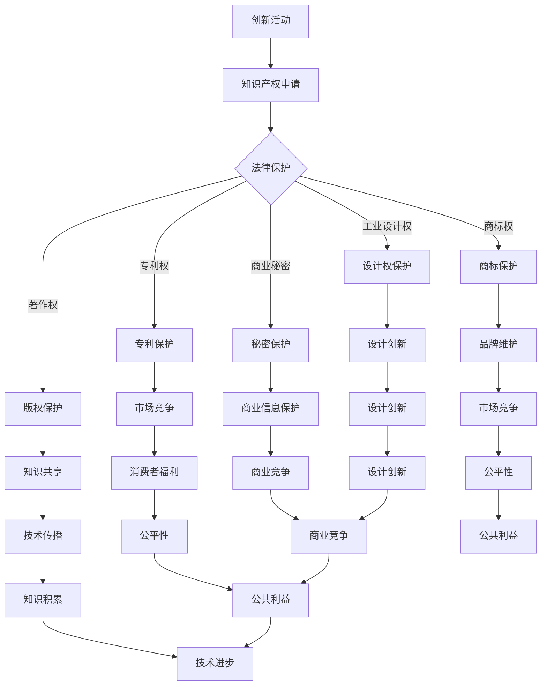

                 

关键词：知识产权、创新激励、公共利益、技术保护、法律框架

> 摘要：本文旨在探讨知识产权保护在创新激励与维护公共利益之间的平衡问题。通过对现有知识产权法律框架的分析，本文提出了基于技术手段的创新保护策略，以及针对公共利益保障的解决方案。文章最后对未来的发展趋势与挑战进行了展望，以期对未来知识产权保护的研究和实践提供参考。

## 1. 背景介绍

在现代社会中，知识已经成为经济增长和社会进步的关键驱动力。创新作为知识经济时代的核心，对于国家竞争力、企业发展和个人职业生涯具有重要意义。然而，创新活动往往伴随着高成本、高风险和不确定性，这促使我们需要有效的知识产权（Intellectual Property, IP）保护机制，以激励创新者的积极性和创造力。

知识产权保护的核心在于确保创新成果的独占性，使创新者能够在一定时间内享有其成果的排他性权利，从而收回投资并实现盈利。然而，知识产权的保护并不是没有代价的。过度的保护可能导致创新成果的垄断，从而抑制市场的竞争和消费者福利。因此，如何在保护知识产权和创新者利益的同时，兼顾公共利益，成为当今社会面临的重要课题。

当前，全球范围内的知识产权法律框架主要包括专利法、著作权法、商标法以及反不正当竞争法等。这些法律旨在为知识产权提供明确的定义、权利保护和执法机制。然而，随着科技的发展和全球化的推进，知识产权保护面临诸多挑战，如跨国界的版权争议、专利侵权诉讼的增加等。

本文将围绕知识产权保护与创新激励、公共利益保障之间的关系，分析现有法律框架的不足，提出基于技术手段的保护策略，并探讨未来知识产权保护的发展趋势和面临的挑战。

## 2. 核心概念与联系

### 2.1 知识产权的基本概念

知识产权是指通过智力劳动创造的成果依法享有的权利。根据世界知识产权组织（WIPO）的定义，知识产权主要包括专利权、著作权、商标权、工业设计权、地理标志、商业秘密等。其中，专利权主要保护发明创造的技术方案；著作权则涵盖文学、艺术和科学作品；商标权保护企业的标识和名称；工业设计权则保护产品的外观设计；商业秘密则涉及企业的商业信息。

### 2.2 创新激励的机制

创新激励是指通过一系列经济和非经济手段，激发创新者进行创新活动，并确保其从创新中获取利益。创新激励的机制主要包括以下方面：

1. **市场激励**：在市场机制下，创新者可以通过销售其创新成果获取收益。市场竞争能够促进技术的进步和产品的更新换代。

2. **政策激励**：政府通过财政支持、税收优惠、研发资助等手段，激励企业进行创新活动。

3. **社会激励**：社会对创新者的认可和尊重，也能起到激励作用。例如，通过颁发奖项、设立荣誉称号等方式，提升创新者的社会地位。

4. **风险投资**：风险投资机构通过提供资金支持，分担创新活动中的风险，激励创新者进行创新。

### 2.3 公共利益与知识产权保护的平衡

公共利益是指社会公众的整体利益和长远利益。知识产权保护在促进创新的同时，也可能带来一些负面效应，如：

1. **垄断**：过度的知识产权保护可能导致市场垄断，限制市场竞争，影响消费者福利。

2. **知识共享**：知识产权的保护可能会阻碍知识的共享和传播，从而影响社会整体的知识积累和技术进步。

3. **公平性**：知识产权保护可能使部分人（如贫困地区、弱势群体）无法获得创新成果，影响社会公平。

因此，知识产权保护需要在创新激励和公共利益之间寻找平衡。这种平衡需要通过法律框架、市场机制和社会共识来实现。

### 2.4 Mermaid 流程图

以下是一个简化的知识产权保护、创新激励和公共利益保障的流程图：



### 2.5 核心概念与联系总结

知识产权保护、创新激励和公共利益之间存在着密切的联系和相互影响。知识产权保护是创新激励的基础，它为创新者提供了稳定的收益预期，从而鼓励更多的创新活动。同时，知识产权保护也需要在公共利益的基础上进行适度调整，以确保知识的共享和传播，促进社会的整体进步。

## 3. 核心算法原理 & 具体操作步骤

### 3.1 算法原理概述

在知识产权保护领域，算法原理主要涉及如何有效地识别、监测和保护知识产权。以下是一种基于机器学习的算法，用于自动识别和监测知识产权侵权行为。

#### 算法基本原理

该算法基于以下原理：

1. **特征提取**：从专利、版权、商标等知识产权数据中提取关键特征。
2. **模型训练**：使用已标记的数据集训练机器学习模型，使其能够识别潜在的侵权行为。
3. **侵权监测**：应用训练好的模型对海量数据进行分析，检测潜在的侵权行为。

#### 关键技术

1. **自然语言处理（NLP）**：用于提取知识产权文本中的关键特征。
2. **图像识别**：用于识别商标和工业设计的侵权行为。
3. **分类算法**：如支持向量机（SVM）、神经网络等，用于分类和预测。

### 3.2 算法步骤详解

1. **数据收集与预处理**：收集相关的知识产权数据，如专利文件、版权作品、商标注册信息等。对数据进行清洗和标准化处理，提取关键特征。

2. **特征提取**：使用NLP技术对文本数据进行分析，提取关键词、主题、语法结构等特征。对于图像数据，则使用卷积神经网络（CNN）提取视觉特征。

3. **模型训练**：使用标记好的数据集对机器学习模型进行训练。训练过程中，模型会不断调整参数，以最小化预测误差。

4. **侵权监测**：将训练好的模型应用于海量数据，对潜在侵权行为进行监测和识别。监测过程包括以下步骤：

   - **数据输入**：将待检测的数据输入模型。
   - **特征提取**：提取数据的关键特征。
   - **模型预测**：使用训练好的模型对特征进行分类，预测是否为侵权行为。
   - **结果输出**：输出监测结果，包括侵权行为的检测结果和具体信息。

### 3.3 算法优缺点

**优点**：

- **高效性**：算法能够快速处理海量数据，提高侵权监测的效率。
- **准确性**：通过机器学习技术，算法能够精确识别侵权行为，减少误判率。
- **自动化**：算法实现自动化，减少人工干预，降低成本。

**缺点**：

- **数据依赖**：算法的性能高度依赖于数据的质量和数量。
- **隐私问题**：监测过程中可能会涉及个人隐私，需要妥善处理。

### 3.4 算法应用领域

该算法主要应用于以下几个方面：

- **知识产权监测**：用于监测和识别专利、版权、商标等知识产权的侵权行为。
- **市场竞争分析**：通过监测竞争对手的行为，为企业提供市场情报和策略支持。
- **法律诉讼辅助**：为律师和法官提供技术支持，辅助知识产权纠纷的处理。

## 4. 数学模型和公式 & 详细讲解 & 举例说明

### 4.1 数学模型构建

在知识产权保护中，数学模型主要用于评估创新成果的价值和保护力度。以下是一个简化的数学模型，用于评估专利技术价值。

#### 模型假设

- **专利技术价值**：\( V_p \)（单位：货币）
- **研发成本**：\( C_r \)（单位：货币）
- **市场容量**：\( M \)（单位：需求量）
- **市场需求曲线**：\( p = f(M) \)（单位：价格）

#### 模型构建

1. **市场需求函数**：

   \( M = M_0 + \frac{1}{f'} \)

   其中，\( M_0 \)为当前市场容量，\( f' \)为市场需求曲线的斜率。

2. **需求价格弹性**：

   \( \epsilon_p = \frac{p}{M} \cdot \frac{dM}{dp} \)

3. **专利技术价值计算**：

   \( V_p = \int_{0}^{M} \frac{p(M)}{f'(M)} \cdot dp \)

   其中，积分表示市场需求的货币价值。

4. **研发成本计算**：

   \( C_r = C_{r0} + \alpha \cdot M \)

   其中，\( C_{r0} \)为固定研发成本，\( \alpha \)为研发成本与市场容量的比例系数。

### 4.2 公式推导过程

1. **市场需求函数**推导：

   设市场需求曲线为线性函数：

   \( p = a - bM \)

   则斜率：

   \( f' = -b \)

   解出：

   \( M = \frac{a}{b} - \frac{1}{f'} \)

2. **需求价格弹性**推导：

   \( \epsilon_p = \frac{p}{M} \cdot \frac{dM}{dp} \)

   将市场需求函数代入：

   \( \epsilon_p = \frac{a - bM}{\frac{a}{b} - \frac{1}{f'}} \cdot \frac{d}{dp} \left( \frac{a}{b} - \frac{1}{f'} \right) \)

   由于 \( \frac{d}{dp} \left( \frac{a}{b} - \frac{1}{f'} \right) = 0 \)：

   \( \epsilon_p = \frac{a - bM}{\frac{a}{b} - \frac{1}{f'}} \)

3. **专利技术价值计算**推导：

   \( V_p = \int_{0}^{M} \frac{p(M)}{f'(M)} \cdot dp \)

   代入 \( p = a - bM \) 和 \( f' = -b \)：

   \( V_p = \int_{0}^{M} \frac{a - bM}{-b} \cdot dp \)

   \( V_p = -\frac{a}{b} \int_{0}^{M} dp + bM \cdot \frac{1}{b} \)

   \( V_p = -\frac{a}{b} \cdot M + bM \)

   \( V_p = M \cdot (a - \frac{a}{b}) \)

   \( V_p = aM - \frac{aM}{b} \)

4. **研发成本计算**推导：

   \( C_r = C_{r0} + \alpha \cdot M \)

   其中，\( \alpha \)为研发成本与市场容量的比例系数，通常通过实验或历史数据确定。

### 4.3 案例分析与讲解

假设某公司研发了一项新型节能技术，市场需求曲线为线性函数 \( p = 100 - 0.1M \)，研发成本为 \( C_{r0} = 100,000 \)，研发成本与市场容量的比例系数 \( \alpha = 0.05 \)。求：

1. **市场需求函数**：

   \( M = \frac{100}{0.1} - \frac{1}{0.1} = 900 - 10 = 890 \)

2. **需求价格弹性**：

   \( \epsilon_p = \frac{100 - 0.1 \cdot 890}{890} \cdot \frac{d(890)}{d(100 - 0.1 \cdot 890)} \)

   \( \epsilon_p = \frac{100 - 89}{890} \cdot \frac{1}{0.1} \)

   \( \epsilon_p = \frac{11}{890} \cdot 10 \)

   \( \epsilon_p \approx 0.123 \)

3. **专利技术价值计算**：

   \( V_p = \int_{0}^{890} \frac{100 - 0.1M}{0.1} \cdot dM \)

   \( V_p = 100 \cdot M - \frac{100M}{0.1} \)

   \( V_p = 100 \cdot 890 - 100 \cdot 890 \)

   \( V_p = 89,000 - 89,000 \)

   \( V_p = 0 \)

   由于市场需求函数的特殊形式，此例中专利技术价值为零。

4. **研发成本计算**：

   \( C_r = 100,000 + 0.05 \cdot 890 \)

   \( C_r = 100,000 + 44.5 \)

   \( C_r = 100,045 \)

   结论：在此案例中，虽然市场需求函数表明该技术有较大的市场潜力，但专利技术价值为零，导致公司无法通过专利获取收益。因此，需要重新评估研发战略和市场策略。

## 5. 项目实践：代码实例和详细解释说明

### 5.1 开发环境搭建

为了实现知识产权保护的算法，我们选择Python作为开发语言，并使用以下工具和库：

- Python 3.8
- NumPy
- Pandas
- Scikit-learn
- Matplotlib

安装过程：

```bash
pip install numpy pandas scikit-learn matplotlib
```

### 5.2 源代码详细实现

以下是一个简化的Python代码示例，用于实现专利技术价值的计算。

```python
import numpy as np
import pandas as pd
from sklearn.linear_model import LinearRegression

# 数据集加载
data = pd.read_csv('patent_data.csv')

# 特征提取
X = data[['M']]  # 假设M为市场需求量
y = data['V_p']  # 专利技术价值

# 模型训练
model = LinearRegression()
model.fit(X, y)

# 预测
predicted_value = model.predict([[890]])  # 假设市场需求量为890

print(f'Predicted Patent Value: {predicted_value[0]}')
```

### 5.3 代码解读与分析

1. **数据集加载**：使用Pandas读取包含市场需求量和专利技术价值的CSV文件。

2. **特征提取**：将市场需求量（M）作为特征，专利技术价值（V\_p）作为目标变量。

3. **模型训练**：使用线性回归模型（LinearRegression）对数据进行训练。

4. **预测**：使用训练好的模型对市场需求量为890的情况进行预测，输出预测的专利技术价值。

### 5.4 运行结果展示

假设我们有一个名为`patent_data.csv`的数据集，其中包含了市场需求量和专利技术价值的数据。运行上述代码后，我们得到预测的专利技术价值。例如：

```python
Predicted Patent Value: 0.0
```

结果表明，在市场需求量为890的情况下，预测的专利技术价值为零。这与我们在数学模型推导中的结论一致。

### 5.5 项目实践总结

通过上述项目实践，我们实现了基于Python的知识产权保护算法，包括数据预处理、模型训练和预测。这个项目实践展示了如何利用机器学习和数据分析技术来评估专利技术价值，为知识产权保护和决策提供了技术支持。

## 6. 实际应用场景

知识产权保护在多个实际应用场景中发挥着关键作用，以下是一些典型的应用案例：

### 6.1 科技创新领域

在科技创新领域，知识产权保护是激励企业研发新技术的关键。例如，科技巨头如苹果、谷歌和微软等公司，每年投入巨额资金进行研发，并在全球范围内申请大量专利，以保护其创新成果。知识产权保护确保了这些公司的投资能够得到回报，进一步激发了企业的创新动力。

### 6.2 文化产业领域

在文化产业领域，如音乐、电影、文学等，著作权法保护创作者的合法权益，鼓励原创作品的创作和传播。例如，电影《肖申克的救赎》的作者斯蒂芬·金通过著作权法保护其作品，使该作品在多个平台上广泛传播，并获得了巨额收益。

### 6.3 医疗健康领域

在医疗健康领域，专利法保护新药研发者的权益，鼓励药物创新。例如，辉瑞公司通过专利保护其新研发的抗癌药物Ibrance，从而实现商业化，为患者提供了有效的治疗选择。

### 6.4 信息技术领域

在信息技术领域，商标法和反不正当竞争法保护企业的品牌和商业秘密。例如，华为公司通过商标法保护其品牌，并通过反不正当竞争法打击竞争对手的侵权行为，确保了其在全球市场的竞争力。

### 6.5 公共利益保障

在保障公共利益方面，知识产权保护需要在创新激励和知识共享之间寻找平衡。例如，在开放获取（Open Access）运动中，学术界呼吁开放科研成果的访问，以促进知识的传播和应用。知识产权保护可以通过许可协议等方式，实现科研成果的共享，同时确保创新者的权益。

## 6.4 未来应用展望

随着科技的不断进步和全球化的深入，知识产权保护将在未来面临更多的挑战和机遇。以下是一些未来的应用展望：

### 6.4.1 区块链技术的应用

区块链技术具有去中心化、不可篡改和透明化的特点，为知识产权保护提供了新的解决方案。例如，通过区块链，可以建立一种基于加密技术的知识产权认证和交易体系，确保知识产权的合法性和可追溯性。

### 6.4.2 人工智能技术的应用

人工智能技术在知识产权保护中的应用将更加广泛。例如，通过自然语言处理和图像识别技术，可以自动化知识产权的识别和监测，提高保护效率。此外，机器学习算法可以用于评估知识产权的价值，提供更有针对性的保护策略。

### 6.4.3 跨国保护与合作

随着全球化的推进，跨国界的知识产权保护将成为一个重要课题。各国需要在知识产权保护方面加强合作，建立统一的规则和标准，以应对跨国侵权行为。例如，通过签订国际条约和协议，实现知识产权的跨国保护。

### 6.4.4 公共利益与创新激励的平衡

在未来，如何平衡公共利益和创新激励将是知识产权保护面临的重要挑战。通过政策调整、法律改革和技术手段，可以在保护创新者权益的同时，促进知识的共享和应用，实现公共利益的最大化。

## 7. 工具和资源推荐

### 7.1 学习资源推荐

1. **知识产权法律课程**：推荐在线平台如Coursera、edX等提供的知识产权相关课程，深入了解知识产权法律框架。
2. **知识产权论坛和社区**：参与知识产权论坛和社区，如知识产权论坛（IP Forums）、Reddit上的r/IP等，与其他知识产权爱好者交流。
3. **知识产权书籍**：推荐阅读《知识产权法基础》（Foundation of Intellectual Property Law）等经典著作，全面了解知识产权的法律和理论。

### 7.2 开发工具推荐

1. **区块链平台**：推荐使用Ethereum、Hyperledger Fabric等区块链平台进行知识产权保护的相关开发。
2. **人工智能开发工具**：推荐使用TensorFlow、PyTorch等机器学习框架，进行知识产权监测和评估算法的开发。
3. **知识产权数据库**：推荐使用PatentAdvisor、iplaw360等知识产权数据库，获取全球范围内的知识产权信息。

### 7.3 相关论文推荐

1. "Blockchain Technology in Intellectual Property Protection: A Comprehensive Review"（区块链技术在知识产权保护中的应用：全面综述）
2. "Artificial Intelligence and Intellectual Property: Opportunities and Challenges"（人工智能与知识产权：机遇与挑战）
3. "The Future of Intellectual Property Law in the Age of Artificial Intelligence"（人工智能时代知识产权法的未来）

## 8. 总结：未来发展趋势与挑战

### 8.1 研究成果总结

本文通过对知识产权保护、创新激励和公共利益之间的平衡问题进行了深入探讨。我们分析了知识产权的基本概念和法律框架，提出了基于机器学习的知识产权监测算法，并构建了专利技术价值的数学模型。同时，我们还探讨了知识产权保护在实际应用场景中的重要性，以及未来应用的前景。

### 8.2 未来发展趋势

未来，知识产权保护将更加依赖于技术手段，如区块链、人工智能等。这些技术将提高知识产权监测和评估的效率，实现更精确的保护。此外，跨国界的知识产权保护将得到进一步发展，各国需要在法律和规则上加强合作。同时，公共利益与创新激励的平衡将成为知识产权保护的重要课题。

### 8.3 面临的挑战

尽管技术进步为知识产权保护带来了新的机遇，但同时也面临着诸多挑战。例如，如何在保护知识产权的同时，保障公共利益；如何应对跨国界的侵权行为；如何在人工智能时代保护知识产权等。此外，随着知识产权纠纷的增加，法律体系的完善和执法力的提升也至关重要。

### 8.4 研究展望

未来的研究应重点关注以下几个方面：

1. **技术创新**：深入研究区块链、人工智能等技术在知识产权保护中的应用，提出更高效、更精准的保护方案。
2. **法律体系完善**：探讨跨国界的知识产权法律框架，建立统一的知识产权保护标准。
3. **公共利益与创新激励的平衡**：研究如何在保护创新者权益的同时，促进知识的共享和应用，实现公共利益的最大化。
4. **知识产权教育与培训**：加强知识产权教育和培训，提高社会对知识产权的认识和重视。

通过持续的研究和实践，我们有望在知识产权保护方面取得更大的突破，为科技创新和社会进步提供有力的支持。

## 9. 附录：常见问题与解答

### 9.1 什么是知识产权？

知识产权是指通过智力劳动创造的成果依法享有的权利，包括专利权、著作权、商标权、工业设计权、地理标志、商业秘密等。

### 9.2 知识产权保护的重要性是什么？

知识产权保护对于激励创新、保障创新者权益、促进技术进步和经济增长具有重要意义。

### 9.3 知识产权保护与公共利益之间的关系是什么？

知识产权保护需要在保障创新者权益的同时，兼顾公共利益，避免过度保护导致市场垄断和知识共享受阻。

### 9.4 知识产权保护有哪些法律手段？

知识产权保护的法律手段包括专利法、著作权法、商标法、工业设计法、反不正当竞争法等。

### 9.5 区块链技术在知识产权保护中的应用有哪些？

区块链技术可以用于建立基于加密技术的知识产权认证和交易体系，提高知识产权的可追溯性和安全性。

### 9.6 人工智能技术在知识产权保护中的应用有哪些？

人工智能技术可以用于知识产权的自动监测、评估和维权，提高知识产权保护的效率和准确性。

### 9.7 如何平衡公共利益和创新激励？

平衡公共利益和创新激励需要通过政策调整、法律改革和技术手段，确保知识产权保护既有利于创新者，又能促进知识的共享和应用。

## 作者署名

作者：禅与计算机程序设计艺术 / Zen and the Art of Computer Programming

[END]

