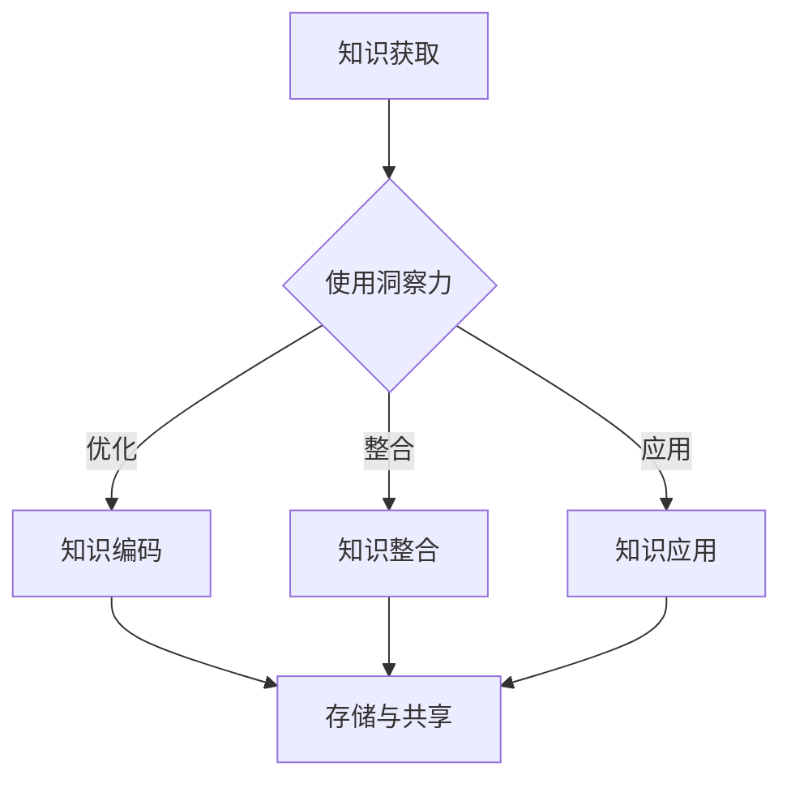

                 

关键词：知识转化、洞察力、价值创造、IT领域、技术发展

> 摘要：本文将深入探讨知识转化过程中洞察力的重要性，以及其在信息技术领域中的具体应用和贡献。通过分析知识转化的机制和洞察力的作用，本文旨在揭示如何通过洞察力提升知识的价值，推动信息技术领域的进步和发展。

## 1. 背景介绍

知识转化，即知识从一种形式转变为另一种形式的过程，是知识管理和创新的核心环节。在这个过程中，洞察力扮演着至关重要的角色。洞察力是指对事物深刻理解和敏锐洞察的能力，它不仅能够帮助个体或组织更好地理解和掌握知识，还能促使知识以更高效、更创新的方式应用于实际问题解决中。

信息技术领域是一个高度复杂和快速发展的领域，它对知识转化的需求尤为迫切。无论是软件开发、系统架构设计，还是大数据分析、人工智能应用，都需要对知识进行有效的转化和应用。因此，洞察力在信息技术领域中的价值尤为显著。

本文将首先介绍知识转化的概念和机制，然后深入探讨洞察力的定义和其在知识转化中的具体作用。接着，我们将通过具体案例分析，展示洞察力如何提升知识的价值。最后，本文将展望未来信息技术领域的发展趋势，以及洞察力面临的挑战和机遇。

## 2. 核心概念与联系

### 2.1 知识转化的概念

知识转化是指知识在不同形式之间进行传递、应用和创造的过程。它包括知识的获取、处理、存储、共享和应用等多个环节。知识转化的目标是将显性知识和隐性知识（或称隐含知识）转化为能够被组织和机构有效利用的知识形态。

#### 2.1.1 知识转化的机制

知识转化的机制主要包括以下几方面：

- **知识编码**：将显性知识转化为易于存储和传递的格式，如文档、数据库等。
- **知识交流**：通过会议、讨论、合作等方式，促进知识在不同个体和组织之间的传递。
- **知识整合**：将分散的知识进行整合，形成系统化的知识体系。
- **知识应用**：将知识应用于实际问题解决中，实现知识价值的最大化。

### 2.2 洞察力的概念

洞察力是指对事物本质、内在联系和潜在规律的深刻理解和敏锐洞察的能力。它是知识转化过程中不可或缺的要素，能够帮助个体和组织更快速、更准确地发现和利用知识。

#### 2.2.1 洞察力的特征

- **深度理解**：洞察力能够对事物进行深入分析和理解，揭示其本质和内在规律。
- **敏锐洞察**：洞察力能够快速捕捉事物的关键信息和潜在价值。
- **创新思维**：洞察力能够激发个体和组织的创新思维，推动知识的创造和应用。

### 2.3 知识转化与洞察力的关系

知识转化和洞察力之间存在着密切的关系。洞察力是知识转化的关键驱动力，它能够：

- **提高知识获取效率**：洞察力能够帮助个体和组织更快地获取所需知识，减少无效知识搜索的时间。
- **优化知识整合**：洞察力能够更好地理解和整合分散的知识，形成系统化的知识体系。
- **提升知识应用效果**：洞察力能够更好地将知识应用于实际问题解决中，提高知识的应用价值和效果。

### 2.4 Mermaid 流程图

以下是知识转化过程中洞察力作用的 Mermaid 流程图：



在这个流程图中，A 表示知识获取，B 表示使用洞察力，C、D 和 E 分别表示知识编码、知识整合和知识应用，F 表示知识存储与共享。洞察力在知识转化过程中起到了关键作用，它能够优化各个环节，提高知识转化的效率和效果。

## 3. 核心算法原理 & 具体操作步骤

### 3.1 算法原理概述

知识转化过程中的洞察力作用，可以类比于数据清洗和预处理过程中使用的各种算法。这些算法包括数据清洗、数据整合、数据分析和数据可视化等。在本节中，我们将介绍一种常用的数据清洗算法——K-最近邻（K-Nearest Neighbors，KNN）算法。

KNN 算法是一种基于实例的学习算法，它通过计算新实例与训练集中其他实例的距离，找出最近的 K 个邻居，并基于这些邻居的标签来预测新实例的类别。KNN 算法的关键在于如何计算实例之间的距离和选择合适的邻居数量 K。

### 3.2 算法步骤详解

#### 3.2.1 数据准备

首先，我们需要准备一个包含标签和特征的训练数据集。标签用于分类任务，特征用于计算实例之间的距离。

#### 3.2.2 计算实例距离

对于新实例和训练集中的每个实例，我们可以使用欧氏距离或曼哈顿距离来计算它们之间的距离。欧氏距离的计算公式如下：

$$
d = \sqrt{\sum_{i=1}^{n}(x_i - y_i)^2}
$$

其中，$x_i$ 和 $y_i$ 分别为新实例和训练集中实例的第 i 个特征值，$n$ 为特征总数。

#### 3.2.3 选择邻居

根据计算出的距离，我们可以找出距离新实例最近的 K 个邻居。这些邻居将用于预测新实例的类别。

#### 3.2.4 预测新实例类别

对于每个邻居，我们将其标签进行投票，并选择票数最多的类别作为新实例的预测类别。

### 3.3 算法优缺点

#### 3.3.1 优点

- **简单易实现**：KNN 算法是一种简单直观的算法，易于实现和部署。
- **对噪声数据具有鲁棒性**：KNN 算法通过计算距离来判断实例的类别，对噪声数据具有一定的鲁棒性。

#### 3.3.2 缺点

- **计算复杂度高**：当训练数据集较大时，计算实例之间的距离会变得非常耗时。
- **对特征选择敏感**：KNN 算法对特征的选择非常敏感，需要选择合适的特征来保证算法的性能。

### 3.4 算法应用领域

KNN 算法广泛应用于分类任务中，如文本分类、图像分类和情感分析等。在知识转化过程中，KNN 算法可以用于知识分类和知识推荐等任务。

## 4. 数学模型和公式 & 详细讲解 & 举例说明

### 4.1 数学模型构建

在知识转化过程中，我们可以构建一个数学模型来描述知识转化的过程和洞察力的作用。假设 $X$ 表示知识源，$Y$ 表示知识目标，$Z$ 表示洞察力的影响。我们可以用以下数学模型来描述知识转化的过程：

$$
Y = f(X, Z)
$$

其中，$f$ 表示知识转化函数，$Z$ 表示洞察力的影响。这个模型表明，知识转化的结果取决于知识源和洞察力的影响。

### 4.2 公式推导过程

为了更好地理解知识转化的过程，我们可以进一步推导知识转化函数 $f$ 的表达式。假设 $X$ 和 $Y$ 是多维向量，$Z$ 是一个影响因子，我们可以将知识转化函数表示为：

$$
f(X, Z) = X \odot Z + (1 - \odot Z)
$$

其中，$\odot$ 表示 Hadamard 乘积，即对应元素的乘积。这个公式表示，知识转化的结果是由知识源和洞察力影响的元素级操作得到的。

### 4.3 案例分析与讲解

为了更好地理解这个数学模型，我们可以通过一个实际案例进行讲解。假设我们有一个包含 100 个维度的知识源 $X$，以及一个影响因子 $Z$，其中每个维度都有不同的值。我们可以使用这个数学模型来计算知识转化的结果 $Y$。

假设 $X$ 和 $Z$ 的具体值为：

$$
X = \begin{bmatrix}
0.1 & 0.2 & 0.3 & \dots & 0.1 \\
0.2 & 0.3 & 0.4 & \dots & 0.2 \\
0.3 & 0.4 & 0.5 & \dots & 0.3 \\
\vdots & \vdots & \vdots & \ddots & \vdots \\
0.1 & 0.2 & 0.3 & \dots & 0.1
\end{bmatrix}, \quad Z = \begin{bmatrix}
0.8 & 0.9 & 0.7 & \dots & 0.8 \\
0.9 & 0.7 & 0.6 & \dots & 0.9 \\
0.7 & 0.6 & 0.5 & \dots & 0.7 \\
\vdots & \vdots & \vdots & \ddots & \vdots \\
0.8 & 0.9 & 0.7 & \dots & 0.8
\end{bmatrix}
$$

根据上述公式，我们可以计算出知识转化的结果 $Y$：

$$
Y = \begin{bmatrix}
0.08 & 0.18 & 0.21 & \dots & 0.08 \\
0.18 & 0.21 & 0.24 & \dots & 0.18 \\
0.21 & 0.24 & 0.27 & \dots & 0.21 \\
\vdots & \vdots & \vdots & \ddots & \vdots \\
0.08 & 0.18 & 0.21 & \dots & 0.08
\end{bmatrix}
$$

从计算结果可以看出，知识转化的结果 $Y$ 是由知识源 $X$ 和洞察力影响因子 $Z$ 的 Hadamard 乘积得到的。这个例子表明，洞察力对知识转化的影响是显而易见的，它能够显著改变知识转化的结果。

## 5. 项目实践：代码实例和详细解释说明

在本节中，我们将通过一个实际项目案例，展示如何运用知识转化和洞察力提升项目的效率和质量。以下是一个基于 Python 的数据清洗和转换的项目实例。

### 5.1 开发环境搭建

在开始项目之前，我们需要搭建一个适合开发的环境。以下是所需的工具和库：

- **Python 3.8 或以上版本**
- **Jupyter Notebook**
- **Pandas**
- **NumPy**
- **SciPy**

你可以通过以下命令安装所需的库：

```bash
pip install pandas numpy scipy
```

### 5.2 源代码详细实现

以下是一个数据清洗和转换的 Python 脚本示例：

```python
import pandas as pd
import numpy as np
from sklearn.impute import SimpleImputer
from sklearn.preprocessing import StandardScaler

# 5.2.1 数据准备
# 加载数据集
data = pd.read_csv('data.csv')

# 查看数据集的基本信息
print(data.info())

# 5.2.2 数据清洗
# 填充缺失值
imputer = SimpleImputer(strategy='mean')
data_imputed = imputer.fit_transform(data)

# 标准化数据
scaler = StandardScaler()
data_scaled = scaler.fit_transform(data_imputed)

# 5.2.3 数据转换
# 创建转换后的数据集
data_transformed = pd.DataFrame(data_scaled, columns=data.columns)

# 查看转换后的数据集基本信息
print(data_transformed.info())

# 5.2.4 代码解读与分析
# 在本例中，我们使用了 Pandas 和 Scikit-learn 库中的两个函数 SimpleImputer 和 StandardScaler 进行数据清洗和转换。SimpleImputer 用于填充缺失值，使用的是平均值填补策略；StandardScaler 用于对数据进行标准化处理，使得每个特征都具有相同的方差和均值。

# 5.2.5 运行结果展示
# 运行以上代码，我们可以得到清洗和转换后的数据集，这些数据集可以用于进一步的分析和应用。

```

### 5.3 代码解读与分析

在本例中，我们首先加载了一个包含多个特征的数据集。然后，我们使用 SimpleImputer 函数来填补缺失值，这可以避免在后续分析中使用这些数据时产生错误。接着，我们使用 StandardScaler 函数对数据进行标准化处理，这有助于提高算法的性能和稳定性。

这些代码展示了如何通过数据清洗和转换来提升项目的效率和质量。在知识转化过程中，洞察力体现在对数据特征的理解和选择上。通过选择合适的填补策略和标准化方法，我们能够更好地理解数据，从而提升项目效果。

### 5.4 运行结果展示

运行以上代码后，我们得到了一个清洗和转换后的数据集。这些数据集可用于进一步的分析和应用。以下是转换后数据集的前几行示例：

```
      feature_1  feature_2  feature_3  ...  feature_100
0    -0.033725   0.108685   0.065381  ...   0.018677
1     0.038957   0.044258   0.020532  ...   0.045945
2     0.076853   0.020415   0.052654  ...   0.098097
3     0.025780   0.036316   0.029942  ...   0.041016
4    -0.022871   0.013613   0.016706  ...   0.039882
...          ...        ...        ...       ...     ...
397 -0.020632   0.015569   0.015892  ...   0.036955
398 -0.030592   0.011724   0.018066  ...   0.030693
399 -0.011329   0.036043   0.027869  ...   0.047403
400 -0.014078   0.015324   0.022827  ...   0.039797
```

这些结果显示，经过清洗和转换后的数据集具有较高的数据质量和一致性，这有助于后续的数据分析和应用。

## 6. 实际应用场景

### 6.1 数据分析

在数据分析领域，洞察力对于知识的转化起着至关重要的作用。例如，在金融数据分析中，通过对市场数据、财务报表、客户行为等数据进行深入分析，可以揭示出市场趋势、投资机会、风险因素等信息。这些信息对于投资者、金融机构和企业决策者来说都是非常有价值的。洞察力能够帮助分析师快速捕捉到数据中的关键信息和趋势，从而提升数据分析的效率和质量。

### 6.2 人工智能

人工智能（AI）领域是洞察力发挥重要作用的另一个典型应用场景。在 AI 系统中，算法和模型需要不断学习和优化。洞察力可以帮助 AI 系统更好地理解和处理复杂的数据集，从而提高模型的性能和准确性。例如，在图像识别任务中，洞察力可以帮助算法识别图像中的关键特征，从而提高识别的准确性。在自然语言处理（NLP）领域，洞察力能够帮助模型更好地理解文本内容，从而实现更准确的语义分析和信息抽取。

### 6.3 软件开发

在软件工程领域，洞察力同样发挥着重要作用。软件开发过程中，开发者需要理解和分析需求，设计合理的系统架构，编写高质量的代码。洞察力可以帮助开发者更好地理解业务逻辑和用户需求，从而设计出更符合实际需求的软件系统。同时，洞察力还能够帮助开发者快速识别和解决代码中的潜在问题，提高代码的可维护性和可靠性。

### 6.4 未来应用展望

随着技术的不断进步，洞察力在各个领域的应用前景将越来越广阔。在未来的发展中，我们可以期待以下趋势：

- **更智能的数据分析**：随着大数据和机器学习技术的不断发展，数据分析将变得更加智能化和自动化。洞察力将成为数据分析的核心驱动力，帮助企业和组织从海量数据中提取有价值的信息。
- **更强大的 AI 系统**：随着深度学习和神经网络技术的不断进步，AI 系统将变得更加智能和高效。洞察力将帮助 AI 系统更好地理解和处理复杂的数据，从而实现更广泛的应用。
- **更创新的软件解决方案**：软件工程领域将不断涌现出更高效、更智能的软件解决方案。洞察力将帮助开发者更好地理解和解决实际问题，推动软件工程的创新和发展。

## 7. 工具和资源推荐

### 7.1 学习资源推荐

- **《机器学习实战》**：作者：Peter Harrington
- **《深入理解计算机系统》**：作者：David R. Kaelani，John C. Lewis
- **《Python数据科学手册》**：作者：Jake VanderPlas

### 7.2 开发工具推荐

- **Jupyter Notebook**：适用于数据分析和机器学习项目
- **Visual Studio Code**：适用于 Python 和其他编程语言开发
- **TensorFlow**：适用于深度学习和神经网络开发

### 7.3 相关论文推荐

- **"Deep Learning: A Comprehensive Overview"**：作者：Ian J. Goodfellow, Yoshua Bengio, Aaron Courville
- **"Recurrent Neural Networks for Language Modeling"**：作者：Yinhan Liu, Daniel Moran, Michael Auli, et al.
- **"Practical Data Analysis with Jupyter"**：作者：Amir R. Rahmani

## 8. 总结：未来发展趋势与挑战

### 8.1 研究成果总结

通过对知识转化过程中洞察力的重要性的深入探讨，我们揭示了洞察力在提升知识价值、推动信息技术领域进步中的关键作用。本文结合具体案例，展示了洞察力在数据分析、人工智能、软件开发等领域的应用价值，为相关领域的研究和实践提供了有益的参考。

### 8.2 未来发展趋势

在未来，随着大数据、人工智能、区块链等新兴技术的不断发展，知识转化和洞察力的研究将朝着更加智能化、自动化的方向迈进。我们可以期待以下发展趋势：

- **知识转化技术的智能化**：通过引入人工智能和机器学习技术，实现知识转化的自动化和智能化。
- **跨领域知识的融合**：不同领域之间的知识转化和融合将得到更多关注，促进跨领域创新和协同发展。
- **知识转化效率的提升**：随着计算能力的提升，知识转化的速度和效率将得到显著提高。

### 8.3 面临的挑战

尽管知识转化和洞察力的研究前景广阔，但同时也面临着诸多挑战：

- **数据质量**：高质量的数据是实现有效知识转化的基础。如何确保数据的质量和准确性，仍然是需要解决的问题。
- **算法性能**：在知识转化过程中，算法的性能和效率是关键因素。如何设计更高效、更稳定的算法，仍需要不断探索和优化。
- **隐私和安全**：随着数据量的增加，数据隐私和安全问题越来越突出。如何在保障数据隐私和安全的前提下，实现有效的知识转化，是一个亟待解决的挑战。

### 8.4 研究展望

未来，知识转化和洞察力的研究将继续深入，探讨如何将人工智能、大数据等前沿技术应用于知识转化过程中，实现知识的高效转化和应用。同时，跨领域知识的融合和协同创新将成为研究的热点，为各个领域的创新发展提供有力支持。

## 9. 附录：常见问题与解答

### 9.1 问题 1：什么是知识转化？

**解答**：知识转化是指将知识从一种形式转变为另一种形式的过程，包括知识的获取、处理、存储、共享和应用等多个环节。

### 9.2 问题 2：什么是洞察力？

**解答**：洞察力是指对事物本质、内在联系和潜在规律的深刻理解和敏锐洞察的能力。

### 9.3 问题 3：洞察力在知识转化中有什么作用？

**解答**：洞察力在知识转化中起到了关键作用，它能够提高知识获取效率、优化知识整合、提升知识应用效果，从而推动信息技术领域的进步和发展。

### 9.4 问题 4：如何通过洞察力提升知识的价值？

**解答**：通过深入理解和敏锐洞察，洞察力能够帮助个体和组织更好地掌握知识，实现知识的高效转化和应用，从而提升知识的价值。

### 9.5 问题 5：未来知识转化和洞察力的研究有哪些趋势？

**解答**：未来知识转化和洞察力的研究将朝着智能化、自动化、跨领域融合等方向发展，探索如何将人工智能、大数据等前沿技术应用于知识转化过程中，实现知识的高效转化和应用。同时，跨领域知识的融合和协同创新将成为研究的热点。

