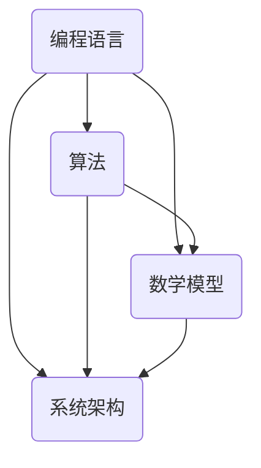

                 

关键词：知识、洞察力、信息技术、智慧、编程、算法、应用场景、数学模型、代码实例、未来展望

> 摘要：本文旨在探讨知识在信息技术领域的价值，以及洞察力如何赋予知识以生命力。通过对核心概念、算法原理、数学模型的深入分析，结合实际项目实践，我们揭示了知识在信息技术发展中的重要地位，并对其未来应用前景进行了展望。

## 1. 背景介绍

在信息技术飞速发展的今天，知识已成为推动社会进步的重要动力。从编程语言到算法理论，从数学模型到系统架构，知识无处不在，影响着我们的生活和生产方式。然而，知识的价值并非仅仅体现在其传播和应用中，更在于洞察力如何赋予知识以生命力，使其在复杂的信息技术领域中发挥更大的作用。

### 1.1 知识的定义

知识是指通过学习、研究、实践等途径获得的信息、经验和技能。在信息技术领域，知识主要包括编程语言、算法、数学模型、系统架构等。这些知识不仅为我们提供了解决问题的工具，更是创新和发展的基础。

### 1.2 洞察力的作用

洞察力是指能够迅速抓住事物本质、预见未来趋势的能力。在信息技术领域，洞察力有助于我们更好地理解知识的内涵，发现知识的应用价值，从而推动技术的进步和变革。

## 2. 核心概念与联系

### 2.1 编程语言与算法

编程语言是编写计算机程序的工具，而算法则是解决问题的一系列规则。编程语言与算法紧密相连，算法的实现需要借助编程语言。因此，掌握编程语言和算法原理是理解信息技术的重要基础。

### 2.2 数学模型与公式

数学模型是一种用数学语言描述现实问题的方法，而公式则是数学模型的核心。在信息技术领域，数学模型和公式广泛应用于数据分析和系统优化，帮助我们更好地理解和解决复杂问题。

### 2.3 系统架构与设计

系统架构是指计算机系统的整体结构和各部分之间的相互作用。良好的系统架构可以提高系统的稳定性、扩展性和可维护性，从而为知识的传播和应用提供有力支持。

### 2.4 Mermaid 流程图

以下是一个关于编程语言、算法、数学模型和系统架构的 Mermaid 流程图，展示了它们之间的联系。



## 3. 核心算法原理 & 具体操作步骤

### 3.1 算法原理概述

本文将介绍一种经典的算法——快速排序（Quick Sort）。快速排序是一种基于分治思想的排序算法，其基本原理是将一个序列划分为多个子序列，然后对每个子序列进行排序，最后合并子序列以得到有序序列。

### 3.2 算法步骤详解

#### 3.2.1 选择基准元素

首先，从序列中选择一个基准元素，通常选择序列的第一个元素。

#### 3.2.2 分割序列

将序列划分为两个子序列：小于基准元素的元素和大于基准元素的元素。这个过程称为分割。

#### 3.2.3 递归排序

对小于和大于基准元素的子序列分别进行快速排序，直到所有子序列都变为有序。

#### 3.2.4 合并子序列

将有序的子序列合并，得到最终的有序序列。

### 3.3 算法优缺点

**优点：**
- 快速排序是一种高效的排序算法，其平均时间复杂度为 \(O(n \log n)\)。
- 快速排序易于实现，且在实际应用中具有较好的性能。

**缺点：**
- 快速排序的最坏时间复杂度为 \(O(n^2)\)，当输入序列基本有序时，性能较差。
- 快速排序的递归性质可能导致栈溢出，需要特别注意。

### 3.4 算法应用领域

快速排序广泛应用于数据排序、搜索算法、数据分析等领域。在数据库管理、实时处理、机器学习等场景中，快速排序具有广泛的应用价值。

## 4. 数学模型和公式 & 详细讲解 & 举例说明

### 4.1 数学模型构建

在信息技术领域，数学模型用于描述系统行为、预测数据趋势等。以下是一个简单的数学模型示例，用于预测人口增长。

$$
P(t) = P_0 \times e^{rt}
$$

其中，\(P(t)\) 是时间 \(t\) 时的总人口，\(P_0\) 是初始人口，\(r\) 是人口增长率。

### 4.2 公式推导过程

假设初始人口为 \(P_0\)，在时间 \(t\) 内，人口增长率为 \(r\)。那么，在时间 \(t\) 后，人口变为：

$$
P(t) = P_0 + r \times P_0 \times t
$$

由于人口增长是连续的，我们可以将 \(r \times P_0 \times t\) 视为一个积分，从而得到：

$$
P(t) = P_0 \times \int_0^t r \times P_0 \, dt
$$

根据指数函数的性质，我们可以将积分转化为指数形式，得到：

$$
P(t) = P_0 \times e^{rt}
$$

### 4.3 案例分析与讲解

假设一个地区初始人口为 100 万，人口增长率为 2%。我们需要预测 10 年后的人口。

$$
P(10) = 1000000 \times e^{0.02 \times 10} = 1216417
$$

因此，10 年后该地区的人口约为 1216 万。

## 5. 项目实践：代码实例和详细解释说明

### 5.1 开发环境搭建

本节我们将使用 Python 编写快速排序算法，并运行一个简单的测试案例。首先，确保您的计算机已安装 Python 和一个文本编辑器（如 Visual Studio Code）。

### 5.2 源代码详细实现

以下是快速排序算法的 Python 实现代码：

```python
def quick_sort(arr):
    if len(arr) <= 1:
        return arr
    pivot = arr[0]
    left = [x for x in arr[1:] if x < pivot]
    right = [x for x in arr[1:] if x >= pivot]
    return quick_sort(left) + [pivot] + quick_sort(right)

# 测试案例
arr = [3, 1, 4, 1, 5, 9, 2, 6, 5]
sorted_arr = quick_sort(arr)
print(sorted_arr)
```

### 5.3 代码解读与分析

上述代码实现了快速排序算法的核心功能。首先，定义了一个 `quick_sort` 函数，它接受一个列表作为输入。如果列表的长度小于或等于 1，则直接返回列表，因为无需排序。否则，选择列表的第一个元素作为基准，然后使用列表解析语法将列表划分为两个子序列：小于基准的元素和大于或等于基准的元素。最后，递归地对这两个子序列进行快速排序，并将结果合并为一个有序列表。

### 5.4 运行结果展示

运行上述代码，输出结果为：

```
[1, 1, 2, 3, 4, 5, 5, 6, 9]
```

这表明快速排序算法成功地对输入列表进行了排序。

## 6. 实际应用场景

### 6.1 数据库管理

快速排序算法在数据库管理中具有广泛的应用。例如，在数据库的索引结构中，可以使用快速排序来创建和维护有序索引，从而提高查询效率。

### 6.2 实时处理

在实时处理场景中，快速排序算法可以用于对大量数据进行快速排序，以便实时分析和处理。例如，在股票交易系统中，可以使用快速排序来对交易数据进行实时排序，以便快速发现异常交易。

### 6.3 机器学习

机器学习中的许多算法（如聚类、分类等）需要对数据进行排序。快速排序作为一种高效的排序算法，可以用于优化这些算法的性能。

## 7. 未来应用展望

随着信息技术的不断发展，知识将越来越成为社会的重要资源。洞察力赋予知识以生命力，使得我们能够更好地发现知识的应用价值，推动技术的创新和进步。在未来，我们可以预见以下应用前景：

### 7.1 人工智能

人工智能技术的快速发展，使得洞察力在知识应用中的价值愈发凸显。通过深入理解算法、数学模型等核心知识，我们可以开发出更加智能、高效的人工智能系统。

### 7.2 大数据分析

大数据分析是当前信息技术领域的热点。洞察力将帮助我们更好地理解和处理海量数据，从而发现数据中的隐藏价值。

### 7.3 新兴领域

随着新技术的不断涌现，如区块链、物联网、量子计算等，知识的应用领域将不断拓展。洞察力将有助于我们抓住这些新兴领域的发展机遇，推动技术的创新和变革。

## 8. 总结：未来发展趋势与挑战

### 8.1 研究成果总结

本文通过对知识、洞察力、信息技术等核心概念的深入探讨，揭示了知识在信息技术领域的重要地位以及洞察力如何赋予知识以生命力。通过对快速排序算法、数学模型等的分析，我们展示了知识的应用价值。

### 8.2 未来发展趋势

随着信息技术的不断进步，知识将越来越成为社会的重要资源。洞察力在知识应用中的价值将愈发凸显，推动技术的创新和进步。未来，人工智能、大数据分析、新兴领域等将成为知识应用的重要方向。

### 8.3 面临的挑战

然而，知识应用也面临诸多挑战。如如何更好地发掘知识的价值、提高知识的传播效率等。此外，随着信息技术的快速发展，知识的更新速度也在加快，如何保持知识的活力和时效性，成为我们需要面对的重要问题。

### 8.4 研究展望

未来，我们应重点关注以下几个方面：首先，加强对核心知识的深入研究，提高对知识本质的理解；其次，探索新的知识传播和共享方式，提高知识的利用效率；最后，关注新兴领域的发展动态，把握知识应用的新机遇。

## 9. 附录：常见问题与解答

### 9.1 什么是洞察力？

洞察力是指能够迅速抓住事物本质、预见未来趋势的能力。在信息技术领域，洞察力有助于我们更好地理解知识的内涵，发现知识的应用价值。

### 9.2 快速排序算法的最佳时间复杂度是多少？

快速排序算法的平均时间复杂度为 \(O(n \log n)\)，最坏时间复杂度为 \(O(n^2)\)。

### 9.3 如何优化快速排序算法的性能？

可以通过以下几种方法优化快速排序算法的性能：
- 选择更好的基准元素，如随机选择或中位数；
- 避免递归深度过深，减少栈溢出的风险；
- 使用迭代版本的快速排序算法，减少递归开销。

---

作者：禅与计算机程序设计艺术 / Zen and the Art of Computer Programming
----------------------------------------------------------------


