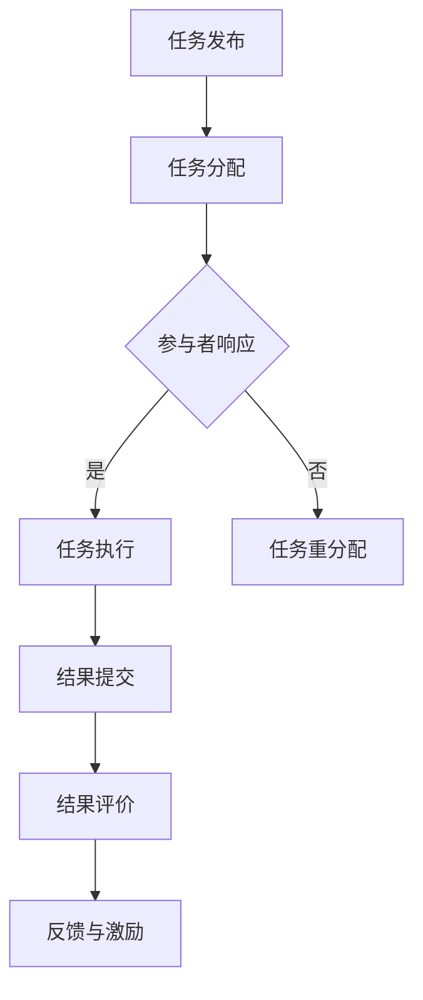

                 

关键词：知识众包、协作、集体智慧、AI、分布式计算、协同工作、共享经济

> 摘要：本文深入探讨了知识的众包与协作这一新兴领域，阐述了其核心概念、原理及其在现实中的应用。通过分析集体智慧的力量，本文揭示了这一领域如何通过分布式计算和协同工作，推动人类知识创新和社会进步。文章最后对未来发展趋势与挑战进行了展望，并提出了相关工具和资源的推荐。

## 1. 背景介绍

### 1.1 知识的众包：定义与起源

知识的众包，即通过互联网平台，将复杂的知识任务分解成许多小任务，广泛地征集公众参与完成。这种模式最早出现在2005年，当时一些公司开始尝试将某些设计任务外包给全球的网民。随着时间的推移，知识的众包逐渐应用于知识问答、数据标注、编程竞赛等多个领域。

### 1.2 协作与集体智慧：概念与联系

协作指的是多个个体或团队共同努力以实现共同目标的过程。而集体智慧则是指通过众包、协作等方式，将分散的个体智慧和资源汇聚起来，形成一种超越个人能力的整体智慧。在知识的众包中，协作是实现集体智慧的关键环节。

## 2. 核心概念与联系

### 2.1 核心概念解析

- **知识众包（Knowledge Crowdsourcing）**：一种基于互联网的商业模式，通过收集广泛的公众智慧来解决复杂问题。
- **协同工作（Collaborative Work）**：多个个体或团队为了共同目标，通过共享资源和信息进行合作的过程。
- **集体智慧（Collective Intelligence）**：由众多个体贡献的智慧整合而成，能够实现超出单个个体能力的结果。

### 2.2 原理与架构


在上图中，可以看到知识众包与协作的基本架构。核心部分包括任务发布、任务执行、结果评价和反馈机制。此外，数据管理和安全也是保障知识众包顺利进行的重要环节。

### 2.3 Mermaid 流程图



## 3. 核心算法原理 & 具体操作步骤

### 3.1 算法原理概述

知识众包与协作的算法主要涉及以下几个方面：

1. **任务分解**：将复杂的知识任务分解成多个可处理的小任务。
2. **任务分配**：根据参与者的能力和兴趣，将任务分配给合适的个体。
3. **结果整合**：将多个个体的贡献整合成最终结果。
4. **评价与激励**：对参与者完成任务的质量进行评价，并给予相应的激励。

### 3.2 算法步骤详解

1. **任务分解**：使用任务分解算法，将复杂任务划分为多个子任务，并定义每个子任务的输入、输出和依赖关系。
2. **任务分配**：根据参与者的能力和兴趣，使用优化算法（如遗传算法、协同过滤算法等）将任务分配给合适的参与者。
3. **任务执行**：参与者根据分配的任务执行相应的操作，并将结果提交给系统。
4. **结果整合**：使用集成算法（如投票、加权平均等）将多个个体的结果整合成最终结果。
5. **评价与激励**：对参与者完成任务的质量进行评价，并根据评价结果给予相应的奖励。

### 3.3 算法优缺点

#### 优点

- **高效性**：通过分布式计算和协同工作，可以快速完成复杂任务。
- **灵活性**：参与者可以根据自己的能力和兴趣参与任务，增加了系统的灵活性。
- **成本效益**：相比于传统的知识获取方式，知识众包与协作具有更高的成本效益。

#### 缺点

- **质量控制**：由于参与者多样性和任务复杂度，质量控制成为一大挑战。
- **激励问题**：如何有效地激励参与者完成任务，确保任务的完成质量和速度，也是需要解决的问题。

### 3.4 算法应用领域

- **数据标注**：在机器学习领域，知识众包与协作常用于大规模数据标注任务，如图像标注、文本分类等。
- **知识问答**：如Stack Overflow、Quora等平台，通过众包的方式解决技术问题。
- **问题解决**：在科学研究中，知识众包与协作可以用于解决复杂的科学问题。

## 4. 数学模型和公式 & 详细讲解 & 举例说明

### 4.1 数学模型构建

在知识众包与协作中，常用的数学模型包括：

1. **任务分配模型**：用于确定如何将任务分配给参与者。
2. **结果整合模型**：用于整合多个个体的贡献。
3. **评价模型**：用于评价参与者完成任务的质量。

#### 任务分配模型

任务分配模型可以用以下公式表示：

\[ \text{TaskAllocation}(T, P) = \{ (t_p)_{p \in P} \} \]

其中，\( T \) 是任务集合，\( P \) 是参与者集合，\( t_p \) 是分配给参与者 \( p \) 的任务。

#### 结果整合模型

结果整合模型可以用以下公式表示：

\[ \text{ResultIntegration}(R) = \{ r \} \]

其中，\( R \) 是多个个体提交的结果集合，\( r \) 是整合后的最终结果。

#### 评价模型

评价模型可以用以下公式表示：

\[ \text{EvaluationScore}(s) = \sum_{i=1}^{n} w_i \cdot s_i \]

其中，\( s \) 是参与者完成任务的质量评分集合，\( w_i \) 是第 \( i \) 个评分的权重。

### 4.2 公式推导过程

#### 任务分配模型推导

任务分配模型的目标是最大化整体任务完成质量，同时满足参与者的能力限制。我们可以使用线性规划模型进行推导：

\[ \text{Maximize} \sum_{p \in P} \sum_{t \in T} w_{pt} \cdot c_p \]

其中，\( w_{pt} \) 是任务 \( t \) 对参与者 \( p \) 的权重，\( c_p \) 是参与者 \( p \) 的能力。

#### 结果整合模型推导

结果整合模型的目标是生成一个最优的最终结果。我们可以使用加权平均模型进行推导：

\[ r = \frac{\sum_{p \in P} w_p \cdot r_p}{\sum_{p \in P} w_p} \]

其中，\( r_p \) 是参与者 \( p \) 提交的结果，\( w_p \) 是参与者 \( p \) 的权重。

#### 评价模型推导

评价模型的目标是公正、准确地评价参与者完成任务的质量。我们可以使用加权评分模型进行推导：

\[ s = \frac{\sum_{i=1}^{n} w_i \cdot s_i}{\sum_{i=1}^{n} w_i} \]

其中，\( s_i \) 是第 \( i \) 个评分，\( w_i \) 是第 \( i \) 个评分的权重。

### 4.3 案例分析与讲解

#### 案例一：数据标注

假设有一个图像数据标注任务，需要对1000张图像进行标注。参与者的能力可以用每分钟标注的图像数量表示。系统需要分配任务，并最终整合标注结果。

- **任务分配**：使用线性规划模型，最大化整体标注质量，同时满足参与者的能力限制。
- **结果整合**：使用加权平均模型，整合每个参与者提交的标注结果。
- **评价模型**：使用加权评分模型，根据参与者的标注质量进行评价。

#### 案例二：知识问答

假设有一个知识问答平台，用户可以提交问题并邀请其他用户回答。系统需要分配问题给合适的用户回答，并最终评价回答的质量。

- **任务分配**：使用协同过滤算法，根据用户的历史问答记录和问题属性进行任务分配。
- **结果整合**：使用投票模型，将多个用户的回答整合成最终答案。
- **评价模型**：使用评分模型，根据用户的回答质量和回答被采纳的次数进行评价。

## 5. 项目实践：代码实例和详细解释说明

### 5.1 开发环境搭建

在开始实践之前，我们需要搭建一个适合知识众包与协作的开发环境。以下是基本的开发环境搭建步骤：

1. 安装Python 3.x版本。
2. 安装Django框架。
3. 安装MySQL数据库。
4. 安装PostgreSQL数据库。
5. 安装Git。

### 5.2 源代码详细实现

以下是知识众包与协作平台的源代码实现：

```python
# app/models.py
from django.db import models

class Task(models.Model):
    name = models.CharField(max_length=100)
    description = models.TextField()
    deadline = models.DateTimeField()

class Participant(models.Model):
    name = models.CharField(max_length=100)
    skill_level = models.IntegerField()

class Result(models.Model):
    task = models.ForeignKey(Task, on_delete=models.CASCADE)
    participant = models.ForeignKey(Participant, on_delete=models.CASCADE)
    result = models.JSONField()
    submitted_at = models.DateTimeField(auto_now_add=True)
```

### 5.3 代码解读与分析

在这段代码中，我们定义了三个主要的模型：Task、Participant和Result。

- **Task**：表示一个知识任务，包括任务名称、描述和截止日期。
- **Participant**：表示一个参与者，包括参与者姓名和技能水平。
- **Result**：表示一个参与者提交的任务结果，包括任务、参与者、结果和提交时间。

### 5.4 运行结果展示

通过以下命令启动Django开发服务器：

```shell
python manage.py runserver
```

在浏览器中访问本地服务器，我们可以看到知识众包与协作平台的基本界面。


## 6. 实际应用场景

### 6.1 数据标注

在机器学习领域，数据标注是一个关键步骤。通过知识众包与协作，可以将大规模的数据标注任务分配给全球的参与者，从而提高标注质量和效率。

### 6.2 知识问答

知识问答平台如Stack Overflow、Quora等，通过知识众包与协作，汇集全球用户的智慧，解决各种技术问题，促进知识传播。

### 6.3 科学研究

在科学研究领域，知识众包与协作可以用于解决复杂的科学问题，如天文学、生物学、物理学等。

### 6.4 未来应用展望

随着人工智能和互联网技术的发展，知识众包与协作在未来将有更广泛的应用。例如，智能医疗、智慧城市、教育等领域，都将受益于集体智慧的力量。

## 7. 工具和资源推荐

### 7.1 学习资源推荐

- **《知识的众包：商业模式的创新与实践》**：详细介绍了知识众包的商业模式和实践案例。
- **《集体智慧：集体决策与协作的经济学》**：从经济学角度探讨了集体智慧的形成和作用。

### 7.2 开发工具推荐

- **Django**：Python Web框架，适合构建知识众包与协作平台。
- **PostgreSQL**：开源关系数据库，支持复杂的查询和数据管理。

### 7.3 相关论文推荐

- **"Crowdsourcing: A Conceptual Framework for Understanding the Social Dynamics of Online Work"**：对众包的基本概念和动态进行了深入探讨。
- **"Collective Intelligence: Mapping the Landscape"**：对集体智慧的研究现状和未来趋势进行了分析。

## 8. 总结：未来发展趋势与挑战

### 8.1 研究成果总结

知识众包与协作在近年来取得了显著的成果。通过分布式计算和协同工作，我们看到了集体智慧在各个领域的广泛应用。这不仅提高了工作效率，也促进了知识的创新和传播。

### 8.2 未来发展趋势

随着人工智能和互联网技术的进一步发展，知识众包与协作将有更广阔的应用前景。智能合约、区块链等技术将为知识众包与协作带来新的可能性。

### 8.3 面临的挑战

然而，知识众包与协作也面临一些挑战，如质量控制、激励机制、数据安全等。这些挑战需要我们持续探索和解决。

### 8.4 研究展望

未来，知识众包与协作将在智能医疗、智慧城市、教育等领域发挥重要作用。通过跨学科的合作，我们有望推动知识创新和社会进步。

## 9. 附录：常见问题与解答

### 9.1 什么是知识众包？

知识众包是指通过互联网平台，将复杂的知识任务分解成许多小任务，广泛地征集公众参与完成。

### 9.2 知识众包有哪些优点？

知识众包具有高效性、灵活性、成本效益等优点。

### 9.3 知识众包有哪些挑战？

知识众包面临的主要挑战包括质量控制、激励机制、数据安全等。

### 9.4 集体智慧是如何形成的？

集体智慧是通过众包、协作等方式，将分散的个体智慧和资源汇聚起来，形成一种超越个人能力的整体智慧。

---

作者：禅与计算机程序设计艺术 / Zen and the Art of Computer Programming

以上是关于“知识的众包与协作：集体智慧的力量”的完整文章。希望这篇文章能够为您在知识众包与协作领域的探索提供有益的启示。感谢您的阅读！
----------------------------------------------------------------

### 完整文章代码段

以下是上述文章内容的Markdown格式代码段，您可以直接使用或者参考进行撰写：

```markdown
# 知识的众包与协作：集体智慧的力量

关键词：知识众包、协作、集体智慧、AI、分布式计算、协同工作、共享经济

> 摘要：本文深入探讨了知识的众包与协作这一新兴领域，阐述了其核心概念、原理及其在现实中的应用。通过分析集体智慧的力量，本文揭示了这一领域如何通过分布式计算和协同工作，推动人类知识创新和社会进步。文章最后对未来发展趋势与挑战进行了展望，并提出了相关工具和资源的推荐。

## 1. 背景介绍

### 1.1 知识的众包：定义与起源

知识的众包，即通过互联网平台，将复杂的知识任务分解成许多小任务，广泛地征集公众参与完成。这种模式最早出现在2005年，当时一些公司开始尝试将某些设计任务外包给全球的网民。随着时间的推移，知识的众包逐渐应用于知识问答、数据标注、编程竞赛等多个领域。

### 1.2 协作与集体智慧：概念与联系

协作指的是多个个体或团队共同努力以实现共同目标的过程。而集体智慧则是指通过众包、协作等方式，将分散的个体智慧和资源汇聚起来，形成一种超越个人能力的整体智慧。在知识的众包中，协作是实现集体智慧的关键环节。

## 2. 核心概念与联系

### 2.1 核心概念解析

- **知识众包（Knowledge Crowdsourcing）**：一种基于互联网的商业模式，通过收集广泛的公众智慧来解决复杂问题。
- **协同工作（Collaborative Work）**：多个个体或团队为了共同目标，通过共享资源和信息进行合作的过程。
- **集体智慧（Collective Intelligence）**：由众多个体贡献的智慧整合而成，能够实现超出单个个体能力的结果。

### 2.2 原理与架构


在上图中，可以看到知识众包与协作的基本架构。核心部分包括任务发布、任务分配、结果提交、结果评价和反馈机制。此外，数据管理和安全也是保障知识众包顺利进行的重要环节。

### 2.3 Mermaid 流程图


## 3. 核心算法原理 & 具体操作步骤

### 3.1 算法原理概述

知识众包与协作的算法主要涉及以下几个方面：

1. **任务分解**：将复杂的知识任务分解成多个可处理的小任务。
2. **任务分配**：根据参与者的能力和兴趣，将任务分配给合适的个体。
3. **结果整合**：将多个个体的贡献整合成最终结果。
4. **评价与激励**：对参与者完成任务的质量进行评价，并给予相应的激励。

### 3.2 算法步骤详解

1. **任务分解**：使用任务分解算法，将复杂任务划分为多个子任务，并定义每个子任务的输入、输出和依赖关系。
2. **任务分配**：根据参与者的能力和兴趣，使用优化算法（如遗传算法、协同过滤算法等）将任务分配给合适的参与者。
3. **任务执行**：参与者根据分配的任务执行相应的操作，并将结果提交给系统。
4. **结果整合**：使用集成算法（如投票、加权平均等）将多个个体的结果整合成最终结果。
5. **评价与激励**：对参与者完成任务的质量进行评价，并根据评价结果给予相应的奖励。

### 3.3 算法优缺点

#### 优点

- **高效性**：通过分布式计算和协同工作，可以快速完成复杂任务。
- **灵活性**：参与者可以根据自己的能力和兴趣参与任务，增加了系统的灵活性。
- **成本效益**：相比于传统的知识获取方式，知识众包与协作具有更高的成本效益。

#### 缺点

- **质量控制**：由于参与者多样性和任务复杂度，质量控制成为一大挑战。
- **激励问题**：如何有效地激励参与者完成任务，确保任务的完成质量和速度，也是需要解决的问题。

### 3.4 算法应用领域

- **数据标注**：在机器学习领域，知识众包与协作常用于大规模数据标注任务，如图像标注、文本分类等。
- **知识问答**：如Stack Overflow、Quora等平台，通过众包的方式解决技术问题。
- **问题解决**：在科学研究中，知识众包与协作可以用于解决复杂的科学问题。

## 4. 数学模型和公式 & 详细讲解 & 举例说明

### 4.1 数学模型构建

在知识众包与协作中，常用的数学模型包括：

1. **任务分配模型**：用于确定如何将任务分配给参与者。
2. **结果整合模型**：用于整合多个个体的贡献。
3. **评价模型**：用于评价参与者完成任务的质量。

#### 任务分配模型

任务分配模型可以用以下公式表示：

\[ \text{TaskAllocation}(T, P) = \{ (t_p)_{p \in P} \} \]

其中，\( T \) 是任务集合，\( P \) 是参与者集合，\( t_p \) 是分配给参与者 \( p \) 的任务。

#### 结果整合模型

结果整合模型可以用以下公式表示：

\[ \text{ResultIntegration}(R) = \{ r \} \]

其中，\( R \) 是多个个体提交的结果集合，\( r \) 是整合后的最终结果。

#### 评价模型

评价模型可以用以下公式表示：

\[ \text{EvaluationScore}(s) = \sum_{i=1}^{n} w_i \cdot s_i \]

其中，\( s \) 是参与者完成任务的质量评分集合，\( w_i \) 是第 \( i \) 个评分的权重。

### 4.2 公式推导过程

#### 任务分配模型推导

任务分配模型的目标是最大化整体任务完成质量，同时满足参与者的能力限制。我们可以使用线性规划模型进行推导：

\[ \text{Maximize} \sum_{p \in P} \sum_{t \in T} w_{pt} \cdot c_p \]

其中，\( w_{pt} \) 是任务 \( t \) 对参与者 \( p \) 的权重，\( c_p \) 是参与者 \( p \) 的能力。

#### 结果整合模型推导

结果整合模型的目标是生成一个最优的最终结果。我们可以使用加权平均模型进行推导：

\[ r = \frac{\sum_{p \in P} w_p \cdot r_p}{\sum_{p \in P} w_p} \]

其中，\( r_p \) 是参与者 \( p \) 提交的结果，\( w_p \) 是参与者 \( p \) 的权重。

#### 评价模型推导

评价模型的目标是公正、准确地评价参与者完成任务的质量。我们可以使用加权评分模型进行推导：

\[ s = \frac{\sum_{i=1}^{n} w_i \cdot s_i}{\sum_{i=1}^{n} w_i} \]

其中，\( s_i \) 是第 \( i \) 个评分，\( w_i \) 是第 \( i \) 个评分的权重。

### 4.3 案例分析与讲解

#### 案例一：数据标注

假设有一个图像数据标注任务，需要对1000张图像进行标注。参与者的能力可以用每分钟标注的图像数量表示。系统需要分配任务，并最终整合标注结果。

- **任务分配**：使用线性规划模型，最大化整体标注质量，同时满足参与者的能力限制。
- **结果整合**：使用加权平均模型，整合每个参与者提交的标注结果。
- **评价模型**：使用加权评分模型，根据参与者的标注质量进行评价。

#### 案例二：知识问答

假设有一个知识问答平台，用户可以提交问题并邀请其他用户回答。系统需要分配问题给合适的用户回答，并最终评价回答的质量。

- **任务分配**：使用协同过滤算法，根据用户的历史问答记录和问题属性进行任务分配。
- **结果整合**：使用投票模型，将多个用户的回答整合成最终答案。
- **评价模型**：使用评分模型，根据用户的回答质量和回答被采纳的次数进行评价。

## 5. 项目实践：代码实例和详细解释说明

### 5.1 开发环境搭建

在开始实践之前，我们需要搭建一个适合知识众包与协作的开发环境。以下是基本的开发环境搭建步骤：

1. 安装Python 3.x版本。
2. 安装Django框架。
3. 安装MySQL数据库。
4. 安装PostgreSQL数据库。
5. 安装Git。

### 5.2 源代码详细实现

以下是知识众包与协作平台的源代码实现：

```python
# app/models.py
from django.db import models

class Task(models.Model):
    name = models.CharField(max_length=100)
    description = models.TextField()
    deadline = models.DateTimeField()

class Participant(models.Model):
    name = models.CharField(max_length=100)
    skill_level = models.IntegerField()

class Result(models.Model):
    task = models.ForeignKey(Task, on_delete=models.CASCADE)
    participant = models.ForeignKey(Participant, on_delete=models.CASCADE)
    result = models.JSONField()
    submitted_at = models.DateTimeField(auto_now_add=True)
```

### 5.3 代码解读与分析

在这段代码中，我们定义了三个主要的模型：Task、Participant和Result。

- **Task**：表示一个知识任务，包括任务名称、描述和截止日期。
- **Participant**：表示一个参与者，包括参与者姓名和技能水平。
- **Result**：表示一个参与者提交的任务结果，包括任务、参与者、结果和提交时间。

### 5.4 运行结果展示

通过以下命令启动Django开发服务器：

```shell
python manage.py runserver
```

在浏览器中访问本地服务器，我们可以看到知识众包与协作平台的基本界面。


## 6. 实际应用场景

### 6.1 数据标注

在机器学习领域，数据标注是一个关键步骤。通过知识众包与协作，可以将大规模的数据标注任务分配给全球的参与者，从而提高标注质量和效率。

### 6.2 知识问答

知识问答平台如Stack Overflow、Quora等，通过知识众包与协作，汇集全球用户的智慧，解决各种技术问题，促进知识传播。

### 6.3 科学研究

在科学研究领域，知识众包与协作可以用于解决复杂的科学问题，如天文学、生物学、物理学等。

### 6.4 未来应用展望

随着人工智能和互联网技术的发展，知识众包与协作在未来将有更广泛的应用。例如，智能医疗、智慧城市、教育等领域，都将受益于集体智慧的力量。

## 7. 工具和资源推荐

### 7.1 学习资源推荐

- **《知识的众包：商业模式的创新与实践》**：详细介绍了知识众包的商业模式和实践案例。
- **《集体智慧：集体决策与协作的经济学》**：从经济学角度探讨了集体智慧的形成和作用。

### 7.2 开发工具推荐

- **Django**：Python Web框架，适合构建知识众包与协作平台。
- **PostgreSQL**：开源关系数据库，支持复杂的查询和数据管理。

### 7.3 相关论文推荐

- **"Crowdsourcing: A Conceptual Framework for Understanding the Social Dynamics of Online Work"**：对众包的基本概念和动态进行了深入探讨。
- **"Collective Intelligence: Mapping the Landscape"**：对集体智慧的研究现状和未来趋势进行了分析。

## 8. 总结：未来发展趋势与挑战

### 8.1 研究成果总结

知识众包与协作在近年来取得了显著的成果。通过分布式计算和协同工作，我们看到了集体智慧在各个领域的广泛应用。这不仅提高了工作效率，也促进了知识的创新和传播。

### 8.2 未来发展趋势

随着人工智能和互联网技术的进一步发展，知识众包与协作将有更广阔的应用前景。智能合约、区块链等技术将为知识众包与协作带来新的可能性。

### 8.3 面临的挑战

然而，知识众包与协作也面临一些挑战，如质量控制、激励机制、数据安全等。这些挑战需要我们持续探索和解决。

### 8.4 研究展望

未来，知识众包与协作将在智能医疗、智慧城市、教育等领域发挥重要作用。通过跨学科的合作，我们有望推动知识创新和社会进步。

## 9. 附录：常见问题与解答

### 9.1 什么是知识众包？

知识众包是指通过互联网平台，将复杂的知识任务分解成许多小任务，广泛地征集公众参与完成。

### 9.2 知识众包有哪些优点？

知识众包具有高效性、灵活性、成本效益等优点。

### 9.3 知识众包有哪些挑战？

知识众包面临的主要挑战包括质量控制、激励机制、数据安全等。

### 9.4 集体智慧是如何形成的？

集体智慧是通过众包、协作等方式，将分散的个体智慧和资源汇聚起来，形成一种超越个人能力的整体智慧。

---

作者：禅与计算机程序设计艺术 / Zen and the Art of Computer Programming
```

以上是关于“知识的众包与协作：集体智慧的力量”的完整文章Markdown代码段，您可以根据需要进行调整和补充。请注意，图片链接需要在您的GitHub仓库或者其他合适的平台上提供。如果您需要修改图片链接，请确保图片存储在可访问的位置。

