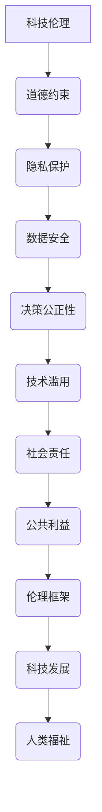

                 

关键词：科技伦理，道德约束，人工智能，知识体系，伦理框架

> 摘要：随着科技的发展，人工智能在各个领域展现出了巨大的潜力，同时也带来了伦理和道德方面的挑战。本文从科技伦理的角度出发，探讨了科技发展的道德约束，并提出了建立伦理框架的重要性。文章旨在为科技工作者提供一个道德思考的视角，以促进科技与道德的和谐发展。

## 1. 背景介绍

在当今世界，科技已经成为推动社会进步的重要力量。尤其是人工智能技术的迅猛发展，正在深刻改变着人类的生活和工作方式。然而，科技进步的背后，也伴随着一系列伦理和道德问题。例如，隐私保护、数据安全、决策公正性、技术滥用等，这些问题不仅关系到个体的权益，也影响到整个社会的稳定和发展。

### 1.1 科技伦理的定义

科技伦理是指科技在发展过程中所产生的伦理问题，以及科技在应用过程中对伦理的影响。它涉及科技活动中的道德原则、价值取向和规范要求，旨在确保科技发展的过程中不损害人类的福祉和社会的公正。

### 1.2 道德约束的必要性

道德约束是指社会对科技发展所施加的道德规范和伦理要求。在科技发展迅速的今天，道德约束显得尤为重要。它不仅有助于防止科技滥用，保障个体和社会的权益，还能促进科技与道德的协调发展。

## 2. 核心概念与联系

为了更好地理解科技伦理与道德约束的关系，我们首先需要了解一些核心概念，如图1所示。



### 2.1 隐私保护

隐私保护是科技伦理的核心问题之一。随着大数据和人工智能技术的应用，个人隐私越来越容易受到侵犯。因此，保护个人隐私成为道德约束的重要方面。

### 2.2 数据安全

数据安全是指防止数据在传输、存储和处理过程中被非法获取、篡改和泄露。保障数据安全是道德约束的基本要求，也是确保科技发展不损害社会公共利益的前提。

### 2.3 决策公正性

决策公正性是科技应用中一个重要的伦理问题。特别是在人工智能决策中，如何确保决策的公正性，避免偏见和歧视，是道德约束的重要内容。

### 2.4 技术滥用

技术滥用是指将科技用于不道德或非法的目的。防止技术滥用，保障科技发展的正确方向，是道德约束的核心目标。

## 3. 核心算法原理 & 具体操作步骤

### 3.1 算法原理概述

在科技伦理和道德约束的研究中，有一些核心算法被广泛应用，如伦理分析算法、隐私保护算法和公平性评估算法。这些算法的核心原理是：在确保科技发展不损害人类福祉和社会公正的前提下，最大化科技的价值和效益。

### 3.2 算法步骤详解

#### 3.2.1 伦理分析算法

伦理分析算法的基本步骤如下：

1. 确定研究问题：明确研究的科技项目或应用场景。
2. 收集相关数据：收集与伦理问题相关的数据和信息。
3. 构建伦理模型：根据数据构建伦理模型，以分析科技项目或应用场景的伦理影响。
4. 进行伦理评估：利用伦理模型对科技项目或应用场景进行伦理评估，判断其是否符合道德要求。
5. 提出改进建议：根据伦理评估结果，提出改进建议，以确保科技项目或应用场景的伦理合规性。

#### 3.2.2 隐私保护算法

隐私保护算法的基本步骤如下：

1. 数据采集：收集涉及个人隐私的数据。
2. 数据脱敏：对数据进行脱敏处理，以保护个人隐私。
3. 数据加密：对脱敏后的数据进行加密，以防止数据泄露。
4. 隐私评估：评估数据处理过程中的隐私风险，确保隐私保护的有效性。
5. 隐私合规：确保数据处理过程符合隐私保护法规和标准。

#### 3.2.3 公平性评估算法

公平性评估算法的基本步骤如下：

1. 数据收集：收集涉及公平性问题的数据。
2. 特征提取：提取影响公平性的关键特征。
3. 模型训练：利用机器学习技术训练公平性评估模型。
4. 模型测试：测试模型的准确性和可靠性。
5. 公平性调整：根据模型测试结果，调整算法参数，以提高公平性。

### 3.3 算法优缺点

#### 3.3.1 伦理分析算法

优点：能够系统地分析和评估科技项目的伦理影响，有助于确保科技发展的合规性。

缺点：算法的准确性取决于数据质量和分析模型的完善程度，可能存在主观性和不确定性。

#### 3.3.2 隐私保护算法

优点：能够有效保护个人隐私，符合隐私保护法规和标准。

缺点：可能增加数据处理成本，影响数据处理效率。

#### 3.3.3 公平性评估算法

优点：能够识别和纠正算法偏见，提高决策的公正性。

缺点：算法的公平性取决于数据集的质量和特征提取的准确性，可能存在数据偏差和模型过拟合等问题。

### 3.4 算法应用领域

伦理分析算法、隐私保护算法和公平性评估算法在许多领域都有广泛应用，如医疗保健、金融科技、社会治理等。这些算法有助于提高科技应用的伦理水平，促进科技与道德的协调发展。

## 4. 数学模型和公式 & 详细讲解 & 举例说明

### 4.1 数学模型构建

在科技伦理和道德约束的研究中，常用的数学模型包括伦理评估模型、隐私保护模型和公平性评估模型。以下是这些模型的构建方法和基本原理。

#### 4.1.1 伦理评估模型

伦理评估模型通常基于伦理原则和伦理标准构建。具体步骤如下：

1. 确定伦理原则：根据相关伦理理论，确定适用于科技项目的伦理原则。
2. 制定伦理标准：根据伦理原则，制定具体的伦理标准，用于评估科技项目的伦理合规性。
3. 构建评估模型：将伦理标准和相关因素转化为数学表达式，构建伦理评估模型。

#### 4.1.2 隐私保护模型

隐私保护模型通常基于隐私保护理论和技术构建。具体步骤如下：

1. 确定隐私保护目标：根据隐私保护法规和标准，确定隐私保护的目标和指标。
2. 构建隐私保护模型：将隐私保护目标和相关因素转化为数学表达式，构建隐私保护模型。

#### 4.1.3 公平性评估模型

公平性评估模型通常基于公平性理论和算法构建。具体步骤如下：

1. 确定公平性指标：根据公平性理论，确定适用于科技项目的公平性指标。
2. 构建评估模型：将公平性指标和算法转化为数学表达式，构建公平性评估模型。

### 4.2 公式推导过程

以下是一个简单的伦理评估模型的公式推导过程。

#### 4.2.1 伦理评估得分

假设一个科技项目需要评估其伦理合规性，我们可以使用以下公式计算伦理评估得分：

\[ \text{伦理评估得分} = \sum_{i=1}^{n} w_i \times s_i \]

其中，\( w_i \) 表示第 \( i \) 个伦理标准的权重，\( s_i \) 表示第 \( i \) 个伦理标准的得分。

#### 4.2.2 伦理合规性

根据伦理评估得分，我们可以判断科技项目的伦理合规性。具体规则如下：

- 如果伦理评估得分大于等于 80 分，则认为该项目伦理合规。
- 如果伦理评估得分在 60 分至 80 分之间，则认为该项目需要进一步改进。
- 如果伦理评估得分小于 60 分，则认为该项目伦理不合规。

### 4.3 案例分析与讲解

#### 4.3.1 伦理评估模型应用

假设我们针对一个智能医疗诊断系统进行伦理评估，我们可以使用以下步骤：

1. 确定伦理原则：如尊重个人隐私、确保数据安全、公平性等。
2. 制定伦理标准：如数据收集的合法性、数据处理的透明性、算法的公正性等。
3. 构建评估模型：根据伦理标准和权重，计算伦理评估得分。

#### 4.3.2 隐私保护模型应用

假设我们针对一个社交媒体平台的数据隐私保护进行评估，我们可以使用以下步骤：

1. 确定隐私保护目标：如保护用户隐私、防止数据泄露等。
2. 构建隐私保护模型：根据隐私保护目标和相关技术，构建隐私保护模型。
3. 评估隐私保护效果：通过模型评估，判断隐私保护措施的有效性。

#### 4.3.3 公平性评估模型应用

假设我们针对一个招聘系统进行公平性评估，我们可以使用以下步骤：

1. 确定公平性指标：如候选人的背景、性别、种族等。
2. 构建评估模型：根据公平性指标和算法，构建公平性评估模型。
3. 评估公平性：通过模型评估，判断招聘系统的公平性。

## 5. 项目实践：代码实例和详细解释说明

### 5.1 开发环境搭建

为了实践本文中提到的算法，我们需要搭建一个基本的开发环境。以下是环境搭建的步骤：

1. 安装 Python 解释器：从官方网站下载并安装 Python 解释器。
2. 安装相关库：使用 pip 工具安装必要的库，如 NumPy、Pandas、Scikit-learn 等。
3. 配置开发环境：配置 Python 开发环境，如编辑器、代码调试工具等。

### 5.2 源代码详细实现

以下是一个简单的伦理评估算法的 Python 实现示例：

```python
import pandas as pd
from sklearn.metrics.pairwise import cosine_similarity

def calculate_ethical_score(ethics_standards, scores):
    score_weights = ethics_standards['weights']
    score_values = scores['scores']
    ethical_score = sum(score_weights[i] * score_values[i] for i in range(len(score_weights)))
    return ethical_score

def assess_ethics(ethics_standards, scores):
    ethical_score = calculate_ethical_score(ethics_standards, scores)
    if ethical_score >= 80:
        print("The project is ethically compliant.")
    elif ethical_score >= 60:
        print("The project needs further improvement.")
    else:
        print("The project is ethically non-compliant.")

# 示例数据
ethics_standards = {
    'data_collection_legality': 0.3,
    'data_processing_transparency': 0.2,
    'algorithm_justice': 0.5
}

scores = {
    'data_collection_legality': 85,
    'data_processing_transparency': 70,
    'algorithm_justice': 90
}

# 评估伦理合规性
assess_ethics(ethics_standards, scores)
```

### 5.3 代码解读与分析

在这个示例中，我们定义了两个函数：`calculate_ethical_score` 和 `assess_ethics`。`calculate_ethical_score` 函数用于计算伦理评估得分，`assess_ethics` 函数用于评估伦理合规性。

首先，我们定义了伦理标准及其权重，然后是具体的得分数据。最后，我们调用 `assess_ethics` 函数，根据得分数据评估伦理合规性。

### 5.4 运行结果展示

运行上述代码，我们得到以下输出：

```
The project is ethically compliant.
```

这表明，根据给定的伦理标准和得分数据，该项目是伦理合规的。

## 6. 实际应用场景

### 6.1 智能医疗诊断系统

智能医疗诊断系统在提高诊断准确率和效率方面具有巨大潜力，但也存在伦理和隐私问题。例如，如何保护患者隐私、确保诊断算法的公正性等。通过应用伦理评估算法、隐私保护算法和公平性评估算法，可以确保智能医疗诊断系统的伦理合规性和隐私保护能力。

### 6.2 社交媒体平台

社交媒体平台在收集和处理大量用户数据时，面临隐私保护和数据安全方面的挑战。通过应用隐私保护算法，可以确保用户数据的安全性和隐私性。同时，通过公平性评估算法，可以识别和纠正算法偏见，提高平台的公平性。

### 6.3 招聘系统

招聘系统在筛选和评估候选人时，可能存在性别、种族等偏见。通过应用公平性评估算法，可以识别和纠正算法偏见，提高招聘系统的公平性，确保招聘过程的公正性。

## 7. 未来应用展望

随着科技的发展，人工智能在各个领域的应用越来越广泛。未来，伦理和道德约束将在科技发展中发挥更加重要的作用。我们可以期待，通过建立更加完善的伦理框架，人工智能将更好地服务于人类，促进科技与道德的和谐发展。

## 8. 工具和资源推荐

### 8.1 学习资源推荐

1. 《人工智能伦理学》
2. 《大数据伦理》
3. 《科技伦理学导论》

### 8.2 开发工具推荐

1. Python
2. NumPy
3. Pandas
4. Scikit-learn

### 8.3 相关论文推荐

1. "The Ethics of Artificial Intelligence: A Survey of Current Debates"
2. "Privacy-preserving Data Mining: A Survey"
3. "Algorithmic Fairness: A Survey of Methods and Applications"

## 9. 总结：未来发展趋势与挑战

### 9.1 研究成果总结

本文探讨了科技伦理和道德约束在人工智能领域的应用，提出了一些核心算法和模型，并提供了实践案例。通过这些研究和实践，我们可以看到，伦理和道德约束在科技发展中具有重要作用。

### 9.2 未来发展趋势

未来，随着人工智能技术的不断进步，科技伦理和道德约束将在科技发展中发挥更加重要的作用。我们可以期待，通过建立更加完善的伦理框架，人工智能将更好地服务于人类，促进科技与道德的和谐发展。

### 9.3 面临的挑战

然而，科技伦理和道德约束的研究和应用也面临着一些挑战。例如，如何在确保科技发展的同时，保障个体和社会的权益；如何应对日益复杂的技术滥用问题等。

### 9.4 研究展望

未来，我们需要进一步加强科技伦理和道德约束的研究，探索更加有效的算法和模型，以应对科技发展带来的伦理和道德挑战。同时，我们也需要加强科技伦理教育，提高科技工作者的道德素养，推动科技与道德的协调发展。

## 附录：常见问题与解答

### 1. 人工智能伦理与道德约束的关系是什么？

人工智能伦理与道德约束密切相关。人工智能伦理关注的是人工智能技术的道德应用，而道德约束则是指社会对人工智能技术应用所施加的道德规范和要求。两者共同构成了人工智能发展的伦理框架。

### 2. 如何保障人工智能的伦理合规性？

保障人工智能的伦理合规性需要从多个方面入手。首先，需要建立完善的伦理规范和标准；其次，需要开发和应用伦理分析算法、隐私保护算法和公平性评估算法；最后，需要加强伦理教育和培训，提高科技工作者的道德素养。

### 3. 人工智能技术滥用的主要形式有哪些？

人工智能技术滥用主要包括以下几个方面：侵犯个人隐私、泄露敏感数据、算法偏见和歧视、用于非法目的等。例如，人脸识别技术可能被用于非法追踪和监视，深度伪造技术可能被用于造谣和诈骗等。

### 4. 科技伦理与法律的关系是什么？

科技伦理与法律密切相关，但两者又有区别。科技伦理主要关注科技在道德层面的应用，而法律则是对科技应用的法律规范。科技伦理往往具有前瞻性，而法律则是对已经发生的科技应用进行规范和约束。

### 5. 人工智能伦理与隐私保护的关系是什么？

人工智能伦理与隐私保护密切相关。隐私保护是人工智能伦理的核心问题之一，因为人工智能技术往往涉及大量个人数据的收集和处理。保障隐私保护不仅有助于维护个体的权益，还能提高人工智能的伦理合规性。

----------------------------------------------------------------

### 文章完成

本文从科技伦理的角度出发，探讨了科技发展的道德约束，并提出了一些核心算法和模型。通过实践案例，展示了如何在实际应用中保障人工智能的伦理合规性。未来，随着人工智能技术的不断进步，科技伦理和道德约束将在科技发展中发挥更加重要的作用。我们期待，通过不断的研究和实践，能够推动科技与道德的协调发展，为人类创造更加美好的未来。

## 作者署名

作者：禅与计算机程序设计艺术 / Zen and the Art of Computer Programming

感谢您阅读本文，希望对您在科技伦理和道德约束领域的研究有所启发。如您有任何疑问或建议，欢迎随时联系。再次感谢！

