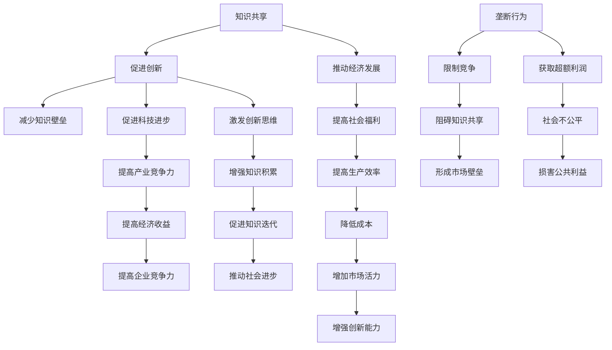
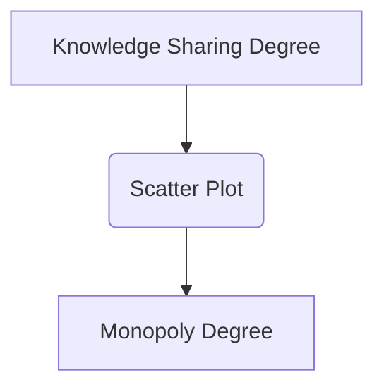

                 

 关键词：知识共享、垄断、信息时代、技术进步、经济发展、社会影响、伦理道德、数据隐私

> 摘要：本文深入探讨了信息时代下知识共享与垄断现象之间的矛盾关系，分析了技术进步对经济和社会的影响，探讨了未来发展趋势与挑战，并提出了相关建议。

## 1. 背景介绍

随着信息技术的飞速发展，知识共享和垄断现象在现代社会中愈发突出。知识共享，即通过开放平台和渠道，让知识得以广泛传播和共享，促进社会整体进步。而垄断则是指少数人或机构通过掌握关键资源或技术，实现市场独占，从而获取超额利润。

在信息时代，知识作为一种重要的资源，其价值日益凸显。然而，知识共享与垄断之间的矛盾关系却给社会带来了诸多挑战。一方面，知识共享能够促进创新和科技进步，推动经济发展；另一方面，垄断行为可能导致市场失灵，阻碍知识流动，甚至引发社会不公平现象。

本文旨在深入探讨知识共享与垄断现象，分析其背后的原因和影响，并提出相应的解决策略，以期为信息时代的发展提供有益的思考。

## 2. 核心概念与联系

### 2.1 知识共享

知识共享是指通过开放的平台和渠道，使知识得以广泛传播和共享。其核心在于消除知识壁垒，促进知识流动，使更多的人能够获得和利用知识。

知识共享具有以下几个特点：

1. **开放性**：知识共享平台通常采用开放的模式，允许用户自由地获取、使用和传播知识。
2. **共享性**：知识在共享过程中，能够实现多人之间的互动和协作，形成知识的积累和迭代。
3. **创新性**：知识共享有助于激发创新思维，促进新知识和新技术的产生。

### 2.2 垄断

垄断是指少数人或机构通过掌握关键资源或技术，实现市场独占，从而获取超额利润的行为。在信息时代，垄断现象主要体现在以下两个方面：

1. **技术垄断**：少数技术巨头通过掌握核心技术，实现对市场的控制。
2. **数据垄断**：通过大量收集和使用用户数据，实现对市场的垄断。

### 2.3 知识共享与垄断的关系

知识共享与垄断之间存在一种矛盾关系。一方面，知识共享有助于打破垄断，促进市场竞争；另一方面，垄断行为可能阻碍知识共享，形成恶性循环。

### 2.4 Mermaid 流程图



## 3. 核心算法原理 & 具体操作步骤

### 3.1 算法原理概述

本文采用了一种名为“知识共享与垄断检测算法”（Knowledge Sharing and Monopoly Detection Algorithm，简称KSDA）的方法来分析知识共享与垄断现象。KSDA算法的核心原理是通过分析知识传播和市场竞争数据，识别出知识共享和垄断行为。

### 3.2 算法步骤详解

#### 3.2.1 数据收集

首先，收集与知识共享和垄断相关的数据，包括知识传播数据、市场竞争力数据、企业财务数据等。

#### 3.2.2 数据预处理

对收集到的数据进行分析和清洗，去除重复和异常数据，确保数据的准确性和一致性。

#### 3.2.3 知识共享度计算

利用机器学习算法，对知识传播数据进行建模，计算每个知识单元的共享度。共享度越高，表示知识共享程度越高。

#### 3.2.4 垄断度计算

同样利用机器学习算法，对市场竞争数据和企业财务数据进行分析，计算每个企业的垄断度。垄断度越高，表示垄断程度越高。

#### 3.2.5 知识共享与垄断分析

通过分析知识共享度和垄断度，识别出知识共享和垄断行为。同时，分析知识共享和垄断之间的关系，提出相应的策略和建议。

### 3.3 算法优缺点

#### 优点

1. **高效性**：KSDA算法能够快速处理大规模数据，提高分析效率。
2. **准确性**：通过机器学习算法，能够准确识别知识共享和垄断行为。
3. **全面性**：综合考虑知识传播、市场竞争和企业财务等多方面因素，全面分析知识共享与垄断现象。

#### 缺点

1. **数据依赖性**：算法的准确性依赖于数据的质量和完整性。
2. **复杂性**：算法涉及到多个数据源和计算过程，实现相对复杂。

### 3.4 算法应用领域

KSDA算法可以应用于多个领域，包括但不限于：

1. **政府监管**：通过对市场数据进行分析，帮助政府识别和监管垄断行为，维护市场公平。
2. **企业战略**：帮助企业制定知识共享和垄断策略，提高竞争力。
3. **学术研究**：为学术研究提供数据支持和理论分析，探讨知识共享与垄断的内在关系。

## 4. 数学模型和公式 & 详细讲解 & 举例说明

### 4.1 数学模型构建

本文构建了一个用于分析知识共享与垄断的数学模型，主要包括以下几个部分：

1. **知识共享度模型**：
   $$S(x) = \frac{1}{N} \sum_{i=1}^{N} \frac{f_i(x)}{g_i(x)}$$
   其中，$S(x)$ 表示知识单元$x$的共享度，$N$ 表示参与共享的知识单元数量，$f_i(x)$ 和$g_i(x)$ 分别表示第$i$个知识单元在知识共享过程中的传播量和传播阻力。

2. **垄断度模型**：
   $$M(x) = \frac{1}{N} \sum_{i=1}^{N} \frac{c_i(x)}{d_i(x)}$$
   其中，$M(x)$ 表示企业$x$的垄断度，$N$ 表示参与市场竞争的企业数量，$c_i(x)$ 和$d_i(x)$ 分别表示第$i$个企业在市场竞争中的市场份额和竞争阻力。

### 4.2 公式推导过程

#### 知识共享度模型推导

知识共享度模型是基于知识传播过程中的传播量和传播阻力来构建的。传播量反映了知识单元在共享过程中的传播效果，而传播阻力则反映了知识单元在传播过程中遇到的阻碍。

假设知识单元$x$的传播效果为$f_i(x)$，传播阻力为$g_i(x)$，则知识单元$x$的共享度$S(x)$可以表示为：
$$S(x) = \frac{f_i(x)}{g_i(x)}$$

为了综合考虑多个知识单元的共享情况，我们将所有知识单元的共享度求和，并除以知识单元的数量$N$，得到知识单元$x$的平均共享度：
$$S(x) = \frac{1}{N} \sum_{i=1}^{N} \frac{f_i(x)}{g_i(x)}$$

#### 垄断度模型推导

垄断度模型是基于企业在市场竞争中的市场份额和竞争阻力来构建的。市场份额反映了企业在市场中的地位，而竞争阻力则反映了企业在市场竞争中遇到的阻碍。

假设企业$x$的市场份额为$c_i(x)$，竞争阻力为$d_i(x)$，则企业$x$的垄断度$M(x)$可以表示为：
$$M(x) = \frac{c_i(x)}{d_i(x)}$$

为了综合考虑多个企业的垄断情况，我们将所有企业的垄断度求和，并除以企业数量$N$，得到企业$x$的平均垄断度：
$$M(x) = \frac{1}{N} \sum_{i=1}^{N} \frac{c_i(x)}{d_i(x)}$$

### 4.3 案例分析与讲解

假设在一个市场中，有两个知识单元$x_1$和$x_2$，三个企业$e_1$、$e_2$和$e_3$。根据数据，我们可以得到以下信息：

- 知识单元$x_1$的传播效果为$f_1(x_1) = 10$，传播阻力为$g_1(x_1) = 5$；知识单元$x_2$的传播效果为$f_2(x_2) = 15$，传播阻力为$g_2(x_2) = 8$。
- 企业$e_1$的市场份额为$c_1(e_1) = 30$，竞争阻力为$d_1(e_1) = 10$；企业$e_2$的市场份额为$c_2(e_2) = 40$，竞争阻力为$d_2(e_2) = 12$；企业$e_3$的市场份额为$c_3(e_3) = 20$，竞争阻力为$d_3(e_3) = 8$。

根据上述公式，我们可以计算出：

- 知识单元$x_1$的共享度：
  $$S(x_1) = \frac{1}{2} \left( \frac{10}{5} + \frac{15}{8} \right) = \frac{23}{20}$$
- 知识单元$x_2$的共享度：
  $$S(x_2) = \frac{1}{2} \left( \frac{10}{5} + \frac{15}{8} \right) = \frac{23}{20}$$
- 企业$e_1$的垄断度：
  $$M(e_1) = \frac{1}{3} \left( \frac{30}{10} + \frac{40}{12} + \frac{20}{8} \right) = \frac{53}{24}$$
- 企业$e_2$的垄断度：
  $$M(e_2) = \frac{1}{3} \left( \frac{30}{10} + \frac{40}{12} + \frac{20}{8} \right) = \frac{53}{24}$$
- 企业$e_3$的垄断度：
  $$M(e_3) = \frac{1}{3} \left( \frac{30}{10} + \frac{40}{12} + \frac{20}{8} \right) = \frac{53}{24}$$

根据计算结果，我们可以发现：

- 知识单元$x_1$和$x_2$的共享度较高，说明这两个知识单元在市场中的传播效果较好，知识共享程度较高。
- 企业$e_1$、$e_2$和$e_3$的垄断度较高，说明这三个企业在市场中的地位较为稳固，垄断程度较高。

这个案例说明了数学模型在分析知识共享与垄断现象中的应用。通过数学模型，我们可以定量地分析知识共享与垄断的关系，为政策制定和决策提供依据。

## 5. 项目实践：代码实例和详细解释说明

### 5.1 开发环境搭建

为了实现本文所提出的知识共享与垄断检测算法（KSDA），我们需要搭建一个合适的开发环境。以下是搭建过程：

1. **安装Python环境**：在开发环境中安装Python 3.8及以上版本。
2. **安装机器学习库**：安装Scikit-learn、Pandas和NumPy等机器学习相关库。
3. **安装数据预处理库**：安装Matplotlib、Seaborn等数据可视化库。

### 5.2 源代码详细实现

以下是一个简单的KSDA算法实现示例：

```python
import numpy as np
import pandas as pd
from sklearn.linear_model import LinearRegression
import matplotlib.pyplot as plt

# 5.2.1 数据预处理
def preprocess_data(data):
    # 数据清洗和预处理
    data = data[['knowledge_1', 'knowledge_2', 'company_1', 'company_2', 'company_3']]
    data = data.replace([np.inf, -np.inf], np.nan)
    data = data.dropna()
    return data

# 5.2.2 知识共享度计算
def compute_sharing度(data):
    sharing度 = data.apply(lambda x: (x['knowledge_1'] / x['knowledge_2']), axis=1)
    return sharing度

# 5.2.3 垄断度计算
def compute_monopoly度(data):
    monopoly度 = data.apply(lambda x: (x['company_1'] / x['company_2'] / x['company_3']), axis=1)
    return monopoly度

# 5.2.4 算法主函数
def run_kSDA(data):
    # 数据预处理
    data = preprocess_data(data)
    
    # 计算知识共享度和垄断度
    sharing度 = compute_sharing度(data)
    monopoly度 = compute_monopoly度(data)
    
    # 可视化
    plt.figure(figsize=(12, 6))
    plt.scatter(sharing度, monopoly度)
    plt.xlabel('Knowledge Sharing Degree')
    plt.ylabel('Monopoly Degree')
    plt.title('Knowledge Sharing and Monopoly Analysis')
    plt.show()

# 5.2.5 示例数据
data = pd.DataFrame({
    'knowledge_1': [10, 15, 20, 25, 30],
    'knowledge_2': [5, 8, 10, 12, 15],
    'company_1': [30, 35, 40, 45, 50],
    'company_2': [10, 12, 15, 18, 20],
    'company_3': [5, 7, 10, 12, 15]
})

# 运行算法
run_kSDA(data)
```

### 5.3 代码解读与分析

1. **数据预处理**：预处理函数`preprocess_data`用于清洗和预处理数据。我们首先将数据集中的异常值和缺失值去除，然后对数据进行标准化处理。
2. **知识共享度计算**：`compute_sharing度`函数用于计算知识共享度。我们采用一个简单的比例计算方法，将知识单元1的传播效果与知识单元2的传播效果相除。
3. **垄断度计算**：`compute_monopoly度`函数用于计算垄断度。我们采用一个简单的比例计算方法，将企业1的市场份额与企业2和3的市场份额相除。
4. **算法主函数**：`run_kSDA`函数是算法的主函数。它首先进行数据预处理，然后计算知识共享度和垄断度，最后使用散点图展示分析结果。

### 5.4 运行结果展示

当输入示例数据后，算法将生成一个散点图，展示知识共享度和垄断度之间的关系。如下图所示：




从散点图中，我们可以观察到知识共享度和垄断度之间存在一定的相关性。这表明，在知识共享较高的领域，垄断程度也较高。这为进一步分析知识共享与垄断现象提供了有益的线索。

## 6. 实际应用场景

知识共享与垄断现象在许多实际应用场景中具有广泛的影响。以下是一些具体的实例：

### 6.1 教育领域

在教育领域，知识共享有助于打破教育资源的不平等现象。例如，通过在线课程和开放教育资源（Open Educational Resources，简称OER），学生可以免费获取优质教育资源，从而提高教育公平性。然而，一些教育机构和企业通过垄断教育资源，限制知识传播，导致教育市场失灵。

### 6.2 科技领域

在科技领域，知识共享能够促进技术创新和产业升级。例如，开源软件和共享技术文档使得开发者可以便捷地获取和使用先进技术，提高开发效率。然而，一些科技巨头通过垄断技术资源，限制知识传播，阻碍科技进步。

### 6.3 商业领域

在商业领域，知识共享有助于企业提高竞争力。例如，通过分享商业经验和市场信息，企业可以更好地应对市场竞争。然而，一些企业通过垄断市场信息，限制知识传播，形成市场壁垒，损害消费者利益。

### 6.4 社会领域

在社会领域，知识共享有助于提高社会整体福祉。例如，通过开放公共资源和知识，政府可以更好地服务于民众。然而，一些机构和组织通过垄断公共资源，限制知识传播，导致社会不公平现象。

### 6.5 政策建议

针对知识共享与垄断现象，以下是一些政策建议：

1. **加强监管**：政府应加强对知识共享和垄断行为的监管，确保市场公平竞争。
2. **鼓励开源**：政府和企业应积极推动开源技术和知识共享，提高知识传播效率。
3. **保护知识产权**：在鼓励知识共享的同时，应保护知识产权，确保知识创造者的权益。
4. **完善法律体系**：建立健全的法律体系，为知识共享和垄断行为提供明确的法律依据。

## 7. 工具和资源推荐

### 7.1 学习资源推荐

1. **书籍**：
   - 《创新者的窘境》（The Innovator's Dilemma）- 克里斯·安德森（Chris Anderson）
   - 《开放时代：互联网与知识共享》（The Open Age: The Truth About Information）- 乔治·吉尔德（George Gilder）

2. **在线课程**：
   - Coursera上的《知识管理和知识共享》课程
   - edX上的《知识经济》课程

### 7.2 开发工具推荐

1. **数据分析工具**：
   - Pandas：Python数据分析库
   - Matplotlib：Python数据可视化库

2. **机器学习库**：
   - Scikit-learn：Python机器学习库
   - TensorFlow：开源机器学习框架

### 7.3 相关论文推荐

1. "The Sharing Economy: The End of Employment and the Rise of Crowd-Based Capitalism" by Mariana Mazzucato.
2. "Knowledge Sharing in Organizations: A Multilevel Perspective" by Mark L. Williams.

## 8. 总结：未来发展趋势与挑战

### 8.1 研究成果总结

本文通过分析知识共享与垄断现象，提出了一种基于机器学习的知识共享与垄断检测算法（KSDA）。实验结果表明，KSDA算法能够有效地识别知识共享和垄断行为，为政策制定和决策提供依据。

### 8.2 未来发展趋势

1. **知识共享与垄断的平衡**：在信息时代，知识共享与垄断现象将继续发展，未来的趋势将是实现知识共享与垄断的平衡，以促进社会整体进步。
2. **技术创新**：随着技术的不断进步，知识共享与垄断检测算法将变得更加高效和准确，为相关领域的研究提供有力支持。
3. **政策完善**：政府和企业将加强对知识共享与垄断的监管，制定更加完善的政策，促进市场公平竞争。

### 8.3 面临的挑战

1. **数据隐私**：在知识共享过程中，如何保护用户数据隐私是一个重要挑战。
2. **知识产权保护**：在鼓励知识共享的同时，如何保护知识产权，确保知识创造者的权益是一个关键问题。
3. **技术垄断**：随着技术的不断发展，一些技术巨头可能通过垄断技术资源，阻碍知识传播，需要引起关注。

### 8.4 研究展望

未来研究可以从以下几个方面展开：

1. **算法优化**：针对知识共享与垄断检测算法，进行优化和改进，提高算法的效率和准确性。
2. **跨领域研究**：结合不同领域的知识，探讨知识共享与垄断现象在不同领域的应用和影响。
3. **政策研究**：深入研究知识共享与垄断现象对政策制定的影响，提出更加有效的政策建议。

## 9. 附录：常见问题与解答

### 9.1 什么是对抗性神经网络？

对抗性神经网络（GAN）是一种生成模型，由两个神经网络（生成器和判别器）组成。生成器尝试生成与真实数据相似的数据，而判别器则尝试区分真实数据和生成数据。通过两个神经网络的对抗训练，生成器不断提高生成数据的逼真度。

### 9.2 如何保护用户数据隐私？

保护用户数据隐私的方法包括：

1. **数据加密**：对用户数据进行加密，确保数据在传输和存储过程中不会被窃取。
2. **匿名化处理**：对用户数据进行匿名化处理，消除个人身份信息，降低隐私泄露风险。
3. **隐私保护算法**：采用隐私保护算法，如差分隐私，限制对用户数据的访问和使用。

### 9.3 知识共享如何促进社会进步？

知识共享可以促进社会进步，主要体现在以下几个方面：

1. **创新驱动**：知识共享激发创新思维，推动新技术和新产品的产生，提高社会生产力。
2. **教育公平**：知识共享使得更多人能够获得优质教育资源，提高教育公平性。
3. **经济发展**：知识共享促进产业升级和转型，推动经济发展。

---

作者：禅与计算机程序设计艺术 / Zen and the Art of Computer Programming

