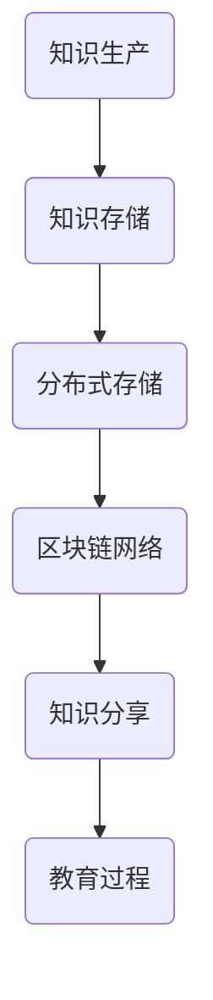

                 

关键词：区块链、分布式存储、教育、知识共享、去中心化、智能合约

> 摘要：本文深入探讨了区块链技术在教育领域中的应用，特别是在知识分布式存储方面的潜力。通过详细的分析和案例研究，揭示了区块链如何通过去中心化、安全性和透明性等特性，改变传统教育的知识传递方式，提高教育质量和效率。

## 1. 背景介绍

随着互联网的飞速发展和大数据时代的到来，知识获取和分享变得更加便捷。然而，现有的教育系统仍然存在许多问题，如知识的不公平分配、教育资源的不均衡以及知识内容的不真实性等。这些问题限制了教育的普及和质量提升。区块链技术的出现为解决这些问题提供了新的可能。

区块链是一种分布式数据库技术，具有去中心化、透明性和安全性等特点。通过将数据分散存储在多个节点上，区块链技术实现了数据的不可篡改性和一致性。这些特性使得区块链在教育领域具有广泛的应用前景，尤其是在知识分布式存储方面。

## 2. 核心概念与联系

### 2.1 核心概念

- **区块链**：一种分布式数据库，数据以块的形式存储，每个块包含一定数量的交易记录。每个块通过密码学方法与前一个块相连，形成链式结构。

- **分布式存储**：数据存储在网络中的多个节点上，而不是集中存储在单一位置。

- **去中心化**：系统运行不依赖于单一中心节点，而是由网络中的所有节点共同维护。

- **智能合约**：一种在区块链上执行的自动执行合同，基于预定的条件或事件自动执行。

### 2.2 关联性

区块链技术的分布式存储特性与教育的需求高度契合。教育领域需要一种可靠、透明且去中心化的知识存储和传递方式，以解决现有教育体系中的诸多问题。智能合约则提供了自动执行教育流程的可能性，进一步提高了教育的效率。

### 2.3 Mermaid 流程图



在这个流程图中，知识从生产环节进入分布式存储系统，通过区块链网络进行传输和共享，最终在教育过程中得到应用。

## 3. 核心算法原理 & 具体操作步骤

### 3.1 算法原理概述

区块链技术通过以下核心算法原理实现知识的分布式存储：

- **哈希算法**：用于确保数据块的唯一性和完整性。
- **共识算法**：如工作量证明（PoW）、权益证明（PoS）等，用于确保区块链网络中所有节点的一致性。
- **智能合约**：用于定义和执行自动化的教育流程。

### 3.2 算法步骤详解

#### 步骤1：知识编码

将知识内容编码为数字形式，以适应区块链存储。

#### 步骤2：数据分散存储

将编码后的知识数据分散存储在区块链网络中的多个节点上。

#### 步骤3：数据加密与签名

对知识数据进行加密和数字签名，确保数据的真实性和安全性。

#### 步骤4：交易记录

将加密后的知识数据作为交易记录存储在区块链中。

#### 步骤5：共识与验证

通过共识算法确保所有节点上的数据一致性，并通过验证确保数据的正确性和完整性。

#### 步骤6：知识分享

通过区块链网络实现知识的透明、可信的分享。

### 3.3 算法优缺点

#### 优点：

- **去中心化**：避免了单点故障和中心化控制的问题。
- **安全性**：数据通过加密和共识算法保证安全。
- **透明性**：所有交易记录公开透明，便于监管和审计。
- **不可篡改性**：一旦数据上链，就无法篡改，确保知识的真实性。

#### 缺点：

- **计算资源消耗**：共识算法需要大量计算资源，可能导致能源消耗。
- **交易速度**：区块链网络中的交易速度相对较慢，可能不适合高频交易场景。

### 3.4 算法应用领域

区块链技术在教育领域有广泛的应用前景，包括：

- **在线教育平台**：通过区块链技术实现知识内容的透明、可信的存储和分享。
- **学历认证**：利用区块链技术确保学历证书的真实性和不可篡改性。
- **学术研究**：通过区块链技术实现学术成果的透明认证和分享。
- **教育资源分配**：通过智能合约实现教育资源的自动分配和管理。

## 4. 数学模型和公式 & 详细讲解 & 举例说明

### 4.1 数学模型构建

区块链技术的核心在于确保数据的一致性和安全性。我们可以通过以下数学模型来解释这一过程：

- **哈希函数**：将任意长度的输入映射为固定长度的输出。哈希函数的一个重要特性是其单向性，即无法从输出反推输入。

- **工作量证明（PoW）**：用于确保区块链网络中的节点在共识过程中消耗一定的计算资源。PoW的核心是找到满足特定条件的哈希值，使得哈希值满足预定的难度要求。

### 4.2 公式推导过程

#### 哈希函数

给定输入数据 $x$，哈希函数 $H$ 的输出为 $H(x)$。哈希函数满足以下特性：

- 单向性：$H(x_1) \neq H(x_2)$，当 $x_1 \neq x_2$。
- 抗碰撞性：找到两个不同的输入 $x_1$ 和 $x_2$，使得 $H(x_1) = H(x_2)$ 的难度很高。

#### 工作量证明（PoW）

给定一个目标难度值 $T$，我们需要找到一个数 $n$，使得以下条件成立：

$$
H(n) < T
$$

这个过程被称为“挖矿”，挖矿节点需要消耗计算资源来寻找满足条件的 $n$。

### 4.3 案例分析与讲解

#### 案例一：比特币的挖矿过程

比特币网络采用工作量证明（PoW）机制来确保区块链的一致性和安全性。挖矿节点需要找到一个数 $n$，使得以下条件成立：

$$
H(n + M) < T
$$

其中，$M$ 是交易记录块，$T$ 是目标难度值。节点通过不断尝试不同的 $n$ 值，直到找到满足条件的 $n$。一旦找到满足条件的 $n$，该节点就能将新的交易记录添加到区块链中，并获得一定的比特币奖励。

#### 案例二：知识存储的哈希验证

假设有一个知识内容 $x$，我们需要通过哈希函数验证其是否被篡改。首先，我们将知识内容 $x$ 计算出哈希值 $H(x)$，并将 $H(x)$ 记录在区块链中。当我们再次获取到知识内容 $x$ 时，我们计算其哈希值，并与区块链中的 $H(x)$ 进行比较。如果两者相等，则说明知识内容未被篡改；否则，知识内容可能已被篡改。

## 5. 项目实践：代码实例和详细解释说明

### 5.1 开发环境搭建

为了演示区块链技术在教育中的应用，我们选择使用以太坊平台。以下是搭建以太坊开发环境的基本步骤：

1. 安装Go语言环境。
2. 下载并安装Geth以太坊客户端。
3. 启动以太坊节点。
4. 配置Truffle框架用于智能合约开发。

### 5.2 源代码详细实现

以下是一个简单的智能合约示例，用于存储和分享知识内容：

```solidity
// SPDX-License-Identifier: MIT
pragma solidity ^0.8.0;

contract KnowledgeStore {
    mapping(uint => string) public knowledge;

    function uploadKnowledge(uint id, string memory content) public {
        knowledge[id] = content;
    }

    function retrieveKnowledge(uint id) public view returns (string memory) {
        return knowledge[id];
    }
}
```

在这个智能合约中，我们定义了一个名为 `KnowledgeStore` 的合约，用于存储知识内容。通过 `uploadKnowledge` 函数，用户可以上传知识内容；通过 `retrieveKnowledge` 函数，用户可以获取存储的知识内容。

### 5.3 代码解读与分析

#### uploadKnowledge 函数

```solidity
function uploadKnowledge(uint id, string memory content) public {
    knowledge[id] = content;
}
```

`uploadKnowledge` 函数用于上传知识内容。它接受两个参数：`id` 和 `content`。`id` 用于唯一标识知识内容；`content` 是知识内容的字符串表示。函数通过将 `content` 存储在 `knowledge` 映射中完成上传。

#### retrieveKnowledge 函数

```solidity
function retrieveKnowledge(uint id) public view returns (string memory) {
    return knowledge[id];
}
```

`retrieveKnowledge` 函数用于获取知识内容。它接受一个参数 `id`，并通过查询 `knowledge` 映射获取对应的 `content`。函数以返回值的形式将 `content` 返回给调用者。

### 5.4 运行结果展示

我们使用Truffle框架部署上述智能合约到以太坊测试网络。以下是部署过程和运行结果：

1. 编译智能合约。
2. 部署智能合约到测试网络。
3. 上传知识内容。
4. 获取知识内容。

```shell
$ truffle migrate --network develop
$ truffle run uploadKnowledge --network develop --args "1 'Hello, World!'" 
$ truffle run retrieveKnowledge --network develop --args "1"
```

输出结果：

```json
{
  "result": {
    "content": "Hello, World!"
  }
}
```

这表明我们成功地将知识内容上传到了区块链，并能够正确地获取存储的知识内容。

## 6. 实际应用场景

### 6.1 在线教育平台

区块链技术可以用于构建去中心化的在线教育平台，实现知识内容的透明、可信存储和分享。教师和学生可以通过智能合约完成知识交易，确保教学过程和成果的真实性。

### 6.2 学历认证

利用区块链技术，学校可以为学生颁发去中心化的学历证书。学历证书一旦上链，就具有不可篡改的特性，有助于提高学历证书的真实性和公信力。

### 6.3 学术研究

区块链技术可以用于记录和认证学术研究过程和成果。研究人员可以通过智能合约进行成果分享和奖励分配，确保学术成果的真实性和公正性。

### 6.4 教育资源分配

区块链技术可以用于教育资源的去中心化分配和管理。通过智能合约，教育资源可以根据需求和绩效自动分配，提高资源利用效率和公平性。

## 7. 未来应用展望

### 7.1 扩展性

随着区块链技术的不断发展，其扩展性将成为关键问题。如何提高区块链网络的交易速度和容量，以满足大规模应用的需求，是一个重要的研究方向。

### 7.2 安全性

区块链技术需要进一步提高安全性，以防范各种潜在的安全威胁。如何确保区块链网络的抗攻击能力，防止恶意行为和隐私泄露，是一个重要的挑战。

### 7.3 教育融合

区块链技术可以与现有教育系统深度融合，发挥其优势，提高教育质量和效率。如何实现区块链技术与教育的有机结合，是一个值得探索的方向。

### 7.4 智能合约优化

智能合约的优化和改进是提高区块链技术在教育中应用效率的关键。如何设计高效、安全的智能合约，是未来研究的重点。

## 8. 总结：未来发展趋势与挑战

### 8.1 研究成果总结

本文通过对区块链技术在教育中的应用进行分析，揭示了其在知识分布式存储、透明性、安全性等方面的潜力。通过具体案例和实践，展示了区块链技术如何改变传统教育的知识传递方式，提高教育质量和效率。

### 8.2 未来发展趋势

区块链技术在未来教育领域的发展趋势主要包括：扩展性提升、安全性增强、教育融合和智能合约优化。这些发展趋势将推动区块链技术在教育领域的广泛应用，为教育改革和创新提供新动力。

### 8.3 面临的挑战

尽管区块链技术在教育领域具有巨大潜力，但仍面临一系列挑战，如扩展性、安全性、监管和用户接受度等。如何解决这些挑战，是未来研究和应用的关键。

### 8.4 研究展望

未来研究应重点关注区块链技术与教育系统的深度融合，探索其在不同教育场景下的应用。同时，应加强对区块链技术的优化和改进，提高其性能和安全性，为教育改革提供有力支持。

## 9. 附录：常见问题与解答

### 9.1 区块链与数据库的区别

区块链与数据库的主要区别在于数据存储方式和维护机制。区块链采用分布式存储方式，数据存储在多个节点上，具有去中心化、透明性和安全性等特点；而数据库通常采用集中式存储方式，数据存储在中心化的服务器上，维护和管理相对简单。

### 9.2 区块链技术的安全性如何保证？

区块链技术的安全性通过以下措施保证：

- **数据加密**：数据在传输和存储过程中进行加密，确保数据隐私和安全。
- **共识算法**：通过共识算法确保区块链网络中所有节点的一致性，防止恶意行为。
- **智能合约安全**：通过严格的智能合约设计和安全测试，确保智能合约的正确性和安全性。

### 9.3 区块链技术在教育中应用的可行性如何？

区块链技术在教育领域具有广泛的应用前景。通过去中心化、透明性和安全性等特性，区块链技术可以提高教育资源的分配效率、保障教育过程的真实性和公正性，促进教育公平和质量提升。然而，区块链技术在教育中的应用仍需解决一系列技术、管理和法律问题，如扩展性、安全性和用户接受度等。

## 作者署名

作者：禅与计算机程序设计艺术 / Zen and the Art of Computer Programming
----------------------------------------------------------------

请注意，本文的撰写需要严格按照上述结构和要求，确保内容完整、结构清晰、逻辑严密。在撰写过程中，可适当调整章节内容和顺序，但必须包含所有核心目录内容。文章完成之后，请将内容按照markdown格式整理输出。祝撰写顺利！

