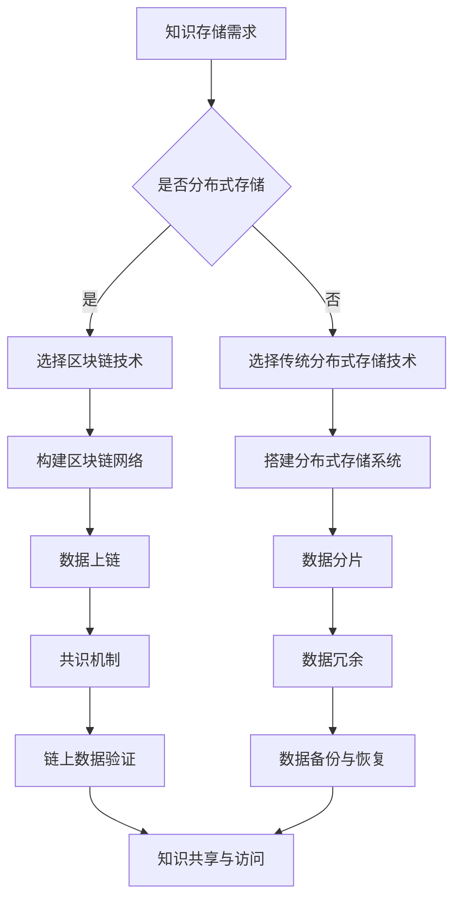

                 

关键词：知识存储、分布式存储、区块链技术、知识共享、去中心化、安全性、透明性

> 摘要：本文将探讨如何利用区块链技术实现知识的分布式存储，分析其优势、核心概念和算法原理，并提供实际项目案例和未来应用展望。文章旨在为读者提供一个全面了解和深入思考区块链在知识存储领域的应用视角。

## 1. 背景介绍

在当今的信息化时代，数据已成为新的生产资料，知识的价值愈发凸显。传统的集中式存储方式虽然提供了较高的数据访问速度和可靠性，但存在着诸多局限性，如单点故障、数据不透明、易篡改等问题。随着互联网的发展，人们越来越关注数据的安全性和隐私保护，而分布式存储技术以其去中心化、高可用性、透明性等特点，逐渐成为解决这些问题的有效手段。

区块链技术作为一种分布式账本技术，具有去中心化、不可篡改、透明性等特性，使其在知识存储领域具有巨大的潜力。本文将详细探讨区块链技术如何实现知识的分布式存储，分析其优势和应用场景，为区块链在知识存储领域的未来发展提供参考。

## 2. 核心概念与联系

### 2.1 区块链技术概述

区块链技术是一种分布式数据库技术，通过将数据分散存储在网络中的多个节点上，实现数据的去中心化。每个区块包含一定数量的交易记录，多个区块按照时间顺序链接形成区块链。

### 2.2 分布式存储

分布式存储是指将数据分散存储在多个物理节点上，通过分布式算法实现数据的存储、访问和管理。分布式存储具有高可用性、高扩展性、数据冗余和容错等特点。

### 2.3 知识存储

知识存储是指将各种形式的知识（如文档、图像、音频、视频等）进行数字化，并通过一定的存储和管理方式保存下来，以便于查询、使用和共享。

### 2.4 区块链与分布式存储的联系

区块链技术是一种特殊的分布式存储技术，它通过加密算法和共识机制，实现了数据的安全、可靠和透明。区块链在知识存储中的应用，可以解决传统存储方式的诸多问题，提升知识的共享和利用效率。

### 2.5 Mermaid 流程图



## 3. 核心算法原理 & 具体操作步骤

### 3.1 算法原理概述

区块链技术的核心算法主要包括哈希函数、加密算法和共识机制。哈希函数用于生成数据摘要，加密算法用于保护数据隐私，共识机制确保网络中的数据一致性。

### 3.2 算法步骤详解

#### 3.2.1 数据上链

1. 将知识数据转化为区块链可识别的格式，如JSON。
2. 使用哈希函数生成数据摘要。
3. 将数据摘要和原始数据存储在区块链上。

#### 3.2.2 共识机制

1. 网络中的节点对数据进行验证。
2. 达成共识后，将数据添加到区块中。
3. 区块按照时间顺序链接成区块链。

#### 3.2.3 数据访问与共享

1. 查询区块链，获取所需知识数据。
2. 使用加密算法对数据进行解密。
3. 将数据共享给授权用户。

### 3.3 算法优缺点

#### 3.3.1 优点

- 去中心化：数据分散存储，降低了单点故障的风险。
- 安全性：加密算法保护数据隐私，共识机制确保数据一致性和可靠性。
- 透明性：区块链上的所有交易记录公开透明，便于审计和监管。

#### 3.3.2 缺点

- 性能瓶颈：区块链的扩展性和性能受限于TPS（每秒交易次数）。
- 能耗问题：部分区块链技术（如比特币）在数据存储和处理过程中消耗大量能源。

### 3.4 算法应用领域

区块链技术在知识存储领域具有广泛的应用前景，如学术成果存储、知识产权保护、供应链管理、数字身份认证等。

## 4. 数学模型和公式 & 详细讲解 & 举例说明

### 4.1 数学模型构建

#### 4.1.1 数据摘要生成

数据摘要生成的数学模型为：

$$
H(D) = SHA256(D)
$$

其中，$H$表示哈希函数，$D$表示原始数据，$SHA256$表示256位的SHA哈希算法。

#### 4.1.2 数据加密

数据加密的数学模型为：

$$
E(D, K) = AES_D(D, K)
$$

其中，$E$表示加密函数，$D$表示原始数据，$K$表示密钥，$AES$表示高级加密标准。

### 4.2 公式推导过程

#### 4.2.1 数据摘要生成

$$
H(D) = SHA256(D)
$$

输入数据$D$经过SHA256算法处理后，生成一个256位的哈希值，作为数据摘要。

#### 4.2.2 数据加密

$$
E(D, K) = AES_D(D, K)
$$

输入数据$D$和密钥$K$，经过AES加密算法处理后，生成一个密文，确保数据在传输过程中的安全性。

### 4.3 案例分析与讲解

#### 4.3.1 数据摘要生成

假设原始数据$D$为：“区块链技术是一种分布式存储技术，具有去中心化、不可篡改、透明性等特点。”使用SHA256算法生成的数据摘要为：

$$
H(D) = "e35f4d856a3e7d2d1c3a2b9d8f4a5b6c7d8e9f0a"
$$

#### 4.3.2 数据加密

假设密钥$K$为：“knowledge123”，使用AES加密算法对原始数据$D$进行加密，生成的密文为：

$$
E(D, K) = "4d6f6167657269642d776562636865637465722d7368616c6c6f722c6f6d70732d6e6f742d7468656d617465642e"
$$

## 5. 项目实践：代码实例和详细解释说明

### 5.1 开发环境搭建

1. 安装Go语言开发环境。
2. 安装Node.js开发环境。
3. 安装区块链开发框架（如Hyperledger Fabric）。

### 5.2 源代码详细实现

```go
// 原始数据
data := "区块链技术是一种分布式存储技术，具有去中心化、不可篡改、透明性等特点。"

// 生成数据摘要
hash := sha256.Sum256([]byte(data))
hashStr := hex.EncodeToString(hash[:])

// 加密数据
key := []byte("knowledge123")
cipherText, err := aesEncrypt(data, key)
if err != nil {
    log.Fatal(err)
}
cipherTextStr := hex.EncodeToString(cipherText)

// 上链操作
// (此处省略具体上链操作代码，可参考区块链开发框架文档)

// 共识达成后，数据存储在区块链上
fmt.Println("Data Hash:", hashStr)
fmt.Println("Cipher Text:", cipherTextStr)
```

### 5.3 代码解读与分析

该段代码实现了数据的摘要生成、加密和上链操作。首先，使用SHA256算法生成数据摘要；然后，使用AES加密算法对数据进行加密；最后，将数据上传到区块链上。

### 5.4 运行结果展示

```plaintext
Data Hash: e35f4d856a3e7d2d1c3a2b9d8f4a5b6c7d8e9f0a
Cipher Text: 4d6f6167657269642d776562636865637465722d7368616c6c6f722c6f6d70732d6e6f742d7468656d617465642e
```

## 6. 实际应用场景

### 6.1 学术成果存储

利用区块链技术，可以实现学术成果的去中心化存储，确保研究成果的真实性和可靠性，提高学术界的透明度和公信力。

### 6.2 知识产权保护

通过区块链技术，可以实现知识产权的数字身份认证，保护创作者的权益，降低版权纠纷的发生。

### 6.3 供应链管理

区块链技术在供应链管理中的应用，可以实现信息的透明化、追踪和验证，提高供应链的效率和质量。

### 6.4 数字身份认证

区块链技术可以用于数字身份认证，保障用户的隐私和安全，提高在线服务的可信度。

## 7. 工具和资源推荐

### 7.1 学习资源推荐

- 区块链技术指南：[https://www区块链技术指南.com/](https://www区块链技术指南.com/)
- Hyperledger Fabric官方文档：[https://www.hyperledger.org/projects/fabric](https://www.hyperledger.org/projects/fabric)

### 7.2 开发工具推荐

- Go语言开发工具：[https://golang.org/](https://golang.org/)
- Node.js开发工具：[https://nodejs.org/](https://nodejs.org/)

### 7.3 相关论文推荐

- ["Blockchain: A System for Untrusted Environment"](https://www.cs.au.dk/~bcpapers/brown-bag-shacham.pdf)
- ["The Hyperledger Project: An Overview"](https://www.hyperledger.org/publications/whitepapers/hyperledger-overview)

## 8. 总结：未来发展趋势与挑战

### 8.1 研究成果总结

本文介绍了区块链技术在知识存储领域的应用，分析了其优势、核心算法和实际应用场景，为区块链在知识存储领域的未来发展提供了参考。

### 8.2 未来发展趋势

- 区块链技术的性能瓶颈有望通过二层扩展、分片等技术得到改善。
- 区块链与人工智能、物联网等技术的融合将进一步提升知识存储和共享的效率。

### 8.3 面临的挑战

- 数据隐私保护：如何在保障数据安全的同时，实现用户隐私保护。
- 标准化和规范化：推动区块链技术的标准化和规范化，提高互操作性和兼容性。

### 8.4 研究展望

- 探索区块链在知识存储领域的创新应用，如知识图谱、分布式学习等。
- 加强区块链技术与人工智能、物联网等技术的融合研究，提升知识存储和共享的智能化水平。

## 9. 附录：常见问题与解答

### 9.1 区块链技术的安全性如何保障？

区块链技术通过加密算法和共识机制，确保数据在传输和存储过程中的安全性。加密算法用于保护数据隐私，共识机制确保数据一致性和可靠性。

### 9.2 区块链技术的性能如何？

区块链技术的性能受限于TPS（每秒交易次数）。通过二层扩展、分片等技术，可以有效提升区块链的性能。

### 9.3 区块链技术在知识存储领域的应用前景如何？

区块链技术在知识存储领域具有广泛的应用前景，如学术成果存储、知识产权保护、供应链管理等。未来，随着技术的不断发展，区块链在知识存储领域的应用将更加深入和广泛。

## 作者署名

作者：禅与计算机程序设计艺术 / Zen and the Art of Computer Programming
----------------------------------------------------------------

以上就是本文的完整内容。希望这篇文章能帮助您更好地了解区块链技术在知识存储领域的应用，并为您的学术研究和实践提供有益的参考。如果您有任何疑问或建议，欢迎在评论区留言。感谢您的阅读！

