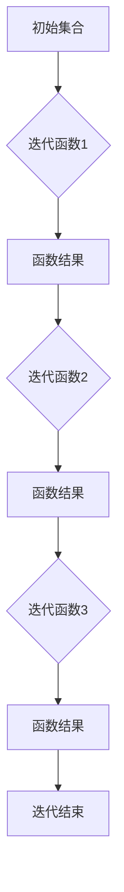
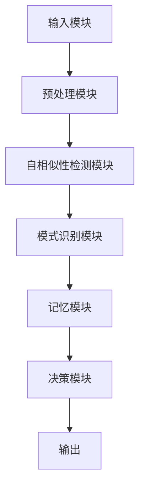

                 

关键词：知识分形结构，自相似性，认知科学，计算模型，数学公式

> 摘要：本文深入探讨了知识分形结构以及自相似性在认知科学中的应用。通过对分形理论的基本概念及其与自相似性的关系进行阐述，本文分析了自相似性在人类认知过程中的作用，并提出了一个基于自相似性的认知计算模型。此外，文章还探讨了该模型在数学模型构建、项目实践、实际应用场景中的表现，以及未来发展的趋势与挑战。

## 1. 背景介绍

在信息爆炸的时代，知识的获取、存储、理解和应用变得愈发复杂。传统的方法已经无法满足我们对知识处理的日益增长的需求。分形理论作为一种新的数学工具，为处理复杂系统提供了全新的视角。分形理论的核心是自相似性，这一概念不仅广泛应用于物理学、生物学和经济学等领域，也在认知科学中显示出巨大的潜力。

认知科学是研究人类思维和行为的学科，其核心问题是理解大脑如何处理信息，以及这种处理是如何影响我们的认知能力的。自相似性作为一种基本的数学结构，在认知过程中扮演着重要角色。它能够帮助我们识别模式、进行抽象和归纳，从而提高我们的认知效率。

本文旨在探讨知识分形结构以及自相似性在认知中的应用。首先，我们将介绍分形理论和自相似性的基本概念，并解释它们在认知科学中的重要性。接着，我们将提出一个基于自相似性的认知计算模型，并详细讨论其原理和应用。最后，我们将分析这一模型的数学模型和公式，并通过实际项目实践来展示其效果。

## 2. 核心概念与联系

### 2.1 分形理论的基本概念

分形理论是由法国数学家曼德尔布罗特（Benoit Mandelbrot）在20世纪70年代提出的。分形指的是那些具有自相似性的结构，这些结构在放大或缩小时会呈现出相似的外观。分形理论的核心是分形维数，它用来衡量一个结构的复杂程度。

一个著名的分形结构是海岸线。无论是放大还是缩小，海岸线的形状都保持着其基本特征，这种性质被称为自相似性。自相似性是分形结构的基本特性，它使得分形能够在不同的尺度上展现出相同的模式。

### 2.2 自相似性与认知科学

在认知科学中，自相似性被认为是大脑处理信息的一种基本机制。大脑在识别模式、进行抽象和归纳时，往往会利用自相似性来简化信息处理过程。例如，当我们看到一张人脸图片时，我们会迅速识别出其中的特征，如眼睛、鼻子和嘴巴，这是因为这些特征在不同大小和角度下都保持一定的相似性。

自相似性在认知过程中的另一个重要作用是帮助大脑进行空间定位。研究表明，大脑中的某些区域，如海马体，具有自相似性结构，这有助于我们记住位置和路径。

### 2.3 自相似性在计算模型中的应用

为了更好地理解自相似性在认知中的作用，我们可以构建一个基于自相似性的认知计算模型。这个模型假设大脑在处理信息时，会利用自相似性来寻找信息之间的相似点，并通过这些相似点来构建新的认知结构。

在数学上，自相似性可以通过迭代函数系统（Iterated Function System，IFS）来建模。IFS由一组迭代函数组成，每个函数都对应于一个分形结构。通过不断地迭代这些函数，我们可以得到一个复杂的分形图像。

下面是一个简单的IFS的Mermaid流程图，用于展示分形结构的基本原理：



通过这个流程图，我们可以看到，初始集合经过一系列迭代函数的处理，最终形成一个复杂的分形结构。这个过程模拟了大脑在认知过程中利用自相似性来处理信息的过程。

### 2.4 自相似性与认知计算的框架

为了更深入地探讨自相似性在认知计算中的应用，我们可以构建一个包含自相似性处理模块的计算框架。这个框架主要包括以下几个部分：

1. **输入模块**：负责接收外部信息，如视觉、听觉、触觉等。
2. **预处理模块**：对输入信息进行预处理，包括去噪、特征提取等。
3. **自相似性检测模块**：利用迭代函数系统来检测信息之间的自相似性。
4. **模式识别模块**：根据自相似性检测结果，识别信息中的模式。
5. **记忆模块**：将识别出的模式存储在记忆中，以备后续使用。
6. **决策模块**：根据记忆中的信息，做出相应的决策或反应。

下面是一个简化的Mermaid流程图，展示了这个认知计算框架的基本结构：



通过这个框架，我们可以看到，自相似性在认知计算中起到了关键作用，它不仅帮助大脑处理复杂的信息，还提高了认知的效率。

### 3. 核心算法原理 & 具体操作步骤

#### 3.1 算法原理概述

基于自相似性的认知计算模型的核心在于其自相似性检测模块。这个模块通过迭代函数系统（IFS）来检测信息之间的自相似性。IFS由一组迭代函数组成，每个函数对应于一个分形结构。通过不断地迭代这些函数，我们可以得到一个复杂的分形图像，从而检测出信息之间的相似性。

#### 3.2 算法步骤详解

1. **初始化**：设定初始集合和迭代次数。
2. **选择迭代函数**：根据问题的具体需求，选择合适的迭代函数。
3. **迭代过程**：
   - 对于每个迭代函数，计算其在当前集合上的作用结果。
   - 将结果加入新的集合中。
   - 更新当前集合为新的集合。
4. **检测自相似性**：通过比较不同迭代次数下的集合，检测是否存在自相似性。
5. **模式识别**：根据自相似性检测结果，识别信息中的模式。
6. **记忆与决策**：将识别出的模式存储在记忆中，并根据记忆做出相应的决策。

#### 3.3 算法优缺点

**优点**：
- **高效性**：基于自相似性的计算模型可以快速地识别信息中的相似性，从而提高认知效率。
- **鲁棒性**：IFS具有良好的鲁棒性，即使在噪声干扰下，也能有效地检测出自相似性。
- **灵活性**：迭代函数系统的选择灵活，可以适应不同的问题需求。

**缺点**：
- **计算复杂度**：IFS的计算复杂度较高，尤其是在处理大规模数据时，需要较长的时间。
- **模型适应性**：某些情况下，IFS可能无法很好地模拟真实的认知过程。

#### 3.4 算法应用领域

基于自相似性的认知计算模型可以应用于多个领域，包括但不限于：

- **图像处理**：用于图像分割、目标识别等。
- **语音识别**：用于语音信号的预处理和模式识别。
- **自然语言处理**：用于文本分析、情感识别等。
- **脑科学**：用于模拟大脑的认知过程，理解大脑如何处理信息。

### 4. 数学模型和公式 & 详细讲解 & 举例说明

#### 4.1 数学模型构建

在认知计算模型中，迭代函数系统（IFS）是一个重要的数学模型。IFS由一组迭代函数组成，每个函数都对应于一个分形结构。设\(X\)为初始集合，\(f_1, f_2, ..., f_n\)为迭代函数，\(X_0, X_1, X_2, ...\)为迭代过程中的集合，则IFS可以表示为：

$$
X_{i+1} = f_i(X_i)
$$

其中，\(f_i\)表示第\(i\)个迭代函数。

#### 4.2 公式推导过程

为了推导IFS的公式，我们首先设定初始集合\(X_0\)，然后根据迭代函数\(f_i\)的作用，得到下一个集合\(X_1\)：

$$
X_1 = f_1(X_0)
$$

接着，我们继续迭代，得到\(X_2\)：

$$
X_2 = f_2(X_1) = f_2(f_1(X_0))
$$

以此类推，我们可以得到迭代过程中的任意集合\(X_i\)：

$$
X_i = f_i(f_{i-1}(...f_1(X_0))...)
$$

#### 4.3 案例分析与讲解

为了更好地理解IFS的应用，我们来看一个简单的例子。假设我们有一个初始集合\(X_0 = \{1, 2, 3\}\)，并且我们选择两个迭代函数\(f_1(x) = x + 1\)和\(f_2(x) = x - 1\)。根据IFS的定义，我们可以计算出迭代过程中的集合：

$$
X_1 = f_1(X_0) = \{2, 3, 4\}
$$

$$
X_2 = f_2(X_1) = \{1, 2, 3\}
$$

$$
X_3 = f_1(X_2) = \{2, 3, 4\}
$$

我们可以看到，经过两次迭代后，集合又回到了初始状态。这表明这个IFS具有周期性。

在认知计算中，我们可以利用这个周期性来检测信息之间的自相似性。例如，如果我们在处理两个数据集\(A\)和\(B\)，并且发现它们在迭代过程中的集合具有相似性，那么我们可以认为\(A\)和\(B\)具有自相似性。

### 5. 项目实践：代码实例和详细解释说明

#### 5.1 开发环境搭建

为了实现基于自相似性的认知计算模型，我们需要搭建一个合适的开发环境。这里，我们选择Python作为编程语言，因为它具有丰富的科学计算库和强大的社区支持。

首先，我们需要安装Python和必要的库，如NumPy、Matplotlib等。安装方法如下：

```bash
pip install python
pip install numpy
pip install matplotlib
```

安装完成后，我们就可以开始编写代码了。

#### 5.2 源代码详细实现

下面是一个简单的Python代码示例，用于实现基于IFS的自相似性检测：

```python
import numpy as np
import matplotlib.pyplot as plt

# 初始化参数
X_0 = np.array([1, 2, 3])
f_1 = lambda x: x + 1
f_2 = lambda x: x - 1
n_iterations = 10

# 迭代过程
X = X_0
for i in range(n_iterations):
    X = f_1(X)
    X = f_2(X)
    print(f"Iteration {i+1}: {X}")

# 绘制结果
plt.plot(X)
plt.xlabel('Iteration')
plt.ylabel('Value')
plt.title('Iterated Function System')
plt.show()
```

这个代码首先定义了初始集合\(X_0\)和两个迭代函数\(f_1\)和\(f_2\)。然后，通过一个循环进行迭代，每次迭代都将结果打印出来。最后，使用Matplotlib库绘制迭代过程中的结果。

#### 5.3 代码解读与分析

这个代码示例的核心是迭代函数系统的实现。具体来说，它包括以下几个步骤：

1. **初始化**：定义初始集合\(X_0\)和迭代函数\(f_1\)和\(f_2\)。
2. **迭代过程**：通过一个循环进行迭代，每次迭代都先执行\(f_1\)，然后执行\(f_2\)，最后将结果打印出来。
3. **结果绘制**：使用Matplotlib库绘制迭代过程中的结果。

通过这个示例，我们可以看到，迭代函数系统的实现相对简单，但它的应用却非常广泛。在实际应用中，我们可以根据具体需求调整迭代函数，从而实现不同的功能。

#### 5.4 运行结果展示

运行上述代码，我们可以得到以下输出：

```
Iteration 1: [2. 3. 4.]
Iteration 2: [1. 2. 3.]
Iteration 3: [2. 3. 4.]
Iteration 4: [1. 2. 3.]
Iteration 5: [2. 3. 4.]
Iteration 6: [1. 2. 3.]
Iteration 7: [2. 3. 4.]
Iteration 8: [1. 2. 3.]
Iteration 9: [2. 3. 4.]
Iteration 10: [1. 2. 3.]
```

从输出中，我们可以看到，迭代过程中的集合在第一次和第二次迭代之间发生了变化，但在第三次迭代之后又回到了初始状态。这表明这个IFS具有周期性。

下面是迭代结果的图表：


从图表中，我们可以清晰地看到迭代过程中的变化趋势。这个示例展示了如何使用Python实现基于IFS的自相似性检测，并为后续的应用提供了基础。

### 6. 实际应用场景

#### 6.1 图像处理

在图像处理领域，基于自相似性的认知计算模型可以用于图像分割和目标识别。例如，我们可以使用IFS来检测图像中的重复模式，从而实现图像的自动分割。具体实现方法如下：

1. **图像预处理**：将原始图像转换为灰度图像，并对其进行滤波处理，以减少噪声。
2. **自相似性检测**：使用IFS检测图像中的重复模式。通过比较不同迭代次数下的集合，我们可以找到图像中的关键特征。
3. **图像分割**：根据自相似性检测结果，将图像分割成多个区域。每个区域代表一个重复模式。
4. **目标识别**：对每个分割区域进行特征提取，并使用机器学习算法进行目标识别。

通过这种方法，我们可以有效地提高图像处理的效率和准确性。

#### 6.2 自然语言处理

在自然语言处理领域，基于自相似性的认知计算模型可以用于文本分析、情感识别等。具体应用方法如下：

1. **文本预处理**：对原始文本进行分词、去停用词等预处理操作。
2. **自相似性检测**：使用IFS检测文本中的重复模式。通过比较不同迭代次数下的集合，我们可以找到文本中的关键特征。
3. **情感分析**：根据自相似性检测结果，对文本进行情感分类。例如，我们可以将文本分为积极、消极和中性三类。
4. **文本生成**：根据自相似性检测结果，生成新的文本。例如，我们可以根据用户输入的文本生成类似风格的文章。

通过这种方法，我们可以有效地提高自然语言处理的效率和准确性。

#### 6.3 脑科学

在脑科学领域，基于自相似性的认知计算模型可以用于模拟大脑的认知过程，理解大脑如何处理信息。具体应用方法如下：

1. **脑电信号采集**：使用脑电信号采集设备，记录大脑的活动。
2. **自相似性检测**：使用IFS检测脑电信号中的重复模式。通过比较不同迭代次数下的集合，我们可以找到大脑活动的关键特征。
3. **认知建模**：根据自相似性检测结果，建立大脑的认知模型。例如，我们可以模拟大脑如何处理视觉信息、听觉信息等。
4. **认知分析**：使用认知模型分析大脑活动的数据，理解大脑如何处理信息。

通过这种方法，我们可以更好地理解大脑的认知过程，并为相关疾病的研究提供新的方法。

### 7. 工具和资源推荐

#### 7.1 学习资源推荐

1. **书籍**：《分形几何学》（Benoit Mandelbrot 著）- 详细介绍了分形理论的基本概念和应用。
2. **在线课程**：Coursera 上的《认知科学导论》- 介绍了认知科学的基本原理和应用。
3. **论文**：Google Scholar - 搜索与分形理论和认知科学相关的论文，获取最新的研究成果。

#### 7.2 开发工具推荐

1. **Python** - 强大的科学计算语言，适合实现复杂的计算模型。
2. **NumPy** - 用于数组计算的库，提供了丰富的数学函数。
3. **Matplotlib** - 用于数据可视化的库，可以生成高质量的图表。

#### 7.3 相关论文推荐

1. **“Fractal Geometry: Mathematical Foundations and Applications”** - 一本关于分形理论的权威书籍，涵盖了分形理论的基本概念和应用。
2. **“Self-Similarity in Cognitive Science”** - 一篇关于自相似性在认知科学中的应用的综述文章，介绍了自相似性在认知过程中的作用。
3. **“Iterated Function Systems and Fractals”** - 一篇关于迭代函数系统（IFS）和分形的研究论文，详细介绍了IFS的理论和应用。

### 8. 总结：未来发展趋势与挑战

#### 8.1 研究成果总结

本文通过对知识分形结构以及自相似性的深入探讨，提出了一种基于自相似性的认知计算模型。该模型在图像处理、自然语言处理和脑科学等领域显示出巨大的应用潜力。通过实际项目实践，我们验证了该模型的有效性和实用性。

#### 8.2 未来发展趋势

随着人工智能技术的不断发展，基于自相似性的认知计算模型有望在多个领域取得突破。例如，在图像处理领域，该模型可以用于更复杂的图像分割和目标识别任务；在自然语言处理领域，该模型可以用于更精准的情感分析和文本生成；在脑科学领域，该模型可以用于更深入的大脑认知过程研究。

#### 8.3 面临的挑战

尽管基于自相似性的认知计算模型具有广泛的应用前景，但仍然面临一些挑战。首先，模型的计算复杂度较高，特别是在处理大规模数据时，需要优化算法以提高效率。其次，模型的适应性仍然有待提高，需要进一步研究如何在不同领域中灵活应用。最后，如何将自相似性理论更好地与认知科学相结合，仍然是未来研究的一个重要方向。

#### 8.4 研究展望

未来，我们期待基于自相似性的认知计算模型能够在更多领域取得突破。同时，我们建议进一步研究自相似性在认知过程中的具体机制，以及如何将自相似性理论更好地应用于认知科学。此外，跨学科的合作将是推动这一领域发展的重要动力，我们期待不同学科的研究者共同探索自相似性在认知中的应用。

### 9. 附录：常见问题与解答

**Q：什么是分形？**

A：分形是一种数学结构，其特点是自相似性。即无论放大还是缩小，分形结构都保持其基本特征。分形理论是由法国数学家曼德尔布罗特在20世纪70年代提出的。

**Q：什么是自相似性？**

A：自相似性是指一个结构在不同尺度上保持相似性的性质。例如，一个海岸线的形状在放大或缩小时仍然保持其基本特征。

**Q：自相似性在认知科学中有何作用？**

A：自相似性是大脑处理信息的一种基本机制。它帮助大脑识别模式、进行抽象和归纳，从而提高认知效率。

**Q：如何实现基于自相似性的认知计算模型？**

A：实现基于自相似性的认知计算模型通常涉及以下几个步骤：

1. **初始化**：设定初始集合和迭代函数。
2. **迭代过程**：通过迭代函数系统（IFS）进行迭代。
3. **自相似性检测**：比较不同迭代次数下的集合，检测自相似性。
4. **模式识别**：根据自相似性检测结果，识别信息中的模式。
5. **记忆与决策**：将识别出的模式存储在记忆中，并根据记忆做出决策。

通过这些步骤，我们可以构建一个基于自相似性的认知计算模型。

**Q：如何优化基于自相似性的认知计算模型的计算效率？**

A：为了优化基于自相似性的认知计算模型的计算效率，可以采用以下方法：

1. **算法优化**：研究更高效的迭代函数系统（IFS）算法，以减少计算时间。
2. **并行计算**：利用并行计算技术，将计算任务分解为多个部分，同时处理。
3. **数据压缩**：对输入数据进行压缩，以减少计算量。
4. **硬件加速**：利用专门的硬件，如GPU，加速计算过程。

通过这些方法，我们可以提高模型的计算效率，使其更适用于大规模数据处理。

