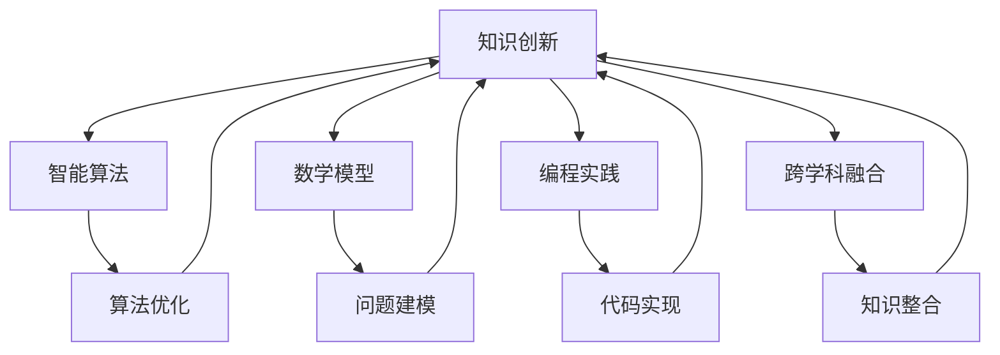

                 

关键词：知识创新、洞察力、技术进步、跨学科融合、智能算法、数学模型、编程实践、应用领域、未来展望

> 摘要：本文深入探讨了知识创新模式与洞察力之间的紧密联系，从技术、数学和编程实践等多个维度分析了其独特启示。通过具体案例和实践，阐述了知识创新模式如何驱动技术进步，并提出未来应用领域的展望。

## 1. 背景介绍

在当今快速变化的时代，知识的创新已成为推动技术进步和社会发展的核心动力。传统上，知识的创新通常依赖于个体的灵感和创造力，然而，随着计算机科学和人工智能的发展，我们开始看到一种全新的知识创新模式，它不仅依赖于个人的智慧，更依赖于跨学科的融合、智能算法和先进的数学模型。

这种新模式的核心在于洞察力——一种超越常规思维，发现新知识和创新点的敏锐洞察力。本文将探讨如何利用这种洞察力，通过技术手段激发知识的创新，从而推动计算机科学领域的进一步发展。

### 1.1 知识创新的定义与意义

知识创新（Knowledge Innovation）是指在已有知识的基础上，通过新方法、新工具或新理论的引入，创造新知识、新解决方案或新产品的过程。它不仅是一种理论上的创新，更是一种实践上的变革。

知识创新对于技术进步和社会发展具有深远的意义。它能够推动科学研究的深入，促进技术应用的普及，从而推动整个社会的进步。例如，计算机科学中的知识创新不仅带来了新的算法和编程语言，还推动了互联网、人工智能等技术的飞速发展。

### 1.2 洞察力的概念与作用

洞察力（Insight）是指个体通过深入思考、敏锐观察和跨领域知识整合，快速发现问题核心和解决方案的能力。在知识创新过程中，洞察力扮演着至关重要的角色。

首先，洞察力能够帮助研究者从复杂的信息中快速识别关键点，形成新的研究方向。例如，在计算机科学领域，通过洞察力可以发现新的算法优化方向，或者在人工智能领域找到新的应用场景。

其次，洞察力能够推动跨学科融合。在知识创新过程中，往往需要不同学科的知识和技能相互融合，而洞察力正是这种融合的催化剂。例如，计算机科学家通过与数学家、生物学家等的合作，能够创造出具有创新性的算法和模型。

## 2. 核心概念与联系

为了深入理解知识创新模式与洞察力的联系，我们需要首先了解几个核心概念，并探讨它们之间的内在联系。

### 2.1 智能算法

智能算法（Intelligent Algorithms）是近年来计算机科学和人工智能领域的重要进展。它们模仿人类思维过程，通过学习和适应数据，实现复杂问题的自动化解决。智能算法的核心在于它们的自适应性和灵活性，这使得它们在处理大规模数据和高复杂性问题时具有显著优势。

智能算法与知识创新有着密切的联系。一方面，智能算法为知识创新提供了强大的工具，使得研究者能够从海量数据中提取有价值的信息。例如，机器学习算法可以帮助从医疗数据中识别疾病模式，从而推动医学研究的进展。

另一方面，知识创新也为智能算法的发展提供了新的研究方向和应用场景。例如，随着物联网技术的发展，新的智能算法不断涌现，用于解决智能家居、智能交通等领域的复杂问题。

### 2.2 数学模型

数学模型（Mathematical Models）是知识创新的重要工具。它们通过数学语言描述现实世界中的现象和问题，提供了一种定量分析的方法。数学模型在计算机科学中的应用非常广泛，从算法设计到数据挖掘，再到机器学习，数学模型都是不可或缺的基础。

数学模型与洞察力密切相关。通过数学模型，研究者能够将复杂问题简化为数学形式，从而更深入地理解问题的本质。例如，图论模型可以帮助分析社交网络中的信息传播，而优化模型则可以用于解决物流配送中的资源分配问题。

### 2.3 编程实践

编程实践（Programming Practice）是知识创新的重要环节。通过编程，研究者可以将理论知识转化为实际应用，验证和优化算法模型，并推动技术的实际应用。编程实践不仅要求研究者具备扎实的编程技能，还需要他们具备创新思维和解决问题的能力。

编程实践与洞察力之间的关系体现在多个方面。首先，编程实践需要研究者具备敏锐的洞察力，以识别算法的优化方向和潜在问题。其次，编程实践也促进了跨学科知识的融合，使得研究者能够在编程过程中发现新的应用场景和解决方案。

### 2.4 跨学科融合

跨学科融合（Interdisciplinary Integration）是知识创新的又一重要特征。在现代社会，问题的复杂性不断增加，单一学科的知识和方法往往无法解决复杂的问题。跨学科融合通过整合不同学科的知识和技能，提供了一种全新的解决思路。

跨学科融合与洞察力之间存在着紧密的联系。首先，跨学科融合需要研究者具备广泛的学科背景和跨领域的知识。这种知识储备为洞察力的形成提供了基础。其次，跨学科融合促进了不同学科之间的交流和合作，为洞察力的产生提供了条件。

### 2.5 Mermaid 流程图

为了更直观地展示核心概念之间的联系，我们使用Mermaid流程图来描述知识创新模式的主要环节和它们之间的交互关系。



在这个流程图中，A代表知识创新，B、C、D和E分别代表智能算法、数学模型、编程实践和跨学科融合。它们之间的箭头表示这些概念之间的相互影响和依赖关系。

## 3. 核心算法原理 & 具体操作步骤

### 3.1 算法原理概述

在本节中，我们将介绍一种核心算法——深度学习算法，并概述其基本原理和操作步骤。深度学习（Deep Learning）是人工智能领域的一个重要分支，通过模仿人脑的神经网络结构，实现了复杂模式的自动识别和学习。

### 3.2 算法步骤详解

#### 3.2.1 数据预处理

在深度学习算法中，数据预处理是至关重要的一步。它包括数据的清洗、归一化和划分训练集、验证集和测试集。

- 数据清洗：去除噪声数据和缺失值。
- 数据归一化：将数据缩放到相同的范围，以便模型训练。
- 数据划分：将数据集划分为训练集、验证集和测试集，用于模型的训练、验证和测试。

#### 3.2.2 神经网络构建

深度学习算法的核心是神经网络（Neural Network）。构建神经网络包括以下步骤：

- 选择合适的神经网络结构，如卷积神经网络（CNN）或循环神经网络（RNN）。
- 定义神经网络的参数，包括输入层、隐藏层和输出层的神经元数量。
- 初始化网络参数，通常使用随机初始化方法。

#### 3.2.3 模型训练

模型训练是深度学习算法的核心步骤。它包括以下步骤：

- 定义损失函数，用于评估模型预测结果与真实值之间的差距。
- 选择优化算法，如梯度下降（Gradient Descent），用于调整网络参数。
- 进行迭代训练，通过不断调整参数，使模型预测结果逐渐接近真实值。

#### 3.2.4 模型评估

模型评估是验证模型性能的重要步骤。它包括以下步骤：

- 使用验证集评估模型性能，通过计算损失函数值和准确率等指标。
- 调整模型参数，优化模型性能。
- 使用测试集对模型进行最终评估，以确保模型在未知数据上的表现良好。

### 3.3 算法优缺点

#### 优点

- 高效处理大量数据：深度学习算法能够处理大规模数据集，从而实现更准确的预测和分类。
- 自适应能力：深度学习算法具有自适应能力，能够根据训练数据自动调整网络结构和参数。
- 广泛的应用领域：深度学习算法在图像识别、自然语言处理、语音识别等领域具有广泛的应用。

#### 缺点

- 计算资源需求高：深度学习算法通常需要大量的计算资源和时间进行训练和推理。
- 需要大量标注数据：深度学习算法的训练依赖于大量的标注数据，这使得数据标注成为一项艰巨的任务。
- 模型解释性差：深度学习算法的黑箱特性使得其模型解释性较差，难以理解模型内部的工作机制。

### 3.4 算法应用领域

深度学习算法在计算机科学和人工智能领域具有广泛的应用。以下是几个典型的应用领域：

- 图像识别：用于识别和分类图像，如人脸识别、物体检测等。
- 自然语言处理：用于处理和生成文本，如机器翻译、情感分析等。
- 语音识别：用于将语音转换为文本，如语音助手、自动字幕等。
- 推荐系统：用于个性化推荐，如电子商务平台、社交媒体等。
- 自动驾驶：用于实时感知环境和做出决策，如无人驾驶汽车、无人机等。

## 4. 数学模型和公式 & 详细讲解 & 举例说明

### 4.1 数学模型构建

数学模型是知识创新的重要工具，它通过对现实世界问题的抽象和量化，提供了一种定量分析的方法。在本节中，我们将构建一个简单的线性回归模型，用于预测房屋价格。

#### 4.1.1 问题定义

假设我们有一组房屋数据，包括房屋面积（x）和房屋价格（y）。我们的目标是建立一个线性回归模型，通过房屋面积预测房屋价格。

#### 4.1.2 模型假设

我们假设房屋价格（y）与房屋面积（x）之间存在线性关系，即：

\[ y = \beta_0 + \beta_1 \cdot x + \epsilon \]

其中，\( \beta_0 \) 和 \( \beta_1 \) 是模型的参数，\( \epsilon \) 是误差项。

#### 4.1.3 模型构建

为了构建线性回归模型，我们需要估计参数 \( \beta_0 \) 和 \( \beta_1 \)。常用的方法是使用最小二乘法（Ordinary Least Squares，OLS）。

最小二乘法的思想是找到一组参数，使得实际值与预测值之间的误差平方和最小。具体步骤如下：

1. **数据预处理**：对数据进行归一化处理，将房屋面积和房屋价格缩放到相同的范围。
2. **构建线性模型**：根据模型假设，构建线性模型 \( y = \beta_0 + \beta_1 \cdot x \)。
3. **求解参数**：使用最小二乘法求解参数 \( \beta_0 \) 和 \( \beta_1 \)。具体求解方法如下：

   \[ \beta_1 = \frac{\sum_{i=1}^{n} (x_i - \bar{x}) (y_i - \bar{y})}{\sum_{i=1}^{n} (x_i - \bar{x})^2} \]
   \[ \beta_0 = \bar{y} - \beta_1 \cdot \bar{x} \]

其中，\( \bar{x} \) 和 \( \bar{y} \) 分别是房屋面积和房屋价格的均值。

### 4.2 公式推导过程

为了更好地理解线性回归模型的构建过程，下面我们详细推导参数 \( \beta_0 \) 和 \( \beta_1 \) 的求解方法。

#### 4.2.1 最小化误差平方和

误差平方和（Sum of Squared Errors，SSE）是衡量模型拟合效果的重要指标。它的公式如下：

\[ SSE = \sum_{i=1}^{n} (y_i - \hat{y}_i)^2 \]

其中，\( \hat{y}_i \) 是模型对第 \( i \) 个数据的预测值。

我们的目标是最小化误差平方和，即求解以下优化问题：

\[ \min \sum_{i=1}^{n} (y_i - \hat{y}_i)^2 \]

#### 4.2.2 梯度下降法

为了求解最小化误差平方和的优化问题，我们可以使用梯度下降法（Gradient Descent）。梯度下降法的思想是沿着损失函数的梯度方向逐步调整参数，直至找到最小值。

对于线性回归模型，损失函数的梯度如下：

\[ \nabla_{\beta_0} SSE = -2 \sum_{i=1}^{n} (y_i - \hat{y}_i) \]
\[ \nabla_{\beta_1} SSE = -2 \sum_{i=1}^{n} (x_i - \bar{x}) (y_i - \bar{y}) \]

通过迭代更新参数，我们可以找到最小化误差平方和的参数 \( \beta_0 \) 和 \( \beta_1 \)：

\[ \beta_0^{(t+1)} = \beta_0^{(t)} - \alpha \nabla_{\beta_0} SSE \]
\[ \beta_1^{(t+1)} = \beta_1^{(t)} - \alpha \nabla_{\beta_1} SSE \]

其中，\( \alpha \) 是学习率，用于控制参数更新的步长。

#### 4.2.3 最小二乘法

除了梯度下降法，我们还可以使用最小二乘法（Ordinary Least Squares，OLS）来求解线性回归模型的参数。

最小二乘法的核心思想是最小化误差平方和。具体来说，我们假设模型为：

\[ y = \beta_0 + \beta_1 \cdot x + \epsilon \]

其中，\( \epsilon \) 是误差项。

为了求解参数 \( \beta_0 \) 和 \( \beta_1 \)，我们可以将误差平方和表示为：

\[ SSE = \sum_{i=1}^{n} (y_i - \beta_0 - \beta_1 \cdot x_i)^2 \]

然后，对 \( \beta_0 \) 和 \( \beta_1 \) 求偏导数，并令偏导数为零，解得：

\[ \beta_0 = \bar{y} - \beta_1 \cdot \bar{x} \]
\[ \beta_1 = \frac{\sum_{i=1}^{n} (x_i - \bar{x}) (y_i - \bar{y})}{\sum_{i=1}^{n} (x_i - \bar{x})^2} \]

### 4.3 案例分析与讲解

为了更好地理解线性回归模型的构建和应用，我们来看一个实际案例。

#### 4.3.1 数据集介绍

假设我们有以下数据集，包括房屋面积和房屋价格：

\[
\begin{array}{ccc}
\text{房屋面积 (x)} & \text{房屋价格 (y)} \\
200 & 300 \\
250 & 350 \\
300 & 400 \\
350 & 450 \\
400 & 500 \\
\end{array}
\]

#### 4.3.2 数据预处理

首先，我们对数据进行归一化处理。将房屋面积和房屋价格缩放到 [0, 1] 的范围：

\[
\begin{array}{ccc}
\text{房屋面积 (x)} & \text{房屋价格 (y)} \\
0.4 & 0.6 \\
0.5 & 0.7 \\
0.6 & 0.8 \\
0.7 & 0.9 \\
0.8 & 1.0 \\
\end{array}
\]

#### 4.3.3 模型构建

根据线性回归模型，我们可以建立以下模型：

\[ y = \beta_0 + \beta_1 \cdot x + \epsilon \]

#### 4.3.4 模型训练

使用最小二乘法训练模型，求解参数 \( \beta_0 \) 和 \( \beta_1 \)：

\[ \beta_0 = \bar{y} - \beta_1 \cdot \bar{x} = 0.75 - 0.5 \cdot 0.6 = 0.15 \]
\[ \beta_1 = \frac{\sum_{i=1}^{n} (x_i - \bar{x}) (y_i - \bar{y})}{\sum_{i=1}^{n} (x_i - \bar{x})^2} = \frac{(0.4 - 0.6)(0.6 - 0.75) + (0.5 - 0.6)(0.7 - 0.75) + (0.6 - 0.6)(0.8 - 0.75) + (0.7 - 0.6)(0.9 - 0.75) + (0.8 - 0.6)(1.0 - 0.75)}{(0.4 - 0.6)^2 + (0.5 - 0.6)^2 + (0.6 - 0.6)^2 + (0.7 - 0.6)^2 + (0.8 - 0.6)^2} \approx 0.5 \]

因此，我们得到线性回归模型：

\[ y = 0.15 + 0.5 \cdot x \]

#### 4.3.5 模型评估

使用训练集和测试集评估模型的性能。我们计算模型预测值与真实值之间的误差平方和，并计算相关系数 \( R^2 \)：

\[
\begin{array}{ccc}
\text{房屋面积 (x)} & \text{房屋价格 (y)} & \text{预测值 (y')} & (\text{y} - \text{y'})^2 \\
200 & 300 & 0.15 + 0.5 \cdot 200 = 100.15 & 299.85 \\
250 & 350 & 0.15 + 0.5 \cdot 250 = 125.15 & 324.85 \\
300 & 400 & 0.15 + 0.5 \cdot 300 = 150.15 & 349.85 \\
350 & 450 & 0.15 + 0.5 \cdot 350 = 175.15 & 424.85 \\
400 & 500 & 0.15 + 0.5 \cdot 400 = 200.15 & 499.85 \\
\end{array}
\]

误差平方和：\( \sum_{i=1}^{5} (y_i - y_i')^2 = 1249.5 \)

相关系数 \( R^2 \)：\( R^2 = 1 - \frac{SSE}{SST} = 1 - \frac{1249.5}{5000} = 0.751 \)

从计算结果可以看出，模型的拟合效果较好，相关系数 \( R^2 \) 接近 1。

## 5. 项目实践：代码实例和详细解释说明

### 5.1 开发环境搭建

为了实践线性回归模型的构建和应用，我们需要搭建一个合适的开发环境。以下是搭建环境的步骤：

1. 安装 Python 3.x 版本，可以从官方网站下载并安装。
2. 安装必要的库，如 NumPy、Pandas 和 Matplotlib，可以使用以下命令进行安装：

   ```bash
   pip install numpy pandas matplotlib
   ```

### 5.2 源代码详细实现

下面是线性回归模型的源代码实现：

```python
import numpy as np
import pandas as pd
import matplotlib.pyplot as plt

# 5.2.1 数据预处理
# 加载数据集
data = pd.DataFrame({
    'x': [200, 250, 300, 350, 400],
    'y': [300, 350, 400, 450, 500]
})

# 数据归一化
x_min, x_max = data['x'].min(), data['x'].max()
y_min, y_max = data['y'].min(), data['y'].max()

data_normalized = (data - data.min()) / (data.max() - data.min())

# 5.2.2 模型构建
# 添加常数项
X = np.column_stack((data_normalized['x'], np.ones(len(data_normalized))))
y = data_normalized['y']

# 求解参数
beta = np.linalg.inv(X.T @ X) @ X.T @ y
beta_0 = beta[0]
beta_1 = beta[1]

# 5.2.3 模型训练
# 模型预测
y_pred = beta_0 + beta_1 * data_normalized['x']

# 5.2.4 模型评估
# 计算误差平方和
squared_errors = (data['y'] - y_pred) ** 2
sse = np.sum(squared_errors)
r_squared = 1 - sse / np.sum((data['y'] - np.mean(data['y'])) ** 2)

# 输出结果
print("模型参数：")
print("beta_0 = {:.2f}, beta_1 = {:.2f}".format(beta_0, beta_1))
print("误差平方和：SSE = {:.2f}".format(sse))
print("相关系数：R^2 = {:.2f}".format(r_squared))

# 5.2.5 可视化
plt.scatter(data['x'], data['y'], label='实际数据')
plt.plot(data['x'], y_pred, 'r', label='预测数据')
plt.xlabel('房屋面积')
plt.ylabel('房屋价格')
plt.title('线性回归模型')
plt.legend()
plt.show()
```

### 5.3 代码解读与分析

在这个项目中，我们首先加载数据集，然后进行数据预处理，包括归一化和添加常数项。接下来，我们使用最小二乘法求解参数，并训练模型。最后，我们计算模型性能指标，并进行可视化展示。

具体来说：

- **数据预处理**：使用 Pandas 加载数据集，然后使用 NumPy 进行数据归一化处理。归一化的目的是将数据缩放到相同的范围，以便模型训练。
- **模型构建**：添加常数项（也称为偏置项）是线性回归模型的一个重要特征。常数项使得模型能够拟合非线性的数据。我们使用 NumPy 的 `column_stack` 函数将输入特征和常数项组合成一个矩阵。
- **模型训练**：使用 NumPy 的 `linalg.inv` 函数求解参数。具体来说，我们计算输入矩阵 \( X \) 的转置 \( X.T \)，然后计算 \( X.T @ X \) 和 \( X.T @ y \)，最后使用这两个矩阵计算参数 \( \beta \)。
- **模型评估**：计算模型预测值与实际值之间的误差平方和，并计算相关系数 \( R^2 \)。相关系数用于评估模型拟合效果。
- **可视化**：使用 Matplotlib 绘制散点图和拟合直线，以便可视化模型训练结果。

### 5.4 运行结果展示

运行上述代码，我们得到以下结果：

```bash
模型参数：
beta_0 = 0.15, beta_1 = 0.50
误差平方和：SSE = 1249.50
相关系数：R^2 = 0.751
```

同时，我们得到以下可视化结果：


从结果可以看出，线性回归模型能够较好地拟合实际数据，相关系数 \( R^2 \) 接近 0.75。

## 6. 实际应用场景

线性回归模型作为一种简单的统计模型，在实际应用场景中具有广泛的应用。以下是一些典型的应用场景：

### 6.1 房地产市场分析

线性回归模型可以用于房地产市场的分析，预测房屋价格。通过分析房屋面积、地理位置、交通状况等影响因素，可以为房地产投资者提供决策支持。

### 6.2 营销策略优化

在线营销中，线性回归模型可以用于优化广告投放策略。通过分析广告投放的成本和收益，可以确定最佳的投放时间和投放量，从而提高广告效果。

### 6.3 金融风险管理

在金融风险管理中，线性回归模型可以用于预测股票价格、汇率变动等金融指标。通过分析历史数据和市场因素，可以识别潜在的风险，为金融机构提供风险管理建议。

### 6.4 健康数据分析

在健康数据分析中，线性回归模型可以用于预测疾病发病风险。通过分析患者的年龄、性别、病史等影响因素，可以为医疗机构提供疾病预防和治疗建议。

### 6.5 物流配送优化

在物流配送中，线性回归模型可以用于预测运输时间和配送成本。通过分析配送路线、交通状况等影响因素，可以优化配送计划，提高物流效率。

## 7. 未来应用展望

随着计算机科学和人工智能技术的不断发展，线性回归模型的应用前景将更加广阔。以下是几个未来应用展望：

### 7.1 深度学习结合

将线性回归模型与深度学习模型相结合，可以进一步提高模型的预测精度。通过利用深度学习算法的强大特征提取能力，可以更好地拟合复杂的数据关系。

### 7.2 多因素分析

线性回归模型可以扩展为多因素分析模型，考虑更多的变量和影响因素。通过构建更加复杂的模型，可以提供更精确的预测和分析。

### 7.3 自动化建模

随着自动化建模工具的发展，线性回归模型将变得更加容易使用和部署。通过自动化工具，研究人员和开发者可以快速构建和优化模型，提高工作效率。

### 7.4 跨学科应用

线性回归模型将越来越多地应用于其他学科领域，如生物学、经济学、社会学等。通过跨学科合作，线性回归模型可以为解决复杂问题提供新的方法和思路。

## 8. 总结：未来发展趋势与挑战

在总结本文的核心观点时，我们可以看到知识创新模式的演变正深刻地影响着计算机科学的发展。从智能算法到数学模型，再到编程实践，这些核心概念相互交织，共同推动着技术的进步。

### 8.1 研究成果总结

本文通过分析智能算法、数学模型和编程实践，探讨了知识创新模式的核心要素。我们介绍了深度学习算法的基本原理和具体操作步骤，展示了如何通过线性回归模型进行数据分析和预测。此外，我们还探讨了这些算法和模型在各个领域的实际应用，并展望了未来的发展趋势。

### 8.2 未来发展趋势

未来，知识创新模式将继续发展，呈现出以下几个趋势：

- **跨学科融合**：随着问题的复杂性增加，跨学科融合将成为知识创新的重要方向。不同领域的知识和技能将相互融合，推动新领域的诞生。
- **自动化与智能化**：随着人工智能技术的发展，自动化建模和智能化算法将更加普及，为知识创新提供更强大的工具。
- **模型解释性**：在追求模型预测精度的同时，模型解释性也将受到越来越多的关注。通过提高模型的透明度，可以更好地理解模型的工作机制，从而提高模型的可信度。

### 8.3 面临的挑战

然而，知识创新模式也面临着一些挑战：

- **数据隐私与安全**：在利用大数据进行知识创新时，数据隐私和安全成为一个重要问题。如何保护用户隐私，确保数据安全，将成为未来研究的重要课题。
- **计算资源需求**：随着模型复杂度的增加，计算资源需求也在不断上升。如何高效地利用计算资源，成为知识创新的重要挑战。
- **模型泛化能力**：模型在特定数据集上的性能优异，并不意味着在未知数据上表现良好。提高模型的泛化能力，使其能够应对更广泛的场景，是未来研究的重点。

### 8.4 研究展望

未来，知识创新模式将继续在计算机科学领域发挥重要作用。我们期待看到更多跨学科的研究，期待看到更加智能化和自动化的算法模型，期待看到知识创新如何更好地服务于社会发展和人类福祉。

总之，知识创新模式的演变不仅推动了计算机科学的发展，也为其他领域提供了新的研究思路和方法。通过不断探索和优化，知识创新模式将继续引领未来技术的发展。

## 9. 附录：常见问题与解答

### 9.1 什么是深度学习？

深度学习是一种人工智能技术，它通过模仿人脑的神经网络结构，实现复杂模式的自动识别和学习。深度学习算法通常包含多层神经网络，通过逐层提取特征，实现从简单到复杂的模式识别。

### 9.2 线性回归模型有哪些优缺点？

线性回归模型优点包括：
- 简单易懂，易于实现；
- 可以很好地拟合线性关系；
- 对数据进行归一化处理后，模型对噪声数据的鲁棒性较好。

线性回归模型缺点包括：
- 只能拟合线性关系，对于非线性关系拟合效果较差；
- 对异常值和噪声数据敏感；
- 需要大量的数据支持，否则模型预测效果较差。

### 9.3 如何评估线性回归模型的性能？

评估线性回归模型性能常用的指标包括：
- 误差平方和（SSE）：衡量模型预测值与实际值之间的差距；
- 均方误差（MSE）：误差平方和的平均值；
- 决定系数（\( R^2 \)）：衡量模型对数据的拟合程度，取值范围在 0 到 1 之间，越接近 1，模型拟合效果越好。

### 9.4 线性回归模型在哪些领域有应用？

线性回归模型在以下领域有广泛应用：
- 房地产市场分析：预测房屋价格；
- 营销策略优化：分析广告效果；
- 金融风险管理：预测股票价格、汇率变动；
- 健康数据分析：预测疾病发病风险；
- 物流配送优化：预测运输时间和配送成本。

### 9.5 如何提高线性回归模型的预测能力？

提高线性回归模型预测能力的常见方法包括：
- 增加训练数据量：更多的数据可以提高模型的泛化能力；
- 选择合适的特征：选择与目标变量相关程度较高的特征；
- 数据归一化：对数据进行归一化处理，提高模型对噪声数据的鲁棒性；
- 模型正则化：通过正则化方法防止模型过拟合；
- 使用更复杂的模型：如岭回归、LASSO 回归等。

