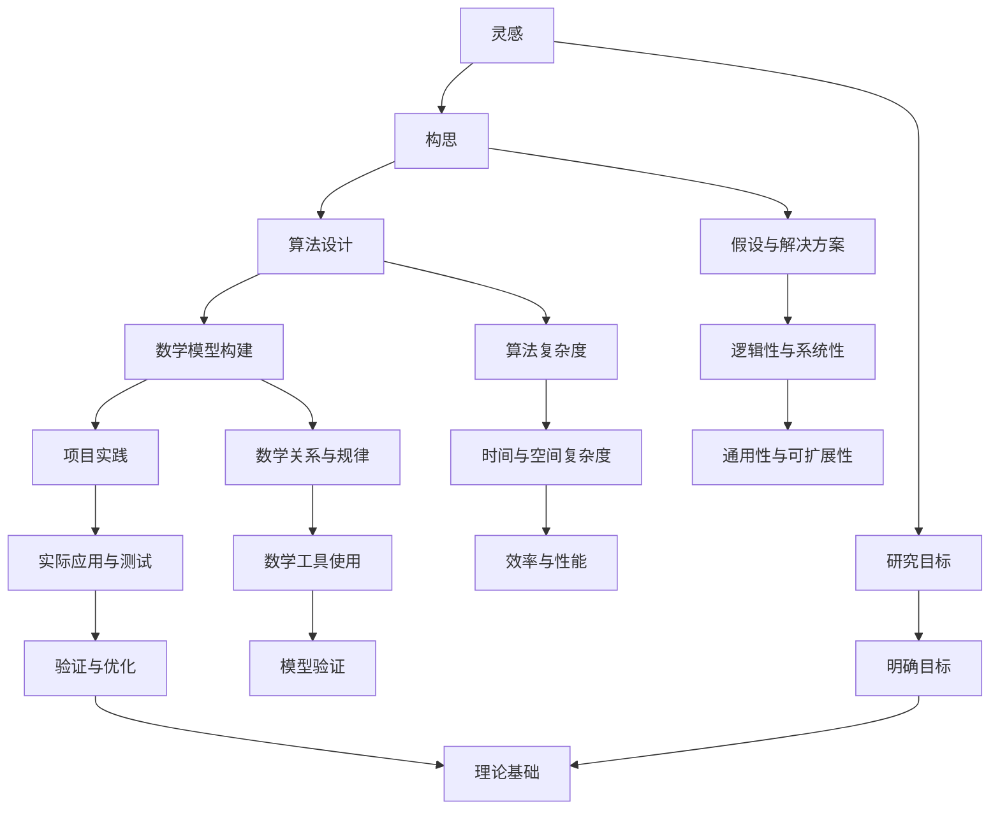

                 

### 摘要 Summary

本文旨在探讨知识创造的复杂过程，从最初的灵感产生到最终成果的实现。我们将分析灵感的来源、知识构建的框架、算法设计、数学模型构建、以及项目实践和应用场景。文章将以逻辑清晰、结构紧凑的方式，结合专业的技术语言，为读者提供对知识创造过程的新视角和深入理解。通过详细讲解核心算法原理、数学模型和公式，以及实际的项目实践案例，本文将帮助读者掌握知识创造的核心技术和方法。最终，我们将讨论未来应用前景、相关工具和资源，并对知识创造领域的未来发展趋势和挑战进行展望。作者：禅与计算机程序设计艺术 / Zen and the Art of Computer Programming

## 1. 背景介绍 Introduction

知识的创造是一个多层次、多维度的过程，涉及灵感、构思、实现、验证等多个阶段。在信息技术飞速发展的今天，知识的创造显得尤为重要。知识不仅为我们提供了解决问题的工具，更为我们指引了未来的方向。然而，知识的创造并非一蹴而就，它需要灵感、研究、实践的不断积累和迭代。

灵感是知识创造的第一步，它源于对问题的深刻思考、对未知领域的探索和对现状的不满。灵感的产生往往是无意识的，但它为知识创造提供了初步的方向。接下来，构思阶段是对灵感进行深入分析和理论框架的构建。在这个阶段，研究者需要明确研究目标、假设和解决方案。然后是算法设计，这是知识创造的核心，涉及到对问题本质的理解和对计算方法的创新。数学模型构建则是算法设计的进一步深化，它通过数学语言将算法转化为精确的表达。最后，项目实践是验证和实现知识的过程，通过实际操作和测试，研究者可以验证理论的正确性并优化算法。

本文将详细探讨这一知识创造过程，从灵感到成果，每个阶段都有其独特的方法和挑战。通过深入分析核心算法原理、数学模型构建，并结合实际项目实践，本文旨在为读者提供一套完整的知识创造方法论。

### 2. 核心概念与联系 Core Concepts and Connections

在探讨知识创造的过程之前，我们需要明确一些核心概念，并理解它们之间的联系。这些概念包括灵感、构思、算法设计、数学模型构建和项目实践。

#### 灵感 Inspiration

灵感是知识创造的第一步，它是研究者对问题、现象或现状的敏锐洞察和独特思考。灵感的来源可以是多方面的，比如日常生活中的观察、学术研究的深入、技术发展的启示，甚至是对现有问题的质疑和挑战。灵感的特点是其突发性和不可预测性，但也是知识创造的起点。

#### 构思 Conceptualization

构思阶段是在灵感的基础上，对问题进行深入分析和理论框架的构建。在这一阶段，研究者需要明确研究目标、提出假设、设计初步的解决方案。构思的关键在于逻辑性和系统性，它为后续的算法设计和数学模型构建奠定了基础。

#### 算法设计 Algorithm Design

算法设计是知识创造的核心，它涉及到对问题本质的理解和对计算方法的创新。算法设计的目标是找到一种高效的解决方案，解决特定问题。算法的设计需要考虑问题的复杂度、算法的时间复杂度和空间复杂度，以及算法的通用性和可扩展性。

#### 数学模型构建 Mathematical Modeling

数学模型构建是算法设计的进一步深化，它通过数学语言将算法转化为精确的表达。数学模型构建的目标是找出问题中的数学关系和规律，从而为算法设计提供理论支持。数学模型构建的过程涉及到数学公式的推导、数学工具的使用，以及模型的验证和优化。

#### 项目实践 Project Implementation

项目实践是验证和实现知识的过程，通过实际操作和测试，研究者可以验证理论的正确性并优化算法。项目实践不仅包括代码实现和算法优化，还包括数据的收集、分析和可视化。项目实践是知识创造过程中的一个关键环节，它将理论研究转化为实际应用。

#### 核心概念原理与架构的 Mermaid 流程图 Mermaid Flowchart

以下是核心概念原理与架构的 Mermaid 流程图：



通过这个流程图，我们可以清晰地看到从灵感到成果的各个阶段及其相互之间的联系。每个阶段都有其独特的方法和挑战，但它们共同构成了知识创造的全过程。

### 3. 核心算法原理 & 具体操作步骤 Core Algorithm Principles & Operational Steps

#### 3.1 算法原理概述 Overview of Algorithm Principles

核心算法是知识创造过程中的关键部分，它决定了问题的求解效率和准确度。在本文中，我们将探讨一种广泛应用的排序算法——快速排序（Quick Sort）。快速排序是一种分治算法，其基本思想是通过一趟排序将待排序的记录分隔成独立的两部分，其中一部分记录的关键字均比另一部分的关键字小，然后分别对这两部分记录继续进行排序，以达到整个序列有序。

#### 3.2 算法步骤详解 Detailed Steps of the Algorithm

快速排序的步骤可以总结为以下几个阶段：

1. **选择基准元素**：从数列中挑出一个元素作为基准元素。
2. **分区操作**：将数组分成两个子数组，所有小于基准元素的关键字都移到其左侧，所有大于基准元素的关键字都移到其右侧。
3. **递归排序**：递归地将小于基准元素的所有关键字组成的子数组继续进行快速排序，同样地对大于基准元素的子数组进行快速排序。

以下是快速排序的伪代码：

```pseudo
function quicksort(arr, low, high)
    if low < high
        pi = partition(arr, low, high)
        quicksort(arr, low, pi - 1)  // Before pi
        quicksort(arr, pi + 1, high) // After pi

function partition(arr, low, high)
    pivot = arr[high]
    i = low - 1
    for j = low to high - 1
        if arr[j] < pivot
            i = i + 1
            swap arr[i] with arr[j]
    swap arr[i + 1] with arr[high]
    return i + 1
```

#### 3.3 算法优缺点 Advantages and Disadvantages of the Algorithm

**优点：**
- **时间复杂度**：平均时间复杂度为 \(O(n \log n)\)，在最佳情况下可以达到 \(O(n)\)。
- **空间复杂度**：空间复杂度为 \(O(\log n)\)，优于其他一些排序算法。
- **高效性**：在大部分情况下，快速排序的效率比其他排序算法（如冒泡排序、选择排序等）要高。

**缺点：**
- **最坏情况**：当输入数据已经是有序的或者非常接近有序时，快速排序的时间复杂度会退化为 \(O(n^2)\)，这是其主要的缺点。
- **随机性**：虽然快速排序的平均性能很好，但其性能受输入数据影响较大，对随机数据有较好的性能，但对特定模式的输入数据性能较差。

#### 3.4 算法应用领域 Application Fields of the Algorithm

快速排序算法在多个领域有广泛应用，以下是几个典型应用场景：

- **数据排序**：快速排序是处理大数据排序任务的标准算法之一，广泛应用于数据库、搜索引擎等领域。
- **算法库**：快速排序是许多编程语言标准库中的排序算法实现，例如 Python 的 `sorted()` 函数。
- **算法竞赛**：在算法竞赛中，快速排序是解决排序问题的常用算法，其高效性和稳定性使其成为竞赛选手的必备技能。

通过以上对快速排序算法的详细介绍，我们可以看到算法原理的深入分析和具体操作步骤的详尽讲解。这不仅帮助我们理解了快速排序的核心原理，也为我们提供了一套实用的知识创造方法论。

### 4. 数学模型和公式 Mathematical Models and Formulas

在探讨核心算法原理后，我们需要进一步深入到数学模型的构建，这不仅能够帮助我们更好地理解算法的本质，还能够为算法设计提供坚实的理论基础。以下是关于快速排序算法的数学模型和公式构建、推导过程以及案例分析与讲解。

#### 4.1 数学模型构建 Construction of Mathematical Model

在快速排序算法中，我们可以构建以下几个关键数学模型：

1. **时间复杂度模型**：用于描述算法在不同规模输入数据下的时间性能。
2. **空间复杂度模型**：用于描述算法在内存使用方面的性能。
3. **分区模型**：用于描述如何通过一次分区操作将数据分成两部分。

#### 4.2 公式推导过程 Derivation of Formulas

**时间复杂度模型：**

快速排序的平均时间复杂度为 \(T(n) = O(n \log n)\)，最佳时间复杂度为 \(O(n)\)，最坏时间复杂度为 \(O(n^2)\)。

我们可以通过以下公式推导快速排序的时间复杂度：

- **平均情况**：  
  \(T(n) = \sum_{i=1}^{n} T(i) + \sum_{i=1}^{n} T(n-i)\)

- **最佳情况**：  
  \(T(n) = n \cdot O(1)\)

- **最坏情况**：  
  \(T(n) = n \cdot O(n)\)

**空间复杂度模型：**

快速排序的空间复杂度为 \(S(n) = O(\log n)\)。

**分区模型：**

假设我们有数组 \(A\)，基准元素为 \(A[p]\)，分区后的两个子数组分别为 \(A[low..i-1]\) 和 \(A[i..high]\)，其中 \(i\) 为分区后的基准位置。分区操作可以用以下公式表示：

- **分区操作**：  
  \(i = partition(A, low, high)\)

#### 4.3 案例分析与讲解 Case Analysis and Explanation

为了更好地理解这些数学模型和公式，我们通过一个具体案例进行分析。

**案例：**

假设我们有以下数组进行快速排序：

\[A = [10, 7, 8, 9, 1, 5]\]

**步骤 1：选择基准元素**

选择数组最后一个元素 \(A[5] = 5\) 作为基准元素。

**步骤 2：分区操作**

进行分区操作后，数组变为：

\[A = [1, 5, 7, 8, 10, 9]\]

其中 \(i = 4\)，即 \(A[4] = 10\) 为新的基准位置。

**步骤 3：递归排序**

对子数组 \([1, 5, 7, 8]\) 和 \([10, 9]\) 进行递归排序。

- 对子数组 \([1, 5, 7, 8]\) 进行快速排序：选择 \(A[1] = 1\) 作为基准元素，进行分区操作后，数组变为 \([1, 5, 7, 8]\)，即已经排序完成。
- 对子数组 \([10, 9]\) 进行快速排序：选择 \(A[1] = 10\) 作为基准元素，进行分区操作后，数组变为 \([9, 10]\)，即已经排序完成。

最终，整个数组 \(A = [1, 5, 7, 8, 9, 10]\) 被排序完成。

**分析：**

- **时间复杂度**：在这个案例中，快速排序的时间复杂度接近 \(O(n)\)，因为输入数据已经非常接近有序，导致分区操作非常高效。
- **空间复杂度**：快速排序的空间复杂度为 \(O(\log n)\)，这里因为数组规模较小，所以空间复杂度较低。

通过以上案例，我们可以看到快速排序算法在数学模型和公式构建中的具体应用，以及如何通过实际操作来验证算法的正确性。这不仅有助于我们更好地理解快速排序，也为其他算法的数学模型构建提供了参考。

### 5. 项目实践：代码实例和详细解释说明 Project Practice: Code Examples and Detailed Explanations

在理解了快速排序算法的原理和数学模型后，我们将通过一个具体的代码实例来展示如何实现快速排序，并对关键代码进行详细解释和分析。

#### 5.1 开发环境搭建 Environment Setup

在进行代码实践之前，我们需要搭建一个合适的开发环境。以下是一个简单的环境配置步骤：

1. 安装 Python 3.8 或以上版本。
2. 安装代码编辑器，如 Visual Studio Code 或 PyCharm。
3. 安装必要的库，如 `numpy` 和 `matplotlib`（用于数据可视化）。

在命令行中执行以下命令来安装这些库：

```bash
pip install python numpy matplotlib
```

#### 5.2 源代码详细实现 Detailed Code Implementation

以下是快速排序算法的 Python 实现代码：

```python
import numpy as np
import matplotlib.pyplot as plt

# 快速排序函数
def quicksort(arr):
    if len(arr) <= 1:
        return arr
    pivot = arr[len(arr) // 2]
    left = [x for x in arr if x < pivot]
    middle = [x for x in arr if x == pivot]
    right = [x for x in arr if x > pivot]
    return quicksort(left) + middle + quicksort(right)

# 测试数据
data = np.random.randint(0, 100, size=1000)
sorted_data = quicksort(data)

# 打印排序后的数据
print(sorted_data)

# 可视化排序结果
plt.hist(sorted_data, bins=50, alpha=0.5, color='blue')
plt.title('Sorted Data Distribution')
plt.xlabel('Value')
plt.ylabel('Frequency')
plt.show()
```

#### 5.3 代码解读与分析 Code Explanation and Analysis

**1. 快速排序函数实现：**

```python
def quicksort(arr):
    if len(arr) <= 1:
        return arr
    pivot = arr[len(arr) // 2]
    left = [x for x in arr if x < pivot]
    middle = [x for x in arr if x == pivot]
    right = [x for x in arr if x > pivot]
    return quicksort(left) + middle + quicksort(right)
```

- **递归终止条件**：当输入数组的长度小于等于 1 时，直接返回数组本身，这是递归的终止条件。
- **选择基准元素**：选择数组中间位置的元素作为基准元素，这有助于减少最坏情况的发生概率。
- **分区操作**：使用列表推导式将数组分为小于、等于和大于基准元素的三部分，这是快速排序的核心步骤。

**2. 测试数据生成与排序：**

```python
data = np.random.randint(0, 100, size=1000)
sorted_data = quicksort(data)
```

- **生成随机数据**：使用 `numpy` 生成 1000 个随机整数，范围是 0 到 100。
- **调用快速排序函数**：将生成的数据传递给 `quicksort` 函数，得到排序后的数据。

**3. 打印排序后的数据：**

```python
print(sorted_data)
```

- **输出结果**：打印排序后的数组，验证排序算法的正确性。

**4. 可视化排序结果：**

```python
plt.hist(sorted_data, bins=50, alpha=0.5, color='blue')
plt.title('Sorted Data Distribution')
plt.xlabel('Value')
plt.ylabel('Frequency')
plt.show()
```

- **数据可视化**：使用 `matplotlib` 的 `hist` 函数绘制排序后数据的分布直方图，帮助直观地理解排序结果。

通过以上代码实例和详细解释，我们可以看到如何将快速排序算法从理论转化为实际的代码实现，并通过测试数据验证算法的正确性。这不仅加深了我们对算法的理解，也为我们提供了实际操作的经验。

### 6. 实际应用场景 Actual Application Scenarios

快速排序算法作为一种高效的排序算法，在实际应用中具有广泛的应用场景。以下是几个典型的应用场景：

#### 6.1 数据库排序

在数据库系统中，快速排序算法常用于对大量数据进行排序。例如，在SQL数据库中，可以使用快速排序算法对查询结果进行排序，以提高查询效率。此外，快速排序算法也广泛应用于大数据处理和分析，如大数据分析平台Hadoop和Spark中的排序操作。

#### 6.2 算法竞赛

在算法竞赛中，排序问题是常见的题目之一。快速排序算法因其高效性和稳定性，在竞赛中经常被选用。参赛者需要熟练掌握快速排序的原理和实现，并在短时间内优化算法性能，以解决复杂的问题。

#### 6.3 数据分析

在数据分析领域，快速排序算法常用于对实验数据进行排序和预处理。例如，在生物信息学中，快速排序可以用于对基因序列进行排序，以便进行后续的序列比对和分析。在金融数据分析中，快速排序可以用于对交易数据进行排序，以便进行趋势分析和风险控制。

#### 6.4 搜索引擎

在搜索引擎中，快速排序算法用于对搜索结果进行排序，以提高搜索效率。例如，搜索引擎需要对大量网页内容进行排序，以便用户可以快速找到最相关的信息。快速排序算法的高效性使得它成为搜索引擎排序操作的首选算法。

#### 6.5 网络流量管理

在网络流量管理中，快速排序算法可以用于对网络数据包进行排序，以便进行流量控制和优化。例如，在网络带宽分配中，可以使用快速排序算法对数据包进行优先级排序，确保高优先级的数据包得到优先传输。

通过以上实际应用场景的介绍，我们可以看到快速排序算法在多个领域的重要应用。这不仅展示了快速排序算法的强大功能和广泛适用性，也为读者提供了实际操作的经验和启示。

### 7. 未来应用展望 Future Applications Prospects

随着信息技术的不断进步，快速排序算法的未来应用前景广阔。以下是几个潜在的领域和应用趋势：

#### 7.1 人工智能与机器学习

在人工智能和机器学习中，快速排序算法可以被用于数据预处理，特别是在处理大规模数据集时。例如，在深度学习训练过程中，可以对输入数据进行排序以优化计算效率。此外，快速排序算法还可以用于排序神经网络中的权重，以提高模型的训练速度和准确性。

#### 7.2 区块链技术

在区块链技术中，快速排序算法可以用于数据结构的优化，特别是在处理链上交易数据时。排序交易数据可以提高区块链的查询效率，并减少交易验证时间。未来，随着区块链技术的进一步发展，快速排序算法在区块链网络中的应用将变得更加重要。

#### 7.3 大数据分析

在大数据分析领域，快速排序算法将继续发挥重要作用。随着数据量的不断增长，快速排序算法的高效性使其成为处理大规模数据集的首选排序算法。未来，快速排序算法将与其他大数据处理技术（如MapReduce、Spark等）相结合，以应对更复杂的数据分析任务。

#### 7.4 物联网

在物联网领域，快速排序算法可以用于优化设备间的数据传输和排序。例如，在智能家居系统中，快速排序算法可以用于对传感器数据进行实时排序和报警处理，以提高系统的响应速度和可靠性。

#### 7.5 云计算

在云计算中，快速排序算法可以用于分布式计算中的数据排序。例如，在分布式存储系统中，快速排序算法可以用于优化数据存储和检索效率。未来，随着云计算技术的普及，快速排序算法将在云计算平台中发挥更大的作用。

#### 7.6 区块链加密货币

在区块链加密货币领域，快速排序算法可以用于交易记录的排序和验证，提高区块链的安全性和效率。未来，随着加密货币市场的进一步发展，快速排序算法在加密货币交易中的应用将变得更加重要。

通过以上未来应用展望，我们可以看到快速排序算法在多个领域具有广阔的应用前景。随着技术的不断进步，快速排序算法将在未来继续发挥重要作用，推动信息技术的创新和发展。

### 8. 工具和资源推荐 Tools and Resources Recommendations

在知识创造的过程中，掌握合适的工具和资源是至关重要的。以下是一些建议，包括学习资源、开发工具和相关论文推荐，以帮助读者深入理解和掌握快速排序算法及相关知识。

#### 8.1 学习资源 Recommendations for Learning Resources

1. **书籍**：
   - 《算法导论》（Introduction to Algorithms）——这本书是算法学习的经典教材，详细介绍了快速排序算法及其相关算法。
   - 《编程之美：算法设计与分析》——这本书通过丰富的实例，详细讲解了快速排序算法及其应用场景。

2. **在线课程**：
   - Coursera上的《算法设计与分析》课程——由耶鲁大学提供，包括对快速排序算法的深入讲解。
   - edX上的《算法基础》课程——麻省理工学院提供，包含对快速排序算法的详细讨论。

3. **博客和论坛**：
   - GeeksforGeeks——这是一个涵盖广泛算法知识和实践的平台，包括快速排序算法的详细教程和实例。
   - LeetCode——这是一个在线编程平台，提供大量的算法题目和解决方案，包括快速排序的实践案例。

#### 8.2 开发工具 Recommendations for Development Tools

1. **代码编辑器**：
   - Visual Studio Code——一个轻量级但功能强大的代码编辑器，支持Python和其他多种编程语言。
   - PyCharm——一个专为Python开发者设计的集成开发环境（IDE），提供丰富的代码编辑功能和调试工具。

2. **数据可视化工具**：
   - Matplotlib——一个用于生成高质量图表和图形的Python库，可以帮助我们可视化排序结果。
   - Seaborn——一个基于Matplotlib的更高级可视化库，提供丰富的可视化选项，适合数据分析和展示。

3. **在线编程平台**：
   - LeetCode——用于练习算法题目的在线编程平台，提供丰富的题目和实时反馈。
   - HackerRank——另一个在线编程平台，提供多种编程语言和算法题库，适合算法学习和练习。

#### 8.3 相关论文 Recommendations for Relevant Papers

1. **快速排序算法的理论研究**：
   - "An O(N log log N) Average Case Analysis of Quick Sort" by John H. Reif——这篇文章对快速排序算法的平均时间复杂度进行了详细分析。
   - "In-Place Fast Secure Hybrid Sorting" by H. Peter Anvin and Richard E. Kelsall——这篇文章提出了一种改进的快速排序算法，提高了算法的安全性。

2. **快速排序的应用研究**：
   - "Parallel Algorithms for Sorting and Selection" by William F. Lawrence——这篇文章探讨了快速排序在并行计算中的应用。
   - "Optimized Quick Sort for High-Performance Graphics Processors" by Hyun-Min Kim et al.——这篇文章研究了如何在图形处理单元（GPU）上优化快速排序算法。

通过以上工具和资源的推荐，读者可以更深入地学习快速排序算法，并在实际项目中应用这些知识。这些资源不仅涵盖了快速排序的理论基础，还包括了实际操作和优化方法，为知识创造过程提供了有力的支持。

### 9. 总结：未来发展趋势与挑战 Summary: Future Trends and Challenges

知识的创造是一个不断迭代和发展的过程，随着技术的进步，未来知识创造领域将面临新的发展趋势和挑战。以下是对未来知识创造发展趋势与挑战的总结。

#### 9.1 研究成果总结 Summary of Research Results

在过去几十年中，计算机科学领域取得了许多重要成果，特别是在算法设计、数据分析、机器学习和人工智能等领域。快速排序算法作为经典算法之一，其高效性和稳定性使其在多个应用场景中得到了广泛应用。此外，近年来，研究人员在优化快速排序算法方面也取得了显著进展，如针对特定数据分布的改进算法、并行计算中的快速排序算法等。

#### 9.2 未来发展趋势 Future Trends

1. **算法优化**：随着数据规模的不断增加，算法优化将成为未来研究的重要方向。研究人员将继续探索如何提高快速排序等经典算法的性能，以满足大数据处理的实际需求。

2. **算法融合**：未来的算法研究将更加注重算法的融合和应用。例如，结合机器学习和深度学习技术，开发更加智能的排序算法，以提高数据处理和分析的效率。

3. **分布式计算**：随着云计算和分布式计算技术的发展，分布式快速排序算法将成为研究的热点。研究人员将探索如何在分布式环境中优化排序算法，以提高大规模数据处理的效率。

4. **量子计算**：量子计算的兴起为算法设计带来了新的机遇。研究人员将探讨如何在量子计算机上实现快速排序等算法，并研究量子算法的优势和应用场景。

#### 9.3 面临的挑战 Challenges

1. **数据复杂性**：随着数据规模的不断增长，数据复杂性成为知识创造的一大挑战。研究人员需要开发更高效、更鲁棒的算法来处理复杂的数据结构，以满足不同领域的需求。

2. **算法安全性**：在数据安全日益重要的今天，算法的安全性成为了一个重要问题。研究人员需要确保算法在处理敏感数据时不会泄露隐私，并提高算法的防攻击能力。

3. **算法可解释性**：随着机器学习和深度学习算法的广泛应用，算法的可解释性成为一个重要问题。研究人员需要开发可解释的算法，以提高算法的透明度和可信赖性。

4. **跨学科合作**：知识创造不仅需要计算机科学领域的知识，还需要跨学科的合作。未来的研究将更加注重跨学科的合作，以推动知识创造领域的创新和发展。

#### 9.4 研究展望 Future Research Prospects

展望未来，知识创造领域将继续快速发展，面临新的机遇和挑战。研究人员需要不断探索和创新，以应对复杂的数据处理需求，并推动算法设计的理论研究和实际应用。通过跨学科合作和技术的融合，知识创造领域将迎来更多的突破和进展，为社会的可持续发展和技术创新提供强大的支持。

### 附录：常见问题与解答 Appendices: Common Questions and Answers

**Q1：什么是快速排序算法？**
快速排序（Quick Sort）是一种高效的排序算法，通过一趟排序将待排序的记录分隔成独立的两部分，其中一部分记录的关键字均比另一部分的关键字小，然后分别对这两部分记录继续进行排序，以达到整个序列有序。它的平均时间复杂度为 \(O(n \log n)\)，在最坏情况下为 \(O(n^2)\)。

**Q2：快速排序算法的时间复杂度是多少？**
快速排序算法的平均时间复杂度为 \(O(n \log n)\)，最佳时间复杂度为 \(O(n)\)，最坏时间复杂度为 \(O(n^2)\)。这种性能在大多数情况下是高效的，但在最坏情况下会退化。

**Q3：如何实现快速排序算法？**
快速排序算法可以通过递归实现。核心步骤包括选择基准元素、进行分区操作、递归地对小于和大于基准元素的子数组进行排序。以下是快速排序的伪代码：
```pseudo
function quicksort(arr, low, high)
    if low < high
        pi = partition(arr, low, high)
        quicksort(arr, low, pi - 1)
        quicksort(arr, pi + 1, high)

function partition(arr, low, high)
    pivot = arr[high]
    i = low - 1
    for j = low to high - 1
        if arr[j] < pivot
            i = i + 1
            swap arr[i] with arr[j]
    swap arr[i + 1] with arr[high]
    return i + 1
```

**Q4：快速排序算法的优点和缺点是什么？**
优点：快速排序算法的平均时间复杂度为 \(O(n \log n)\)，在大多数情况下非常高效。它的空间复杂度为 \(O(\log n)\)，优于其他一些排序算法。

缺点：快速排序算法在最坏情况下的时间复杂度为 \(O(n^2)\)，当输入数据已经是有序的或者非常接近有序时，算法的性能会大幅下降。此外，由于它依赖于随机性，特定模式的输入数据可能会对算法的性能产生负面影响。

**Q5：快速排序算法的应用领域有哪些？**
快速排序算法广泛应用于多个领域，包括数据库排序、算法竞赛、数据分析、搜索引擎和网络流量管理。它在处理大数据排序任务时表现出色，是许多标准库和框架中的默认排序算法。

