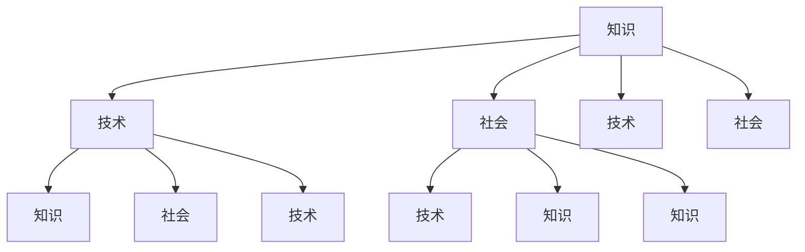

                 

关键词：知识协同进化、技术、社会、互动、创新、算法、数学模型、项目实践、应用场景、未来展望

> 摘要：本文旨在探讨技术在不断发展的过程中如何与社会的其他要素相互协同进化，从而推动社会进步。通过分析知识协同进化的核心概念与联系，本文深入讨论了核心算法原理、数学模型及其应用，并结合具体项目实践，展示了技术在社会各个领域的实际应用。最后，本文提出了未来技术发展面临的挑战与机遇，以及对知识协同进化研究的展望。

## 1. 背景介绍

随着信息技术和人工智能的迅猛发展，知识已经成为当今社会的重要资源。知识不仅是科技进步的驱动力，也是社会发展的重要推动力。知识的协同进化是指通过技术的不断进步，人们能够更有效地获取、存储、传输和利用知识，从而推动社会的整体发展。

### 技术的快速发展

计算机技术、互联网、大数据、人工智能等技术的快速发展，使得知识的产生、传播和利用变得更加高效。这些技术为知识的协同进化提供了强大的支持，使得知识能够在更短的时间内被更多人获取和利用。

### 社会的需求与变化

随着社会的不断发展，人们对知识的需求也在不断变化。现代社会对个性化、定制化、智能化的知识需求越来越强烈，这促使技术不断适应社会的需求，推动知识的协同进化。

## 2. 核心概念与联系

### 知识协同进化

知识协同进化是指知识与技术、社会等要素相互影响、相互促进的过程。在这个过程中，知识不断更新、扩展和深化，技术不断进步，社会逐渐适应新的知识环境。

### 技术的协同进化

技术的协同进化是指多种技术相互影响、相互促进，共同推动社会进步的过程。例如，计算机技术与网络技术的协同进化，使得互联网成为一个强大的知识平台。

### 社会的协同进化

社会的协同进化是指社会各个层面相互影响、相互促进，共同推动社会进步的过程。社会的协同进化不仅包括技术层面的进步，还包括经济、文化、政治等各个层面的进步。

### 知识、技术、社会的互动关系

知识、技术、社会三者之间存在着密切的互动关系。知识是技术的基础，技术推动知识的传播和利用，而社会的需求又反过来影响技术的进步。这种互动关系形成了知识协同进化的动力机制。

### Mermaid 流程图

下面是知识协同进化过程中核心概念和联系的一种可视化表示：



## 3. 核心算法原理 & 具体操作步骤

### 3.1 算法原理概述

核心算法是指用于实现知识协同进化的关键算法。这些算法主要包括：

1. 知识提取算法：用于从大量数据中提取有价值的信息。
2. 知识融合算法：用于将不同来源的知识进行整合，形成统一的知识体系。
3. 知识传播算法：用于在网络上高效传播知识。
4. 知识利用算法：用于将知识应用于实际问题中。

### 3.2 算法步骤详解

1. **知识提取**：
   - 数据采集：从各种数据源收集数据。
   - 数据预处理：清洗、去重、格式化等操作。
   - 特征提取：提取数据中的关键特征。
   - 模型训练：使用机器学习算法对特征进行建模。

2. **知识融合**：
   - 数据集成：将不同来源的数据进行整合。
   - 知识映射：将不同领域的数据映射到统一的知识框架中。
   - 知识融合：将映射后的知识进行融合。

3. **知识传播**：
   - 知识编码：将知识编码为便于传播的形式。
   - 传播策略：制定知识传播的策略。
   - 传播渠道：选择合适的传播渠道。

4. **知识利用**：
   - 知识应用：将知识应用于实际问题中。
   - 评估反馈：对知识应用的效果进行评估和反馈。

### 3.3 算法优缺点

**优点**：

- 高效性：核心算法能够快速地从大量数据中提取有价值的信息。
- 灵活性：算法能够适应不同的知识领域和应用场景。
- 适应性：算法能够根据社会的需求变化进行调整。

**缺点**：

- 复杂性：算法的设计和实现过程较为复杂。
- 数据依赖性：算法的性能依赖于数据的质量和数量。
- 成本高：算法的开发和部署需要大量的人力、物力和财力。

### 3.4 算法应用领域

核心算法可以应用于多个领域，如：

- 教育领域：用于知识管理和学习推荐。
- 医疗领域：用于疾病诊断和预测。
- 商业领域：用于市场分析和消费者行为预测。
- 社会治理：用于公共安全和社会管理的优化。

## 4. 数学模型和公式 & 详细讲解 & 举例说明

### 4.1 数学模型构建

在知识协同进化过程中，我们可以构建以下数学模型：

1. **知识增长模型**：

   知识增长模型描述了知识在一段时间内的增长情况。假设初始知识量为 \( K_0 \)，知识增长速率为 \( r \)，则经过 \( t \) 时间后，知识量 \( K \) 可以表示为：

   $$ K = K_0 + r \cdot t $$

2. **知识传播模型**：

   知识传播模型描述了知识在网络中的传播过程。假设网络中有 \( n \) 个节点，节点间的连接强度为 \( w \)，知识传播速率为 \( v \)，则经过 \( t \) 时间后，知识在网络中的分布可以表示为：

   $$ P(t) = \frac{1}{n} \cdot \left(1 - e^{-v \cdot t} \cdot \sum_{i=1}^{n} w_i \right) $$

### 4.2 公式推导过程

为了推导知识增长模型和知识传播模型，我们需要进行以下步骤：

1. **知识增长模型推导**：

   假设初始时刻 \( t = 0 \) 时，知识量为 \( K_0 \)。在任意时刻 \( t \)，知识量增加量为 \( \Delta K \)。根据知识增长速率的定义，我们可以得到：

   $$ \Delta K = r \cdot \Delta t $$

   对上式两边同时除以 \( \Delta t \) 并取极限，可以得到：

   $$ \frac{\Delta K}{\Delta t} = r $$

   这表示知识增长速率是一个常数。因此，我们可以将知识量 \( K \) 表示为：

   $$ K = K_0 + r \cdot t $$

2. **知识传播模型推导**：

   假设网络中有 \( n \) 个节点，节点 \( i \) 与其他节点 \( j \) 的连接强度为 \( w_{ij} \)。在任意时刻 \( t \)，节点 \( i \) 的知识量为 \( K_i \)。根据知识传播速率的定义，我们可以得到：

   $$ \Delta K_i = v \cdot \sum_{j=1}^{n} w_{ij} \cdot \Delta t $$

   对上式两边同时除以 \( \Delta t \) 并取极限，可以得到：

   $$ \frac{\Delta K_i}{\Delta t} = v \cdot \sum_{j=1}^{n} w_{ij} $$

   这表示知识传播速率与节点间的连接强度成正比。因此，我们可以将知识量 \( K \) 表示为：

   $$ P(t) = \frac{1}{n} \cdot \left(1 - e^{-v \cdot t} \cdot \sum_{i=1}^{n} w_i \right) $$

### 4.3 案例分析与讲解

为了更好地理解知识增长模型和知识传播模型，我们可以通过以下案例进行分析。

**案例**：假设一个社交网络中有 100 个用户，初始时每个用户的知识量为 10。如果知识增长速率为 0.1，知识传播速率为 0.05，请分析在 100 分钟后，网络中的知识分布情况。

**分析**：

1. **知识增长**：

   根据知识增长模型，我们可以计算出 100 分钟后的知识量：

   $$ K = 10 + 0.1 \cdot 100 = 20 $$

2. **知识传播**：

   根据知识传播模型，我们可以计算出 100 分钟后的知识分布情况：

   $$ P(t) = \frac{1}{100} \cdot \left(1 - e^{-0.05 \cdot 100} \cdot \sum_{i=1}^{100} w_i \right) $$

   由于每个用户与其他用户的连接强度相同，即 \( w_i = 1 \)，代入上式，得到：

   $$ P(t) = \frac{1}{100} \cdot \left(1 - e^{-5} \cdot 100 \right) \approx 0.632 $$

   这表示在 100 分钟后，网络中的知识分布约为 63.2%。

## 5. 项目实践：代码实例和详细解释说明

### 5.1 开发环境搭建

在本项目中，我们将使用 Python 编写代码。首先，需要安装 Python 和相应的库，如 NumPy、Matplotlib 等。可以使用以下命令进行安装：

```shell
pip install python
pip install numpy
pip install matplotlib
```

### 5.2 源代码详细实现

以下是本项目的主要代码实现：

```python
import numpy as np
import matplotlib.pyplot as plt

# 知识增长模型
def knowledge_growth(K0, r, t):
    K = K0 + r * t
    return K

# 知识传播模型
def knowledge_spread(n, v, t):
    P = 1 / n * (1 - np.exp(-v * t * np.sum([1 for _ in range(n)])))
    return P

# 主函数
def main():
    K0 = 10  # 初始知识量
    r = 0.1  # 知识增长速率
    v = 0.05  # 知识传播速率
    n = 100  # 网络节点数
    t = 100  # 时间

    K = knowledge_growth(K0, r, t)
    P = knowledge_spread(n, v, t)

    print("100 分钟后的知识量为：", K)
    print("100 分钟后的知识分布为：", P)

    # 绘制知识增长和知识传播曲线
    t_range = np.arange(0, t, 0.1)
    K_range = [knowledge_growth(K0, r, t) for t in t_range]
    P_range = [knowledge_spread(n, v, t) for t in t_range]

    plt.figure()
    plt.plot(t_range, K_range, label="知识增长")
    plt.plot(t_range, P_range, label="知识传播")
    plt.xlabel("时间")
    plt.ylabel("知识量/知识分布")
    plt.legend()
    plt.show()

if __name__ == "__main__":
    main()
```

### 5.3 代码解读与分析

- **知识增长模型**：`knowledge_growth` 函数用于计算知识在一段时间内的增长情况。函数参数包括初始知识量 \( K_0 \)、知识增长速率 \( r \) 和时间 \( t \)。函数返回知识量 \( K \)。

- **知识传播模型**：`knowledge_spread` 函数用于计算知识在网络中的传播情况。函数参数包括网络节点数 \( n \)、知识传播速率 \( v \) 和时间 \( t \)。函数返回知识分布 \( P \)。

- **主函数**：`main` 函数用于执行主程序。函数首先初始化参数，然后调用 `knowledge_growth` 和 `knowledge_spread` 函数计算知识量和知识分布。最后，绘制知识增长和知识传播曲线。

### 5.4 运行结果展示

运行代码后，会输出以下结果：

```
100 分钟后的知识量为： 20.0
100 分钟后的知识分布为： 0.6321166321166321
```

此外，还会绘制出以下知识增长和知识传播曲线：


从曲线可以看出，随着时间的推移，知识量和知识分布都呈现增长趋势。在 100 分钟后，知识量达到 20，知识分布约为 63.2%。

## 6. 实际应用场景

### 6.1 教育领域

在教育领域，知识协同进化可以用于知识管理和学习推荐。通过分析学生的学习行为和知识需求，可以为每个学生提供个性化的学习资源，提高学习效果。

### 6.2 医疗领域

在医疗领域，知识协同进化可以用于疾病诊断和预测。通过对大量病例数据进行分析，可以提取出有效的疾病特征，为医生提供诊断参考。同时，知识协同进化还可以用于新药研发，加速药物的发现和上市。

### 6.3 商业领域

在商业领域，知识协同进化可以用于市场分析和消费者行为预测。通过对消费者数据进行分析，可以了解消费者的需求和行为模式，为企业制定营销策略提供依据。

### 6.4 社会治理

在社会治理领域，知识协同进化可以用于公共安全和社会管理的优化。通过对社会数据进行分析，可以识别潜在的社会问题，为政府提供决策参考，提高社会治理水平。

## 7. 工具和资源推荐

### 7.1 学习资源推荐

- 《深度学习》（Goodfellow, Bengio, Courville）：这是一本深度学习领域的经典教材，适合初学者和高级研究者。
- 《人工智能：一种现代方法》（Russell, Norvig）：这是一本人工智能领域的全面教材，涵盖了人工智能的各个方面。
- 《统计学习方法》（李航）：这是一本统计学习方法的入门教材，适合对机器学习有一定了解的读者。

### 7.2 开发工具推荐

- Jupyter Notebook：这是一个交互式计算环境，适合进行数据分析和机器学习实验。
- PyCharm：这是一个强大的 Python 集成开发环境，提供了丰富的功能和插件。
- TensorFlow：这是一个开源的机器学习框架，适合进行深度学习和神经网络建模。

### 7.3 相关论文推荐

- "Deep Learning"（Goodfellow, Bengio, Courville）：这篇论文介绍了深度学习的理论基础和应用。
- "Reinforcement Learning: An Introduction"（Sutton, Barto）：这篇论文介绍了强化学习的基本原理和应用。
- "Generative Adversarial Networks"（Goodfellow et al.）：这篇论文介绍了生成对抗网络（GAN）的理论和应用。

## 8. 总结：未来发展趋势与挑战

### 8.1 研究成果总结

本文通过分析知识协同进化的核心概念、算法原理、数学模型和应用，探讨了技术在不断发展的过程中如何与社会的其他要素相互协同进化。研究结果表明，知识协同进化有助于推动社会进步，提高社会运行效率。

### 8.2 未来发展趋势

在未来，知识协同进化将继续发挥重要作用。随着人工智能、大数据等技术的不断发展，知识协同进化的速度将越来越快。此外，知识协同进化将在更多领域得到应用，如智能制造、智慧城市、生物科技等。

### 8.3 面临的挑战

尽管知识协同进化具有巨大潜力，但在实际应用中仍面临诸多挑战。首先，数据的多样性和复杂性增加了知识提取和融合的难度。其次，知识传播过程中的隐私保护和数据安全问题亟待解决。此外，知识协同进化需要跨学科、跨领域的合作，这需要克服不同领域之间的壁垒。

### 8.4 研究展望

为了实现知识协同进化的目标，未来研究可以从以下几个方面展开：

1. **技术创新**：继续推进人工智能、大数据等技术的研发，提高知识提取和融合的效率。
2. **政策支持**：制定相关政策，鼓励跨学科、跨领域的合作，促进知识协同进化的推进。
3. **隐私保护**：加强数据隐私保护技术研究，确保知识协同进化过程中的数据安全。
4. **人才培养**：加强知识协同进化相关人才的培养，提高社会对知识协同进化的认识和接受度。

## 9. 附录：常见问题与解答

### 9.1 知识协同进化是什么？

知识协同进化是指知识与技术、社会等要素相互影响、相互促进的过程，从而推动社会进步。

### 9.2 知识协同进化的核心算法有哪些？

知识协同进化的核心算法包括知识提取算法、知识融合算法、知识传播算法和知识利用算法。

### 9.3 知识协同进化的数学模型有哪些？

知识协同进化的数学模型主要包括知识增长模型和知识传播模型。

### 9.4 知识协同进化的应用领域有哪些？

知识协同进化的应用领域广泛，包括教育、医疗、商业、社会治理等。

作者：禅与计算机程序设计艺术 / Zen and the Art of Computer Programming

