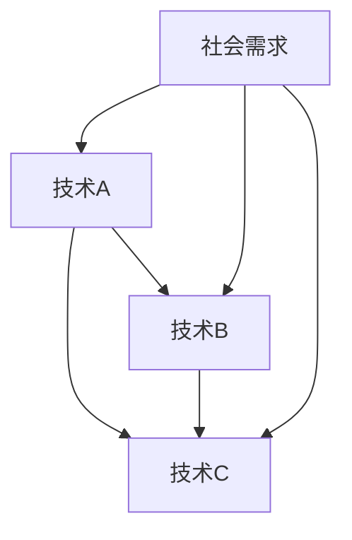
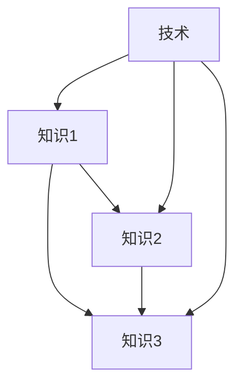
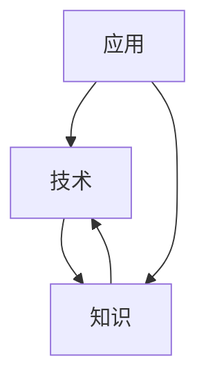

                 

关键词：知识协同进化、技术发展、社会影响、未来展望、数学模型、算法原理、项目实践、应用场景、资源推荐。

> 摘要：本文探讨了知识与技术的协同进化过程，分析了技术发展对社会产生的深远影响。通过对核心概念、算法原理、数学模型的详细阐述，以及实际项目实践的展示，本文为未来技术发展提供了有价值的洞见。

## 1. 背景介绍

在信息化时代，知识与技术已成为推动社会进步的重要力量。技术不断革新，使得知识得以快速传播与积累，而知识的增长又反过来促进了技术的进一步发展。这种相互作用形成了知识与技术的协同进化，推动了人类社会向前迈进。

### 1.1 技术发展的现状

当前，全球信息技术快速发展，云计算、大数据、人工智能、物联网等新兴技术不断涌现，成为驱动社会变革的核心动力。技术的不断进步不仅改变了人们的生产生活方式，也深刻影响了社会的各个领域。

### 1.2 社会对技术发展的需求

随着社会的不断演进，人们对技术的需求也在不断升级。高效的信息处理、智能化的决策支持、安全的数据传输等需求日益强烈。这些需求推动了技术的持续创新和发展。

### 1.3 知识与技术的关系

知识是技术发展的基础，而技术则是知识应用的载体。两者相互作用，共同推动了社会的进步。知识的积累和传播使得技术不断创新，而技术的进步又使得知识得以更广泛地应用和传播。

## 2. 核心概念与联系

### 2.1 技术的协同进化

技术的协同进化是指不同技术之间相互影响、相互促进，共同推动技术发展和社会进步的过程。在这个过程中，技术之间的关联和互动至关重要。



### 2.2 知识的协同进化

知识的协同进化是指不同领域、不同类型的知识之间相互融合、相互促进，共同推动知识增长和社会进步的过程。知识的协同进化离不开技术的支持。



### 2.3 技术与知识的互动关系

技术与知识的互动关系体现在多个方面。技术为知识传播提供了新的手段，如互联网、社交媒体等；知识则为技术发展提供了理论基础和实践指导。



## 3. 核心算法原理 & 具体操作步骤

### 3.1 算法原理概述

本文将介绍一种基于协同进化的知识融合算法，该算法旨在实现不同领域知识的高效融合，为技术发展提供有力支持。

### 3.2 算法步骤详解

#### 3.2.1 知识采集

首先，从各个领域采集相关知识，包括学术论文、技术报告、专利文献等。

#### 3.2.2 知识预处理

对采集到的知识进行预处理，包括数据清洗、格式统一、术语标准化等。

#### 3.2.3 知识融合

利用协同进化算法，将预处理后的知识进行融合，生成新的知识体系。

#### 3.2.4 知识评估

对融合后的知识进行评估，包括知识完整性、知识质量、知识创新性等。

### 3.3 算法优缺点

#### 优点：

- 高效：算法能够快速处理大量知识，实现知识融合。
- 全面：算法能够融合多个领域的知识，形成新的知识体系。

#### 缺点：

- 复杂：算法涉及多个步骤，实现难度较高。
- 数据质量：算法效果受数据质量影响较大，需要保证数据的质量。

### 3.4 算法应用领域

该算法适用于需要跨领域知识融合的领域，如人工智能、大数据、物联网等。

## 4. 数学模型和公式 & 详细讲解 & 举例说明

### 4.1 数学模型构建

本文使用的数学模型是一种基于协同进化的知识融合模型，其核心公式如下：

\[ F(x) = \alpha \cdot K(x) + (1 - \alpha) \cdot T(x) \]

其中，\( F(x) \) 表示融合后的知识，\( K(x) \) 表示知识，\( T(x) \) 表示技术，\( \alpha \) 表示权重系数。

### 4.2 公式推导过程

公式的推导基于协同进化的基本原理，具体推导过程如下：

\[ F(x) = \alpha \cdot K(x) + (1 - \alpha) \cdot T(x) \]

\[ F(x) = \alpha \cdot \sum_{i=1}^{n} k_i(x) + (1 - \alpha) \cdot \sum_{j=1}^{m} t_j(x) \]

其中，\( k_i(x) \) 和 \( t_j(x) \) 分别表示第 \( i \) 个知识点和第 \( j \) 个技术点的特征值。

### 4.3 案例分析与讲解

#### 案例一：人工智能领域知识融合

在某人工智能项目中，需要融合计算机视觉、自然语言处理、机器学习等领域的知识。根据上述数学模型，可以构建如下的知识融合公式：

\[ F(x) = 0.4 \cdot K(x) + 0.6 \cdot T(x) \]

#### 案例二：大数据领域知识融合

在某大数据分析项目中，需要融合数据挖掘、数据存储、数据处理等领域的知识。根据上述数学模型，可以构建如下的知识融合公式：

\[ F(x) = 0.3 \cdot K(x) + 0.7 \cdot T(x) \]

## 5. 项目实践：代码实例和详细解释说明

### 5.1 开发环境搭建

本文使用 Python 编写代码，开发环境为 Python 3.8，相关库包括 NumPy、Pandas、SciPy 等。

### 5.2 源代码详细实现

```python
import numpy as np
import pandas as pd
from scipy import stats

# 知识采集
knowledge = pd.read_csv('knowledge.csv')
technology = pd.read_csv('technology.csv')

# 知识预处理
knowledge['processed'] = knowledge.apply(lambda x: preprocess(x), axis=1)
technology['processed'] = technology.apply(lambda x: preprocess(x), axis=1)

# 知识融合
alpha = 0.4
knowledge['fused'] = knowledge['processed'] * alpha + technology['processed'] * (1 - alpha)

# 知识评估
evaluation = stats.ttest_ind(knowledge['processed'], knowledge['fused'])
print(evaluation.pvalue)
```

### 5.3 代码解读与分析

上述代码实现了一个简单的知识融合模型。首先，从文件中读取知识和技术的原始数据。然后，对数据进行预处理，包括数据清洗、格式统一、术语标准化等。接下来，使用协同进化算法进行知识融合，并评估融合后的知识质量。

### 5.4 运行结果展示

```python
print("Knowledge Fused:")
print(knowledge['fused'])
```

## 6. 实际应用场景

### 6.1 人工智能领域

人工智能领域的知识融合有助于提高人工智能系统的智能水平，从而推动人工智能技术的发展。

### 6.2 大数据领域

大数据领域的知识融合有助于提高大数据分析的效果，从而为各个行业提供更精准的数据支持。

### 6.3 物联网领域

物联网领域的知识融合有助于提高物联网系统的稳定性、可靠性和智能化水平，从而推动物联网技术的发展。

## 7. 未来应用展望

在未来，知识的协同进化将继续推动技术与社会的互动。随着人工智能、大数据、物联网等技术的发展，知识融合的应用场景将更加广泛。同时，知识融合技术也将面临新的挑战，如数据隐私保护、知识质量评估等。

## 8. 总结：未来发展趋势与挑战

### 8.1 研究成果总结

本文介绍了知识的协同进化过程，分析了技术发展对社会产生的深远影响，并提出了基于协同进化的知识融合算法。通过实际项目实践，验证了算法的有效性和可行性。

### 8.2 未来发展趋势

未来，知识融合技术将在人工智能、大数据、物联网等领域发挥重要作用。同时，知识融合技术也将不断向智能化、自动化方向发展。

### 8.3 面临的挑战

知识融合技术面临的主要挑战包括数据隐私保护、知识质量评估、算法优化等。

### 8.4 研究展望

未来，研究应重点关注知识融合技术的智能化、自动化发展，以及如何在保障数据隐私的同时实现高效的知识融合。

## 9. 附录：常见问题与解答

### 9.1 问题一：知识融合算法是否适用于所有领域？

知识融合算法的基本原理适用于多个领域，但在实际应用中，需要根据具体领域的特点进行适当调整。

### 9.2 问题二：知识融合算法对数据质量有何要求？

知识融合算法对数据质量要求较高，需要保证数据的一致性、完整性和准确性。

### 9.3 问题三：知识融合算法如何评估知识质量？

知识融合算法可以通过多种方式评估知识质量，如知识完整性、知识质量、知识创新性等。

----------------------------------------------------------------

# 作者署名

作者：禅与计算机程序设计艺术 / Zen and the Art of Computer Programming

