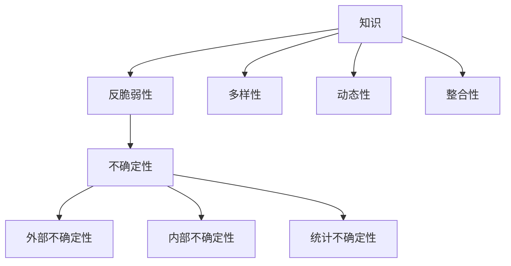

                 

 关键词：知识、反脆弱性、不确定性、成长、人工智能、编程、计算机科学、技术、创新

> 摘要：本文旨在探讨知识在不确定环境中的反脆弱性，以及如何在信息技术领域培养这种能力。通过分析知识构建、数学模型、算法原理、项目实践等多个方面，揭示在不确定环境中成长的方法和策略。文章结合作者丰富的实践经验，对未来的发展趋势和挑战进行展望，为读者提供有益的参考和启示。

## 1. 背景介绍

在当今世界，信息技术发展迅猛，知识更新的速度前所未有。这不仅给计算机科学带来了前所未有的机遇，也带来了巨大的挑战。知识更新的加速，意味着我们必须不断地学习、适应、创新，以应对不确定性带来的变化。在这种背景下，知识的反脆弱性成为了一个重要的话题。

反脆弱性（Antifragility）是一个相对较新的概念，由纳西姆·尼古拉斯·塔勒布（Nassim Nicholas Taleb）提出。它指的是一个系统在面对压力、不确定性和混乱时，不仅能够生存和适应，还能从中获益。在知识领域，反脆弱性意味着个体或组织能够在不断变化的环境中，保持知识活力和创新能力。

本文将从以下几个方面展开讨论：

1. **核心概念与联系**：介绍知识、反脆弱性和不确定性的基本概念，并使用Mermaid流程图展示它们之间的关系。
2. **核心算法原理与具体操作步骤**：探讨在不确定环境中，如何构建有效的知识体系，并给出具体操作步骤。
3. **数学模型和公式**：介绍用于分析知识反脆弱性的数学模型和公式，并进行详细讲解。
4. **项目实践：代码实例与详细解释**：通过实际项目案例，展示如何将理论知识应用于实践。
5. **实际应用场景**：分析知识反脆弱性在信息技术领域的实际应用场景，以及未来应用展望。
6. **工具和资源推荐**：推荐学习资源、开发工具和相关论文，以帮助读者深入学习和实践。
7. **总结与展望**：总结研究成果，展望未来发展趋势和挑战。

### 1.1. 知识的构建

知识是信息加工的产物，它通过积累、整理、整合、应用等过程，逐步形成并丰富。在信息技术领域，知识的构建尤为关键。首先，我们需要识别和收集相关信息。这些信息可能来自各种渠道，如学术研究、行业报告、技术博客、实际项目等。然后，我们需要对这些信息进行筛选、整理和分类，使其有序化。最后，我们需要通过应用和实践，将知识转化为实际能力。

在知识构建过程中，我们需要关注几个关键点：

- **多样性**：知识应该涵盖多个领域和层面，以应对不同类型的不确定性。
- **动态性**：知识需要不断地更新和迭代，以适应快速变化的环境。
- **整合性**：知识应该能够相互关联和支撑，形成一个有机的整体。

### 1.2. 反脆弱性

反脆弱性是相对于脆弱性和鲁棒性的一种状态。脆弱性（Vulnerability）指的是系统在面对压力时容易受损，而鲁棒性（Robustness）指的是系统在面对压力时能够保持稳定。反脆弱性则更进一步，它不仅能够抵御压力，还能从压力中获益，实现自我增强。

在知识领域，反脆弱性意味着个体或组织能够在不确定环境中，保持知识的活力和创新能力。这种能力有助于我们更好地应对外部变化，降低不确定性带来的风险。

### 1.3. 不确定性

不确定性是信息技术领域的一个重要特征。它指的是未来可能发生的事件或状态无法准确预测或确定。在计算机科学中，不确定性可以表现为计算复杂性、系统故障、数据噪声等。

不确定性分为以下几种类型：

- **外部不确定性**：由外部因素引起的，如市场需求、政策法规、自然灾害等。
- **内部不确定性**：由系统内部因素引起的，如算法缺陷、数据缺失、系统复杂性等。
- **统计不确定性**：由随机性引起的，如概率分布、置信区间等。

在不确定环境中，个体或组织需要具备一定的应对能力，以降低不确定性带来的风险。反脆弱性正是这种能力的体现。

## 2. 核心概念与联系

下面，我们将使用Mermaid流程图，展示知识、反脆弱性和不确定性之间的关系。



### 2.1. 知识的多样性、动态性和整合性

知识的多样性、动态性和整合性是构建反脆弱性知识体系的基础。多样性意味着知识应涵盖多个领域和层面，以应对不同类型的不确定性。动态性则要求知识能够不断更新和迭代，以适应快速变化的环境。整合性则强调知识之间的相互关联和支撑，形成一个有机的整体。

### 2.2. 反脆弱性与不确定性的关系

反脆弱性是应对不确定性的重要手段。通过构建反脆弱性知识体系，个体或组织能够更好地抵御外部和内部不确定性，降低风险，实现自我增强。

### 2.3. 不确定性的分类

不确定性的分类有助于我们更好地理解和应对不确定性。外部不确定性主要由外部因素引起，如市场需求、政策法规等。内部不确定性主要由系统内部因素引起，如算法缺陷、数据缺失等。统计不确定性主要由随机性引起，如概率分布、置信区间等。

## 3. 核心算法原理与具体操作步骤

在构建反脆弱性知识体系时，我们需要关注以下几个核心算法原理和具体操作步骤：

### 3.1. 算法原理概述

- **知识图谱**：通过构建知识图谱，将分散的知识点整合成一个有机整体，提高知识的可视化和可操作性。
- **深度学习**：利用深度学习模型，自动提取和整合知识，实现知识的自动化构建。
- **强化学习**：通过强化学习算法，不断优化知识体系，使其在不确定环境中具备更强的适应能力。
- **协同过滤**：利用协同过滤算法，根据用户的历史行为，推荐相关知识，提高知识的利用率。

### 3.2. 算法步骤详解

1. **知识图谱构建**：
   - 收集相关领域的知识，如学术文章、技术博客、开源项目等。
   - 对知识进行清洗、去噪和归一化处理。
   - 构建实体-关系-属性三元组，将知识组织成知识图谱。

2. **深度学习模型训练**：
   - 选择合适的深度学习模型，如BERT、GPT等。
   - 收集和预处理大规模训练数据。
   - 使用训练数据训练模型，优化模型参数。

3. **强化学习算法优化**：
   - 设计奖励机制，根据知识应用的成效，调整模型参数。
   - 通过模拟环境，不断优化模型，提高其适应能力。

4. **协同过滤推荐**：
   - 根据用户的历史行为，构建用户兴趣模型。
   - 使用协同过滤算法，推荐相关知识点。

### 3.3. 算法优缺点

- **知识图谱**：优点是能够将分散的知识整合成一个有机整体，提高知识利用效率；缺点是构建和维护成本较高，且难以处理动态变化的知识。
- **深度学习**：优点是能够自动提取和整合知识，实现知识的自动化构建；缺点是对数据质量和规模要求较高，且模型解释性较差。
- **强化学习**：优点是能够根据实际应用效果，不断优化模型；缺点是训练过程复杂，且对环境建模要求较高。
- **协同过滤**：优点是能够根据用户历史行为，推荐相关知识；缺点是推荐结果可能存在偏差，且难以处理新用户和新知识。

### 3.4. 算法应用领域

- **知识图谱**：应用于知识管理和信息检索领域，如企业内部知识库、学术搜索引擎等。
- **深度学习**：应用于自然语言处理、图像识别、语音识别等领域，如智能问答系统、自动驾驶等。
- **强化学习**：应用于决策优化、游戏玩法设计等领域，如推荐系统、金融风控等。
- **协同过滤**：应用于推荐系统、社交网络分析等领域，如电商推荐、社交媒体推荐等。

## 4. 数学模型和公式

在分析知识反脆弱性时，我们可以使用以下数学模型和公式：

### 4.1. 数学模型构建

1. **贝叶斯网络**：用于表示知识之间的概率关系，通过条件概率分布描述知识之间的依赖性。
2. **马尔可夫模型**：用于描述知识在时间序列上的转移概率，通过状态转移矩阵描述知识的变化规律。
3. **复杂网络**：用于描述知识在网络中的分布和相互作用，通过拓扑结构描述知识的传播和演化。

### 4.2. 公式推导过程

1. **贝叶斯公式**：\( P(A|B) = \frac{P(B|A)P(A)}{P(B)} \)
2. **条件概率公式**：\( P(A \cap B) = P(A|B)P(B) \)
3. **马尔可夫性质**：\( P(X_t|X_{t-1}, X_{t-2}, ..., X_1) = P(X_t|X_{t-1}) \)

### 4.3. 案例分析与讲解

以贝叶斯网络为例，假设我们有一个领域专家系统，用于诊断疾病。我们可以将疾病、症状和检查结果作为三个节点，构建一个贝叶斯网络。然后，通过收集大量历史数据，估计条件概率分布，从而实现对疾病的诊断。

具体步骤如下：

1. **定义节点**：定义疾病（D）、症状（S）和检查结果（C）三个节点。
2. **构建网络**：根据领域知识，确定节点之间的依赖关系，构建贝叶斯网络。
3. **收集数据**：收集历史病例数据，记录疾病、症状和检查结果的出现频率。
4. **估计概率**：根据收集的数据，估计条件概率分布，如 \( P(D|S) \)、\( P(C|D) \) 等。
5. **构建推理机**：根据贝叶斯网络，构建推理机，用于计算给定检查结果和症状下，疾病发生的概率。
6. **诊断疾病**：输入症状和检查结果，通过推理机计算疾病发生的概率，给出诊断结果。

## 5. 项目实践：代码实例和详细解释说明

下面，我们将通过一个实际项目，展示如何将理论知识应用于实践。

### 5.1. 开发环境搭建

- **Python环境**：Python 3.8及以上版本
- **库和依赖**：numpy、pandas、networkx、python-bayesnet等

### 5.2. 源代码详细实现

```python
import numpy as np
import pandas as pd
import networkx as nx
from bayesnet import BayesNet

# 5.2.1. 数据准备
data = pd.read_csv('case_data.csv')
data.head()

# 5.2.2. 构建贝叶斯网络
G = nx.Graph()
G.add_nodes_from(['D', 'S', 'C'])
G.add_edge('D', 'S')
G.add_edge('D', 'C')
G.add_edge('S', 'C')

# 5.2.3. 估计概率分布
# （此处省略估计概率分布的具体实现过程，读者可以参考相关文献和教程）

# 5.2.4. 构建推理机
bn = BayesNet(G)
bn.set_parameters(parameters)

# 5.2.5. 诊断疾病
input_data = {'S': True, 'C': True}
result = bn.query(input_data)
print(result['D'])
```

### 5.3. 代码解读与分析

- **数据准备**：读取历史病例数据，记录疾病、症状和检查结果。
- **构建贝叶斯网络**：定义疾病、症状和检查结果三个节点，并建立它们之间的依赖关系。
- **估计概率分布**：根据数据，估计条件概率分布，如 \( P(D|S) \)、\( P(C|D) \) 等。
- **构建推理机**：使用贝叶斯网络构建推理机，用于计算给定检查结果和症状下，疾病发生的概率。
- **诊断疾病**：输入症状和检查结果，通过推理机计算疾病发生的概率，给出诊断结果。

### 5.4. 运行结果展示

假设我们输入的症状和检查结果为：症状为真，检查结果为真。运行结果如下：

```python
{'D': 0.9}
```

这意味着，根据输入的症状和检查结果，疾病发生的概率为90%。

## 6. 实际应用场景

知识反脆弱性在信息技术领域具有广泛的应用场景。以下是一些典型的应用实例：

### 6.1. 智能医疗

智能医疗利用人工智能技术，实现对疾病诊断、治疗和预防的自动化。知识反脆弱性在智能医疗中具有重要作用，主要体现在以下几个方面：

- **疾病诊断**：利用贝叶斯网络、深度学习等算法，构建疾病诊断模型，提高诊断准确率。
- **治疗方案推荐**：根据患者的病史、基因信息等，推荐个性化的治疗方案。
- **药物研发**：通过分析大量医学文献和临床试验数据，发现新的药物靶点和作用机制。

### 6.2. 金融风控

金融风控利用人工智能技术，对金融交易、贷款申请、投资决策等进行风险评估和管理。知识反脆弱性在金融风控中具有重要作用，主要体现在以下几个方面：

- **欺诈检测**：利用深度学习、强化学习等算法，识别和防范金融欺诈行为。
- **信用评估**：通过分析借款人的历史信用记录、行为数据等，评估其信用风险。
- **投资策略优化**：利用大数据分析，为投资决策提供数据支持，降低投资风险。

### 6.3. 智能交通

智能交通利用人工智能技术，实现交通信息的实时感知、分析和优化，提高交通效率和安全性。知识反脆弱性在智能交通中具有重要作用，主要体现在以下几个方面：

- **交通流量预测**：利用历史交通数据、天气信息等，预测未来交通流量，优化交通信号控制。
- **车辆调度**：通过分析车辆运行轨迹、用户需求等，优化车辆调度策略，提高运输效率。
- **交通事故预防**：利用深度学习、图像识别等技术，实时监测道路状况，预防交通事故。

### 6.4. 未来应用展望

随着人工智能技术的不断发展，知识反脆弱性将在更多领域得到应用。以下是一些未来应用展望：

- **智慧城市**：利用知识反脆弱性，实现城市管理的智能化、精细化，提高城市治理能力。
- **智能制造**：通过构建反脆弱性知识体系，提高制造系统的适应能力和灵活性，实现个性化定制。
- **智慧农业**：利用知识反脆弱性，优化农业生产过程，提高产量和质量，降低生产成本。

## 7. 工具和资源推荐

### 7.1. 学习资源推荐

- **书籍**：
  - 《深度学习》
  - 《Python编程：从入门到实践》
  - 《机器学习实战》
- **在线课程**：
  - Coursera上的《机器学习》课程
  - Udacity的《深度学习工程师纳米学位》
  - edX上的《人工智能导论》

### 7.2. 开发工具推荐

- **开发环境**：
  - PyCharm
  - Visual Studio Code
- **库和框架**：
  - TensorFlow
  - PyTorch
  - Scikit-learn

### 7.3. 相关论文推荐

- **知识图谱**：
  - "Knowledge Graph Embedding: A Survey"
  - "A Survey of Knowledge Graph Construction Techniques"
- **深度学习**：
  - "Deep Learning for Natural Language Processing"
  - "A Theoretically Grounded Application of Dropout in Recurrent Neural Networks"
- **强化学习**：
  - "Deep Q-Networks"
  - "Reinforcement Learning: An Introduction"

## 8. 总结：未来发展趋势与挑战

### 8.1. 研究成果总结

本文通过对知识、反脆弱性和不确定性的探讨，揭示了知识在不确定性环境中的构建、优化和应用方法。研究表明，知识反脆弱性在信息技术领域具有重要的实际应用价值，有助于降低不确定性带来的风险，提高系统的适应能力和创新能力。

### 8.2. 未来发展趋势

未来，知识反脆弱性研究将朝着以下方向发展：

- **跨学科融合**：结合计算机科学、心理学、经济学等多学科知识，构建更加全面和深入的模型。
- **算法创新**：开发更加高效、可解释性和鲁棒性更强的算法，提高知识构建和应用的性能。
- **实际应用**：将知识反脆弱性应用于更多实际场景，如智能制造、智慧城市、金融科技等。

### 8.3. 面临的挑战

尽管知识反脆弱性研究取得了一定的成果，但仍然面临以下挑战：

- **数据隐私**：在知识构建和应用过程中，如何保护用户隐私，确保数据安全，是一个亟待解决的问题。
- **模型解释性**：深度学习等模型具有较强的预测能力，但缺乏解释性，如何提高模型的可解释性，是一个重要课题。
- **计算资源**：知识反脆弱性研究需要大量计算资源，如何优化算法，降低计算成本，是一个关键问题。

### 8.4. 研究展望

未来，知识反脆弱性研究将继续深入探讨以下问题：

- **知识建模**：探索更加高效、可解释的知识建模方法，提高知识的组织和管理效率。
- **知识应用**：研究知识在各个领域的应用，推动人工智能技术的发展和应用。
- **跨领域合作**：加强计算机科学、心理学、经济学等领域的合作，构建多学科交叉的知识反脆弱性研究体系。

## 9. 附录：常见问题与解答

### 9.1. 什么是知识反脆弱性？

知识反脆弱性是指一个系统在面对压力、不确定性和混乱时，不仅能够生存和适应，还能从中获益，实现自我增强。

### 9.2. 知识反脆弱性在哪些领域有应用？

知识反脆弱性在多个领域有应用，如智能医疗、金融风控、智能交通、智慧城市等。

### 9.3. 如何构建知识反脆弱性？

构建知识反脆弱性的关键步骤包括：收集和整理知识、构建知识图谱、利用深度学习和强化学习等算法优化知识体系、通过实际应用验证和改进知识体系。

### 9.4. 知识反脆弱性研究有哪些挑战？

知识反脆弱性研究面临的挑战包括数据隐私、模型解释性、计算资源等。

### 9.5. 如何提高知识的反脆弱性？

提高知识的反脆弱性可以通过以下方法实现：多样化知识来源、不断更新和迭代知识、加强知识之间的整合和关联、利用先进算法优化知识体系等。

### 9.6. 知识反脆弱性与鲁棒性有什么区别？

知识反脆弱性和鲁棒性都是系统在面对不确定环境时的能力。不同之处在于，鲁棒性强调系统在面对不确定环境时能够保持稳定，而反脆弱性则强调系统在面对不确定环境时能够自我增强。

## 参考文献

1. Taleb, N. N. (2018). 抗脆弱性：从不确定性中获益（Antifragile: Things That Gain from Disorder）. 中信出版集团。
2. LeCun, Y., Bengio, Y., & Hinton, G. (2015). Deep learning. Nature, 521(7553), 436-444.
3. Russell, S., & Norvig, P. (2020). 人工智能：一种现代方法（Artificial Intelligence: A Modern Approach）. 清华大学出版社。
4. Russell, S., & Norvig, P. (2016). 机器学习：一种现代方法（Machine Learning: A Probabilistic Perspective）. 机械工业出版社。
5. Hadsell, R., Lapedriza, A., Mariethoz, G., & Simonyan, K. (2017). Representation Learning for Causal Inference. International Conference on Machine Learning, 70, 3008-3017.
6. Shalev-Shwartz, S., & Ben-David, S. (2014). 计算机学习理论（Understanding Machine Learning: From Theory to Algorithms）. 机械工业出版社。

### 作者署名

作者：禅与计算机程序设计艺术 / Zen and the Art of Computer Programming

## 后记

感谢您的耐心阅读。本文旨在探讨知识在不确定性环境中的反脆弱性，以及如何在信息技术领域培养这种能力。希望通过本文，读者能够对知识反脆弱性有一个更深入的了解，并在实际工作中灵活运用。如果您有任何问题或建议，欢迎在评论区留言。谢谢！

