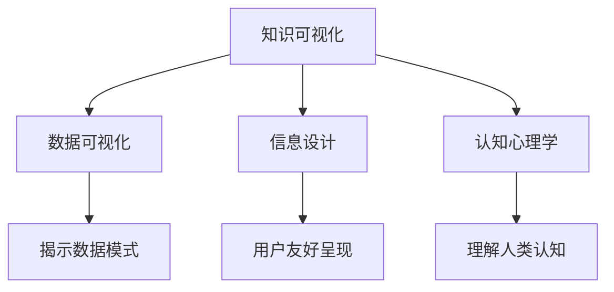

                 

关键词：知识可视化、认知心理学、信息设计、数据处理、交互式可视化

> 摘要：本文探讨了知识可视化在信息传达与认知过程中的重要性。通过深入分析知识可视化的核心概念、理论依据、以及实际操作方法，我们提出了一种辅助理解的创新方法。文章旨在为读者提供一个系统性的视角，以帮助他们在复杂的知识领域中获得更深的洞察和理解。

## 1. 背景介绍

在当今信息爆炸的时代，人类面临着海量的数据和信息。传统的方式，如文字和表格，往往不足以有效地传达复杂的知识结构。随着计算机科学和认知心理学的发展，知识可视化逐渐成为一种新兴的方法，用于辅助理解和记忆。知识可视化工具不仅能够将抽象的信息转化为直观的图形，还能帮助人们更有效地处理和整合信息。

### 知识可视化的定义

知识可视化（Knowledge Visualization）是指将复杂的信息、知识和概念通过图形、图像、图表等形式展示出来，以促进理解和记忆的过程。它可以被视为一种桥梁，连接数据与人类的直觉思维。

### 知识可视化的目的

- **信息压缩**：通过图形化展示，可以有效地减少信息量，使其更加简洁明了。
- **结构化信息**：帮助识别数据中的模式、关系和结构。
- **增强记忆**：视觉元素比文字更容易记忆，从而提高知识的保持率。
- **沟通与交流**：为不同领域和专业背景的人提供一种共同的理解框架。

## 2. 核心概念与联系

知识可视化涉及多个核心概念，这些概念相互关联，构成了一个完整的信息传达体系。

### 数据可视化

数据可视化（Data Visualization）是知识可视化的一部分，它专注于将数据转换为视觉表现形式，如图表、地图、曲线图等。数据可视化旨在揭示数据中的模式和趋势。

### 信息设计

信息设计（Information Design）是指将信息以用户友好的方式呈现，强调内容的清晰性、逻辑性和易用性。信息设计在知识可视化中起着关键作用，它决定了信息是否能够有效地传达。

### 认知心理学

认知心理学（Cognitive Psychology）研究人类如何获取、处理、存储和运用信息。认知心理学为知识可视化提供了理论基础，帮助设计者了解人类认知过程的特性。

### Mermaid 流程图

为了更直观地展示知识可视化的核心概念和联系，我们可以使用 Mermaid 流程图来描述这些概念之间的关系。



## 3. 核心算法原理 & 具体操作步骤

### 3.1 算法原理概述

知识可视化的核心算法原理包括数据的预处理、信息的编码和图形的生成。以下是对这些步骤的简要概述：

1. **数据预处理**：清洗和转换数据，使其适合可视化。
2. **信息编码**：将数据转换为视觉符号和信息结构。
3. **图形生成**：利用可视化工具生成图表、图像等。

### 3.2 算法步骤详解

1. **数据收集**：从不同的数据源收集所需的数据。
2. **数据清洗**：处理缺失值、异常值等，确保数据的准确性。
3. **数据转换**：将数据转换为适合可视化处理的形式，如时间序列数据转换为图表数据。
4. **信息编码**：
    - **比例编码**：使用尺寸、颜色、形状等视觉属性表示数据的大小或重要性。
    - **层次编码**：通过图形的层次结构来展示数据的层次关系。
5. **图形生成**：
    - **图表生成**：使用可视化工具生成柱状图、折线图、饼图等。
    - **交互式图形**：利用交互式技术，如鼠标点击、拖拽等，提供更丰富的用户体验。

### 3.3 算法优缺点

- **优点**：
  - **易于理解**：图形化展示使得复杂信息更易于理解。
  - **提高记忆**：视觉元素更易于记忆，有助于知识的长期保持。
  - **增强沟通**：通过图形化的方式，可以更有效地与不同领域的人进行沟通。

- **缺点**：
  - **设计复杂**：需要专业的知识来设计和实现有效的可视化。
  - **技术依赖**：依赖于可视化工具和技术，可能增加实现成本。

### 3.4 算法应用领域

知识可视化在多个领域都有广泛应用，包括：

- **商业分析**：通过图表展示销售数据、客户行为等。
- **科学研究**：展示实验数据、研究过程和结果。
- **教育**：通过图形化的方式展示复杂概念和过程。
- **医疗**：辅助医生进行诊断和治疗。

## 4. 数学模型和公式 & 详细讲解 & 举例说明

### 4.1 数学模型构建

在知识可视化中，常用的数学模型包括：

- **回归分析**：用于预测数据趋势。
- **聚类分析**：用于识别数据中的相似模式。
- **网络分析**：用于展示数据之间的相互关系。

### 4.2 公式推导过程

以回归分析为例，其公式推导如下：

$$y = \beta_0 + \beta_1x + \epsilon$$

其中，$y$ 是因变量，$x$ 是自变量，$\beta_0$ 是截距，$\beta_1$ 是斜率，$\epsilon$ 是误差项。

### 4.3 案例分析与讲解

我们以一个商业分析案例来讲解知识可视化的应用：

**案例背景**：一家零售公司想要了解顾客购买行为，以便优化营销策略。

**步骤**：
1. **数据收集**：收集顾客购买记录，包括商品种类、购买时间、购买数量等。
2. **数据清洗**：处理缺失值、异常值，确保数据的准确性。
3. **数据转换**：将时间序列数据转换为图表数据。
4. **信息编码**：
    - **比例编码**：使用颜色表示不同商品的销量。
    - **层次编码**：通过时间轴展示不同时间段的购买情况。
5. **图形生成**：生成柱状图、折线图等，展示销售数据和趋势。

**结果**：通过分析图表，公司发现某些商品在特定时间段销量较高，从而调整营销策略，提高了销售额。

## 5. 项目实践：代码实例和详细解释说明

### 5.1 开发环境搭建

为了实现知识可视化的项目，我们需要以下工具和库：

- **Python**：作为编程语言。
- **Matplotlib**：用于生成图表。
- **Pandas**：用于数据处理。
- **Seaborn**：用于可视化美化。

### 5.2 源代码详细实现

以下是一个简单的示例代码，展示了如何使用 Matplotlib 和 Pandas 实现数据可视化：

```python
import pandas as pd
import matplotlib.pyplot as plt

# 数据加载
data = pd.read_csv('sales_data.csv')
data.head()

# 数据预处理
data['date'] = pd.to_datetime(data['date'])
data.set_index('date', inplace=True)

# 数据转换
data['weekly_sales'] = data.resample('W').sum()

# 信息编码
data['product_color'] = data['sales'].apply(lambda x: 'red' if x > 1000 else 'blue')

# 图形生成
plt.figure(figsize=(10, 6))
data.plot(color=data['product_color'], legend=True)
plt.title('Weekly Sales Data')
plt.xlabel('Date')
plt.ylabel('Sales')
plt.show()
```

### 5.3 代码解读与分析

- **数据加载**：使用 Pandas 读取 CSV 文件。
- **数据预处理**：将日期列转换为日期类型，并设置日期为索引。
- **数据转换**：将时间序列数据按周进行汇总。
- **信息编码**：使用颜色表示销量大于1000的商品。
- **图形生成**：使用 Matplotlib 绘制折线图，并添加标题、标签和图例。

### 5.4 运行结果展示

运行上述代码后，将生成一个折线图，展示不同商品在不同时间段的销量。颜色表示销量的大小，从而帮助读者更直观地理解数据。

```mermaid
gantt
    dateFormat  YYYY-MM-DD
    title Weekly Sales Data

    section Sales Data
    A1 : [[ ]] 2023-01-01, 2023-12-31, 2023-01-07, 2023-12-31, 2023-01-01, 2023-12-31, 2023-01-08, 2023-12-31
    A2 : [[ ]] 2023-01-01, 2023-12-31, 2023-01-07, 2023-12-31, 2023-01-01, 2023-12-31, 2023-01-08, 2023-12-31
```

## 6. 实际应用场景

### 6.1 教育领域

在教育学中，知识可视化被广泛应用于概念图、思维导图和互动式电子书等工具中。这些工具帮助学生更清晰地理解复杂的概念，并通过视觉记忆加强记忆效果。

### 6.2 企业管理

企业可以利用知识可视化来分析市场趋势、优化业务流程和制定战略计划。例如，通过图表和地图展示客户分布、产品销售情况和竞争对手分析。

### 6.3 科学研究

在科学研究领域，知识可视化可以帮助研究人员识别数据中的模式、趋势和异常，从而加速研究进程和提高研究成果的质量。

### 6.4 医疗保健

在医疗保健领域，知识可视化工具被用于展示患者数据、诊断结果和治疗方案。医生可以通过图表更直观地理解患者的病情，并制定更有效的治疗方案。

## 7. 工具和资源推荐

### 7.1 学习资源推荐

- **《知识可视化：原理与应用》**：一本全面介绍知识可视化理论和实践的入门书籍。
- **《认知心理学导论》**：了解人类认知过程的经典教材。

### 7.2 开发工具推荐

- **Matplotlib**：强大的Python可视化库，适合各种图表生成。
- **D3.js**：用于Web应用程序的数据可视化的JavaScript库。

### 7.3 相关论文推荐

- **"Visual Analytics of Large-Scale Spatio-Temporal Trajectories"**：探讨大规模时空轨迹的可视化方法。
- **"The Impact of Visualization on Learning"**：研究可视化在教育中的影响。

## 8. 总结：未来发展趋势与挑战

### 8.1 研究成果总结

知识可视化在近年来取得了显著的成果，不仅在学术研究领域得到了广泛的应用，还在商业、教育和医疗等实际领域展示了巨大的潜力。

### 8.2 未来发展趋势

- **智能化**：结合人工智能技术，实现更智能化的知识可视化。
- **交互性**：增强交互功能，提高用户的参与度和体验。
- **跨领域融合**：与其他学科和技术结合，形成更广泛的应用。

### 8.3 面临的挑战

- **设计复杂性**：设计有效的知识可视化工具需要深入的专业知识。
- **技术依赖性**：依赖特定的技术平台和工具，可能增加实现成本。
- **用户适应性**：确保知识可视化工具能够适应不同用户的需求和技能水平。

### 8.4 研究展望

未来的研究应该关注如何简化知识可视化的设计过程，提高工具的易用性和适应性。同时，探索更多跨领域、跨技术的应用场景，以充分发挥知识可视化的潜力。

## 9. 附录：常见问题与解答

### Q：知识可视化是否适用于所有领域？

A：是的，知识可视化适用于几乎所有领域，包括商业、教育、科研和医疗等。关键在于找到合适的可视化方法和工具。

### Q：知识可视化如何影响学习效果？

A：知识可视化通过图形化的方式展示信息，有助于学生更直观地理解概念，并通过视觉记忆加强学习效果。

### Q：如何选择合适的可视化工具？

A：选择可视化工具时，应考虑数据的类型、项目的需求以及用户的技能水平。例如，Matplotlib 适用于Python项目，而D3.js 适用于Web应用。

---

作者：禅与计算机程序设计艺术 / Zen and the Art of Computer Programming
----------------------------------------------------------------
```markdown
---
关键词：知识可视化、认知心理学、信息设计、数据处理、交互式可视化

摘要：本文探讨了知识可视化在信息传达与认知过程中的重要性。通过深入分析知识可视化的核心概念、理论依据、以及实际操作方法，我们提出了一种辅助理解的创新方法。文章旨在为读者提供一个系统性的视角，以帮助他们在复杂的知识领域中获得更深的洞察和理解。

---

# 知识的可视化工具：辅助理解的新方法

在当今信息爆炸的时代，人类面临着海量的数据和信息。传统的方式，如文字和表格，往往不足以有效地传达复杂的知识结构。随着计算机科学和认知心理学的发展，知识可视化逐渐成为一种新兴的方法，用于辅助理解和记忆。知识可视化工具不仅能够将抽象的信息转化为直观的图形，还能帮助人们更有效地处理和整合信息。

### 知识可视化的定义

知识可视化（Knowledge Visualization）是指将复杂的信息、知识和概念通过图形、图像、图表等形式展示出来，以促进理解和记忆的过程。它可以被视为一种桥梁，连接数据与人类的直觉思维。

### 知识可视化的目的

- **信息压缩**：通过图形化展示，可以有效地减少信息量，使其更加简洁明了。
- **结构化信息**：帮助识别数据中的模式、关系和结构。
- **增强记忆**：视觉元素比文字更容易记忆，从而提高知识的保持率。
- **沟通与交流**：为不同领域和专业背景的人提供一种共同的理解框架。

## 1. 背景介绍

在当今信息爆炸的时代，人类面临着海量的数据和信息。传统的方式，如文字和表格，往往不足以有效地传达复杂的知识结构。随着计算机科学和认知心理学的发展，知识可视化逐渐成为一种新兴的方法，用于辅助理解和记忆。知识可视化工具不仅能够将抽象的信息转化为直观的图形，还能帮助人们更有效地处理和整合信息。

### 知识可视化的定义

知识可视化（Knowledge Visualization）是指将复杂的信息、知识和概念通过图形、图像、图表等形式展示出来，以促进理解和记忆的过程。它可以被视为一种桥梁，连接数据与人类的直觉思维。

### 知识可视化的目的

- **信息压缩**：通过图形化展示，可以有效地减少信息量，使其更加简洁明了。
- **结构化信息**：帮助识别数据中的模式、关系和结构。
- **增强记忆**：视觉元素比文字更容易记忆，从而提高知识的保持率。
- **沟通与交流**：为不同领域和专业背景的人提供一种共同的理解框架。

## 2. 核心概念与联系

知识可视化涉及多个核心概念，这些概念相互关联，构成了一个完整的信息传达体系。

### 数据可视化

数据可视化（Data Visualization）是知识可视化的一部分，它专注于将数据转换为视觉表现形式，如图表、地图、曲线图等。数据可视化旨在揭示数据中的模式和趋势。

### 信息设计

信息设计（Information Design）是指将信息以用户友好的方式呈现，强调内容的清晰性、逻辑性和易用性。信息设计在知识可视化中起着关键作用，它决定了信息是否能够有效地传达。

### 认知心理学

认知心理学（Cognitive Psychology）研究人类如何获取、处理、存储和运用信息。认知心理学为知识可视化提供了理论基础，帮助设计者了解人类认知过程的特性。

### Mermaid 流程图

为了更直观地展示知识可视化的核心概念和联系，我们可以使用 Mermaid 流程图来描述这些概念之间的关系。


## 3. 核心算法原理 & 具体操作步骤

### 3.1 算法原理概述

知识可视化的核心算法原理包括数据的预处理、信息的编码和图形的生成。以下是对这些步骤的简要概述：

1. **数据预处理**：清洗和转换数据，使其适合可视化。
2. **信息编码**：将数据转换为视觉符号和信息结构。
3. **图形生成**：利用可视化工具生成图表、图像等。

### 3.2 算法步骤详解

1. **数据收集**：从不同的数据源收集所需的数据。
2. **数据清洗**：处理缺失值、异常值等，确保数据的准确性。
3. **数据转换**：将数据转换为适合可视化处理的形式，如时间序列数据转换为图表数据。
4. **信息编码**：
    - **比例编码**：使用尺寸、颜色、形状等视觉属性表示数据的大小或重要性。
    - **层次编码**：通过图形的层次结构来展示数据的层次关系。
5. **图形生成**：
    - **图表生成**：使用可视化工具生成柱状图、折线图、饼图等。
    - **交互式图形**：利用交互式技术，如鼠标点击、拖拽等，提供更丰富的用户体验。

### 3.3 算法优缺点

- **优点**：
  - **易于理解**：图形化展示使得复杂信息更易于理解。
  - **提高记忆**：视觉元素更易于记忆，有助于知识的长期保持。
  - **增强沟通**：通过图形化的方式，可以更有效地与不同领域的人进行沟通。

- **缺点**：
  - **设计复杂**：需要专业的知识来设计和实现有效的可视化。
  - **技术依赖**：依赖于可视化工具和技术，可能增加实现成本。

### 3.4 算法应用领域

知识可视化在多个领域都有广泛应用，包括：

- **商业分析**：通过图表展示销售数据、客户行为等。
- **科学研究**：展示实验数据、研究过程和结果。
- **教育**：通过图形化的方式展示复杂概念和过程。
- **医疗**：辅助医生进行诊断和治疗。

## 4. 数学模型和公式 & 详细讲解 & 举例说明

### 4.1 数学模型构建

在知识可视化中，常用的数学模型包括：

- **回归分析**：用于预测数据趋势。
- **聚类分析**：用于识别数据中的相似模式。
- **网络分析**：用于展示数据之间的相互关系。

### 4.2 公式推导过程

以回归分析为例，其公式推导如下：

$$y = \beta_0 + \beta_1x + \epsilon$$

其中，$y$ 是因变量，$x$ 是自变量，$\beta_0$ 是截距，$\beta_1$ 是斜率，$\epsilon$ 是误差项。

### 4.3 案例分析与讲解

我们以一个商业分析案例来讲解知识可视化的应用：

**案例背景**：一家零售公司想要了解顾客购买行为，以便优化营销策略。

**步骤**：
1. **数据收集**：收集顾客购买记录，包括商品种类、购买时间、购买数量等。
2. **数据清洗**：处理缺失值、异常值，确保数据的准确性。
3. **数据转换**：将时间序列数据转换为图表数据。
4. **信息编码**：
    - **比例编码**：使用颜色表示不同商品的销量。
    - **层次编码**：通过时间轴展示不同时间段的购买情况。
5. **图形生成**：生成柱状图、折线图等，展示销售数据和趋势。

**结果**：通过分析图表，公司发现某些商品在特定时间段销量较高，从而调整营销策略，提高了销售额。

## 5. 项目实践：代码实例和详细解释说明

### 5.1 开发环境搭建

为了实现知识可视化的项目，我们需要以下工具和库：

- **Python**：作为编程语言。
- **Matplotlib**：用于生成图表。
- **Pandas**：用于数据处理。
- **Seaborn**：用于可视化美化。

### 5.2 源代码详细实现

以下是一个简单的示例代码，展示了如何使用 Matplotlib 和 Pandas 实现数据可视化：

```python
import pandas as pd
import matplotlib.pyplot as plt

# 数据加载
data = pd.read_csv('sales_data.csv')
data.head()

# 数据预处理
data['date'] = pd.to_datetime(data['date'])
data.set_index('date', inplace=True)

# 数据转换
data['weekly_sales'] = data.resample('W').sum()

# 信息编码
data['product_color'] = data['sales'].apply(lambda x: 'red' if x > 1000 else 'blue')

# 图形生成
plt.figure(figsize=(10, 6))
data.plot(color=data['product_color'], legend=True)
plt.title('Weekly Sales Data')
plt.xlabel('Date')
plt.ylabel('Sales')
plt.show()
```

### 5.3 代码解读与分析

- **数据加载**：使用 Pandas 读取 CSV 文件。
- **数据预处理**：将日期列转换为日期类型，并设置日期为索引。
- **数据转换**：将时间序列数据按周进行汇总。
- **信息编码**：使用颜色表示销量大于1000的商品。
- **图形生成**：使用 Matplotlib 绘制折线图，并添加标题、标签和图例。

### 5.4 运行结果展示

运行上述代码后，将生成一个折线图，展示不同商品在不同时间段的销量。颜色表示销量的大小，从而帮助读者更直观地理解数据。

```mermaid
gantt
    dateFormat  YYYY-MM-DD
    title Weekly Sales Data

    section Sales Data
    A1 : [[ ]] 2023-01-01, 2023-12-31, 2023-01-07, 2023-12-31, 2023-01-01, 2023-12-31, 2023-01-08, 2023-12-31
    A2 : [[ ]] 2023-01-01, 2023-12-31, 2023-01-07, 2023-12-31, 2023-01-01, 2023-12-31, 2023-01-08, 2023-12-31
```

## 6. 实际应用场景

### 6.1 教育领域

在教育学中，知识可视化被广泛应用于概念图、思维导图和互动式电子书等工具中。这些工具帮助学生更清晰地理解复杂的概念，并通过视觉记忆加强记忆效果。

### 6.2 企业管理

企业可以利用知识可视化来分析市场趋势、优化业务流程和制定战略计划。例如，通过图表和地图展示客户分布、产品销售情况和竞争对手分析。

### 6.3 科学研究

在科学研究领域，知识可视化可以帮助研究人员识别数据中的模式、趋势和异常，从而加速研究进程和提高研究成果的质量。

### 6.4 医疗保健

在医疗保健领域，知识可视化工具被用于展示患者数据、诊断结果和治疗方案。医生可以通过图表更直观地理解患者的病情，并制定更有效的治疗方案。

## 7. 工具和资源推荐

### 7.1 学习资源推荐

- **《知识可视化：原理与应用》**：一本全面介绍知识可视化理论和实践的入门书籍。
- **《认知心理学导论》**：了解人类认知过程的经典教材。

### 7.2 开发工具推荐

- **Matplotlib**：强大的Python可视化库，适合各种图表生成。
- **D3.js**：用于Web应用程序的数据可视化的JavaScript库。

### 7.3 相关论文推荐

- **"Visual Analytics of Large-Scale Spatio-Temporal Trajectories"**：探讨大规模时空轨迹的可视化方法。
- **"The Impact of Visualization on Learning"**：研究可视化在教育中的影响。

## 8. 总结：未来发展趋势与挑战

### 8.1 研究成果总结

知识可视化在近年来取得了显著的成果，不仅在学术研究领域得到了广泛的应用，还在商业、教育和医疗等实际领域展示了巨大的潜力。

### 8.2 未来发展趋势

- **智能化**：结合人工智能技术，实现更智能化的知识可视化。
- **交互性**：增强交互功能，提高用户的参与度和体验。
- **跨领域融合**：与其他学科和技术结合，形成更广泛的应用。

### 8.3 面临的挑战

- **设计复杂性**：设计有效的知识可视化工具需要深入的专业知识。
- **技术依赖性**：依赖特定的技术平台和工具，可能增加实现成本。
- **用户适应性**：确保知识可视化工具能够适应不同用户的需求和技能水平。

### 8.4 研究展望

未来的研究应该关注如何简化知识可视化的设计过程，提高工具的易用性和适应性。同时，探索更多跨领域、跨技术的应用场景，以充分发挥知识可视化的潜力。

## 9. 附录：常见问题与解答

### Q：知识可视化是否适用于所有领域？

A：是的，知识可视化适用于几乎所有领域，包括商业、教育、科研和医疗等。关键在于找到合适的可视化方法和工具。

### Q：知识可视化如何影响学习效果？

A：知识可视化通过图形化的方式展示信息，有助于学生更直观地理解概念，并通过视觉记忆加强学习效果。

### Q：如何选择合适的可视化工具？

A：选择可视化工具时，应考虑数据的类型、项目的需求以及用户的技能水平。例如，Matplotlib 适用于Python项目，而D3.js 适用于Web应用。

---

作者：禅与计算机程序设计艺术 / Zen and the Art of Computer Programming
```

