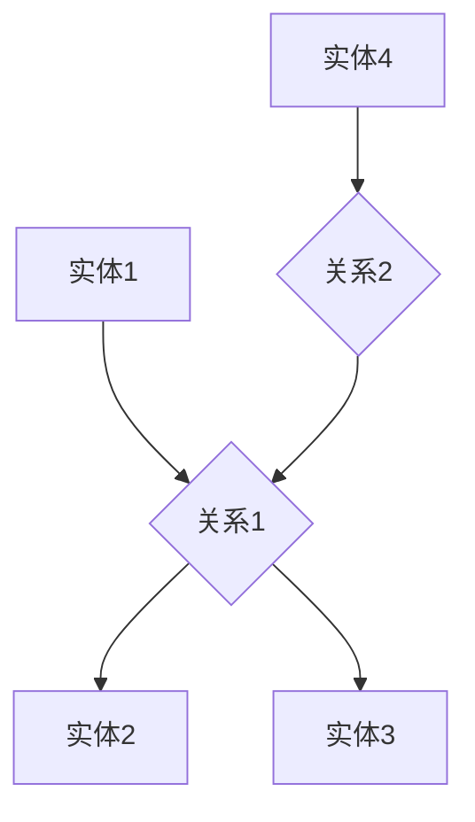
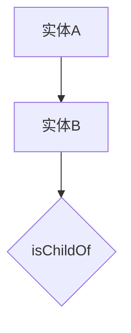

                 

知识可视化作为一种将复杂信息转换为易于理解的形式的技术，正日益成为各行业的重要工具。在这篇文章中，我们将深入探讨数据可视化和知识图谱这两个关键概念，以及它们如何结合以实现更高效的决策支持和信息理解。

## 关键词

- 数据可视化
- 知识图谱
- 信息可视化
- 决策支持
- 复杂信息简化

## 摘要

本文旨在探讨如何通过数据可视化和知识图谱技术来实现知识的可视化。我们将首先介绍数据可视化的基本概念和原理，然后深入讨论知识图谱及其架构，最后分析这两者如何协同工作以提升信息理解和决策效率。

## 1. 背景介绍

在信息技术迅速发展的今天，数据已成为企业和社会的重要资产。然而，面对海量的数据，如何快速、准确地提取有用信息，并将其转化为可操作的洞察，成为了一个巨大的挑战。数据可视化作为一门交叉学科，旨在通过图形和图表等可视化手段，将复杂的数据转换为易于理解的形式，从而帮助用户更好地分析和理解数据。

知识图谱作为大数据和人工智能领域的一项前沿技术，其核心思想是将实体及其之间的关系以图形化的方式呈现，从而形成一个结构化的知识网络。知识图谱不仅在知识管理和语义搜索方面有着广泛的应用，还能为数据可视化提供强有力的支持。

## 2. 核心概念与联系

### 2.1 数据可视化

数据可视化是将数据转换为图形或图像，以便更容易理解和分析的过程。它包括以下关键组件：

- **图表类型**：包括折线图、柱状图、饼图、散点图等。
- **交互性**：用户可以通过交互操作（如缩放、过滤等）来探索数据。
- **视觉编码**：通过颜色、形状、大小等视觉属性来传递数据信息。

### 2.2 知识图谱

知识图谱是一种用于表示实体及其之间关系的图形化结构。它通常由以下部分组成：

- **实体**：表示现实世界中的对象，如人、地点、物品等。
- **关系**：表示实体之间的关联，如“是”、“属于”等。
- **属性**：用于描述实体的特征，如“年龄”、“地点”等。

### 2.3 Mermaid 流程图

以下是知识图谱的基本架构的 Mermaid 流程图：



在这个图中，`A`、`C`、`D` 和 `E` 代表实体，`B` 和 `F` 代表关系。

## 3. 核心算法原理 & 具体操作步骤

### 3.1 算法原理概述

知识图谱的构建通常包括以下步骤：

1. **实体识别**：从数据源中提取实体。
2. **关系抽取**：确定实体之间的关系。
3. **属性抽取**：提取实体的属性信息。
4. **图谱构建**：将实体、关系和属性组织成一个图形结构。

### 3.2 算法步骤详解

1. **数据预处理**：清洗和整合原始数据。
2. **实体识别**：使用命名实体识别（NER）技术识别文本中的实体。
3. **关系抽取**：利用规则、统计方法和机器学习模型抽取实体之间的关系。
4. **属性抽取**：从文本或数据库中提取实体的属性信息。
5. **图谱构建**：将实体、关系和属性构建成一个知识图谱。

### 3.3 算法优缺点

**优点**：

- **结构化**：知识图谱能够将复杂的信息结构化，便于存储和查询。
- **语义丰富**：通过实体和关系，知识图谱能够表达丰富的语义信息。
- **高效查询**：基于图结构的查询算法通常能够高效地处理大规模数据。

**缺点**：

- **构建成本**：构建一个高质量的知识图谱需要大量的时间和计算资源。
- **动态性**：知识图谱需要不断更新以适应不断变化的数据。

### 3.4 算法应用领域

知识图谱在多个领域有着广泛的应用，包括：

- **搜索引擎**：用于提供更准确的语义搜索结果。
- **推荐系统**：用于推荐相关物品或内容。
- **知识管理**：用于存储和管理企业内部的知识资源。
- **智能问答**：用于提供智能化的问答服务。

## 4. 数学模型和公式 & 详细讲解 & 举例说明

### 4.1 数学模型构建

知识图谱的构建通常涉及到图论中的基本概念，如节点、边和路径。以下是一个简化的数学模型：

- **节点**：表示实体，通常用 \( V \) 表示。
- **边**：表示实体之间的关系，通常用 \( E \) 表示。
- **路径**：表示实体之间的连接路径，通常用 \( P \) 表示。

### 4.2 公式推导过程

知识图谱的构建可以通过以下公式来表示：

\[ KG = (V, E, P) \]

其中：

- \( V \) 表示实体集合。
- \( E \) 表示关系集合。
- \( P \) 表示路径集合。

### 4.3 案例分析与讲解

假设我们有一个简单的知识图谱，其中包含两个实体 `A` 和 `B`，它们之间的关系为 `isChildOf`。以下是该知识图谱的示意图：



在这个例子中，实体 `A` 和 `B` 之间的关系 `isChildOf` 可以通过以下公式表示：

\[ A \isChildOf B \]

## 5. 项目实践：代码实例和详细解释说明

### 5.1 开发环境搭建

为了演示如何构建知识图谱，我们将使用 Python 和 OpenKG 作为一个示例。以下是搭建开发环境的步骤：

1. 安装 Python 3.8 或更高版本。
2. 安装 OpenKG 的依赖项，使用以下命令：

   ```shell
   pip install openkg
   ```

### 5.2 源代码详细实现

以下是使用 OpenKG 构建一个简单的知识图谱的示例代码：

```python
from openkg.model import Entity, Relation, KnowledgeGraph
from openkg import store

# 创建实体
entity_a = Entity('实体A', label='Person')
entity_b = Entity('实体B', label='City')

# 创建关系
relation_isChildOf = Relation('isChildOf', label='Parent')

# 创建知识图谱
kg = KnowledgeGraph('示例知识图谱')

# 添加实体和关系
kg.add_entity(entity_a)
kg.add_entity(entity_b)
kg.add_relation(relation_isChildOf, {'subject': entity_a.id, 'object': entity_b.id})

# 保存知识图谱
store.save_kg(kg)
```

### 5.3 代码解读与分析

在这个例子中，我们首先导入了 OpenKG 的相关模块。然后，我们创建了两个实体 `entity_a` 和 `entity_b`，并定义了一个关系 `relation_isChildOf`。接着，我们创建了一个知识图谱 `kg` 并将实体和关系添加到知识图谱中。最后，我们将知识图谱保存到文件中。

### 5.4 运行结果展示

运行上述代码后，我们将在当前目录下生成一个名为 `kg.json` 的文件，其中包含了我们构建的知识图谱。

## 6. 实际应用场景

知识图谱在多个实际应用场景中发挥了重要作用，以下是一些例子：

- **社交媒体分析**：通过分析用户关系，可以了解用户的兴趣和行为模式。
- **推荐系统**：通过知识图谱，可以推荐相关内容或商品。
- **智能问答**：基于知识图谱，可以提供准确的问答服务。
- **知识管理**：知识图谱可以用于存储和管理企业内部的知识资源。

## 7. 工具和资源推荐

为了更好地理解和应用知识图谱，以下是一些建议的工具和资源：

- **工具**：
  - [OpenKG](https://github.com/OpenKG-Lab/OpenKG): 一个开源的知识图谱构建和管理工具。
  - [Neo4j](https://neo4j.com/): 一个基于图数据库的解决方案。

- **资源**：
  - [《知识图谱：概念、方法与应用》](https://book.douban.com/subject/26763531/): 一本关于知识图谱的权威教材。
  - [知识图谱社区](https://www.kgml.com/): 一个关于知识图谱的社区和论坛。

## 8. 总结：未来发展趋势与挑战

知识图谱和数据可视化技术的发展正推动着信息技术领域的前沿。未来，我们可以预见以下几个发展趋势：

- **智能化**：随着人工智能技术的发展，知识图谱和数据的智能化分析将成为可能。
- **实时性**：知识图谱的实时更新和实时查询将成为关键需求。
- **跨领域应用**：知识图谱将在更多领域得到应用，如医疗、金融等。

然而，知识图谱和数据可视化技术也面临着一些挑战：

- **数据质量**：高质量的数据是构建知识图谱的基础，如何处理和清洗数据是一个重要问题。
- **隐私保护**：在知识图谱的构建和应用过程中，如何保护个人隐私是一个重要挑战。
- **可解释性**：如何提高知识图谱的可解释性，使其更易于理解和应用。

总之，知识图谱和数据可视化技术将在未来继续发展，为各行业提供更强大的数据分析和决策支持。

## 9. 附录：常见问题与解答

### 9.1 如何构建一个简单的知识图谱？

构建一个简单的知识图谱通常包括以下步骤：

1. 明确知识图谱的目标和应用领域。
2. 确定实体、关系和属性。
3. 收集和整理数据。
4. 使用知识图谱构建工具（如 OpenKG）创建实体、关系和路径。
5. 保存和部署知识图谱。

### 9.2 知识图谱与数据仓库有什么区别？

知识图谱和数据仓库都是用于存储和管理数据的工具，但它们有以下几个关键区别：

- **结构**：知识图谱是基于图形结构的，而数据仓库通常是基于关系型数据库的。
- **语义**：知识图谱强调实体之间的关系和语义，而数据仓库则更侧重于数据存储和查询。
- **应用**：知识图谱常用于数据分析和决策支持，而数据仓库主要用于数据处理和存储。

### 9.3 数据可视化有哪些常见的图表类型？

常见的数据可视化图表类型包括：

- **折线图**：用于显示数据的变化趋势。
- **柱状图**：用于比较不同类别或时间段的数据。
- **饼图**：用于显示各部分占整体的比例。
- **散点图**：用于显示数据点之间的关系。
- **热力图**：用于显示数据的分布情况。

---

作者：禅与计算机程序设计艺术 / Zen and the Art of Computer Programming

通过这篇文章，我们深入探讨了数据可视化和知识图谱这两个关键概念，以及它们如何结合以实现知识的可视化。希望这篇文章能够为读者提供对这两个技术的深入理解，并在实践中有所帮助。未来的技术发展将继续推动数据可视化和知识图谱的应用，为各行业带来更多创新和变革。

