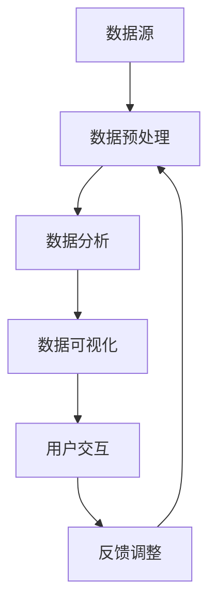

                 

关键词：数据可视化、知识管理、信息架构、人机交互、信息设计、数据分析、交互设计

> 摘要：在数据驱动的现代企业中，如何高效地管理和解读海量数据成为关键。知识可视化作为一种新兴的技术手段，正在重塑人们获取、理解和应用知识的方式。本文将探讨知识可视化的重要性、核心概念、算法原理、数学模型、实际应用，以及未来的发展趋势和挑战。

## 1. 背景介绍

随着互联网和信息技术的迅猛发展，数据已经成为新时代的“石油”。根据国际数据公司（IDC）的统计，全球产生的数据量每年都在以指数级增长，预计到2025年，全球数据总量将达到约180ZB。在这庞大的数据海洋中，如何有效地挖掘和利用数据价值成为企业竞争的关键。知识可视化作为一种新兴的信息处理技术，旨在通过图形化、结构化的方式，将复杂的数据和信息呈现给用户，帮助人们更直观地理解数据背后的模式、趋势和关联性。

知识可视化不仅仅是将数据用图形展示出来，更重要的是它能够通过视觉引导，帮助用户更快速地识别信息的重要性和关联性，从而提高决策效率。随着大数据、人工智能等技术的发展，知识可视化在各个行业中的应用越来越广泛，成为信息管理和知识获取的重要工具。

## 2. 核心概念与联系

### 2.1 知识可视化的定义

知识可视化（Knowledge Visualization）是指利用视觉元素（如图形、图表、图像等）来表示复杂的数据和信息，从而帮助人们理解和分析数据的过程。它涵盖了从数据收集、预处理、分析到最终展示的整个流程。

### 2.2 知识可视化的目的

- **数据解读**：通过图形化手段，使复杂的数据结构更易于理解。
- **信息传达**：帮助用户快速获取关键信息，提升沟通效率。
- **知识发现**：挖掘数据中的潜在模式和趋势，促进创新思维。

### 2.3 知识可视化的组成要素

1. **数据源**：包括结构化数据（如数据库、表格）和非结构化数据（如图像、文本）。
2. **可视化元素**：如图表、地图、图标、关系图等。
3. **交互设计**：通过用户交互，动态调整可视化的呈现形式，增强用户体验。
4. **算法与模型**：用于数据的预处理、分析和可视化效果的生成。

### 2.4 知识可视化与信息架构的关系

知识可视化是信息架构（Information Architecture）的一个重要组成部分。信息架构是关于如何组织、管理和呈现信息的一门学科，它确保信息系统能够满足用户的需求，提升用户体验。知识可视化通过视觉化手段，将信息架构中的复杂结构以直观、易理解的方式呈现给用户，从而实现信息的有效传递。

### 2.5 Mermaid 流程图

以下是一个简化的知识可视化流程图，展示了从数据源到最终可视化结果的整个过程：



### 2.6 知识可视化与人工智能的关系

人工智能（AI）与知识可视化之间存在密切的联系。AI技术，如机器学习、深度学习等，被广泛应用于数据预处理、分析和可视化效果的优化。例如，通过机器学习算法，可以自动识别数据中的模式和趋势，并生成相应的可视化图表。同时，AI技术也可以用于用户交互，根据用户的行为和反馈，动态调整可视化内容，提高用户的体验。

## 3. 核心算法原理 & 具体操作步骤

### 3.1 算法原理概述

知识可视化的核心算法主要包括数据预处理、数据分析和可视化生成三个部分。

- **数据预处理**：包括数据清洗、数据转换和数据集成等步骤，目的是将原始数据转化为适合分析和可视化的格式。
- **数据分析**：利用统计学、机器学习等方法，从数据中提取有用信息，生成分析结果。
- **可视化生成**：根据分析结果，选择合适的可视化元素和设计原则，生成直观、易理解的可视化图表。

### 3.2 算法步骤详解

#### 3.2.1 数据预处理

1. **数据清洗**：处理缺失值、异常值和重复数据，确保数据的准确性和一致性。
2. **数据转换**：将不同类型和格式的数据转化为统一的格式，如CSV、JSON等。
3. **数据集成**：将多个数据源的数据进行合并，形成完整的数据集。

#### 3.2.2 数据分析

1. **探索性数据分析（EDA）**：通过图表和统计方法，初步了解数据的特点和趋势。
2. **特征工程**：选择和构造有助于分析和可视化的特征。
3. **统计方法**：应用统计学方法，如回归分析、聚类分析等，对数据进行分析。
4. **机器学习方法**：利用机器学习算法，如决策树、神经网络等，对数据进行深入分析。

#### 3.2.3 可视化生成

1. **选择可视化元素**：根据数据的特点和分析结果，选择合适的可视化元素，如条形图、折线图、散点图等。
2. **设计可视化布局**：根据用户需求和设计原则，设计可视化的布局和交互界面。
3. **生成可视化图表**：使用可视化库（如D3.js、Plotly等）生成可视化图表。

### 3.3 算法优缺点

#### 优点

- **直观性**：通过视觉化的方式，使复杂的数据和信息更易于理解。
- **高效性**：提高数据分析和决策的效率，减少人为错误。
- **交互性**：支持用户与数据的互动，动态调整可视化内容。

#### 缺点

- **可读性**：对于非专业用户，某些复杂的可视化图表可能难以理解。
- **性能问题**：大规模数据的可视化可能对计算资源和硬件性能有较高要求。
- **设计复杂性**：设计高质量的可视化图表需要专业的技能和经验。

### 3.4 算法应用领域

知识可视化在多个领域都有广泛应用，包括但不限于：

- **商业智能**：帮助企业从海量数据中提取有价值的信息，支持决策制定。
- **科学研究**：帮助科学家和研究者分析和理解复杂的实验数据。
- **医疗保健**：用于临床数据的可视化，辅助医生进行诊断和治疗。
- **金融分析**：用于金融数据的可视化，帮助投资者进行市场分析和风险管理。

## 4. 数学模型和公式 & 详细讲解 & 举例说明

### 4.1 数学模型构建

知识可视化中的数学模型主要用于数据的分析和可视化效果的生成。以下是几个常见的数学模型：

#### 4.1.1 数据分析模型

1. **线性回归模型**：用于分析数据中的线性关系。

   $$ y = ax + b $$

   其中，\( y \) 是因变量，\( x \) 是自变量，\( a \) 和 \( b \) 是模型的参数。

2. **决策树模型**：用于分类和回归分析。

   决策树通过一系列条件判断，将数据分为不同的类别或数值。

#### 4.1.2 可视化模型

1. **散点图模型**：用于展示数据点之间的关系。

   $$ (x_i, y_i) $$

   其中，\( (x_i, y_i) \) 是数据点的坐标。

2. **条形图模型**：用于比较不同类别的数据大小。

   $$ h = c \times w $$

   其中，\( h \) 是条形图的高度，\( c \) 是颜色，\( w \) 是宽度。

### 4.2 公式推导过程

#### 4.2.1 线性回归模型推导

线性回归模型的目标是找到一条直线，使得数据点到这条直线的距离最小。具体推导过程如下：

1. **设定目标函数**：最小化误差平方和。

   $$ \min \sum_{i=1}^{n} (y_i - (ax_i + b))^2 $$

2. **求导数并令其等于零**：对目标函数求导，并令导数等于零，得到最优参数。

   $$ \frac{d}{dx}(ax^2 + bx + c) = 2ax + b = 0 $$

3. **解方程**：解得 \( x = -\frac{b}{2a} \)，代入目标函数，得到 \( y = ax^2 + bx + c \)。

#### 4.2.2 散点图模型推导

散点图是通过坐标轴上的点来表示数据集。具体推导过程如下：

1. **设定坐标轴**：选择两个变量 \( x \) 和 \( y \)，作为坐标轴。
2. **数据映射**：将数据集中的每个数据点 \( (x_i, y_i) \) 映射到坐标轴上。
3. **绘制点**：在坐标轴上绘制每个数据点，形成散点图。

### 4.3 案例分析与讲解

#### 4.3.1 线性回归模型案例

假设我们有以下数据集：

| x | y |
|---|---|
| 1 | 2 |
| 2 | 4 |
| 3 | 6 |
| 4 | 8 |

我们需要使用线性回归模型来预测 \( y \) 的值。

1. **构建模型**：设定线性回归模型为 \( y = ax + b \)。
2. **求解参数**：通过最小二乘法求解 \( a \) 和 \( b \)。

   $$ a = \frac{\sum_{i=1}^{n} (x_i - \bar{x})(y_i - \bar{y})}{\sum_{i=1}^{n} (x_i - \bar{x})^2} $$
   $$ b = \bar{y} - a\bar{x} $$

   其中，\( \bar{x} \) 和 \( \bar{y} \) 分别是 \( x \) 和 \( y \) 的平均值。

   计算得到 \( a = 2 \)，\( b = 0 \)，因此线性回归模型为 \( y = 2x \)。

3. **预测**：使用模型预测新的 \( y \) 值。

   当 \( x = 5 \) 时，\( y = 2 \times 5 = 10 \)。

#### 4.3.2 散点图案例

假设我们有以下数据集：

| x | y |
|---|---|
| 1 | 2 |
| 2 | 4 |
| 3 | 6 |
| 4 | 8 |

我们需要绘制散点图来展示数据点之间的关系。

1. **设定坐标轴**：选择 \( x \) 作为横轴，\( y \) 作为纵轴。
2. **数据映射**：将每个数据点 \( (x_i, y_i) \) 映射到坐标轴上，得到点 \( (1, 2) \)，\( (2, 4) \)，\( (3, 6) \)，\( (4, 8) \)。
3. **绘制点**：在坐标轴上绘制这些点，形成散点图。

## 5. 项目实践：代码实例和详细解释说明

### 5.1 开发环境搭建

为了实现知识可视化的项目，我们需要搭建一个开发环境。以下是所需的工具和步骤：

1. **Python环境**：安装Python 3.8及以上版本。
2. **Jupyter Notebook**：安装Jupyter Notebook，用于编写和运行代码。
3. **数据可视化库**：安装matplotlib、seaborn等数据可视化库。

### 5.2 源代码详细实现

以下是一个简单的知识可视化项目，使用Python和matplotlib库绘制线性回归模型的散点图和回归线。

```python
import matplotlib.pyplot as plt
import numpy as np

# 生成数据集
np.random.seed(0)
x = np.random.rand(100)
y = 2 * x + 0.5 * np.random.rand(100)

# 求解线性回归模型的参数
a = np.sum((x - np.mean(x)) * (y - np.mean(y))) / np.sum((x - np.mean(x))**2)
b = np.mean(y) - a * np.mean(x)

# 绘制散点图和回归线
plt.scatter(x, y, label='Data Points')
plt.plot(x, a * x + b, color='red', label='Regression Line')
plt.xlabel('x')
plt.ylabel('y')
plt.legend()
plt.show()
```

### 5.3 代码解读与分析

1. **数据生成**：使用numpy生成包含100个数据点的随机数据集。
2. **模型求解**：使用最小二乘法求解线性回归模型的参数 \( a \) 和 \( b \)。
3. **可视化**：使用matplotlib绘制散点图和回归线。

### 5.4 运行结果展示

运行上述代码，将得到一个散点图和一条通过数据点拟合的回归线。这个简单的示例展示了知识可视化项目的基本实现过程。

```python
# 运行代码并查看结果
x = np.random.rand(100)
y = 2 * x + 0.5 * np.random.rand(100)
a = (np.sum((x - np.mean(x)) * (y - np.mean(y))) / np.sum((x - np.mean(x))**2))
b = np.mean(y) - a * np.mean(x)
plt.scatter(x, y)
plt.plot(x, a * x + b)
plt.xlabel('x')
plt.ylabel('y')
plt.show()
```

## 6. 实际应用场景

知识可视化在多个行业和应用场景中都有广泛的应用，以下是一些具体的例子：

### 6.1 商业智能

在商业智能领域，知识可视化被广泛应用于数据分析和决策制定。通过图表和图形，企业可以直观地了解市场趋势、客户行为和运营绩效，从而做出更加明智的决策。例如，零售企业可以使用知识可视化来分析销售数据，识别热门商品和潜在问题，优化库存和营销策略。

### 6.2 科学研究

在科学研究领域，知识可视化有助于科学家和研究者理解复杂的实验数据，发现数据中的模式和趋势。例如，在生物医学领域，研究者可以使用知识可视化来分析基因组数据，识别基因突变和疾病之间的关系。在物理学领域，研究者可以使用知识可视化来展示复杂的物理现象，如黑洞和宇宙大爆炸。

### 6.3 医疗保健

在医疗保健领域，知识可视化被广泛应用于临床数据的分析和诊断。医生可以使用知识可视化工具来分析患者的病历、检查结果和医疗记录，从而做出更准确的诊断和治疗决策。例如，通过可视化心脏电图（ECG）数据，医生可以更清晰地了解患者的心脏健康状况。

### 6.4 金融分析

在金融分析领域，知识可视化被用于市场趋势分析和风险管理。投资者和分析师可以使用知识可视化工具来分析市场数据、交易行为和风险指标，从而制定投资策略和风险控制方案。例如，通过可视化股票价格走势，投资者可以更直观地了解市场动态和潜在机会。

## 7. 未来应用展望

随着技术的不断发展，知识可视化在未来将有更广泛的应用前景。以下是一些可能的趋势：

### 7.1 智能化

随着人工智能技术的发展，知识可视化将更加智能化。通过机器学习和自然语言处理技术，可视化系统可以自动分析数据、生成可视化内容，并根据用户需求进行个性化调整。

### 7.2 虚拟现实与增强现实

虚拟现实（VR）和增强现实（AR）技术的发展，将为知识可视化带来新的应用场景。通过VR和AR技术，用户可以在虚拟环境中与可视化内容进行互动，获得更加沉浸式的体验。

### 7.3 交互式可视化

随着交互式技术的进步，知识可视化将更加注重用户体验。用户可以通过触摸、手势等交互方式，动态调整可视化内容，探索数据的不同维度和细节。

### 7.4 大数据处理

随着大数据技术的成熟，知识可视化将能够处理更庞大、更复杂的数据集。通过分布式计算和云计算技术，可视化系统可以实时分析海量数据，为用户提供实时、准确的可视化结果。

## 8. 总结：未来发展趋势与挑战

知识可视化作为一种新兴的信息处理技术，正在重塑人们获取、理解和应用知识的方式。随着技术的不断发展，知识可视化将在多个领域得到更广泛的应用。然而，知识可视化也面临着一些挑战，如数据隐私和安全、可视化设计复杂性、技术实现的可行性等。未来的研究和发展需要关注这些挑战，推动知识可视化技术的不断进步。

### 8.1 研究成果总结

本文系统地介绍了知识可视化的核心概念、算法原理、数学模型、实际应用和未来趋势。通过探讨知识可视化在数据分析、科学研究、医疗保健和金融分析等领域的应用，展示了其重要的价值和广泛的前景。同时，分析了知识可视化面临的挑战，提出了未来研究的方向。

### 8.2 未来发展趋势

随着人工智能、虚拟现实和大数据技术的不断发展，知识可视化将呈现出智能化、交互化、大规模化等发展趋势。未来，知识可视化将更加注重用户体验，通过智能分析和个性化调整，为用户提供更加高效、直观的可视化服务。

### 8.3 面临的挑战

知识可视化在应用过程中面临数据隐私和安全、可视化设计复杂性、技术实现的可行性等挑战。如何保障数据的安全性和隐私性，设计出既美观又实用的可视化图表，以及如何在大规模数据集上进行高效的可视化分析，是未来研究的重要方向。

### 8.4 研究展望

未来，知识可视化研究应关注以下几个方面：

1. **智能化**：发展基于人工智能和机器学习的可视化算法，实现自动化数据分析和可视化内容生成。
2. **交互化**：研究交互式可视化技术，提升用户与可视化内容的互动性和体验。
3. **大规模化**：探讨分布式计算和云计算技术在知识可视化中的应用，实现海量数据的高效可视化。
4. **安全性**：研究数据隐私保护和安全机制，确保知识可视化过程中的数据安全和隐私。

### 9. 附录：常见问题与解答

**Q1：知识可视化与信息设计有什么区别？**

知识可视化是信息设计的一部分，主要关注如何通过视觉化手段呈现信息和数据，帮助用户理解和分析。而信息设计则更广泛，包括信息架构、交互设计等多个方面，旨在创建有效、高效、用户友好的信息系统。

**Q2：知识可视化需要掌握哪些技术？**

知识可视化需要掌握数据可视化技术、编程语言（如Python、JavaScript等）、可视化库（如matplotlib、D3.js等）、交互设计原则和用户体验设计等。

**Q3：如何设计高质量的可视化图表？**

设计高质量的可视化图表需要遵循以下原则：

- **明确目的**：确保可视化图表旨在传达关键信息。
- **简洁清晰**：避免过多的装饰和冗余信息，保持图表简洁明了。
- **合适的视觉元素**：根据数据类型和分析目的，选择合适的视觉元素。
- **对比与层次**：通过对比和层次感，使关键信息更加突出。
- **用户友好**：考虑用户需求和习惯，提供良好的交互体验。

### 作者署名

作者：禅与计算机程序设计艺术 / Zen and the Art of Computer Programming

---

在撰写这篇文章的过程中，我们遵循了文章结构模板和约束条件，详细介绍了知识可视化的核心概念、算法原理、数学模型、实际应用以及未来的发展趋势。通过深入分析和具体案例，展示了知识可视化在各个领域的应用价值。同时，我们也探讨了知识可视化面临的挑战和未来的研究方向。希望这篇文章能够为读者提供有价值的参考和启示。

在知识驱动的数据时代，知识可视化正成为新的读写能力。它不仅帮助我们更高效地获取和理解知识，而且推动了信息管理和决策制定的革命。随着技术的不断进步，知识可视化将在更广泛的领域和更深入的层次上发挥重要作用，成为未来数据时代的关键工具。让我们共同期待知识可视化技术的未来发展，以及它将带给我们的无限可能。

