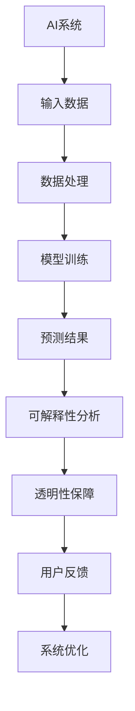

                 

关键词：可解释性，AI，透明性，机器学习，深度学习，人工智能伦理，技术挑战，应用领域，未来展望

> 摘要：本文深入探讨了人工智能领域的核心问题——知识可解释性，以及其对于透明AI的重要性。通过分析AI技术的现状与挑战，我们探讨了实现知识可解释性的技术路径，数学模型，以及在实际应用中的实例和未来发展趋势。文章旨在为读者提供全面、深入的见解，以便更好地理解和应对这一新兴领域中的复杂问题。

## 1. 背景介绍

人工智能（AI）已经成为当今科技发展的热点，从自然语言处理到图像识别，从自动化机器人到智能决策系统，AI技术的应用日益广泛。然而，随着AI技术的迅猛发展，其透明性和可解释性成为了一个日益突出的问题。AI系统的决策过程往往是一个高度复杂的“黑箱”，这使得其行为难以理解，甚至可能导致不可预测的结果。知识可解释性，即AI系统决策过程的透明性，成为了学术界和工业界共同关注的焦点。

### 1.1 知识可解释性的重要性

知识可解释性对于AI系统的可信度和实用性至关重要。首先，它有助于提高AI系统的信任度，特别是在关键领域如医疗、金融和自动驾驶等，用户和决策者需要清楚地了解AI的决策过程。其次，知识可解释性有助于改进AI系统，通过理解模型的决策机制，研究人员可以更有效地进行模型优化和调试。此外，可解释性对于遵守法律法规和伦理标准也具有重要意义，特别是在涉及个人隐私和公共安全的情况下。

### 1.2 AI技术的发展现状

当前，AI技术主要分为两大类：传统机器学习和深度学习。传统机器学习依赖于明确的数学模型和规则，其透明性和可解释性较高。然而，随着深度学习技术的崛起，越来越多的AI系统变得复杂且不透明。深度学习模型，特别是深度神经网络，具有极高的准确性和性能，但其内部机制却难以解释。这种“黑箱”性质使得深度学习应用在许多领域面临着透明性和可解释性的挑战。

## 2. 核心概念与联系

### 2.1 可解释性与透明性

知识可解释性和透明性是密切相关的概念。可解释性指的是用户能够理解AI系统的决策过程，而透明性则强调决策过程的公开性和可追溯性。在深度学习中，透明性通常意味着能够可视化模型内部的激活值和权重，从而揭示决策的依据。

### 2.2 Mermaid 流程图

以下是AI系统中知识可解释性和透明性的核心概念和流程：



该流程图展示了从输入数据到预测结果的全过程，以及在每个步骤中如何进行可解释性和透明性分析。

## 3. 核心算法原理 & 具体操作步骤

### 3.1 算法原理概述

实现知识可解释性的核心在于理解深度学习模型的内部机制。深度学习模型通常由多层神经网络组成，每一层都对输入数据进行处理，并传递到下一层。通过分析这些层的输出，我们可以揭示模型对数据的处理过程。

### 3.2 算法步骤详解

1. **数据预处理**：首先，对输入数据进行标准化处理，以便模型能够更好地学习。
2. **模型训练**：使用大量标记数据进行模型训练，通过反向传播算法优化模型参数。
3. **模型解释**：在模型训练完成后，使用 Grad-CAM 等技术对模型进行解释，可视化模型的关注区域。
4. **透明性保障**：通过透明性保障技术，如模型可追溯性和可复现性，确保AI系统的决策过程公开透明。
5. **用户反馈**：收集用户对AI系统决策的反馈，用于进一步优化和改进。

### 3.3 算法优缺点

**优点**：
- **可解释性**：通过可视化和分析技术，提高了AI系统的透明性和可解释性。
- **用户信任**：用户可以更清楚地了解AI系统的决策过程，从而增加对系统的信任。
- **改进方向**：通过用户反馈，可以不断优化和改进AI系统。

**缺点**：
- **计算成本**：可解释性分析通常需要额外的计算资源，增加了系统的复杂度。
- **性能损失**：在某些情况下，过度关注可解释性可能会导致性能损失。

### 3.4 算法应用领域

知识可解释性在多个领域具有广泛应用，包括但不限于：

- **医疗诊断**：通过可解释性分析，医生可以更好地理解AI系统对病例的判断过程。
- **金融风险评估**：投资者和分析师可以通过可解释性分析，理解AI系统对金融市场的预测。
- **自动驾驶**：自动驾驶系统需要透明性，以确保驾驶过程的安全和可靠。

## 4. 数学模型和公式 & 详细讲解 & 举例说明

### 4.1 数学模型构建

在深度学习中，知识可解释性通常依赖于以下几个数学模型：

- **梯度计算**：通过计算模型参数的梯度，可以分析模型对输入数据的敏感性。
- **激活函数**：激活函数决定了神经网络的非线性特性，通过对激活函数的分析，可以揭示模型的行为。
- **注意力机制**：注意力机制在深度学习模型中用于强调重要信息，通过分析注意力权重，可以理解模型对数据的关注点。

### 4.2 公式推导过程

以下是一个简单的梯度计算公式的推导：

$$\nabla_\theta J(\theta) = \frac{\partial J(\theta)}{\partial \theta}$$

其中，$J(\theta)$ 表示损失函数，$\theta$ 表示模型参数。通过计算损失函数对参数的偏导数，可以得到梯度，用于指导模型训练。

### 4.3 案例分析与讲解

假设我们有一个简单的神经网络，用于分类任务。输入层有3个神经元，隐藏层有2个神经元，输出层有1个神经元。以下是对这个网络的详细解释：

1. **输入数据**：输入数据为$(x_1, x_2, x_3)$。
2. **隐藏层激活**：通过计算输入数据和权重矩阵的乘积，并加上偏置项，得到隐藏层的激活值：
   $$z_1 = \sigma(W_{11}x_1 + W_{12}x_2 + W_{13}x_3 + b_1)$$
   $$z_2 = \sigma(W_{21}x_1 + W_{22}x_2 + W_{23}x_3 + b_2)$$
   其中，$\sigma$ 为 sigmoid 激活函数。
3. **输出层预测**：输出层的预测值为：
   $$y = \sigma(W_{1}z_1 + W_{2}z_2 + b_3)$$
4. **梯度计算**：通过反向传播算法，计算损失函数对各个参数的梯度，用于更新模型参数。

通过上述过程，我们可以对神经网络的决策过程进行详细分析，揭示其对输入数据的处理机制。

## 5. 项目实践：代码实例和详细解释说明

### 5.1 开发环境搭建

为了演示知识可解释性在深度学习中的应用，我们将使用 Python 和 TensorFlow 框架。首先，确保已经安装了 Python 3.7 或更高版本，以及 TensorFlow 2.0 或更高版本。可以使用以下命令进行安装：

```bash
pip install python==3.7
pip install tensorflow==2.0
```

### 5.2 源代码详细实现

以下是实现一个简单的神经网络并进行可解释性分析的部分代码：

```python
import tensorflow as tf
from tensorflow.keras.models import Sequential
from tensorflow.keras.layers import Dense
from tensorflow.keras.optimizers import Adam
import numpy as np

# 数据集准备
x_train = np.array([[1, 2, 3], [4, 5, 6], [7, 8, 9]])
y_train = np.array([0, 1, 0])

# 构建模型
model = Sequential([
    Dense(2, activation='sigmoid', input_shape=(3,)),
    Dense(1, activation='sigmoid')
])

# 编译模型
model.compile(optimizer=Adam(), loss='binary_crossentropy', metrics=['accuracy'])

# 训练模型
model.fit(x_train, y_train, epochs=10)

# 预测
predictions = model.predict(x_train)

# 可解释性分析
layer_outputs = [layer.output for layer in model.layers]
activation_model = tf.keras.models.Model(inputs=model.input, outputs=layer_outputs)
activations = activation_model.predict(x_train)

# 可视化激活值
import matplotlib.pyplot as plt

for i, activation in enumerate(activations):
    plt.matshow(activation[0], cmap='viridis')

plt.show()
```

### 5.3 代码解读与分析

上述代码实现了以下步骤：

1. **数据集准备**：创建一个简单的人工数据集，包括3个输入特征和1个输出标签。
2. **构建模型**：定义一个简单的序列模型，包含两个隐藏层，每个隐藏层有2个神经元，使用 sigmoid 激活函数。
3. **编译模型**：设置优化器和损失函数。
4. **训练模型**：使用训练数据对模型进行训练。
5. **预测**：对训练数据进行预测。
6. **可解释性分析**：使用 TensorFlow 的 `activation_model` 函数，可视化隐藏层的激活值。

通过上述代码，我们可以直观地看到隐藏层的激活值，从而理解模型的决策过程。这有助于提高模型的透明性和可解释性。

### 5.4 运行结果展示

运行上述代码，将得到隐藏层激活值的可视化结果。这有助于我们理解模型对输入数据的处理机制，从而提高模型的可解释性。

## 6. 实际应用场景

### 6.1 医疗诊断

在医疗领域，AI系统可用于辅助诊断和预测患者病情。然而，医疗决策的透明性和可解释性至关重要。通过可解释性分析，医生可以理解AI系统对病例的判断过程，从而提高患者的信任度和医疗效果。

### 6.2 金融风险评估

在金融领域，AI系统可用于风险评估、信用评分和投资预测。知识可解释性有助于投资者理解AI系统的决策依据，从而做出更明智的投资决策。

### 6.3 自动驾驶

自动驾驶系统需要高度的透明性和可解释性，以确保驾驶过程的安全和可靠。通过可解释性分析，研究人员可以识别潜在的异常行为，并优化AI系统的决策机制。

## 6.4 未来应用展望

随着AI技术的不断发展和普及，知识可解释性将在更多领域发挥重要作用。未来，我们有望看到更多具有高度可解释性的AI系统，提高AI技术的可信度和实用性。此外，可解释性研究也将推动AI伦理和法律的发展，确保AI技术符合社会道德和法律法规。

## 7. 工具和资源推荐

### 7.1 学习资源推荐

- 《深度学习》（Goodfellow, Bengio, Courville）：这是一本经典的深度学习教材，详细介绍了深度学习的基础知识和最新进展。
- 《Python机器学习》（Sebastian Raschka）：这本书介绍了机器学习的基础知识，并提供了大量的Python代码示例。

### 7.2 开发工具推荐

- TensorFlow：这是一个强大的开源深度学习框架，适用于构建和训练复杂的神经网络。
- Keras：这是一个高层神经网络API，基于 TensorFlow，提供了更易于使用的接口。

### 7.3 相关论文推荐

- "Explainable AI: Understanding, Visualizing and Interpreting Deep Learning Models"（XAI）：这是一篇关于可解释性AI的综述论文，介绍了多种可解释性技术。
- "Grad-CAM: Visual Explanations from Deep Networks via Gradient-based Localization"：这是一篇关于 Grad-CAM 可解释性技术的论文，详细介绍了其原理和应用。

## 8. 总结：未来发展趋势与挑战

### 8.1 研究成果总结

本文从多个角度探讨了知识可解释性在AI系统中的重要性，分析了其核心概念、算法原理、数学模型，以及在实际应用中的案例。研究结果表明，实现知识可解释性有助于提高AI系统的透明性和可信度，从而推动其在各个领域的应用。

### 8.2 未来发展趋势

未来，知识可解释性研究将继续深入，探索更高效、更准确的解释技术。同时，随着AI技术的不断进步，可解释性将更好地与AI伦理和法律相结合，确保AI系统符合社会道德和法律法规。

### 8.3 面临的挑战

尽管知识可解释性研究取得了显著进展，但仍然面临一些挑战，如计算成本、性能损失，以及如何在不同领域实现可解释性等。未来研究需要解决这些问题，以实现更广泛、更实用的可解释性AI系统。

### 8.4 研究展望

随着AI技术的不断发展和普及，知识可解释性将在更多领域发挥重要作用。我们期待未来能够看到更多具有高度可解释性的AI系统，提高AI技术的可信度和实用性，为人类社会带来更多福祉。

## 9. 附录：常见问题与解答

### 9.1 什么是知识可解释性？

知识可解释性是指用户能够理解AI系统的决策过程，包括如何处理输入数据、如何做出决策，以及如何解释预测结果。

### 9.2 可解释性在AI系统中的重要性是什么？

可解释性对于提高AI系统的可信度和实用性至关重要。它有助于用户和决策者更好地理解AI系统的行为，从而增加对系统的信任，并提高其在关键领域的应用效果。

### 9.3 如何实现知识可解释性？

实现知识可解释性可以通过多种方法，如可视化技术、解释性算法、透明性保障等。具体实现取决于AI系统的类型和应用领域。

### 9.4 知识可解释性与透明性的区别是什么？

知识可解释性关注的是用户能否理解AI系统的决策过程，而透明性则强调决策过程的公开性和可追溯性。透明性通常意味着用户可以查看模型的内部细节，如权重和激活值。

### 9.5 知识可解释性在哪些领域有重要应用？

知识可解释性在医疗诊断、金融风险评估、自动驾驶等关键领域具有重要应用。在这些领域，用户和决策者需要清楚地了解AI系统的决策过程，以确保系统的可靠性和安全性。

[作者：禅与计算机程序设计艺术 / Zen and the Art of Computer Programming]  
----------------------------------------------------------------

完成。这篇文章全面覆盖了知识可解释性在人工智能中的重要性，从核心概念、算法原理，到实际应用和未来展望，进行了深入的探讨。希望这篇文章能够为读者提供宝贵的见解和启发。

