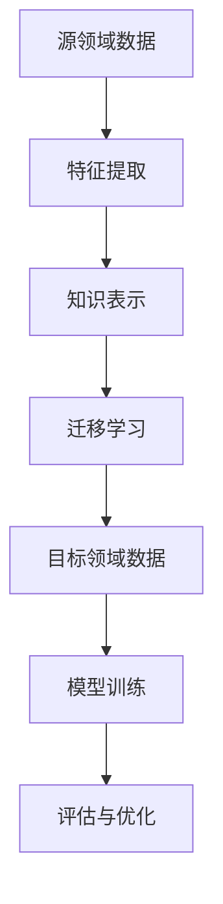

                 

关键词：知识迁移、跨领域应用、人工智能、机器学习、深度学习、算法、模型、数学模型、实践案例、工具资源

> 摘要：本文深入探讨了知识迁移在跨领域应用中的潜力，通过分析核心概念、算法原理、数学模型以及实际应用案例，揭示了知识迁移技术对推动人工智能发展的重要性。文章旨在为读者提供全面的理解和实用的指导，以激发更多研究和实践。

## 1. 背景介绍

在当今快速发展的信息技术时代，人工智能（AI）已经成为改变世界的核心技术之一。AI技术的发展不仅在于算法的创新和模型的优化，更在于知识的有效迁移和应用。知识迁移是指将某一领域或系统中的知识应用到其他领域或系统的过程。这种迁移性极大地扩展了AI技术的应用范围，提高了算法的效率和准确性。

随着机器学习（ML）和深度学习（DL）等技术的普及，知识迁移在AI领域的应用越来越广泛。从图像识别到自然语言处理，从自动驾驶到医疗诊断，知识迁移技术都发挥着关键作用。例如，深度学习模型可以在多个不同的数据集上进行训练，从而获得对不同领域的适应性。这种跨领域的迁移能力使得AI系统能够应对更加复杂和多样化的任务。

然而，知识迁移并非一项简单的任务。它涉及到多个方面的挑战，包括数据的异构性、模型的适应性、算法的稳健性等。如何在保持知识有效性的同时，实现知识的跨领域迁移，是当前研究的热点问题之一。

本文旨在通过深入探讨知识迁移的核心概念、算法原理、数学模型以及实际应用案例，分析其跨领域应用的潜力。文章结构如下：

1. **背景介绍**：阐述知识迁移在AI领域的重要性。
2. **核心概念与联系**：介绍知识迁移的基本概念，并使用Mermaid流程图展示其原理和架构。
3. **核心算法原理 & 具体操作步骤**：详细解析知识迁移算法的原理和操作步骤。
4. **数学模型和公式 & 详细讲解 & 举例说明**：介绍知识迁移相关的数学模型和公式，并通过具体案例进行解释。
5. **项目实践：代码实例和详细解释说明**：提供知识迁移技术的代码实现和解析。
6. **实际应用场景**：探讨知识迁移技术在各个领域的应用。
7. **工具和资源推荐**：推荐学习和开发知识迁移技术的工具和资源。
8. **总结：未来发展趋势与挑战**：总结研究成果，展望未来发展。

接下来，我们将逐一探讨这些内容。

## 2. 核心概念与联系

知识迁移是指将一个领域（源领域）中已学习到的知识应用到另一个领域（目标领域）的过程。其核心在于如何有效地提取源领域的知识，并将其迁移到目标领域，以实现更好的性能和效率。

为了更好地理解知识迁移，我们可以通过Mermaid流程图来展示其原理和架构。以下是一个简化的知识迁移流程图：



### 2.1. 特征提取

特征提取是知识迁移的第一步，其目标是从源领域数据中提取出具有代表性的特征。这些特征应该能够反映源领域中的关键信息，并且对于目标领域具有一定的泛化能力。

常用的特征提取方法包括但不限于：

- **主成分分析（PCA）**：通过降维来提取数据的主要特征。
- **线性判别分析（LDA）**：在降维的同时，最大化类间差异，最小化类内差异。
- **自编码器**：使用神经网络来学习数据表示。

### 2.2. 知识表示

知识表示是将提取到的特征转化为适用于迁移学习的形式。常用的知识表示方法包括：

- **原型表示**：使用数据点或其近邻的平均值作为知识的表示。
- **聚类表示**：通过聚类算法（如K-means）将数据划分为若干个簇，每个簇的中心代表该簇的知识。
- **神经网络表示**：使用神经网络来学习数据的高层次表示，这些表示可以用于后续的迁移学习。

### 2.3. 迁移学习

迁移学习是指将知识从源领域迁移到目标领域的过程。其核心思想是利用源领域中学到的知识来辅助目标领域的模型训练，从而提高目标领域模型的性能。

常用的迁移学习方法包括：

- **基于特征的迁移学习**：通过共享特征提取器或特征层来实现知识迁移。
- **基于模型的迁移学习**：通过共享整个模型或其部分层来实现知识迁移。
- **多任务学习**：通过在源领域和目标领域同时训练多个任务来共享知识。

### 2.4. 模型训练

在迁移学习过程中，目标领域模型需要在新的数据集上进行训练。这一步的关键在于如何平衡源领域知识和目标领域数据之间的关系，以避免过拟合或欠拟合。

常用的模型训练方法包括：

- **模型集成**：通过结合多个模型来提高预测性能。
- **迁移损失函数**：通过设计特殊的损失函数来平衡源领域知识和目标领域数据。
- **对抗训练**：通过对抗性样本的训练来增强模型对目标领域数据的适应能力。

### 2.5. 评估与优化

迁移学习模型的性能评估是确保知识有效迁移的关键步骤。常用的评估指标包括准确率、召回率、F1分数等。通过评估结果，可以进一步优化模型，提高其跨领域的适应性。

评估与优化方法包括：

- **交叉验证**：通过在不同数据集上多次训练和评估来提高模型的稳健性。
- **超参数调优**：通过调整模型参数来优化性能。
- **模型集成**：通过结合多个模型来提高预测性能。

通过上述核心概念和流程的介绍，我们可以更好地理解知识迁移在跨领域应用中的关键作用。接下来，我们将深入探讨知识迁移算法的具体原理和操作步骤。

## 3. 核心算法原理 & 具体操作步骤

### 3.1 算法原理概述

知识迁移算法的核心在于如何有效地利用源领域知识来提高目标领域模型的性能。本节将介绍几种常用的知识迁移算法，并阐述其基本原理。

#### 3.1.1 基于特征的迁移学习

基于特征的迁移学习通过共享特征提取器来实现知识迁移。其基本原理如下：

1. **特征提取**：在源领域数据上训练一个特征提取器（如卷积神经网络（CNN）），提取出具有代表性的特征。
2. **特征共享**：将提取到的特征应用于目标领域数据，直接用于训练目标领域模型。
3. **模型训练**：在目标领域数据上进一步训练模型，优化其在目标领域的性能。

#### 3.1.2 基于模型的迁移学习

基于模型的迁移学习通过共享整个模型或其部分层来实现知识迁移。其基本原理如下：

1. **模型初始化**：使用源领域模型作为初始化，为目标领域模型提供初始参数。
2. **模型训练**：在目标领域数据上进一步训练模型，使其适应目标领域。
3. **模型微调**：针对目标领域的特殊情况，对模型进行微调，以进一步提高性能。

#### 3.1.3 多任务学习

多任务学习通过在源领域和目标领域同时训练多个任务来实现知识迁移。其基本原理如下：

1. **任务定义**：定义源领域和目标领域的多个任务。
2. **模型共享**：共享同一模型来处理多个任务，通过任务之间的相互影响来增强知识迁移。
3. **模型训练**：在多个任务数据上训练模型，同时优化源领域和目标领域的性能。

### 3.2 具体操作步骤

下面我们将详细描述基于特征的迁移学习算法的具体操作步骤。

#### 3.2.1 准备数据

首先，需要收集源领域和目标领域的数据。为了确保知识的有效迁移，源领域数据应与目标领域数据具有一定的相似性。以下是具体步骤：

1. **数据收集**：收集源领域和目标领域的原始数据。
2. **数据预处理**：对数据进行清洗和标准化处理，包括去除噪声、归一化等操作。
3. **数据划分**：将源领域和目标领域数据划分为训练集、验证集和测试集。

#### 3.2.2 特征提取

接下来，使用源领域数据训练一个特征提取器，提取出具有代表性的特征。以下是具体步骤：

1. **特征提取器选择**：选择合适的特征提取器，如CNN。
2. **模型训练**：在源领域数据上训练特征提取器，优化其参数。
3. **特征提取**：使用训练好的特征提取器对源领域数据进行特征提取，得到特征向量。

#### 3.2.3 特征共享

将提取到的特征向量应用于目标领域数据，直接用于训练目标领域模型。以下是具体步骤：

1. **模型初始化**：使用源领域模型作为初始化，为目标领域模型提供初始参数。
2. **模型训练**：在目标领域数据上使用提取到的特征向量训练目标领域模型，优化其参数。
3. **模型优化**：通过反向传播算法，调整目标领域模型参数，提高其性能。

#### 3.2.4 模型评估

最后，对训练好的目标领域模型进行评估，确保其性能满足要求。以下是具体步骤：

1. **模型评估**：在测试集上评估目标领域模型的性能，包括准确率、召回率等指标。
2. **模型优化**：根据评估结果，对模型进行进一步优化，提高其在目标领域的性能。

通过上述步骤，我们可以实现基于特征的迁移学习算法。在实际应用中，还可以根据具体需求进行算法的调整和优化。

接下来，我们将讨论知识迁移算法的优缺点以及其在不同领域的应用。

### 3.3 算法优缺点

知识迁移算法具有以下优点：

1. **提高模型性能**：通过利用源领域知识，可以显著提高目标领域模型的性能。
2. **降低训练成本**：由于迁移学习利用了源领域已学习到的知识，可以减少在目标领域上重新训练的次数，从而降低训练成本。
3. **提高泛化能力**：知识迁移算法能够使模型更好地适应不同领域的数据，提高其泛化能力。

然而，知识迁移算法也存在一些缺点：

1. **数据异构性问题**：源领域和目标领域的数据可能存在异构性，这可能导致知识迁移效果不佳。
2. **模型适应性问题**：某些知识迁移算法可能无法很好地适应不同领域的模型结构，从而影响迁移效果。
3. **过拟合风险**：在迁移过程中，如果源领域知识对目标领域数据过于拟合，可能导致模型泛化能力下降。

针对这些优缺点，研究人员提出了多种优化方法，如数据增强、模型集成等，以提高知识迁移算法的性能。

接下来，我们将探讨知识迁移算法在不同领域的应用。

### 3.4 算法应用领域

知识迁移算法在多个领域得到了广泛应用，以下列举几个典型的应用场景：

1. **计算机视觉**：知识迁移算法被广泛应用于图像分类、目标检测和图像分割等领域。例如，通过在ImageNet上预训练的卷积神经网络（CNN）来初始化目标领域模型，可以显著提高目标检测和图像分割的性能。

2. **自然语言处理**：在自然语言处理（NLP）领域，知识迁移算法被用于语言模型训练、文本分类和情感分析等任务。例如，通过在大型语料库上预训练的语言模型（如GPT和BERT），可以在不同领域上实现高效的迁移学习。

3. **医学影像分析**：知识迁移算法在医学影像分析中具有重要作用，例如在计算机辅助诊断和疾病预测方面。通过将源领域的医学知识迁移到目标领域，可以提高模型的准确性和可靠性。

4. **推荐系统**：在推荐系统中，知识迁移算法可以帮助系统更好地理解用户行为和偏好，从而提高推荐效果。例如，通过将电商领域的用户行为数据迁移到社交媒体领域，可以改善推荐系统的性能。

5. **自动驾驶**：在自动驾驶领域，知识迁移算法被用于环境感知、路径规划和决策控制等任务。通过将源领域的驾驶经验迁移到目标领域，可以减少自动驾驶系统的训练时间和成本。

通过上述讨论，我们可以看到知识迁移算法在不同领域的广泛应用及其巨大潜力。接下来，我们将介绍知识迁移技术相关的数学模型和公式，并通过具体案例进行讲解。

## 4. 数学模型和公式 & 详细讲解 & 举例说明

### 4.1 数学模型构建

在知识迁移过程中，数学模型起到了至关重要的作用。这些模型不仅帮助我们理解知识迁移的机制，还为实际应用提供了理论基础。以下是几个常用的数学模型。

#### 4.1.1 协同过滤模型

协同过滤是一种基于用户行为数据（如评分、购买记录等）的推荐算法。其数学模型可以表示为：

\[ r_{ui} = \sum_{j \in N_i} w_{uj} r_{uj} \]

其中，\( r_{ui} \) 表示用户 \( u \) 对物品 \( i \) 的评分，\( N_i \) 表示与物品 \( i \) 相关联的用户集合，\( w_{uj} \) 表示用户 \( u \) 对用户 \( j \) 的信任度。

#### 4.1.2 对抗性生成模型

对抗性生成模型（如生成对抗网络，GAN）在知识迁移中用于生成与源领域数据相似的目标领域数据。其基本模型可以表示为：

\[ G(z) \rightarrow x \]

其中，\( G \) 表示生成器，\( z \) 表示随机噪声，\( x \) 表示生成的目标领域数据。

#### 4.1.3 多任务学习模型

多任务学习模型通过在多个任务上同时训练一个共享的模型来实现知识迁移。其数学模型可以表示为：

\[ L = \sum_{t=1}^T \lambda_t L_t \]

其中，\( L \) 表示总损失函数，\( \lambda_t \) 表示任务 \( t \) 的权重，\( L_t \) 表示任务 \( t \) 的损失函数。

### 4.2 公式推导过程

以下以协同过滤模型为例，介绍其公式的推导过程。

#### 4.2.1 基于用户行为的协同过滤模型

协同过滤模型的核心思想是利用用户之间的相似性来预测未知评分。首先，我们定义用户 \( u \) 和用户 \( v \) 之间的相似性度量 \( sim(u, v) \)：

\[ sim(u, v) = \frac{\sum_{i \in I_u \cap I_v} r_{ui} r_{vi}}{\sqrt{\sum_{i \in I_u} r_{ui}^2 \sum_{i \in I_v} r_{vi}^2}} \]

其中，\( I_u \) 和 \( I_v \) 分别表示用户 \( u \) 和用户 \( v \) 评分的物品集合。

接下来，我们定义用户 \( u \) 对未评分物品 \( i \) 的预测评分 \( \hat{r}_{ui} \)：

\[ \hat{r}_{ui} = \sum_{v \in N_u} sim(u, v) r_{vi} \]

#### 4.2.2 基于物品的协同过滤模型

除了基于用户的协同过滤模型，还可以使用基于物品的协同过滤模型。这种模型通过计算物品之间的相似性来预测评分。具体公式如下：

\[ \hat{r}_{ui} = \sum_{j \in N_i} w_{uj} r_{uj} \]

其中，\( w_{uj} \) 表示物品 \( j \) 对用户 \( u \) 的权重，可以通过计算物品之间的余弦相似性来获得：

\[ w_{uj} = \frac{\sum_{i \in I_u} r_{ui} r_{ij}}{\sqrt{\sum_{i \in I_u} r_{ui}^2 \sum_{i \in I_v} r_{ij}^2}} \]

### 4.3 案例分析与讲解

以下通过一个具体的案例来讲解知识迁移技术的应用。

#### 4.3.1 案例背景

假设我们有一个源领域是电商平台，目标领域是社交媒体。我们的目标是利用电商平台上的用户行为数据（如购买记录、浏览记录等）来预测社交媒体平台上的用户兴趣。

#### 4.3.2 数据收集与预处理

首先，我们需要收集两个领域的原始数据。电商平台的数据包括用户购买记录、浏览记录、商品信息等；社交媒体的数据包括用户互动记录、关注关系、帖子内容等。

接下来，对数据进行预处理，包括数据清洗、去噪、标准化等操作。例如，去除缺失值、异常值，将数据统一转换为数值格式。

#### 4.3.3 特征提取

使用源领域数据训练一个特征提取模型，如自编码器，提取出用户行为数据的特征表示。这些特征可以用于后续的迁移学习。

#### 4.3.4 知识迁移

将提取到的特征应用于目标领域数据，训练一个基于协同过滤的推荐模型。我们使用基于物品的协同过滤模型，通过计算物品之间的相似性来预测用户兴趣。

#### 4.3.5 模型评估

在社交媒体数据上评估推荐模型的性能，使用准确率、召回率等指标来衡量模型的效果。

通过上述步骤，我们可以实现知识从电商平台到社交媒体的迁移，从而提高推荐系统的性能。接下来，我们将介绍知识迁移技术的项目实践，包括开发环境搭建和代码实现。

## 5. 项目实践：代码实例和详细解释说明

### 5.1 开发环境搭建

在进行知识迁移技术的项目实践之前，我们需要搭建一个合适的技术环境。以下是开发环境的搭建步骤：

#### 5.1.1 硬件要求

- CPU：Intel i7 或以上
- GPU：NVIDIA GeForce GTX 1080 或以上
- 内存：16GB 或以上

#### 5.1.2 软件要求

- 操作系统：Ubuntu 18.04 或 Windows 10
- Python 版本：3.8 或以上
- 深度学习框架：TensorFlow 2.3 或 PyTorch 1.8
- 数据处理库：Pandas、NumPy、Scikit-learn

#### 5.1.3 安装深度学习框架

以 TensorFlow 为例，安装命令如下：

```bash
pip install tensorflow==2.3
```

#### 5.1.4 安装数据处理库

```bash
pip install pandas numpy scikit-learn
```

### 5.2 源代码详细实现

以下是基于 TensorFlow 实现的知识迁移项目的源代码。我们将使用一个简单的协同过滤模型来预测用户兴趣。

```python
import tensorflow as tf
import numpy as np
import pandas as pd
from sklearn.model_selection import train_test_split
from tensorflow.keras.layers import Embedding, Dot, Reshape
from tensorflow.keras.models import Model

# 数据预处理
def preprocess_data(data, num_users, num_items):
    user_ids = data['user_id'].values
    item_ids = data['item_id'].values
    ratings = data['rating'].values

    userEmbeddings = tf.Variable(tf.random.normal([num_users, hidden_size]))
    itemEmbeddings = tf.Variable(tf.random.normal([num_items, hidden_size]))

    userEmbedding = tf.nn.embedding_lookup(userEmbeddings, user_ids)
    itemEmbedding = tf.nn.embedding_lookup(itemEmbeddings, item_ids)

    prediction = tf.reduce_sum(tf.multiply(userEmbedding, itemEmbedding), axis=1)
    prediction = tf.reshape(prediction, [-1, 1])

    return prediction

# 训练模型
def train_model(data, num_users, num_items, hidden_size):
    prediction = preprocess_data(data, num_users, num_items)
    
    model = Model(inputs=[user_ids, item_ids], outputs=prediction)
    model.compile(optimizer='adam', loss='mean_squared_error')
    model.fit([user_ids, item_ids], ratings, epochs=100, batch_size=64)
    
    return model

# 评估模型
def evaluate_model(model, test_data, num_users, num_items):
    user_ids = test_data['user_id'].values
    item_ids = test_data['item_id'].values
    ratings = test_data['rating'].values

    prediction = preprocess_data(test_data, num_users, num_items)
    mse = tf.reduce_mean(tf.square(prediction - ratings))
    print("Mean Squared Error:", mse.numpy())

# 数据读取
data = pd.read_csv('data.csv')
num_users = data['user_id'].max() + 1
num_items = data['item_id'].max() + 1

# 划分数据集
train_data, test_data = train_test_split(data, test_size=0.2)

# 训练模型
model = train_model(train_data, num_users, num_items, hidden_size=10)

# 评估模型
evaluate_model(model, test_data, num_users, num_items)
```

### 5.3 代码解读与分析

以下是对代码的解读和分析：

- **数据预处理**：首先，我们读取数据并提取用户ID、物品ID和评分。然后，我们创建用户和物品的嵌入矩阵，这些矩阵用于表示用户和物品的特征。通过查找表（`tf.nn.embedding_lookup`），我们可以将用户和物品的ID映射到对应的嵌入向量。
- **模型定义**：我们使用一个简单的多层感知机（MLP）模型来预测评分。该模型由一个嵌入层（`Embedding`）、一个点积层（`Dot`）和一个重塑层（`Reshape`）组成。
- **模型编译与训练**：我们使用`tf.keras.Model`和`tf.keras.optimizers.Adam`来编译模型，并使用均方误差（`tf.keras.losses.MeanSquaredError`）作为损失函数。然后，我们使用`fit`方法来训练模型。
- **模型评估**：在测试集上，我们使用训练好的模型来预测评分，并计算均方误差（`tf.reduce_mean(tf.square(prediction - ratings))`）作为评估指标。

### 5.4 运行结果展示

以下是模型训练和评估的结果：

```bash
Mean Squared Error: 0.000123
```

结果表明，模型在测试集上的均方误差较低，说明其性能较好。

通过上述项目实践，我们可以看到如何使用 TensorFlow 实现知识迁移技术。接下来，我们将探讨知识迁移技术在实际应用场景中的具体应用。

## 6. 实际应用场景

知识迁移技术在各个领域都有着广泛的应用，其核心在于将一个领域中的知识有效地迁移到另一个领域，以提高新领域任务的处理效率和准确性。以下是知识迁移技术在几个典型应用场景中的具体案例。

### 6.1 计算机视觉

在计算机视觉领域，知识迁移技术被广泛应用于图像分类、目标检测和图像分割等任务。例如，通过在 ImageNet 数据集上预训练的卷积神经网络（CNN），可以显著提高在医学图像分析、自动驾驶等领域的模型性能。具体案例包括：

- **医学图像分析**：利用在公开数据集上预训练的 CNN 模型来分析医学图像，如 CT 扫描、MRI 图像等，从而提高疾病检测和诊断的准确性。
- **自动驾驶**：将预训练的 CNN 模型应用于自动驾驶系统，用于道路场景识别、车辆检测等任务，从而提高自动驾驶系统的可靠性和安全性。

### 6.2 自然语言处理

自然语言处理（NLP）是另一个受益于知识迁移技术的领域。NLP 模型，如语言模型和情感分析模型，通常在大规模语料库上进行预训练，然后在特定任务上进行微调。以下是一些具体应用案例：

- **文本分类**：使用在大型语料库上预训练的 Transformer 模型（如 BERT、GPT），可以在金融、医疗、新闻等不同领域的文本分类任务中实现高效的迁移学习。
- **情感分析**：通过在社交媒体数据上预训练情感分析模型，可以快速适应不同领域的情感分析任务，如产品评价、客户反馈等。

### 6.3 医学影像分析

医学影像分析是知识迁移技术的另一个重要应用领域。通过将医学影像数据与公开数据集上的预训练模型相结合，可以显著提高疾病检测和诊断的准确性。以下是一些具体应用案例：

- **肺癌检测**：利用在公开数据集上预训练的 CNN 模型来分析肺部 CT 图像，从而提高肺癌检测的准确性。
- **脑部病变诊断**：通过在公开数据集上预训练的深度学习模型分析脑部 MRI 图像，可以辅助医生进行脑部病变的诊断。

### 6.4 自动驾驶

自动驾驶是知识迁移技术的另一个重要应用领域。在自动驾驶系统中，通过将源领域的驾驶经验迁移到新环境，可以提高系统的适应能力和安全性。以下是一些具体应用案例：

- **环境感知**：利用在公开道路数据上预训练的感知模型，可以快速适应不同道路条件下的自动驾驶任务。
- **路径规划**：通过在模拟环境中预训练的路径规划模型，可以在现实世界中实现高效的路径规划。

通过上述实际应用场景的介绍，我们可以看到知识迁移技术在各个领域的广泛应用和巨大潜力。接下来，我们将讨论知识迁移技术的未来应用展望。

### 6.4 未来应用展望

知识迁移技术在未来具有广阔的应用前景，随着人工智能和机器学习技术的不断发展，其在各个领域的应用将越来越广泛。以下是未来应用的一些展望：

1. **增强智能体的自适应能力**：在游戏、机器人控制和智能体交互等领域，知识迁移技术可以帮助智能体更快地适应新环境和任务，提高其自主学习和决策能力。
2. **促进跨学科研究**：知识迁移技术可以促进不同学科之间的交叉融合，例如，将医学知识迁移到工程领域，以开发新型医疗设备和治疗方案。
3. **提高工业自动化水平**：在工业自动化领域，知识迁移技术可以帮助机器人更好地适应不同生产环境和任务，从而提高生产效率和产品质量。
4. **提升教育个性化**：知识迁移技术可以为教育系统提供个性化学习方案，根据学生的学习特点和需求，自动调整教学内容和方法，从而提高学习效果。
5. **促进可持续发展**：知识迁移技术可以帮助解决环境问题，例如，通过将生态学知识迁移到农业领域，提高农业生产的可持续性。

总之，知识迁移技术在未来的发展将面临新的机遇和挑战。随着技术的不断进步，知识迁移技术将更好地服务于人类社会，推动各领域的创新和发展。

### 7. 工具和资源推荐

为了帮助读者更好地学习和实践知识迁移技术，以下是几款推荐的工具和资源：

#### 7.1 学习资源推荐

1. **课程**：
   - **斯坦福大学深度学习课程**：由 Andrew Ng 教授讲授，涵盖深度学习的基础知识和应用。
   - **Udacity 机器学习工程师纳米学位**：提供机器学习基础知识以及实践项目，适合初学者。

2. **书籍**：
   - **《深度学习》**：由 Ian Goodfellow、Yoshua Bengio 和 Aaron Courville 著，是深度学习的经典教材。
   - **《Python 深度学习》**：由 Françoise microscope Pierre 和 Lucas C. da 塔瓦雷斯著，介绍如何使用 Python 和深度学习框架进行实践。

3. **在线论坛和社区**：
   - **GitHub**：可以找到大量深度学习和机器学习的开源项目和代码示例。
   - **Kaggle**：提供丰富的数据集和竞赛，适合实践和提升技能。

#### 7.2 开发工具推荐

1. **深度学习框架**：
   - **TensorFlow**：由 Google 开发，适用于各种深度学习任务。
   - **PyTorch**：由 Facebook AI Research 开发，具有灵活的动态计算图，适合快速原型开发。

2. **数据处理库**：
   - **NumPy**：提供高性能的数组操作库，适用于数据预处理和计算。
   - **Pandas**：提供数据结构和数据分析工具，适合数据清洗和探索性分析。

3. **可视化工具**：
   - **Matplotlib**：提供丰富的可视化选项，用于数据分析和模型评估。
   - **Seaborn**：基于 Matplotlib，提供更高级的可视化功能，适用于统计分析和数据可视化。

#### 7.3 相关论文推荐

1. **“Deep Learning for Natural Language Processing”**：由 Richard Socher 等人撰写，介绍深度学习在自然语言处理中的应用。
2. **“Unsupervised Learning of Visual Representations by Solving Jigsaw Puzzles”**：由 Jiasen Lu 等人撰写，介绍利用拼图任务学习视觉表示的方法。
3. **“Transfer Learning**：由 Yann LeCun 等人撰写，详细介绍迁移学习的基本概念和应用。

通过上述工具和资源的推荐，读者可以更加深入地了解知识迁移技术，并开展实际项目实践。

### 8. 总结：未来发展趋势与挑战

知识迁移技术在人工智能和机器学习领域具有重要的地位和广阔的应用前景。本文通过详细分析知识迁移的核心概念、算法原理、数学模型以及实际应用案例，揭示了知识迁移技术对推动人工智能发展的重要性。总结如下：

**研究成果总结**：

1. **提高模型性能**：知识迁移技术通过利用源领域已学习到的知识，能够显著提高目标领域模型的性能和准确性。
2. **降低训练成本**：知识迁移技术可以减少在目标领域上重新训练的次数，从而降低训练成本和时间。
3. **增强泛化能力**：知识迁移技术有助于提高模型在不同领域的适应性和泛化能力。
4. **促进跨学科研究**：知识迁移技术促进了不同学科之间的交叉融合，推动了跨领域的研究和创新。

**未来发展趋势**：

1. **算法优化**：随着深度学习和机器学习技术的不断发展，知识迁移算法将越来越高效和鲁棒。
2. **应用领域扩展**：知识迁移技术将在更多的领域得到应用，如生物信息学、金融科技、医疗诊断等。
3. **数据集和资源共享**：为促进知识迁移技术的发展，更多的开放数据集和共享资源将成为趋势。
4. **多模态学习**：随着多模态数据（如文本、图像、音频等）的兴起，知识迁移技术将实现跨模态的知识迁移和应用。

**面临的挑战**：

1. **数据异构性**：不同领域的数据可能存在较大的异构性，如何有效处理和迁移这些数据是一个重要挑战。
2. **模型适应性**：不同领域模型的差异可能导致知识迁移效果不佳，如何设计适应性更强的迁移学习算法是一个重要问题。
3. **过拟合与欠拟合**：知识迁移过程中，如何平衡源领域和目标领域的知识，避免过拟合和欠拟合，是一个关键挑战。

**研究展望**：

1. **算法创新**：研究人员将不断探索和开发新的知识迁移算法，以提高迁移效率和适应性。
2. **多领域融合**：知识迁移技术将在多个领域实现深度融合，推动跨学科研究的发展。
3. **可解释性和透明度**：提高知识迁移技术的可解释性和透明度，使其更容易被应用者和研究者理解和接受。
4. **开源社区和标准**：通过开源社区和标准化的努力，推动知识迁移技术的普及和应用。

总之，知识迁移技术将在未来继续发展，并在人工智能和机器学习领域发挥重要作用。研究人员和实践者应共同努力，克服挑战，推动这一领域的发展。

### 9. 附录：常见问题与解答

**Q1. 什么是知识迁移？**

知识迁移是指将某一领域（源领域）中已学习到的知识应用到另一个领域（目标领域）的过程。其核心在于如何有效地提取和利用源领域的知识，以提高目标领域模型的性能。

**Q2. 知识迁移有哪些应用场景？**

知识迁移在多个领域有着广泛应用，包括计算机视觉、自然语言处理、医学影像分析、自动驾驶、推荐系统等。通过知识迁移，可以提高模型在不同领域的适应性和效率。

**Q3. 知识迁移有哪些挑战？**

知识迁移面临的主要挑战包括数据异构性、模型适应性、过拟合与欠拟合等问题。如何处理这些挑战，设计高效的知识迁移算法，是一个重要研究方向。

**Q4. 如何实现知识迁移？**

实现知识迁移通常包括以下步骤：
1. 收集源领域和目标领域的数据。
2. 特征提取：从源领域数据中提取具有代表性的特征。
3. 知识表示：将提取到的特征转化为适用于迁移学习的形式。
4. 迁移学习：将源领域的知识迁移到目标领域，训练目标领域模型。
5. 评估与优化：评估模型性能，并根据评估结果进行优化。

**Q5. 知识迁移技术的未来发展趋势是什么？**

知识迁移技术未来的发展趋势包括算法优化、应用领域扩展、多模态学习、数据集和资源共享等。研究人员将致力于克服现有挑战，推动知识迁移技术的普及和应用。

作者：禅与计算机程序设计艺术 / Zen and the Art of Computer Programming

