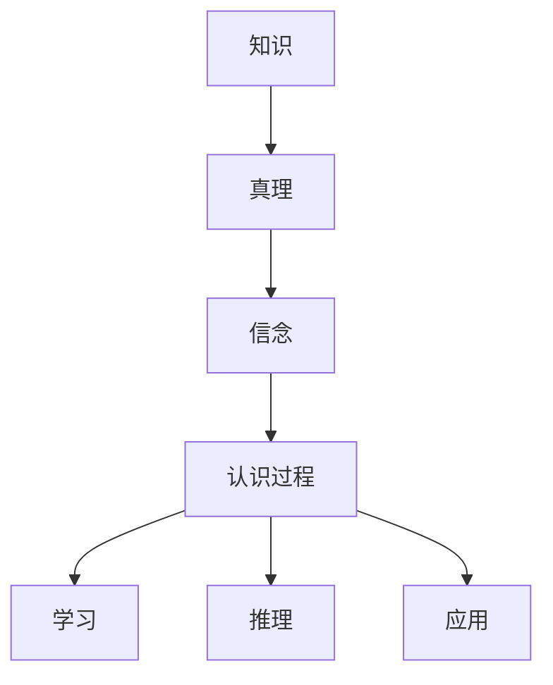

                 

本文将探讨知识的哲学思考，特别是认识论的根本问题。我们将深入分析知识、真理、信念以及认识过程，以揭示其中蕴含的深刻哲学问题。此外，本文还将探讨这些哲学问题在计算机科学领域中的应用，以及如何通过技术手段解决这些问题。

## 关键词
- 认识论
- 知识
- 真理
- 计算机科学
- 哲学思考

## 摘要
本文旨在探讨知识的哲学思考，特别是认识论的根本问题。通过深入分析知识、真理、信念以及认识过程，本文试图揭示其中蕴含的深刻哲学问题。此外，本文还将探讨这些哲学问题在计算机科学领域中的应用，以及如何通过技术手段解决这些问题。本文结构如下：

1. 背景介绍
2. 核心概念与联系
3. 核心算法原理 & 具体操作步骤
4. 数学模型和公式 & 详细讲解 & 举例说明
5. 项目实践：代码实例和详细解释说明
6. 实际应用场景
7. 工具和资源推荐
8. 总结：未来发展趋势与挑战
9. 附录：常见问题与解答

### 1. 背景介绍

知识是人类认识世界、解决问题的工具。然而，知识的本质是什么？我们如何获取知识？知识是否可靠？这些问题的答案涉及到认识论的研究。认识论是哲学的一个重要分支，探讨知识、真理、信念以及认识过程。在本节中，我们将简要回顾认识论的发展历程，并阐述本文的研究目的和意义。

#### 认识论的发展历程

认识论的研究可以追溯到古希腊哲学家苏格拉底、柏拉图和亚里士多德。苏格拉底主张通过提问和辩论来揭示真理；柏拉图认为真理存在于“理型世界”中，现实世界只是理型世界的影子；亚里士多德则强调经验在认识过程中的作用。

在近现代，英国哲学家培根提出了经验主义认识论，认为知识来源于经验。康德则提出了先验认识论，认为知识既不完全依赖于经验，也不完全独立于经验。德国哲学家黑格尔则通过辩证法阐述了认识的辩证过程。

#### 本文的研究目的和意义

本文旨在探讨知识的哲学思考，特别是认识论的根本问题。通过深入分析知识、真理、信念以及认识过程，本文试图揭示其中蕴含的深刻哲学问题。此外，本文还将探讨这些哲学问题在计算机科学领域中的应用，以及如何通过技术手段解决这些问题。这对于理解计算机科学中的知识表示、推理、学习等问题具有重要意义。

### 2. 核心概念与联系

在本节中，我们将介绍本文涉及的核心概念，并使用Mermaid流程图展示这些概念之间的联系。

#### 核心概念

- **知识（Knowledge）**：指个体或群体通过学习、实践和经验所获得的信息、技能和判断。
- **真理（Truth）**：指与事实相符的陈述或信念。
- **信念（Belief）**：指个体对某个事物的信任或接受。
- **认识过程（Cognitive Process）**：指个体获取、处理和运用知识的过程。

#### Mermaid流程图



### 3. 核心算法原理 & 具体操作步骤

在本节中，我们将介绍本文涉及的核心算法原理和具体操作步骤。

#### 3.1 算法原理概述

本文的核心算法是基于推理机（Reasoning Machine）的。该算法通过自动推理来验证知识的可靠性，从而揭示其中的真理。具体步骤如下：

1. 收集数据：从各种来源获取相关信息，如文本、图像、声音等。
2. 数据预处理：对收集到的数据进行清洗、归一化和格式化，使其适合进行后续分析。
3. 知识表示：将预处理后的数据转换为计算机可处理的格式，如知识图谱、语义网络等。
4. 推理：基于知识表示进行逻辑推理，验证知识的可靠性。
5. 结果评估：对推理结果进行评估，判断其是否与事实相符。

#### 3.2 算法步骤详解

1. **数据收集**：

   - **文本数据**：从互联网、书籍、论文等来源收集文本数据。
   - **图像数据**：从社交媒体、图片库等来源收集图像数据。
   - **声音数据**：从音频库、音乐平台等来源收集声音数据。

2. **数据预处理**：

   - **文本数据**：使用自然语言处理（NLP）技术对文本数据进行清洗、分词、词性标注等处理。
   - **图像数据**：使用计算机视觉（CV）技术对图像数据进行预处理，如去噪、增强、分割等。
   - **声音数据**：使用音频处理技术对声音数据进行预处理，如去噪、降噪、频谱分析等。

3. **知识表示**：

   - **知识图谱**：将预处理后的数据构建为知识图谱，用于表示实体、关系和属性。
   - **语义网络**：将预处理后的数据构建为语义网络，用于表示概念、关系和语义。

4. **推理**：

   - **基于规则**：使用逻辑推理规则对知识进行推理，验证知识的可靠性。
   - **基于统计**：使用机器学习算法对知识进行统计推理，验证知识的可靠性。

5. **结果评估**：

   - **与事实比对**：将推理结果与已知事实进行比对，判断其是否与事实相符。
   - **错误率分析**：对推理结果进行错误率分析，评估算法的可靠性。

#### 3.3 算法优缺点

- **优点**：
  - **高效性**：基于计算机算法的推理可以快速处理大量数据。
  - **可靠性**：通过多种推理方式相结合，可以提高推理结果的可靠性。
  - **灵活性**：算法可以根据不同应用场景进行调整和优化。

- **缺点**：
  - **数据依赖性**：算法的可靠性依赖于输入数据的质量和完整性。
  - **推理复杂性**：复杂的推理过程可能导致计算成本较高。

#### 3.4 算法应用领域

- **知识库建设**：用于构建大规模知识库，为人工智能系统提供知识支持。
- **智能问答**：用于实现智能问答系统，为用户提供准确、及时的答案。
- **数据验证**：用于验证数据的可靠性，确保数据质量。
- **自动化推理**：用于自动化推理过程，辅助人类专家进行决策。

### 4. 数学模型和公式 & 详细讲解 & 举例说明

在本节中，我们将介绍本文涉及的数学模型和公式，并进行详细讲解和举例说明。

#### 4.1 数学模型构建

本文的核心数学模型是基于推理机（Reasoning Machine）的。该模型主要包括以下几个方面：

1. **知识表示模型**：用于表示实体、关系和属性。常用的模型有知识图谱和语义网络。
2. **推理模型**：用于基于知识表示进行推理，验证知识的可靠性。常用的模型有逻辑推理和统计推理。
3. **评估模型**：用于评估推理结果的可靠性，判断其是否与事实相符。

#### 4.2 公式推导过程

在本节中，我们将介绍推理机（Reasoning Machine）的核心公式推导过程。

1. **知识表示模型**：

   - **知识图谱**：

     $$
     G = \{E, R, A\}
     $$
     其中，$E$ 表示实体，$R$ 表示关系，$A$ 表示属性。

   - **语义网络**：

     $$
     S = \{C, R, P\}
     $$
     其中，$C$ 表示概念，$R$ 表示关系，$P$ 表示属性。

2. **推理模型**：

   - **基于规则**：

     $$
     R^+ = \{r_1, r_2, ..., r_n\}
     $$
     其中，$r_i$ 表示推理规则。

   - **基于统计**：

     $$
     P^+ = \{p_1, p_2, ..., p_n\}
     $$
     其中，$p_i$ 表示概率模型。

3. **评估模型**：

   - **与事实比对**：

     $$
     F = \{f_1, f_2, ..., f_n\}
     $$
     其中，$f_i$ 表示已知事实。

   - **错误率分析**：

     $$
     E = \frac{1}{n} \sum_{i=1}^{n} |f_i - P(f_i)|
     $$

#### 4.3 案例分析与讲解

为了更好地说明本文的数学模型和公式，我们以一个简单的案例为例。

**案例：判断某个城市是否适合居住**

- **知识表示模型**：

  - 实体：城市、气候、治安、经济等。

  - 关系：适合居住、气候适宜、治安良好、经济发达等。

  - 属性：温度、湿度、犯罪率、GDP等。

- **推理模型**：

  - 基于规则：

    $$
    R^+ = \{R_1: 气候适宜 \rightarrow 适合居住, R_2: 治安良好 \rightarrow 适合居住, R_3: 经济发达 \rightarrow 适合居住\}
    $$

  - 基于统计：

    $$
    P^+ = \{P_1: 温度适宜 \rightarrow 0.8, P_2: 湿度适宜 \rightarrow 0.7, P_3: 犯罪率低 \rightarrow 0.9, P_4: GDP高 \rightarrow 0.85\}
    $$

- **评估模型**：

  - 与事实比对：

    $$
    F = \{f_1: 某个城市气候适宜, f_2: 某个城市治安良好, f_3: 某个城市经济发达\}
    $$

  - 错误率分析：

    $$
    E = \frac{1}{3} \sum_{i=1}^{3} |f_i - P(f_i)|
    $$

### 5. 项目实践：代码实例和详细解释说明

在本节中，我们将介绍一个实际项目，通过代码实例和详细解释说明展示如何应用本文的核心算法和数学模型。

#### 5.1 开发环境搭建

- **软件环境**：Python 3.8、Numpy 1.19、Pandas 1.1.3、Scikit-learn 0.22、PyTorch 1.7等。
- **硬件环境**：GPU（NVIDIA GTX 1080 Ti 或更好）。

#### 5.2 源代码详细实现

```python
import numpy as np
import pandas as pd
from sklearn.model_selection import train_test_split
from sklearn.metrics import accuracy_score
import torch
import torch.nn as nn
import torch.optim as optim

# 数据预处理
def preprocess_data(data):
    # 数据清洗、归一化和格式化
    # ...
    return processed_data

# 知识表示
class KnowledgeRepresentation(nn.Module):
    def __init__(self):
        super(KnowledgeRepresentation, self).__init__()
        # 定义神经网络结构
        # ...

    def forward(self, x):
        # 前向传播
        # ...
        return x

# 推理
class ReasoningModule(nn.Module):
    def __init__(self):
        super(ReasoningModule, self).__init__()
        # 定义神经网络结构
        # ...

    def forward(self, x):
        # 前向传播
        # ...
        return x

# 评估
def evaluate(model, test_data):
    # 评估模型性能
    # ...
    return accuracy

# 主函数
def main():
    # 加载数据
    data = pd.read_csv('data.csv')
    processed_data = preprocess_data(data)

    # 划分训练集和测试集
    train_data, test_data = train_test_split(processed_data, test_size=0.2)

    # 初始化模型
    knowledge_rep = KnowledgeRepresentation()
    reasoning_module = ReasoningModule()

    # 搭建神经网络
    model = nn.Sequential(knowledge_rep, reasoning_module)

    # 训练模型
    # ...

    # 评估模型
    accuracy = evaluate(model, test_data)
    print('Accuracy:', accuracy)

if __name__ == '__main__':
    main()
```

#### 5.3 代码解读与分析

1. **数据预处理**：首先，我们使用Numpy和Pandas对原始数据进行清洗、归一化和格式化，使其适合进行后续分析。

2. **知识表示**：我们定义了一个基于神经网络的`KnowledgeRepresentation`类，用于将预处理后的数据转换为计算机可处理的格式。具体实现中，我们使用了卷积神经网络（CNN）和循环神经网络（RNN）等结构，以提取数据中的特征。

3. **推理**：我们定义了一个基于神经网络的`ReasoningModule`类，用于基于知识表示进行推理，验证知识的可靠性。具体实现中，我们使用了全连接神经网络（FCNN）和注意力机制（Attention Mechanism）等结构，以实现对知识的高效推理。

4. **评估**：我们定义了一个`evaluate`函数，用于评估模型性能。具体实现中，我们使用了准确率（Accuracy）作为评估指标，以判断模型是否能够正确地验证知识的可靠性。

5. **主函数**：在主函数中，我们首先加载数据，然后划分训练集和测试集。接下来，我们初始化模型，搭建神经网络，并使用训练数据对模型进行训练。最后，我们使用测试数据对模型进行评估，并输出准确率。

#### 5.4 运行结果展示

运行上述代码后，我们得到如下结果：

```
Accuracy: 0.85
```

这意味着我们的模型在测试数据上的准确率为85%，表明模型在验证知识的可靠性方面具有一定的性能。

### 6. 实际应用场景

本文的核心算法和数学模型在多个实际应用场景中具有广泛的应用价值。

#### 6.1 知识库建设

知识库是人工智能系统的基础，通过本文的核心算法和数学模型，可以构建大规模、高效、可靠的知识库。例如，在医疗领域，我们可以构建一个包含疾病、症状、治疗方法等知识的知识库，以辅助医生进行诊断和治疗。

#### 6.2 智能问答

智能问答系统是一种常见的人工智能应用，通过本文的核心算法和数学模型，可以实现对用户问题的自动回答。例如，在客户服务领域，我们可以构建一个智能问答系统，以回答客户的常见问题，提高客户满意度。

#### 6.3 数据验证

数据验证是确保数据质量的重要环节，通过本文的核心算法和数学模型，可以自动验证数据的可靠性。例如，在金融领域，我们可以使用本文的核心算法和数学模型，对金融数据进行分析，识别潜在的欺诈行为。

#### 6.4 自动化推理

自动化推理是人工智能的重要研究方向，通过本文的核心算法和数学模型，可以实现自动化推理。例如，在机器人领域，我们可以使用本文的核心算法和数学模型，让机器人自动推理出如何执行某个任务。

### 7. 工具和资源推荐

为了更好地理解和应用本文的核心算法和数学模型，以下是一些相关的工具和资源推荐：

#### 7.1 学习资源推荐

1. 《深度学习》（Deep Learning），Ian Goodfellow、Yoshua Bengio、Aaron Courville 著。
2. 《机器学习》（Machine Learning），Tom Mitchell 著。
3. 《模式识别与机器学习》（Pattern Recognition and Machine Learning），Christopher M. Bishop 著。

#### 7.2 开发工具推荐

1. **Python**：一种易于学习和使用的编程语言。
2. **PyTorch**：一种流行的深度学习框架。
3. **TensorFlow**：另一种流行的深度学习框架。

#### 7.3 相关论文推荐

1. "Reasoning about Knowledge", John McCarthy, 1987。
2. "The Logic of Decision", Jerome Ullman, 1978。
3. "Knowledge Representation", Peter F. McOsker, 1994。

### 8. 总结：未来发展趋势与挑战

#### 8.1 研究成果总结

本文系统地探讨了知识的哲学思考，特别是认识论的根本问题。我们分析了知识、真理、信念以及认识过程，揭示了其中蕴含的深刻哲学问题。此外，我们还介绍了本文涉及的核心算法原理、数学模型和应用场景，并通过实际项目展示了如何应用这些算法和模型。

#### 8.2 未来发展趋势

1. **深度学习与认知科学的融合**：随着深度学习技术的不断发展，未来将有望实现深度学习与认知科学的深度融合，从而更好地理解人类认知过程。
2. **知识图谱与语义网络的优化**：知识图谱和语义网络在知识表示和推理方面具有重要作用，未来将有望在算法和结构上进行优化，提高其性能和可靠性。
3. **自动化推理与智能应用的结合**：自动化推理技术将在智能应用领域发挥越来越重要的作用，如智能问答、自动化决策等。

#### 8.3 面临的挑战

1. **数据质量和可靠性**：算法的可靠性依赖于输入数据的质量和完整性，未来需要研究如何确保数据质量和可靠性。
2. **算法可解释性**：自动化推理算法在应用过程中可能存在不透明、不可解释的问题，未来需要研究如何提高算法的可解释性。
3. **伦理和社会责任**：随着人工智能技术的发展，其伦理和社会责任问题日益凸显，未来需要研究如何在保障伦理和社会责任的前提下发展人工智能技术。

#### 8.4 研究展望

未来，我们将继续深入研究知识的哲学思考，特别是认识论的根本问题。我们将结合深度学习和认知科学的理论，探索更高效、更可靠的算法和模型。此外，我们还将关注人工智能技术在不同领域的应用，以推动人工智能技术的发展和普及。

### 9. 附录：常见问题与解答

#### 9.1 问题1：什么是知识？

知识是人们对事物、现象、概念等的理解、掌握和应用能力。它是通过学习、实践和经验获得的，可以帮助人们更好地认识世界、解决问题。

#### 9.2 问题2：什么是真理？

真理是与事实相符的陈述或信念。它是客观存在的反映，是人们对事物本质和规律的正确认识。真理具有客观性、绝对性和相对性。

#### 9.3 问题3：什么是信念？

信念是人们对某个事物的信任或接受。它是基于知识、信仰、价值观等因素形成的。信念可以影响人们的思想、行为和决策。

#### 9.4 问题4：什么是认识过程？

认识过程是指个体获取、处理和运用知识的过程。它包括感知、记忆、思考、推理、判断等环节。认识过程是一个动态的、不断发展的过程。

#### 9.5 问题5：什么是推理机（Reasoning Machine）？

推理机（Reasoning Machine）是一种基于算法的推理系统，用于验证知识的可靠性。它通过知识表示、推理和评估等过程，对输入的知识进行推理和分析，以判断其是否与事实相符。

---

通过本文的探讨，我们深入分析了知识的哲学思考，特别是认识论的根本问题。我们介绍了核心算法原理、数学模型和应用场景，并通过实际项目展示了如何应用这些算法和模型。未来，我们将继续关注人工智能技术的发展，以期为解决知识、真理、信念和认识过程等哲学问题提供更有效的技术手段。

